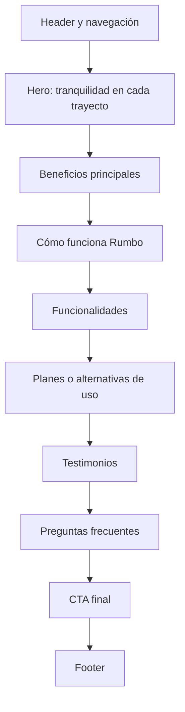
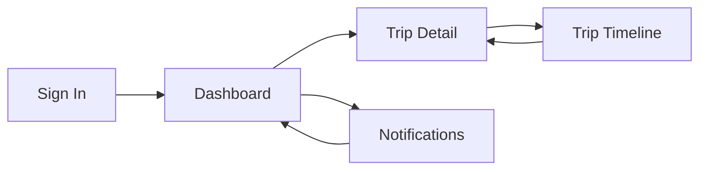
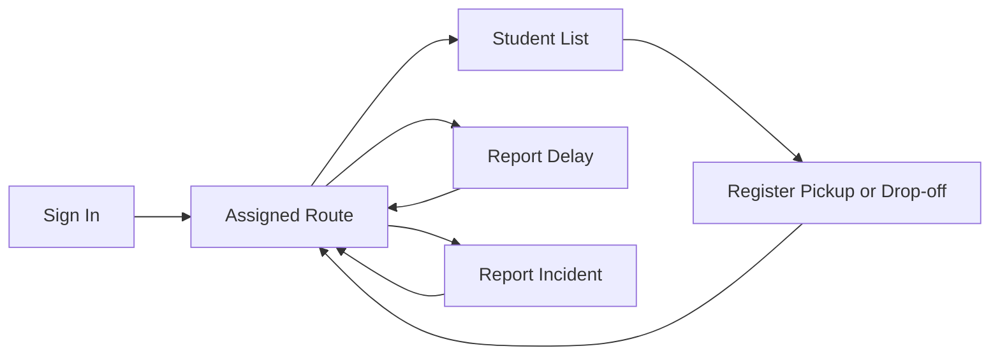
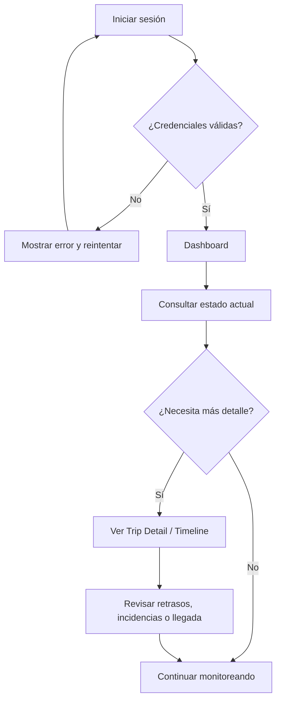
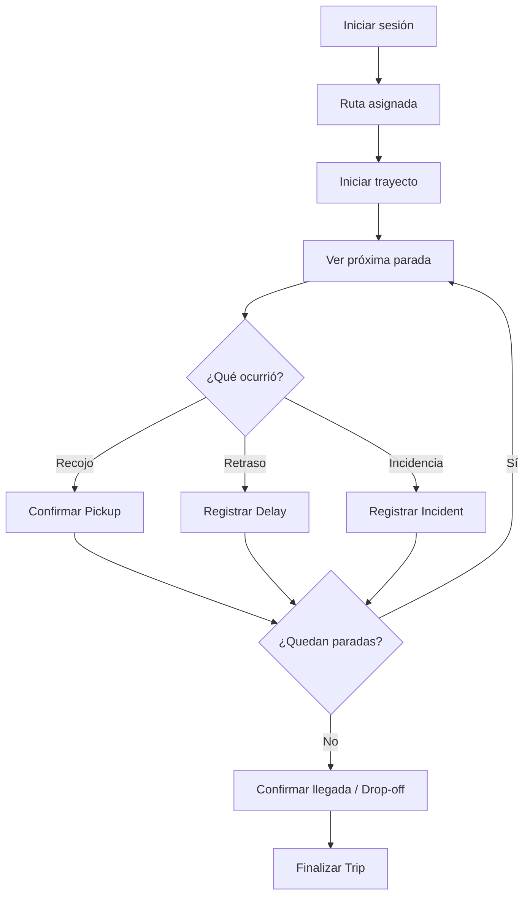
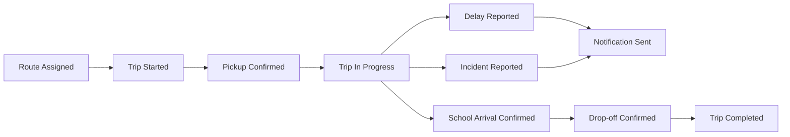

# UNIVERSIDAD PERUANA DE CIENCIAS APLICADAS

### Ingeniería de Software

### Ciclo Académico: 2026-20

### Código: 1ASI0729

### Curso: Desarrollo de Aplicaciones Open Source

### NRC: 7760

### Docente: [Completar]

# Informe de Trabajo Final

### Startup: Rumbo

### Producto: Rumbo

### Integrantes

| Apellidos y Nombres | Código de Alumno |
|---|---|
| Lino Quispe, Leonardo Miguel | U202422298 |
| Barrientos Quispe, Marcelo | U20221e646 |
| Geronimo Puma, Kevin Joel | U202423163 |
| Meza Soza, Alexandra Yamile | U20241b451 |
| [Integrante 5] | [Código 5] |

### SEPTIEMBRE - 2026

---

## Registro de Versiones del Informe

| Versión | Fecha | Autor(es) | Descripción de cambios |
|---|---|---|---|
| 0.1 | 09/09/2026 | linolw | Creación de la estructura base del informe de Rumbo para AV1 del curso Desarrollo de Aplicaciones Open Source. |

---

## Project Report Collaboration Insights

**Organización:** https://github.com/AIpaca-OS  
**Project Report:** https://github.com/AIpaca-OS/project-report  
**Landing Page:** https://github.com/AIpaca-OS/landing-page  
**Frontend Web Application:** https://github.com/AIpaca-OS/frontend-web-application  
**Web Services:** https://github.com/AIpaca-OS/web-services

### AV1

**Team Collaboration Commits**  
[Insertar captura]

**Team Collaboration Network**  
[Insertar captura]

**Contributors / Pull Requests**  
[Insertar capturas]

---

# Contenido

## Tabla de Contenidos

- [Student Outcome](#student-outcome)
- [Capítulo I: Introducción](#capítulo-i-introducción)
  - [1.1. Startup Profile](#11-startup-profile)
    - [1.1.1. Descripción de la Startup](#111-descripción-de-la-startup)
    - [1.1.2. Perfiles de integrantes del equipo](#112-perfiles-de-integrantes-del-equipo)
  - [1.2. Solution Profile](#12-solution-profile)
    - [1.2.1. Antecedentes y problemática](#121-antecedentes-y-problemática)
    - [1.2.2. Lean UX Process](#122-lean-ux-process)
      - [1.2.2.1. Lean UX Problem Statement](#1221-lean-ux-problem-statement)
      - [1.2.2.2. Lean UX Assumptions](#1222-lean-ux-assumptions)
      - [1.2.2.3. Lean UX Hypothesis Statements](#1223-lean-ux-hypothesis-statements)
      - [1.2.2.4. Lean UX Canvas](#1224-lean-ux-canvas)
  - [1.3. Segmentos objetivo](#13-segmentos-objetivo)
- [Capítulo II: Requirements Elicitation & Analysis](#capítulo-ii-requirements-elicitation--analysis)
  - [2.1. Competidores](#21-competidores)
  - [2.2. Entrevistas](#22-entrevistas)
  - [2.3. Needfinding](#23-needfinding)
  - [2.4. Big Picture Event Storming](#24-big-picture-event-storming)
  - [2.5. Ubiquitous Language](#25-ubiquitous-language)
- [Capítulo III: Requirements Specification](#capítulo-iii-requirements-specification)
  - [3.1. User Stories](#31-user-stories)
  - [3.2. Impact Mapping](#32-impact-mapping)
  - [3.3. Product Backlog](#33-product-backlog)
- [Capítulo IV: Product Design](#capítulo-iv-product-design)
  - [4.1. Style Guidelines](#41-style-guidelines)
  - [4.2. Information Architecture](#42-information-architecture)
  - [4.3. Landing Page UI Design](#43-landing-page-ui-design)
  - [4.4. Web Applications UX/UI Design](#44-web-applications-uxui-design)
  - [4.5. Web Applications Prototyping](#45-web-applications-prototyping)
  - [4.6. Domain-Driven Software Architecture](#46-domain-driven-software-architecture)
  - [4.7. Software Object-Oriented Design](#47-software-object-oriented-design)
  - [4.8. Database Design](#48-database-design)
- [Capítulo V: Product Implementation, Validation & Deployment](#capítulo-v-product-implementation-validation--deployment)
  - [5.1. Software Configuration Management](#51-software-configuration-management)
  - [5.2. Landing Page, Services & Applications Implementation](#52-landing-page-services--applications-implementation)
- [Conclusiones](#conclusiones)
- [Bibliografía](#bibliografía)
- [Anexos](#anexos)

---

# Student Outcome

El curso contribuye al cumplimiento del Student Outcome ABET:

**ABET – EAC - Student Outcome 3**  
**Criterio:** Capacidad de comunicarse efectivamente con un rango de audiencias.

En el siguiente cuadro se describen las acciones realizadas y las conclusiones del grupo que permiten sustentar el logro del Student Outcome 3.

| Criterio específico | Acciones realizadas | Conclusiones |
|---|---|---|
| Comunica oralmente con efectividad a diferentes rangos de audiencia. | **[Integrante 1]** — AV1: [acción].   **[Integrante 2]** — AV1: [acción].   **[Integrante 3]** — AV1: [acción].   **[Integrante 4]** — AV1: [acción].   **[Integrante 5]** — AV1: [acción]. | [Conclusión grupal acumulable]. |
| Comunica por escrito con efectividad a diferentes rangos de audiencia. | **[Integrante 1]** — AV1: [acción].   **[Integrante 2]** — AV1: [acción].   **[Integrante 3]** — AV1: [acción].   **[Integrante 4]** — AV1: [acción].   **[Integrante 5]** — AV1: [acción]. | [Conclusión grupal acumulable]. |

---

# Capítulo I: Introducción

## 1.1. Startup Profile

### 1.1.1. Descripción de la Startup

**Rumbo** es una startup peruana orientada a mejorar la coordinación del transporte escolar entre padres o tutores y conductores de movilidad escolar. La propuesta busca centralizar información sobre el estado del traslado, los hitos principales de la ruta, retrasos e incidencias, de modo que las familias puedan comprender rápidamente qué ocurre durante el recorrido y los conductores puedan comunicar eventos relevantes sin repetir la misma información de manera individual.

Rumbo se plantea inicialmente para Lima y Callao. La solución no reemplaza las obligaciones de seguridad, autorización y operación de los prestadores del servicio; busca complementar la experiencia con información organizada, accesible y oportuna.

### 1.1.2. Perfiles de integrantes del equipo

<table>
  <thead>
    <tr><th>Foto</th><th>Apellidos y nombres</th><th>Código</th><th>Carrera</th><th>Habilidades</th></tr>
  </thead>
  <tbody>
    <tr><td>[Foto]</td><td>[Apellidos y nombres]</td><td>[Código]</td><td>Ingeniería de Software</td><td>[Habilidades]</td></tr>
    <tr><td>[Foto]</td><td>[Apellidos y nombres]</td><td>[Código]</td><td>Ingeniería de Software</td><td>[Habilidades]</td></tr>
    <tr><td>[Foto]</td><td>[Apellidos y nombres]</td><td>[Código]</td><td>Ingeniería de Software</td><td>[Habilidades]</td></tr>
    <tr><td>[Foto]</td><td>[Apellidos y nombres]</td><td>[Código]</td><td>Ingeniería de Software</td><td>[Habilidades]</td></tr>
    <tr><td>[Foto]</td><td>[Apellidos y nombres]</td><td>[Código]</td><td>Ingeniería de Software</td><td>[Habilidades]</td></tr>
  </tbody>
</table>

## 1.2. Solution Profile

### 1.2.1. Antecedentes y problemática

El transporte escolar constituye un servicio formal y regulado en Lima y Callao. En enero de 2026, la Autoridad de Transporte Urbano para Lima y Callao (ATU) informó que **3758 vehículos se encontraban habilitados para prestar el servicio de transporte de estudiantes** y recordó que los padres pueden verificar en línea si el vehículo y el conductor están autorizados [1].

El servicio opera en una ciudad con alta congestión. De acuerdo con el **TomTom Traffic Index 2025**, Lima registró un nivel promedio de congestión de **69,3 %**. Un recorrido de 10 km tomó en promedio **43 min 10 s en la hora punta de la mañana** y **51 min 17 s en la tarde**, mientras que el tiempo perdido por tráfico en hora punta se estimó en **195 horas al año** [2]. Esto incrementa la variabilidad de los tiempos de llegada y vuelve relevante disponer de información actualizada sobre el estado de la ruta.

La seguridad vial también forma parte del contexto. El Observatorio Nacional de Seguridad Vial reportó para 2025 **88 243 siniestros de tránsito, 55 329 personas lesionadas y 3428 fallecidas** a nivel nacional [3]. Estas cifras no corresponden exclusivamente a transporte escolar, pero muestran que cualquier servicio de traslado opera en un entorno donde la prevención, la comunicación y la capacidad de reacción ante incidencias son importantes.

Desde el punto de vista tecnológico, una experiencia web responsive es viable para el mercado objetivo. Durante el cuarto trimestre de 2025, el INEI reportó que **98,4 % de los hogares de Lima Metropolitana contaba con telefonía móvil**, **90,3 % de la población de 6 años a más utilizaba Internet** y **91,0 % de los usuarios de Internet de Lima Metropolitana accedía mediante teléfono celular** [4].

A partir de este contexto, Rumbo abordará una necesidad que será contrastada mediante las entrevistas de AV1: **la falta de una vista única y fácil de consultar sobre el estado de la movilidad escolar, sus hitos, retrasos e incidencias**.

#### 5W + 2H

| Dimensión | Análisis |
|---|---|
| **Who? / ¿Quiénes?** | Padres o tutores de menores que utilizan movilidad escolar y conductores de movilidad escolar. |
| **What? / ¿Qué ocurre?** | Los padres necesitan conocer recojo, avance, llegada, retrasos e incidencias; los conductores necesitan comunicar esos eventos de forma ordenada. |
| **Where? / ¿Dónde?** | Lima y Callao, durante rutas entre hogares, puntos de recojo y centros educativos. |
| **When? / ¿Cuándo?** | Antes del recojo, durante el traslado y al momento de la llegada o entrega. |
| **Why? / ¿Por qué importa?** | La congestión genera tiempos variables y el transporte de menores requiere información clara y oportuna. |
| **How? / ¿Cómo se aborda?** | Mediante una plataforma web responsive con estado de ruta, hitos, notificaciones e incidencias. |
| **How much? / ¿Qué magnitud tiene?** | ATU reportó 3758 vehículos escolares habilitados en Lima y Callao; Lima registró 69,3 % de congestión promedio en 2025. |

### 1.2.2. Lean UX Process

#### 1.2.2.1. Lean UX Problem Statement

La coordinación del transporte escolar se desarrolla en un contexto de alta congestión, tiempos variables y comunicación frecuente entre familias y conductores. Los padres necesitan conocer el estado del traslado sin depender exclusivamente de mensajes individuales; los conductores necesitan comunicar cambios, retrasos e incidencias de manera más eficiente. Rumbo busca ofrecer una experiencia centralizada que permita consultar el estado de la ruta y sus principales eventos.

#### 1.2.2.2. Lean UX Assumptions

**Supuestos de negocio**
- Existe una necesidad recurrente de mejorar la comunicación durante las rutas escolares.
- Los padres valorarán una vista resumida del estado de la movilidad y sus eventos.
- Los conductores valorarán reducir mensajes repetitivos a distintas familias.

**Supuestos de resultados de negocio**
- La centralización de información puede reducir consultas repetitivas al conductor.
- Una experiencia clara y móvil puede aumentar la frecuencia de consulta de los padres.
- La visibilidad de retrasos e incidencias puede mejorar la percepción de organización del servicio.

**Supuestos de usuario**
- Los padres consultan principalmente desde el celular.
- Los conductores necesitan registrar eventos con la menor cantidad posible de pasos.
- Ambos segmentos requieren mensajes simples y comprensibles.

**Supuestos de resultados y beneficios del usuario**
- Los padres podrán comprender el estado del traslado sin iniciar una conversación cada vez.
- Los conductores podrán informar a varias familias mediante un solo registro de evento.
- Ambos segmentos podrán consultar un historial básico de hitos del recorrido.

**Supuestos de funcionalidades**
- Estado actual del traslado.
- Línea de tiempo del trayecto.
- Registro de retrasos.
- Registro de incidencias.
- Notificaciones de hitos relevantes.
- Vista responsive optimizada para dispositivos móviles.

#### 1.2.2.3. Lean UX Hypothesis Statements

1. Creemos que ofrecer una **vista del estado actual** a padres y tutores permitirá reducir la necesidad de consultas repetitivas al conductor.
2. Creemos que una **línea de tiempo del trayecto** permitirá a las familias comprender mejor los hitos ya ocurridos durante la ruta.
3. Creemos que permitir al conductor **registrar retrasos** facilitará comunicar cambios de horario a varias familias de forma consistente.
4. Creemos que permitir al conductor **registrar incidencias** mejorará la claridad con la que se comunican eventos excepcionales.
5. Creemos que las **notificaciones de hitos** ayudarán a los padres a mantenerse informados sin revisar constantemente la aplicación.
6. Creemos que una experiencia **responsive y mobile-first** facilitará el uso durante los momentos de recojo y traslado.

#### 1.2.2.4. Lean UX Canvas

**UXPressia:** [Insertar captura y URL del Lean UX Canvas]

## 1.3. Segmentos objetivo

### Segmento 1: Padres y tutores
Personas responsables de menores que utilizan movilidad escolar y que necesitan información clara sobre el estado del traslado, retrasos, llegada e incidencias.

### Segmento 2: Conductores de movilidad escolar
Conductores que trasladan estudiantes y necesitan comunicar de forma ordenada eventos relevantes de la ruta a las familias asociadas.

---

# Capítulo II: Requirements Elicitation & Analysis

## 2.1. Competidores

### 2.1.1. Análisis competitivo

Se analizarán al menos tres soluciones reales relacionadas con seguimiento de transporte, movilidad o comunicación entre operadores y familias. El análisis deberá incluir propuesta de valor, público objetivo, fortalezas, debilidades, funcionalidades y evidencia de fuentes consultadas.

| Competidor | Público objetivo | Funcionalidades relevantes | Fortalezas | Debilidades | Fuente |
|---|---|---|---|---|---|
| [Competidor 1] | [Completar] | [Completar] | [Completar] | [Completar] | [URL] |
| [Competidor 2] | [Completar] | [Completar] | [Completar] | [Completar] | [URL] |
| [Competidor 3] | [Completar] | [Completar] | [Completar] | [Completar] | [URL] |

### 2.1.2. Estrategias y tácticas frente a competidores

Rumbo buscará diferenciarse por una experiencia enfocada específicamente en la comunicación del trayecto escolar entre padres/tutores y conductores, priorizando estado actual, hitos, retrasos e incidencias con una experiencia simple y responsive.

## 2.2. Entrevistas

### 2.2.1. Diseño de entrevistas

Se realizarán **6 entrevistas en total: 3 a padres/tutores y 3 a conductores**, cumpliendo el mínimo de tres entrevistas por segmento.

**Preguntas para padres/tutores**
1. ¿Cómo se informa actualmente sobre el recojo y la llegada de la movilidad?
2. ¿Qué información necesita con mayor frecuencia durante el trayecto?
3. ¿Qué ocurre cuando la movilidad se retrasa?
4. ¿Cómo se entera de una incidencia o cambio inesperado?
5. ¿Qué información le gustaría consultar sin tener que escribir o llamar al conductor?
6. ¿Qué tan útil sería ver una línea de tiempo con los principales eventos de la ruta?

**Preguntas para conductores**
1. ¿Cómo comunica actualmente recojos, retrasos, llegadas e incidencias?
2. ¿Qué tipo de mensajes recibe con mayor frecuencia de los padres?
3. ¿Qué información suele repetirse a varias familias?
4. ¿Qué situaciones hacen más difícil mantener informadas a las familias?
5. ¿Qué eventos considera importante registrar durante una ruta?
6. ¿Qué tendría que tener una herramienta para que no distraiga durante la conducción?

### 2.2.2. Registro de entrevistas

| ID | Segmento | Nombre | Edad | Distrito | Evidencia | URL Microsoft Stream | Timing / duración | Resumen |
|---|---|---|---:|---|---|---|---|---|
| P-01 | Padre/Tutor | [Completar] | [ ] | [ ] | [Captura] | [URL] | [ ] | [ ] |
| P-02 | Padre/Tutor | [Completar] | [ ] | [ ] | [Captura] | [URL] | [ ] | [ ] |
| P-03 | Padre/Tutor | [Completar] | [ ] | [ ] | [Captura] | [URL] | [ ] | [ ] |
| C-01 | Conductor | [Completar] | [ ] | [ ] | [Captura] | [URL] | [ ] | [ ] |
| C-02 | Conductor | [Completar] | [ ] | [ ] | [Captura] | [URL] | [ ] | [ ] |
| C-03 | Conductor | [Completar] | [ ] | [ ] | [Captura] | [URL] | [ ] | [ ] |

### 2.2.3. Análisis de entrevistas

[Completar después de realizar las seis entrevistas. Incluir hallazgos, patrones, porcentajes cuando corresponda y diferencias entre ambos segmentos.]

## 2.3. Needfinding

### 2.3.1. User Personas
- **User Persona — Padre/Tutor:** [Insertar captura y URL de UXPressia].
- **User Persona — Conductor:** [Insertar captura y URL de UXPressia].

### 2.3.2. User Task Matrix
[Insertar matriz comparando tareas, frecuencia e importancia para ambos segmentos.]

### 2.3.3. User Journey Mapping
- **As-Is Journey Map — Padre/Tutor:** [Insertar captura y URL].
- **As-Is Journey Map — Conductor:** [Insertar captura y URL].

### 2.3.4. Empathy Mapping
- **Empathy Map — Padre/Tutor:** [Insertar captura y URL].
- **Empathy Map — Conductor:** [Insertar captura y URL].

## 2.4. Big Picture Event Storming

[Insertar captura y enlace de FigJam/LucidChart/Miro].

Eventos preliminares del dominio a validar: `Trip Scheduled`, `Student Assigned`, `Pickup Confirmed`, `Trip Started`, `Delay Reported`, `Incident Reported`, `School Arrival Confirmed`, `Drop-off Confirmed`, `Trip Completed` y `Notification Sent`.

## 2.5. Ubiquitous Language

| Término | Definición |
|---|---|
| **Student** | Menor asociado a un servicio de transporte escolar. |
| **Parent/Tutor** | Persona responsable que consulta información del traslado. |
| **Driver** | Conductor responsable de ejecutar una ruta escolar. |
| **Vehicle** | Unidad utilizada para realizar el servicio de transporte. |
| **School Transport Service** | Servicio de traslado de estudiantes entre puntos definidos y el centro educativo. |
| **Route** | Recorrido planificado que agrupa puntos de recojo y entrega. |
| **Trip** | Ejecución concreta de una ruta en una fecha y horario determinados. |
| **Stop** | Punto programado dentro de una ruta. |
| **Pickup** | Evento que confirma el recojo de un estudiante. |
| **Drop-off** | Evento que confirma la entrega o llegada del estudiante a su destino. |
| **Assigned Student** | Estudiante vinculado a una ruta o viaje específico. |
| **Trip Status** | Estado actual del viaje. |
| **Route Event** | Evento registrado durante la ejecución de la ruta. |
| **Delay** | Retraso reportado respecto del horario previsto. |
| **Incident** | Situación excepcional registrada durante el traslado. |
| **Notification** | Mensaje generado para comunicar un evento relevante. |
| **ETA** | Estimated Time of Arrival; estimación de hora de llegada. |
| **Trip Timeline** | Secuencia cronológica de eventos registrados durante el viaje. |
| **School Arrival** | Confirmación de llegada al centro educativo. |
| **Route Completion** | Confirmación de que la ruta terminó. |
| **Authorized User** | Usuario con permisos válidos para consultar o registrar información. |
| **Current Status** | Resumen del estado más reciente del viaje. |
| **Route Assignment** | Relación entre conductor, vehículo, estudiantes y ruta. |
| **Event Timestamp** | Fecha y hora asociadas a un evento. |
| **Emergency Contact** | Información de contacto definida para situaciones que requieran comunicación directa. |

---

# Capítulo III: Requirements Specification

## 3.1. User Stories

### Epics
- **EP01 — Gestión de usuarios y acceso.**
- **EP02 — Gestión de rutas y viajes escolares.**
- **EP03 — Seguimiento de estado y línea de tiempo.**
- **EP04 — Comunicación de retrasos e incidencias.**
- **EP05 — Landing Page e información pública.**

### User Stories iniciales

| ID | Epic | User Story | Story Points |
|---|---|---|---:|
| US01 | EP03 | Como padre/tutor, deseo consultar el estado actual del viaje para saber en qué etapa se encuentra la ruta. | 5 |
| US02 | EP03 | Como padre/tutor, deseo revisar la línea de tiempo del trayecto para conocer los eventos ya registrados. | 5 |
| US03 | EP04 | Como padre/tutor, deseo visualizar retrasos reportados para anticipar cambios en la hora de llegada. | 3 |
| US04 | EP04 | Como padre/tutor, deseo recibir información sobre incidencias para comprender situaciones excepcionales. | 5 |
| US05 | EP02 | Como conductor, deseo visualizar los estudiantes asignados a una ruta para organizar el recorrido. | 5 |
| US06 | EP02 | Como conductor, deseo registrar hitos del trayecto para mantener actualizada la información de la ruta. | 5 |
| US07 | EP04 | Como conductor, deseo registrar un retraso para comunicarlo a las familias vinculadas. | 3 |
| US08 | EP04 | Como conductor, deseo registrar una incidencia para dejar constancia y comunicar el evento. | 5 |
| US09 | EP05 | Como visitante, deseo conocer la propuesta de valor de Rumbo para comprender el producto. | 2 |
| US10 | EP05 | Como visitante, deseo conocer los beneficios para padres y conductores para identificar si el producto responde a mis necesidades. | 2 |
| US11 | EP05 | Como visitante, deseo cambiar entre inglés y español para consultar el contenido en un idioma disponible. | 3 |
| US12 | EP05 | Como visitante, deseo acceder a términos y condiciones desde el footer para conocer las reglas del servicio. | 2 |

### Criterios de aceptación de ejemplo

**US01 — Consultar estado actual**
- **Dado** que el padre/tutor tiene acceso a un viaje vigente, **cuando** ingresa a la vista del traslado, **entonces** el sistema muestra el estado actual y la hora del último evento registrado.

**US07 — Registrar retraso**
- **Dado** que el conductor tiene una ruta activa, **cuando** registra un retraso con una descripción válida, **entonces** el evento se incorpora a la línea de tiempo y queda disponible para los padres vinculados.

## 3.2. Impact Mapping

[Insertar captura y URL del Impact Map elaborado en UXPressia.]

Estructura esperada: **Goal → Actor → Impact → Deliverable → User Story**.

## 3.3. Product Backlog

| Orden | ID | Título | Story Points |
|---:|---|---|---:|
| 1 | US09 | Presentar propuesta de valor en Landing Page | 2 |
| 2 | US10 | Presentar beneficios por segmento | 2 |
| 3 | US11 | Soportar inglés y español en Landing Page | 3 |
| 4 | US12 | Acceso a términos y condiciones | 2 |
| 5 | US01 | Consultar estado actual | 5 |
| 6 | US02 | Consultar línea de tiempo | 5 |
| 7 | US07 | Registrar retraso | 3 |
| 8 | US08 | Registrar incidencia | 5 |
| 9 | US05 | Consultar estudiantes asignados | 5 |
| 10 | US06 | Registrar hitos del trayecto | 5 |
| 11 | US03 | Visualizar retrasos | 3 |
| 12 | US04 | Visualizar incidencias | 5 |

---

# Capítulo IV: Product Design

## 4.1. Style Guidelines
Para mantener coherencia entre la Landing Page y la aplicación web de Rumbo, definimos una guía de estilos basada en tokens visuales que priorizan la legibilidad, la calma para las familias y el contraste para los conductores.

### 4.1.1. General Style Guidelines
**Nombre:** Rumbo.
**Propósito:** Brindar tranquilidad y control en los traslados escolares diarios en Lima y Callao, reduciendo la incertidumbre de los padres mediante seguimiento pasivo y facilitando la labor del conductor sin generar distracciones al volante.
**Logotipo:** Compuesto por un isotipo representativo de ruta y protección (`brand-mark`) acompañado del nombre Rumbo con peso tipográfico destacado (`font-weight: 800`). Se debe mantener siempre un área libre alrededor del logo y evitar deformaciones en su escala.

**2. Paleta de Colores**
Tomamos como base las variables CSS implementadas en la Landing Page, organizadas según su rol en la interfaz:

| Variable CSS | Color | HEX | Uso en la plataforma |
|---|---|:---:|---|
| `--azul-oscuro` | Deep Slate | `#0E2A28` | Títulos principales (H1, H2, H3), textos de botones y sombras. |
| `--azul` | Azul Confianza | `#12403D` | Fondo del footer y contenedor de estadísticas. |
| `--verde` | Verde Movimiento | `#3EA98A` | Botones primarios (CTA), confirmación de paradas y foco accesible. |
| `--verde-suave` | Menta Suave | `#DCEFE7` | Fondos de secciones alternas y bordes de hitos de ruta. |
| `--arena` | Arena Calidez | `#F3D9A4` | Números de métricas, badges y puntos de la línea de tiempo. |
| `--gris` | Gris Equilibrio | `#B9C2C2` | Bordes de campos de texto e inputs de formularios. |
| `--crema` | Crema Superficie | `#FBFAF6` | Fondo principal de la web y barra de navegación superior. |
| `--blanco` | Blanco Puro | `#FFFFFF` | Tarjetas de notificación, modales y campos de entrada. |
| `--texto` | Petróleo Oscuro | `#16302E` | Color estándar para párrafos y textos de lectura. |
| `--texto-suave` | Salvia Textual | `#4B615E` | Subtítulos, descripciones secundarias y notas de apoyo. |

**3. Tipografía**
Utilizamos dos familias tipográficas complementarias:
* **Títulos y encabezados (`--font-display`):** `"Baloo 2", ui-rounded, sans-serif`. Sus trazos redondeados transmiten cercanía y calidez para un servicio orientado a familias. Se usa en H1, H2 y H3 con peso 700.
* **Cuerpo de texto e interfaz (`--font-body`):** `"Inter", system-ui, sans-serif`. Ofrece alta legibilidad en pantallas móviles y paneles de datos densos. Se aplica en párrafos (tamaño base de 16px con interlineado de 1.55) y en controles interactivos.

**4. Espaciado y Formas**
* **Bordes redondeados:** Aplicamos bordes suaves para una estética amigable: `--radius` (18px) para tarjetas estructurales, `--radius-sm` (10px) para inputs y notificaciones, y bordes redondeados completos (999px) para los botones de acción.
* **Ancho de contenedor:** El contenido se centraliza en un ancho máximo de 1160px con márgenes laterales de 24px en escritorio y 18px en dispositivos móviles.

**5. Tono de Comunicación**
**Serio pero accesible:** Tratamos la seguridad y custodia de escolares con formalidad, pero sin usar un lenguaje excesivamente técnico o frío.
**Respetuoso y claro:** Notificamos los estados de ruta de forma directa (*"El escolar ha abordado la unidad"* o *"Retraso reportado por congestión"*), priorizando la certeza sobre mensajes ambiguos.

  
### 4.1.2. Web Style Guidelines
La experiencia web se diseñará con enfoque responsive, accesible y consistente. Se considerarán los idiomas `en_US` y `es_419`, con inglés como idioma por defecto de la experiencia del producto, y se incluirán atributos ARIA cuando corresponda.

## 4.2. Information Architecture

### 4.2.1. Organization Systems
En Rumbo organizamos la información pensando en dos necesidades: que los padres sigan el viaje de sus hijos sin confusión y que los conductores registren las paradas de forma rápida.

1. Jerárquica: En la pantalla del padre, lo primero que se ve arriba es el estado del viaje y el mapa con el carro en movimiento. Más abajo aparecen los datos secundarios como la placa, el nombre del chofer y el tiempo estimado de llegada. En la landing page se aplica igual: primero el mensaje principal, luego las ventajas del servicio y al final el formulario de contacto.

2. Secuencial: El conductor sigue un orden paso a paso durante el turno: marcar inicio de ruta, confirmar el recojo de cada niño en su parada, reportar retrasos si hay tráfico y marcar la llegada al colegio. El registro de nuevos usuarios también sigue pasos ordenados de inicio a fin.

3. Matricial: Se usa en la lista de alumnos del chofer, donde en una sola tabla se cruza el nombre de cada niño con su orden de parada, dirección, estado de asistencia y teléfono de emergencia.

 Esquemas de categorización

1. Por audiencia: Los padres solo ven la ruta en vivo, las alertas de llegada y sus pagos. Los conductores ven la lista de paradas del día y los botones para avisar demoras. El administrador ve la lista general de usuarios y revisiones del sistema.

2. Cronológica: Se usa en la línea de tiempo del viaje para mostrar cada suceso por hora exacta, como la salida del vehículo, la subida del escolar y la llegada a la escuela. También ordena el historial de viajes pasados por fecha.

3. Por tópicos: Las opciones se agrupan por temas dentro del menú: Datos del estudiante, Dirección y paradas, Notificaciones y Facturación.

4. Alfabética: La lista general de estudiantes se ordena por apellido de la A a la Z para buscar rápido a un alumno en caso de emergencia.

### 4.2.2. Labeling Systems
[Completar etiquetas y términos visibles para los usuarios.]

### 4.2.3. SEO Tags and Meta Tags
[Completar title, description, Open Graph y metadatos relevantes de la Landing Page.]

### 4.2.4. Searching Systems
Para AV1 no se plantea un buscador general en la Landing Page. En la Web Application se evaluará búsqueda solo cuando exista una necesidad real derivada de los flujos de usuario.

### 4.2.5. Navigation Systems
[Completar navegación de Landing Page y navegación preliminar de Web Application.]

## 4.3. Landing Page UI Design

### 4.3.1. Landing Page Wireframe

El wireframe de la Landing Page organiza el contenido de forma secuencial para explicar la propuesta de Rumbo antes de llevar al usuario a una acción. La estructura toma como base el diseño trabajado en Figma y mantiene la misma jerarquía para Desktop y Mobile.

En Desktop se utiliza una distribución amplia, con bloques en dos y tres columnas cuando el contenido lo permite. En Mobile los componentes se apilan en una sola columna, la navegación se transforma en menú desplegable y los botones principales ocupan mayor ancho para facilitar la interacción táctil.

### 4.3.2. Landing Page Mock-up

El mock-up de alta fidelidad mantiene una estética limpia, con fondos claros, tipografía de alto contraste, tarjetas redondeadas y CTAs destacados. Las referencias trabajadas en Figma muestran como eje visual un hero con la propuesta **“Tranquilidad en cada trayecto”**, acompañado por una vista del seguimiento de la movilidad.

| Sección | Decisión de diseño |
|---|---|
| Hero | Mensaje principal, breve descripción, CTA y representación visual del seguimiento. |
| Beneficios | Tarjetas para monitoreo, alertas y comunicación. |
| Cómo funciona | Proceso resumido en pasos consecutivos. |
| Funcionalidades | Bloques visuales para seguimiento, incidencias, notificaciones y control de ruta. |
| Planes | Tarjetas comparables con CTA diferenciado. |
| Testimonios | Opiniones breves para reforzar confianza. |
| FAQ | Acordeones con dudas frecuentes sobre seguridad y funcionamiento. |
| CTA y footer | Cierre de conversión y accesos informativos. |

El mock-up conserva el sistema visual de Rumbo definido en 4.1: tonos verdes y oscuros para confianza y seguridad, superficies claras para lectura y componentes simples que pueden reutilizarse posteriormente en la Web Application.

## 4.4. Web Applications UX/UI Design

El diseño de la Web Application considera dos experiencias principales: **padres/tutores** y **conductores**. En ambos casos se prioriza la información del trayecto, pero las acciones disponibles cambian según el rol. Los padres consultan; los conductores registran eventos de la ruta con la menor cantidad posible de pasos.

### 4.4.1. Web Applications Wireframes

Los wireframes se definieron a partir de las tareas centrales de cada segmento.

| Rol | Vista | Contenido principal |
|---|---|---|
| Padre/Tutor | Sign In | Correo, contraseña y recuperación de acceso. |
| Padre/Tutor | Dashboard | Estado actual, estudiante, conductor, vehículo y ETA. |
| Padre/Tutor | Trip Detail | Mapa o progreso de ruta y datos del trayecto. |
| Padre/Tutor | Trip Timeline | Recojo, retrasos, incidencias y llegada en orden cronológico. |
| Padre/Tutor | Notifications | Avisos relevantes asociados al estudiante. |
| Conductor | Sign In | Acceso seguro al panel de ruta. |
| Conductor | Assigned Route | Ruta activa, horario, paradas y estudiantes asignados. |
| Conductor | Student List | Estado de recojo o entrega de cada estudiante. |
| Conductor | Register Event | Confirmación rápida de recojo, llegada o entrega. |
| Conductor | Report Incident | Tipo de incidencia, descripción breve y registro del evento. |

La prioridad del wireframe es que la vista principal responda rápidamente a dos preguntas: **“¿qué está pasando en el trayecto?”** para la familia y **“¿qué debo registrar ahora?”** para el conductor.

### 4.4.2. Web Applications Wireflow Diagrams

#### Wireflow — Padre/Tutor

El padre ingresa al Dashboard y desde allí puede revisar el estado actual, abrir el detalle del viaje, consultar el historial de eventos o revisar las notificaciones asociadas.

#### Wireflow — Conductor

El conductor mantiene como punto central la ruta asignada. Las acciones de recojo, entrega, retraso e incidencia regresan al mismo panel para evitar navegación innecesaria durante la jornada.

### 4.4.2. Web Applications Mock-ups

La propuesta visual de la Web Application reutiliza el lenguaje definido para la Landing Page: fondo claro, tarjetas blancas, verde como color de acción y tonos oscuros para textos y estados principales.

| Vista | Componentes de alta fidelidad |
|---|---|
| Dashboard de padre/tutor | Tarjeta de estudiante, estado del viaje, ETA, conductor, vehículo y acceso al timeline. |
| Trip Detail | Mapa o progreso visual, paradas, estado actual y última actualización. |
| Timeline | Eventos con hora, tipo y estado mediante una línea cronológica. |
| Notifications | Tarjetas de aviso con prioridad y fecha. |
| Assigned Route | Ruta activa, número de estudiantes, próxima parada y acciones rápidas. |
| Student List | Lista con nombre del estudiante y estado pendiente/recogido/entregado. |
| Incident Form | Selector de tipo de incidencia, descripción corta y botón de registro. |

Los controles del conductor se plantean con botones grandes, mensajes breves y confirmaciones visibles. Para padres se prioriza lectura rápida, estado actual y jerarquía visual de alertas.

### 4.4.3. Web Applications User Flow Diagrams

#### User Flow — Padre/Tutor

#### User Flow — Conductor

Los flujos reducen bifurcaciones y evitan acciones largas en el perfil del conductor. Las operaciones críticas se realizan desde la ruta activa y generan un evento que luego puede ser consultado por los padres.

## 4.5. Web Applications Prototyping

El prototipo de Rumbo conecta las vistas principales definidas en los wireflows para validar el recorrido antes de la implementación en Angular. El alcance priorizado para AV1 considera los flujos de consulta del padre/tutor y de registro del conductor.

**Recorrido del padre/tutor:** `Sign In → Dashboard → Trip Detail → Trip Timeline / Notifications`.

**Recorrido del conductor:** `Sign In → Assigned Route → Student List → Register Event / Report Incident → Route Summary`.

Durante la revisión del prototipo se consideran como criterios principales:

- acceso a la información principal en pocos pasos;
- jerarquía clara del estado actual y ETA;
- acciones breves para el conductor;
- confirmación visual después de registrar un evento;
- consistencia con la identidad visual de Rumbo;
- comportamiento responsive para escritorio y dispositivos móviles.

La propuesta visual toma como referencia los mock-ups elaborados en Figma para la Landing Page y extiende el mismo sistema de colores, tipografía, tarjetas y botones hacia la aplicación web.

## 4.6. Domain-Driven Software Architecture

### 4.6.1. Design-Level Event Storming

El Design-Level Event Storming organiza los principales comandos, agregados y eventos del dominio. Para Rumbo se identifican cuatro áreas funcionales: acceso de usuarios, gestión de rutas, ejecución del trayecto y comunicación de incidencias/notificaciones.

| Actor | Command | Aggregate | Domain Event | Resultado / Policy |
|---|---|---|---|---|
| Conductor | `StartTrip` | Trip | `TripStarted` | Habilita el seguimiento del viaje. |
| Conductor | `ConfirmPickup` | Trip | `PickupConfirmed` | Actualiza el timeline y notifica al padre/tutor. |
| Conductor | `ReportDelay` | Trip | `DelayReported` | Actualiza estado y ETA; genera notificación. |
| Conductor | `ReportIncident` | Incident | `IncidentReported` | Registra incidencia y alerta a usuarios vinculados. |
| Conductor | `ConfirmSchoolArrival` | Trip | `SchoolArrivalConfirmed` | Registra llegada al colegio. |
| Conductor | `ConfirmDropOff` | Trip | `DropOffConfirmed` | Registra entrega del estudiante. |
| Conductor | `CompleteTrip` | Trip | `TripCompleted` | Cierra el viaje y conserva su historial. |
| Sistema | `SendNotification` | Notification | `NotificationSent` | Informa el evento relevante al padre/tutor. |

El flujo principal del dominio queda representado de la siguiente manera:

Los eventos `PickupConfirmed`, `DelayReported`, `IncidentReported`, `SchoolArrivalConfirmed` y `DropOffConfirmed` alimentan el **Trip Timeline**. Las notificaciones se generan como consecuencia de eventos relevantes, mientras que `TripCompleted` marca el cierre del recorrido y permite conservar un historial consultable.

### 4.6.2. Software Architecture Context Diagram

### 4.6.3. Software Architecture Container Diagrams

### 4.6.4. Software Architecture Components Diagrams
[Insertar diagramas de componentes por bounded context cuando hayan sido validados.]

## 4.7. Software Object-Oriented Design

### 4.7.1. Class Diagrams
[Insertar diagramas UML de clases por bounded context.]

## 4.8. Database Design

### 4.8.1. Database Diagrams
[Insertar diagramas de base de datos por bounded context, indicando tablas, columnas, primary keys, foreign keys y relaciones.]

---

# Capítulo V: Product Implementation, Validation & Deployment

## 5.1. Software Configuration Management

### 5.1.1. Software Development Environment Configuration

| Producto / herramienta | Uso en el proyecto |
|---|---|
| Git + GitHub | Control de versiones y colaboración. |
| Figma | Wireframes, Mock-ups y Prototypes. |
| UXPressia | User Personas, Empathy Maps, Journey Maps e Impact Maps. |
| FigJam / LucidChart / Miro | EventStorming, Wireflows y User Flows. |
| Structurizr / LucidChart | Diagramas de arquitectura y UML. |
| HTML5 + CSS3 + JavaScript | Implementación de Landing Page. |
| Angular + TypeScript + Angular Material | Frontend Web Application. |
| Spring Boot + Spring Data JPA + Java | RESTful Web Services. |
| OpenAPI Specification + Swagger | Documentación de Web Services. |
| Trello / Jira / YouTrack | Gestión del Product Backlog y Sprint Backlog. |

### 5.1.2. Source Code Management

Repositorios oficiales:
- **Landing Page:** https://github.com/AIpaca-OS/landing-page
- **Frontend Web Application:** https://github.com/AIpaca-OS/frontend-web-application
- **Web Services:** https://github.com/AIpaca-OS/web-services
- **Project Report:** https://github.com/AIpaca-OS/project-report

Se aplicará **GitFlow**, **Conventional Commits** y **Semantic Versioning**. El flujo base será:
- `main`: versiones estables y entregables.
- `develop`: integración del trabajo del equipo.
- `feature/...`: funcionalidades o secciones específicas, creadas cuando inicie el trabajo correspondiente.
- `release/...`: preparación de una versión cuando sea necesario.
- `hotfix/...`: correcciones urgentes sobre una versión estable.

Ejemplos de Conventional Commits: `feat(landing): add hero section`, `docs(report): add interview findings`, `feat(routes): add trip status view`, `fix(api): correct validation response`.

### 5.1.3. Source Code Style Guide & Conventions

**Landing Page**
- HTML semántico.
- CSS organizado y responsive.
- JavaScript modular por responsabilidad.
- Nombres de clases y archivos consistentes en kebab-case cuando corresponda.

**Frontend Web Application**
- Angular con TypeScript.
- Componentes y servicios con responsabilidad clara.
- Convenciones de Angular para nombres de archivos, componentes, servicios y módulos.
- Angular Material para la biblioteca de componentes UI.

**Web Services**
- Java con convenciones de nombres estándar.
- Spring Boot y Spring Data JPA.
- Separación entre dominio, aplicación, infraestructura e interfaces cuando corresponda.
- Documentación OpenAPI/Swagger para los endpoints implementados.

### 5.1.4. Software Deployment Configuration

Para AV1 se documentará y ejecutará el despliegue de la **primera versión de la Landing Page**. La configuración de despliegue del Frontend Web Application y Web Services se documentará progresivamente cuando estos productos entren en el alcance de implementación de los siguientes Sprints.

## 5.2. Landing Page, Services & Applications Implementation

## 5.2.1. Sprint 1

### 5.2.1.1. Sprint Planning 1

**Sprint Goal:** completar la base de investigación, requisitos y diseño de Rumbo, implementar y desplegar la primera versión de la Landing Page y dejar preparados los artefactos de producto exigidos para AV1.

**Duración:** [Completar fechas].

### 5.2.1.2. Aspect Leaders and Collaborators

| Aspecto | Líder | Colaboradores |
|---|---|---|
| Project Report | [Completar] | [Completar] |
| Investigación y entrevistas | [Completar] | Todos |
| Landing Page UX/UI | [Completar] | [Completar] |
| Landing Page Development | [Completar] | [Completar] |
| Requirements & Product Design | [Completar] | [Completar] |
| Deployment & Evidence | [Completar] | [Completar] |

### 5.2.1.3. Sprint Backlog 1

| ID | User Story / Task | Descripción | Responsable | Horas | Estado |
|---|---|---|---|---:|---|
| T01 | Research | Recopilar fuentes y sustentar problemática. | [ ] | 4 | To Do |
| T02 | Interviews | Realizar entrevistas asignadas y registrar evidencias. | Todos | 4-8 | To Do |
| T03 | Landing Wireframes | Elaborar wireframes Desktop/Mobile. | [ ] | 4 | To Do |
| T04 | Landing Mock-ups | Elaborar mock-ups Desktop/Mobile. | [ ] | 4 | To Do |
| T05 | Landing Structure | Implementar estructura HTML y navegación. | [ ] | 6 | To Do |
| T06 | Landing Styles | Implementar estilos responsive. | [ ] | 6 | To Do |
| T07 | Landing Interaction | Implementar JavaScript e i18n inicial. | [ ] | 4 | To Do |
| T08 | Landing Deployment | Desplegar primera versión y registrar evidencia. | [ ] | 4 | To Do |
| T09 | Requirements | Consolidar User Stories y Product Backlog. | [ ] | 6 | To Do |
| T10 | Product Design | Consolidar artefactos de arquitectura y UX/UI. | [ ] | 6-8 | To Do |

### 5.2.1.4. Development Evidence for Sprint Review

[Insertar tabla de repositorio, branch, commit id, commit message y evidencia visual de los avances implementados en el Sprint 1.]

### 5.2.1.5. Execution Evidence for Sprint Review

[Insertar capturas de la Landing Page ejecutándose en Desktop y Mobile, junto con la explicación del flujo validado.]

### 5.2.1.6. Services Documentation Evidence for Sprint Review

En Sprint 1 el alcance de implementación se concentra en la primera versión del Landing Page. Si no se implementan endpoints de Web Services durante este Sprint, se dejará constancia de ello en esta sección y no se inventará documentación de servicios inexistentes.

### 5.2.1.7. Software Deployment Evidence for Sprint Review

[Insertar URL pública de la Landing Page, capturas del proceso de despliegue y explicación de los pasos realizados.]

### 5.2.1.8. Team Collaboration Insights during Sprint

[Insertar capturas de Network Graph, Contributors, commits y Pull Requests del Sprint 1. Todos los integrantes deben evidenciar aportes reales.]

---

# Conclusiones

- La problemática de Rumbo se sustenta en un contexto real de transporte escolar formal, alta congestión urbana y elevada conectividad móvil en Lima Metropolitana.
- Los dos segmentos iniciales del proyecto son padres/tutores y conductores de movilidad escolar; las entrevistas de AV1 permitirán validar o corregir los supuestos planteados.
- Para AV1, la implementación se concentra en la primera versión desplegada del Landing Page, mientras que Angular y Spring Boot quedan definidos como tecnologías para los productos que se desarrollarán progresivamente en los siguientes Sprints.

# Bibliografía

[1] Autoridad de Transporte Urbano para Lima y Callao (ATU). (2026). *Vacaciones útiles seguras: ATU exhorta a padres de familia a usar movilidades escolares autorizadas*. https://www.gob.pe/institucion/atu/noticias/1331042-vacaciones-utiles-seguras-atu-exhorta-a-padres-de-familia-a-usar-movilidades-escolares-autorizadas

[2] TomTom. (2025). *Lima traffic report*. https://www.tomtom.com/traffic-index/city/lima/

[3] Observatorio Nacional de Seguridad Vial. (2025). *Estadísticas de siniestralidad vial*. https://www.onsv.gob.pe/

[4] Instituto Nacional de Estadística e Informática (INEI). (2026). *El 98,4 % de los hogares de Lima Metropolitana contó con telefonía móvil durante el cuarto trimestre de 2025*. https://www.gob.pe/institucion/inei/noticias/1371146-el-98-4-de-los-hogares-de-lima-metropolitana-conto-con-telefonia-movil-durante-el-cuarto-trimestre-de-2025

# Anexos

## Anexo A. Videos de Exposiciones

| Entrega | Video |
|---|---|
| AV1 | [URL Microsoft Stream / Clipchamp] |

## Anexo B. Evidencias complementarias

[Agregar únicamente evidencias necesarias que por extensión no correspondan al cuerpo principal del informe.]
