<div align="center">

# UNIVERSIDAD PERUANA DE CIENCIAS APLICADAS


### Ingeniería de Software

### Ciclo Académico: 2026-20

### Código: 1ASI0729

### Curso: Desarrollo de Aplicaciones Open Source

### NRC: 7760

### Docente: Juan Antonio Flores Moroco

# Informe de Trabajo Final

### Startup: AIpaca

### Producto: Rumbo

### Integrantes

| Apellidos y Nombres | Código de Alumno |
|---|---|
| Díaz Ramírez, Alejandro | U202423084 |
| Geronimo Puma, Kevin Joel | U202423163 |
| Lino Quispe, Leonardo Miguel | U202422298 |
| Meza Soza, Alexandra Yamile | U20241b451 |
| Pareja Caceres, Diana | U202422589 |

### SEPTIEMBRE - 2026

</div>

---

## Registro de Versiones del Informe

| Versión       | Fecha          | Autor(es)                                                                                                                                    | Descripción de cambios                                                                                                                                                                                                                                                                                                        |
| ------------- | -------------- | -------------------------------------------------------------------------------------------------------------------------------------------- | -------------------------------------------------------------------------------------------------------------------------------------------------------------------------------------------------------------------------------------------------------------------------------------------------------------------------------------------------------------------------------------------------------------------------------------------------------------------------------------------------------------------------------------------------------------------------------------------------------------------------------------------------------------------------------------------------------------------------------------------------------------------------------------------------------------------------------------------------------------------------------------------------------------------------------------------------------------------------------------------------------------------------------------------------------------------------------------------------------------------------------------------------------------------------------------------------------------------- |
| **v.01.Avn1** | **16/09/2026** | Díaz Ramírez, Alejandro<br>Geronimo Puma, Kevin Joel<br>Lino Quispe, Leonardo Miguel<br>Meza Soza, Alexandra Yamile<br>Pareja Caceres, Diana | **Carátula**<br>**Registro de Versiones del Informe**<br>**Project Report Collaboration Insights**<br>**Contenido**<br>**Student Outcome**<br>**Capítulo I: Introducción**<br>**Capítulo II: Requirements Elicitation & Analysis**<br>**Capítulo III: Requirements Specification**<br>**Capítulo IV: Product Design**<br>**Capítulo V: Product Implementation, Validation & Deployment**<br>**5.1. Software Configuration Management**<br>**5.1.1. Software Development Environment Configuration**<br>**5.1.2. Source Code Management**<br>**5.1.3. Source Code Style Guide & Conventions**<br>**5.1.4. Software Deployment Configuration**<br>**5.2. Landing Page, Services & Applications Implementation**<br>**5.2.1. Sprint 1**<br>**5.2.1.1. Sprint Planning 1**<br>**5.2.1.2. Aspect Leaders and Collaborators**<br>**5.2.1.3. Sprint Backlog 1**<br>**5.2.1.4. Development Evidence for Sprint Review**<br>**5.2.1.5. Execution Evidence for Sprint Review**<br>**5.2.1.6. Services Documentation Evidence for Sprint Review**<br>**5.2.1.7. Software Deployment Evidence for Sprint Review**<br>**5.2.1.8. Team Collaboration Insights during Sprint**<br>**Avance de Conclusiones, Bibliografía y Anexos** |


---

## Project Report Collaboration Insights

**Organización:** https://github.com/AIpaca-OS  
**Project Report:** https://github.com/AIpaca-OS/project-report  
**Landing Page:** https://github.com/AIpaca-OS/landing-page  
**Frontend Web Application:** https://github.com/AIpaca-OS/frontend-web-application  
**Web Services:** https://github.com/AIpaca-OS/web-services

### AV1

La colaboración se verificó directamente a partir del historial de commits, ramas y Pull Requests de los repositorios de la organización. Las siguientes evidencias consolidan el estado disponible al cierre de esta actualización y mantienen enlaces hacia GitHub para su validación.

**Team Collaboration Commits**

<div align="center">
  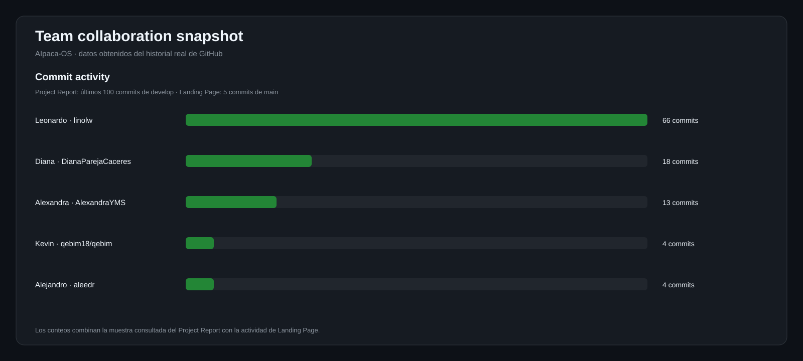
</div>

**Historial verificable:** https://github.com/AIpaca-OS/project-report/commits/develop/  
**Landing Page:** https://github.com/AIpaca-OS/landing-page/commits/main/

**Team Collaboration Network**

<div align="center">
  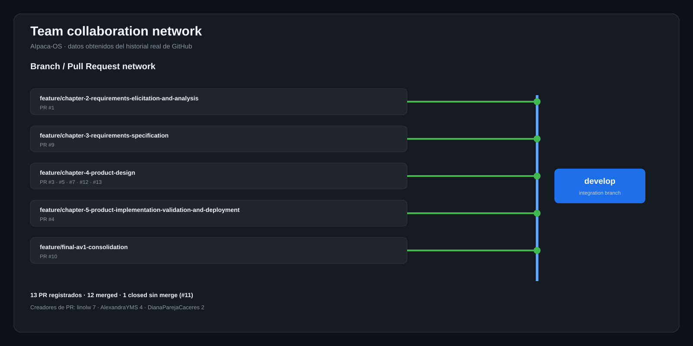
</div>

**Branches:** https://github.com/AIpaca-OS/project-report/branches  
**Network:** https://github.com/AIpaca-OS/project-report/network

La evidencia muestra trabajo mediante ramas por capítulo y consolidaciones sucesivas hacia `develop`. Se registran Pull Requests asociados a Requirements Elicitation, Requirements Specification, Product Design, Product Implementation y consolidación de AV1.

**Contributors / Pull Requests**

<div align="center">
  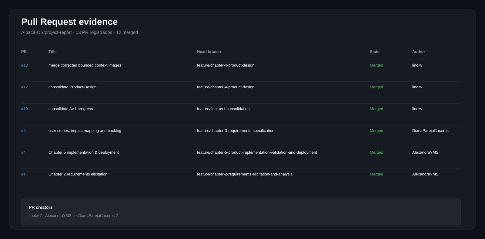
</div>

Hasta esta actualización el Project Report registra **13 Pull Requests**, de los cuales **12 fueron integrados** y uno fue cerrado sin merge. Entre los creadores de Pull Requests figuran `linolw`, `AlexandraYMS` y `DianaParejaCaceres`; el historial de commits también evidencia contribuciones de `aleedr` y `qebim18`.

**Contributors:** https://github.com/AIpaca-OS/project-report/graphs/contributors  
**Pull Requests:** https://github.com/AIpaca-OS/project-report/pulls?q=is%3Apr+is%3Aclosed

---

# Contenido

## Tabla de Contenidos

- [Student Outcome](#student-outcome)
- [Capítulo I: Introducción](#capítulo-i-introducción)
  - [1.1. Startup Profile](#11-startup-profile)
    - [1.1.1. Descripción de la Startup](#111-descripción-de-la-startup)
    - [1.1.2. Perfiles de integrantes del equipo](#112-perfiles-de-integrantes-del-equipo)
  - [1.2. Solution Profile](#12-solution-profile)
    - [1.2.1. Antecedentes y problemática](#121-antecedentes-y-problemática)
    - [1.2.2. Lean UX Process](#122-lean-ux-process)
      - [1.2.2.1. Lean UX Problem Statement](#1221-lean-ux-problem-statement)
      - [1.2.2.2. Lean UX Assumptions](#1222-lean-ux-assumptions)
      - [1.2.2.3. Lean UX Hypothesis Statements](#1223-lean-ux-hypothesis-statements)
      - [1.2.2.4. Lean UX Canvas](#1224-lean-ux-canvas)
  - [1.3. Segmentos objetivo](#13-segmentos-objetivo)
- [Capítulo II: Requirements Elicitation & Analysis](#capítulo-ii-requirements-elicitation--analysis)
  - [2.1. Competidores](#21-competidores)
  - [2.2. Entrevistas](#22-entrevistas)
  - [2.3. Needfinding](#23-needfinding)
  - [2.4. Big Picture Event Storming](#24-big-picture-event-storming)
  - [2.5. Ubiquitous Language](#25-ubiquitous-language)
- [Capítulo III: Requirements Specification](#capítulo-iii-requirements-specification)
- [Capítulo IV: Product Design](#capítulo-iv-product-design)
- [Capítulo V: Product Implementation, Validation & Deployment](#capítulo-v-product-implementation-validation--deployment)
- [Conclusiones](#conclusiones)
- [Bibliografía](#bibliografía)
- [Anexos](#anexos)

---

# Student Outcome

El curso contribuye al cumplimiento del **ABET – EAC – Student Outcome 3: Capacidad de comunicarse efectivamente con un rango de audiencias**.

| Criterio específico | Acciones realizadas | Conclusiones |
|---|---|---|
| Comunica oralmente con efectividad a diferentes rangos de audiencia. | **[Integrantes]** — AV1: [completar con participación real en entrevistas y exposición]. | [Conclusión grupal]. |
| Comunica por escrito con efectividad a diferentes rangos de audiencia. | **[Integrantes]** — AV1: [completar con participación real en informe, artefactos y documentación]. | [Conclusión grupal]. |

---

# Capítulo I: Introducción

## 1.1. Startup Profile

### 1.1.1. Descripción de la Startup

**AIpaca** es una startup tecnológica peruana orientada al desarrollo de soluciones digitales para mejorar la coordinación de servicios cotidianos. Su producto inicial es **Rumbo**, una plataforma enfocada en la coordinación del transporte escolar entre padres o tutores y conductores de movilidad escolar.

Rumbo busca centralizar información sobre el estado del traslado, los principales hitos de la ruta, retrasos e incidencias, de modo que las familias puedan comprender rápidamente qué ocurre durante el recorrido y los conductores puedan comunicar eventos relevantes sin repetir la misma información de manera individual.

La solución se plantea inicialmente para Lima y Callao. No reemplaza las obligaciones de seguridad, autorización y operación de los prestadores del servicio; busca complementar la experiencia con información organizada, accesible y oportuna.

### 1.1.2. Perfiles de integrantes del equipo

<table>
  <thead>
    <tr><th>Foto</th><th>Apellidos y nombres</th><th>Código</th><th>Carrera</th><th>Habilidades</th></tr>
  </thead>
  <tbody>
    <tr><td align="center"></td><td>Diaz Ramirez, Alejandro</td><td>U202423084</td><td>Ingeniería de Software</td><td>Estudiante de Ingeniería de Software de 5.º ciclo, con una base sólida en Python y C++, así como experiencia en prototipado rápido con React Native, lo que me permite aportar en el desarrollo técnico del proyecto, especialmente en la lógica del sistema, la estructuración del código y el procesamiento de datos. También agregar que he trabajado en entornos colaborativos bajo metodologías ágiles, gestionando proyectos y equipos con Scrum para asegurar entregas eficientes y de calidad.</td></tr>
    <tr><td align="center"></td><td>Geronimo Puma, Kevin Joel</td><td>U202423163</td><td>Ingeniería de Software</td><td>Estudiante de Ingeniería de Software de 5.º ciclo, con una base sólida en Python y C++. Mi perfil me permite aportar en el desarrollo técnico del proyecto, destacando por mi facilidad para la arquitectura de software y el diseño de bases de datos, además de la lógica del sistema, la estructuración del código y el procesamiento de datos. Asimismo, tengo experiencia trabajando en entornos colaborativos bajo metodologías ágiles, asegurando siempre entregas eficientes y de calidad.</td></tr>
    <tr><td align="center"></td><td>Lino Quispe, Leonardo Miguel</td><td>U202422298</td><td>Ingeniería de Software</td><td>Soy estudiante de Ingeniería de Software del 5.º ciclo en la UPC. Tengo conocimientos en programación en C++ y Python, y experiencia desarrollando proyectos académicos donde analizo y organizo soluciones tecnológicas. Me gusta enfocarme en aprender de forma práctica y en construir soluciones que sean claras, funcionales y aplicadas a problemas reales.</td></tr>
    <tr><td align="center"></td><td>Meza Soza, Alexandra Yamile</td><td>U20241b451</td><td>Ingeniería de Software</td><td>Soy estudiante de Ingeniería de Software del 6.º ciclo en la UPC. Cuento con conocimientos en el desarrollo de sistemas utilizando los lenguajes Python y C++. Me caracterizo por aprendizaje rápido, criterio para filtrar información relevante y trabajo colaborativo. En el equipo aporto investigación aplicada y prototipos técnicos que conectan los hallazgos con funcionalidades del producto.</td></tr>
    <tr><td align="center"></td><td>Pareja Caceres, Diana</td><td>U202422589</td><td>Ingeniería de Software</td><td>En Rumbo ha participado en análisis competitivo, User Personas, organización de información, lineamientos visuales, diagramas de arquitectura C4 y modelado DDD. Aporta especialmente en documentación, análisis del producto y estructuración de artefactos de diseño y arquitectura.</td></tr>
  </tbody>
</table>

## 1.2. Solution Profile

El **Solution Profile** presenta una descripción general de **Rumbo**, producto desarrollado por AIpaca. Aborda el contexto en el que opera el transporte escolar en Lima y Callao, los problemas detectados en la coordinación entre familias y conductores y las suposiciones estratégicas que guían el desarrollo de la solución. Esta sección conecta el problema identificado con una propuesta de valor concreta y sirve como base para el diseño, la validación y el desarrollo posterior del producto.

### 1.2.1. Antecedentes y problemática

El transporte escolar constituye un servicio formal y regulado en Lima y Callao. En enero de 2026, la Autoridad de Transporte Urbano para Lima y Callao informó que **3758 vehículos se encontraban habilitados para prestar el servicio de transporte de estudiantes** y recordó que los padres pueden verificar digitalmente si el vehículo y el conductor están autorizados (Infobae, 2026). Esta cifra confirma que existe un ecosistema amplio de familias, conductores y operadores que realizan traslados escolares de manera recurrente.

En esta sección se analiza el contexto en el que surge la problemática principal, considerando sus factores sociales, tecnológicos y operativos. Se utiliza la técnica de las **5 W y 2 H** para responder de forma estructurada qué ocurre, quiénes están involucrados, cuándo y dónde sucede, por qué ocurre, cómo se abordará y cuál es una magnitud referencial de la oportunidad y del esfuerzo inicial requerido.

#### Técnica de las 5 W's + 2 H's

**What (¿Qué?) — ¿Cuál es el problema?**  
La coordinación diaria entre padres y conductores sigue dependiendo en gran medida de mensajes y llamadas individuales. Los mecanismos oficiales permiten verificar si un vehículo y un conductor se encuentran autorizados, pero no resuelven la pregunta de qué está pasando durante la ruta. Los padres no cuentan con una vista única donde consultar si el menor ya fue recogido, si la movilidad está retrasada, si llegó al colegio o si ocurrió un imprevisto. Esa información se transmite de forma dispersa y buena parte de ella recae sobre el conductor, que debe responder consultas similares a varias familias mientras cumple su recorrido.

**When (¿Cuándo?) — ¿Cuándo ocurre?**  
El problema ocurre durante los días de clase, principalmente antes del recojo, durante el traslado y al momento de la llegada o entrega. La incertidumbre se intensifica cuando los horarios escolares coinciden con las horas de mayor congestión y un retraso de pocos minutos puede convertirse en una espera prolongada (El Comercio, 2026).

**Where (¿Dónde?) — ¿Dónde surge?**  
El problema se presenta principalmente en Lima Metropolitana y el Callao, en las rutas que conectan hogares, puntos de recojo y centros educativos. El TomTom Traffic Index 2025 reportó para Lima un nivel de congestión de **69,3 %** y alrededor de **195 horas anuales perdidas** en tráfico de hora punta. En 2026, reportes basados en datos de TomTom continuaron mostrando velocidades muy reducidas durante la hora punta matinal (Energiminas, 2026).

**Who (¿Quiénes?) — ¿Quiénes son los afectados?**  
- **Padres y tutores**, que necesitan saber en qué etapa se encuentra el traslado de sus hijos y actualmente dependen con frecuencia de preguntar directamente al conductor.  
- **Conductores de movilidad escolar**, que deben cumplir su ruta en medio del tráfico y, al mismo tiempo, comunicar recojos, retrasos o incidencias a varias familias.

**Why (¿Por qué?) — ¿Por qué ocurre y por qué importa?**  
- **Comunicación fragmentada en canales generales:** la coordinación suele realizarse mediante mensajería instantánea y llamadas. Según ERESTEL 2025, WhatsApp se mantiene como una de las plataformas de comunicación más utilizadas en el país (Expreso, 2026), pero un chat general no fue diseñado para registrar hitos de una ruta.  
- **Alta variabilidad de los tiempos de viaje:** la congestión de Lima hace que la hora estimada de llegada cambie constantemente.  
- **Carga operativa del conductor:** responder consultas durante la ruta compite con su prioridad de conducir de forma segura.  
- **Ausencia de un registro estructurado:** recojos, entregas e incidencias no siempre quedan documentados de manera ordenada.  
- **Verificación sin visibilidad en ruta:** las herramientas oficiales permiten comprobar la formalidad del servicio, pero no muestran el estado de cada traslado.

**How (¿Cómo?) — ¿Cómo se abordará?**  
AIpaca propone Rumbo, una plataforma web responsive orientada al uso móvil que centraliza el estado de cada traslado. Esta decisión es coherente con la alta conectividad de Lima Metropolitana: durante el cuarto trimestre de 2025, el INEI reportó **98,4 % de hogares con telefonía móvil** y **90,3 % de la población de 6 años a más utilizando Internet** (INEI, 2026).

Para los padres y tutores, la plataforma permitirá consultar el estado actual del viaje, revisar una línea de tiempo con los hitos del recorrido y recibir notificaciones ante recojos, llegadas, retrasos o incidencias. Para los conductores, permitirá consultar la ruta y los estudiantes asignados, confirmar recojos y entregas mediante interacciones breves y registrar una incidencia una sola vez para las familias correspondientes.

La información de cada menor deberá estar disponible únicamente para usuarios autorizados. El producto considerará el marco peruano de protección de datos personales y los principios de privacidad y control de acceso aplicables al tratamiento de información relacionada con menores (Escobedo, 2024).

**How much (¿Cuánto?) — ¿Qué magnitud tiene y qué esfuerzo inicial requiere?**  
La ATU reportó **3758 vehículos escolares habilitados en Lima y Callao**, lo que permite identificar un mercado formal y recurrente. Como referencia del mercado, Comparabien (2025) señala que el precio mensual por estudiante de una movilidad escolar puede variar aproximadamente entre S/ 150 y S/ 300 según distancia y servicios adicionales.

Como estimación referencial elaborada por el equipo, el desarrollo de un primer producto funcional puede involucrar costos de diseño UX/UI y prototipado, frontend web responsive con Angular, backend y API REST con Spring Boot, base de datos, integración de servicios, infraestructura en la nube, seguridad, cumplimiento normativo, marketing, piloto y soporte. Tomando como referencia el cálculo realizado para la propuesta académica, el rango total inicial se estima entre **S/ 23 300 y S/ 36 500**. Este monto es una hipótesis de planificación y no representa una cotización validada de mercado.

#### Objetivos y restricciones iniciales

**Objetivo general:** Diseñar una solución digital que mejore la coordinación del transporte escolar entre padres/tutores y conductores, centralizando los principales eventos del traslado y reduciendo la dependencia de llamadas y mensajes individuales.

**Objetivos específicos:**
- Permitir que los padres comprendan rápidamente el estado del traslado y los principales hitos del recorrido.
- Permitir que los conductores registren recojos, entregas, retrasos e incidencias mediante interacciones breves y seguras.
- Mantener un historial estructurado de eventos del viaje para facilitar consultas posteriores.
- Validar durante el proyecto qué funcionalidades generan mayor valor antes de ampliar el alcance tecnológico.

**Restricciones iniciales:**
- El alcance de validación de AV1 se concentra en padres/tutores y conductores de movilidad escolar de Lima y Callao.
- La interacción del conductor debe diseñarse para realizarse únicamente cuando sea seguro hacerlo y sin incentivar el uso del dispositivo mientras conduce.
- El acceso a información de menores debe limitarse a usuarios autorizados y considerar la normativa de protección de datos personales.
- Para AV1, la implementación se concentra en la primera versión desplegada del Landing Page; Angular y Spring Boot se desarrollarán progresivamente en los siguientes Sprints.
- GPS en tiempo real, ETA dinámico, geofencing, IoT y cámaras inteligentes forman parte de capacidades posteriores y no constituyen requisitos del MVP de AV1.

### 1.2.2. Lean UX Process

El proceso Lean UX adoptado por AIpaca para Rumbo busca reducir el riesgo de construir funcionalidades que no aporten valor mediante la validación continua de supuestos. El enfoque se organiza en cuatro componentes: definición del problema, formulación de assumptions, creación de hypothesis statements y síntesis en el Lean UX Canvas.

#### 1.2.2.1. Lean UX Problem Statement

El estado actual de la coordinación del transporte escolar en Lima y Callao se ha centrado principalmente en verificar la formalidad del servicio y en la comunicación directa entre padres o tutores y conductores mediante mensajería instantánea y llamadas. Esto genera incertidumbre sobre recojos, llegadas y retrasos, así como consultas repetitivas que interrumpen al conductor durante la ruta.

Lo que los productos y servicios existentes no resuelven completamente es una vista única y estructurada, restringida por permisos, donde se registren los hitos de cada traslado —recojos, entregas, retrasos e incidencias— y se notifique únicamente a los tutores autorizados.

Rumbo abordará esta brecha mediante una plataforma web responsive en la que los conductores confirmen hitos con interacciones breves y los padres consulten el estado actual, la línea de tiempo del viaje y las notificaciones relevantes.

El segmento inicial estará compuesto por conductores de movilidad escolar que operan en Lima y Callao y por los padres o tutores que utilizan sus servicios.

Se considerará una señal inicial de éxito reducir en **60 %** las consultas de padres sobre el estado de la ruta y lograr que al menos **80 %** de los recojos y entregas de una ruta quede confirmado dentro de Rumbo durante un piloto controlado. Estas cifras son objetivos de validación y no resultados ya demostrados.

- **Domain:** transporte escolar, movilidad urbana y coordinación digital entre familias y prestadores de servicio.
- **Customer Segments:** padres, madres y tutores de estudiantes que usan movilidad escolar; conductores de movilidad escolar que realizan rutas recurrentes.
- **Pain Points — Padres/Tutores:** incertidumbre sobre el estado del traslado, falta de avisos oportunos e información dispersa entre chats y llamadas.
- **Pain Points — Conductores:** consultas repetitivas, necesidad de comunicar el mismo evento a varias familias y ausencia de un registro ordenado de recojos, entregas e incidencias.
- **Gap:** falta de una solución de uso extendido en Lima y Callao que combine en una sola experiencia el estado del traslado, confirmaciones, incidencias y notificaciones dirigidas a usuarios autorizados. Este supuesto deberá contrastarse con el análisis competitivo.
- **Vision/Strategy:** consolidar a AIpaca como una startup referente en coordinación digital de servicios familiares, iniciando con Rumbo como solución para transporte escolar y priorizando claridad, privacidad, seguridad y escalabilidad.
- **Initial Segment:** conductores de movilidad escolar de Lima y Callao y padres o tutores que utilizan sus servicios y dispositivos móviles con acceso a Internet.

#### 1.2.2.2. Lean UX Assumptions

Los siguientes supuestos representan las creencias iniciales del equipo sobre el modelo de negocio, los usuarios y la viabilidad de Rumbo. Serán contrastados mediante entrevistas, prototipos y pruebas durante las iteraciones del proceso Lean UX.

##### Business Assumptions

1. Creemos que los padres y tutores necesitan conocer el estado del traslado escolar de sus hijos para reducir su incertidumbre durante la ruta.
2. Creemos que una plataforma web responsive con estados, hitos, notificaciones e incidencias puede satisfacer esta necesidad mejor que la mensajería de uso general.
3. Creemos que los usuarios iniciales serán padres/tutores y conductores de movilidad escolar en Lima y Callao, mientras que el cliente pagador inicial puede ser el conductor u operador mediante una suscripción SaaS.
4. Creemos que el valor más importante para los padres es la tranquilidad de saber qué ocurre en la ruta sin tener que preguntar y, para los conductores, la reducción de mensajes repetitivos.
5. Creemos que un modelo SaaS con acceso asociado al servicio para padres/tutores y una suscripción mensual para conductores u operadores puede sostener el crecimiento inicial del producto.
6. Creemos que la ventaja competitiva inicial de Rumbo será una experiencia enfocada en hitos resumidos y eventos comprensibles; el seguimiento continuo por GPS podrá evaluarse posteriormente como una capacidad complementaria y no como la única fuente de valor.
7. Creemos que los conductores adoptarán la plataforma solo si registrar un evento toma pocos segundos y no interfiere con la conducción.
8. Creemos que los mayores riesgos son la desconfianza sobre el manejo de datos de menores y la resistencia a cambiar hábitos de coordinación, y que estos riesgos pueden reducirse mediante permisos estrictos por rol, políticas claras de privacidad y pilotos controlados.
9. Creemos que el costo de una eventual suscripción para conductores u operadores debe ser proporcional al valor que aporta en reducción de coordinación manual y gestión de rutas.

##### Business Outcome Assumptions

1. Reducir en 60 % los mensajes y llamadas de padres y tutores al conductor para consultar el estado de la ruta.
2. Lograr que al menos el 70 % de los padres y tutores activos consulte Rumbo en tres o más días de clases por semana.
3. Lograr que al menos el 80 % de los recojos y entregas de cada ruta quede confirmado dentro de Rumbo.
4. Lograr que al menos el 90 % de los retrasos e incidencias se comunique a las familias mediante Rumbo y no mediante mensajes individuales.
5. Mantener por debajo del 20 % la proporción de padres y tutores que desactiva las notificaciones durante el primer mes de uso.
6. Lograr que al menos el 60 % de los conductores que participen en el piloto continúe usando Rumbo después del primer mes.

##### User Assumptions

**Padres, madres y tutores**
1. Creemos que los padres y tutores trabajan o realizan otras actividades durante el horario de traslado y consultan el celular solo en momentos breves.
2. Creemos que hoy coordinan con el conductor principalmente mediante WhatsApp y llamadas telefónicas.
3. Creemos que sus momentos de mayor incertidumbre son antes del recojo, durante los retrasos por tráfico y al esperar la confirmación de llegada.
4. Creemos que prefieren recibir información resumida en estados e hitos antes que revisar conversaciones dispersas.
5. Creemos que solo confiarán en una plataforma si la información de su hijo es visible únicamente para usuarios autorizados.

**Conductores de movilidad escolar**
6. Creemos que los conductores realizan rutas recurrentes en las que atienden a varias familias y paradas por jornada.
7. Creemos que reciben consultas repetidas de distintas familias sobre un mismo evento de la ruta.
8. Creemos que organizan su lista de estudiantes y paradas de manera informal, de memoria, en papel o en chats.
9. Creemos que solo pueden interactuar con el celular de forma segura cuando el vehículo está detenido.
10. Creemos que valoran ofrecer una imagen más profesional y ordenada ante las familias.

##### Feature Assumptions

1. Creemos que una vista de estado actual del viaje permitirá a los padres y tutores entender en pocos segundos en qué etapa está el traslado.
2. Creemos que una línea de tiempo del trayecto dará más claridad sobre lo ocurrido durante el recorrido que una secuencia de mensajes de chat.
3. Creemos que la confirmación de recojo y entrega con una sola acción permitirá a los conductores registrar los hitos sin afectar su flujo de trabajo.
4. Creemos que un registro de incidencias con categorías predefinidas permitirá comunicar imprevistos con suficiente contexto y en poco tiempo.
5. Creemos que las notificaciones limitadas a eventos relevantes mantendrán informados a los padres sin saturarlos.
6. Creemos que una vista de ruta con los estudiantes asignados y el orden de paradas facilitará la organización diaria del conductor.

##### User Outcome and Benefit Assumptions

1. Los padres y tutores conocerán en pocos segundos la etapa actual del traslado sin contactar al conductor.
2. Los padres y tutores comprenderán lo ocurrido durante el recorrido sin revisar conversaciones dispersas.
3. Los conductores dejarán constancia de cada recojo y entrega en segundos, con el vehículo detenido.
4. Los conductores informarán un imprevisto a todas las familias afectadas mediante un único registro.
5. Los padres y tutores podrán anticiparse a retrasos sin recibir avisos innecesarios.
6. Los conductores organizarán su jornada con la lista de estudiantes y el orden de paradas en un solo lugar.

#### 1.2.2.3. Lean UX Hypothesis Statements

Se formula un Hypothesis Statement por cada Feature Assumption siguiendo la estructura: *Creemos que lograremos [resultado de negocio] si [persona] obtiene [beneficio] con [funcionalidad].*

**Hipótesis 1 — Estado actual del viaje**  
Creemos que lograremos reducir en 60 % los mensajes y llamadas al conductor para consultar el estado de la ruta si los padres y tutores conocen en pocos segundos la etapa actual del traslado con una vista de estado actual del viaje.

**Hipótesis 2 — Línea de tiempo del trayecto**  
Creemos que lograremos que al menos el 70 % de los padres y tutores activos consulte Rumbo en tres o más días de clases por semana si comprenden lo ocurrido durante el recorrido sin revisar conversaciones dispersas con una línea de tiempo del trayecto.

**Hipótesis 3 — Confirmación de recojo y entrega**  
Creemos que lograremos que al menos el 80 % de los recojos y entregas de cada ruta quede confirmado en Rumbo si los conductores dejan constancia de cada hito en segundos con la confirmación de recojo y entrega en una sola acción.

**Hipótesis 4 — Registro de incidencias**  
Creemos que lograremos que al menos el 90 % de los retrasos e incidencias se comunique mediante Rumbo si los conductores informan un imprevisto a todas las familias afectadas mediante un único registro con categorías predefinidas.

**Hipótesis 5 — Centro de notificaciones**  
Creemos que lograremos mantener por debajo del 20 % la proporción de padres y tutores que desactiva las notificaciones durante el primer mes si se anticipan a los retrasos sin recibir avisos innecesarios mediante notificaciones limitadas a eventos relevantes.

**Hipótesis 6 — Vista de ruta del conductor**  
Creemos que lograremos que al menos el 60 % de los conductores del piloto continúe usando Rumbo después del primer mes si organizan su jornada con la lista de estudiantes y el orden de paradas en un solo lugar mediante una vista de ruta con estudiantes asignados.

#### 1.2.2.4. Lean UX Canvas

El **Lean UX Canvas** sintetiza el problema de negocio, los segmentos objetivo, las soluciones preliminares, los resultados esperados y los principales aprendizajes que AIpaca necesita validar con Rumbo antes de ampliar el alcance del producto.

<p align="center"></p>

## 1.3. Segmentos objetivo

En esta sección se identifican y describen los dos segmentos de usuarios hacia los cuales se dirige Rumbo. Estos segmentos sirven como referencia para el diseño de funcionalidades, las entrevistas de Needfinding y la comunicación del producto.

### Padres y tutores

**Descripción:** Padres, madres o tutores responsables de menores que utilizan servicios de movilidad escolar en Lima y Callao. Este segmento busca disminuir la incertidumbre durante los recorridos y acceder a información clara sobre recojo, traslado, retrasos, llegada e incidencias.

**Características demográficas y comportamiento:**
- Adultos responsables de menores en edad escolar que contratan o utilizan servicios de movilidad escolar.
- Utilizan principalmente el teléfono móvil para comunicarse y consultar información cotidiana.
- Valoran la inmediatez, claridad y facilidad de uso por encima de interfaces complejas.
- Requieren información relevante, pero no necesariamente una secuencia continua de mensajes.
- La confianza en la plataforma depende de la privacidad y del control sobre quién puede consultar información del menor.

**Sustento estadístico:**
- La ATU reportó **3758 vehículos habilitados para transporte escolar en Lima y Callao** en enero de 2026, evidenciando un mercado formal y recurrente de familias usuarias del servicio (Infobae, 2026).
- El INEI informó que **98,4 % de los hogares de Lima Metropolitana contaba con telefonía móvil** y **90,3 % de la población de 6 años a más utilizaba Internet** durante el cuarto trimestre de 2025 (INEI, 2026), lo que respalda una experiencia web orientada principalmente al uso móvil.

### Conductores de movilidad escolar

**Descripción:** Conductores que realizan rutas programadas para el traslado de estudiantes entre hogares, puntos de recojo y centros educativos. Este segmento necesita organizar el recorrido y comunicar a las familias los principales eventos de la ruta de forma rápida y consistente.

**Características demográficas y comportamiento:**
- Prestadores de un servicio regulado que operan vehículos autorizados para transporte de estudiantes.
- Trabajan con rutas, horarios, puntos de recojo y varios estudiantes durante una misma jornada.
- Necesitan reducir acciones digitales mientras conducen, por lo que las interacciones deben ser breves y ejecutarse únicamente cuando sea seguro hacerlo.
- Requieren comunicar retrasos, incidencias, recojos y entregas sin repetir la misma información individualmente.
- Valoran herramientas que simplifiquen la coordinación sin reemplazar sus responsabilidades operativas y de seguridad.

**Sustento estadístico:**
- La ATU reportó **3758 vehículos escolares habilitados en Lima y Callao** (Infobae, 2026), lo que permite identificar un grupo concreto de operadores y conductores dentro del mercado formal.
- Lima registró **69,3 % de congestión promedio durante 2025** y aproximadamente **195 horas anuales perdidas en tráfico de hora punta** (TomTom, 2026). Este contexto sustenta la necesidad de gestionar retrasos y comunicar variaciones de tiempo de manera ordenada.

**Escalabilidad comercial:** Los dos segmentos anteriores se mantienen como foco de validación de AV1. A medida que Rumbo crezca, asociaciones, cooperativas de transporte escolar e instituciones educativas pueden incorporarse como clientes organizacionales mediante planes que agrupen varias rutas, vehículos y usuarios.

**Evolución tecnológica:** El transporte escolar se plantea como el primer caso de uso de una plataforma más amplia de coordinación y seguridad desarrollada por AIpaca. En etapas posteriores podrían evaluarse zonas seguras y geofencing, integraciones con cámaras inteligentes o dispositivos IoT autorizados, detección automática de eventos y alertas asociadas a entradas, salidas o desvíos. Estas funcionalidades forman parte del roadmap y no son requisito del MVP actual.

---

# Capítulo II: Requirements Elicitation & Analysis

## 2.1. Competidores

### 2.1.1. Análisis competitivo

| Criterio | School Bus Tracker | Bus esCool | Canales Informales (WhatsApp / Waze) | Rumbo |
|---|---|---|---|---|
| **Segmento** | Colegios, flotas y padres de familia | Colegios privados, conductores y familias | Familias y conductores independientes | Padres/tutores y conductores de movilidad escolar |
| **Seguimiento de ruta** | Sí (GPS continuo con hardware o app) | Sí (Rastreo en vivo) | Parcial (Ubicación en tiempo real compartida manualmente) | Sí (Seguimiento web responsive en tiempo real) |
| **Confirmación recojo/entrega** | Sí | Sí | Parcial (Mensajes de texto manuales) | Sí (Check-in / Check-out rápido de abordaje y destino) |
| **Línea de tiempo** | No (Solo mapa y registro tabular) | Parcial (Lista básica de eventos) | No (Historial de chat desordenado) | Sí (Timeline cronológico de hitos del viaje) |
| **Incidencias** | No (Enfocado en despacho de flota) | Sí (Reporte de imprevistos básicos) | Parcial (Llamadas telefónicas de emergencia) | Sí (Reporte estructurado simultáneo de demoras y averías) |
| **Modelo** | SaaS B2B (Licenciamiento por colegio/flota) | SaaS B2B (Convenio institucional por escuela) | Gratuito (Herramienta de mensajería general) | SaaS B2C/B2B (Suscripción accesible directa para padres y choferes) |

### 2.1.2. Estrategias y tácticas frente a competidores

#### 1. Estrategia frente a Soluciones Corporativas B2B (School Bus Tracker / Bus esCool)

* **Contexto competitivo:** Estas herramientas cuentan con respaldo tecnológico y presencia institucional, pero su debilidad crítica radica en su modelo de venta corporativa cerrada: exigen contratos directos con colegios privados o compra de hardware GPS costoso, dejando desatendidos a los más de 3,700 conductores de movilidad escolar independientes registrados ante la ATU.
* **Estrategia (Enfoque Bottom-Up & Direct-to-Consumer / D2C):**
  Democratizar el acceso al servicio permitiendo que el binomio **Conductor Independiente – Padre de Familia** adopte la solución de manera directa y flexible, sin intermediación obligatoria del centro educativo.
* **Tácticas:**
  * **Onboarding inmediato sin hardware propietario:** Operar 100% como Web Application responsive utilizando el GPS del smartphone del conductor, eliminando costos de instalación y barreras de entrada.
  * **Modelo de suscripción accesible:** Fijar tarifas mensuales individuales en el rango de S/ 15 a S/ 25 por familia (validado en el 100% de las entrevistas), muy por debajo de las licencias corporativas por flota.
  * **Periodo de prueba (Free Trial):** Implementar un periodo de prueba gratuito durante la primera semana escolar para que las familias validen la precisión y confiabilidad antes de la suscripción.

---

#### 2. Estrategia frente a Canales Informales Sustitutos (WhatsApp / Llamadas telefónicas)

* **Contexto competitivo:** La gran fortaleza de WhatsApp es el costo cero y el hábito arraigado (100% de uso diario). Sin embargo, su debilidad estructural es la saturación de mensajes, la falta de privacidad y el riesgo crítico de seguridad vial cuando el chofer escribe mientras conduce en horas punta.
* **Estrategia (Sustitución Silenciosa y Seguridad Operativa):**
  Posicionar a Rumbo no como un chat, sino como un **panel de visualización pasiva** que reduce a cero la necesidad de llamadas y mensajes manuales en ruta.
* **Tácticas:**
  * **Interacción One-Touch (Cero Distracciones):** Proveer al conductor botones táctiles amplios para confirmar eventos clave (`Pickup`, `Drop-off`, `Delay`, `Incident`) con un solo toque, evitando la redacción de texto al volante.
  * **Notificaciones push de proximidad automatizadas:** Alertar a los padres cuando la movilidad se encuentra a 2 cuadras de distancia mediante geocercas, eliminando los bocinazos y los mensajes manuales de *"ya estoy afuera"*.
  * **Línea de tiempo cronológica centralizada:** Desplegar una vista de hitos (`Trip Timeline`) donde todos los padres de la ruta ven retrasos o incidencias simultáneamente, acabando con las respuestas individuales repetitivas.

---

#### 3. Matriz de Oportunidades y Amenazas en relación con la Competencia

| Dimensión | Factor Externo | Estrategia / Táctica de Rumbo |
|---|---|---|
| **Oportunidad** | **Exigencias regulatorias de ATU:** Los padres exigen garantías de habilitación y unidades autorizadas. | **Validación y confianza:** Integrar en el perfil del conductor el estado de autorización de la unidad y cumplimiento de SOAT escolar, diferenciándose de las coordinaciones informales. |
| **Oportunidad** | **Congestión vehicular severa en Lima:** La variabilidad de tiempos genera incertidumbre extrema en las mañanas. | **Módulo de reporte rápido de retrasos:** Permitir informar congestión atípica con un clic, recalculando visualmente la línea de tiempo para calmar la ansiedad de las familias. |
| **Amenaza** | **Resistencia inicial al cambio:** Costumbre arraigada al uso exclusivo de WhatsApp para toda coordinación. | **UX simple y sin curva de aprendizaje:** Diseñar interfaces Web Mobile-First directas, con login rápido y visualización de ruta sin configuraciones complejas. |
| **Amenaza** | **Intermitencia de conectividad móvil:** Zonas con baja señal de datos o fluctuaciones en la red 4G/5G en Lima. | **Diseño resiliente con WebSockets/Polling:** Sincronización ligera de eventos con marcas de tiempo explícitas (`Event Timestamp`) para informar siempre la hora del último reporte verificado. |

## 2.2. Entrevistas

Se realizarán entrevistas semiestructuradas para comprender hábitos, procesos actuales, frustraciones, motivaciones, necesidades, herramientas utilizadas y barreras de adopción de los segmentos objetivo. Se busca obtener información suficiente para el análisis posterior y para construir los artefactos de Needfinding.

### 2.2.1. Diseño de entrevistas

### Preguntas dirigidas al primer segmento — Padres y tutores

1. ¿Podría indicarnos su edad, el distrito donde reside y la edad y grado escolar de su(s) hijo(s) que utilizan el transporte escolar?
2. Actualmente, ¿cómo se organiza con el recojo y retorno de sus hijos? ¿Sale a esperarlos, confía en el horario del conductor o utiliza alguna aplicación?
3. ¿Qué aplicaciones móviles utiliza con mayor frecuencia en su día a día (por ejemplo, WhatsApp, Waze, redes sociales, aplicaciones del colegio)?
4. Descríbanos su experiencia actual con el servicio de transporte escolar. ¿Qué es lo que más le preocupa o le genera incertidumbre durante el viaje de sus hijos?
5. ¿Cuántas veces al día suele comunicarse con el conductor para preguntar por la ubicación o el estado del viaje de sus hijos?
6. ¿Ha tenido experiencias donde el conductor llegó tarde, no pasó por su hijo o hubo confusión con los horarios? ¿Cómo manejó esa situación?
7. ¿Qué opina sobre la seguridad vial y el uso del celular por parte del conductor? ¿Le genera preocupación saber que el conductor podría distraerse al atender llamadas o mensajes de los padres?
8. Si existiera una aplicación que le mostrara en un mapa la ubicación exacta del vehículo en tiempo real y le notificara automáticamente cuando está cerca de su casa, sin que el conductor tenga que llamarle, ¿cómo cambiaría su rutina matutina?
9. Además de la ubicación, ¿qué otra información le gustaría recibir, como la confirmación de que su hijo abordó el vehículo o llegó al colegio?
10. ¿Estaría dispuesto a pagar una suscripción mensual por un servicio que le brinde esta tranquilidad y seguridad? ¿Cuánto consideraría justo pagar?
11. ¿Qué característica de la aplicación sería la más importante para usted para sentirse tranquilo al confiar el transporte de su hijo a un conductor registrado en nuestra plataforma?

### Preguntas dirigidas al segundo segmento — Conductores de movilidad escolar

1. ¿Cuál es tu nombre completo, edad, ocupación, distrito de residencia y cuántos años de experiencia tienes realizando transporte escolar?
2. ¿Cuántos estudiantes y rutas manejas normalmente durante una jornada de trabajo?
3. ¿Qué dispositivo, navegador y aplicaciones o canales digitales utilizas con mayor frecuencia para organizar tu trabajo y comunicarte con las familias?
4. Cuéntame cómo organizas actualmente los estudiantes, horarios, puntos de recojo y cambios que pueden surgir antes de una ruta.
5. ¿Cómo confirmas actualmente que un estudiante fue recogido o entregado y cómo comunicas esos eventos a sus familiares?
6. ¿Qué situaciones imprevistas o retrasos ocurren con mayor frecuencia durante una ruta y cómo los comunicas a las familias?
7. ¿Qué información te piden los padres con mayor frecuencia y qué parte de esa comunicación te quita más tiempo o se vuelve repetitiva?
8. ¿En qué momentos sería seguro y realista registrar información en un sistema sin distraerte de la conducción, y qué acciones digitales serían poco prácticas durante tu jornada?
9. ¿Qué información te sería útil conservar como historial de una ruta para resolver posteriormente dudas o reclamos?
10. ¿Qué datos consideras privados o que no deberían mostrarse libremente dentro de una plataforma de movilidad escolar?
11. ¿Qué tendría que ofrecer una herramienta digital para que la utilices de manera recurrente y qué barreras podrían impedir que la adoptes?
12. Si pudieras mejorar una sola parte de la coordinación con padres y tutores, ¿cuál sería y por qué?

### 2.2.2. Registro de entrevistas

Para cada entrevista se registrará nombre completo, edad, distrito, segmento, captura, URL del video, timing, duración y resumen descriptivo. Actualmente se cuenta con seis entrevistas registradas: tres del segmento Padres/Tutores y tres del segmento Conductores de movilidad escolar.

| # | Entrevistado | Edad | Distrito | Segmento | Duración | Referencia |
| -: | ----------- | ---: | -------- | -------- | :-----   | ---------- |
|  1 | Gabriela | 32 | Miraflores | Padre/Tutor |  07:19 | [Entrevista 1](#entrevista-1--gabriela) |
|  2 | Alejandro Choquehuanca | 34 | Surco | Padre/Tutor | 05:10 | [Entrevista 2](#entrevista-2--alejandro-choquehuanca)  |
|  3 | Eduardo Osorio | 34 | Magdalena | Padre/Tutor | 03:26 | [Entrevista 3](#entrevista-3--eduardo-osorio) |
|  4 | Gabriel Alexandro Sosa Guevara | 20 | Olivos | Conductor | 09:51 | [Entrevista 4](#entrevista-4--gabriel-alexandro-sosa-guevara) |
|  5 | Brayan Solorzano Pineda | 25 | Prueblo Libre | Conductor | 09:05 | [Entrevista 5](#entrevista-5--brayan-solorzano-pineda) |
|  6 | Vilma Hoyos Martinez | 56 | San Miguel | Conductor | 18:14 | [Entrevista 6](#entrevista-6--vilma-hoyos-martinez) |

## Entrevista 1 — Gabriela

* **Edad:** 32 años.
* **Ocupación / segmento:** Padre / Tutor.
* **Distrito:** Miraflores.
* **Duración:** 07:19.
* **Timing de inicio:** 00:00.
* **Video:** [Ver video](https://upcedupe-my.sharepoint.com/:v:/g/personal/u202422589_upc_edu_pe/IQD1AXwvDziBQJNjfqVNiPQWAeYMA26BAQOBC1tyKe_D9nw?nav=eyJyZWZlcnJhbEluZm8iOnsicmVmZXJyYWxBcHBQbGF0Zm9ybSI6IldlYiIsInJlZmVycmFsTW9kZSI6InZpZXciLCJyZWZlcnJhbEFwcFBsYXRmb3JtIjoiV2ViIiwicmVmZXJyYWxNb2RlIjoidmlldyIsInJlZmVycmFsVmlldyI6IlNoYXJlRGlhbG9nLUxpbmsiLCJyZWZlcnJhbEFwcCI6IlN0cmVhbVdlYkFwcCJ9fQ%3D%3D&e=VWo0MB).

<p align="center"></p>

**Resumen preliminar:** Gabriela tiene 32 años y pertenece al segmento de padres/tutores. Durante la entrevista se abordaron sus experiencias relacionadas con el transporte escolar de su sobrino de 8 años, especialmente los problemas ocasionados por retrasos mecánicos que no son comunicados oportunamente. Asimismo, destacó la importancia de evitar que el conductor manipule el celular mientras conduce, indicando que debería utilizarlo únicamente cuando se encuentre estacionado. Entre las funcionalidades de mayor interés se encuentra el rastreo en vivo de la movilidad. Respecto a la disposición de pago, considera viable un rango de S/ 15 a S/ 25 mensuales, siempre que pueda acceder previamente a un periodo de prueba gratuito.


## Entrevista 2 — Alejandro Choquehuanca

* **Edad:** 34 años.
* **Ocupación / segmento:** Padre / Tutor.
* **Distrito:** Surco.
* **Duración:** 05:10.
* **Timing de inicio:** 00:00.
* **Video:** [Ver video](https://upcedupe-my.sharepoint.com/:v:/g/personal/u202422589_upc_edu_pe/IQCneF6uJQneSbuVfMMPEvfKAdcXTo1sHeUy-SGF28JiP3g?nav=eyJyZWZlcnJhbEluZm8iOnsicmVmZXJyYWxBcHBQbGF0Zm9ybSI6IldlYiIsInJlZmVycmFsTW9kZSI6InZpZXciLCJyZWZlcnJhbFZpZXciOiJTaGFyZURpYWxvZy1MaW5rIiwicmVmZXJyYWxBcHAiOiJTdHJlYW1XZWJBcHAifX0%3D&e=f5sdCh).

<p align="center"></p>

**Resumen preliminar:** Alejandro tiene 34 años y pertenece al segmento de padres/tutores. Durante la entrevista se abordaron sus principales preocupaciones como padre de un niño de 6 años que utiliza transporte escolar en Surco. Entre sus preocupaciones se encuentra la distracción del conductor ocasionada por las llamadas de otros padres durante el trayecto. También manifestó interés en contar con un mapa en tiempo real que permita conocer la ubicación de la movilidad y reducir el tiempo de espera en la calle. Asimismo, considera importante recibir alertas cuando el estudiante ingresa al colegio y contar con mecanismos de verificación de la situación legal del conductor. Respecto a la disposición de pago, considera viable una suscripción mensual de S/ 15 a S/ 25.

## Entrevista 3 — Eduardo Osorio

* **Edad:** 34 años.
* **Ocupación / segmento:** Padre / Tutor.
* **Distrito:** Magdalena.
* **Duración:** 03:26.
* **Timing de inicio:** 00:00.
* **Video:** [Ver video](https://upcedupe-my.sharepoint.com/:v:/g/personal/u202422589_upc_edu_pe/IQDjMXK3n4smQaWYxZ2qTvKkAShiPN2nP5lMf1iIen8ONyA?nav=eyJyZWZlcnJhbEluZm8iOnsicmVmZXJyYWxBcHBQbGF0Zm9ybSI6IldlYiIsInJlZmVycmFsTW9kZSI6IlNoYXJlRGlhbG9nLUxpbmsiLCJyZWZlcnJhbEFwcCI6IlN0cmVhbVdlYkFwcCJ9fQ%3D%3D&e=HlhpOR).

<p align="center"></p>

**Resumen preliminar:** Eduardo tiene 34 años y pertenece al segmento de padres/tutores. Durante la entrevista se abordaron sus principales preocupaciones respecto al transporte escolar de su hijo de 4 años, quien se encuentra en inicial. Entre sus principales problemas se encuentra la ansiedad generada por la falta de visibilidad del trayecto, especialmente cuando ocurren averías imprevistas durante el recorrido. Manifestó interés en recibir alertas automáticas relacionadas con el abordaje del menor, incluyendo la confirmación de que viaje con el cinturón de seguridad puesto y que sea entregado correctamente a la profesora. Asimismo, considera valioso contar con información que le permita evitar la espera en la vereda. Respecto a la disposición de pago, acepta un rango de S/ 15 a S/ 25 mensuales.


## Entrevista 4 — Gabriel Alexandro Sosa Guevara

- **Edad:** 20 años.
- **Ocupación / segmento:** Conductor de movilidad escolar.
- **Experiencia en el rubro:** 2 años.
- **Distrito:** Olivos.
- **Duración:** 09:51.
- **Timing de inicio:** 00:00.
- **Video:** [Conductor 1.mp4](https://upcedupe-my.sharepoint.com/:v:/g/personal/u202422298_upc_edu_pe/IQC8MugJp8RuRYBv6-JB1JqxAa7zKfdSDfWOW6lMscwFzxg?nav=eyJyZWZlcnJhbEluZm8iOnsicmVmZXJyYWxBcHBQbGF0Zm9ybSI6IldlYiIsInJlZmVycmFsTW9kZSI6InZpZXciLCJyZWZlcnJhbFZpZXciOiJNeUZpbGVzTGlua0NvcHkifX0&e=MUf4ft).

<p align="center">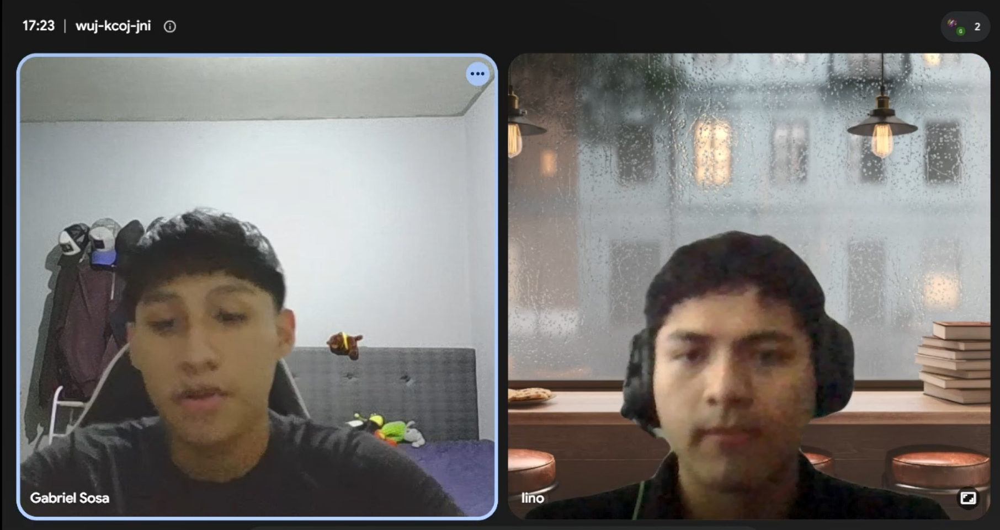</p>

**Resumen preliminar:** Gabriel cuenta con 2 años de experiencia realizando transporte escolar. Utiliza diariamente su teléfono para trabajar y principalmente usa WhatsApp para comunicarse con las familias y Google Maps para organizar sus rutas. Comenta que uno de los problemas que presenta es tener la información fragmentada en distintos chats, lo que hace poco práctico buscar entre conversaciones para verificar si un estudiante será recogido o consultar la dirección de un punto de llegada alternativo. Además, menciona que es repetitivo responder diariamente las preguntas de los padres sobre cuánto falta para que llegue su hijo, si la movilidad se encuentra cerca o si el estudiante se encuentra bien, ya que esto puede distraerlo mientras conduce. También considera que, en caso de utilizar una aplicación, esta debería ser fácil y rápida de utilizar para no quitarle tiempo durante la conducción. Entre las funcionalidades que considera útiles se encuentran una lista de alumnos, el orden de recojo y la posibilidad de registrar rápidamente cuándo recoge o entrega a un estudiante. Asimismo, le gustaría que los padres puedan visualizar el estado de la ruta y su ubicación para mantenerse informados sin necesidad de comunicarse constantemente con él.

## Entrevista 5 — Brayan Solorzano Pineda

- **Edad:** 25 años.
- **Ocupación / segmento:** Conductor de movilidad escolar.
- **Experiencia en el rubro:** 5 años.
- **Distrito:** Pueblo Libre.
- **Duración:** 09:05.
- **Timing de inicio:** 00:00.
- **Video:** [Conductor 2.mp4](https://upcedupe-my.sharepoint.com/:v:/g/personal/u202422298_upc_edu_pe/IQDViGOQ_7GOQYDKI1MqVAXNAacWQv3o8bRMqBJbKkhsKp8?nav=eyJyZWZlcnJhbEluZm8iOnsicmVmZXJyYWxBcHBQbGF0Zm9ybSI6IldlYiIsInJlZmVycmFsTW9kZSI6InZpZXciLCJyZWZlcnJhbFZpZXciOiJNeUZpbGVzTGlua0NvcHkifX0&e=6tRx0m).

<p align="center"></p>

**Resumen preliminar:** Brayan cuenta con 5 años de experiencia en el rubro. Comenzó trabajando en transporte personal, pero luego se trasladó al rubro del transporte escolar. Utiliza un grupo de WhatsApp para enviar avisos a los padres; sin embargo, los tutores prefieren escribirle por privado. Además, utiliza WaySide para evitar el tráfico y el calendario de su teléfono para recordar horarios especiales. Ha tenido problemas para recordar cambios en las rutas debido a modificaciones en el recojo de un alumno, especialmente porque varios padres le escriben. Diariamente, los padres también le preguntan si ya se encuentra cerca o si los niños ya llegaron a la escuela, lo cual considera repetitivo. Comenta que durante la conducción no utilizaría una aplicación. Sin embargo, le sería útil contar con un registro del inicio del recorrido, la hora de recojo de cada alumno y la hora de llegada a la escuela. También considera útil registrar cuando un alumno no será recogido. En general, considera que una aplicación debería ayudarlo a organizar los cambios y permitir que los padres puedan seguir la ruta sin necesidad de preguntarle constantemente. No utilizaría una aplicación que lo obligue a realizar muchas acciones manualmente o que tenga un costo muy elevado. Como característica adicional, le gustaría que pudiera utilizarse en zonas donde existe poca señal.

## Entrevista 6 — Vilma Hoyos Martinez

- **Edad:** 56 años.
- **Ocupación / segmento:** Conductor de movilidad escolar.
- **Experiencia en el rubro:** 25 años.
- **Distrito:** San Miguel.
- **Duración:** 18:14.
- **Timing de inicio:** 00:06.
- **Video:** [Conductor 3.mp4](https://upcedupe-my.sharepoint.com/:v:/g/personal/u20241b451_upc_edu_pe/IQAarNiMmGEZT73ZVhSkpNMNAVFqyptTBINEQvTJU6AW7BY?nav=eyJyZWZlcnJhbEluZm8iOnsicmVmZXJyYWxBcHAiOiJTdHJlYW1XZWJBcHAiLCJyZWZlcnJhbFZpZXciOiJTaGFyZURpYWxvZy1MaW5rIiwicmVmZXJyYWxBcHBQbGF0Zm9ybSI6IldlYiIsInJlZmVycmFsTW9kZSI6InZpZXcifX0%3D&e=asjxgo).

<p align="center">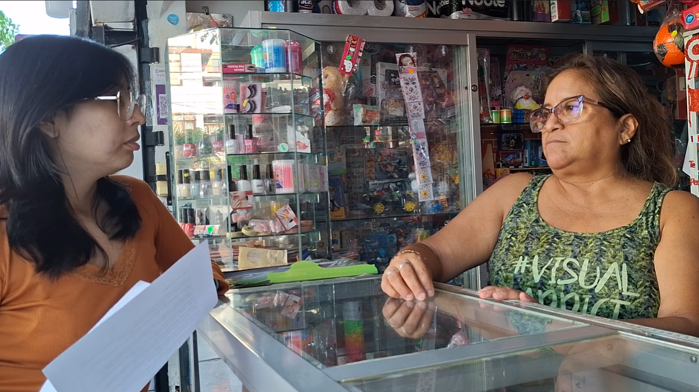</p>

**Resumen preliminar:** Vilma cuenta con 25 años de experiencia en el rubro de la movilidad escolar. Empezó llevando a estudiantes del colegio San Toribio, en el Rímac, hace 10 años y actualmente está a cargo de 26 niños en San Miguel, a quienes lleva a los colegios Claretiano y Los Rosales. La señora Vilma cuenta con un ayudante, quien utiliza la aplicación WhatsApp para comunicarse con las familias, coordinar horarios, llamar para avisar que deben bajar, informar si el niño asistirá, si necesita esperar y compartir su ubicación en tiempo real. Ha presentado problemas con la puntualidad de los niños y con la coordinación con los padres respecto a si los niños serán recogidos o no. Comenta que tiene conocimientos casi nulos en tecnología. Los padres le han recomendado utilizar algunas aplicaciones para poder realizar un mejor seguimiento del recorrido de sus hijos, pero menciona que no sabe cómo utilizarlas y, por ese motivo, no las implementa.

### 2.2.3. Análisis de entrevistas

Se compararán respuestas por segmento, separando **características objetivas** (edad, distrito, experiencia, dispositivo, navegador, canales y organización) y **características subjetivas** (motivaciones, frustraciones, necesidades, actitud hacia tecnología, privacidad y barreras). Los porcentajes se completarán solo con datos reales.

#### Datos Demográficos y Conductuales (Aspectos Objetivos)

* **Edades:** El 100% de los entrevistados del segmento Padres/Tutores tiene entre 32 y 38 años.
* **Rol de cuidado:** El 66.7% son padres de familia directos y el 33.3% corresponde a un tutor a cargo.
* **Edades de los menores:** El 100% de los niños tiene entre 4 y 8 años (33.3% inicial de 4 años; 66.7% en 1er y 3er grado de primaria).
* **Uso de herramientas digitales:** El 100% utiliza de forma diaria WhatsApp y aplicaciones con mapas (Google Maps, Waze).
* **Frecuencia de contacto:** El 100% se comunica con el chofer entre 2 y 3 veces por semana, principalmente cuando la movilidad excede los 15 minutos de tardanza habitual.

#### Datos preliminares del segmento Conductores

* Se han registrado tres entrevistas: Gabriel Alexandro Sosa Guevara, de 20 años; Brayan Solorzano Pineda, de 25 años; y Vilma Hoyos Martinez, de 56 años.
* La edad promedio de los conductores entrevistados es de **33,67 años**.
* La experiencia declarada en transporte escolar es de **2, 5 y 25 años**, con un promedio de **10,67 años**.
* El distrito de Vilma es San Miguel; los distritos de Gabriel y Brayan quedan pendientes de completar.

#### Comportamientos y Rutinas Actuales

* **Espera previa:** El 100% sale a la vereda con el menor entre 5 y 10 minutos antes de la hora pactada para no perder el turno de recojo.
* **Fallas y retrasos previos:** El 100% ha sufrido demoras graves  por desperfectos mecánicos o congestión vehicular, avisadas tarde y resolviendo el traslado con taxis por aplicativo de último momento.
* **Seguridad y uso del celular:** El 100% reconoce que el chofer no debería utilizar el teléfono mientras conduce niños. El 33.3%  señala que solo acepta el contacto telefónico si el vehículo está 100% estacionado.

#### Expectativas y Necesidades para el Proyecto

* **Seguimiento pasivo del viaje:** El 100% necesita conocer la ubicación del vehículo en tiempo real mediante un mapa interactivo para eliminar la necesidad de llamar o mandar mensajes al conductor.
* **Aviso de proximidad:** El 100% requiere una notificación automática previa (a 2 cuadras de distancia) para salir de casa al momento exacto y evitar esperas en la calle.
* **Confirmaciones de estado:** El 100% demanda saber cuándo el menor subió al vehículo y cuándo fue entregado de forma segura en la puerta del colegio. El 33.3%  agrega la confirmación del uso del cinturón de seguridad.
* **Canal directo de incidencias:** El 100% necesita que el chofer pueda reportar averías mecánicas o tráfico atípico de forma simultánea a todos los padres involucrados en la ruta.
* **Validación de seguridad:** El 100% prioriza la verificación de antecedentes penales, récord de papeletas, SOAT escolar al día y control de velocidad máxima permitida.

#### Modelo de Acceso y Disposición Económica

* **Rango de pago:** El 100% considera adecuado y justo pagar una mensualidad adicional de entre S/ 15 y S/ 25 por el servicio de monitoreo y seguridad.
* **Modalidad de prueba:** El 33.3% (Gabriela) requiere un periodo de prueba gratis (*free trial*) para validar la precisión del GPS y la estabilidad del sistema antes de pagar la suscripción mensual.

| Variable | Padres/Tutores | Conductores |
|---|---:|---:|
| Canal principal de comunicación | 100 % | 100% |
| Smartphone como dispositivo principal | 100% | 100% |
| Necesidad de conocer/comunicar estado de ruta | 100% | 100% |
| Retrasos/cambios frecuentes | 67% | 100% |
| Confirmación de recojo/entrega | 100% | 100% |
| Interés en notificaciones | 100% | 100% |
| Preocupación por privacidad | 33% | 100% |
| Barreras de adopción | 33% | 100% |

## 2.3. Needfinding

### 2.3.1. User Personas

En esta sección se presentan las User Personas correspondientes a los dos segmentos objetivos: **Padres/Tutores y Conductores**. Estas User Personas fueron elaboradas a partir de la información recopilada en las entrevistas previamente analizadas, con el objetivo de identificar un perfil común para cada segmento. En ellas se describe el perfil de nuestro usuario ideal, incluyendo sus características, necesidades y principales comportamientos.

## Segmento — Padres y tutores


## Segmento — Conductores


### 2.3.2. User Task Matrix

En esta sección se presenta la matriz de tareas de usuario (**User Task Matrix**), la cual analiza las actividades esenciales que realizan los dos segmentos objetivos del proyecto (**Padre/Tutor** representado por el arquetipo de Gabriela Morales, y **Conductor de Movilidad Escolar**) para cumplir con sus objetivos cotidianos de traslado escolar. 

Siguiendo el principio metodológico de Needfinding, las tareas descritas representan actividades humanas y operativas que los usuarios ejecutan en su día a día, independientemente de la existencia de una herramienta digital de software.

| Tareas del Usuario (User Tasks) | User Persona: Padre / Tutor (Gabriela Morales) | | User Persona: Conductor Escolar | |
|---|:---:|:---:|:---:|:---:|
| | **Frecuencia** | **Importancia** | **Frecuencia** | **Importancia** |
| Alistar y preparar al escolar antes de la salida | Diaria (Alta) | Alta | No aplica | No aplica |
| Esperar en la acera/puerta al vehículo de movilidad | Diaria (Alta) | Alta | No aplica | No aplica |
| Consultar el estado y avance del vehículo en ruta | Diaria (Alta) | Alta | No aplica | No aplica |
| Planificar y organizar la lista de paradas del recorrido | No aplica | No aplica | Diaria (Alta) | Alta |
| Confirmar la subida del escolar a la unidad | Diaria (Alta) | Alta | Diaria (Alta) | Alta |
| Verificar el uso del cinturón y medidas de seguridad del menor | Ocasional (Media) | Media | Diaria (Alta) | Alta |
| Conducir y monitorear el flujo vehicular en horas punta | No aplica | No aplica | Diaria (Alta) | Alta |
| Comunicar retrasos generados por congestión vehicular | Semanal (Media) | Alta | Semanal (Media) | Alta |
| Informar incidencias mecánicas o emergencias imprevistas | Ocasional (Baja) | Alta | Ocasional (Baja) | Alta |
| Confirmar la entrega del escolar en la puerta del colegio | Diaria (Alta) | Alta | Diaria (Alta) | Alta |
| Coordinar el retorno del menor hacia el hogar | Diaria (Alta) | Media | Diaria (Alta) | Media |
| Gestionar el pago mensual del servicio de transporte | Mensual (Baja) | Media | Mensual (Baja) | Media |

---

#### Análisis comparativo de la matriz de tareas

1. **Tareas de mayor frecuencia e importancia crítica (Coincidencias):**
   * **Confirmación de recojo y entrega escolar:** Tanto para el padre/tutor como para el conductor, confirmar el momento exacto en que el menor ingresa a la unidad y llega a salvo al centro educativo es una tarea diaria de máxima importancia. Para la familia representa tranquilidad emocional, mientras que para el conductor constituye el cumplimiento de su deber de custodia.
   * **Gestión de demoras por congestión:** Lima presenta una congestión en hora punta del 69.3%; por ende, la tarea de informar demoras tiene una frecuencia recurrente (semanal) y una importancia crítica (Alta) para ambos segmentos, pues evita la zozobra de las familias y la sobrecarga de consultas al chofer.

2. **Principales diferencias operativas entre segmentos:**
   * **Foco de atención en ruta:** Mientras el padre/tutor tiene una necesidad pasiva pero continua de consultar dónde está la movilidad para no salir a la acera a ciegas, el conductor debe mantener el 100% de su atención sobre el volante y el entorno vial, por lo que cualquier tarea que le exija distraer la vista representa un peligro potencial.
   * **Planificación previa:** El conductor asume la responsabilidad logística de trazar el orden óptimo de recojo y desembarque antes de arrancar el motor, una tarea ajena al padre de familia, quien únicamente se enfoca en el punto de parada correspondiente a su hogar o colegio.

3. **Oportunidad para el diseño de la solución:**
   El análisis evidencia que las tareas de *confirmar subida/bajada* y *avisar retrasos* son de alta fricción en la actualidad (se realizan mediante llamadas o mensajes manuales mientras se conduce). La solución debe automatizar y simplificar estas tareas al mínimo contacto operativo para proteger la seguridad del menor. 

### 2.3.3. User Journey Mapping

En esta sección se presentan los **User Journey Maps** correspondientes a los dos segmentos objetivos: **Padres/Tutores y Conductores**. Estos mapas representan el recorrido actual de cada usuario durante el servicio de movilidad escolar, desde el inicio hasta el final de su experiencia.

Se presentan las versiones **As-Is**, que permiten analizar cómo se desarrolla actualmente el proceso sin la intervención de nuestra solución. A través de las diferentes etapas, actividades, puntos de contacto y dificultades identificadas, se busca comprender la experiencia de cada User Persona y detectar oportunidades de mejora.

## Segmento — Padres y tutores

El journey de los padres de familia durante las mañanas inicia con la preparación en casa, donde alistan al menor con una sensación inicial de serenidad, aunque experimentan la falta de visibilidad sobre el inicio de la ruta. Al pasar a la espera en la acera, se vive un estado de vigilancia mientras aguardan a la intemperie la llegada de la movilidad, lo que da paso a la etapa de retraso e incertidumbre: al cumplirse más de quince minutos de demora sin respuesta del conductor debido a que va manejando, la ansiedad y el miedo a llegar tarde se apoderan del tutor. Posteriormente, durante el abordaje y despacho, la subida se realiza de forma apresurada y sin la certeza de las medidas de seguridad, generando temor. Finalmente, en el trayecto y llegada, los padres experimentan angustia e incertidumbre total hasta recibir la confirmación de que el menor ha ingresado sin novedades al colegio.


## Segmento — Conductores

El recorrido diario del conductor inicia antes del viaje con una etapa neutral donde revisa chats de WhatsApp para corroborar asistencias de forma tediosa y repetitiva. Al pasar al durante el viaje de ida, la experiencia desciende hacia la molestia (annoyance) debido a lo estresante y peligroso que resulta manejar mientras responde mensajes constantes y llamadas sobre demoras. Posteriormente, en el después del viaje y la previa antes del viaje de retorno, el conductor se informa de cambios mediante chats fragmentados con una actitud serena y de anticipación. Al encontrarse en el colegio para la recogida, la experiencia se mantiene en un estado de vigilancia y neutralidad mientras cuenta y verifica la asistencia de los menores lidiando con llamadas de última hora. En el durante el viaje de regreso, vuelve a experimentar momentos neutrales al repartir a los estudiantes mientras responde chats y busca información de emergencia. Finalmente, la jornada concluye en el después del viaje de vuelta a casa con una sensación de serenidad al comunicarse individualmente con los padres para confirmar que los niños llegaron a sus domicilios.

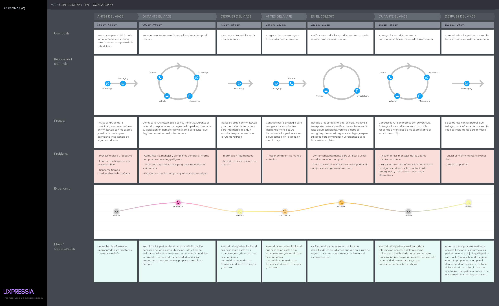

### 2.3.4. Empathy Mapping

En esta sección se presentan los **Empathy Maps** elaborados para cada uno de los User Personas: **Parent/Tutor y Driver**. Estos mapas fueron construidos a partir de las observaciones obtenidas durante las entrevistas y permiten comprender sus necesidades, comportamientos, pensamientos, emociones, Pains y Gains dentro del contexto de la movilidad escolar.

## Segmento — Padres y tutores


## Segmento — Conductores

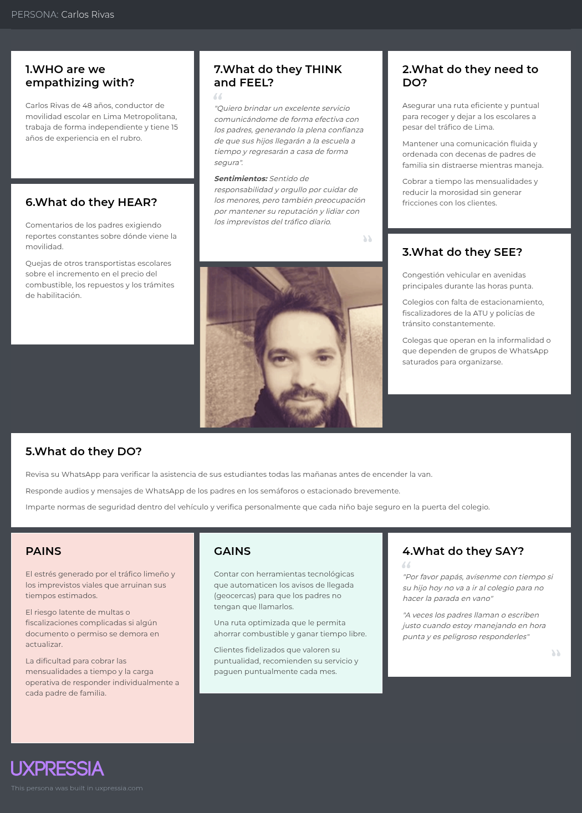

## 2.4. Big Picture Event Storming

En esta sección se presenta una aproximación inicial al **Event Storming** del dominio de movilidad escolar, identificando los principales eventos y procesos que ocurren durante el traslado de los estudiantes. Esta representación permitirá establecer una base para comprender el funcionamiento del dominio y continuar refinándolo en futuras iteraciones del proyecto.

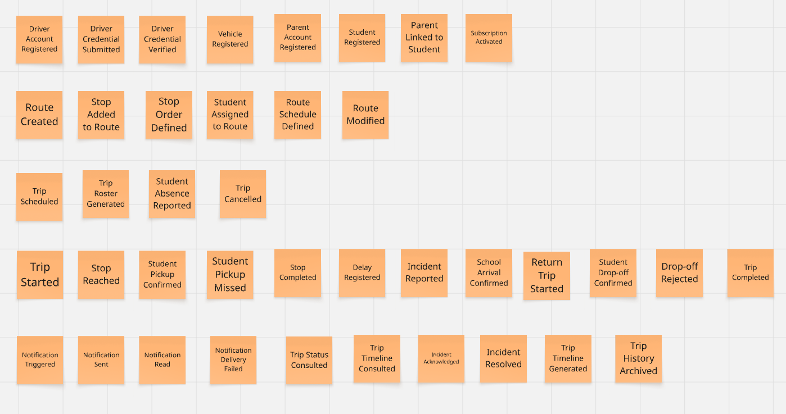

## 2.5. Ubiquitous Language

En esta sección se presenta el glosario de términos del dominio de movilidad escolar, recopilados para establecer un lenguaje común entre los miembros del equipo y los stakeholders. Los términos y sus definiciones representan conceptos utilizados dentro del contexto del problema y la solución propuesta.


| Término                                       | Definición                                                                                                                                          |
| --------------------------------------------- | --------------------------------------------------------------------------------------------------------------------------------------------------- |
| **Student (Estudiante)**                      | Persona que utiliza el servicio de movilidad escolar para trasladarse entre su domicilio y el colegio.                                              |
| **Parent/Tutor (Padre/Tutor)**                | Persona responsable del estudiante que utiliza el servicio de movilidad y recibe información sobre su traslado.                                     |
| **Driver (Conductor)**                        | Persona encargada de conducir el vehículo de movilidad escolar y realizar el traslado de los estudiantes asignados a su ruta.                       |
| **Vehicle (Vehículo)**                        | Medio de transporte utilizado por el conductor para realizar el traslado de los estudiantes.                                                        |
| **Route (Ruta)**                              | Recorrido establecido que realiza el vehículo para recoger y dejar a los estudiantes en los puntos correspondientes.                                |
| **Trip (Viaje)**                              | Traslado realizado por el vehículo siguiendo una ruta determinada, ya sea desde los domicilios hacia el colegio o del colegio hacia los domicilios. |
| **Stop (Parada)**                             | Punto establecido dentro de una ruta donde se recoge o deja a uno o más estudiantes.                                                                |
| **Pickup (Recojo)**                           | Acción de recoger a un estudiante en el punto establecido para iniciar o continuar el traslado.                                                     |
| **Drop-off (Dejar)**                          | Acción de dejar a un estudiante en el punto establecido al finalizar su traslado.                                                                   |
| **Trip Status (Estado del viaje)**            | Estado actual en el que se encuentra un viaje, como pendiente, en camino, en curso o finalizado.                                                    |
| **Delay (Demora)**                            | Retraso en el horario o recorrido previsto de un viaje que puede afectar la hora estimada de recojo o llegada.                                      |
| **Incident (Incidente)**                      | Situación inesperada ocurrida durante el viaje que puede afectar el traslado o la seguridad de los estudiantes.                                     |
| **Notification (Notificación)**               | Aviso enviado a los padres o tutores para informar sobre cambios o eventos relacionados con el traslado de su hijo.                                 |
| **ETA (Hora estimada de llegada)**            | Tiempo estimado en el que la movilidad llegará a un punto determinado de la ruta.                                                                   |
| **Trip Timeline (Línea de tiempo del viaje)** | Registro ordenado de los principales eventos de un viaje, como el inicio del recorrido, recojo, llegada al colegio, salida y llegada al domicilio.  |


---

# Capítulo III: Requirements Specification

## 3.1. User Stories

El backlog de requisitos se amplía a **50 historias en total: 42 User Stories funcionales y 8 Technical Stories**. La cantidad responde a la observación del docente de ampliar el alcance más allá de las historias iniciales y permite representar de forma suficiente el negocio, la Landing Page y las necesidades técnicas. Las historias de GPS continuo, ETA dinámico y geofencing se mantienen como **roadmap posterior al MVP**, de modo que el núcleo inicial de Rumbo siga centrado en estados, hitos, confirmaciones, retrasos, incidencias y notificaciones.

### Epics
- **EP01 — Gestión de usuarios, perfiles y acceso.**
- **EP02 — Gestión de rutas, estudiantes y viajes escolares.**
- **EP03 — Seguimiento de estado, hitos e historial.**
- **EP04 — Comunicación de retrasos, incidencias y notificaciones.**
- **EP05 — Landing Page e información pública.**
- **EP06 — Gestión de suscripciones y facturación para conductores u operadores.**
- **EP07 — Servicios backend y arquitectura técnica.**

### User Stories

| Epic / Story ID | Título | Descripción | Criterios de Aceptación | Relacionado con (Epic ID) |
|---|---|---|---|---|
| US01 | Consultar estado actual del viaje | Como padre/tutor, deseo consultar el estado actual del viaje para saber en qué etapa se encuentra la ruta. | **Escenario 1:** Given que existe un viaje activo asociado al estudiante, When el tutor consulta el viaje, Then el sistema muestra el estado actual y la hora del último evento registrado. // **Escenario 2:** Given que la ruta todavía no inició, When el tutor consulta el viaje programado, Then el sistema informa que el recorrido aún no ha comenzado. | EP03 |
| US02 | Revisar línea de tiempo del trayecto | Como padre/tutor, deseo revisar la línea de tiempo del trayecto para conocer los eventos ya registrados. | **Escenario 1:** Given un viaje con eventos registrados, When el tutor consulta la línea de tiempo, Then el sistema los presenta en orden cronológico con fecha y hora. // **Escenario 2:** Given un viaje finalizado, When el tutor consulta su detalle, Then puede revisar los principales hitos ocurridos durante ese traslado. | EP03 |
| US03 | Visualizar retrasos reportados | Como padre/tutor, deseo visualizar retrasos reportados para anticipar cambios en la hora prevista de llegada. | **Escenario 1:** Given que el conductor registró un retraso, When el tutor consulta el viaje, Then el sistema muestra el motivo y la magnitud estimada de la demora. // **Escenario 2:** Given que el retraso fue actualizado, When el tutor vuelve a consultar el viaje, Then visualiza la información más reciente. | EP04 |
| US04 | Recibir información sobre incidencias | Como padre/tutor, deseo recibir información sobre incidencias para comprender situaciones excepcionales durante el traslado. | **Escenario 1:** Given que se registró una incidencia en una ruta asociada al estudiante, When el sistema procesa el evento, Then la incidencia queda disponible para el tutor autorizado. // **Escenario 2:** Given que la incidencia fue resuelta, When el conductor actualiza su estado, Then el tutor puede conocer que el servicio fue normalizado. | EP04 |
| US05 | Visualizar estudiantes asignados a una ruta | Como conductor, deseo visualizar los estudiantes asignados a una ruta para organizar el recorrido. | **Escenario 1:** Given una ruta con estudiantes vinculados, When el conductor consulta la ruta del día, Then visualiza los estudiantes y sus paradas en el orden configurado. // **Escenario 2:** Given que existen diferentes turnos, When el conductor selecciona uno, Then el sistema muestra únicamente las asignaciones correspondientes. | EP02 |
| US06 | Registrar hitos del trayecto | Como conductor, deseo registrar recojos y otros hitos del trayecto para mantener actualizada la información de la ruta. | **Escenario 1:** Given que el vehículo se encuentra detenido en una parada, When el conductor confirma el recojo de un estudiante, Then el sistema registra el evento con fecha y hora y actualiza el estado del viaje. // **Escenario 2:** Given que se registró un hito por error, When el conductor solicita corregirlo dentro del periodo permitido, Then el sistema registra la corrección sin perder la trazabilidad del evento anterior. | EP02 |
| US07 | Registrar un retraso para comunicarlo | Como conductor, deseo registrar un retraso para comunicarlo a las familias vinculadas. | **Escenario 1:** Given una ruta activa y el vehículo detenido de forma segura, When el conductor registra una demora y su causa, Then el sistema incorpora el evento a la ruta y lo comunica a las familias afectadas. // **Escenario 2:** Given un retraso ya informado, When la situación cambia, Then el conductor puede actualizar la estimación para mantener la información vigente. | EP04 |
| US08 | Registrar una incidencia operativa | Como conductor, deseo registrar una incidencia para dejar constancia y comunicar el evento. | **Escenario 1:** Given una ruta activa, When el conductor registra una incidencia seleccionando una categoría y descripción válida, Then el sistema la añade al historial del viaje. // **Escenario 2:** Given que varias familias están asociadas a la ruta, When se registra la incidencia, Then el sistema la comunica a los tutores autorizados correspondientes. | EP04 |
| US09 | Presentar propuesta de valor en Landing Page | Como visitante, deseo conocer la propuesta de valor de Rumbo para comprender qué problema resuelve el producto. | **Escenario 1:** Given que un visitante accede a la Landing Page, When visualiza la sección principal, Then encuentra una explicación clara del producto y su beneficio principal. // **Escenario 2:** Given que desea conocer el funcionamiento, When continúa navegando, Then encuentra una explicación resumida del flujo de Rumbo. | EP05 |
| US10 | Presentar beneficios por segmento | Como visitante, deseo conocer los beneficios para padres/tutores y conductores para identificar si Rumbo responde a mis necesidades. | **Escenario 1:** Given un visitante del segmento padre/tutor, When consulta la sección correspondiente, Then encuentra beneficios relacionados con visibilidad y coordinación del traslado. // **Escenario 2:** Given un visitante conductor, When consulta su sección, Then encuentra beneficios relacionados con organización y reducción de mensajes repetitivos. | EP05 |
| US11 | Soportar inglés y español en Landing Page | Como visitante, deseo cambiar entre inglés y español para consultar el contenido en un idioma disponible. | **Escenario 1:** Given que un visitante ingresa por primera vez, When se carga la Landing Page, Then el contenido se presenta en inglés como idioma predeterminado. // **Escenario 2:** Given que el visitante selecciona español, When continúa navegando, Then la interfaz presenta el contenido disponible en `es_419` y conserva la preferencia durante la sesión. | EP05 |
| US12 | Acceder a términos y condiciones desde el footer | Como visitante, deseo acceder a los términos y condiciones y la política de privacidad para conocer las reglas del servicio. | **Escenario 1:** Given que el visitante se encuentra en cualquier sección de la Landing Page, When accede al footer, Then encuentra enlaces visibles hacia Terms & Conditions y Privacy Policy. // **Escenario 2:** Given que selecciona uno de los enlaces, When se abre el documento correspondiente, Then puede consultar el contenido legal aplicable al uso de Rumbo. | EP05 |
| US13 | Registro inicial de padre o tutor | Como visitante del segmento padre/tutor, deseo crear una cuenta para utilizar las funcionalidades asociadas a los traslados de mis hijos. | **Escenario 1:** Given un tutor sin cuenta, When registra los datos obligatorios con información válida, Then el sistema crea su perfil y solicita validar el correo. // **Escenario 2:** Given un correo ya registrado, When intenta crear otra cuenta con el mismo correo, Then el sistema rechaza el registro y orienta al usuario a iniciar sesión o recuperar su cuenta. | EP01 |
| US14 | Registro de conductor y vehículo | Como conductor, deseo registrar mis datos y los de mi vehículo para configurar mi perfil de servicio. | **Escenario 1:** Given un conductor autenticado, When registra sus datos personales, vehículo y documentos requeridos, Then el sistema crea el expediente con su estado correspondiente. // **Escenario 2:** Given una placa ya asociada a otro vehículo activo, When intenta registrarla nuevamente, Then el sistema informa que la placa ya se encuentra registrada. | EP01 |
| US15 | Iniciar sesión según rol | Como usuario registrado, deseo iniciar sesión con mis credenciales para acceder a las funcionalidades correspondientes a mi rol. | **Escenario 1:** Given una cuenta activa con credenciales válidas, When el usuario inicia sesión, Then accede a las funcionalidades permitidas para su rol. // **Escenario 2:** Given credenciales inválidas, When el usuario intenta iniciar sesión, Then el sistema rechaza el acceso y muestra un mensaje comprensible sin revelar información sensible. | EP01 |
| US16 | Recuperar acceso a la cuenta | Como usuario registrado, deseo recuperar mi contraseña mediante correo para restablecer el acceso en caso de olvido. | **Escenario 1:** Given un correo vinculado a una cuenta activa, When el usuario solicita recuperar su contraseña, Then recibe un enlace temporal para establecer una nueva. // **Escenario 2:** Given un enlace expirado o ya utilizado, When el usuario intenta usarlo, Then el sistema solicita generar una nueva petición. | EP01 |
| US17 | Consultar documentación registrada del conductor | Como padre/tutor, deseo consultar la documentación registrada del conductor y del vehículo para conocer la información declarada del servicio. | **Escenario 1:** Given que el tutor tiene una movilidad asociada, When consulta el perfil del conductor, Then visualiza los documentos registrados y su fecha de vigencia declarada. // **Escenario 2:** Given un documento vencido según la fecha registrada, When el tutor consulta el perfil, Then el sistema lo muestra como vencido sin afirmar una validación oficial externa que no haya sido realizada. | EP01 |
| US18 | Gestionar perfil del estudiante | Como padre/tutor, deseo registrar y actualizar los datos básicos del estudiante para vincularlo al servicio de movilidad. | **Escenario 1:** Given un tutor autenticado, When registra los datos obligatorios del estudiante, Then el sistema crea su perfil. // **Escenario 2:** Given un perfil existente, When el tutor modifica un dato permitido, Then el sistema actualiza la información y conserva la relación con sus viajes. | EP01 |
| US19 | Vincular estudiante mediante código de invitación | Como conductor, deseo solicitar la vinculación de un estudiante mediante un código compartido por su tutor para incorporarlo a una ruta. | **Escenario 1:** Given un código válido, When el conductor solicita la vinculación, Then el sistema envía la solicitud al tutor responsable para su aprobación. // **Escenario 2:** Given que la cantidad de estudiantes asignados alcanzó la capacidad registrada del vehículo, When se intenta añadir uno adicional, Then el sistema impide la asignación hasta que exista capacidad disponible. | EP02 |
| US20 | Informar inasistencia del estudiante para el día | Como padre/tutor, deseo informar que mi hijo no utilizará la movilidad hoy para evitar una parada innecesaria. | **Escenario 1:** Given que el viaje todavía no inició, When el tutor registra la inasistencia para ese día, Then el sistema actualiza la lista de la ruta antes de la salida. // **Escenario 2:** Given que el viaje ya inició, When el tutor registra la inasistencia, Then el conductor recibe la actualización para considerar la parada pendiente. | EP02 |
| US21 | Gestionar el orden de las paradas | Como conductor, deseo definir y reorganizar el orden de las paradas de una ruta para mantener una secuencia operativa acorde con mi servicio. | **Escenario 1:** Given una ruta con varias paradas, When el conductor modifica su orden, Then el sistema guarda la nueva secuencia. // **Escenario 2:** Given una secuencia ya configurada, When se programa un nuevo viaje basado en esa ruta, Then utiliza el orden guardado mientras no sea modificado. | EP02 |
| US22 | Asignar acceso a un asistente de movilidad | Como conductor, deseo habilitar una cuenta de asistente para delegar el pase de lista y la confirmación de hitos autorizados sin compartir mi cuenta principal. | **Escenario 1:** Given un conductor con asistente, When le asigna el rol permitido, Then el asistente accede únicamente a las funciones autorizadas. // **Escenario 2:** Given que el asistente deja de trabajar con el conductor, When se revoca su acceso, Then pierde los permisos asociados a esa movilidad. | EP02 |
| US23 | Programar ausencia futura del estudiante | Como padre/tutor, deseo registrar con anticipación los días en que mi hijo no utilizará la movilidad para evitar paradas innecesarias. | **Escenario 1:** Given un viaje futuro programado, When el tutor marca al estudiante como ausente para esa fecha, Then el sistema excluye su recojo de ese viaje. // **Escenario 2:** Given una ausencia futura registrada, When el tutor la cancela antes del inicio del viaje, Then el estudiante vuelve a quedar incluido en la ruta. | EP02 |
| US24 | Iniciar y finalizar un recorrido | Como conductor, deseo indicar el inicio y el fin de una ruta para mantener actualizado el estado general del viaje. | **Escenario 1:** Given una ruta programada y el vehículo listo para partir, When el conductor inicia el recorrido, Then el sistema cambia el viaje a estado activo y registra la hora de inicio. // **Escenario 2:** Given que todos los hitos obligatorios fueron completados, When el conductor finaliza la ruta, Then el sistema registra la hora de cierre y consolida el historial del viaje. | EP03 |
| US25 | Registrar verificación de cinturón de seguridad | Como conductor o asistente, deseo registrar la verificación del cinturón del estudiante cuando corresponda para dejar constancia de la revisión antes de continuar el recorrido. | **Escenario 1:** Given que un estudiante fue recogido y el vehículo está detenido, When el responsable confirma la verificación, Then el sistema registra el control con fecha y hora. // **Escenario 2:** Given que la verificación no fue registrada, When se revisa el detalle del viaje, Then el sistema la muestra como pendiente sin asumir información no confirmada. | EP03 |
| US26 | Registrar entrega del estudiante | Como conductor, deseo confirmar la entrega del estudiante en el destino correspondiente para cerrar su traslado individual. | **Escenario 1:** Given que el estudiante llegó al colegio, When el conductor confirma la entrega, Then el sistema registra fecha, hora y destino y notifica al tutor autorizado. // **Escenario 2:** Given un recorrido de retorno, When el conductor confirma la entrega al tutor o punto autorizado, Then el sistema cierra el traslado del estudiante. | EP03 |
| US27 | Visualizar ubicación de la unidad durante un viaje | Como padre/tutor, deseo visualizar la ubicación de la unidad durante un viaje para complementar la información de estado cuando esta capacidad esté habilitada. | **Escenario 1:** Given una ruta activa con seguimiento habilitado, When el tutor abre el mapa, Then el sistema muestra la última ubicación disponible de la unidad. // **Escenario 2:** Given una pérdida temporal de señal, When el tutor consulta el mapa, Then el sistema conserva la última ubicación conocida e informa que la posición puede estar desactualizada. | EP03 |
| US28 | Consultar historial de viajes anteriores | Como padre/tutor, deseo revisar traslados anteriores para aclarar demoras o eventos ocurridos. | **Escenario 1:** Given que existen viajes finalizados asociados al estudiante, When el tutor selecciona una fecha, Then visualiza los hitos de ese traslado. // **Escenario 2:** Given un viaje con retraso o incidencia, When revisa el historial, Then puede identificar el evento registrado y su momento de ocurrencia. | EP03 |
| US29 | Recibir alerta de proximidad mediante geofencing | Como padre/tutor, deseo recibir una alerta cuando la movilidad se aproxime al punto de recojo para prepararme con anticipación cuando esta capacidad esté habilitada. | **Escenario 1:** Given una ruta activa con geofencing configurado, When el vehículo entra en el perímetro definido para la parada, Then el sistema genera una alerta al tutor. // **Escenario 2:** Given que el servicio de ubicación no está disponible, When no puede determinarse la proximidad, Then el sistema no genera una alerta falsa y mantiene el último estado conocido. | EP04 |
| US30 | Informar transbordo por contingencia | Como padre/tutor, deseo recibir información si los estudiantes deben ser trasladados a otra unidad por una contingencia para conocer cómo continuará el servicio. | **Escenario 1:** Given una incidencia que requiere unidad de reemplazo, When el operador registra el transbordo y los datos disponibles, Then las familias afectadas reciben la actualización. // **Escenario 2:** Given que la ruta se reanuda, When el nuevo responsable confirma la continuación, Then el sistema conserva el historial previo y registra la reanudación. | EP04 |
| US31 | Configurar preferencias de notificaciones | Como padre/tutor, deseo elegir qué notificaciones no críticas recibir para evitar avisos innecesarios. | **Escenario 1:** Given el panel de preferencias, When el tutor desactiva un tipo de aviso no crítico, Then el sistema deja de enviarlo. // **Escenario 2:** Given una incidencia clasificada como crítica, When se genera la alerta, Then el sistema la mantiene disponible aunque otras notificaciones estén desactivadas. | EP04 |
| US32 | Visualizar disponibilidad del conductor durante la ruta | Como padre/tutor, deseo saber cuando el conductor se encuentra realizando un recorrido para evitar contactarlo innecesariamente mientras conduce. | **Escenario 1:** Given una ruta activa, When el tutor consulta el contacto del conductor, Then el sistema informa que se encuentra en recorrido y recomienda revisar primero el estado del viaje. // **Escenario 2:** Given que la ruta finalizó o el conductor se encuentra disponible, When el tutor consulta el contacto, Then el sistema muestra el canal de comunicación definido sin bloquear llamadas de emergencia. | EP04 |
| US33 | Presentar planes comerciales en Landing Page | Como visitante, deseo conocer las opciones comerciales de Rumbo para entender cómo podría contratarse el servicio. | **Escenario 1:** Given un visitante interesado, When consulta la sección comercial, Then el sistema presenta los tipos de plan o modalidad disponibles sin mostrar precios como definitivos mientras continúen en validación. // **Escenario 2:** Given que una tarifa aún no ha sido validada, When se presenta la información comercial, Then se identifica claramente como referencial o por definir. | EP05 |
| US34 | Formulario público de contacto | Como visitante, deseo enviar una consulta desde la Landing Page para solicitar información sobre Rumbo. | **Escenario 1:** Given datos de contacto válidos, When el visitante envía su consulta, Then el sistema confirma que la solicitud fue registrada. // **Escenario 2:** Given que falta un dato obligatorio, When intenta enviar el formulario, Then el sistema informa qué información debe completar. | EP05 |
| US35 | Sección de preguntas frecuentes por segmento | Como visitante, deseo consultar preguntas frecuentes para resolver dudas antes de utilizar Rumbo. | **Escenario 1:** Given un visitante padre/tutor, When consulta las preguntas frecuentes, Then encuentra información relevante sobre privacidad, seguimiento y notificaciones. // **Escenario 2:** Given un visitante conductor, When consulta la sección correspondiente, Then encuentra información sobre requisitos de uso, rutas y operación básica. | EP05 |
| US36 | Pagar suscripción de conductor u operador | Como conductor u operador, deseo pagar la suscripción de Rumbo mediante un medio digital para mantener activo mi plan. | **Escenario 1:** Given un plan activo pendiente de renovación, When el cliente completa un pago aprobado, Then el sistema renueva el periodo correspondiente. // **Escenario 2:** Given un pago rechazado, When la pasarela devuelve el resultado, Then el sistema informa el fallo y conserva el estado previo hasta que exista un pago válido. | EP06 |
| US37 | Consultar y descargar comprobantes de suscripción | Como conductor u operador, deseo consultar mis comprobantes de pago para llevar control de los cargos relacionados con Rumbo. | **Escenario 1:** Given un pago registrado, When el cliente consulta facturación, Then puede visualizar el comprobante asociado. // **Escenario 2:** Given varios pagos realizados, When consulta el historial, Then puede revisar los comprobantes correspondientes a cada periodo. | EP06 |
| US38 | Pausar o cancelar la suscripción | Como conductor u operador, deseo pausar o cancelar mi suscripción para controlar la continuidad de mi plan. | **Escenario 1:** Given una suscripción activa, When el cliente solicita cancelarla, Then el sistema detiene la renovación futura según las condiciones vigentes. // **Escenario 2:** Given una suscripción pausada o cancelada, When el cliente decide reactivarla y cumple las condiciones necesarias, Then puede volver a habilitar el plan. | EP06 |
| US39 | Crear una ruta escolar | Como conductor, deseo crear una ruta indicando su nombre, turno y datos básicos para organizar los recorridos que realizaré. | **Escenario 1:** Given un conductor autenticado, When registra los datos obligatorios de una nueva ruta, Then el sistema crea la ruta en estado configurable. // **Escenario 2:** Given datos obligatorios incompletos, When intenta guardar la ruta, Then el sistema informa qué información falta antes de crearla. | EP02 |
| US40 | Gestionar paradas de una ruta | Como conductor, deseo agregar, editar o retirar paradas para mantener actualizado el recorrido. | **Escenario 1:** Given una ruta editable, When el conductor agrega una parada válida, Then el sistema la incorpora al recorrido. // **Escenario 2:** Given una parada que ya no debe utilizarse, When el conductor la retira de la ruta, Then deja de formar parte de los nuevos viajes generados a partir de esa configuración. | EP02 |
| US41 | Autorizar o revocar la vinculación del estudiante | Como padre/tutor, deseo aprobar o revocar la vinculación de mi hijo con un conductor para controlar quién puede acceder a la información de sus traslados. | **Escenario 1:** Given una solicitud de vinculación pendiente, When el tutor la aprueba, Then el estudiante queda asociado al conductor y la ruta autorizada. // **Escenario 2:** Given una vinculación existente, When el tutor la revoca, Then el conductor deja de tener acceso a los datos y viajes futuros del estudiante que dependan de esa relación. | EP01 |
| US42 | Acceder a Rumbo desde el CTA del segmento | Como visitante, deseo ingresar a la experiencia correspondiente a mi segmento para comenzar a usar Rumbo como padre/tutor o conductor. | **Escenario 1:** Given que el visitante se identifica como padre/tutor, When selecciona el CTA de su segmento, Then es dirigido al acceso o registro de padres/tutores. // **Escenario 2:** Given que el visitante se identifica como conductor, When selecciona el CTA de su segmento, Then es dirigido al acceso o registro de conductores. | EP05 |
| TS01 | Endpoints REST para ingesta de coordenadas GPS | Como Developer, deseo exponer endpoints REST para almacenar las coordenadas enviadas por los vehículos cuando el seguimiento continuo sea incorporado. | **Escenario 1:** Given una solicitud autenticada con coordenadas válidas, When la API procesa el payload, Then persiste la posición y responde con un estado HTTP exitoso. // **Escenario 2:** Given coordenadas inválidas, When el servicio valida la solicitud, Then rechaza el payload con un código HTTP de cliente apropiado. | EP07 |
| TS02 | Integración con servicio de notificaciones push | Como Developer, deseo integrar un servicio de mensajería push para distribuir alertas a los dispositivos autorizados. | **Escenario 1:** Given un evento que requiere notificación, When el servicio procesa el evento, Then envía el mensaje a los dispositivos asociados a los destinatarios. // **Escenario 2:** Given un token de dispositivo inválido o revocado, When el proveedor informa el error, Then el backend deja de considerarlo activo para envíos posteriores. | EP07 |
| TS03 | Integración con API externa para cálculo de ETA | Como Developer, deseo integrar un servicio de mapas para calcular tiempos estimados de llegada cuando el seguimiento avanzado sea incorporado. | **Escenario 1:** Given una posición disponible y un destino válido, When el backend consulta el servicio externo, Then obtiene un ETA y lo asocia al viaje. // **Escenario 2:** Given una falla temporal del proveedor, When no puede obtenerse el ETA, Then el sistema mantiene el último valor válido o informa que la estimación no está disponible. | EP07 |
| TS04 | Mecanismo Offline First para eventos del viaje | Como Developer, deseo almacenar temporalmente eventos cuando no exista conexión para sincronizarlos al recuperar conectividad. | **Escenario 1:** Given pérdida de conexión, When el usuario autorizado registra un hito, Then la aplicación lo conserva localmente con su marca temporal. // **Escenario 2:** Given eventos pendientes, When se recupera la conexión, Then la aplicación los sincroniza sin duplicarlos. | EP07 |
| TS05 | Paginación y filtrado en endpoints de estudiantes | Como Developer, deseo implementar paginación y filtros en la API de estudiantes para mantener respuestas manejables y eficientes. | **Escenario 1:** Given una consulta paginada válida, When el endpoint procesa la solicitud, Then retorna los registros y metadatos de paginación correspondientes. // **Escenario 2:** Given un filtro válido, When se realiza la consulta, Then el servicio retorna únicamente los registros que cumplen el criterio. | EP07 |
| TS06 | Registro de auditoría de eventos operativos | Como Developer, deseo registrar cambios relevantes de rutas y viajes para conservar trazabilidad de las operaciones. | **Escenario 1:** Given que se registra o corrige un evento del viaje, When la operación se confirma, Then el backend almacena quién realizó la acción y su fecha y hora. // **Escenario 2:** Given una consulta autorizada de auditoría, When se solicita el historial de un viaje, Then el servicio retorna la secuencia de cambios registrada. | EP07 |
| TS07 | Documentación de API con OpenAPI/Swagger | Como Developer, deseo documentar los endpoints implementados con OpenAPI para facilitar su comprensión y prueba. | **Escenario 1:** Given el backend en ejecución, When un desarrollador accede a la documentación, Then puede consultar los endpoints y esquemas disponibles. // **Escenario 2:** Given un endpoint documentado, When se revisa su definición, Then se muestran parámetros, respuestas y códigos HTTP esperados. | EP07 |
| TS08 | Autenticación y autorización con JWT y RBAC | Como Developer, deseo implementar autenticación basada en tokens y autorización por roles para proteger los recursos del backend. | **Escenario 1:** Given credenciales válidas, When el backend autentica al usuario, Then emite un token con la información necesaria para aplicar los permisos correspondientes. // **Escenario 2:** Given una solicitud sin autorización suficiente, When intenta acceder a un recurso protegido, Then el backend rechaza la operación con el código HTTP correspondiente. | EP07 |

## 3.2. Impact Mapping

**Artefacto:** 


| Business Goal | Actor | Impacto esperado | Deliverables principales | User Stories relacionadas |
|---|---|---|---|---|
| Reducir consultas repetitivas sobre el estado del traslado | Padre/Tutor | Consulta información sin depender de mensajes individuales | Estado actual, timeline, retrasos, incidencias y preferencias de aviso | US01, US02, US03, US04, US31, US32 |
| Aumentar el registro estructurado de hitos de cada ruta | Conductor / Asistente | Organiza la ruta y registra eventos con pocos pasos | Rutas, paradas, estudiantes, inicio/fin, recojos y entregas | US05, US06, US19, US20, US21, US22, US23, US24, US26, US39, US40, US41 |
| Mejorar la comunicación ante imprevistos | Conductor / Padre-Tutor | Un solo evento informa a las familias afectadas | Retrasos, incidencias y transbordos | US07, US08, US30 |
| Facilitar comprensión y adopción del producto | Visitante | Entiende el valor de Rumbo y accede según su segmento | Landing Page, beneficios, idiomas, términos, FAQ, contacto y CTA | US09, US10, US11, US12, US33, US34, US35, US42 |
| Validar un modelo SaaS sostenible | Conductor / Operador | Gestiona el plan contratado de Rumbo | Pago, comprobantes y cancelación | US36, US37, US38 |
| Explorar capacidades avanzadas sin ampliar el MVP inicial | Padre/Tutor / Conductor | Obtiene visibilidad adicional cuando el producto madure | Ubicación, geofencing y ETA | US27, US29, TS01, TS03 |

## 3.3. Product Backlog

| # Orden | User Story Id | Título | Descripción | Story Points (1 / 2 / 3 / 5 / 8) |
|---:|---|---|---|:---:|
| 1 | US09 | Presentar propuesta de valor en Landing Page | Comunicar de forma clara qué es Rumbo y qué problema resuelve. | 2 |
| 2 | US10 | Presentar beneficios por segmento | Mostrar beneficios específicos para padres/tutores y conductores. | 2 |
| 3 | US11 | Soportar inglés y español en Landing Page | Ofrecer `en_US` por defecto y `es_419` como idioma alternativo. | 3 |
| 4 | US12 | Acceder a términos y condiciones desde el footer | Permitir consultar Terms & Conditions y Privacy Policy. | 2 |
| 5 | US42 | Acceder a Rumbo desde el CTA del segmento | Dirigir al visitante al acceso o registro correspondiente a su segmento. | 2 |
| 6 | US34 | Formulario público de contacto | Registrar consultas de visitantes interesados. | 2 |
| 7 | US35 | Sección de preguntas frecuentes por segmento | Resolver dudas frecuentes antes de utilizar el producto. | 2 |
| 8 | US33 | Presentar planes comerciales en Landing Page | Comunicar el modelo comercial sin presentar hipótesis de precio como valores definitivos. | 2 |
| 9 | US13 | Registro inicial de padre o tutor | Crear una cuenta de tutor. | 3 |
| 10 | US14 | Registro de conductor y vehículo | Crear el perfil operativo del conductor y su unidad. | 5 |
| 11 | US15 | Iniciar sesión según rol | Permitir acceso a las funcionalidades correspondientes al rol. | 3 |
| 12 | US16 | Recuperar acceso a la cuenta | Restablecer una contraseña olvidada mediante un flujo seguro. | 3 |
| 13 | US18 | Gestionar perfil del estudiante | Registrar y mantener datos básicos del estudiante. | 3 |
| 14 | US41 | Autorizar o revocar la vinculación del estudiante | Dar control al tutor sobre qué conductor puede acceder a la información del menor. | 5 |
| 15 | US39 | Crear una ruta escolar | Crear la estructura básica de una ruta. | 5 |
| 16 | US40 | Gestionar paradas de una ruta | Mantener actualizadas las paradas que conforman el recorrido. | 5 |
| 17 | US19 | Vincular estudiante mediante código de invitación | Solicitar y aprobar la relación entre estudiante y servicio de movilidad. | 3 |
| 18 | US05 | Visualizar estudiantes asignados a una ruta | Consultar la nómina asociada a una ruta y turno. | 3 |
| 19 | US21 | Gestionar el orden de las paradas | Definir la secuencia operativa del recorrido. | 3 |
| 20 | US22 | Asignar acceso a un asistente de movilidad | Delegar funciones permitidas a un asistente sin compartir credenciales. | 3 |
| 21 | US20 | Informar inasistencia del estudiante para el día | Evitar una parada innecesaria en el viaje actual. | 3 |
| 22 | US23 | Programar ausencia futura del estudiante | Registrar ausencias para viajes futuros. | 3 |
| 23 | US24 | Iniciar y finalizar un recorrido | Controlar el ciclo de vida general del viaje. | 3 |
| 24 | US06 | Registrar hitos del trayecto | Registrar recojos y eventos operativos del viaje. | 5 |
| 25 | US26 | Registrar entrega del estudiante | Confirmar el cierre del traslado individual. | 5 |
| 26 | US07 | Registrar un retraso para comunicarlo | Informar una demora a las familias afectadas. | 3 |
| 27 | US08 | Registrar una incidencia operativa | Registrar y comunicar un evento excepcional. | 5 |
| 28 | US03 | Visualizar retrasos reportados | Consultar demoras asociadas al viaje. | 3 |
| 29 | US04 | Recibir información sobre incidencias | Consultar incidencias y su estado. | 5 |
| 30 | US01 | Consultar estado actual del viaje | Conocer la etapa actual y el último evento del traslado. | 5 |
| 31 | US02 | Revisar línea de tiempo del trayecto | Revisar los eventos del viaje en orden cronológico. | 5 |
| 32 | US31 | Configurar preferencias de notificaciones | Controlar avisos no críticos sin ocultar información relevante. | 3 |
| 33 | US32 | Visualizar disponibilidad del conductor durante la ruta | Reducir contactos innecesarios mientras el conductor se encuentra en recorrido. | 3 |
| 34 | US28 | Consultar historial de viajes anteriores | Revisar los hitos de traslados ya finalizados. | 5 |
| 35 | US30 | Informar transbordo por contingencia | Comunicar el cambio de unidad y la continuación del servicio. | 5 |
| 36 | US17 | Consultar documentación registrada del conductor | Mostrar documentos registrados y fechas declaradas sin simular validaciones externas. | 3 |
| 37 | US25 | Registrar verificación de cinturón de seguridad | Dejar constancia de una verificación operativa cuando corresponda. | 3 |
| 38 | US36 | Pagar suscripción de conductor u operador | Gestionar el pago del plan SaaS. | 5 |
| 39 | US37 | Consultar y descargar comprobantes de suscripción | Mantener historial de pagos del plan. | 3 |
| 40 | US38 | Pausar o cancelar la suscripción | Gestionar la continuidad comercial del plan. | 2 |
| 41 | US27 | Visualizar ubicación de la unidad durante un viaje | Capacidad post-MVP para complementar estados e hitos con ubicación. | 5 |
| 42 | US29 | Recibir alerta de proximidad mediante geofencing | Capacidad post-MVP de alerta por proximidad. | 5 |
| 43 | TS08 | Autenticación y autorización con JWT y RBAC | Proteger backend y recursos según rol. | 5 |
| 44 | TS07 | Documentación de API con OpenAPI/Swagger | Documentar y probar endpoints implementados. | 2 |
| 45 | TS04 | Mecanismo Offline First para eventos del viaje | Mantener registro de hitos ante pérdidas temporales de conectividad. | 5 |
| 46 | TS02 | Integración con servicio de notificaciones push | Entregar alertas a dispositivos autorizados. | 5 |
| 47 | TS05 | Paginación y filtrado en endpoints de estudiantes | Mantener consultas de API manejables y eficientes. | 3 |
| 48 | TS06 | Registro de auditoría de eventos operativos | Conservar trazabilidad de cambios relevantes. | 5 |
| 49 | TS01 | Endpoints REST para ingesta de coordenadas GPS | Soportar seguimiento continuo cuando se incorpore al roadmap. | 5 |
| 50 | TS03 | Integración con API externa para cálculo de ETA | Calcular estimaciones dinámicas cuando la capacidad avanzada sea implementada. | 5 |


Las historias **US27, US29, TS01 y TS03** permanecen en el Product Backlog como capacidades posteriores al MVP. Esto mantiene coherencia con el Lean UX actual: Rumbo valida primero coordinación mediante estados, hitos, confirmaciones, retrasos, incidencias y notificaciones, y luego puede ampliar la experiencia con seguimiento continuo y geofencing.

---

# Capítulo IV: Product Design

## 4.1. Style Guidelines

Las Style Guidelines de Rumbo establecen los lineamientos visuales y de comunicación que permiten mantener una experiencia consistente entre el Landing Page y los demás productos digitales de la solución. Estas directrices comprenden el uso de colores, tipografías, espaciado, componentes visuales y tono de comunicación.

La identidad visual fue diseñada buscando transmitir tranquilidad, confianza y cercanía, atributos relacionados con la propuesta de valor de Rumbo y con las necesidades de sus principales segmentos objetivo: padres de familia y conductores de transporte escolar. Para ello, se emplea una composición visual limpia, con amplios espacios entre contenidos, superficies claras y tonos verdes como elementos principales de identificación y acción.

### 4.1.1. General Style Guidelines

#### Branding
La identidad visual de Rumbo busca proyectar una imagen cercana, segura y confiable. Al tratarse de una solución relacionada con el transporte escolar y la comunicación entre padres de familia y conductores, se priorizó una estética que transmita tranquilidad antes que una apariencia excesivamente tecnológica o corporativa.

La marca utiliza principalmente tonalidades verdes acompañadas de colores crema y arena. Esta combinación permite diferenciar las acciones principales sin generar una interfaz visualmente agresiva. Asimismo, el uso de fondos claros y espacios amplios favorece la lectura y permite que los mensajes y Call-to-Action mantengan una jerarquía visual clara.

<div align="center">
  
  <p>Logotipo de Rumbo</p>
</div>


#### Color Palette
La paleta cromática de Rumbo está compuesta principalmente por tonos verdes, crema y arena. Los colores verdes son utilizados para representar la identidad de la marca, destacar acciones y diferenciar elementos interactivos, mientras que los tonos crema permiten mantener superficies visualmente ligeras. Los tonos arena funcionan como colores de énfasis secundarios.

**Primary Color I (#3EA98A):** Color verde usado para destacar elementos.


**Primary Color II (#12403D):** Color verde oscuro usado para fondos y contraste.


**Secondary Color I (#F3D9A4):** Color verde claro usado para elementos de énfasis secundario.


**Secondary Color II (#F3D9A4):** Color arena usado para elementos de énfasis secundario.


**Neutral Color I (#FBFAF6):** Color crema usado para superficies de contenido.


**Neutral Color II (#F5F4EA):** Color crema oscuro usado como fondo alternativo para distintas secciones.


**Neutral Color III (#0F172A):** Color azul oscuro usado para texto y detalles.


#### Typography

Rumbo emplea las familias tipográficas **Outfit** y **Roboto**, seleccionadas para diferenciar los contenidos de alta jerarquía de los elementos funcionales y textos de lectura continua.

| Typeface | Aplicación |
|---|---|
| **Outfit** | Títulos principales, encabezados de sección y mensajes de alto impacto visual. |
| **Roboto** | Párrafos, navegación, botones, etiquetas, formularios y contenido complementario. |

**Outfit** se utiliza en títulos como “Tranquilidad en cada trayecto”, “Beneficios diseñados para tu total tranquilidad” y “¿Cómo funciona Rumbo?”. Su geometría y peso visual permiten generar encabezados fácilmente identificables y fortalecer la personalidad del producto.

**Roboto**, en cambio, se utiliza para los elementos que requieren una lectura rápida y continua, como textos descriptivos, opciones de navegación, Call-to-Action, preguntas frecuentes y contenido del footer. Su utilización permite mantener una alta legibilidad y una apariencia consistente en los distintos componentes de la interfaz.


#### Spacing and Shapes

El sistema de espaciado de Rumbo está basado en múltiplos de 4px. Este enfoque garantiza consistencia visual en todos los componentes, facilita la alineación de elementos y reduce la toma de decisiones discrecionales durante el diseño y desarrollo. Todos los márgenes internos (padding) y la separación entre componentes siguen esta escala.

| Nivel | Tamaño | Uso en Rumbo |
|---|---:|---|
| `spacing-xs` | 4 px | Espaciado mínimo. Se utiliza entre elementos muy relacionados, como un icono y su etiqueta, o pequeños elementos internos de un componente. |
| `spacing-s` | 8 px | Espaciado pequeño. Se aplica entre textos, iconos y elementos estrechamente relacionados dentro de botones, tarjetas y controles. |
| `spacing-m` | 12 px | Espaciado secundario. Se emplea principalmente como padding interno de botones compactos, campos de formulario y grupos pequeños de contenido. |
| `spacing-l` | 16 px | Espaciado estándar. Se utiliza como margen lateral base en dispositivos móviles y para separar elementos dentro de tarjetas y bloques de contenido. |
| `spacing-xl` | 24 px | Espaciado intermedio. Se aplica como padding de tarjetas y contenedores principales, además de separar grupos de contenido relacionados. |
| `spacing-xxl` | 32 px | Espaciado grande. Se utiliza en márgenes laterales de la experiencia Desktop y para separar componentes principales dentro de una misma sección. |
| `spacing-3xl` | 48 px | Espaciado estructural. Se reserva para separar secciones principales del Landing Page y establecer una clara diferenciación entre bloques de información. |


#### Tone of Voice

El tono de comunicación de Rumbo busca generar confianza y tranquilidad. Debido a que la solución se relaciona con el transporte de menores, el producto evita expresiones excesivamente informales, humorísticas o alarmistas.

| Dimensión | Posicionamiento | Justificación |
|---|---|---|
| Divertido – Serio | Serio con cercanía | La información relacionada con trayectos, retrasos e incidencias debe comunicarse con claridad y responsabilidad. |
| Formal – Casual | Moderadamente casual | Se utiliza lenguaje sencillo y directo, evitando tecnicismos innecesarios para padres y conductores. |
| Respetuoso – Irreverente | Respetuoso | La comunicación debe mantener la confianza entre familias, conductores y organizaciones educativas. |
| Entusiasta – Sereno | Sereno y positivo | Rumbo busca disminuir la incertidumbre y transmitir control antes que urgencia o preocupación. |

Los mensajes principales emplean frases breves orientadas al beneficio del usuario, como “Tranquilidad en cada trayecto” y “Empieza a sentirte más tranquilo hoy”. De esta manera, la propuesta de valor se comunica desde la perspectiva de la tranquilidad y seguridad que obtiene el usuario, en lugar de centrarse únicamente en características técnicas.

### 4.1.2. Web Style Guidelines
Las Web Style Guidelines de Rumbo definen la manera en que las decisiones establecidas en las General Style Guidelines se aplican a las interfaces web del producto. Su propósito es mantener consistencia visual y de interacción entre el Landing Page y la Web Application, considerando distintos tamaños de pantalla y las necesidades particulares de los segmentos objetivo.

La experiencia web se diseña bajo un enfoque responsive, accesible y consistente. Se consideran los idiomas `en_US` y `es_419`, utilizando inglés como idioma predeterminado de la experiencia. Asimismo, los componentes interactivos deberán incorporar atributos semánticos y ARIA cuando sea necesario para facilitar su uso mediante tecnologías asistivas.

#### Responsive Layout

La interfaz utiliza una estructura flexible que permite reorganizar el contenido según el espacio disponible. En pantallas de mayor tamaño se aprovecha la distribución horizontal para presentar información relacionada en múltiples columnas, mientras que en dispositivos de menor tamaño los elementos se reorganizan progresivamente en una disposición vertical.

En el Landing Page, este comportamiento se aplica principalmente a las secciones de beneficios, funcionamiento, indicadores y testimonios. En la Web Application, la misma lógica permitirá adaptar dashboards, listas, tarjetas y formularios sin alterar la jerarquía de la información.

Los márgenes y separaciones utilizan el sistema de spacing definido previamente, evitando valores arbitrarios y manteniendo consistencia entre Desktop y Mobile Web Browser.

#### Visual Hierarchy

La jerarquía visual se establece principalmente mediante tamaño tipográfico, peso, contraste y espaciado.

Los títulos principales utilizan la tipografía Outfit y representan el mayor nivel de jerarquía visual. Los textos descriptivos, botones, formularios y elementos funcionales utilizan Roboto para mantener una lectura clara y consistente.

El color `#0F172A` se utiliza principalmente para títulos y textos de alta relevancia, mientras que `#3EA98A` permite destacar acciones principales y elementos interactivos. Las superficies en `#FBFAF6`, `#F5F4EA` y blanco permiten diferenciar secciones sin generar una interfaz visualmente saturada.

#### Buttons and Call-to-Action

Los botones se organizan según la importancia de la acción que representan.

| Tipo | Aplicación |
|---|---|
| Primary Button | Acciones principales como registro, confirmación o acceso a una funcionalidad destacada. Utiliza principalmente el color `#3EA98A`. |
| Secondary Button | Acciones complementarias que no requieren competir visualmente con la acción principal. |
| Text Action | Acciones de menor prioridad o navegación contextual. |

Las etiquetas de los botones utilizan verbos o expresiones breves que permiten anticipar claramente el resultado de la acción.

#### Cards

Las tarjetas se utilizan para agrupar contenidos relacionados y facilitar su exploración visual. En Rumbo se aplican principalmente para representar beneficios, pasos del funcionamiento, testimonios, información del trayecto y otros grupos de datos relacionados.

Las tarjetas emplean superficies claras, bordes redondeados, espaciado interno consistente y sombras suaves cuando se requiere separarlas del fondo. Los títulos y acciones de cada tarjeta conservan la jerarquía tipográfica y cromática definida en las General Style Guidelines.

#### Interaction States

Los componentes interactivos deben comunicar visualmente su estado durante la interacción.

Se consideran como mínimo los siguientes estados:

- **Default:** estado inicial del componente.
- **Hover:** indica que un elemento puede ser seleccionado mediante un dispositivo apuntador.
- **Focus:** permite identificar el componente activo durante la navegación mediante teclado.
- **Active:** comunica que el elemento se encuentra siendo seleccionado o ejecutado.
- **Disabled:** indica que una acción no se encuentra disponible en el contexto actual.

Los estados no deben comunicarse únicamente mediante cambios de color; cuando sea necesario se utilizarán cambios adicionales de borde, forma, iconografía o texto.

#### Accessibility

Las interfaces de Rumbo se diseñan considerando principios de accesibilidad desde las primeras etapas del producto.

Entre las principales decisiones se encuentran:

- mantener suficiente contraste entre texto y fondo;
- proporcionar indicadores visibles de focus;
- utilizar HTML semántico;
- proporcionar texto alternativo para imágenes informativas;
- permitir navegación mediante teclado;
- evitar transmitir información exclusivamente mediante color;
- utilizar atributos ARIA cuando la semántica nativa no sea suficiente;
- mantener tamaños y áreas de interacción adecuados para dispositivos táctiles.

Estas reglas deberán conservarse tanto en el Landing Page como en las diferentes vistas de la Web Application.

#### Internationalization

Rumbo considera soporte de internacionalización para `en_US` y `es_419`. El idioma predeterminado será inglés y los contenidos deberán conservar equivalencia semántica entre ambas versiones.

Las etiquetas, botones, mensajes, alertas y demás elementos de interfaz deberán evitar textos incrustados directamente en los componentes cuando ello dificulte su posterior localización.

## 4.2. Information Architecture
La arquitectura de información de Rumbo define cómo se organizan, etiquetan y conectan los contenidos y funcionalidades del Landing Page y de la Web Application. Su diseño considera las necesidades diferenciadas de los dos principales segmentos objetivo: padres o tutores, quienes principalmente consultan el estado del trayecto, y conductores de movilidad escolar, quienes registran los eventos que ocurren durante la ruta.

En el Landing Page, la información se organiza con un enfoque informativo y progresivo, permitiendo que un visitante conozca primero la propuesta de valor de Rumbo, posteriormente sus beneficios y funcionamiento, y finalmente pueda acceder a una acción de registro o inicio de sesión.

En la Web Application, la organización se encuentra orientada a tareas y cambia de acuerdo con el rol del usuario. Para padres y tutores se prioriza la consulta del estado actual del trayecto, su detalle, línea de tiempo y notificaciones. Para conductores se prioriza la ruta asignada y las acciones necesarias para registrar recojos, entregas, retrasos e incidencias con la menor cantidad posible de pasos.


### 4.2.1. Organization Systems

Rumbo combina diferentes sistemas de organización de acuerdo con el tipo de contenido y las tareas que debe realizar cada usuario. No se utiliza un único esquema para toda la experiencia, sino que se selecciona el sistema que permita comprender y localizar la información con mayor facilidad.

| Producto / contenido | Sistema de organización | Aplicación |
|---|---|---|
| Landing Page | Jerárquico | El visitante encuentra primero la propuesta de valor y posteriormente beneficios, funcionamiento, funcionalidades, recursos y Call-to-Action. |
| How it works | Secuencial | Los principales eventos del trayecto se presentan siguiendo su orden natural: recojo, ruta en curso, eventual incidencia y llegada. |
| Web Application | Según audiencia | La información y acciones disponibles se diferencian entre Parent/Tutor y Driver. |
| Parent/Tutor Dashboard | Jerárquico | El estado actual del viaje ocupa el mayor nivel de prioridad, seguido por información complementaria del estudiante, conductor, vehículo y ETA. |
| Trip Timeline | Cronológico | Los eventos registrados durante el trayecto se muestran según el momento en que ocurrieron. |
| Driver Assigned Route | Jerárquico y orientado a tareas | La ruta activa y la próxima acción del conductor se priorizan sobre información secundaria. |
| Student List | Secuencial | Los estudiantes asociados a la ruta se presentan como parte del flujo operativo del conductor, permitiendo registrar recojo o entrega. |
| Notifications | Cronológico | Los avisos relacionados con el trayecto se presentan de acuerdo con su fecha y hora de generación. |

La organización del Landing Page sigue principalmente un esquema jerárquico debido a que un visitante necesita comprender primero qué es Rumbo antes de conocer detalles específicos del producto.

En la Web Application predomina una organización por audiencia y por tareas. Esta separación responde a que padres/tutores y conductores persiguen objetivos diferentes: los primeros consultan información del trayecto, mientras que los segundos registran eventos de la operación.

Asimismo, la información temporal utiliza esquemas cronológicos. Esto resulta especialmente relevante en la línea de tiempo del viaje y en las notificaciones, donde el orden de ocurrencia permite comprender la evolución del trayecto.

### 4.2.2. Labeling Systems

El sistema de etiquetado de Rumbo utiliza términos breves, consistentes y relacionados con el dominio del transporte escolar. Las etiquetas buscan permitir que cada usuario anticipe con claridad qué información encontrará o qué acción realizará antes de seleccionar un elemento.

Debido a que el idioma predeterminado de la solución será inglés (`en_US`), las etiquetas principales se definen en inglés y cuentan con su equivalente para español latinoamericano (`es_419`).

| English (`en_US`) | Spanish (`es_419`) | Producto / asociación |
|---|---|---|
| Benefits | Beneficios | Landing Page: ventajas principales del producto. |
| How it works | Cómo funciona | Landing Page: explicación resumida del funcionamiento de Rumbo. |
| Features | Funcionalidades | Landing Page: principales capacidades del producto. |
| Resources | Recursos | Landing Page: contenido complementario y FAQ. |
| Sign in | Iniciar sesión | Acceso a la Web Application. |
| Sign up | Registrarse | Creación de una cuenta. |
| Dashboard | Panel principal | Vista principal de Parent/Tutor. |
| Trip Status | Estado del trayecto | Estado actual del viaje. |
| Trip Detail | Detalle del trayecto | Información ampliada sobre el viaje activo. |
| Timeline | Línea de tiempo | Eventos del trayecto ordenados cronológicamente. |
| Notifications | Notificaciones | Avisos asociados al estudiante o al trayecto. |
| Assigned Route | Ruta asignada | Vista principal del conductor. |
| Students | Estudiantes | Lista de estudiantes vinculados a la ruta. |
| Confirm Pickup | Confirmar recojo | Registro de recojo de un estudiante. |
| Confirm Drop-off | Confirmar entrega | Registro de entrega del estudiante. |
| Report Delay | Reportar retraso | Registro de una demora durante el recorrido. |
| Report Incident | Reportar incidencia | Registro de un evento excepcional. |
| Terms of Service | Términos del servicio | Condiciones de utilización del producto. |
| Privacy | Privacidad | Información relacionada con el tratamiento de datos. |

Las mismas etiquetas deben mantenerse entre navegación, botones, formularios, notificaciones y documentación del producto, evitando utilizar términos diferentes para representar una misma acción.

### 4.2.3. SEO Tags and Meta Tags

Rumbo utilizará SEO Tags y Meta Tags para describir correctamente el contenido de las principales páginas del Landing Page y de la Web Application. Estos elementos permitirán proporcionar información relevante a navegadores, motores de búsqueda y plataformas externas.

De acuerdo con los lineamientos del proyecto, para cada página principal se definirán como mínimo los valores de **Title**, **Description**, **Keywords** y **Author**.

#### Landing Page

| Elemento | Valor |
|---|---|
| **Title** | `Rumbo | School Transport Tracking and Communication` |
| **Meta Description** | `Rumbo helps families and school transport drivers stay informed through trip monitoring, alerts and direct communication.` |
| **Meta Keywords** | `school transport, school routes, trip monitoring, parents, drivers, alerts, school mobility` |
| **Meta Author** | `AIpaca OS` |

#### Web Application – Sign In

| Elemento | Valor |
|---|---|
| **Title** | `Sign In | Rumbo` |
| **Meta Description** | `Access your Rumbo account to view school trip information and manage route-related activities.` |
| **Meta Keywords** | `Rumbo sign in, school transport, trip monitoring, parents, drivers` |
| **Meta Author** | `AIpaca OS` |

#### Web Application – Parent/Tutor Dashboard

| Elemento | Valor |
|---|---|
| **Title** | `Parent Dashboard | Rumbo` |
| **Meta Description** | `View the current school trip status, timeline and notifications associated with your student.` |
| **Meta Keywords** | `school trip status, parent dashboard, trip timeline, school transport notifications` |
| **Meta Author** | `AIpaca OS` |

#### Web Application – Driver Assigned Route

| Elemento | Valor |
|---|---|
| **Title** | `Assigned Route | Rumbo` |
| **Meta Description** | `View the assigned school route and register pickups, drop-offs, delays and incidents.` |
| **Meta Keywords** | `assigned route, school transport driver, pickup, drop-off, route incidents` |
| **Meta Author** | `AIpaca OS` |

### 4.2.4. Searching Systems

En la versión actual de Rumbo no se incorpora un sistema de búsqueda general ni en el Landing Page ni en los principales flujos definidos para la Web Application.

En el Landing Page, el volumen de información es reducido y todos los contenidos pueden ser localizados mediante navegación global y enlaces internos.

En la Web Application, los flujos actuales presentan información contextual asociada directamente al usuario autenticado. El padre o tutor accede al trayecto y notificaciones vinculadas con su estudiante, mientras que el conductor accede directamente a su ruta y estudiantes asignados. Por esta razón, en el alcance actual no existe un volumen de información que requiera un motor de búsqueda.

| Producto / vista | Searching System | Justificación |
|---|---|---|
| Landing Page | No requerido | El contenido es reducido y accesible mediante navegación directa. |
| Parent/Tutor Dashboard | No requerido en el alcance actual | La información presentada corresponde directamente al usuario autenticado. |
| Trip Timeline | No requerido inicialmente | Los eventos se presentan cronológicamente dentro de un único trayecto. |
| Driver Assigned Route | No requerido en el alcance actual | El conductor accede directamente a la ruta que tiene asignada. |
| Student List | No requerido inicialmente | La lista corresponde únicamente a los estudiantes asociados con la ruta activa. |

Si durante iteraciones posteriores el volumen de rutas, estudiantes, notificaciones o viajes históricos aumenta, se evaluará la incorporación de mecanismos de búsqueda, filtrado y ordenamiento como parte de nuevos User Stories.

### 4.2.5. Navigation Systems
Rumbo utiliza diferentes sistemas de navegación de acuerdo con el contexto del usuario. El Landing Page emplea navegación global y contextual, mientras que la Web Application utiliza navegación orientada a tareas y roles.

La navegación busca reducir la cantidad de decisiones necesarias para alcanzar las acciones principales. Esto resulta especialmente importante para el perfil Driver, debido a que sus interacciones deben mantenerse breves durante la operación del servicio.

#### Landing Page Navigation

La navegación global del Landing Page se encuentra disponible mediante el header y permite acceder directamente a las principales secciones:

`Home, Benefits, How it works, Features, Resources`

Asimismo, el header incluye los Call-to-Action relacionados con acceso:

`Sign in, Sign up`

El footer proporciona navegación complementaria hacia información del producto, de la startup y documentos legales.

#### Parent/Tutor Navigation

Después de autenticarse, el Parent/Tutor accede directamente al Dashboard, que funciona como punto central de su experiencia.

El prototipo de Rumbo conecta las vistas principales definidas en los wireflows para validar el recorrido antes de la implementación en Angular. El alcance priorizado para AV1 considera los flujos de consulta del padre/tutor y de registro del conductor.

**Recorrido del padre/tutor:** `Sign In → Dashboard → Trip Detail → Trip Timeline / Notifications`.

**Recorrido del conductor:** `Sign In → Assigned Route → Student List → Register Event / Report Incident → Route Summary`.

Durante la revisión del prototipo se consideran como criterios principales:

- acceso a la información principal en pocos pasos;
- jerarquía clara del estado actual y ETA;
- acciones breves para el conductor;
- confirmación visual después de registrar un evento;
- consistencia con la identidad visual de Rumbo;
- comportamiento responsive para escritorio y dispositivos móviles.

La propuesta visual toma como referencia los mock-ups elaborados en Figma para la Landing Page y extiende el mismo sistema de colores, tipografía, tarjetas y botones hacia la aplicación web.

`Sign In → Dashboard`

Desde el Dashboard puede acceder a:

- `Trip Detail`
- `Notifications`

A partir de Trip Detail puede profundizar hacia:

- `Trip Timeline`

La estructura prioriza la consulta del estado actual antes de presentar información histórica o complementaria.

#### Driver Navigation

Después de iniciar sesión, el Driver accede directamente a la ruta que tiene asignada:

`Sign In → Assigned Route`

Assigned Route funciona como el principal punto de navegación operativa. Desde esta vista el conductor puede:

- consultar `Student List`;
- registrar `Pickup / Drop-off`;
- registrar `Delay`;
- registrar `Incident`.

Después de completar cualquiera de estas acciones, la navegación retorna a Assigned Route para evitar recorridos innecesarios.

<br>

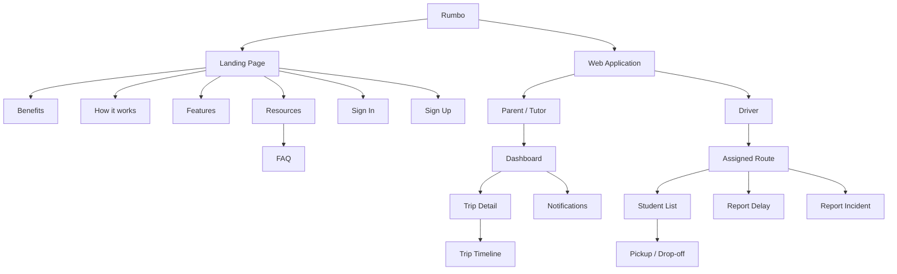
```mermaid
flowchart TD
    A["Rumbo"] --> B["Landing Page"]
    A --> C["Web Application"]

    B --> B1["Benefits"]
    B --> B2["How it works"]
    B --> B3["Features"]
    B --> B4["Resources"]
    B4 --> B41["FAQ"]
    B --> B5["Sign In"]
    B --> B6["Sign Up"]

    C --> P["Parent / Tutor"]
    C --> D["Driver"]

    P --> P1["Dashboard"]
    P1 --> P2["Trip Detail"]
    P2 --> P3["Trip Timeline"]
    P1 --> P4["Notifications"]

    D --> D1["Assigned Route"]
    D1 --> D2["Student List"]
    D2 --> D3["Pickup / Drop-off"]
    D1 --> D4["Report Delay"]
    D1 --> D5["Report Incident"]
```
Se compararán respuestas por segmento, separando **características objetivas** (edad, distrito, experiencia, dispositivo, navegador, canales y organización) y **características subjetivas** (motivaciones, frustraciones, necesidades, actitud hacia tecnología, privacidad y barreras). Los porcentajes se completarán solo con datos reales.

### 4.3.1. Landing Page Wireframe

<div align="center">
  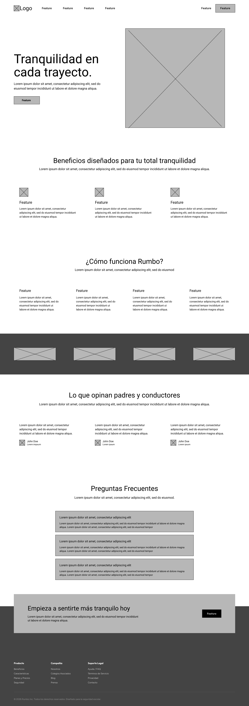
</div>

<br>

<div align="center">
  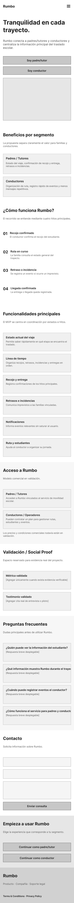
</div>

### 4.3.2. Landing Page Mock-up

<div align="center">
  
</div>

<br>

<div align="center">
  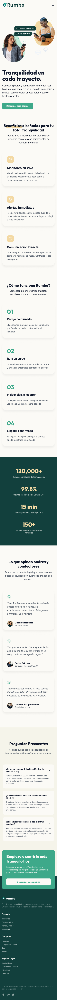
</div>

## 4.4. Web Applications UX/UI Design

El diseño de la Web Application considera dos experiencias principales: **padres/tutores** y **conductores**. En ambos casos se prioriza la información del trayecto, pero las acciones disponibles cambian según el rol. Los padres consultan; los conductores registran eventos de la ruta con la menor cantidad posible de pasos.

### 4.4.1. Web Applications Wireframes

Los wireframes se definieron a partir de las tareas centrales de cada segmento.

| Rol | Vista | Contenido principal |
|---|---|---|
| Padre/Tutor | Sign In | Correo, contraseña y recuperación de acceso. |
| Padre/Tutor | Dashboard | Estado actual, estudiante, conductor, vehículo y ETA. |
| Padre/Tutor | Trip Detail | Mapa o progreso de ruta y datos del trayecto. |
| Padre/Tutor | Trip Timeline | Recojo, retrasos, incidencias y llegada en orden cronológico. |
| Padre/Tutor | Notifications | Avisos relevantes asociados al estudiante. |
| Conductor | Sign In | Acceso seguro al panel de ruta. |
| Conductor | Assigned Route | Ruta activa, horario, paradas y estudiantes asignados. |
| Conductor | Student List | Estado de recojo o entrega de cada estudiante. |
| Conductor | Register Event | Confirmación rápida de recojo, llegada o entrega. |
| Conductor | Report Incident | Tipo de incidencia, descripción breve y registro del evento. |

La prioridad del wireframe es que la vista principal responda rápidamente a dos preguntas: **“¿qué está pasando en el trayecto?”** para la familia y **“¿qué debo registrar ahora?”** para el conductor.

### 4.4.2. Web Applications Wireflow Diagrams

#### Wireflow — Padre/Tutor

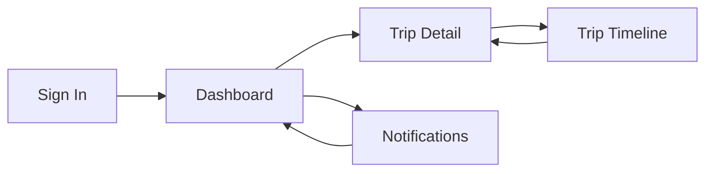
```mermaid
flowchart LR
    A[Sign In] --> B[Dashboard]
    B --> C[Trip Detail]
    C --> D[Trip Timeline]
    B --> E[Notifications]
    D --> C
    E --> B
```

El padre ingresa al Dashboard y desde allí puede revisar el estado actual, abrir el detalle del viaje, consultar el historial de eventos o revisar las notificaciones asociadas.

#### Wireflow — Conductor

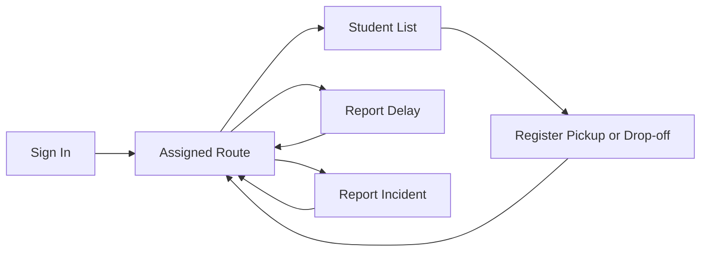
```mermaid
flowchart LR
    A[Sign In] --> B[Assigned Route]
    B --> C[Student List]
    C --> D[Register Pickup or Drop-off]
    B --> E[Report Delay]
    B --> F[Report Incident]
    D --> B
    E --> B
    F --> B
```

El conductor mantiene como punto central la ruta asignada. Las acciones de recojo, entrega, retraso e incidencia regresan al mismo panel para evitar navegación innecesaria durante la jornada.

### 4.4.3. Web Applications Mock-ups

<div align="center">
  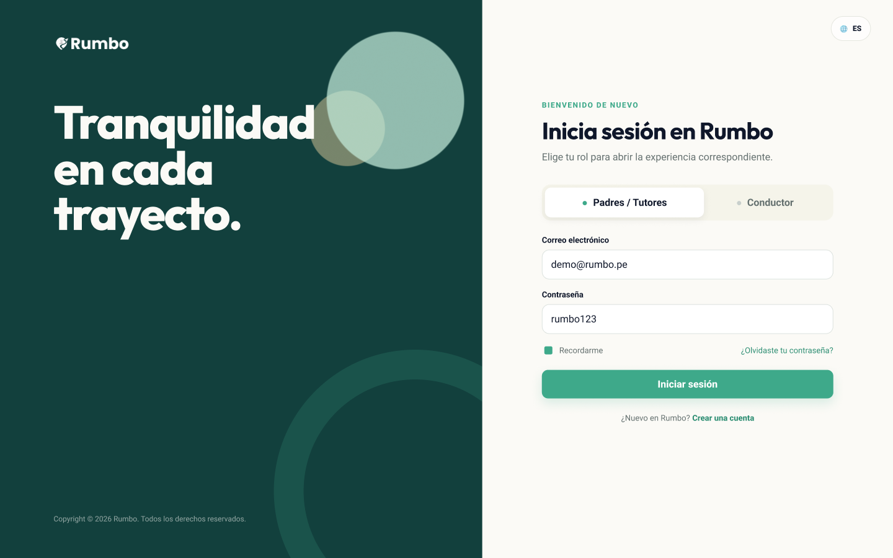
</div>

<br>

<div align="center">
  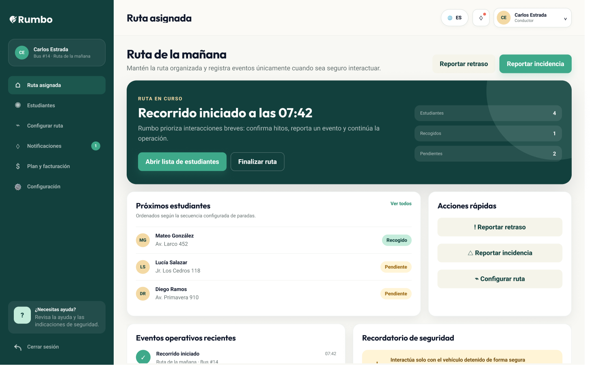
</div>

<br>

<div align="center">
  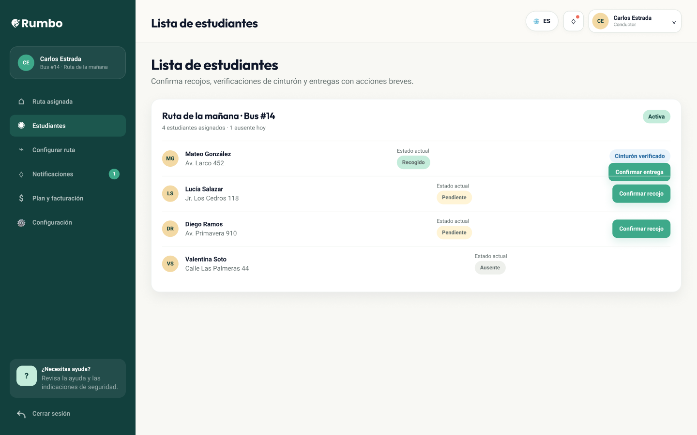
</div>

<br>

<div align="center">
  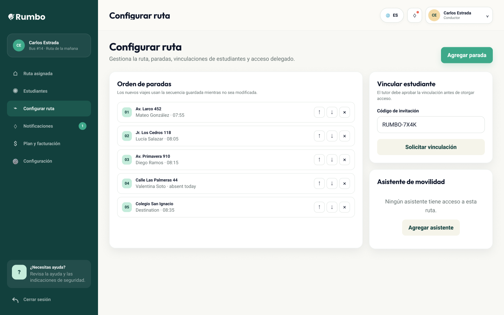
</div>

<br>

<div align="center">
  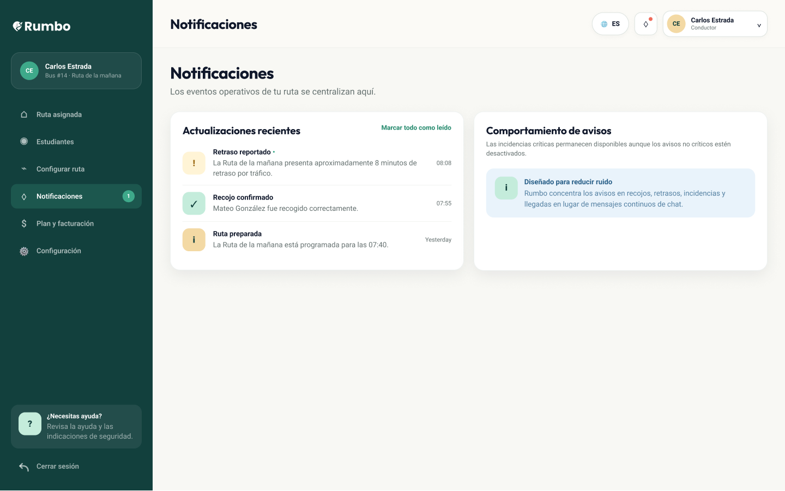
</div>

<br>

<div align="center">
  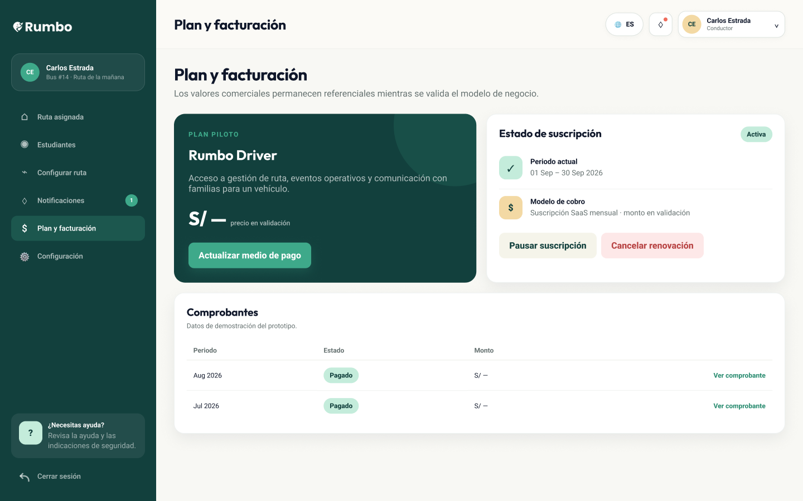
</div>

<br>

<div align="center">
  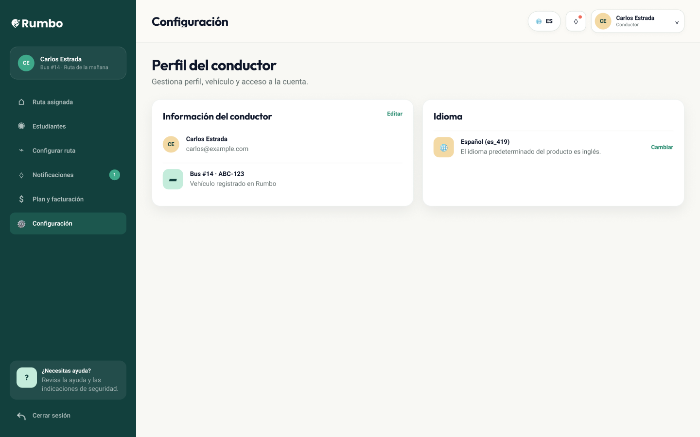
</div>

<br>

<div align="center">
  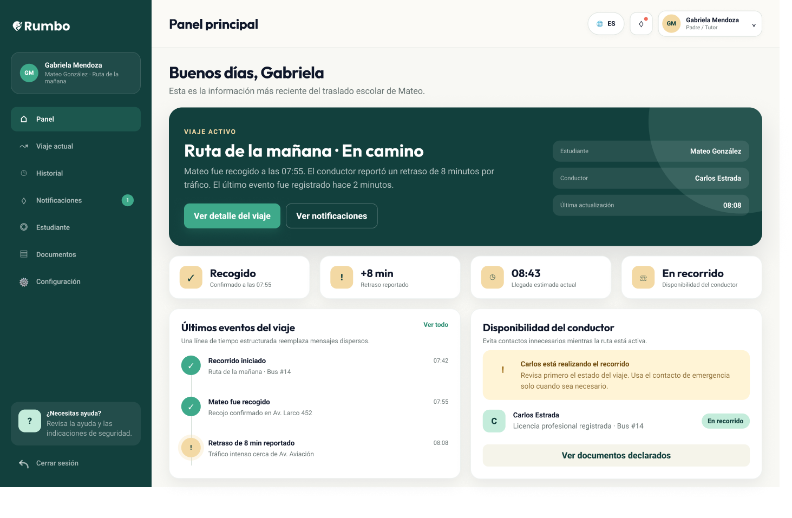
</div>

<br>

<div align="center">
  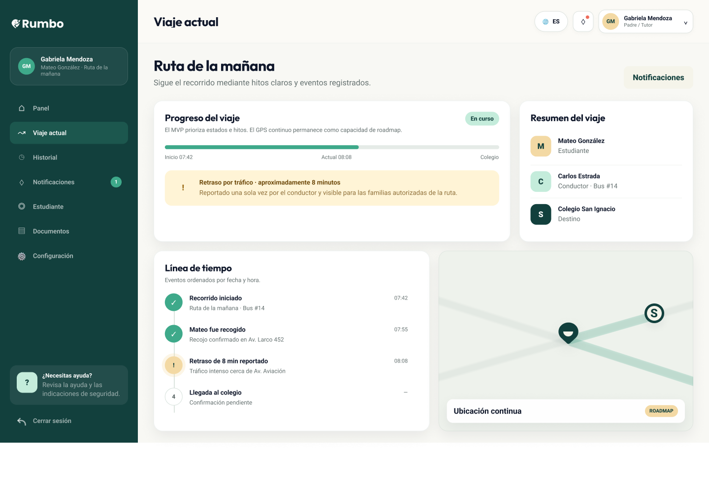
</div>

<br>

<div align="center">
  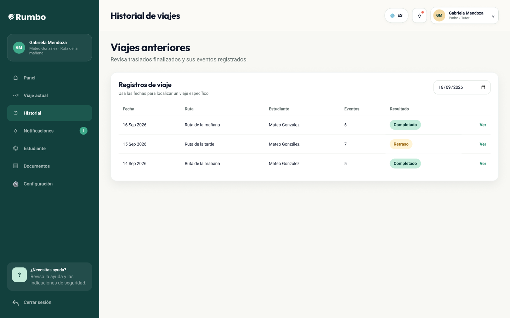
</div>

<br>

<div align="center">
  
</div>

<br>

<div align="center">
  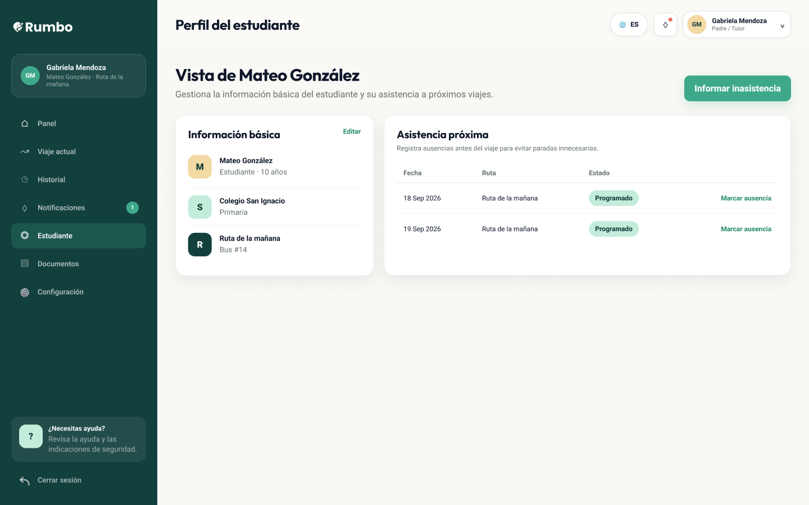
</div>

<br>

<div align="center">
  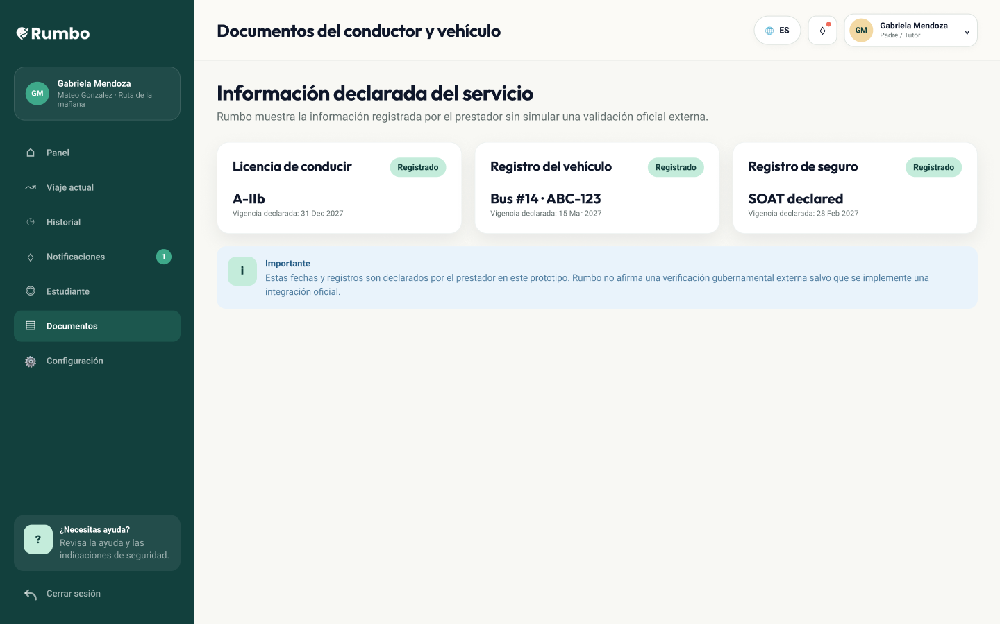
</div>

<br>

<div align="center">
  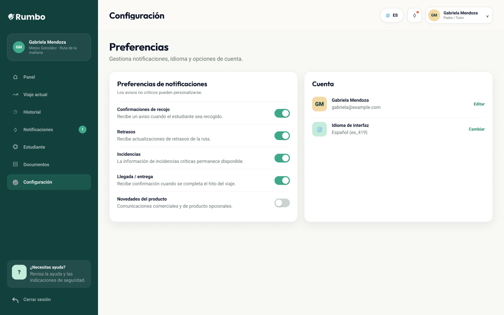
</div>

### 4.4.4. Web Applications User Flow Diagrams

#### User Flow — Padre/Tutor

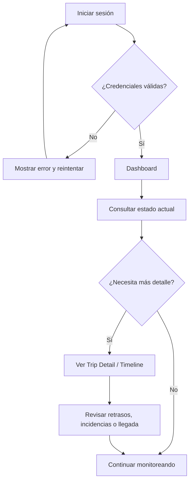
```mermaid
flowchart TD
    A[Iniciar sesión] --> B{¿Credenciales válidas?}
    B -- No --> C[Mostrar error y reintentar]
    C --> A
    B -- Sí --> D[Dashboard]
    D --> E[Consultar estado actual]
    E --> F{¿Necesita más detalle?}
    F -- Sí --> G[Ver Trip Detail / Timeline]
    F -- No --> H[Continuar monitoreando]
    G --> I[Revisar retrasos, incidencias o llegada]
    I --> H
```

#### User Flow — Conductor

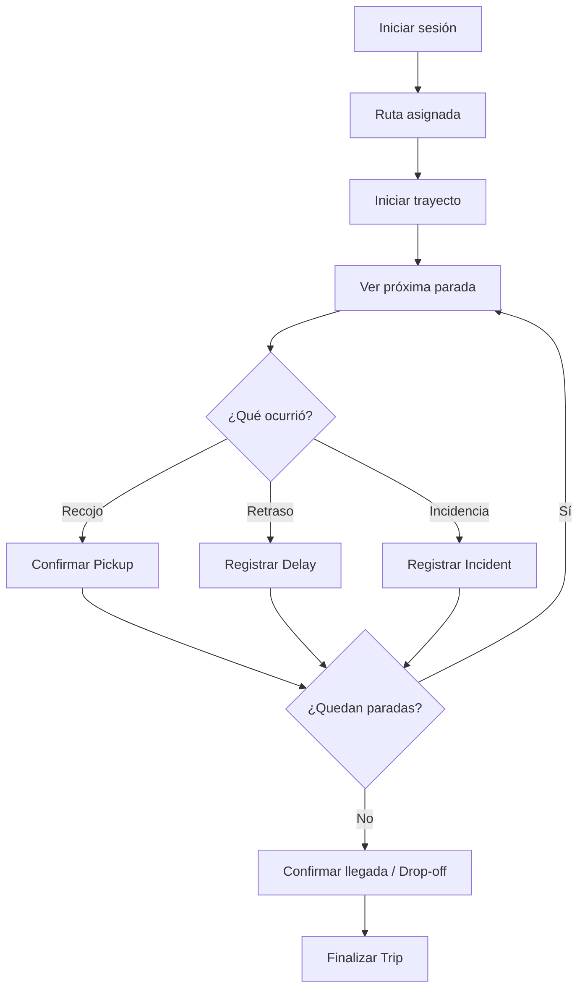
```mermaid
flowchart TD
    A[Iniciar sesión] --> B[Ruta asignada]
    B --> C[Iniciar trayecto]
    C --> D[Ver próxima parada]
    D --> E{¿Qué ocurrió?}
    E -- Recojo --> F[Confirmar Pickup]
    E -- Retraso --> G[Registrar Delay]
    E -- Incidencia --> H[Registrar Incident]
    F --> I{¿Quedan paradas?}
    G --> I
    H --> I
    I -- Sí --> D
    I -- No --> J[Confirmar llegada / Drop-off]
    J --> K[Finalizar Trip]
```

Los flujos reducen bifurcaciones y evitan acciones largas en el perfil del conductor. Las operaciones críticas se realizan desde la ruta activa y generan un evento que luego puede ser consultado por los padres.

## 4.5. Web Applications Prototyping

<div align="center">
  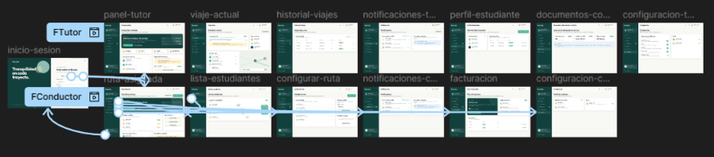
</div>

## 4.6. Domain-Driven Software Architecture

### 4.6.1. Design-Level Event Storming

El **Design-Level Event Storming** permite detallar el comportamiento interno de cada parte del dominio de Rumbo a partir de **Actors, Commands, Aggregates, Domain Events, Business Policies, Read Models y Hotspots**. Para esta etapa se mantuvo la división en seis Bounded Contexts, de modo que cada uno concentre reglas y responsabilidades relacionadas y pueda evolucionar sin mezclar lógica de otros contextos.

Los seis Bounded Contexts identificados son:

| Bounded Context | Responsabilidad |
|---|---|
| **Profiles and Verification** | Gestiona los perfiles de padres, conductores y estudiantes, así como vehículos, documentación registrada y vínculos autorizados. |
| **Identity and Access Management (IAM)** | Gestiona cuentas, autenticación, recuperación de acceso, roles y permisos. |
| **Route and Trip Planning** | Gestiona rutas, paradas, asignaciones de estudiantes, turnos, programación y ausencias. |
| **Real-Time Tracking and Execution** | Gestiona la ejecución del viaje, recojos, entregas, estados y línea de tiempo del trayecto. |
| **Alerting and Incident Management** | Gestiona retrasos, incidencias, alertas, notificaciones y preferencias de aviso. |
| **Subscriptions and Billing** | Gestiona planes, suscripciones, pagos, renovaciones y comprobantes. |

Para mantener una lectura uniforme de los diagramas se utilizan las siguientes convenciones: **amarillo** para Actors, **azul** para Commands, **azul claro** para Aggregates, **naranja** para Domain Events, **morado** para Business Policies, **verde** para Read Models y **fucsia** para Hotspots.

#### Profiles and Verification Bounded Context

Este fue el primer Bounded Context modelado por el equipo. Representa el registro y consulta de información de padres, conductores, estudiantes y vehículos, así como la relación autorizada entre estudiante y conductor.


> En Rumbo, la verificación se limita a controles internos sobre la información y la vigencia declarada de documentos registrados. No se asume validación oficial con ATU, Policía u otra entidad pública mientras dicha integración no exista.

#### Identity and Access Management (IAM) Bounded Context

Este contexto controla el acceso a Rumbo. Incluye registro de cuenta, autenticación, recuperación de contraseña y aplicación de permisos según el rol del usuario.

<div align="center">
  
</div>

#### Route and Trip Planning Bounded Context

Este contexto organiza la planificación operativa del servicio. Incluye la creación de rutas, la gestión de paradas, la asignación de estudiantes y la programación diaria de recorridos.

<div align="center">
  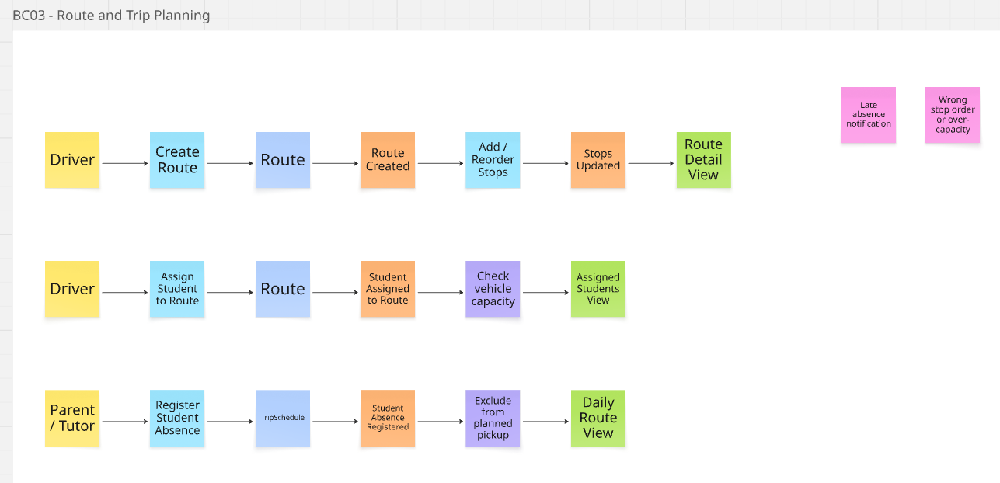
</div>

#### Real-Time Tracking and Execution Bounded Context

Este contexto supervisa la ejecución del trayecto en tiempo real. Incluye el inicio del viaje, registro de ubicación, confirmación de recojo y descenso, verificación de cinturón y cierre del trayecto.

<div align="center">
  
</div>

#### Alerting and Incident Management Bounded Context

Este contexto gestiona retrasos, incidencias y comunicaciones relevantes hacia las familias. Incluye notificaciones, alertas automáticas y el registro de incidentes ocurridos durante el servicio.

<div align="center">
  
</div>

#### Subscriptions and Billing Bounded Context

Este contexto administra la suscripción del conductor a la plataforma. Incluye selección de plan, pagos, comprobantes, renovación, pausa, cancelación y reactivación del servicio.

<div align="center">
  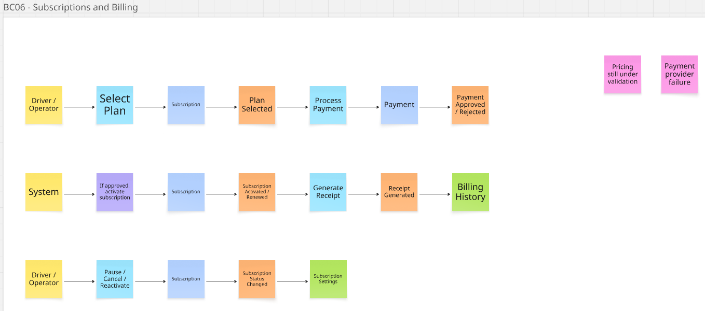
</div>

En conjunto, los seis Bounded Contexts establecen la base para los Class Diagrams y Database Diagrams de las secciones 4.7 y 4.8. La división evita concentrar toda la lógica en un único modelo y mantiene trazabilidad entre las User Stories, el comportamiento del dominio y el diseño técnico.

**Tablero editable de Design-Level Event Storming:** [Rumbo - Design-Level Event Storming](https://miro.com/app/board/uXjVHl8Ic-k=/)


### 4.6.2. Software Architecture Context Diagram

Este diagrama muestra la visión general del sistema Rumbo, posicionando la plataforma en el centro y detallando sus interacciones con los usuarios (padres y conductores) y dependencias externas (Auth0, Google Maps, FCM y SendGrid).


### 4.6.3. Software Architecture Container Diagrams

Este diagrama expone la arquitectura física y de despliegue. Divide el sistema en contenedores ejecutables: la Landing Page, la aplicación cliente (SPA en Angular), la lógica de negocio (API en Spring Boot)


### 4.6.4. Software Architecture Components Diagrams

Este diagrama profundiza en el contenedor lógico del backend (API Application). Muestra la estructura interna basada en el patrón MVC utilizado en Spring Boot, detallando los controladores (REST y WebSockets), los servicios que encapsulan las reglas de negocio, la capa de acceso a datos mediante repositorios y la barrera de seguridad (Security Filter).


Este diagrama hace foco en la arquitectura interna de la Single Page Application (SPA) desarrollada en Angular. Detalla la separación de responsabilidades entre el enrutador protegido (AuthGuard), los componentes visuales de las vistas (mapas y paneles de gestión) y los servicios encargados de la conexión persistente (WebSockets) y el consumo de la API.


## 4.7. Software Object-Oriented Design

### 4.7.1. Class Diagrams

Los Class Diagrams se presentan por **Bounded Context** para mantener la separación definida en el Design-Level Event Storming. Los diagramas incluyen clases, interfaces, enumeraciones, atributos, métodos, visibilidad, relaciones y multiplicidades, de acuerdo con el nivel de detalle solicitado para el diseño orientado a objetos.

#### Profiles and Verification


#### Identity and Access Management (IAM)


#### Route and Trip Planning


#### Real-Time Tracking and Execution


#### Alerting and Incident Management


#### Subscriptions and Billing


## 4.8. Database Design

El diseño de persistencia se divide por los mismos **Bounded Contexts** definidos en el modelado DDD. Cada diagrama representa las tablas, columnas, claves primarias, claves foráneas y relaciones que permiten persistir la información administrada por su contexto. Los ERD fueron elaborados en **Lucidchart** y se incorporan al informe como imágenes legibles junto con su fuente editable.

### 4.8.1. Database Diagrams

#### Profiles and Verification

Incluye perfiles de padres, conductores y estudiantes, vehículos, documentos registrados y vínculos entre estudiantes y conductores.

<div align="center">
  
</div>

**Fuente editable:** https://lucid.app/lucidchart/c71a5220-bf71-4924-bbd8-cdec37c2f06c/edit

#### Identity and Access Management (IAM)

Incluye cuentas, credenciales, roles, permisos, relaciones de autorización y tokens de recuperación de acceso.

<div align="center">
  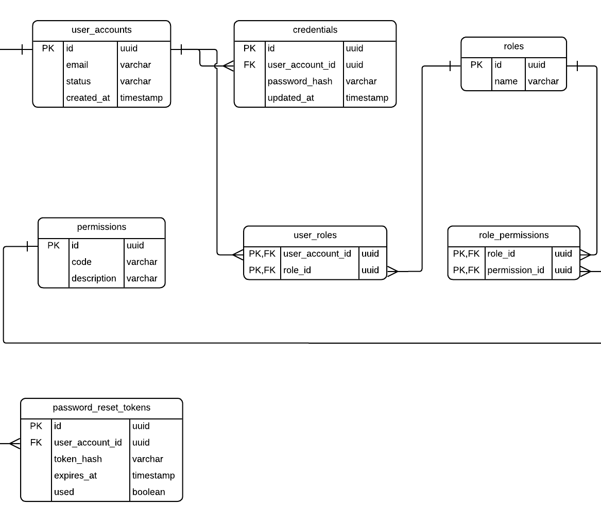
</div>

**Fuente editable:** https://lucid.app/lucidchart/f8fd5cb8-8ed5-4ac9-ae4f-0127d8369a18/edit

#### Route and Trip Planning

Incluye rutas, paradas, asignaciones de estudiantes, programación de viajes y ausencias.

<div align="center">
  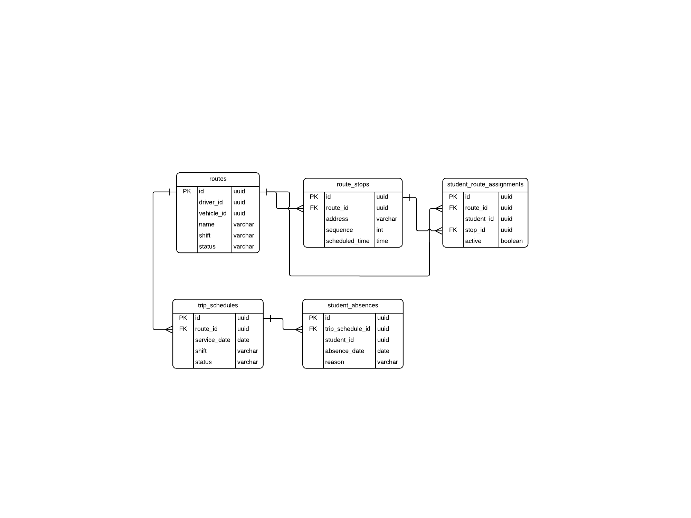
</div>

**Fuente editable:** https://lucid.app/lucidchart/dc535238-b74a-409c-9270-8bfcf4ea11a7/edit

#### Real-Time Tracking and Execution

Incluye viajes, estudiantes del viaje, eventos, recojos, entregas, verificaciones y registros de ubicación previstos para la evolución del producto.

<div align="center">
  
</div>

**Fuente editable:** https://lucid.app/lucidchart/3fcc7afd-47ae-4293-9ef2-66b0a7c74621/edit

#### Alerting and Incident Management

Incluye retrasos, incidencias, notificaciones, destinatarios y preferencias de notificación.

<div align="center">
  
</div>

**Fuente editable:** https://lucid.app/lucidchart/b464254e-0388-492e-862d-b93d5ee3e25f/edit

#### Subscriptions and Billing

Incluye planes, suscripciones, pagos y comprobantes asociados al ciclo comercial.

<div align="center">
  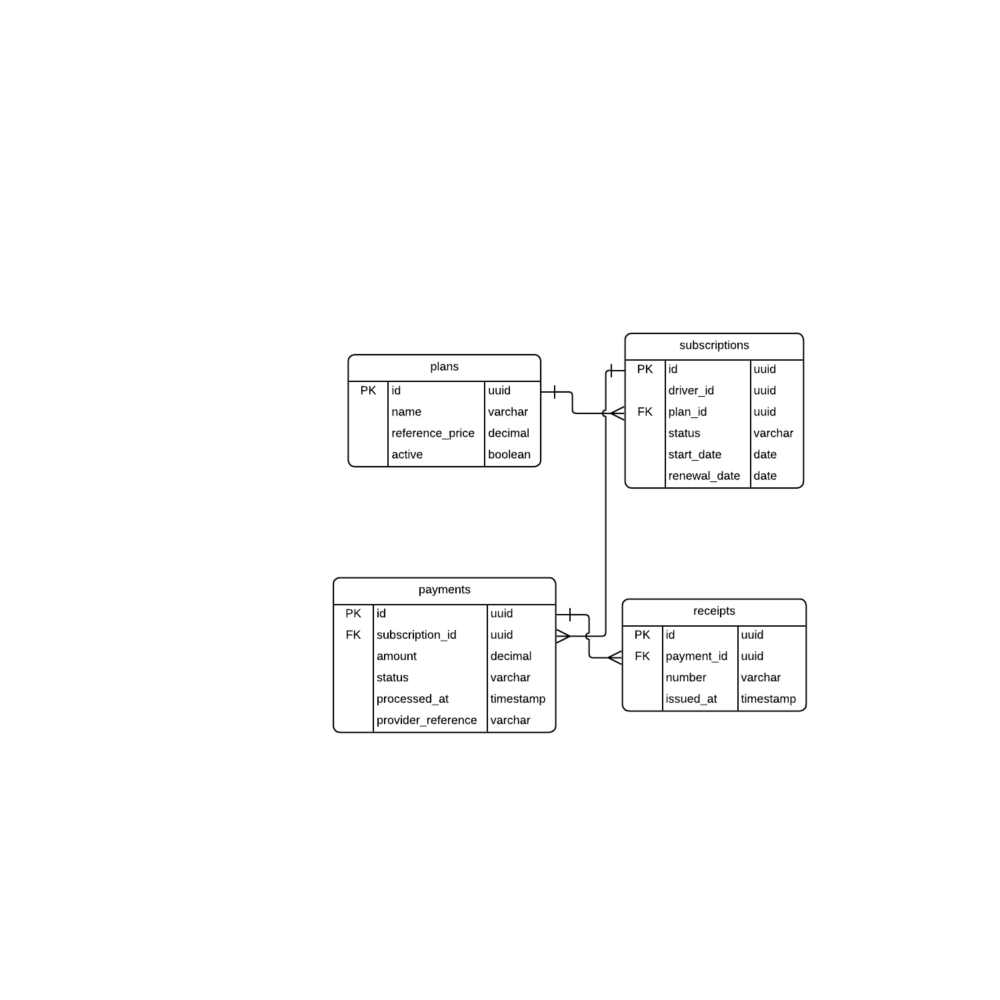
</div>

**Fuente editable:** https://lucid.app/lucidchart/178dfc99-92f9-4eef-8699-ecd2085c650a/edit

---

# Capítulo V: Product Implementation, Validation & Deployment

## 5.1. Software Configuration Management

### 5.1.1. Software Development Environment Configuration

Para el desarrollo de Rumbo se definieron las siguientes herramientas:

| Herramienta | Uso en el proyecto |
|---|---|
| GitHub | Repositorios, control de versiones y colaboración. |
| Git | Control de versiones local. |
| Visual Studio Code / WebStorm | Desarrollo de la Landing Page y Frontend Web Application. |
| IntelliJ IDEA | Desarrollo de Web Services con Java. |
| Figma | Wireframes, Mock-ups y prototipos. |
| HTML5, CSS3 y JavaScript | Implementación de la Landing Page. |
| Angular, TypeScript y Angular Material | Frontend Web Application. |
| Java, Spring Boot y Spring Data JPA | RESTful Web Services. |
| OpenAPI / Swagger | Documentación de Web Services. |
| GitHub Pages | Despliegue de la Landing Page. |
| Markdown | Documentación del Project Report. |

Para AV1 la implementación se concentra en la primera versión de la Landing Page. El Frontend Web Application y los Web Services se desarrollarán en los siguientes Sprints.

### 5.1.2. Source Code Management

- Project Report: https://github.com/AIpaca-OS/project-report
- Landing Page: https://github.com/AIpaca-OS/landing-page
- Frontend Web Application: https://github.com/AIpaca-OS/frontend-web-application
- Web Services: https://github.com/AIpaca-OS/web-services

GitHub es la plataforma utilizada para administrar el código y la documentación de Rumbo.

#### Repositorios

- **Project Report:** https://github.com/AIpaca-OS/project-report
- **Landing Page:** https://github.com/AIpaca-OS/landing-page
- **Frontend Web Application:** https://github.com/AIpaca-OS/frontend-web-application
- **Web Services:** https://github.com/AIpaca-OS/web-services

#### GitFlow

El proyecto utiliza el siguiente flujo de ramas:

- `main`: versión estable.
- `develop`: integración del trabajo del equipo.
- `feature/*`: trabajo de una funcionalidad o sección específica.
- `release/*`: preparación de una versión.
- `hotfix/*`: correcciones urgentes.

En el Project Report se emplean ramas como:

- `feature/chapter-1-introduction`
- `feature/chapter-2-requirements-elicitation-and-analysis`
- `feature/chapter-3-requirements-specification`
- `feature/chapter-4-product-design`
- `feature/chapter-5-product-implementation-validation-and-deployment`

La Landing Page dispone de `main`, `develop` y `feature/landing-page-v1`. La primera carga funcional quedó registrada en `main`; los siguientes cambios se integrarán mediante el flujo `feature → develop → main`.

#### Convenciones

Para los commits se utilizará Conventional Commits:

- `feat`: nueva funcionalidad.
- `fix`: corrección.
- `docs`: documentación.
- `style`: cambios de formato.
- `refactor`: reorganización de código.
- `test`: pruebas.
- `chore`: mantenimiento.

Las versiones seguirán Semantic Versioning con el formato `MAJOR.MINOR.PATCH`.

### 5.1.3. Source Code Style Guide & Conventions

#### HTML

La Landing Page utiliza HTML5 semántico, navegación mediante identificadores, atributos `alt` en imágenes y atributos ARIA cuando corresponde. Los nombres de clases se mantienen en `kebab-case`.

Ejemplo:

```html
<section class="section" id="beneficios">
```

#### CSS

Los estilos se organizan por secciones y utilizan variables CSS para colores, tipografías, radios y sombras. El diseño responsive se implementa con Grid, Flexbox y media queries.

```css
:root {
  --azul: #12403D;
  --verde: #3EA98A;
  --arena: #F3D9A4;
}
```

También se considera `prefers-reduced-motion` para mejorar la accesibilidad.

#### JavaScript

JavaScript se utiliza para el menú móvil y la validación básica del formulario de contacto. El código utiliza `strict mode`, nombres descriptivos y `camelCase` para variables y funciones.

#### Frontend Web Application

Para Angular y TypeScript se seguirán las convenciones oficiales del framework, utilizando `PascalCase` para clases y componentes y `camelCase` para variables y funciones.

#### Web Services

Para Java y Spring Boot se utilizará `PascalCase` para clases, `camelCase` para atributos y métodos y una organización por responsabilidades y bounded contexts. Los endpoints serán documentados con OpenAPI/Swagger.

### 5.1.4. Software Deployment Configuration

Para la primera versión de la Landing Page se utilizó **GitHub Pages** como plataforma de publicación.

| Configuración | Valor |
|---|---|
| **Repository** | `AIpaca-OS/landing-page` |
| **Source** | Deploy from a branch |
| **Branch** | `main` |
| **Folder** | `/(root)` |
| **Entry point** | `index.html` |

**Repositorio:** https://github.com/AIpaca-OS/landing-page  
**URL pública:** https://aipaca-os.github.io/landing-page/

La configuración quedó activa y GitHub Pages reporta el sitio como publicado.

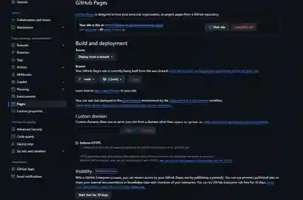

La configuración de despliegue del Frontend Web Application y de los Web Services se realizará en los siguientes Sprints.

## 5.2. Landing Page, Services & Applications Implementation

### 5.2.1. Sprint 1

Durante el Sprint 1 se implementó la primera versión funcional de la Landing Page de Rumbo con HTML5, CSS3 y JavaScript. El estado actual del repositorio incluye la propuesta de valor, beneficios, explicación del servicio, FAQ, llamados a la acción, navegación responsive y comportamiento interactivo del menú y acordeones.

La Landing Page se encuentra publicada mediante GitHub Pages. Las historias de multilenguaje, documentos legales completos y formulario público de contacto continúan pendientes y se registran con su estado real en el Sprint Backlog.

### 5.2.1.1. Sprint Planning 1

| Campo | Detalle |
|---|---|
| **Sprint** | Sprint 1 |
| **Periodo** | 09/09/2026 - 15/09/2026 |
| **Prepared By** | Lino Quispe, Leonardo Miguel |
| **Attendees** | Alejandro Díaz, Kevin Geronimo, Leonardo Lino, Alexandra Meza y Diana Pareja |
| **Sprint Goal** | Implementar la primera versión de la Landing Page de Rumbo, preparar su despliegue y avanzar los artefactos requeridos para AV1. |

**Sprint Review:** se obtuvo una primera versión funcional de la Landing Page, con navegación responsive, las secciones principales del producto y despliegue público mediante GitHub Pages.

**Sprint Retrospective:** se identificó como punto de mejora mantener las integraciones mediante `feature → develop → main` para conservar un historial más ordenado.

#### 5.2.1.2. Aspect Leaders and Collaborators

| Aspecto | Líder | Colaboradores |
|---|---|---|
| Project Report y Capítulo V | Leonardo Lino | Equipo |
| Investigación y entrevistas | Alexandra Meza | Equipo |
| Landing Page UX/UI | Alejandro Díaz | Kevin Geronimo |
| Landing Page Development | Kevin Geronimo | Alejandro Díaz |
| Requirements & Product Design | Diana Pareja | Equipo |
| Deployment & Evidence | Leonardo Lino | Kevin Geronimo |

### 5.2.1.3. Sprint Backlog 1

El Sprint Backlog se actualiza para relacionar explícitamente cada Work-item/Task con la User Story que lo origina, tal como solicita la plantilla del curso. Los tasks de despliegue, documentación o coordinación que no dependen de una User Story específica se identifican como **N/A**.

<div align="center">
  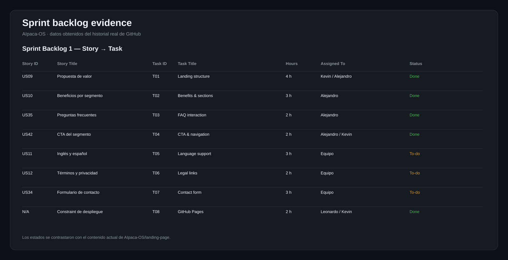
</div>

| Story ID | Story Title | Task ID | Task Title | Task Description | Estimation (Hours) | Assigned To | Status |
|---|---|---|---|---|---:|---|---|
| US09 | Presentar propuesta de valor en Landing Page | T01 | Landing structure | Implementar hero, propuesta de valor y estructura principal de navegación. | 4 | Kevin Geronimo / Alejandro Díaz | Done |
| US10 | Presentar beneficios por segmento | T02 | Benefits & service sections | Implementar beneficios y explicación resumida del funcionamiento de Rumbo. | 3 | Alejandro Díaz | Done |
| US35 | Sección de preguntas frecuentes por segmento | T03 | FAQ interaction | Implementar sección FAQ y comportamiento de acordeón con JavaScript. | 2 | Alejandro Díaz | Done |
| US42 | Acceder a Rumbo desde el CTA del segmento | T04 | CTA & navigation | Implementar CTAs y navegación visual hacia registro/acceso; queda pendiente enlazar el frontend funcional. | 2 | Alejandro Díaz / Kevin Geronimo | To-Review |
| US11 | Soportar inglés y español en Landing Page | T05 | Language support | Implementar selector de idioma y persistencia de preferencia. | 3 | Equipo | To-do |
| US12 | Acceder a términos y condiciones desde el footer | T06 | Legal links | Crear y enlazar Terms & Conditions y Privacy Policy reales desde el footer. | 2 | Equipo | To-do |
| US34 | Formulario público de contacto | T07 | Contact form | Implementar formulario público con validación y confirmación de envío. | 3 | Equipo | To-do |
| N/A | Constraint responsive | T08 | Responsive redesign | Ajustar layout, navegación móvil y estilos para diferentes tamaños de pantalla. | 4 | Alejandro Díaz / Kevin Geronimo | Done |
| N/A | Deployment | T09 | GitHub Pages | Publicar la Landing Page desde `main` y registrar la evidencia de despliegue. | 2 | Leonardo Lino / Kevin Geronimo | Done |
| N/A | Requirements documentation | T10 | Requirements expansion | Completar y consolidar User Stories, Technical Stories, Impact Mapping y Product Backlog. | 6 | Diana Pareja / Equipo | Done |
| N/A | Product Design / DDD | T11 | DDD evidence | Completar Bounded Contexts, Class Diagrams y Database Diagrams. | 6 | Kevin Geronimo / Diana Pareja / Equipo | Done |
| N/A | Product Design / UX | T12 | Web & Mobile Figma flows | Completar Wireframes, Wireflows, Mock-ups, User Flows y Prototype responsive. | 6 | Alejandro Díaz / Equipo | In-Process |
| N/A | Chapter V evidence | T13 | Sprint evidence update | Documentar commits, colaboración, ejecución y despliegue con evidencia verificable. | 4 | Leonardo Lino | In-Process |

> **Nota:** la captura corresponde a una vista consolidada del backlog documentado. La plantilla también solicita la URL pública del Board de control. Si el equipo mantiene un Board externo (Trello/GitHub Project), su URL debe añadirse aquí antes de la entrega final.

#### 5.2.1.4. Development Evidence for Sprint Review

La implementación funcional de AV1 se concentra en la **Landing Page**. El repositorio muestra una primera carga del producto, un rediseño posterior y una implementación adicional de comportamiento JavaScript. Los repositorios de Frontend Web Application y Web Services existen y cuentan con su foundation inicial, pero todavía no presentan features funcionales de negocio; por ello se documentan sin atribuirles implementación que aún no existe.

<div align="center">
  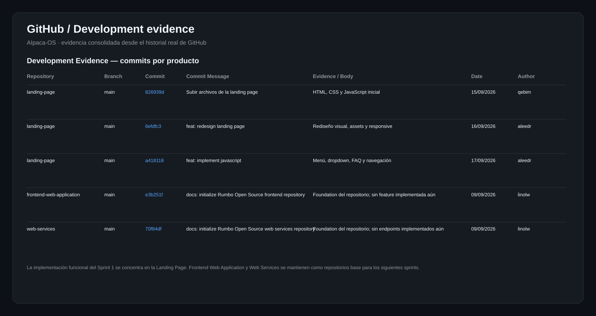
</div>

| Repository | Branch | Commit ID | Commit Message | Commit Message Body | Commited on (Date) |
|---|---|---|---|---|---|
| `AIpaca-OS/landing-page` | `main` | [`826939d`](https://github.com/AIpaca-OS/landing-page/commit/826939d379fd977780cb7b2cb6091e02a50ad95f) | Subir archivos de la landing page | No registra body adicional. El commit incorpora `index.html`, `css/styles.css`, JavaScript y recursos base. | 15/09/2026 |
| `AIpaca-OS/landing-page` | `main` | [`6efdfc3`](https://github.com/AIpaca-OS/landing-page/commit/6efdfc3) | feat: redesign landing page | No registra body adicional. Modifica `index.html` y más de 1000 líneas de CSS, además de incorporar assets visuales. | 16/09/2026 |
| `AIpaca-OS/landing-page` | `main` | [`a418118`](https://github.com/AIpaca-OS/landing-page/commit/a41811897fc24576d16c8f0d5b32089e50db7811) | feat: implement javascript | No registra body adicional. Añade `js/app.js` y actualiza HTML/CSS para menú responsive, dropdown, FAQ y navegación. | 17/09/2026 |
| `AIpaca-OS/frontend-web-application` | `main` | [`e3b251f`](https://github.com/AIpaca-OS/frontend-web-application/commit/e3b251f56778b1fb7cf0edf0f7d0744a8c5b80b3) | docs: initialize Rumbo Open Source frontend repository | Foundation documental del repositorio; aún no constituye una feature funcional de Sprint 1. | 09/09/2026 |
| `AIpaca-OS/web-services` | `main` | [`70f84df`](https://github.com/AIpaca-OS/web-services/commit/70f84df831634feaacbd25a92933f9edf97edf61) | docs: initialize Rumbo Open Source web services repository | Foundation documental del repositorio; aún no existen endpoints funcionales de negocio para AV1. | 09/09/2026 |

Los commits del 16 y 17 de septiembre corresponden a estabilización y mejora posterior a la primera revisión de AV1; se incluyen para que la evidencia represente el **estado actual real** del producto.

#### 5.2.1.5. Execution Evidence for Sprint Review

**Landing Page:** https://github.com/AIpaca-OS/landing-page

La Landing Page fue ejecutada en vista Desktop y se verificaron sus principales secciones: Hero, indicadores, funcionamiento del trayecto, beneficios, funcionalidades, testimonios, FAQ, CTA y footer.

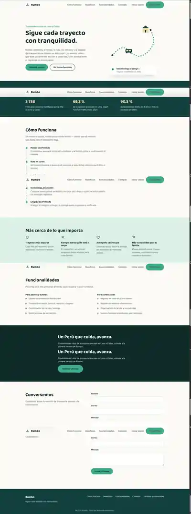

También se verificó el comportamiento responsive. En vista Mobile, la navegación se reorganiza en un menú desplegable y mantiene acceso a las principales secciones de la página.

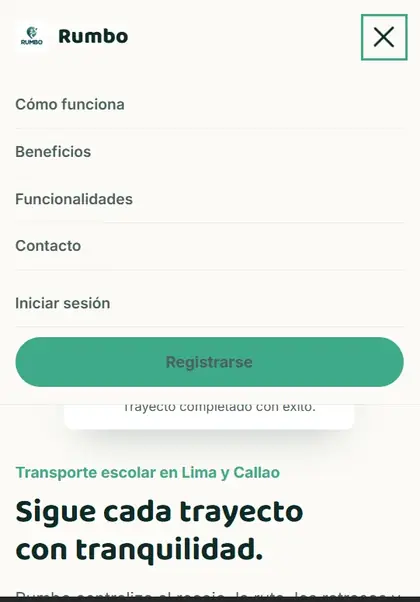

#### 5.2.1.6. Services Documentation Evidence for Sprint Review

Durante Sprint 1 no se implementaron Web Services. El repositorio `web-services` se encuentra preparado para el desarrollo posterior con Java, Spring Boot y Spring Data JPA. La documentación OpenAPI/Swagger se incorporará cuando existan endpoints implementados.

#### 5.2.1.7. Software Deployment Evidence for Sprint Review

Para el despliegue se utilizó GitHub Pages con la opción **Deploy from a branch**, utilizando `main` y `/(root)` como origen.

La configuración quedó activa y el sitio fue publicado correctamente.


**URL pública:** https://aipaca-os.github.io/landing-page/

La siguiente evidencia muestra la Landing Page cargada desde la URL pública de GitHub Pages.


#### 5.2.1.8. Team Collaboration Insights during Sprint

La colaboración del equipo se verificó mediante el historial de `develop`, los commits de la Landing Page y los Pull Requests del Project Report. La evidencia muestra contribuciones distribuidas entre investigación, requirements, Product Design, DDD, implementación de Landing Page, Chapter V y consolidación del informe.

<div align="center">
  
</div>

Para el Project Report se consultaron los **100 commits más recientes de `develop`**. Dentro de esa muestra se identifican contribuciones de `linolw`, `DianaParejaCaceres`, `AlexandraYMS`, `qebim18` y `aleedr`. La Landing Page añade commits de implementación realizados por `qebim`, `aleedr` y `linolw`.

<div align="center">
  
</div>

<div align="center">
  
</div>

En el Project Report existen **13 Pull Requests registrados**, de los cuales **12 fueron merged** y **uno fue cerrado sin merge (#11)**. Entre los PR integrados se encuentran el trabajo de Requirements Elicitation (#1), Product Design inicial (#2, #3 y #5), Chapter V (#4), Requirements Specification (#9), consolidación de AV1 (#10) y las correcciones finales de DDD/Product Design (#12 y #13).

| Evidencia verificable | URL |
|---|---|
| Commits de `develop` | https://github.com/AIpaca-OS/project-report/commits/develop/ |
| Branches del Project Report | https://github.com/AIpaca-OS/project-report/branches |
| Network | https://github.com/AIpaca-OS/project-report/network |
| Contributors | https://github.com/AIpaca-OS/project-report/graphs/contributors |
| Pull Requests | https://github.com/AIpaca-OS/project-report/pulls?q=is%3Apr+is%3Aclosed |
| Commits de Landing Page | https://github.com/AIpaca-OS/landing-page/commits/main/ |

La actividad también evidencia una oportunidad de mejora: parte de la implementación de Landing Page llegó directamente a `main`, mientras que en el Project Report se utilizó con mayor frecuencia el flujo `feature → develop`. Para los siguientes sprints se recomienda mantener de forma consistente el GitFlow acordado y usar Pull Requests para las integraciones de código.


# Conclusiones

- La problemática de Rumbo se sustenta en un contexto real de transporte escolar formal, alta congestión urbana y elevada conectividad móvil en Lima Metropolitana.

- Los dos segmentos iniciales del proyecto son padres/tutores y conductores de movilidad escolar; las entrevistas de AV1 permitirán validar o corregir los supuestos planteados.

- Para AV1, la implementación se concentra en la primera versión de la Landing Page, que ya se encuentra implementada y desplegada mediante GitHub Pages. Angular y Spring Boot quedan definidos para los productos que se desarrollarán progresivamente en los siguientes Sprints.

# Bibliografía

[1] Autoridad de Transporte Urbano para Lima y Callao. (2026, 10 de enero). *Vacaciones útiles seguras: ATU exhorta a padres de familia a usar movilidades escolares autorizadas*.

[2] TomTom. (2026). *TomTom Traffic Index 2025: Lima, Peru*.

[3] Observatorio Nacional de Seguridad Vial. (2026). *Estadísticas de siniestralidad vial 2025*.

[4] Instituto Nacional de Estadística e Informática. (2026, 26 de marzo). *El 98,4% de los hogares de Lima Metropolitana contó con telefonía móvil durante el cuarto trimestre de 2025*.

[5] Elitech. (2026). *School Bus Tracker* (Versión 2.4) [Software]. https://schoolbustrackerapp.com/

[6] Logrit Dynamics SAS. (2025). *Bus esCool* (Versión 6.5.2) [Aplicación móvil]. App Store. https://apps.apple.com/pe/app/bus-escool/id1020568046

[7] Meta Platforms. (2026). *WhatsApp Messenger* (Versión 2.26) [Aplicación móvil]. Google Play Store. https://play.google.com/store/apps/details?id=com.whatsapp


- Comparabien. (2025, 22 de abril). [¿Cuánto se gana en movilidad escolar? Guía para emprendedores](https://comparabien.com.pe/blog-consejos/cuanto-gana-movilidad-escolar-guia-emprendedores).
- El Comercio. (2026, 26 de febrero). [Lima en el top 5 de ciudades con peor tráfico a nivel mundial](https://elcomercio.pe/lima/sucesos/lima-en-el-top-5-de-ciudades-con-peor-trafico-a-nivel-mundial-mas-de-8-dias-al-ano-atrapados-en-el-trafico-vehicular-tomtom-traffic-index-ultimas-noticia/).
- Energiminas. (2026, 7 de agosto). [Lima sigue siendo una de las ciudades latinoamericanas con menor velocidad de circulación](https://energiminas.com/2026/08/07/lima-sigue-siendo-una-de-las-ciudades-latinoamericanas-con-menor-velocidad-de-circulacion/).
- Escobedo, C. (2024). [Se publica el nuevo reglamento de protección de datos personales en Perú](https://iapp.org/news/a/se-publica-el-nuevo-reglamento-de-protecci-n-de-datos-personales-en-per-/). International Association of Privacy Professionals.
- Expreso. (2026, 1 de junio). [WhatsApp y Yape lideran el uso digital en Perú, según Erestel 2025](https://www.expreso.com.pe/actualidad/whatsapp-y-yape-lideran-el-uso-digital-en-peru-segun-erestel-2025-noticia/1291271).
- Gothelf, J., & Seiden, J. *Lean UX: Designing Great Products with Agile Teams*.
- Infobae. (2026, 10 de enero). [Movilidad escolar para el inicio de clases 2026: así puedes identificar vehículos autorizados por la ATU](https://www.infobae.com/peru/2026/01/10/movilidad-escolar-para-el-inicio-de-clases-2026-asi-puedes-identificar-vehiculos-autorizados-por-la-atu/).

- Angular: https://angular.dev/
- Angular Material: https://material.angular.dev/
- Spring Boot: https://spring.io/projects/spring-boot
- Spring Data JPA: https://spring.io/projects/spring-data-jpa
- OpenAPI: https://www.openapis.org/

---

# Anexos

## Videos de Exposición
**Microsoft Stream:** [Completar]

## Entrevistas de Needfinding
**Microsoft Stream:** [Completar]

## Navegación del Prototipo
**Microsoft Stream:** [Completar]

## Enlaces del proyecto
- https://github.com/AIpaca-OS/project-report
- https://github.com/AIpaca-OS/landing-page
- https://github.com/AIpaca-OS/frontend-web-application
- https://github.com/AIpaca-OS/web-services
