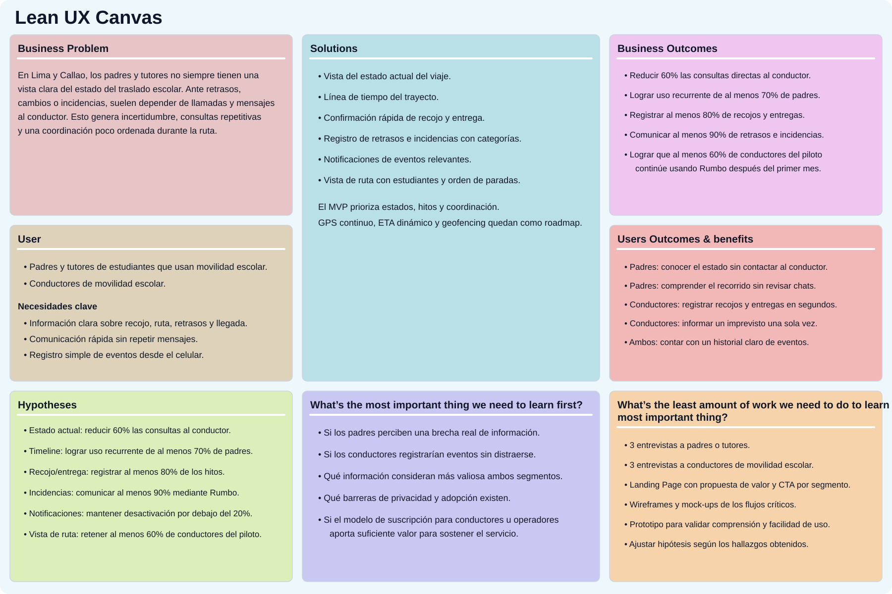

# UNIVERSIDAD PERUANA DE CIENCIAS APLICADAS

### Ingeniería de Software

### Ciclo Académico: 2026-20

### Código: 1ASI0729

### Curso: Desarrollo de Aplicaciones Open Source

### NRC: 7760

### Docente: [Completar]

# Informe de Trabajo Final

### Startup: Rumbo

### Producto: Rumbo

### Integrantes

| Apellidos y Nombres | Código de Alumno |
|---|---|
| Díaz Ramírez, Alejandro | U202423084 |
| Geronimo Puma, Kevin Joel | U202423163 |
| Lino Quispe, Leonardo Miguel | U202422298 |
| Meza Soza, Alexandra Yamile | U20241b451 |
| Pareja Caceres, Diana | U202422589 |

### SEPTIEMBRE - 2026

---

## Registro de Versiones del Informe

| Versión | Fecha | Autor(es) | Descripción de cambios |
|---|---|---|---|
| 0.1 | 09/09/2026 | Lino Quispe, Leonardo Miguel | Creación de la estructura base del informe. |
| 0.2 | 11/09/2026 | Equipo Rumbo | Actualización de integrantes y avance de los capítulos I y II para AV1. |

---

## Project Report Collaboration Insights

**Organización:** https://github.com/AIpaca-OS  
**Project Report:** https://github.com/AIpaca-OS/project-report  
**Landing Page:** https://github.com/AIpaca-OS/landing-page  
**Frontend Web Application:** https://github.com/AIpaca-OS/frontend-web-application  
**Web Services:** https://github.com/AIpaca-OS/web-services

### AV1

**Team Collaboration Commits**  
[Insertar captura]

**Team Collaboration Network**  
[Insertar captura]

**Contributors / Pull Requests**  
[Insertar capturas]

---

# Contenido

## Tabla de Contenidos

- [Student Outcome](#student-outcome)
- [Capítulo I: Introducción](#capítulo-i-introducción)
  - [1.1. Startup Profile](#11-startup-profile)
    - [1.1.1. Descripción de la Startup](#111-descripción-de-la-startup)
    - [1.1.2. Perfiles de integrantes del equipo](#112-perfiles-de-integrantes-del-equipo)
  - [1.2. Solution Profile](#12-solution-profile)
    - [1.2.1. Antecedentes y problemática](#121-antecedentes-y-problemática)
    - [1.2.2. Lean UX Process](#122-lean-ux-process)
      - [1.2.2.1. Lean UX Problem Statement](#1221-lean-ux-problem-statement)
      - [1.2.2.2. Lean UX Assumptions](#1222-lean-ux-assumptions)
      - [1.2.2.3. Lean UX Hypothesis Statements](#1223-lean-ux-hypothesis-statements)
      - [1.2.2.4. Lean UX Canvas](#1224-lean-ux-canvas)
  - [1.3. Segmentos objetivo](#13-segmentos-objetivo)
- [Capítulo II: Requirements Elicitation & Analysis](#capítulo-ii-requirements-elicitation--analysis)
  - [2.1. Competidores](#21-competidores)
  - [2.2. Entrevistas](#22-entrevistas)
  - [2.3. Needfinding](#23-needfinding)
  - [2.4. Big Picture Event Storming](#24-big-picture-event-storming)
  - [2.5. Ubiquitous Language](#25-ubiquitous-language)
- [Capítulo III: Requirements Specification](#capítulo-iii-requirements-specification)
- [Capítulo IV: Product Design](#capítulo-iv-product-design)
- [Capítulo V: Product Implementation, Validation & Deployment](#capítulo-v-product-implementation-validation--deployment)
- [Conclusiones](#conclusiones)
- [Bibliografía](#bibliografía)
- [Anexos](#anexos)

---

# Student Outcome

El curso contribuye al cumplimiento del **ABET – EAC – Student Outcome 3: Capacidad de comunicarse efectivamente con un rango de audiencias**.

| Criterio específico | Acciones realizadas | Conclusiones |
|---|---|---|
| Comunica oralmente con efectividad a diferentes rangos de audiencia. | **[Integrantes]** — AV1: [completar con participación real en entrevistas y exposición]. | [Conclusión grupal]. |
| Comunica por escrito con efectividad a diferentes rangos de audiencia. | **[Integrantes]** — AV1: [completar con participación real en informe, artefactos y documentación]. | [Conclusión grupal]. |

---

# Capítulo I: Introducción

## 1.1. Startup Profile

### 1.1.1. Descripción de la Startup

**Rumbo** es una startup peruana enfocada en mejorar la seguridad, visibilidad y coordinación durante el transporte escolar. La propuesta surge a partir de una situación cotidiana para muchas familias: durante los recorridos pueden presentarse variaciones de horario, congestión, retrasos, cambios en la ruta o incidencias que obligan a padres y conductores a intercambiar información de forma constante.

Rumbo plantea una plataforma web responsive que centraliza los principales eventos del traslado y permite que los padres comprendan rápidamente qué está ocurriendo durante el recorrido. Para los conductores, la plataforma busca reducir la repetición de mensajes individuales y facilitar el registro de hitos como recojos, llegadas, entregas, retrasos e incidencias.

La startup inicia su propuesta en Lima y Callao, donde existe un mercado formal de transporte escolar y una alta disponibilidad de conectividad móvil. Rumbo no reemplaza los mecanismos oficiales de autorización ni las responsabilidades de seguridad del prestador del servicio; busca complementar la experiencia con información estructurada, oportuna y accesible.

### 1.1.2. Perfiles de integrantes del equipo

<table>
  <thead>
    <tr><th>Foto</th><th>Apellidos y nombres</th><th>Código</th><th>Carrera</th><th>Habilidades</th></tr>
  </thead>
  <tbody>
    <tr><td align="center">[Insertar foto]</td><td>Díaz Ramírez, Alejandro</td><td>U202423084</td><td>Ingeniería de Software</td><td>[Completar perfil]</td></tr>
    <tr><td align="center">[Insertar foto]</td><td>Geronimo Puma, Kevin Joel</td><td>U202423163</td><td>Ingeniería de Software</td><td>[Completar perfil]</td></tr>
    <tr><td align="center">[Insertar foto]</td><td>Lino Quispe, Leonardo Miguel</td><td>U202422298</td><td>Ingeniería de Software</td><td>Soy estudiante de Ingeniería de Software del 4to ciclo en la UPC. Tengo conocimientos en programación en C++ y Python, y experiencia desarrollando proyectos académicos donde analizo y organizo soluciones tecnológicas. Me gusta enfocarme en aprender de forma práctica y en construir soluciones que sean claras, funcionales y aplicadas a problemas reales.</td></tr>
    <tr><td align="center">[Insertar foto]</td><td>Meza Soza, Alexandra Yamile</td><td>U20241b451</td><td>Ingeniería de Software</td><td>[Completar perfil]</td></tr>
    <tr><td align="center">[Insertar foto]</td><td>Pareja Caceres, Diana</td><td>U202422589</td><td>Ingeniería de Software</td><td>[Completar perfil]</td></tr>
  </tbody>
</table>

## 1.2. Solution Profile

### 1.2.1. Antecedentes y problemática

El transporte escolar constituye un servicio formal y regulado en Lima y Callao. En enero de 2026, la ATU informó que **3758 vehículos se encontraban habilitados para prestar el servicio de transporte de estudiantes** [1]. Según el **TomTom Traffic Index 2025**, Lima registró una congestión promedio de **69,3 %**, con aproximadamente **195 horas al año** perdidas en tráfico de hora punta [2]. El Observatorio Nacional de Seguridad Vial reportó para 2025 **88 243 siniestros de tránsito, 55 329 personas lesionadas y 3428 fallecidas** a nivel nacional [3].

El INEI informó además que durante el cuarto trimestre de 2025 **98,4 % de los hogares de Lima Metropolitana contaba con telefonía móvil**, **90,3 % de la población de 6 años a más utilizaba Internet** y **91,0 % de los usuarios de Internet accedía mediante teléfono celular** [4].

A partir de este contexto, Rumbo aborda la falta de una vista única y oportuna sobre el estado de la movilidad escolar, sus hitos, retrasos e incidencias.

#### Técnica de las 5 W's + 2 H's

**What:** falta de información centralizada sobre recojo, traslado, retrasos, llegada e incidencias.  
**When:** antes del recojo, durante el recorrido y al momento de la llegada o entrega.  
**Where:** Lima y Callao.  
**Who:** padres/tutores y conductores de movilidad escolar.  
**Why:** congestión, tiempos variables, mensajes individuales y consultas repetitivas.  
**How:** plataforma web responsive con estado del traslado, timeline, confirmaciones, retrasos, incidencias y notificaciones.  
**How much:** 3758 vehículos escolares habilitados y 69,3 % de congestión promedio en Lima durante 2025.

### 1.2.2. Lean UX Process

#### 1.2.2.1. Lean UX Problem Statement

La movilidad escolar opera en un contexto de tiempos variables y comunicación frecuente entre familias y conductores. Los padres necesitan conocer el estado del traslado sin depender exclusivamente de mensajes individuales y los conductores necesitan comunicar cambios, retrasos e incidencias de manera eficiente.

**¿Cómo podríamos mejorar la visibilidad y coordinación del transporte escolar para que los padres puedan conocer el estado del traslado y los conductores puedan comunicar los principales eventos de la ruta de forma rápida y ordenada?**

#### 1.2.2.2. Lean UX Assumptions

**Business Assumptions**
1. Existe valor en centralizar digitalmente la información de la ruta.
2. Los padres utilizarán Rumbo si pueden consultar información sin depender de mensajes individuales.
3. Los conductores adoptarán la solución si registrar eventos requiere pocos pasos.
4. La confianza dependerá de privacidad, permisos y protección de información del menor.

**User Assumptions**
- Padres/tutores necesitan consultar recojo, avance, llegada, retrasos e incidencias.
- Conductores necesitan organizar rutas y comunicar eventos sin repetir mensajes.
- Ambos segmentos utilizan principalmente experiencias móviles.

**Feature Assumptions**
- Estado actual del viaje.
- Línea de tiempo del trayecto.
- Confirmación de recojo y entrega.
- Seguimiento del progreso.
- Notificaciones.
- Registro de incidencias.

**User Outcomes & Benefits**
- Mayor tranquilidad y visibilidad para los padres.
- Menos consultas rutinarias al conductor.
- Mejor anticipación ante retrasos.
- Historial ordenado de eventos del recorrido.

#### 1.2.2.3. Lean UX Hypothesis Statements

1. Una vista del estado actual reducirá consultas directas al conductor.
2. Una línea de tiempo mejorará la comprensión de los eventos de la ruta.
3. Confirmaciones rápidas aumentarán la consistencia del registro de recojos y entregas.
4. Mostrar el progreso aumentará la visibilidad del recorrido.
5. Notificaciones de eventos relevantes mejorarán la coordinación.
6. Un registro estructurado de incidencias mejorará la claridad ante imprevistos.

#### 1.2.2.4. Lean UX Canvas

## 1.3. Segmentos objetivo

### Padres y tutores
Padres, madres o tutores responsables de menores que utilizan movilidad escolar en Lima y Callao. Buscan disminuir la incertidumbre durante los recorridos y acceder a información clara sobre recojo, traslado, retrasos, llegada e incidencias.

### Conductores de movilidad escolar
Conductores que realizan rutas programadas para estudiantes. Necesitan organizar horarios, puntos de recojo, retrasos e incidencias y comunicar los eventos principales de forma rápida y segura.

---

# Capítulo II: Requirements Elicitation & Analysis

## 2.1. Competidores

### 2.1.1. Análisis competitivo

| Criterio | Competidor 1 | Competidor 2 | Competidor 3 | Rumbo |
|---|---|---|---|---|
| Segmento | [Completar] | [Completar] | [Completar] | Padres/tutores y conductores |
| Seguimiento de ruta | [ ] | [ ] | [ ] | Sí |
| Confirmación recojo/entrega | [ ] | [ ] | [ ] | Sí |
| Línea de tiempo | [ ] | [ ] | [ ] | Sí |
| Incidencias | [ ] | [ ] | [ ] | Sí |
| Modelo | [ ] | [ ] | [ ] | SaaS |

### 2.1.2. Estrategias y tácticas frente a competidores
[Completar a partir del análisis competitivo real]

## 2.2. Entrevistas

Se realizarán entrevistas semiestructuradas para comprender hábitos, procesos actuales, frustraciones, motivaciones, necesidades, herramientas utilizadas y barreras de adopción de los segmentos objetivo. Se busca obtener información suficiente para el análisis posterior y para construir los artefactos de Needfinding.

### 2.2.1. Diseño de entrevistas

### Preguntas dirigidas al primer segmento — Padres y tutores

1. ¿Cuál es tu nombre completo, edad, ocupación y distrito de residencia?
2. ¿Qué relación tienes con el menor que utiliza movilidad escolar, qué edad tiene y con qué frecuencia utiliza este servicio?
3. ¿Qué dispositivo, navegador y aplicaciones utilizas con mayor frecuencia para comunicarte o consultar información durante el día?
4. Cuéntame cómo coordinas actualmente el recojo, traslado y regreso del menor con el conductor.
5. ¿Cómo sabes actualmente que la movilidad está próxima, que el menor fue recogido o que llegó a su destino?
6. ¿Qué situaciones inesperadas o retrasos has vivido durante un traslado escolar y cómo actuaste cuando ocurrieron?
7. ¿En qué momentos del recorrido sientes mayor incertidumbre o falta de información?
8. ¿Con qué frecuencia contactas al conductor durante una ruta, por qué motivos y qué consultas se repiten más?
9. ¿Qué información o notificaciones te resultarían realmente útiles durante el recorrido y cuáles considerarías innecesarias?
10. ¿Qué aspectos de privacidad o seguridad te preocuparían al utilizar una plataforma relacionada con la ubicación y el traslado de un menor?
11. ¿Qué tendría que ofrecer una herramienta digital para que confíes en ella y la utilices con frecuencia, y qué dificultades podrían hacer que dejaras de usarla?
12. Si pudieras cambiar una sola cosa de la forma en que hoy se coordina la movilidad escolar, ¿qué cambiarías y por qué?

### Preguntas dirigidas al segundo segmento — Conductores de movilidad escolar

1. ¿Cuál es tu nombre completo, edad, ocupación, distrito de residencia y cuántos años de experiencia tienes realizando transporte escolar?
2. ¿Cuántos estudiantes y rutas manejas normalmente durante una jornada de trabajo?
3. ¿Qué dispositivo, navegador y aplicaciones o canales digitales utilizas con mayor frecuencia para organizar tu trabajo y comunicarte con las familias?
4. Cuéntame cómo organizas actualmente los estudiantes, horarios, puntos de recojo y cambios que pueden surgir antes de una ruta.
5. ¿Cómo confirmas actualmente que un estudiante fue recogido o entregado y cómo comunicas esos eventos a sus familiares?
6. ¿Qué situaciones imprevistas o retrasos ocurren con mayor frecuencia durante una ruta y cómo los comunicas a las familias?
7. ¿Qué información te piden los padres con mayor frecuencia y qué parte de esa comunicación te quita más tiempo o se vuelve repetitiva?
8. ¿En qué momentos sería seguro y realista registrar información en un sistema sin distraerte de la conducción, y qué acciones digitales serían poco prácticas durante tu jornada?
9. ¿Qué información te sería útil conservar como historial de una ruta para resolver posteriormente dudas o reclamos?
10. ¿Qué datos consideras privados o que no deberían mostrarse libremente dentro de una plataforma de movilidad escolar?
11. ¿Qué tendría que ofrecer una herramienta digital para que la utilices de manera recurrente y qué barreras podrían impedir que la adoptes?
12. Si pudieras mejorar una sola parte de la coordinación con padres y tutores, ¿cuál sería y por qué?

### 2.2.2. Registro de entrevistas

Para cada entrevista se registrará nombre completo, edad, distrito, segmento, captura, URL del video consolidado, timing, duración y resumen descriptivo.

| # | Entrevistado | Edad | Distrito | Segmento | Screenshot | URL / Timing | Duración | Resumen |
|---:|---|---:|---|---|---|---|---|---|
| 1 | [Completar] | [ ] | [ ] | Padre/Tutor | [ ] | [ ] | [ ] | [ ] |
| 2 | [Completar] | [ ] | [ ] | Padre/Tutor | [ ] | [ ] | [ ] | [ ] |
| 3 | [Completar] | [ ] | [ ] | Padre/Tutor | [ ] | [ ] | [ ] | [ ] |
| 4 | [Completar] | [ ] | [ ] | Conductor | [ ] | [ ] | [ ] | [ ] |
| 5 | [Completar] | [ ] | [ ] | Conductor | [ ] | [ ] | [ ] | [ ] |
| 6 | [Completar] | [ ] | [ ] | Conductor | [ ] | [ ] | [ ] | [ ] |

### 2.2.3. Análisis de entrevistas

Se compararán respuestas por segmento, separando **características objetivas** (edad, distrito, experiencia, dispositivo, navegador, canales y organización) y **características subjetivas** (motivaciones, frustraciones, necesidades, actitud hacia tecnología, privacidad y barreras). Los porcentajes se completarán solo con datos reales.

| Variable | Padres/Tutores | Conductores |
|---|---:|---:|
| Canal principal de comunicación | [ ]% | [ ]% |
| Smartphone como dispositivo principal | [ ]% | [ ]% |
| Necesidad de conocer/comunicar estado de ruta | [ ]% | [ ]% |
| Retrasos/cambios frecuentes | [ ]% | [ ]% |
| Confirmación de recojo/entrega | [ ]% | [ ]% |
| Interés en notificaciones | [ ]% | [ ]% |
| Preocupación por privacidad | [ ]% | [ ]% |
| Barreras de adopción | [ ]% | [ ]% |

## 2.3. Needfinding

### 2.3.1. User Personas
- Padre/Tutor: [Insertar UXPressia]
- Conductor: [Insertar UXPressia]

### 2.3.2. User Task Matrix
[Completar con resultados reales]

### 2.3.3. User Journey Mapping
[Insertar As-Is Journey por segmento]

### 2.3.4. Empathy Mapping
[Insertar Empathy Map por segmento]

## 2.4. Big Picture Event Storming
`Route Scheduled`, `Driver Assigned`, `Student Assigned to Route`, `Route Started`, `Vehicle Approaching Stop`, `Student Pickup Confirmed`, `Pickup Delayed`, `Trip In Progress`, `School Arrival Confirmed`, `Return Route Started`, `Student Drop-off Confirmed`, `Incident Reported`, `Route Completed`.

## 2.5. Ubiquitous Language
`Student`, `Parent/Tutor`, `Driver`, `Vehicle`, `Route`, `Trip`, `Stop`, `Pickup`, `Drop-off`, `Trip Status`, `Delay`, `Incident`, `Notification`, `ETA`, `Trip Timeline`.

---

# Capítulo III: Requirements Specification

## 3.1. User Stories
US01 Consultar estado actual; US02 Revisar timeline; US03 Confirmar recojo; US04 Confirmar entrega; US05 Registrar incidencia; US06 Conocer Rumbo desde Landing Page.

## 3.2. Impact Mapping
[Insertar artefacto]

## 3.3. Product Backlog
[Insertar backlog]

---

# Capítulo IV: Product Design

## 4.1. Style Guidelines
Rumbo busca transmitir tranquilidad, claridad y control. En Open Source se aplicará Material Design y Angular Material en la aplicación web.

## 4.2. Information Architecture
El Landing Page incluirá propuesta de valor, funcionamiento, beneficios, funcionalidades, CTA, contacto, footer y enlace a Terms & Conditions.

## 4.3. Landing Page UI Design
[Figma]

## 4.4. Web Applications UX/UI Design
Angular + TypeScript + Angular Material. Vistas: login, estado de ruta, timeline, incidencias, ruta del conductor y confirmaciones.

## 4.5. Web Applications Prototyping
[Figma Prototype]

## 4.6. Domain-Driven Software Architecture
Landing Page + Angular Frontend + RESTful Web Services con Spring Boot + base de datos + servicio externo.

## 4.7. Software Object-Oriented Design
`Student`, `Parent`, `Driver`, `Vehicle`, `Route`, `Stop`, `Trip`, `Pickup`, `DropOff`, `RouteEvent`, `Incident`, `Notification`.

## 4.8. Database Design
`users`, `students`, `parents`, `drivers`, `vehicles`, `routes`, `route_stops`, `trips`, `trip_events`, `incidents`, `notifications`.

---

# Capítulo V: Product Implementation, Validation & Deployment

## 5.1. Software Configuration Management

### 5.1.1. Software Development Environment Configuration
- Landing: HTML5, CSS3, JavaScript.
- Frontend: Angular, TypeScript, Angular Material.
- Web Services: Java, Spring Boot, Spring Data JPA.
- API Docs: OpenAPI/Swagger.
- Database: MySQL/PostgreSQL.
- GitHub + GitFlow + Conventional Commits + Semantic Versioning.
- i18n: `en_US` y `es_419`.
- a11y: HTML semántico y ARIA.

### 5.1.2. Source Code Management
- Project Report: https://github.com/AIpaca-OS/project-report
- Landing Page: https://github.com/AIpaca-OS/landing-page
- Frontend Web Application: https://github.com/AIpaca-OS/frontend-web-application
- Web Services: https://github.com/AIpaca-OS/web-services

### 5.1.3. Source Code Style Guide & Conventions
[Completar conforme avancen las implementaciones]

### 5.1.4. Software Deployment Configuration
[Completar]

## 5.2. Landing Page, Services & Applications Implementation

### 5.2.1. Sprint 1

#### 5.2.1.1. Sprint Planning 1
**Sprint Goal:** diseñar, implementar y desplegar la primera versión responsive del Landing Page de Rumbo.

#### 5.2.1.2. Aspect Leaders and Collaborators
[Completar con participación real]

#### 5.2.1.3. Sprint Backlog 1
[Insertar board]

#### 5.2.1.4. Development Evidence for Sprint Review
[Insertar rama, commit ID, mensaje y fecha]

#### 5.2.1.5. Execution Evidence for Sprint Review
[Insertar capturas y video]

#### 5.2.1.6. Services Documentation Evidence for Sprint Review
La documentación de endpoints se incorporará cuando los Web Services formen parte del incremento implementado.

#### 5.2.1.7. Software Deployment Evidence for Sprint Review
**Landing Page:** https://github.com/AIpaca-OS/landing-page

#### 5.2.1.8. Team Collaboration Insights during Sprint
[Insertar evidencia real]

---

# Conclusiones

1. Rumbo se dirige a un mercado formal de movilidad escolar en Lima y Callao.
2. La congestión sustenta la necesidad de gestionar retrasos y comunicar variaciones.
3. La conectividad móvil respalda una experiencia web responsive.
4. Las entrevistas permitirán priorizar funciones basadas en evidencia.
5. AV1 se concentra en la primera versión implementada y desplegada del Landing Page.

---

# Bibliografía

[1] Autoridad de Transporte Urbano para Lima y Callao. (2026, 10 de enero). *Vacaciones útiles seguras: ATU exhorta a padres de familia a usar movilidades escolares autorizadas*.

[2] TomTom. (2026). *TomTom Traffic Index 2025: Lima, Peru*.

[3] Observatorio Nacional de Seguridad Vial. (2026). *Estadísticas de siniestralidad vial 2025*.

[4] Instituto Nacional de Estadística e Informática. (2026, 26 de marzo). *El 98,4% de los hogares de Lima Metropolitana contó con telefonía móvil durante el cuarto trimestre de 2025*.

- Angular: https://angular.dev/
- Angular Material: https://material.angular.dev/
- Spring Boot: https://spring.io/projects/spring-boot
- Spring Data JPA: https://spring.io/projects/spring-data-jpa
- OpenAPI: https://www.openapis.org/

---

# Anexos

## Videos de Exposición
**Microsoft Stream:** [Completar]

## Entrevistas de Needfinding
**Microsoft Stream:** [Completar]

## Navegación del Prototipo
**Microsoft Stream:** [Completar]

## Enlaces del proyecto
- https://github.com/AIpaca-OS/project-report
- https://github.com/AIpaca-OS/landing-page
- https://github.com/AIpaca-OS/frontend-web-application
- https://github.com/AIpaca-OS/web-services
