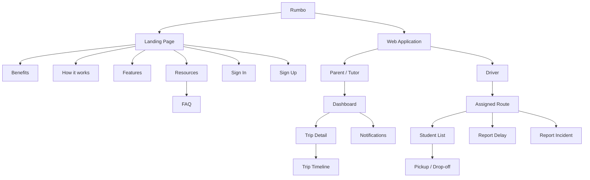

# UNIVERSIDAD PERUANA DE CIENCIAS APLICADAS

### Ingeniería de Software

### Ciclo Académico: 2026-20

### Código: 1ASI0729

### Curso: Desarrollo de Aplicaciones Open Source

### NRC: 7760

### Docente: [Completar]

# Informe de Trabajo Final

### Startup: Rumbo

### Producto: Rumbo

### Integrantes

| Apellidos y Nombres | Código de Alumno |
|---|---|
| Lino Quispe, Leonardo Miguel | U202422298 |
| Barrientos Quispe, Marcelo | U20221e646 |
| Geronimo Puma, Kevin Joel | U202423163 |
| Meza Soza, Alexandra Yamile | U20241b451 |
| [Integrante 5] | [Código 5] |

### SEPTIEMBRE - 2026

---

## Registro de Versiones del Informe

| Versión | Fecha | Autor(es) | Descripción de cambios |
|---|---|---|---|
| 0.1 | 09/09/2026 | linolw | Creación de la estructura base del informe de Rumbo para AV1 del curso Desarrollo de Aplicaciones Open Source. |

---

## Project Report Collaboration Insights

**Organización:** https://github.com/AIpaca-OS  
**Project Report:** https://github.com/AIpaca-OS/project-report  
**Landing Page:** https://github.com/AIpaca-OS/landing-page  
**Frontend Web Application:** https://github.com/AIpaca-OS/frontend-web-application  
**Web Services:** https://github.com/AIpaca-OS/web-services

### AV1

**Team Collaboration Commits**  
[Insertar captura]

**Team Collaboration Network**  
[Insertar captura]

**Contributors / Pull Requests**  
[Insertar capturas]

---

# Contenido

## Tabla de Contenidos

- [Student Outcome](#student-outcome)
- [Capítulo I: Introducción](#capítulo-i-introducción)
  - [1.1. Startup Profile](#11-startup-profile)
    - [1.1.1. Descripción de la Startup](#111-descripción-de-la-startup)
    - [1.1.2. Perfiles de integrantes del equipo](#112-perfiles-de-integrantes-del-equipo)
  - [1.2. Solution Profile](#12-solution-profile)
    - [1.2.1. Antecedentes y problemática](#121-antecedentes-y-problemática)
    - [1.2.2. Lean UX Process](#122-lean-ux-process)
      - [1.2.2.1. Lean UX Problem Statement](#1221-lean-ux-problem-statement)
      - [1.2.2.2. Lean UX Assumptions](#1222-lean-ux-assumptions)
      - [1.2.2.3. Lean UX Hypothesis Statements](#1223-lean-ux-hypothesis-statements)
      - [1.2.2.4. Lean UX Canvas](#1224-lean-ux-canvas)
  - [1.3. Segmentos objetivo](#13-segmentos-objetivo)
- [Capítulo II: Requirements Elicitation & Analysis](#capítulo-ii-requirements-elicitation--analysis)
  - [2.1. Competidores](#21-competidores)
  - [2.2. Entrevistas](#22-entrevistas)
  - [2.3. Needfinding](#23-needfinding)
  - [2.4. Big Picture Event Storming](#24-big-picture-event-storming)
  - [2.5. Ubiquitous Language](#25-ubiquitous-language)
- [Capítulo III: Requirements Specification](#capítulo-iii-requirements-specification)
  - [3.1. User Stories](#31-user-stories)
  - [3.2. Impact Mapping](#32-impact-mapping)
  - [3.3. Product Backlog](#33-product-backlog)
- [Capítulo IV: Product Design](#capítulo-iv-product-design)
  - [4.1. Style Guidelines](#41-style-guidelines)
  - [4.2. Information Architecture](#42-information-architecture)
  - [4.3. Landing Page UI Design](#43-landing-page-ui-design)
  - [4.4. Web Applications UX/UI Design](#44-web-applications-uxui-design)
  - [4.5. Web Applications Prototyping](#45-web-applications-prototyping)
  - [4.6. Domain-Driven Software Architecture](#46-domain-driven-software-architecture)
  - [4.7. Software Object-Oriented Design](#47-software-object-oriented-design)
  - [4.8. Database Design](#48-database-design)
- [Capítulo V: Product Implementation, Validation & Deployment](#capítulo-v-product-implementation-validation--deployment)
  - [5.1. Software Configuration Management](#51-software-configuration-management)
  - [5.2. Landing Page, Services & Applications Implementation](#52-landing-page-services--applications-implementation)
- [Conclusiones](#conclusiones)
- [Bibliografía](#bibliografía)
- [Anexos](#anexos)

---

# Student Outcome

El curso contribuye al cumplimiento del Student Outcome ABET:

**ABET – EAC - Student Outcome 3**  
**Criterio:** Capacidad de comunicarse efectivamente con un rango de audiencias.

En el siguiente cuadro se describen las acciones realizadas y las conclusiones del grupo que permiten sustentar el logro del Student Outcome 3.

| Criterio específico | Acciones realizadas | Conclusiones |
|---|---|---|
| Comunica oralmente con efectividad a diferentes rangos de audiencia. | **[Integrante 1]** — AV1: [acción].   **[Integrante 2]** — AV1: [acción].   **[Integrante 3]** — AV1: [acción].   **[Integrante 4]** — AV1: [acción].   **[Integrante 5]** — AV1: [acción]. | [Conclusión grupal acumulable]. |
| Comunica por escrito con efectividad a diferentes rangos de audiencia. | **[Integrante 1]** — AV1: [acción].   **[Integrante 2]** — AV1: [acción].   **[Integrante 3]** — AV1: [acción].   **[Integrante 4]** — AV1: [acción].   **[Integrante 5]** — AV1: [acción]. | [Conclusión grupal acumulable]. |

---

# Capítulo I: Introducción

## 1.1. Startup Profile

### 1.1.1. Descripción de la Startup

**Rumbo** es una startup peruana orientada a mejorar la coordinación del transporte escolar entre padres o tutores y conductores de movilidad escolar. La propuesta busca centralizar información sobre el estado del traslado, los hitos principales de la ruta, retrasos e incidencias, de modo que las familias puedan comprender rápidamente qué ocurre durante el recorrido y los conductores puedan comunicar eventos relevantes sin repetir la misma información de manera individual.

Rumbo se plantea inicialmente para Lima y Callao. La solución no reemplaza las obligaciones de seguridad, autorización y operación de los prestadores del servicio; busca complementar la experiencia con información organizada, accesible y oportuna.

### 1.1.2. Perfiles de integrantes del equipo

<table>
  <thead>
    <tr><th>Foto</th><th>Apellidos y nombres</th><th>Código</th><th>Carrera</th><th>Habilidades</th></tr>
  </thead>
  <tbody>
    <tr><td>[Foto]</td><td>[Apellidos y nombres]</td><td>[Código]</td><td>Ingeniería de Software</td><td>[Habilidades]</td></tr>
    <tr><td>[Foto]</td><td>[Apellidos y nombres]</td><td>[Código]</td><td>Ingeniería de Software</td><td>[Habilidades]</td></tr>
    <tr><td>[Foto]</td><td>[Apellidos y nombres]</td><td>[Código]</td><td>Ingeniería de Software</td><td>[Habilidades]</td></tr>
    <tr><td>[Foto]</td><td>[Apellidos y nombres]</td><td>[Código]</td><td>Ingeniería de Software</td><td>[Habilidades]</td></tr>
    <tr><td>[Foto]</td><td>[Apellidos y nombres]</td><td>[Código]</td><td>Ingeniería de Software</td><td>[Habilidades]</td></tr>
  </tbody>
</table>

## 1.2. Solution Profile

### 1.2.1. Antecedentes y problemática

El transporte escolar constituye un servicio formal y regulado en Lima y Callao. En enero de 2026, la Autoridad de Transporte Urbano para Lima y Callao (ATU) informó que **3758 vehículos se encontraban habilitados para prestar el servicio de transporte de estudiantes** y recordó que los padres pueden verificar en línea si el vehículo y el conductor están autorizados [1].

El servicio opera en una ciudad con alta congestión. De acuerdo con el **TomTom Traffic Index 2025**, Lima registró un nivel promedio de congestión de **69,3 %**. Un recorrido de 10 km tomó en promedio **43 min 10 s en la hora punta de la mañana** y **51 min 17 s en la tarde**, mientras que el tiempo perdido por tráfico en hora punta se estimó en **195 horas al año** [2]. Esto incrementa la variabilidad de los tiempos de llegada y vuelve relevante disponer de información actualizada sobre el estado de la ruta.

La seguridad vial también forma parte del contexto. El Observatorio Nacional de Seguridad Vial reportó para 2025 **88 243 siniestros de tránsito, 55 329 personas lesionadas y 3428 fallecidas** a nivel nacional [3]. Estas cifras no corresponden exclusivamente a transporte escolar, pero muestran que cualquier servicio de traslado opera en un entorno donde la prevención, la comunicación y la capacidad de reacción ante incidencias son importantes.

Desde el punto de vista tecnológico, una experiencia web responsive es viable para el mercado objetivo. Durante el cuarto trimestre de 2025, el INEI reportó que **98,4 % de los hogares de Lima Metropolitana contaba con telefonía móvil**, **90,3 % de la población de 6 años a más utilizaba Internet** y **91,0 % de los usuarios de Internet de Lima Metropolitana accedía mediante teléfono celular** [4].

A partir de este contexto, Rumbo abordará una necesidad que será contrastada mediante las entrevistas de AV1: **la falta de una vista única y fácil de consultar sobre el estado de la movilidad escolar, sus hitos, retrasos e incidencias**.

#### 5W + 2H

| Dimensión | Análisis |
|---|---|
| **Who? / ¿Quiénes?** | Padres o tutores de menores que utilizan movilidad escolar y conductores de movilidad escolar. |
| **What? / ¿Qué ocurre?** | Los padres necesitan conocer recojo, avance, llegada, retrasos e incidencias; los conductores necesitan comunicar esos eventos de forma ordenada. |
| **Where? / ¿Dónde?** | Lima y Callao, durante rutas entre hogares, puntos de recojo y centros educativos. |
| **When? / ¿Cuándo?** | Antes del recojo, durante el traslado y al momento de la llegada o entrega. |
| **Why? / ¿Por qué importa?** | La congestión genera tiempos variables y el transporte de menores requiere información clara y oportuna. |
| **How? / ¿Cómo se aborda?** | Mediante una plataforma web responsive con estado de ruta, hitos, notificaciones e incidencias. |
| **How much? / ¿Qué magnitud tiene?** | ATU reportó 3758 vehículos escolares habilitados en Lima y Callao; Lima registró 69,3 % de congestión promedio en 2025. |

### 1.2.2. Lean UX Process

#### 1.2.2.1. Lean UX Problem Statement

La coordinación del transporte escolar se desarrolla en un contexto de alta congestión, tiempos variables y comunicación frecuente entre familias y conductores. Los padres necesitan conocer el estado del traslado sin depender exclusivamente de mensajes individuales; los conductores necesitan comunicar cambios, retrasos e incidencias de manera más eficiente. Rumbo busca ofrecer una experiencia centralizada que permita consultar el estado de la ruta y sus principales eventos.

#### 1.2.2.2. Lean UX Assumptions

**Supuestos de negocio**
- Existe una necesidad recurrente de mejorar la comunicación durante las rutas escolares.
- Los padres valorarán una vista resumida del estado de la movilidad y sus eventos.
- Los conductores valorarán reducir mensajes repetitivos a distintas familias.

**Supuestos de resultados de negocio**
- La centralización de información puede reducir consultas repetitivas al conductor.
- Una experiencia clara y móvil puede aumentar la frecuencia de consulta de los padres.
- La visibilidad de retrasos e incidencias puede mejorar la percepción de organización del servicio.

**Supuestos de usuario**
- Los padres consultan principalmente desde el celular.
- Los conductores necesitan registrar eventos con la menor cantidad posible de pasos.
- Ambos segmentos requieren mensajes simples y comprensibles.

**Supuestos de resultados y beneficios del usuario**
- Los padres podrán comprender el estado del traslado sin iniciar una conversación cada vez.
- Los conductores podrán informar a varias familias mediante un solo registro de evento.
- Ambos segmentos podrán consultar un historial básico de hitos del recorrido.

**Supuestos de funcionalidades**
- Estado actual del traslado.
- Línea de tiempo del trayecto.
- Registro de retrasos.
- Registro de incidencias.
- Notificaciones de hitos relevantes.
- Vista responsive optimizada para dispositivos móviles.

#### 1.2.2.3. Lean UX Hypothesis Statements

1. Creemos que ofrecer una **vista del estado actual** a padres y tutores permitirá reducir la necesidad de consultas repetitivas al conductor.
2. Creemos que una **línea de tiempo del trayecto** permitirá a las familias comprender mejor los hitos ya ocurridos durante la ruta.
3. Creemos que permitir al conductor **registrar retrasos** facilitará comunicar cambios de horario a varias familias de forma consistente.
4. Creemos que permitir al conductor **registrar incidencias** mejorará la claridad con la que se comunican eventos excepcionales.
5. Creemos que las **notificaciones de hitos** ayudarán a los padres a mantenerse informados sin revisar constantemente la aplicación.
6. Creemos que una experiencia **responsive y mobile-first** facilitará el uso durante los momentos de recojo y traslado.

#### 1.2.2.4. Lean UX Canvas

**UXPressia:** [Insertar captura y URL del Lean UX Canvas]

## 1.3. Segmentos objetivo

### Segmento 1: Padres y tutores
Personas responsables de menores que utilizan movilidad escolar y que necesitan información clara sobre el estado del traslado, retrasos, llegada e incidencias.

### Segmento 2: Conductores de movilidad escolar
Conductores que trasladan estudiantes y necesitan comunicar de forma ordenada eventos relevantes de la ruta a las familias asociadas.

---

# Capítulo II: Requirements Elicitation & Analysis

## 2.1. Competidores

### 2.1.1. Análisis competitivo

Se analizarán al menos tres soluciones reales relacionadas con seguimiento de transporte, movilidad o comunicación entre operadores y familias. El análisis deberá incluir propuesta de valor, público objetivo, fortalezas, debilidades, funcionalidades y evidencia de fuentes consultadas.

| Competidor | Público objetivo | Funcionalidades relevantes | Fortalezas | Debilidades | Fuente |
|---|---|---|---|---|---|
| [Competidor 1] | [Completar] | [Completar] | [Completar] | [Completar] | [URL] |
| [Competidor 2] | [Completar] | [Completar] | [Completar] | [Completar] | [URL] |
| [Competidor 3] | [Completar] | [Completar] | [Completar] | [Completar] | [URL] |

### 2.1.2. Estrategias y tácticas frente a competidores

Rumbo buscará diferenciarse por una experiencia enfocada específicamente en la comunicación del trayecto escolar entre padres/tutores y conductores, priorizando estado actual, hitos, retrasos e incidencias con una experiencia simple y responsive.

## 2.2. Entrevistas

### 2.2.1. Diseño de entrevistas

Se realizarán **6 entrevistas en total: 3 a padres/tutores y 3 a conductores**, cumpliendo el mínimo de tres entrevistas por segmento.

**Preguntas para padres/tutores**
1. ¿Cómo se informa actualmente sobre el recojo y la llegada de la movilidad?
2. ¿Qué información necesita con mayor frecuencia durante el trayecto?
3. ¿Qué ocurre cuando la movilidad se retrasa?
4. ¿Cómo se entera de una incidencia o cambio inesperado?
5. ¿Qué información le gustaría consultar sin tener que escribir o llamar al conductor?
6. ¿Qué tan útil sería ver una línea de tiempo con los principales eventos de la ruta?

**Preguntas para conductores**
1. ¿Cómo comunica actualmente recojos, retrasos, llegadas e incidencias?
2. ¿Qué tipo de mensajes recibe con mayor frecuencia de los padres?
3. ¿Qué información suele repetirse a varias familias?
4. ¿Qué situaciones hacen más difícil mantener informadas a las familias?
5. ¿Qué eventos considera importante registrar durante una ruta?
6. ¿Qué tendría que tener una herramienta para que no distraiga durante la conducción?

### 2.2.2. Registro de entrevistas

| ID | Segmento | Nombre | Edad | Distrito | Evidencia | URL Microsoft Stream | Timing / duración | Resumen |
|---|---|---|---:|---|---|---|---|---|
| P-01 | Padre/Tutor | [Completar] | [ ] | [ ] | [Captura] | [URL] | [ ] | [ ] |
| P-02 | Padre/Tutor | [Completar] | [ ] | [ ] | [Captura] | [URL] | [ ] | [ ] |
| P-03 | Padre/Tutor | [Completar] | [ ] | [ ] | [Captura] | [URL] | [ ] | [ ] |
| C-01 | Conductor | [Completar] | [ ] | [ ] | [Captura] | [URL] | [ ] | [ ] |
| C-02 | Conductor | [Completar] | [ ] | [ ] | [Captura] | [URL] | [ ] | [ ] |
| C-03 | Conductor | [Completar] | [ ] | [ ] | [Captura] | [URL] | [ ] | [ ] |

### 2.2.3. Análisis de entrevistas

[Completar después de realizar las seis entrevistas. Incluir hallazgos, patrones, porcentajes cuando corresponda y diferencias entre ambos segmentos.]

## 2.3. Needfinding

### 2.3.1. User Personas
- **User Persona — Padre/Tutor:** [Insertar captura y URL de UXPressia].
- **User Persona — Conductor:** [Insertar captura y URL de UXPressia].

### 2.3.2. User Task Matrix
[Insertar matriz comparando tareas, frecuencia e importancia para ambos segmentos.]

### 2.3.3. User Journey Mapping
- **As-Is Journey Map — Padre/Tutor:** [Insertar captura y URL].
- **As-Is Journey Map — Conductor:** [Insertar captura y URL].

### 2.3.4. Empathy Mapping
- **Empathy Map — Padre/Tutor:** [Insertar captura y URL].
- **Empathy Map — Conductor:** [Insertar captura y URL].

## 2.4. Big Picture Event Storming

[Insertar captura y enlace de FigJam/LucidChart/Miro].

Eventos preliminares del dominio a validar: `Trip Scheduled`, `Student Assigned`, `Pickup Confirmed`, `Trip Started`, `Delay Reported`, `Incident Reported`, `School Arrival Confirmed`, `Drop-off Confirmed`, `Trip Completed` y `Notification Sent`.

## 2.5. Ubiquitous Language

| Término | Definición |
|---|---|
| **Student** | Menor asociado a un servicio de transporte escolar. |
| **Parent/Tutor** | Persona responsable que consulta información del traslado. |
| **Driver** | Conductor responsable de ejecutar una ruta escolar. |
| **Vehicle** | Unidad utilizada para realizar el servicio de transporte. |
| **School Transport Service** | Servicio de traslado de estudiantes entre puntos definidos y el centro educativo. |
| **Route** | Recorrido planificado que agrupa puntos de recojo y entrega. |
| **Trip** | Ejecución concreta de una ruta en una fecha y horario determinados. |
| **Stop** | Punto programado dentro de una ruta. |
| **Pickup** | Evento que confirma el recojo de un estudiante. |
| **Drop-off** | Evento que confirma la entrega o llegada del estudiante a su destino. |
| **Assigned Student** | Estudiante vinculado a una ruta o viaje específico. |
| **Trip Status** | Estado actual del viaje. |
| **Route Event** | Evento registrado durante la ejecución de la ruta. |
| **Delay** | Retraso reportado respecto del horario previsto. |
| **Incident** | Situación excepcional registrada durante el traslado. |
| **Notification** | Mensaje generado para comunicar un evento relevante. |
| **ETA** | Estimated Time of Arrival; estimación de hora de llegada. |
| **Trip Timeline** | Secuencia cronológica de eventos registrados durante el viaje. |
| **School Arrival** | Confirmación de llegada al centro educativo. |
| **Route Completion** | Confirmación de que la ruta terminó. |
| **Authorized User** | Usuario con permisos válidos para consultar o registrar información. |
| **Current Status** | Resumen del estado más reciente del viaje. |
| **Route Assignment** | Relación entre conductor, vehículo, estudiantes y ruta. |
| **Event Timestamp** | Fecha y hora asociadas a un evento. |
| **Emergency Contact** | Información de contacto definida para situaciones que requieran comunicación directa. |

---

# Capítulo III: Requirements Specification

## 3.1. User Stories

### Epics
- **EP01 — Gestión de usuarios y acceso.**
- **EP02 — Gestión de rutas y viajes escolares.**
- **EP03 — Seguimiento de estado y línea de tiempo.**
- **EP04 — Comunicación de retrasos e incidencias.**
- **EP05 — Landing Page e información pública.**

### User Stories iniciales

| ID | Epic | User Story | Story Points |
|---|---|---|---:|
| US01 | EP03 | Como padre/tutor, deseo consultar el estado actual del viaje para saber en qué etapa se encuentra la ruta. | 5 |
| US02 | EP03 | Como padre/tutor, deseo revisar la línea de tiempo del trayecto para conocer los eventos ya registrados. | 5 |
| US03 | EP04 | Como padre/tutor, deseo visualizar retrasos reportados para anticipar cambios en la hora de llegada. | 3 |
| US04 | EP04 | Como padre/tutor, deseo recibir información sobre incidencias para comprender situaciones excepcionales. | 5 |
| US05 | EP02 | Como conductor, deseo visualizar los estudiantes asignados a una ruta para organizar el recorrido. | 5 |
| US06 | EP02 | Como conductor, deseo registrar hitos del trayecto para mantener actualizada la información de la ruta. | 5 |
| US07 | EP04 | Como conductor, deseo registrar un retraso para comunicarlo a las familias vinculadas. | 3 |
| US08 | EP04 | Como conductor, deseo registrar una incidencia para dejar constancia y comunicar el evento. | 5 |
| US09 | EP05 | Como visitante, deseo conocer la propuesta de valor de Rumbo para comprender el producto. | 2 |
| US10 | EP05 | Como visitante, deseo conocer los beneficios para padres y conductores para identificar si el producto responde a mis necesidades. | 2 |
| US11 | EP05 | Como visitante, deseo cambiar entre inglés y español para consultar el contenido en un idioma disponible. | 3 |
| US12 | EP05 | Como visitante, deseo acceder a términos y condiciones desde el footer para conocer las reglas del servicio. | 2 |

### Criterios de aceptación de ejemplo

**US01 — Consultar estado actual**
- **Dado** que el padre/tutor tiene acceso a un viaje vigente, **cuando** ingresa a la vista del traslado, **entonces** el sistema muestra el estado actual y la hora del último evento registrado.

**US07 — Registrar retraso**
- **Dado** que el conductor tiene una ruta activa, **cuando** registra un retraso con una descripción válida, **entonces** el evento se incorpora a la línea de tiempo y queda disponible para los padres vinculados.

## 3.2. Impact Mapping

[Insertar captura y URL del Impact Map elaborado en UXPressia.]

Estructura esperada: **Goal → Actor → Impact → Deliverable → User Story**.

## 3.3. Product Backlog

| Orden | ID | Título | Story Points |
|---:|---|---|---:|
| 1 | US09 | Presentar propuesta de valor en Landing Page | 2 |
| 2 | US10 | Presentar beneficios por segmento | 2 |
| 3 | US11 | Soportar inglés y español en Landing Page | 3 |
| 4 | US12 | Acceso a términos y condiciones | 2 |
| 5 | US01 | Consultar estado actual | 5 |
| 6 | US02 | Consultar línea de tiempo | 5 |
| 7 | US07 | Registrar retraso | 3 |
| 8 | US08 | Registrar incidencia | 5 |
| 9 | US05 | Consultar estudiantes asignados | 5 |
| 10 | US06 | Registrar hitos del trayecto | 5 |
| 11 | US03 | Visualizar retrasos | 3 |
| 12 | US04 | Visualizar incidencias | 5 |

---

# Capítulo IV: Product Design

## 4.1. Style Guidelines
Las Style Guidelines de Rumbo establecen los lineamientos visuales y de comunicación que permiten mantener una experiencia consistente entre el Landing Page y los demás productos digitales de la solución. Estas directrices comprenden el uso de colores, tipografías, espaciado, componentes visuales y tono de comunicación.

La identidad visual fue diseñada buscando transmitir tranquilidad, confianza y cercanía, atributos relacionados con la propuesta de valor de Rumbo y con las necesidades de sus principales segmentos objetivo: padres de familia y conductores de transporte escolar. Para ello, se emplea una composición visual limpia, con amplios espacios entre contenidos, superficies claras y tonos verdes como elementos principales de identificación y acción.

### 4.1.1. General Style Guidelines

#### Branding
La identidad visual de Rumbo busca proyectar una imagen cercana, segura y confiable. Al tratarse de una solución relacionada con el transporte escolar y la comunicación entre padres de familia y conductores, se priorizó una estética que transmita tranquilidad antes que una apariencia excesivamente tecnológica o corporativa.

La marca utiliza principalmente tonalidades verdes acompañadas de colores crema y arena. Esta combinación permite diferenciar las acciones principales sin generar una interfaz visualmente agresiva. Asimismo, el uso de fondos claros y espacios amplios favorece la lectura y permite que los mensajes y Call-to-Action mantengan una jerarquía visual clara.

  
  
Logotipo de Rumbo

#### Color Palette
La paleta cromática de Rumbo está compuesta principalmente por tonos verdes, crema y arena. Los colores verdes son utilizados para representar la identidad de la marca, destacar acciones y diferenciar elementos interactivos, mientras que los tonos crema permiten mantener superficies visualmente ligeras. Los tonos arena funcionan como colores de énfasis secundarios.

**Primary Color I (#3EA98A):** Color verde usado para destacar elementos.

**Primary Color II (#12403D):** Color verde oscuro usado para fondos y contraste.

**Secondary Color I (#F3D9A4):** Color verde claro usado para elementos de énfasis secundario.

**Secondary Color II (#F3D9A4):** Color arena usado para elementos de énfasis secundario.

**Neutral Color I (#FBFAF6):** Color crema usado para superficies de contenido.

**Neutral Color II (#F5F4EA):** Color crema oscuro usado como fondo alternativo para distintas secciones.

**Neutral Color III (#0F172A):** Color azul oscuro usado para texto y detalles.

#### Typography

Rumbo emplea las familias tipográficas **Outfit** y **Roboto**, seleccionadas para diferenciar los contenidos de alta jerarquía de los elementos funcionales y textos de lectura continua.

| Typeface | Aplicación |
|---|---|
| **Outfit** | Títulos principales, encabezados de sección y mensajes de alto impacto visual. |
| **Roboto** | Párrafos, navegación, botones, etiquetas, formularios y contenido complementario. |

**Outfit** se utiliza en títulos como “Tranquilidad en cada trayecto”, “Beneficios diseñados para tu total tranquilidad” y “¿Cómo funciona Rumbo?”. Su geometría y peso visual permiten generar encabezados fácilmente identificables y fortalecer la personalidad del producto.

**Roboto**, en cambio, se utiliza para los elementos que requieren una lectura rápida y continua, como textos descriptivos, opciones de navegación, Call-to-Action, preguntas frecuentes y contenido del footer. Su utilización permite mantener una alta legibilidad y una apariencia consistente en los distintos componentes de la interfaz.

#### Spacing and Shapes

El sistema de espaciado de Rumbo está basado en múltiplos de 4px. Este enfoque garantiza consistencia visual en todos los componentes, facilita la alineación de elementos y reduce la toma de decisiones discrecionales durante el diseño y desarrollo. Todos los márgenes internos (padding) y la separación entre componentes siguen esta escala.

| Nivel | Tamaño | Uso en Rumbo |
|---|---:|---|
| `spacing-xs` | 4 px | Espaciado mínimo. Se utiliza entre elementos muy relacionados, como un icono y su etiqueta, o pequeños elementos internos de un componente. |
| `spacing-s` | 8 px | Espaciado pequeño. Se aplica entre textos, iconos y elementos estrechamente relacionados dentro de botones, tarjetas y controles. |
| `spacing-m` | 12 px | Espaciado secundario. Se emplea principalmente como padding interno de botones compactos, campos de formulario y grupos pequeños de contenido. |
| `spacing-l` | 16 px | Espaciado estándar. Se utiliza como margen lateral base en dispositivos móviles y para separar elementos dentro de tarjetas y bloques de contenido. |
| `spacing-xl` | 24 px | Espaciado intermedio. Se aplica como padding de tarjetas y contenedores principales, además de separar grupos de contenido relacionados. |
| `spacing-xxl` | 32 px | Espaciado grande. Se utiliza en márgenes laterales de la experiencia Desktop y para separar componentes principales dentro de una misma sección. |
| `spacing-3xl` | 48 px | Espaciado estructural. Se reserva para separar secciones principales del Landing Page y establecer una clara diferenciación entre bloques de información. |

#### Tone of Voice

El tono de comunicación de Rumbo busca generar confianza y tranquilidad. Debido a que la solución se relaciona con el transporte de menores, el producto evita expresiones excesivamente informales, humorísticas o alarmistas.

| Dimensión | Posicionamiento | Justificación |
|---|---|---|
| Divertido – Serio | Serio con cercanía | La información relacionada con trayectos, retrasos e incidencias debe comunicarse con claridad y responsabilidad. |
| Formal – Casual | Moderadamente casual | Se utiliza lenguaje sencillo y directo, evitando tecnicismos innecesarios para padres y conductores. |
| Respetuoso – Irreverente | Respetuoso | La comunicación debe mantener la confianza entre familias, conductores y organizaciones educativas. |
| Entusiasta – Sereno | Sereno y positivo | Rumbo busca disminuir la incertidumbre y transmitir control antes que urgencia o preocupación. |

Los mensajes principales emplean frases breves orientadas al beneficio del usuario, como “Tranquilidad en cada trayecto” y “Empieza a sentirte más tranquilo hoy”. De esta manera, la propuesta de valor se comunica desde la perspectiva de la tranquilidad y seguridad que obtiene el usuario, en lugar de centrarse únicamente en características técnicas.

### 4.1.2. Web Style Guidelines
La experiencia web se diseñará con enfoque responsive, accesible y consistente. Se considerarán los idiomas `en_US` y `es_419`, con inglés como idioma por defecto de la experiencia del producto, y se incluirán atributos ARIA cuando corresponda.

## 4.2. Information Architecture
La arquitectura de información de Rumbo define cómo se organizan, etiquetan y conectan los contenidos y funcionalidades del Landing Page y de la Web Application. Su diseño considera las necesidades diferenciadas de los dos principales segmentos objetivo: padres o tutores, quienes principalmente consultan el estado del trayecto, y conductores de movilidad escolar, quienes registran los eventos que ocurren durante la ruta.

En el Landing Page, la información se organiza con un enfoque informativo y progresivo, permitiendo que un visitante conozca primero la propuesta de valor de Rumbo, posteriormente sus beneficios y funcionamiento, y finalmente pueda acceder a una acción de registro o inicio de sesión.

En la Web Application, la organización se encuentra orientada a tareas y cambia de acuerdo con el rol del usuario. Para padres y tutores se prioriza la consulta del estado actual del trayecto, su detalle, línea de tiempo y notificaciones. Para conductores se prioriza la ruta asignada y las acciones necesarias para registrar recojos, entregas, retrasos e incidencias con la menor cantidad posible de pasos.

### 4.2.1. Organization Systems

Rumbo combina diferentes sistemas de organización de acuerdo con el tipo de contenido y las tareas que debe realizar cada usuario. No se utiliza un único esquema para toda la experiencia, sino que se selecciona el sistema que permita comprender y localizar la información con mayor facilidad.

| Producto / contenido | Sistema de organización | Aplicación |
|---|---|---|
| Landing Page | Jerárquico | El visitante encuentra primero la propuesta de valor y posteriormente beneficios, funcionamiento, funcionalidades, recursos y Call-to-Action. |
| How it works | Secuencial | Los principales eventos del trayecto se presentan siguiendo su orden natural: recojo, ruta en curso, eventual incidencia y llegada. |
| Web Application | Según audiencia | La información y acciones disponibles se diferencian entre Parent/Tutor y Driver. |
| Parent/Tutor Dashboard | Jerárquico | El estado actual del viaje ocupa el mayor nivel de prioridad, seguido por información complementaria del estudiante, conductor, vehículo y ETA. |
| Trip Timeline | Cronológico | Los eventos registrados durante el trayecto se muestran según el momento en que ocurrieron. |
| Driver Assigned Route | Jerárquico y orientado a tareas | La ruta activa y la próxima acción del conductor se priorizan sobre información secundaria. |
| Student List | Secuencial | Los estudiantes asociados a la ruta se presentan como parte del flujo operativo del conductor, permitiendo registrar recojo o entrega. |
| Notifications | Cronológico | Los avisos relacionados con el trayecto se presentan de acuerdo con su fecha y hora de generación. |

La organización del Landing Page sigue principalmente un esquema jerárquico debido a que un visitante necesita comprender primero qué es Rumbo antes de conocer detalles específicos del producto.

En la Web Application predomina una organización por audiencia y por tareas. Esta separación responde a que padres/tutores y conductores persiguen objetivos diferentes: los primeros consultan información del trayecto, mientras que los segundos registran eventos de la operación.

Asimismo, la información temporal utiliza esquemas cronológicos. Esto resulta especialmente relevante en la línea de tiempo del viaje y en las notificaciones, donde el orden de ocurrencia permite comprender la evolución del trayecto.

### 4.2.2. Labeling Systems

El sistema de etiquetado de Rumbo utiliza términos breves, consistentes y relacionados con el dominio del transporte escolar. Las etiquetas buscan permitir que cada usuario anticipe con claridad qué información encontrará o qué acción realizará antes de seleccionar un elemento.

Debido a que el idioma predeterminado de la solución será inglés (`en_US`), las etiquetas principales se definen en inglés y cuentan con su equivalente para español latinoamericano (`es_419`).

| English (`en_US`) | Spanish (`es_419`) | Producto / asociación |
|---|---|---|
| Benefits | Beneficios | Landing Page: ventajas principales del producto. |
| How it works | Cómo funciona | Landing Page: explicación resumida del funcionamiento de Rumbo. |
| Features | Funcionalidades | Landing Page: principales capacidades del producto. |
| Resources | Recursos | Landing Page: contenido complementario y FAQ. |
| Sign in | Iniciar sesión | Acceso a la Web Application. |
| Sign up | Registrarse | Creación de una cuenta. |
| Dashboard | Panel principal | Vista principal de Parent/Tutor. |
| Trip Status | Estado del trayecto | Estado actual del viaje. |
| Trip Detail | Detalle del trayecto | Información ampliada sobre el viaje activo. |
| Timeline | Línea de tiempo | Eventos del trayecto ordenados cronológicamente. |
| Notifications | Notificaciones | Avisos asociados al estudiante o al trayecto. |
| Assigned Route | Ruta asignada | Vista principal del conductor. |
| Students | Estudiantes | Lista de estudiantes vinculados a la ruta. |
| Confirm Pickup | Confirmar recojo | Registro de recojo de un estudiante. |
| Confirm Drop-off | Confirmar entrega | Registro de entrega del estudiante. |
| Report Delay | Reportar retraso | Registro de una demora durante el recorrido. |
| Report Incident | Reportar incidencia | Registro de un evento excepcional. |
| Terms of Service | Términos del servicio | Condiciones de utilización del producto. |
| Privacy | Privacidad | Información relacionada con el tratamiento de datos. |

Las mismas etiquetas deben mantenerse entre navegación, botones, formularios, notificaciones y documentación del producto, evitando utilizar términos diferentes para representar una misma acción.

### 4.2.3. SEO Tags and Meta Tags

Rumbo utilizará SEO Tags y Meta Tags para describir correctamente el contenido de las principales páginas del Landing Page y de la Web Application. Estos elementos permitirán proporcionar información relevante a navegadores, motores de búsqueda y plataformas externas.

De acuerdo con los lineamientos del proyecto, para cada página principal se definirán como mínimo los valores de **Title**, **Description**, **Keywords** y **Author**.

#### Landing Page

| Elemento | Valor |
|---|---|
| **Title** | `Rumbo | School Transport Tracking and Communication` |
| **Meta Description** | `Rumbo helps families and school transport drivers stay informed through trip monitoring, alerts and direct communication.` |
| **Meta Keywords** | `school transport, school routes, trip monitoring, parents, drivers, alerts, school mobility` |
| **Meta Author** | `AIpaca OS` |

#### Web Application – Sign In

| Elemento | Valor |
|---|---|
| **Title** | `Sign In | Rumbo` |
| **Meta Description** | `Access your Rumbo account to view school trip information and manage route-related activities.` |
| **Meta Keywords** | `Rumbo sign in, school transport, trip monitoring, parents, drivers` |
| **Meta Author** | `AIpaca OS` |

#### Web Application – Parent/Tutor Dashboard

| Elemento | Valor |
|---|---|
| **Title** | `Parent Dashboard | Rumbo` |
| **Meta Description** | `View the current school trip status, timeline and notifications associated with your student.` |
| **Meta Keywords** | `school trip status, parent dashboard, trip timeline, school transport notifications` |
| **Meta Author** | `AIpaca OS` |

#### Web Application – Driver Assigned Route

| Elemento | Valor |
|---|---|
| **Title** | `Assigned Route | Rumbo` |
| **Meta Description** | `View the assigned school route and register pickups, drop-offs, delays and incidents.` |
| **Meta Keywords** | `assigned route, school transport driver, pickup, drop-off, route incidents` |
| **Meta Author** | `AIpaca OS` |

### 4.2.4. Searching Systems
En la versión actual de Rumbo no se incorpora un sistema de búsqueda general ni en el Landing Page ni en los principales flujos definidos para la Web Application.

En el Landing Page, el volumen de información es reducido y todos los contenidos pueden ser localizados mediante navegación global y enlaces internos.

En la Web Application, los flujos actuales presentan información contextual asociada directamente al usuario autenticado. El padre o tutor accede al trayecto y notificaciones vinculadas con su estudiante, mientras que el conductor accede directamente a su ruta y estudiantes asignados. Por esta razón, en el alcance actual no existe un volumen de información que requiera un motor de búsqueda.

| Producto / vista | Searching System | Justificación |
|---|---|---|
| Landing Page | No requerido | El contenido es reducido y accesible mediante navegación directa. |
| Parent/Tutor Dashboard | No requerido en el alcance actual | La información presentada corresponde directamente al usuario autenticado. |
| Trip Timeline | No requerido inicialmente | Los eventos se presentan cronológicamente dentro de un único trayecto. |
| Driver Assigned Route | No requerido en el alcance actual | El conductor accede directamente a la ruta que tiene asignada. |
| Student List | No requerido inicialmente | La lista corresponde únicamente a los estudiantes asociados con la ruta activa. |

Si durante iteraciones posteriores el volumen de rutas, estudiantes, notificaciones o viajes históricos aumenta, se evaluará la incorporación de mecanismos de búsqueda, filtrado y ordenamiento como parte de nuevos User Stories.

### 4.2.5. Navigation Systems
Rumbo utiliza diferentes sistemas de navegación de acuerdo con el contexto del usuario. El Landing Page emplea navegación global y contextual, mientras que la Web Application utiliza navegación orientada a tareas y roles.

La navegación busca reducir la cantidad de decisiones necesarias para alcanzar las acciones principales. Esto resulta especialmente importante para el perfil Driver, debido a que sus interacciones deben mantenerse breves durante la operación del servicio.

#### Landing Page Navigation

La navegación global del Landing Page se encuentra disponible mediante el header y permite acceder directamente a las principales secciones:

`Home, Benefits, How it works, Features, Resources`

Asimismo, el header incluye los Call-to-Action relacionados con acceso:

`Sign in, Sign up`

El footer proporciona navegación complementaria hacia información del producto, de la startup y documentos legales.

#### Parent/Tutor Navigation

Después de autenticarse, el Parent/Tutor accede directamente al Dashboard, que funciona como punto central de su experiencia.

`Sign In → Dashboard`

Desde el Dashboard puede acceder a:

- `Trip Detail`
- `Notifications`

A partir de Trip Detail puede profundizar hacia:

- `Trip Timeline`

La estructura prioriza la consulta del estado actual antes de presentar información histórica o complementaria.

#### Driver Navigation

Después de iniciar sesión, el Driver accede directamente a la ruta que tiene asignada:

`Sign In → Assigned Route`

Assigned Route funciona como el principal punto de navegación operativa. Desde esta vista el conductor puede:

- consultar `Student List`;
- registrar `Pickup / Drop-off`;
- registrar `Delay`;
- registrar `Incident`.

Después de completar cualquiera de estas acciones, la navegación retorna a Assigned Route para evitar recorridos innecesarios.

 

## 4.3. Landing Page UI Design

### 4.3.1. Landing Page Wireframe

  

### 4.3.2. Landing Page Mock-up

  

## 4.4. Web Applications UX/UI Design

### 4.4.1. Web Applications Wireframes
[Insertar wireframes de las vistas principales de padres/tutores y conductores.]

### 4.4.2. Web Applications Wireflow Diagrams
[Insertar wireflows.]

### 4.4.2. Web Applications Mock-ups
[Insertar mock-ups de las vistas principales.]

### 4.4.3. Web Applications User Flow Diagrams
[Insertar User Flow Diagrams.]

## 4.5. Web Applications Prototyping

[Insertar URL y captura del prototipo interactivo en Figma.]

## 4.6. Domain-Driven Software Architecture

### 4.6.1. Design-Level Event Storming
[Insertar EventStorming de nivel de diseño.]

### 4.6.2. Software Architecture Context Diagram
[Insertar C4 Context Diagram.]

### 4.6.3. Software Architecture Container Diagrams
[Insertar C4 Container Diagram. Considerar Frontend Web Application Angular y RESTful Web Services Spring Boot.]

### 4.6.4. Software Architecture Components Diagrams
[Insertar diagramas de componentes por bounded context cuando hayan sido validados.]

## 4.7. Software Object-Oriented Design

### 4.7.1. Class Diagrams
[Insertar diagramas UML de clases por bounded context.]

## 4.8. Database Design

### 4.8.1. Database Diagrams
[Insertar diagramas de base de datos por bounded context, indicando tablas, columnas, primary keys, foreign keys y relaciones.]

---

# Capítulo V: Product Implementation, Validation & Deployment

## 5.1. Software Configuration Management

### 5.1.1. Software Development Environment Configuration

| Producto / herramienta | Uso en el proyecto |
|---|---|
| Git + GitHub | Control de versiones y colaboración. |
| Figma | Wireframes, Mock-ups y Prototypes. |
| UXPressia | User Personas, Empathy Maps, Journey Maps e Impact Maps. |
| FigJam / LucidChart / Miro | EventStorming, Wireflows y User Flows. |
| Structurizr / LucidChart | Diagramas de arquitectura y UML. |
| HTML5 + CSS3 + JavaScript | Implementación de Landing Page. |
| Angular + TypeScript + Angular Material | Frontend Web Application. |
| Spring Boot + Spring Data JPA + Java | RESTful Web Services. |
| OpenAPI Specification + Swagger | Documentación de Web Services. |
| Trello / Jira / YouTrack | Gestión del Product Backlog y Sprint Backlog. |

### 5.1.2. Source Code Management

Repositorios oficiales:
- **Landing Page:** https://github.com/AIpaca-OS/landing-page
- **Frontend Web Application:** https://github.com/AIpaca-OS/frontend-web-application
- **Web Services:** https://github.com/AIpaca-OS/web-services
- **Project Report:** https://github.com/AIpaca-OS/project-report

Se aplicará **GitFlow**, **Conventional Commits** y **Semantic Versioning**. El flujo base será:
- `main`: versiones estables y entregables.
- `develop`: integración del trabajo del equipo.
- `feature/...`: funcionalidades o secciones específicas, creadas cuando inicie el trabajo correspondiente.
- `release/...`: preparación de una versión cuando sea necesario.
- `hotfix/...`: correcciones urgentes sobre una versión estable.

Ejemplos de Conventional Commits: `feat(landing): add hero section`, `docs(report): add interview findings`, `feat(routes): add trip status view`, `fix(api): correct validation response`.

### 5.1.3. Source Code Style Guide & Conventions

**Landing Page**
- HTML semántico.
- CSS organizado y responsive.
- JavaScript modular por responsabilidad.
- Nombres de clases y archivos consistentes en kebab-case cuando corresponda.

**Frontend Web Application**
- Angular con TypeScript.
- Componentes y servicios con responsabilidad clara.
- Convenciones de Angular para nombres de archivos, componentes, servicios y módulos.
- Angular Material para la biblioteca de componentes UI.

**Web Services**
- Java con convenciones de nombres estándar.
- Spring Boot y Spring Data JPA.
- Separación entre dominio, aplicación, infraestructura e interfaces cuando corresponda.
- Documentación OpenAPI/Swagger para los endpoints implementados.

### 5.1.4. Software Deployment Configuration

Para AV1 se documentará y ejecutará el despliegue de la **primera versión de la Landing Page**. La configuración de despliegue del Frontend Web Application y Web Services se documentará progresivamente cuando estos productos entren en el alcance de implementación de los siguientes Sprints.

## 5.2. Landing Page, Services & Applications Implementation

## 5.2.1. Sprint 1

### 5.2.1.1. Sprint Planning 1

**Sprint Goal:** completar la base de investigación, requisitos y diseño de Rumbo, implementar y desplegar la primera versión de la Landing Page y dejar preparados los artefactos de producto exigidos para AV1.

**Duración:** [Completar fechas].

### 5.2.1.2. Aspect Leaders and Collaborators

| Aspecto | Líder | Colaboradores |
|---|---|---|
| Project Report | [Completar] | [Completar] |
| Investigación y entrevistas | [Completar] | Todos |
| Landing Page UX/UI | [Completar] | [Completar] |
| Landing Page Development | [Completar] | [Completar] |
| Requirements & Product Design | [Completar] | [Completar] |
| Deployment & Evidence | [Completar] | [Completar] |

### 5.2.1.3. Sprint Backlog 1

| ID | User Story / Task | Descripción | Responsable | Horas | Estado |
|---|---|---|---|---:|---|
| T01 | Research | Recopilar fuentes y sustentar problemática. | [ ] | 4 | To Do |
| T02 | Interviews | Realizar entrevistas asignadas y registrar evidencias. | Todos | 4-8 | To Do |
| T03 | Landing Wireframes | Elaborar wireframes Desktop/Mobile. | [ ] | 4 | To Do |
| T04 | Landing Mock-ups | Elaborar mock-ups Desktop/Mobile. | [ ] | 4 | To Do |
| T05 | Landing Structure | Implementar estructura HTML y navegación. | [ ] | 6 | To Do |
| T06 | Landing Styles | Implementar estilos responsive. | [ ] | 6 | To Do |
| T07 | Landing Interaction | Implementar JavaScript e i18n inicial. | [ ] | 4 | To Do |
| T08 | Landing Deployment | Desplegar primera versión y registrar evidencia. | [ ] | 4 | To Do |
| T09 | Requirements | Consolidar User Stories y Product Backlog. | [ ] | 6 | To Do |
| T10 | Product Design | Consolidar artefactos de arquitectura y UX/UI. | [ ] | 6-8 | To Do |

### 5.2.1.4. Development Evidence for Sprint Review

[Insertar tabla de repositorio, branch, commit id, commit message y evidencia visual de los avances implementados en el Sprint 1.]

### 5.2.1.5. Execution Evidence for Sprint Review

[Insertar capturas de la Landing Page ejecutándose en Desktop y Mobile, junto con la explicación del flujo validado.]

### 5.2.1.6. Services Documentation Evidence for Sprint Review

En Sprint 1 el alcance de implementación se concentra en la primera versión del Landing Page. Si no se implementan endpoints de Web Services durante este Sprint, se dejará constancia de ello en esta sección y no se inventará documentación de servicios inexistentes.

### 5.2.1.7. Software Deployment Evidence for Sprint Review

[Insertar URL pública de la Landing Page, capturas del proceso de despliegue y explicación de los pasos realizados.]

### 5.2.1.8. Team Collaboration Insights during Sprint

[Insertar capturas de Network Graph, Contributors, commits y Pull Requests del Sprint 1. Todos los integrantes deben evidenciar aportes reales.]

---

# Conclusiones

- La problemática de Rumbo se sustenta en un contexto real de transporte escolar formal, alta congestión urbana y elevada conectividad móvil en Lima Metropolitana.
- Los dos segmentos iniciales del proyecto son padres/tutores y conductores de movilidad escolar; las entrevistas de AV1 permitirán validar o corregir los supuestos planteados.
- Para AV1, la implementación se concentra en la primera versión desplegada del Landing Page, mientras que Angular y Spring Boot quedan definidos como tecnologías para los productos que se desarrollarán progresivamente en los siguientes Sprints.

# Bibliografía

[1] Autoridad de Transporte Urbano para Lima y Callao (ATU). (2026). *Vacaciones útiles seguras: ATU exhorta a padres de familia a usar movilidades escolares autorizadas*. https://www.gob.pe/institucion/atu/noticias/1331042-vacaciones-utiles-seguras-atu-exhorta-a-padres-de-familia-a-usar-movilidades-escolares-autorizadas

[2] TomTom. (2025). *Lima traffic report*. https://www.tomtom.com/traffic-index/city/lima/

[3] Observatorio Nacional de Seguridad Vial. (2025). *Estadísticas de siniestralidad vial*. https://www.onsv.gob.pe/

[4] Instituto Nacional de Estadística e Informática (INEI). (2026). *El 98,4 % de los hogares de Lima Metropolitana contó con telefonía móvil durante el cuarto trimestre de 2025*. https://www.gob.pe/institucion/inei/noticias/1371146-el-98-4-de-los-hogares-de-lima-metropolitana-conto-con-telefonia-movil-durante-el-cuarto-trimestre-de-2025

# Anexos

## Anexo A. Videos de Exposiciones

| Entrega | Video |
|---|---|
| AV1 | [URL Microsoft Stream / Clipchamp] |

## Anexo B. Evidencias complementarias

[Agregar únicamente evidencias necesarias que por extensión no correspondan al cuerpo principal del informe.]
