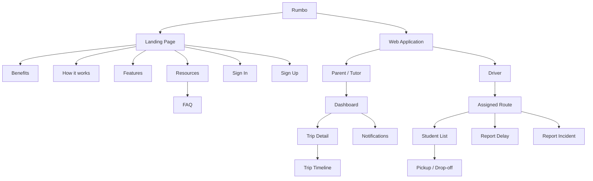

# UNIVERSIDAD PERUANA DE CIENCIAS APLICADAS

### Ingeniería de Software

### Ciclo Académico: 2026-20

### Código: 1ASI0729

### Curso: Desarrollo de Aplicaciones Open Source

### NRC: 7760

### Docente: Juan Antonio Flores Moroco

# Informe de Trabajo Final

### Startup: Rumbo

### Producto: Rumbo

### Integrantes

| Apellidos y Nombres | Código de Alumno |
|---|---|
| Díaz Ramírez, Alejandro | U202423084 |
| Geronimo Puma, Kevin Joel | U202423163 |
| Lino Quispe, Leonardo Miguel | U202422298 |
| Meza Soza, Alexandra Yamile | U20241b451 |
| Pareja Caceres, Diana | U202422589 |

### SEPTIEMBRE - 2026

---

## Registro de Versiones del Informe

| Versión       | Fecha          | Autor(es)                                                                                                                                    | Descripción de cambios                                                                                                                                                                                                                                                                                                        |
| ------------- | -------------- | -------------------------------------------------------------------------------------------------------------------------------------------- | -------------------------------------------------------------------------------------------------------------------------------------------------------------------------------------------------------------------------------------------------------------------------------------------------------------------------------------------------------------------------------------------------------------------------------------------------------------------------------------------------------------------------------------------------------------------------------------------------------------------------------------------------------------------------------------------------------------------------------------------------------------------------------------------------------------------------------------------------------------------------------------------------------------------------------------------------------------------------------------------------------------------------------------------------------------------------------------------------------------------------------------------------------------------------------------------------------------------- |
| **v.01.Avn1** | **16/09/2026** | Díaz Ramírez, Alejandro Geronimo Puma, Kevin Joel Lino Quispe, Leonardo Miguel Meza Soza, Alexandra Yamile Pareja Caceres, Diana | **Carátula** **Registro de Versiones del Informe** **Project Report Collaboration Insights** **Contenido** **Student Outcome** **Capítulo I: Introducción** **Capítulo II: Requirements Elicitation & Analysis** **Capítulo III: Requirements Specification** **Capítulo IV: Product Design** **Capítulo V: Product Implementation, Validation & Deployment** **5.1. Software Configuration Management** **5.1.1. Software Development Environment Configuration** **5.1.2. Source Code Management** **5.1.3. Source Code Style Guide & Conventions** **5.1.4. Software Deployment Configuration** **5.2. Landing Page, Services & Applications Implementation** **5.2.1. Sprint 1** **5.2.1.1. Sprint Planning 1** **5.2.1.2. Aspect Leaders and Collaborators** **5.2.1.3. Sprint Backlog 1** **5.2.1.4. Development Evidence for Sprint Review** **5.2.1.5. Execution Evidence for Sprint Review** **5.2.1.6. Services Documentation Evidence for Sprint Review** **5.2.1.7. Software Deployment Evidence for Sprint Review** **5.2.1.8. Team Collaboration Insights during Sprint** **Avance de Conclusiones, Bibliografía y Anexos** |

---

## Project Report Collaboration Insights

**Organización:** https://github.com/AIpaca-OS  
**Project Report:** https://github.com/AIpaca-OS/project-report  
**Landing Page:** https://github.com/AIpaca-OS/landing-page  
**Frontend Web Application:** https://github.com/AIpaca-OS/frontend-web-application  
**Web Services:** https://github.com/AIpaca-OS/web-services

### AV1

**Team Collaboration Commits**  
[Insertar captura]

**Team Collaboration Network**  
[Insertar captura]

**Contributors / Pull Requests**  
[Insertar capturas]

---

# Contenido

## Tabla de Contenidos

- [Student Outcome](#student-outcome)
- [Capítulo I: Introducción](#capítulo-i-introducción)
  - [1.1. Startup Profile](#11-startup-profile)
    - [1.1.1. Descripción de la Startup](#111-descripción-de-la-startup)
    - [1.1.2. Perfiles de integrantes del equipo](#112-perfiles-de-integrantes-del-equipo)
  - [1.2. Solution Profile](#12-solution-profile)
    - [1.2.1. Antecedentes y problemática](#121-antecedentes-y-problemática)
    - [1.2.2. Lean UX Process](#122-lean-ux-process)
      - [1.2.2.1. Lean UX Problem Statement](#1221-lean-ux-problem-statement)
      - [1.2.2.2. Lean UX Assumptions](#1222-lean-ux-assumptions)
      - [1.2.2.3. Lean UX Hypothesis Statements](#1223-lean-ux-hypothesis-statements)
      - [1.2.2.4. Lean UX Canvas](#1224-lean-ux-canvas)
  - [1.3. Segmentos objetivo](#13-segmentos-objetivo)
- [Capítulo II: Requirements Elicitation & Analysis](#capítulo-ii-requirements-elicitation--analysis)
  - [2.1. Competidores](#21-competidores)
  - [2.2. Entrevistas](#22-entrevistas)
  - [2.3. Needfinding](#23-needfinding)
  - [2.4. Big Picture Event Storming](#24-big-picture-event-storming)
  - [2.5. Ubiquitous Language](#25-ubiquitous-language)
- [Capítulo III: Requirements Specification](#capítulo-iii-requirements-specification)
- [Capítulo IV: Product Design](#capítulo-iv-product-design)
- [Capítulo V: Product Implementation, Validation & Deployment](#capítulo-v-product-implementation-validation--deployment)
- [Conclusiones](#conclusiones)
- [Bibliografía](#bibliografía)
- [Anexos](#anexos)

---

# Student Outcome

El curso contribuye al cumplimiento del **ABET – EAC – Student Outcome 3: Capacidad de comunicarse efectivamente con un rango de audiencias**.

| Criterio específico | Acciones realizadas | Conclusiones |
|---|---|---|
| Comunica oralmente con efectividad a diferentes rangos de audiencia. | **[Integrantes]** — AV1: [completar con participación real en entrevistas y exposición]. | [Conclusión grupal]. |
| Comunica por escrito con efectividad a diferentes rangos de audiencia. | **[Integrantes]** — AV1: [completar con participación real en informe, artefactos y documentación]. | [Conclusión grupal]. |

---

# Capítulo I: Introducción

## 1.1. Startup Profile

### 1.1.1. Descripción de la Startup

**Rumbo** es una startup peruana enfocada en mejorar la seguridad, visibilidad y coordinación durante el transporte escolar. La propuesta surge a partir de una situación cotidiana para muchas familias: durante los recorridos pueden presentarse variaciones de horario, congestión, retrasos, cambios en la ruta o incidencias que obligan a padres y conductores a intercambiar información de forma constante.

Rumbo plantea una plataforma web responsive que centraliza los principales eventos del traslado y permite que los padres comprendan rápidamente qué está ocurriendo durante el recorrido. Para los conductores, la plataforma busca reducir la repetición de mensajes individuales y facilitar el registro de hitos como recojos, llegadas, entregas, retrasos e incidencias.

La startup inicia su propuesta en Lima y Callao, donde existe un mercado formal de transporte escolar y una alta disponibilidad de conectividad móvil. Rumbo no reemplaza los mecanismos oficiales de autorización ni las responsabilidades de seguridad del prestador del servicio; busca complementar la experiencia con información estructurada, oportuna y accesible.

### 1.1.2. Perfiles de integrantes del equipo

<table>
  <thead>
    <tr><th>Foto</th><th>Apellidos y nombres</th><th>Código</th><th>Carrera</th><th>Habilidades</th></tr>
  </thead>
  <tbody>
    <tr><td align="center">[Insertar foto]</td><td>Díaz Ramírez, Alejandro</td><td>U202423084</td><td>Ingeniería de Software</td><td>[Completar perfil]</td></tr>
    <tr><td align="center">[Insertar foto]</td><td>Geronimo Puma, Kevin Joel</td><td>U202423163</td><td>Ingeniería de Software</td><td>[Completar perfil]</td></tr>
    <tr><td align="center">[Insertar foto]</td><td>Lino Quispe, Leonardo Miguel</td><td>U202422298</td><td>Ingeniería de Software</td><td>Soy estudiante de Ingeniería de Software del 4to ciclo en la UPC. Tengo conocimientos en programación en C++ y Python, y experiencia desarrollando proyectos académicos donde analizo y organizo soluciones tecnológicas. Me gusta enfocarme en aprender de forma práctica y en construir soluciones que sean claras, funcionales y aplicadas a problemas reales.</td></tr>
    <tr><td align="center"></td><td>Meza Soza, Alexandra Yamile</td><td>U20241b451</td><td>Ingeniería de Software</td><td>Soy estudiante de Ingeniería de Software del 6to ciclo en la UPC. Cuento con conocimientos en el desarrollo de sistemas utilizando los lenguajes Python y C++. Me caracterizo por aprendizaje rápido, criterio para filtrar información relevante y trabajo colaborativo. En el equipo aporto investigación aplicada y prototipos técnicos que conectan los hallazgos con funcionalidades del producto.</td></tr>
    <tr><td align="center">[Insertar foto]</td><td>Pareja Caceres, Diana</td><td>U202422589</td><td>Ingeniería de Software</td><td>[Completar perfil]</td></tr>
  </tbody>
</table>

## 1.2. Solution Profile

### 1.2.1. Antecedentes y problemática

El transporte escolar constituye un servicio formal y regulado en Lima y Callao. En enero de 2026, la ATU informó que **3758 vehículos se encontraban habilitados para prestar el servicio de transporte de estudiantes** [1]. Según el **TomTom Traffic Index 2025**, Lima registró una congestión promedio de **69,3 %**, con aproximadamente **195 horas al año** perdidas en tráfico de hora punta [2]. El Observatorio Nacional de Seguridad Vial reportó para 2025 **88 243 siniestros de tránsito, 55 329 personas lesionadas y 3428 fallecidas** a nivel nacional [3].

El INEI informó además que durante el cuarto trimestre de 2025 **98,4 % de los hogares de Lima Metropolitana contaba con telefonía móvil**, **90,3 % de la población de 6 años a más utilizaba Internet** y **91,0 % de los usuarios de Internet accedía mediante teléfono celular** [4].

A partir de este contexto, Rumbo aborda la falta de una vista única y oportuna sobre el estado de la movilidad escolar, sus hitos, retrasos e incidencias.

#### Técnica de las 5 W's + 2 H's

**What:** falta de información centralizada sobre recojo, traslado, retrasos, llegada e incidencias.  
**When:** antes del recojo, durante el recorrido y al momento de la llegada o entrega.  
**Where:** Lima y Callao.  
**Who:** padres/tutores y conductores de movilidad escolar.  
**Why:** congestión, tiempos variables, mensajes individuales y consultas repetitivas.  
**How:** plataforma web responsive con estado del traslado, timeline, confirmaciones, retrasos, incidencias y notificaciones.  
**How much:** 3758 vehículos escolares habilitados y 69,3 % de congestión promedio en Lima durante 2025.

### 1.2.2. Lean UX Process

#### 1.2.2.1. Lean UX Problem Statement

La movilidad escolar opera en un contexto de tiempos variables y comunicación frecuente entre familias y conductores. Los padres necesitan conocer el estado del traslado sin depender exclusivamente de mensajes individuales y los conductores necesitan comunicar cambios, retrasos e incidencias de manera eficiente.

**¿Cómo podríamos mejorar la visibilidad y coordinación del transporte escolar para que los padres puedan conocer el estado del traslado y los conductores puedan comunicar los principales eventos de la ruta de forma rápida y ordenada?**

#### 1.2.2.2. Lean UX Assumptions

**Business Assumptions**
1. Existe valor en centralizar digitalmente la información de la ruta.
2. Los padres utilizarán Rumbo si pueden consultar información sin depender de mensajes individuales.
3. Los conductores adoptarán la solución si registrar eventos requiere pocos pasos.
4. La confianza dependerá de privacidad, permisos y protección de información del menor.

**User Assumptions**
- Padres/tutores necesitan consultar recojo, avance, llegada, retrasos e incidencias.
- Conductores necesitan organizar rutas y comunicar eventos sin repetir mensajes.
- Ambos segmentos utilizan principalmente experiencias móviles.

**Feature Assumptions**
- Estado actual del viaje.
- Línea de tiempo del trayecto.
- Confirmación de recojo y entrega.
- Seguimiento del progreso.
- Notificaciones.
- Registro de incidencias.

**User Outcomes & Benefits**
- Mayor tranquilidad y visibilidad para los padres.
- Menos consultas rutinarias al conductor.
- Mejor anticipación ante retrasos.
- Historial ordenado de eventos del recorrido.

#### 1.2.2.3. Lean UX Hypothesis Statements

1. Una vista del estado actual reducirá consultas directas al conductor.
2. Una línea de tiempo mejorará la comprensión de los eventos de la ruta.
3. Confirmaciones rápidas aumentarán la consistencia del registro de recojos y entregas.
4. Mostrar el progreso aumentará la visibilidad del recorrido.
5. Notificaciones de eventos relevantes mejorarán la coordinación.
6. Un registro estructurado de incidencias mejorará la claridad ante imprevistos.

#### 1.2.2.4. Lean UX Canvas

## 1.3. Segmentos objetivo

### Padres y tutores
Padres, madres o tutores responsables de menores que utilizan movilidad escolar en Lima y Callao. Buscan disminuir la incertidumbre durante los recorridos y acceder a información clara sobre recojo, traslado, retrasos, llegada e incidencias.

### Conductores de movilidad escolar
Conductores que realizan rutas programadas para estudiantes. Necesitan organizar horarios, puntos de recojo, retrasos e incidencias y comunicar los eventos principales de forma rápida y segura.

---

# Capítulo II: Requirements Elicitation & Analysis

## 2.1. Competidores

### 2.1.1. Análisis competitivo

| Criterio | School Bus Tracker | Bus esCool | Canales Informales (WhatsApp / Waze) | Rumbo |
|---|---|---|---|---|
| **Segmento** | Colegios, flotas y padres de familia | Colegios privados, conductores y familias | Familias y conductores independientes | Padres/tutores y conductores de movilidad escolar |
| **Seguimiento de ruta** | Sí (GPS continuo con hardware o app) | Sí (Rastreo en vivo) | Parcial (Ubicación en tiempo real compartida manualmente) | Sí (Seguimiento web responsive en tiempo real) |
| **Confirmación recojo/entrega** | Sí | Sí | Parcial (Mensajes de texto manuales) | Sí (Check-in / Check-out rápido de abordaje y destino) |
| **Línea de tiempo** | No (Solo mapa y registro tabular) | Parcial (Lista básica de eventos) | No (Historial de chat desordenado) | Sí (Timeline cronológico de hitos del viaje) |
| **Incidencias** | No (Enfocado en despacho de flota) | Sí (Reporte de imprevistos básicos) | Parcial (Llamadas telefónicas de emergencia) | Sí (Reporte estructurado simultáneo de demoras y averías) |
| **Modelo** | SaaS B2B (Licenciamiento por colegio/flota) | SaaS B2B (Convenio institucional por escuela) | Gratuito (Herramienta de mensajería general) | SaaS B2C/B2B (Suscripción accesible directa para padres y choferes) |

### 2.1.2. Estrategias y tácticas frente a competidores

#### 1. Estrategia frente a Soluciones Corporativas B2B (School Bus Tracker / Bus esCool)

* **Contexto competitivo:** Estas herramientas cuentan con respaldo tecnológico y presencia institucional, pero su debilidad crítica radica en su modelo de venta corporativa cerrada: exigen contratos directos con colegios privados o compra de hardware GPS costoso, dejando desatendidos a los más de 3,700 conductores de movilidad escolar independientes registrados ante la ATU.
* **Estrategia (Enfoque Bottom-Up & Direct-to-Consumer / D2C):**
  Democratizar el acceso al servicio permitiendo que el binomio **Conductor Independiente – Padre de Familia** adopte la solución de manera directa y flexible, sin intermediación obligatoria del centro educativo.
* **Tácticas:**
  * **Onboarding inmediato sin hardware propietario:** Operar 100% como Web Application responsive utilizando el GPS del smartphone del conductor, eliminando costos de instalación y barreras de entrada.
  * **Modelo de suscripción accesible:** Fijar tarifas mensuales individuales en el rango de S/ 15 a S/ 25 por familia (validado en el 100% de las entrevistas), muy por debajo de las licencias corporativas por flota.
  * **Periodo de prueba (Free Trial):** Implementar un periodo de prueba gratuito durante la primera semana escolar para que las familias validen la precisión y confiabilidad antes de la suscripción.

---

#### 2. Estrategia frente a Canales Informales Sustitutos (WhatsApp / Llamadas telefónicas)

* **Contexto competitivo:** La gran fortaleza de WhatsApp es el costo cero y el hábito arraigado (100% de uso diario). Sin embargo, su debilidad estructural es la saturación de mensajes, la falta de privacidad y el riesgo crítico de seguridad vial cuando el chofer escribe mientras conduce en horas punta.
* **Estrategia (Sustitución Silenciosa y Seguridad Operativa):**
  Posicionar a Rumbo no como un chat, sino como un **panel de visualización pasiva** que reduce a cero la necesidad de llamadas y mensajes manuales en ruta.
* **Tácticas:**
  * **Interacción One-Touch (Cero Distracciones):** Proveer al conductor botones táctiles amplios para confirmar eventos clave (`Pickup`, `Drop-off`, `Delay`, `Incident`) con un solo toque, evitando la redacción de texto al volante.
  * **Notificaciones push de proximidad automatizadas:** Alertar a los padres cuando la movilidad se encuentra a 2 cuadras de distancia mediante geocercas, eliminando los bocinazos y los mensajes manuales de *"ya estoy afuera"*.
  * **Línea de tiempo cronológica centralizada:** Desplegar una vista de hitos (`Trip Timeline`) donde todos los padres de la ruta ven retrasos o incidencias simultáneamente, acabando con las respuestas individuales repetitivas.

---

#### 3. Matriz de Oportunidades y Amenazas en relación con la Competencia

| Dimensión | Factor Externo | Estrategia / Táctica de Rumbo |
|---|---|---|
| **Oportunidad** | **Exigencias regulatorias de ATU:** Los padres exigen garantías de habilitación y unidades autorizadas. | **Validación y confianza:** Integrar en el perfil del conductor el estado de autorización de la unidad y cumplimiento de SOAT escolar, diferenciándose de las coordinaciones informales. |
| **Oportunidad** | **Congestión vehicular severa en Lima:** La variabilidad de tiempos genera incertidumbre extrema en las mañanas. | **Módulo de reporte rápido de retrasos:** Permitir informar congestión atípica con un clic, recalculando visualmente la línea de tiempo para calmar la ansiedad de las familias. |
| **Amenaza** | **Resistencia inicial al cambio:** Costumbre arraigada al uso exclusivo de WhatsApp para toda coordinación. | **UX simple y sin curva de aprendizaje:** Diseñar interfaces Web Mobile-First directas, con login rápido y visualización de ruta sin configuraciones complejas. |
| **Amenaza** | **Intermitencia de conectividad móvil:** Zonas con baja señal de datos o fluctuaciones en la red 4G/5G en Lima. | **Diseño resiliente con WebSockets/Polling:** Sincronización ligera de eventos con marcas de tiempo explícitas (`Event Timestamp`) para informar siempre la hora del último reporte verificado. |

## 2.2. Entrevistas

Se realizarán entrevistas semiestructuradas para comprender hábitos, procesos actuales, frustraciones, motivaciones, necesidades, herramientas utilizadas y barreras de adopción de los segmentos objetivo. Se busca obtener información suficiente para el análisis posterior y para construir los artefactos de Needfinding.

### 2.2.1. Diseño de entrevistas

### Preguntas dirigidas al primer segmento — Padres y tutores

1. ¿Podría indicarnos su edad, el distrito donde reside y la edad y grado escolar de su(s) hijo(s) que utilizan el transporte escolar?
2. Actualmente, ¿cómo se organiza con el recojo y retorno de sus hijos? ¿Sale a esperarlos, confía en el horario del conductor o utiliza alguna aplicación?
3. ¿Qué aplicaciones móviles utiliza con mayor frecuencia en su día a día (por ejemplo, WhatsApp, Waze, redes sociales, aplicaciones del colegio)?
4. Descríbanos su experiencia actual con el servicio de transporte escolar. ¿Qué es lo que más le preocupa o le genera incertidumbre durante el viaje de sus hijos?
5. ¿Cuántas veces al día suele comunicarse con el conductor para preguntar por la ubicación o el estado del viaje de sus hijos?
6. ¿Ha tenido experiencias donde el conductor llegó tarde, no pasó por su hijo o hubo confusión con los horarios? ¿Cómo manejó esa situación?
7. ¿Qué opina sobre la seguridad vial y el uso del celular por parte del conductor? ¿Le genera preocupación saber que el conductor podría distraerse al atender llamadas o mensajes de los padres?
8. Si existiera una aplicación que le mostrara en un mapa la ubicación exacta del vehículo en tiempo real y le notificara automáticamente cuando está cerca de su casa, sin que el conductor tenga que llamarle, ¿cómo cambiaría su rutina matutina?
9. Además de la ubicación, ¿qué otra información le gustaría recibir, como la confirmación de que su hijo abordó el vehículo o llegó al colegio?
10. ¿Estaría dispuesto a pagar una suscripción mensual por un servicio que le brinde esta tranquilidad y seguridad? ¿Cuánto consideraría justo pagar?
11. ¿Qué característica de la aplicación sería la más importante para usted para sentirse tranquilo al confiar el transporte de su hijo a un conductor registrado en nuestra plataforma?

### Preguntas dirigidas al segundo segmento — Conductores de movilidad escolar

1. ¿Cuál es tu nombre completo, edad, ocupación, distrito de residencia y cuántos años de experiencia tienes realizando transporte escolar?
2. ¿Cuántos estudiantes y rutas manejas normalmente durante una jornada de trabajo?
3. ¿Qué dispositivo, navegador y aplicaciones o canales digitales utilizas con mayor frecuencia para organizar tu trabajo y comunicarte con las familias?
4. Cuéntame cómo organizas actualmente los estudiantes, horarios, puntos de recojo y cambios que pueden surgir antes de una ruta.
5. ¿Cómo confirmas actualmente que un estudiante fue recogido o entregado y cómo comunicas esos eventos a sus familiares?
6. ¿Qué situaciones imprevistas o retrasos ocurren con mayor frecuencia durante una ruta y cómo los comunicas a las familias?
7. ¿Qué información te piden los padres con mayor frecuencia y qué parte de esa comunicación te quita más tiempo o se vuelve repetitiva?
8. ¿En qué momentos sería seguro y realista registrar información en un sistema sin distraerte de la conducción, y qué acciones digitales serían poco prácticas durante tu jornada?
9. ¿Qué información te sería útil conservar como historial de una ruta para resolver posteriormente dudas o reclamos?
10. ¿Qué datos consideras privados o que no deberían mostrarse libremente dentro de una plataforma de movilidad escolar?
11. ¿Qué tendría que ofrecer una herramienta digital para que la utilices de manera recurrente y qué barreras podrían impedir que la adoptes?
12. Si pudieras mejorar una sola parte de la coordinación con padres y tutores, ¿cuál sería y por qué?

### 2.2.2. Registro de entrevistas

Para cada entrevista se registrará nombre completo, edad, distrito, segmento, captura, URL del video, timing, duración y resumen descriptivo. Actualmente se cuenta con seis entrevistas registradas: tres del segmento Padres/Tutores y tres del segmento Conductores de movilidad escolar.

| # | Entrevistado | Edad | Distrito | Segmento | Duración | Referencia |
| -: | ----------- | ---: | -------- | -------- | :-----   | ---------- |
|  1 | Gabriela | 32 | Miraflores | Padre/Tutor |  07:19 | [Entrevista 1](#entrevista-1--gabriela) |
|  2 | Alejandro Choquehuanca | 34 | Surco | Padre/Tutor | 05:10 | [Entrevista 2](#entrevista-2--alejandro-choquehuanca)  |
|  3 | Eduardo Osorio | 34 | Magdalena | Padre/Tutor | 03:26 | [Entrevista 3](#entrevista-3--eduardo-osorio) |
|  4 | Gabriel Alexandro Sosa Guevara | 20 | Olivos | Conductor | 09:51 | [Entrevista 4](#entrevista-4--gabriel-alexandro-sosa-guevara) |
|  5 | Brayan Solorzano Pineda | 25 | Prueblo Libre | Conductor | 09:05 | [Entrevista 5](#entrevista-5--brayan-solorzano-pineda) |
|  6 | Vilma Hoyos Martinez | 56 | San Miguel | Conductor | 18:14 | [Entrevista 6](#entrevista-6--vilma-hoyos-martinez) |

## Entrevista 1 — Gabriela

* **Edad:** 32 años.
* **Ocupación / segmento:** Padre / Tutor.
* **Distrito:** Miraflores.
* **Duración:** 07:19.
* **Timing de inicio:** 00:00.
* **Video:** [Ver video](https://upcedupe-my.sharepoint.com/:v:/g/personal/u202422589_upc_edu_pe/IQD1AXwvDziBQJNjfqVNiPQWAeYMA26BAQOBC1tyKe_D9nw?nav=eyJyZWZlcnJhbEluZm8iOnsicmVmZXJyYWxBcHBQbGF0Zm9ybSI6IldlYiIsInJlZmVycmFsTW9kZSI6InZpZXciLCJyZWZlcnJhbEFwcFBsYXRmb3JtIjoiV2ViIiwicmVmZXJyYWxNb2RlIjoidmlldyIsInJlZmVycmFsVmlldyI6IlNoYXJlRGlhbG9nLUxpbmsiLCJyZWZlcnJhbEFwcCI6IlN0cmVhbVdlYkFwcCJ9fQ%3D%3D&e=VWo0MB).

**Resumen preliminar:** Gabriela tiene 32 años y pertenece al segmento de padres/tutores. Durante la entrevista se abordaron sus experiencias relacionadas con el transporte escolar de su sobrino de 8 años, especialmente los problemas ocasionados por retrasos mecánicos que no son comunicados oportunamente. Asimismo, destacó la importancia de evitar que el conductor manipule el celular mientras conduce, indicando que debería utilizarlo únicamente cuando se encuentre estacionado. Entre las funcionalidades de mayor interés se encuentra el rastreo en vivo de la movilidad. Respecto a la disposición de pago, considera viable un rango de S/ 15 a S/ 25 mensuales, siempre que pueda acceder previamente a un periodo de prueba gratuito.

## Entrevista 2 — Alejandro Choquehuanca

* **Edad:** 34 años.
* **Ocupación / segmento:** Padre / Tutor.
* **Distrito:** Surco.
* **Duración:** 05:10.
* **Timing de inicio:** 00:00.
* **Video:** [Ver video](https://upcedupe-my.sharepoint.com/:v:/g/personal/u202422589_upc_edu_pe/IQCneF6uJQneSbuVfMMPEvfKAdcXTo1sHeUy-SGF28JiP3g?nav=eyJyZWZlcnJhbEluZm8iOnsicmVmZXJyYWxBcHBQbGF0Zm9ybSI6IldlYiIsInJlZmVycmFsTW9kZSI6InZpZXciLCJyZWZlcnJhbFZpZXciOiJTaGFyZURpYWxvZy1MaW5rIiwicmVmZXJyYWxBcHAiOiJTdHJlYW1XZWJBcHAifX0%3D&e=f5sdCh).

**Resumen preliminar:** Alejandro tiene 34 años y pertenece al segmento de padres/tutores. Durante la entrevista se abordaron sus principales preocupaciones como padre de un niño de 6 años que utiliza transporte escolar en Surco. Entre sus preocupaciones se encuentra la distracción del conductor ocasionada por las llamadas de otros padres durante el trayecto. También manifestó interés en contar con un mapa en tiempo real que permita conocer la ubicación de la movilidad y reducir el tiempo de espera en la calle. Asimismo, considera importante recibir alertas cuando el estudiante ingresa al colegio y contar con mecanismos de verificación de la situación legal del conductor. Respecto a la disposición de pago, considera viable una suscripción mensual de S/ 15 a S/ 25.

## Entrevista 3 — Eduardo Osorio

* **Edad:** 34 años.
* **Ocupación / segmento:** Padre / Tutor.
* **Distrito:** Magdalena.
* **Duración:** 03:26.
* **Timing de inicio:** 00:00.
* **Video:** [Ver video](https://upcedupe-my.sharepoint.com/:v:/g/personal/u202422589_upc_edu_pe/IQDjMXK3n4smQaWYxZ2qTvKkAShiPN2nP5lMf1iIen8ONyA?nav=eyJyZWZlcnJhbEluZm8iOnsicmVmZXJyYWxBcHBQbGF0Zm9ybSI6IldlYiIsInJlZmVycmFsTW9kZSI6IlNoYXJlRGlhbG9nLUxpbmsiLCJyZWZlcnJhbEFwcCI6IlN0cmVhbVdlYkFwcCJ9fQ%3D%3D&e=HlhpOR).

**Resumen preliminar:** Eduardo tiene 34 años y pertenece al segmento de padres/tutores. Durante la entrevista se abordaron sus principales preocupaciones respecto al transporte escolar de su hijo de 4 años, quien se encuentra en inicial. Entre sus principales problemas se encuentra la ansiedad generada por la falta de visibilidad del trayecto, especialmente cuando ocurren averías imprevistas durante el recorrido. Manifestó interés en recibir alertas automáticas relacionadas con el abordaje del menor, incluyendo la confirmación de que viaje con el cinturón de seguridad puesto y que sea entregado correctamente a la profesora. Asimismo, considera valioso contar con información que le permita evitar la espera en la vereda. Respecto a la disposición de pago, acepta un rango de S/ 15 a S/ 25 mensuales.

## Entrevista 4 — Gabriel Alexandro Sosa Guevara

- **Edad:** 20 años.
- **Ocupación / segmento:** Conductor de movilidad escolar.
- **Experiencia en el rubro:** 2 años.
- **Distrito:** Olivos.
- **Duración:** 09:51.
- **Timing de inicio:** 00:00.
- **Video:** [Conductor 1.mp4](https://upcedupe-my.sharepoint.com/:v:/g/personal/u202422298_upc_edu_pe/IQC8MugJp8RuRYBv6-JB1JqxAa7zKfdSDfWOW6lMscwFzxg?nav=eyJyZWZlcnJhbEluZm8iOnsicmVmZXJyYWxBcHBQbGF0Zm9ybSI6IldlYiIsInJlZmVycmFsTW9kZSI6InZpZXciLCJyZWZlcnJhbFZpZXciOiJNeUZpbGVzTGlua0NvcHkifX0&e=MUf4ft).

**Resumen preliminar:** Gabriel cuenta con 2 años de experiencia realizando transporte escolar. Utiliza diariamente su teléfono para trabajar y principalmente usa WhatsApp para comunicarse con las familias y Google Maps para organizar sus rutas. Comenta que uno de los problemas que presenta es tener la información fragmentada en distintos chats, lo que hace poco práctico buscar entre conversaciones para verificar si un estudiante será recogido o consultar la dirección de un punto de llegada alternativo. Además, menciona que es repetitivo responder diariamente las preguntas de los padres sobre cuánto falta para que llegue su hijo, si la movilidad se encuentra cerca o si el estudiante se encuentra bien, ya que esto puede distraerlo mientras conduce. También considera que, en caso de utilizar una aplicación, esta debería ser fácil y rápida de utilizar para no quitarle tiempo durante la conducción. Entre las funcionalidades que considera útiles se encuentran una lista de alumnos, el orden de recojo y la posibilidad de registrar rápidamente cuándo recoge o entrega a un estudiante. Asimismo, le gustaría que los padres puedan visualizar el estado de la ruta y su ubicación para mantenerse informados sin necesidad de comunicarse constantemente con él.

## Entrevista 5 — Brayan Solorzano Pineda

- **Edad:** 25 años.
- **Ocupación / segmento:** Conductor de movilidad escolar.
- **Experiencia en el rubro:** 5 años.
- **Distrito:** Pueblo Libre.
- **Duración:** 09:05.
- **Timing de inicio:** 00:00.
- **Video:** [Conductor 2.mp4](https://upcedupe-my.sharepoint.com/:v:/g/personal/u202422298_upc_edu_pe/IQDViGOQ_7GOQYDKI1MqVAXNAacWQv3o8bRMqBJbKkhsKp8?nav=eyJyZWZlcnJhbEluZm8iOnsicmVmZXJyYWxBcHBQbGF0Zm9ybSI6IldlYiIsInJlZmVycmFsTW9kZSI6InZpZXciLCJyZWZlcnJhbFZpZXciOiJNeUZpbGVzTGlua0NvcHkifX0&e=6tRx0m).

**Resumen preliminar:** Brayan cuenta con 5 años de experiencia en el rubro. Comenzó trabajando en transporte personal, pero luego se trasladó al rubro del transporte escolar. Utiliza un grupo de WhatsApp para enviar avisos a los padres; sin embargo, los tutores prefieren escribirle por privado. Además, utiliza WaySide para evitar el tráfico y el calendario de su teléfono para recordar horarios especiales. Ha tenido problemas para recordar cambios en las rutas debido a modificaciones en el recojo de un alumno, especialmente porque varios padres le escriben. Diariamente, los padres también le preguntan si ya se encuentra cerca o si los niños ya llegaron a la escuela, lo cual considera repetitivo. Comenta que durante la conducción no utilizaría una aplicación. Sin embargo, le sería útil contar con un registro del inicio del recorrido, la hora de recojo de cada alumno y la hora de llegada a la escuela. También considera útil registrar cuando un alumno no será recogido. En general, considera que una aplicación debería ayudarlo a organizar los cambios y permitir que los padres puedan seguir la ruta sin necesidad de preguntarle constantemente. No utilizaría una aplicación que lo obligue a realizar muchas acciones manualmente o que tenga un costo muy elevado. Como característica adicional, le gustaría que pudiera utilizarse en zonas donde existe poca señal.

## Entrevista 6 — Vilma Hoyos Martinez

- **Edad:** 56 años.
- **Ocupación / segmento:** Conductor de movilidad escolar.
- **Experiencia en el rubro:** 25 años.
- **Distrito:** San Miguel.
- **Duración:** 18:14.
- **Timing de inicio:** 00:06.
- **Video:** [Conductor 3.mp4](https://upcedupe-my.sharepoint.com/:v:/g/personal/u20241b451_upc_edu_pe/IQAarNiMmGEZT73ZVhSkpNMNAVFqyptTBINEQvTJU6AW7BY?nav=eyJyZWZlcnJhbEluZm8iOnsicmVmZXJyYWxBcHAiOiJTdHJlYW1XZWJBcHAiLCJyZWZlcnJhbFZpZXciOiJTaGFyZURpYWxvZy1MaW5rIiwicmVmZXJyYWxBcHBQbGF0Zm9ybSI6IldlYiIsInJlZmVycmFsTW9kZSI6InZpZXcifX0%3D&e=asjxgo).

**Resumen preliminar:** Vilma cuenta con 25 años de experiencia en el rubro de la movilidad escolar. Empezó llevando a estudiantes del colegio San Toribio, en el Rímac, hace 10 años y actualmente está a cargo de 26 niños en San Miguel, a quienes lleva a los colegios Claretiano y Los Rosales. La señora Vilma cuenta con un ayudante, quien utiliza la aplicación WhatsApp para comunicarse con las familias, coordinar horarios, llamar para avisar que deben bajar, informar si el niño asistirá, si necesita esperar y compartir su ubicación en tiempo real. Ha presentado problemas con la puntualidad de los niños y con la coordinación con los padres respecto a si los niños serán recogidos o no. Comenta que tiene conocimientos casi nulos en tecnología. Los padres le han recomendado utilizar algunas aplicaciones para poder realizar un mejor seguimiento del recorrido de sus hijos, pero menciona que no sabe cómo utilizarlas y, por ese motivo, no las implementa.

### 2.2.3. Análisis de entrevistas

Se compararán respuestas por segmento, separando **características objetivas** (edad, distrito, experiencia, dispositivo, navegador, canales y organización) y **características subjetivas** (motivaciones, frustraciones, necesidades, actitud hacia tecnología, privacidad y barreras). Los porcentajes se completarán solo con datos reales.

#### Datos Demográficos y Conductuales (Aspectos Objetivos)

* **Edades:** El 100% de los entrevistados del segmento Padres/Tutores tiene entre 32 y 38 años.
* **Rol de cuidado:** El 66.7% son padres de familia directos y el 33.3% corresponde a un tutor a cargo.
* **Edades de los menores:** El 100% de los niños tiene entre 4 y 8 años (33.3% inicial de 4 años; 66.7% en 1er y 3er grado de primaria).
* **Uso de herramientas digitales:** El 100% utiliza de forma diaria WhatsApp y aplicaciones con mapas (Google Maps, Waze).
* **Frecuencia de contacto:** El 100% se comunica con el chofer entre 2 y 3 veces por semana, principalmente cuando la movilidad excede los 15 minutos de tardanza habitual.

#### Datos preliminares del segmento Conductores

* Se han registrado tres entrevistas: Gabriel Alexandro Sosa Guevara, de 20 años; Brayan Solorzano Pineda, de 25 años; y Vilma Hoyos Martinez, de 56 años.
* La edad promedio de los conductores entrevistados es de **33,67 años**.
* La experiencia declarada en transporte escolar es de **2, 5 y 25 años**, con un promedio de **10,67 años**.
* El distrito de Vilma es San Miguel; los distritos de Gabriel y Brayan quedan pendientes de completar.

#### Comportamientos y Rutinas Actuales

* **Espera previa:** El 100% sale a la vereda con el menor entre 5 y 10 minutos antes de la hora pactada para no perder el turno de recojo.
* **Fallas y retrasos previos:** El 100% ha sufrido demoras graves  por desperfectos mecánicos o congestión vehicular, avisadas tarde y resolviendo el traslado con taxis por aplicativo de último momento.
* **Seguridad y uso del celular:** El 100% reconoce que el chofer no debería utilizar el teléfono mientras conduce niños. El 33.3%  señala que solo acepta el contacto telefónico si el vehículo está 100% estacionado.

#### Expectativas y Necesidades para el Proyecto

* **Seguimiento pasivo del viaje:** El 100% necesita conocer la ubicación del vehículo en tiempo real mediante un mapa interactivo para eliminar la necesidad de llamar o mandar mensajes al conductor.
* **Aviso de proximidad:** El 100% requiere una notificación automática previa (a 2 cuadras de distancia) para salir de casa al momento exacto y evitar esperas en la calle.
* **Confirmaciones de estado:** El 100% demanda saber cuándo el menor subió al vehículo y cuándo fue entregado de forma segura en la puerta del colegio. El 33.3%  agrega la confirmación del uso del cinturón de seguridad.
* **Canal directo de incidencias:** El 100% necesita que el chofer pueda reportar averías mecánicas o tráfico atípico de forma simultánea a todos los padres involucrados en la ruta.
* **Validación de seguridad:** El 100% prioriza la verificación de antecedentes penales, récord de papeletas, SOAT escolar al día y control de velocidad máxima permitida.

#### Modelo de Acceso y Disposición Económica

* **Rango de pago:** El 100% considera adecuado y justo pagar una mensualidad adicional de entre S/ 15 y S/ 25 por el servicio de monitoreo y seguridad.
* **Modalidad de prueba:** El 33.3% (Gabriela) requiere un periodo de prueba gratis (*free trial*) para validar la precisión del GPS y la estabilidad del sistema antes de pagar la suscripción mensual.

| Variable | Padres/Tutores | Conductores |
|---|---:|---:|
| Canal principal de comunicación | 100 % | 100% |
| Smartphone como dispositivo principal | 100% | 100% |
| Necesidad de conocer/comunicar estado de ruta | 100% | 100% |
| Retrasos/cambios frecuentes | 67% | 100% |
| Confirmación de recojo/entrega | 100% | 100% |
| Interés en notificaciones | 100% | 100% |
| Preocupación por privacidad | 33% | 100% |
| Barreras de adopción | 33% | 100% |

## 2.3. Needfinding

### 2.3.1. User Personas
[Ver ficha en UXPressia](https://uxpressia.com/w/9076V/p/01Z67?tagId=noTag)
* **Ficha de User Persona:**
- Padre/Tutor: 

- Conductor: [Ver UXPressia](https://uxpressia.com/w/9076V/p/pWKoA?tagId=noTag)
  

### 2.3.2. User Task Matrix
En esta sección se presenta la matriz de tareas de usuario (**User Task Matrix**), la cual analiza las actividades esenciales que realizan los dos segmentos objetivos del proyecto (**Padre/Tutor** representado por el arquetipo de Gabriela Morales, y **Conductor de Movilidad Escolar**) para cumplir con sus objetivos cotidianos de traslado escolar. 

Siguiendo el principio metodológico de Needfinding, las tareas descritas representan actividades humanas y operativas que los usuarios ejecutan en su día a día, independientemente de la existencia de una herramienta digital de software.

| Tareas del Usuario (User Tasks) | User Persona: Padre / Tutor (Gabriela Morales) | | User Persona: Conductor Escolar | |
|---|:---:|:---:|:---:|:---:|
| | **Frecuencia** | **Importancia** | **Frecuencia** | **Importancia** |
| Alistar y preparar al escolar antes de la salida | Diaria (Alta) | Alta | No aplica | No aplica |
| Esperar en la acera/puerta al vehículo de movilidad | Diaria (Alta) | Alta | No aplica | No aplica |
| Consultar el estado y avance del vehículo en ruta | Diaria (Alta) | Alta | No aplica | No aplica |
| Planificar y organizar la lista de paradas del recorrido | No aplica | No aplica | Diaria (Alta) | Alta |
| Confirmar la subida del escolar a la unidad | Diaria (Alta) | Alta | Diaria (Alta) | Alta |
| Verificar el uso del cinturón y medidas de seguridad del menor | Ocasional (Media) | Media | Diaria (Alta) | Alta |
| Conducir y monitorear el flujo vehicular en horas punta | No aplica | No aplica | Diaria (Alta) | Alta |
| Comunicar retrasos generados por congestión vehicular | Semanal (Media) | Alta | Semanal (Media) | Alta |
| Informar incidencias mecánicas o emergencias imprevistas | Ocasional (Baja) | Alta | Ocasional (Baja) | Alta |
| Confirmar la entrega del escolar en la puerta del colegio | Diaria (Alta) | Alta | Diaria (Alta) | Alta |
| Coordinar el retorno del menor hacia el hogar | Diaria (Alta) | Media | Diaria (Alta) | Media |
| Gestionar el pago mensual del servicio de transporte | Mensual (Baja) | Media | Mensual (Baja) | Media |

---

#### Análisis comparativo de la matriz de tareas

1. **Tareas de mayor frecuencia e importancia crítica (Coincidencias):**
   * **Confirmación de recojo y entrega escolar:** Tanto para el padre/tutor como para el conductor, confirmar el momento exacto en que el menor ingresa a la unidad y llega a salvo al centro educativo es una tarea diaria de máxima importancia. Para la familia representa tranquilidad emocional, mientras que para el conductor constituye el cumplimiento de su deber de custodia.
   * **Gestión de demoras por congestión:** Lima presenta una congestión en hora punta del 69.3%; por ende, la tarea de informar demoras tiene una frecuencia recurrente (semanal) y una importancia crítica (Alta) para ambos segmentos, pues evita la zozobra de las familias y la sobrecarga de consultas al chofer.

2. **Principales diferencias operativas entre segmentos:**
   * **Foco de atención en ruta:** Mientras el padre/tutor tiene una necesidad pasiva pero continua de consultar dónde está la movilidad para no salir a la acera a ciegas, el conductor debe mantener el 100% de su atención sobre el volante y el entorno vial, por lo que cualquier tarea que le exija distraer la vista representa un peligro potencial.
   * **Planificación previa:** El conductor asume la responsabilidad logística de trazar el orden óptimo de recojo y desembarque antes de arrancar el motor, una tarea ajena al padre de familia, quien únicamente se enfoca en el punto de parada correspondiente a su hogar o colegio.

3. **Oportunidad para el diseño de la solución:**
   El análisis evidencia que las tareas de *confirmar subida/bajada* y *avisar retrasos* son de alta fricción en la actualidad (se realizan mediante llamadas o mensajes manuales mientras se conduce). La solución debe automatizar y simplificar estas tareas al mínimo contacto operativo para proteger la seguridad del menor. 

### 2.3.3. User Journey Mapping
[Ver As-Is Journey por segmento](https://uxpressia.com/w/9076V/m/WefXP?tagId=noTag)

### 2.3.4. Empathy Mapping
[Ver Empathy Map Tutor/Padre] (https://uxpressia.com/w/9076V/p/ElzLP?settings=true&tagId=noTag)

## 2.4. Big Picture Event Storming
`Route Scheduled`, `Driver Assigned`, `Student Assigned to Route`, `Route Started`, `Vehicle Approaching Stop`, `Student Pickup Confirmed`, `Pickup Delayed`, `Trip In Progress`, `School Arrival Confirmed`, `Return Route Started`, `Student Drop-off Confirmed`, `Incident Reported`, `Route Completed`.

## 2.5. Ubiquitous Language
`Student`, `Parent/Tutor`, `Driver`, `Vehicle`, `Route`, `Trip`, `Stop`, `Pickup`, `Drop-off`, `Trip Status`, `Delay`, `Incident`, `Notification`, `ETA`, `Trip Timeline`.

---

# Capítulo III: Requirements Specification

## 3.1. User Stories
US01 Consultar estado actual; US02 Revisar timeline; US03 Confirmar recojo; US04 Confirmar entrega; US05 Registrar incidencia; US06 Conocer Rumbo desde Landing Page.

## 3.2. Impact Mapping
[Ver ficha en UXPressia](https://uxpressia.com/w/9076V/i/NpC13?tagId=noTag&impactView=impact-map)

## 3.3. Product Backlog
[Insertar backlog] 0000

---

# Capítulo IV: Product Design

## 4.1. Style Guidelines

Las Style Guidelines de Rumbo establecen los lineamientos visuales y de comunicación que permiten mantener una experiencia consistente entre el Landing Page y los demás productos digitales de la solución. Estas directrices comprenden el uso de colores, tipografías, espaciado, componentes visuales y tono de comunicación.

La identidad visual fue diseñada buscando transmitir tranquilidad, confianza y cercanía, atributos relacionados con la propuesta de valor de Rumbo y con las necesidades de sus principales segmentos objetivo: padres de familia y conductores de transporte escolar. Para ello, se emplea una composición visual limpia, con amplios espacios entre contenidos, superficies claras y tonos verdes como elementos principales de identificación y acción.

### 4.1.1. General Style Guidelines

#### Branding
La identidad visual de Rumbo busca proyectar una imagen cercana, segura y confiable. Al tratarse de una solución relacionada con el transporte escolar y la comunicación entre padres de familia y conductores, se priorizó una estética que transmita tranquilidad antes que una apariencia excesivamente tecnológica o corporativa.

La marca utiliza principalmente tonalidades verdes acompañadas de colores crema y arena. Esta combinación permite diferenciar las acciones principales sin generar una interfaz visualmente agresiva. Asimismo, el uso de fondos claros y espacios amplios favorece la lectura y permite que los mensajes y Call-to-Action mantengan una jerarquía visual clara.

  
  
Logotipo de Rumbo

#### Color Palette
La paleta cromática de Rumbo está compuesta principalmente por tonos verdes, crema y arena. Los colores verdes son utilizados para representar la identidad de la marca, destacar acciones y diferenciar elementos interactivos, mientras que los tonos crema permiten mantener superficies visualmente ligeras. Los tonos arena funcionan como colores de énfasis secundarios.

**Primary Color I (#3EA98A):** Color verde usado para destacar elementos.

**Primary Color II (#12403D):** Color verde oscuro usado para fondos y contraste.

**Secondary Color I (#F3D9A4):** Color verde claro usado para elementos de énfasis secundario.

**Secondary Color II (#F3D9A4):** Color arena usado para elementos de énfasis secundario.

**Neutral Color I (#FBFAF6):** Color crema usado para superficies de contenido.

**Neutral Color II (#F5F4EA):** Color crema oscuro usado como fondo alternativo para distintas secciones.

**Neutral Color III (#0F172A):** Color azul oscuro usado para texto y detalles.

#### Typography

Rumbo emplea las familias tipográficas **Outfit** y **Roboto**, seleccionadas para diferenciar los contenidos de alta jerarquía de los elementos funcionales y textos de lectura continua.

| Typeface | Aplicación |
|---|---|
| **Outfit** | Títulos principales, encabezados de sección y mensajes de alto impacto visual. |
| **Roboto** | Párrafos, navegación, botones, etiquetas, formularios y contenido complementario. |

**Outfit** se utiliza en títulos como “Tranquilidad en cada trayecto”, “Beneficios diseñados para tu total tranquilidad” y “¿Cómo funciona Rumbo?”. Su geometría y peso visual permiten generar encabezados fácilmente identificables y fortalecer la personalidad del producto.

**Roboto**, en cambio, se utiliza para los elementos que requieren una lectura rápida y continua, como textos descriptivos, opciones de navegación, Call-to-Action, preguntas frecuentes y contenido del footer. Su utilización permite mantener una alta legibilidad y una apariencia consistente en los distintos componentes de la interfaz.

#### Spacing and Shapes

El sistema de espaciado de Rumbo está basado en múltiplos de 4px. Este enfoque garantiza consistencia visual en todos los componentes, facilita la alineación de elementos y reduce la toma de decisiones discrecionales durante el diseño y desarrollo. Todos los márgenes internos (padding) y la separación entre componentes siguen esta escala.

| Nivel | Tamaño | Uso en Rumbo |
|---|---:|---|
| `spacing-xs` | 4 px | Espaciado mínimo. Se utiliza entre elementos muy relacionados, como un icono y su etiqueta, o pequeños elementos internos de un componente. |
| `spacing-s` | 8 px | Espaciado pequeño. Se aplica entre textos, iconos y elementos estrechamente relacionados dentro de botones, tarjetas y controles. |
| `spacing-m` | 12 px | Espaciado secundario. Se emplea principalmente como padding interno de botones compactos, campos de formulario y grupos pequeños de contenido. |
| `spacing-l` | 16 px | Espaciado estándar. Se utiliza como margen lateral base en dispositivos móviles y para separar elementos dentro de tarjetas y bloques de contenido. |
| `spacing-xl` | 24 px | Espaciado intermedio. Se aplica como padding de tarjetas y contenedores principales, además de separar grupos de contenido relacionados. |
| `spacing-xxl` | 32 px | Espaciado grande. Se utiliza en márgenes laterales de la experiencia Desktop y para separar componentes principales dentro de una misma sección. |
| `spacing-3xl` | 48 px | Espaciado estructural. Se reserva para separar secciones principales del Landing Page y establecer una clara diferenciación entre bloques de información. |

#### Tone of Voice

El tono de comunicación de Rumbo busca generar confianza y tranquilidad. Debido a que la solución se relaciona con el transporte de menores, el producto evita expresiones excesivamente informales, humorísticas o alarmistas.

| Dimensión | Posicionamiento | Justificación |
|---|---|---|
| Divertido – Serio | Serio con cercanía | La información relacionada con trayectos, retrasos e incidencias debe comunicarse con claridad y responsabilidad. |
| Formal – Casual | Moderadamente casual | Se utiliza lenguaje sencillo y directo, evitando tecnicismos innecesarios para padres y conductores. |
| Respetuoso – Irreverente | Respetuoso | La comunicación debe mantener la confianza entre familias, conductores y organizaciones educativas. |
| Entusiasta – Sereno | Sereno y positivo | Rumbo busca disminuir la incertidumbre y transmitir control antes que urgencia o preocupación. |

Los mensajes principales emplean frases breves orientadas al beneficio del usuario, como “Tranquilidad en cada trayecto” y “Empieza a sentirte más tranquilo hoy”. De esta manera, la propuesta de valor se comunica desde la perspectiva de la tranquilidad y seguridad que obtiene el usuario, en lugar de centrarse únicamente en características técnicas.

## 4.2. Information Architecture
La arquitectura de información de Rumbo define cómo se organizan, etiquetan y conectan los contenidos y funcionalidades del Landing Page y de la Web Application. Su diseño considera las necesidades diferenciadas de los dos principales segmentos objetivo: padres o tutores, quienes principalmente consultan el estado del trayecto, y conductores de movilidad escolar, quienes registran los eventos que ocurren durante la ruta.

En el Landing Page, la información se organiza con un enfoque informativo y progresivo, permitiendo que un visitante conozca primero la propuesta de valor de Rumbo, posteriormente sus beneficios y funcionamiento, y finalmente pueda acceder a una acción de registro o inicio de sesión.

En la Web Application, la organización se encuentra orientada a tareas y cambia de acuerdo con el rol del usuario. Para padres y tutores se prioriza la consulta del estado actual del trayecto, su detalle, línea de tiempo y notificaciones. Para conductores se prioriza la ruta asignada y las acciones necesarias para registrar recojos, entregas, retrasos e incidencias con la menor cantidad posible de pasos.

### 4.2.1. Organization Systems

Rumbo combina diferentes sistemas de organización de acuerdo con el tipo de contenido y las tareas que debe realizar cada usuario. No se utiliza un único esquema para toda la experiencia, sino que se selecciona el sistema que permita comprender y localizar la información con mayor facilidad.

| Producto / contenido | Sistema de organización | Aplicación |
|---|---|---|
| Landing Page | Jerárquico | El visitante encuentra primero la propuesta de valor y posteriormente beneficios, funcionamiento, funcionalidades, recursos y Call-to-Action. |
| How it works | Secuencial | Los principales eventos del trayecto se presentan siguiendo su orden natural: recojo, ruta en curso, eventual incidencia y llegada. |
| Web Application | Según audiencia | La información y acciones disponibles se diferencian entre Parent/Tutor y Driver. |
| Parent/Tutor Dashboard | Jerárquico | El estado actual del viaje ocupa el mayor nivel de prioridad, seguido por información complementaria del estudiante, conductor, vehículo y ETA. |
| Trip Timeline | Cronológico | Los eventos registrados durante el trayecto se muestran según el momento en que ocurrieron. |
| Driver Assigned Route | Jerárquico y orientado a tareas | La ruta activa y la próxima acción del conductor se priorizan sobre información secundaria. |
| Student List | Secuencial | Los estudiantes asociados a la ruta se presentan como parte del flujo operativo del conductor, permitiendo registrar recojo o entrega. |
| Notifications | Cronológico | Los avisos relacionados con el trayecto se presentan de acuerdo con su fecha y hora de generación. |

La organización del Landing Page sigue principalmente un esquema jerárquico debido a que un visitante necesita comprender primero qué es Rumbo antes de conocer detalles específicos del producto.

En la Web Application predomina una organización por audiencia y por tareas. Esta separación responde a que padres/tutores y conductores persiguen objetivos diferentes: los primeros consultan información del trayecto, mientras que los segundos registran eventos de la operación.

Asimismo, la información temporal utiliza esquemas cronológicos. Esto resulta especialmente relevante en la línea de tiempo del viaje y en las notificaciones, donde el orden de ocurrencia permite comprender la evolución del trayecto.

### 4.2.2. Labeling Systems

El sistema de etiquetado de Rumbo utiliza términos breves, consistentes y relacionados con el dominio del transporte escolar. Las etiquetas buscan permitir que cada usuario anticipe con claridad qué información encontrará o qué acción realizará antes de seleccionar un elemento.

Debido a que el idioma predeterminado de la solución será inglés (`en_US`), las etiquetas principales se definen en inglés y cuentan con su equivalente para español latinoamericano (`es_419`).

| English (`en_US`) | Spanish (`es_419`) | Producto / asociación |
|---|---|---|
| Benefits | Beneficios | Landing Page: ventajas principales del producto. |
| How it works | Cómo funciona | Landing Page: explicación resumida del funcionamiento de Rumbo. |
| Features | Funcionalidades | Landing Page: principales capacidades del producto. |
| Resources | Recursos | Landing Page: contenido complementario y FAQ. |
| Sign in | Iniciar sesión | Acceso a la Web Application. |
| Sign up | Registrarse | Creación de una cuenta. |
| Dashboard | Panel principal | Vista principal de Parent/Tutor. |
| Trip Status | Estado del trayecto | Estado actual del viaje. |
| Trip Detail | Detalle del trayecto | Información ampliada sobre el viaje activo. |
| Timeline | Línea de tiempo | Eventos del trayecto ordenados cronológicamente. |
| Notifications | Notificaciones | Avisos asociados al estudiante o al trayecto. |
| Assigned Route | Ruta asignada | Vista principal del conductor. |
| Students | Estudiantes | Lista de estudiantes vinculados a la ruta. |
| Confirm Pickup | Confirmar recojo | Registro de recojo de un estudiante. |
| Confirm Drop-off | Confirmar entrega | Registro de entrega del estudiante. |
| Report Delay | Reportar retraso | Registro de una demora durante el recorrido. |
| Report Incident | Reportar incidencia | Registro de un evento excepcional. |
| Terms of Service | Términos del servicio | Condiciones de utilización del producto. |
| Privacy | Privacidad | Información relacionada con el tratamiento de datos. |

Las mismas etiquetas deben mantenerse entre navegación, botones, formularios, notificaciones y documentación del producto, evitando utilizar términos diferentes para representar una misma acción.

### 4.2.3. SEO Tags and Meta Tags

Rumbo utilizará SEO Tags y Meta Tags para describir correctamente el contenido de las principales páginas del Landing Page y de la Web Application. Estos elementos permitirán proporcionar información relevante a navegadores, motores de búsqueda y plataformas externas.

De acuerdo con los lineamientos del proyecto, para cada página principal se definirán como mínimo los valores de **Title**, **Description**, **Keywords** y **Author**.

#### Landing Page

| Elemento | Valor |
|---|---|
| **Title** | `Rumbo | School Transport Tracking and Communication` |
| **Meta Description** | `Rumbo helps families and school transport drivers stay informed through trip monitoring, alerts and direct communication.` |
| **Meta Keywords** | `school transport, school routes, trip monitoring, parents, drivers, alerts, school mobility` |
| **Meta Author** | `AIpaca OS` |

#### Web Application – Sign In

| Elemento | Valor |
|---|---|
| **Title** | `Sign In | Rumbo` |
| **Meta Description** | `Access your Rumbo account to view school trip information and manage route-related activities.` |
| **Meta Keywords** | `Rumbo sign in, school transport, trip monitoring, parents, drivers` |
| **Meta Author** | `AIpaca OS` |

#### Web Application – Parent/Tutor Dashboard

| Elemento | Valor |
|---|---|
| **Title** | `Parent Dashboard | Rumbo` |
| **Meta Description** | `View the current school trip status, timeline and notifications associated with your student.` |
| **Meta Keywords** | `school trip status, parent dashboard, trip timeline, school transport notifications` |
| **Meta Author** | `AIpaca OS` |

#### Web Application – Driver Assigned Route

| Elemento | Valor |
|---|---|
| **Title** | `Assigned Route | Rumbo` |
| **Meta Description** | `View the assigned school route and register pickups, drop-offs, delays and incidents.` |
| **Meta Keywords** | `assigned route, school transport driver, pickup, drop-off, route incidents` |
| **Meta Author** | `AIpaca OS` |

### 4.2.4. Searching Systems
En la versión actual de Rumbo no se incorpora un sistema de búsqueda general ni en el Landing Page ni en los principales flujos definidos para la Web Application.

En el Landing Page, el volumen de información es reducido y todos los contenidos pueden ser localizados mediante navegación global y enlaces internos.

En la Web Application, los flujos actuales presentan información contextual asociada directamente al usuario autenticado. El padre o tutor accede al trayecto y notificaciones vinculadas con su estudiante, mientras que el conductor accede directamente a su ruta y estudiantes asignados. Por esta razón, en el alcance actual no existe un volumen de información que requiera un motor de búsqueda.

| Producto / vista | Searching System | Justificación |
|---|---|---|
| Landing Page | No requerido | El contenido es reducido y accesible mediante navegación directa. |
| Parent/Tutor Dashboard | No requerido en el alcance actual | La información presentada corresponde directamente al usuario autenticado. |
| Trip Timeline | No requerido inicialmente | Los eventos se presentan cronológicamente dentro de un único trayecto. |
| Driver Assigned Route | No requerido en el alcance actual | El conductor accede directamente a la ruta que tiene asignada. |
| Student List | No requerido inicialmente | La lista corresponde únicamente a los estudiantes asociados con la ruta activa. |

Si durante iteraciones posteriores el volumen de rutas, estudiantes, notificaciones o viajes históricos aumenta, se evaluará la incorporación de mecanismos de búsqueda, filtrado y ordenamiento como parte de nuevos User Stories.

### 4.2.5. Navigation Systems
Rumbo utiliza diferentes sistemas de navegación de acuerdo con el contexto del usuario. El Landing Page emplea navegación global y contextual, mientras que la Web Application utiliza navegación orientada a tareas y roles.

La navegación busca reducir la cantidad de decisiones necesarias para alcanzar las acciones principales. Esto resulta especialmente importante para el perfil Driver, debido a que sus interacciones deben mantenerse breves durante la operación del servicio.

#### Landing Page Navigation

La navegación global del Landing Page se encuentra disponible mediante el header y permite acceder directamente a las principales secciones:

`Home, Benefits, How it works, Features, Resources`

Asimismo, el header incluye los Call-to-Action relacionados con acceso:

`Sign in, Sign up`

El footer proporciona navegación complementaria hacia información del producto, de la startup y documentos legales.

#### Parent/Tutor Navigation

Después de autenticarse, el Parent/Tutor accede directamente al Dashboard, que funciona como punto central de su experiencia.

`Sign In → Dashboard`

Desde el Dashboard puede acceder a:

- `Trip Detail`
- `Notifications`

A partir de Trip Detail puede profundizar hacia:

- `Trip Timeline`

La estructura prioriza la consulta del estado actual antes de presentar información histórica o complementaria.

#### Driver Navigation

Después de iniciar sesión, el Driver accede directamente a la ruta que tiene asignada:

`Sign In → Assigned Route`

Assigned Route funciona como el principal punto de navegación operativa. Desde esta vista el conductor puede:

- consultar `Student List`;
- registrar `Pickup / Drop-off`;
- registrar `Delay`;
- registrar `Incident`.

Después de completar cualquiera de estas acciones, la navegación retorna a Assigned Route para evitar recorridos innecesarios.

 

### 4.3.1. Landing Page Wireframe

  

### 4.3.2. Landing Page Mock-up

  

## 4.4. Web Applications UX/UI Design
Angular + TypeScript + Angular Material. Vistas: login, estado de ruta, timeline, incidencias, ruta del conductor y confirmaciones.

## 4.5. Web Applications Prototyping
[Figma Prototype]

## 4.6. Domain-Driven Software Architecture
Landing Page + Angular Frontend + RESTful Web Services con Spring Boot + base de datos + servicio externo.

## 4.7. Software Object-Oriented Design
`Student`, `Parent`, `Driver`, `Vehicle`, `Route`, `Stop`, `Trip`, `Pickup`, `DropOff`, `RouteEvent`, `Incident`, `Notification`.

## 4.8. Database Design
`users`, `students`, `parents`, `drivers`, `vehicles`, `routes`, `route_stops`, `trips`, `trip_events`, `incidents`, `notifications`.

---

# Capítulo V: Product Implementation, Validation & Deployment

## 5.1. Software Configuration Management

### 5.1.1. Software Development Environment Configuration
- Landing: HTML5, CSS3, JavaScript.
- Frontend: Angular, TypeScript, Angular Material.
- Web Services: Java, Spring Boot, Spring Data JPA.
- API Docs: OpenAPI/Swagger.
- Database: MySQL/PostgreSQL.
- GitHub + GitFlow + Conventional Commits + Semantic Versioning.
- i18n: `en_US` y `es_419`.
- a11y: HTML semántico y ARIA.

### 5.1.2. Source Code Management
- Project Report: https://github.com/AIpaca-OS/project-report
- Landing Page: https://github.com/AIpaca-OS/landing-page
- Frontend Web Application: https://github.com/AIpaca-OS/frontend-web-application
- Web Services: https://github.com/AIpaca-OS/web-services

### 5.1.3. Source Code Style Guide & Conventions 0000
[Completar conforme avancen las implementaciones]

### 5.1.4. Software Deployment Configuration
[Completar]

## 5.2. Landing Page, Services & Applications Implementation

### 5.2.1. Sprint 1

#### 5.2.1.1. Sprint Planning 1
**Sprint Goal:** diseñar, implementar y desplegar la primera versión responsive del Landing Page de Rumbo.

#### 5.2.1.2. Aspect Leaders and Collaborators
[Completar con participación real]

#### 5.2.1.3. Sprint Backlog 1
[Insertar board]

#### 5.2.1.4. Development Evidence for Sprint Review
[Insertar rama, commit ID, mensaje y fecha]

#### 5.2.1.5. Execution Evidence for Sprint Review
[Insertar capturas y video]

#### 5.2.1.6. Services Documentation Evidence for Sprint Review
La documentación de endpoints se incorporará cuando los Web Services formen parte del incremento implementado.

#### 5.2.1.7. Software Deployment Evidence for Sprint Review
**Landing Page:** https://github.com/AIpaca-OS/landing-page

#### 5.2.1.8. Team Collaboration Insights during Sprint
[Insertar evidencia real]

---

# Conclusiones

1. Rumbo se dirige a un mercado formal de movilidad escolar en Lima y Callao.
2. La congestión sustenta la necesidad de gestionar retrasos y comunicar variaciones.
3. La conectividad móvil respalda una experiencia web responsive.
4. Las entrevistas permitirán priorizar funciones basadas en evidencia.
5. AV1 se concentra en la primera versión implementada y desplegada del Landing Page.

---

# Bibliografía

[1] Autoridad de Transporte Urbano para Lima y Callao. (2026, 10 de enero). *Vacaciones útiles seguras: ATU exhorta a padres de familia a usar movilidades escolares autorizadas*.

[2] TomTom. (2026). *TomTom Traffic Index 2025: Lima, Peru*.

[3] Observatorio Nacional de Seguridad Vial. (2026). *Estadísticas de siniestralidad vial 2025*.

[4] Instituto Nacional de Estadística e Informática. (2026, 26 de marzo). *El 98,4% de los hogares de Lima Metropolitana contó con telefonía móvil durante el cuarto trimestre de 2025*.

[5] Elitech. (2026). *School Bus Tracker* (Versión 2.4) [Software]. https://schoolbustrackerapp.com/

[6] Logrit Dynamics SAS. (2025). *Bus esCool* (Versión 6.5.2) [Aplicación móvil]. App Store. https://apps.apple.com/pe/app/bus-escool/id1020568046

[7] Meta Platforms. (2026). *WhatsApp Messenger* (Versión 2.26) [Aplicación móvil]. Google Play Store. https://play.google.com/store/apps/details?id=com.whatsapp

- Angular: https://angular.dev/
- Angular Material: https://material.angular.dev/
- Spring Boot: https://spring.io/projects/spring-boot
- Spring Data JPA: https://spring.io/projects/spring-data-jpa
- OpenAPI: https://www.openapis.org/

---

# Anexos

## Videos de Exposición
**Microsoft Stream:** [Completar]

## Entrevistas de Needfinding
**Microsoft Stream:** [Completar]

## Navegación del Prototipo
**Microsoft Stream:** [Completar]

## Enlaces del proyecto
- https://github.com/AIpaca-OS/project-report
- https://github.com/AIpaca-OS/landing-page
- https://github.com/AIpaca-OS/frontend-web-application
- https://github.com/AIpaca-OS/web-services
