<div align="center">

# UNIVERSIDAD PERUANA DE CIENCIAS APLICADAS


### Ingeniería de Software

### Ciclo Académico: 2026-20

### Código: 1ASI0729

### Curso: Desarrollo de Aplicaciones Open Source

### NRC: 7760

### Docente: Juan Antonio Flores Moroco

# Informe de Trabajo Final

### Startup: AIpaca

### Producto: Rumbo

### Integrantes

| Apellidos y Nombres | Código de Alumno |
|---|---|
| Díaz Ramírez, Alejandro | U202423084 |
| Geronimo Puma, Kevin Joel | U202423163 |
| Lino Quispe, Leonardo Miguel | U202422298 |
| Meza Soza, Alexandra Yamile | U20241b451 |
| Pareja Caceres, Diana | U202422589 |

### SEPTIEMBRE - 2026

</div>

---

## Registro de Versiones del Informe

| Versión       | Fecha          | Autor(es)                                                                                                                                    | Descripción de cambios                                                                                                                                                                                                                                                                                                        |
| ------------- | -------------- | -------------------------------------------------------------------------------------------------------------------------------------------- | -------------------------------------------------------------------------------------------------------------------------------------------------------------------------------------------------------------------------------------------------------------------------------------------------------------------------------------------------------------------------------------------------------------------------------------------------------------------------------------------------------------------------------------------------------------------------------------------------------------------------------------------------------------------------------------------------------------------------------------------------------------------------------------------------------------------------------------------------------------------------------------------------------------------------------------------------------------------------------------------------------------------------------------------------------------------------------------------------------------------------------------------------------------------------------------------------------------------- |
| **v.01.Avn1** | **16/09/2026** | Díaz Ramírez, Alejandro<br>Geronimo Puma, Kevin Joel<br>Lino Quispe, Leonardo Miguel<br>Meza Soza, Alexandra Yamile<br>Pareja Caceres, Diana | **Carátula**<br>**Registro de Versiones del Informe**<br>**Project Report Collaboration Insights**<br>**Contenido**<br>**Student Outcome**<br>**Capítulo I: Introducción**<br>**Capítulo II: Requirements Elicitation & Analysis**<br>**Capítulo III: Requirements Specification**<br>**Capítulo IV: Product Design**<br>**Capítulo V: Product Implementation, Validation & Deployment**<br>**5.1. Software Configuration Management**<br>**5.1.1. Software Development Environment Configuration**<br>**5.1.2. Source Code Management**<br>**5.1.3. Source Code Style Guide & Conventions**<br>**5.1.4. Software Deployment Configuration**<br>**5.2. Landing Page, Services & Applications Implementation**<br>**5.2.1. Sprint 1**<br>**5.2.1.1. Sprint Planning 1**<br>**5.2.1.2. Aspect Leaders and Collaborators**<br>**5.2.1.3. Sprint Backlog 1**<br>**5.2.1.4. Development Evidence for Sprint Review**<br>**5.2.1.5. Execution Evidence for Sprint Review**<br>**5.2.1.6. Services Documentation Evidence for Sprint Review**<br>**5.2.1.7. Software Deployment Evidence for Sprint Review**<br>**5.2.1.8. Team Collaboration Insights during Sprint**<br>**Avance de Conclusiones, Bibliografía y Anexos** |


---

## Project Report Collaboration Insights

**Organización:** https://github.com/AIpaca-OS  
**Project Report:** https://github.com/AIpaca-OS/project-report  
**Landing Page:** https://github.com/AIpaca-OS/landing-page  
**Frontend Web Application:** https://github.com/AIpaca-OS/frontend-web-application  
**Web Services:** https://github.com/AIpaca-OS/web-services

### AV1

La colaboración se verificó directamente a partir del historial de commits, ramas y Pull Requests de los repositorios de la organización. Las siguientes evidencias consolidan el estado disponible al cierre de esta actualización y mantienen enlaces hacia GitHub para su validación.

**Team Collaboration Commits**

<div align="center">
  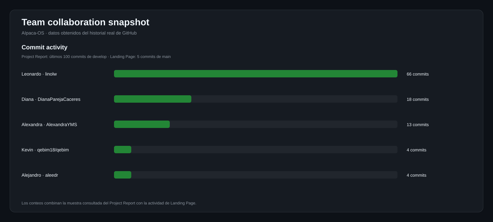
</div>

**Historial verificable:** https://github.com/AIpaca-OS/project-report/commits/develop/  
**Landing Page:** https://github.com/AIpaca-OS/landing-page/commits/main/

**Team Collaboration Network**

<div align="center">
  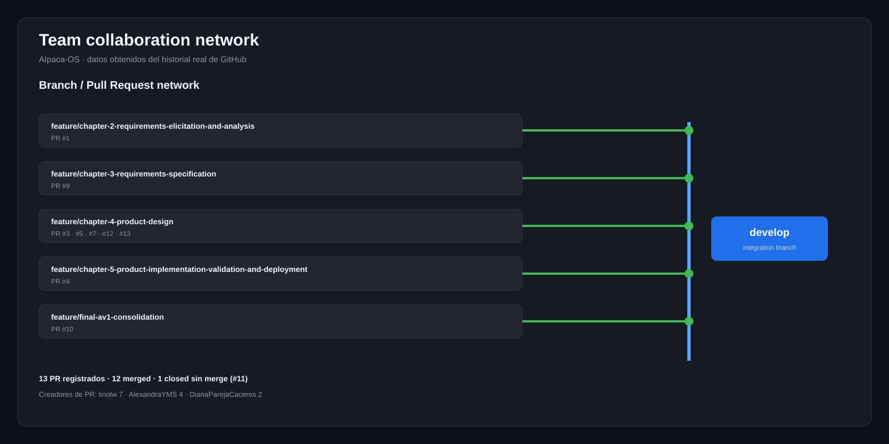
</div>

**Branches:** https://github.com/AIpaca-OS/project-report/branches  
**Network:** https://github.com/AIpaca-OS/project-report/network

La evidencia muestra trabajo mediante ramas por capítulo y consolidaciones sucesivas hacia `develop`. Se registran Pull Requests asociados a Requirements Elicitation, Requirements Specification, Product Design, Product Implementation y consolidación de AV1.

**Contributors / Pull Requests**

<div align="center">
  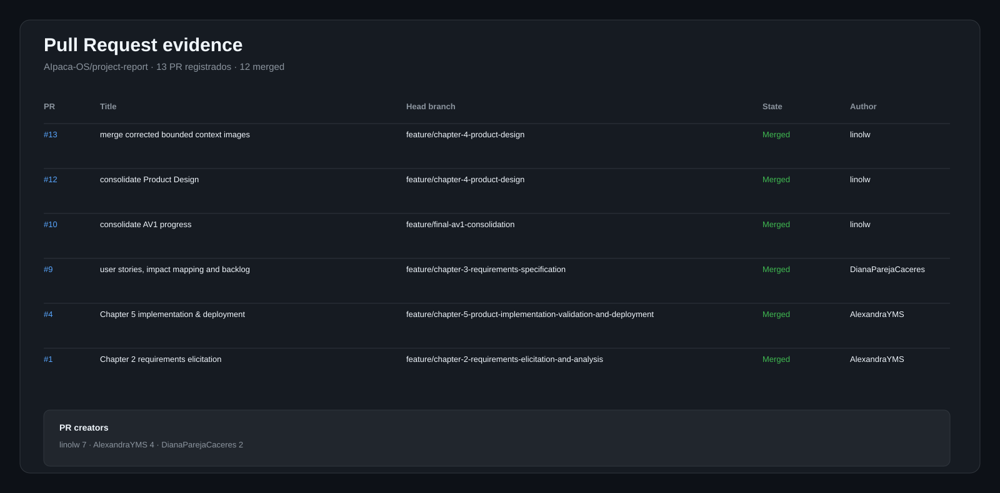
</div>

Hasta esta actualización el Project Report registra **13 Pull Requests**, de los cuales **12 fueron integrados** y uno fue cerrado sin merge. Entre los creadores de Pull Requests figuran `linolw`, `AlexandraYMS` y `DianaParejaCaceres`; el historial de commits también evidencia contribuciones de `aleedr` y `qebim18`.

**Contributors:** https://github.com/AIpaca-OS/project-report/graphs/contributors  
**Pull Requests:** https://github.com/AIpaca-OS/project-report/pulls?q=is%3Apr+is%3Aclosed

---

# Contenido

## Tabla de Contenidos

- [Student Outcome](#student-outcome)
- [Capítulo I: Introducción](#capítulo-i-introducción)
  - [1.1. Startup Profile](#11-startup-profile)
    - [1.1.1. Descripción de la Startup](#111-descripción-de-la-startup)
    - [1.1.2. Perfiles de integrantes del equipo](#112-perfiles-de-integrantes-del-equipo)
  - [1.2. Solution Profile](#12-solution-profile)
    - [1.2.1. Antecedentes y problemática](#121-antecedentes-y-problemática)
    - [1.2.2. Lean UX Process](#122-lean-ux-process)
      - [1.2.2.1. Lean UX Problem Statement](#1221-lean-ux-problem-statement)
      - [1.2.2.2. Lean UX Assumptions](#1222-lean-ux-assumptions)
      - [1.2.2.3. Lean UX Hypothesis Statements](#1223-lean-ux-hypothesis-statements)
      - [1.2.2.4. Lean UX Canvas](#1224-lean-ux-canvas)
  - [1.3. Segmentos objetivo](#13-segmentos-objetivo)
- [Capítulo II: Requirements Elicitation & Analysis](#capítulo-ii-requirements-elicitation--analysis)
  - [2.1. Competidores](#21-competidores)
  - [2.2. Entrevistas](#22-entrevistas)
  - [2.3. Needfinding](#23-needfinding)
  - [2.4. Big Picture Event Storming](#24-big-picture-event-storming)
  - [2.5. Ubiquitous Language](#25-ubiquitous-language)
- [Capítulo III: Requirements Specification](#capítulo-iii-requirements-specification)
- [Capítulo IV: Product Design](#capítulo-iv-product-design)
- [Capítulo V: Product Implementation, Validation & Deployment](#capítulo-v-product-implementation-validation--deployment)
- [Conclusiones](#conclusiones)
- [Bibliografía](#bibliografía)
- [Anexos](#anexos)

---

# Student Outcome

El curso contribuye al cumplimiento del **ABET – EAC – Student Outcome 3: Capacidad de comunicarse efectivamente con un rango de audiencias**.

| Criterio específico | Acciones realizadas | Conclusiones |
|---|---|---|
| Comunica oralmente con efectividad a diferentes rangos de audiencia. | **[Integrantes]** — AV1: [completar con participación real en entrevistas y exposición]. | [Conclusión grupal]. |
| Comunica por escrito con efectividad a diferentes rangos de audiencia. | **[Integrantes]** — AV1: [completar con participación real en informe, artefactos y documentación]. | [Conclusión grupal]. |

---

# Capítulo I: Introducción

## 1.1. Startup Profile

### 1.1.1. Descripción de la Startup

**AIpaca** es una startup tecnológica peruana orientada al desarrollo de soluciones digitales para mejorar la coordinación de servicios cotidianos. Su producto inicial es **Rumbo**, una plataforma enfocada en la coordinación del transporte escolar entre padres o tutores y conductores de movilidad escolar.

Rumbo busca centralizar información sobre el estado del traslado, los principales hitos de la ruta, retrasos e incidencias, de modo que las familias puedan comprender rápidamente qué ocurre durante el recorrido y los conductores puedan comunicar eventos relevantes sin repetir la misma información de manera individual.

La solución se plantea inicialmente para Lima y Callao. No reemplaza las obligaciones de seguridad, autorización y operación de los prestadores del servicio; busca complementar la experiencia con información organizada, accesible y oportuna.

### 1.1.2. Perfiles de integrantes del equipo

<table>
  <thead>
    <tr><th>Foto</th><th>Apellidos y nombres</th><th>Código</th><th>Carrera</th><th>Habilidades</th></tr>
  </thead>
  <tbody>
    <tr><td align="center"></td><td>Diaz Ramirez, Alejandro</td><td>U202423084</td><td>Ingeniería de Software</td><td>Estudiante de Ingeniería de Software de 5.º ciclo, con una base sólida en Python y C++, así como experiencia en prototipado rápido con React Native, lo que me permite aportar en el desarrollo técnico del proyecto, especialmente en la lógica del sistema, la estructuración del código y el procesamiento de datos. También agregar que he trabajado en entornos colaborativos bajo metodologías ágiles, gestionando proyectos y equipos con Scrum para asegurar entregas eficientes y de calidad.</td></tr>
    <tr><td align="center"></td><td>Geronimo Puma, Kevin Joel</td><td>U202423163</td><td>Ingeniería de Software</td><td>Estudiante de Ingeniería de Software de 5.º ciclo, con una base sólida en Python y C++. Mi perfil me permite aportar en el desarrollo técnico del proyecto, destacando por mi facilidad para la arquitectura de software y el diseño de bases de datos, además de la lógica del sistema, la estructuración del código y el procesamiento de datos. Asimismo, tengo experiencia trabajando en entornos colaborativos bajo metodologías ágiles, asegurando siempre entregas eficientes y de calidad.</td></tr>
    <tr><td align="center"></td><td>Lino Quispe, Leonardo Miguel</td><td>U202422298</td><td>Ingeniería de Software</td><td>Soy estudiante de Ingeniería de Software del 5.º ciclo en la UPC. Tengo conocimientos en programación en C++ y Python, y experiencia desarrollando proyectos académicos donde analizo y organizo soluciones tecnológicas. Me gusta enfocarme en aprender de forma práctica y en construir soluciones que sean claras, funcionales y aplicadas a problemas reales.</td></tr>
    <tr><td align="center"></td><td>Meza Soza, Alexandra Yamile</td><td>U20241b451</td><td>Ingeniería de Software</td><td>Soy estudiante de Ingeniería de Software del 6.º ciclo en la UPC. Cuento con conocimientos en el desarrollo de sistemas utilizando los lenguajes Python y C++. Me caracterizo por aprendizaje rápido, criterio para filtrar información relevante y trabajo colaborativo. En el equipo aporto investigación aplicada y prototipos técnicos que conectan los hallazgos con funcionalidades del producto.</td></tr>
    <tr><td align="center"></td><td>Pareja Caceres, Diana</td><td>U202422589</td><td>Ingeniería de Software</td><td>Soy estudiante de Ingeniería de Software en la UPC. He trabajado en análisis competitivo, elaboración de User Personas, organización de información, lineamientos visuales, diagramas de arquitectura C4 y modelado DDD. Estos conocimientos me permiten aportar al equipo en la documentación, el análisis del producto y la estructuración de artefactos de diseño y arquitectura.</td></tr>
  </tbody>
</table>

## 1.2. Solution Profile

El **Solution Profile** presenta una descripción general de **Rumbo**, producto desarrollado por AIpaca. Aborda el contexto en el que opera el transporte escolar en Lima y Callao, los problemas detectados en la coordinación entre familias y conductores y las suposiciones estratégicas que guían el desarrollo de la solución. Esta sección conecta el problema identificado con una propuesta de valor concreta y sirve como base para el diseño, la validación y el desarrollo posterior del producto.

### 1.2.1. Antecedentes y problemática

El transporte escolar constituye un servicio formal y regulado en Lima y Callao. En enero de 2026, la Autoridad de Transporte Urbano para Lima y Callao informó que **3758 vehículos se encontraban habilitados para prestar el servicio de transporte de estudiantes** y recordó que los padres pueden verificar digitalmente si el vehículo y el conductor están autorizados (Infobae, 2026). Esta cifra confirma que existe un ecosistema amplio de familias, conductores y operadores que realizan traslados escolares de manera recurrente.

En esta sección se analiza el contexto en el que surge la problemática principal, considerando sus factores sociales, tecnológicos y operativos. Se utiliza la técnica de las **5 W y 2 H** para responder de forma estructurada qué ocurre, quiénes están involucrados, cuándo y dónde sucede, por qué ocurre, cómo se abordará y cuál es una magnitud referencial de la oportunidad y del esfuerzo inicial requerido.

#### Técnica de las 5 W's + 2 H's

**What (¿Qué?) — ¿Cuál es el problema?**  
La coordinación diaria entre padres y conductores sigue dependiendo en gran medida de mensajes y llamadas individuales. Los mecanismos oficiales permiten verificar si un vehículo y un conductor se encuentran autorizados, pero no resuelven la pregunta de qué está pasando durante la ruta. Los padres no cuentan con una vista única donde consultar si el menor ya fue recogido, si la movilidad está retrasada, si llegó al colegio o si ocurrió un imprevisto. Esa información se transmite de forma dispersa y buena parte de ella recae sobre el conductor, que debe responder consultas similares a varias familias mientras cumple su recorrido.

**When (¿Cuándo?) — ¿Cuándo ocurre?**  
El problema ocurre durante los días de clase, principalmente antes del recojo, durante el traslado y al momento de la llegada o entrega. La incertidumbre se intensifica cuando los horarios escolares coinciden con las horas de mayor congestión y un retraso de pocos minutos puede convertirse en una espera prolongada (El Comercio, 2026).

**Where (¿Dónde?) — ¿Dónde surge?**  
El problema se presenta principalmente en Lima Metropolitana y el Callao, en las rutas que conectan hogares, puntos de recojo y centros educativos. El TomTom Traffic Index 2025 reportó para Lima un nivel de congestión de **69,3 %** y alrededor de **195 horas anuales perdidas** en tráfico de hora punta. En 2026, reportes basados en datos de TomTom continuaron mostrando velocidades muy reducidas durante la hora punta matinal (Energiminas, 2026).

**Who (¿Quiénes?) — ¿Quiénes son los afectados?**  
- **Padres y tutores**, que necesitan saber en qué etapa se encuentra el traslado de sus hijos y actualmente dependen con frecuencia de preguntar directamente al conductor.  
- **Conductores de movilidad escolar**, que deben cumplir su ruta en medio del tráfico y, al mismo tiempo, comunicar recojos, retrasos o incidencias a varias familias.

**Why (¿Por qué?) — ¿Por qué ocurre y por qué importa?**  
- **Comunicación fragmentada en canales generales:** la coordinación suele realizarse mediante mensajería instantánea y llamadas. Según ERESTEL 2025, WhatsApp se mantiene como una de las plataformas de comunicación más utilizadas en el país (Expreso, 2026), pero un chat general no fue diseñado para registrar hitos de una ruta.  
- **Alta variabilidad de los tiempos de viaje:** la congestión de Lima hace que la hora estimada de llegada cambie constantemente.  
- **Carga operativa del conductor:** responder consultas durante la ruta compite con su prioridad de conducir de forma segura.  
- **Ausencia de un registro estructurado:** recojos, entregas e incidencias no siempre quedan documentados de manera ordenada.  
- **Verificación sin visibilidad en ruta:** las herramientas oficiales permiten comprobar la formalidad del servicio, pero no muestran el estado de cada traslado.

**How (¿Cómo?) — ¿Cómo se abordará?**  
AIpaca propone Rumbo, una plataforma web responsive orientada al uso móvil que centraliza el estado de cada traslado. Esta decisión es coherente con la alta conectividad de Lima Metropolitana: durante el cuarto trimestre de 2025, el INEI reportó **98,4 % de hogares con telefonía móvil** y **90,3 % de la población de 6 años a más utilizando Internet** (INEI, 2026).

Para los padres y tutores, la plataforma permitirá consultar el estado actual del viaje, revisar una línea de tiempo con los hitos del recorrido y recibir notificaciones ante recojos, llegadas, retrasos o incidencias. Para los conductores, permitirá consultar la ruta y los estudiantes asignados, confirmar recojos y entregas mediante interacciones breves y registrar una incidencia una sola vez para las familias correspondientes.

La información de cada menor deberá estar disponible únicamente para usuarios autorizados. El producto considerará el marco peruano de protección de datos personales y los principios de privacidad y control de acceso aplicables al tratamiento de información relacionada con menores (Escobedo, 2024).

**How much (¿Cuánto?) — ¿Qué magnitud tiene y qué esfuerzo inicial requiere?**  
La ATU reportó **3758 vehículos escolares habilitados en Lima y Callao**, lo que permite identificar un mercado formal y recurrente. Como referencia del mercado, Comparabien (2025) señala que el precio mensual por estudiante de una movilidad escolar puede variar aproximadamente entre S/ 150 y S/ 300 según distancia y servicios adicionales.

Como estimación referencial elaborada por el equipo, el desarrollo de un primer producto funcional puede involucrar costos de diseño UX/UI y prototipado, frontend web responsive con Angular, backend y API REST con Spring Boot, base de datos, integración de servicios, infraestructura en la nube, seguridad, cumplimiento normativo, marketing, piloto y soporte. Tomando como referencia el cálculo realizado para la propuesta académica, el rango total inicial se estima entre **S/ 23 300 y S/ 36 500**. Este monto es una hipótesis de planificación y no representa una cotización validada de mercado.

#### Objetivos y restricciones iniciales

**Objetivo general:** Diseñar una solución digital que mejore la coordinación del transporte escolar entre padres/tutores y conductores, centralizando los principales eventos del traslado y reduciendo la dependencia de llamadas y mensajes individuales.

**Objetivos específicos:**
- Permitir que los padres comprendan rápidamente el estado del traslado y los principales hitos del recorrido.
- Permitir que los conductores registren recojos, entregas, retrasos e incidencias mediante interacciones breves y seguras.
- Mantener un historial estructurado de eventos del viaje para facilitar consultas posteriores.
- Validar durante el proyecto qué funcionalidades generan mayor valor antes de ampliar el alcance tecnológico.

**Restricciones iniciales:**
- El alcance de validación de AV1 se concentra en padres/tutores y conductores de movilidad escolar de Lima y Callao.
- La interacción del conductor debe diseñarse para realizarse únicamente cuando sea seguro hacerlo y sin incentivar el uso del dispositivo mientras conduce.
- El acceso a información de menores debe limitarse a usuarios autorizados y considerar la normativa de protección de datos personales.
- Para AV1, la implementación se concentra en la primera versión desplegada del Landing Page; Angular y Spring Boot se desarrollarán progresivamente en los siguientes Sprints.
- GPS en tiempo real, ETA dinámico, geofencing, IoT y cámaras inteligentes forman parte de capacidades posteriores y no constituyen requisitos del MVP de AV1.

### 1.2.2. Lean UX Process

El proceso Lean UX adoptado por AIpaca para Rumbo busca reducir el riesgo de construir funcionalidades que no aporten valor mediante la validación continua de supuestos. El enfoque se organiza en cuatro componentes: definición del problema, formulación de assumptions, creación de hypothesis statements y síntesis en el Lean UX Canvas.

#### 1.2.2.1. Lean UX Problem Statement

El estado actual de la coordinación del transporte escolar en Lima y Callao se ha centrado principalmente en verificar la formalidad del servicio y en la comunicación directa entre padres o tutores y conductores mediante mensajería instantánea y llamadas. Esto genera incertidumbre sobre recojos, llegadas y retrasos, así como consultas repetitivas que interrumpen al conductor durante la ruta.

Lo que los productos y servicios existentes no resuelven completamente es una vista única y estructurada, restringida por permisos, donde se registren los hitos de cada traslado —recojos, entregas, retrasos e incidencias— y se notifique únicamente a los tutores autorizados.

Rumbo abordará esta brecha mediante una plataforma web responsive en la que los conductores confirmen hitos con interacciones breves y los padres consulten el estado actual, la línea de tiempo del viaje y las notificaciones relevantes.

El segmento inicial estará compuesto por conductores de movilidad escolar que operan en Lima y Callao y por los padres o tutores que utilizan sus servicios.

Se considerará una señal inicial de éxito reducir en **60 %** las consultas de padres sobre el estado de la ruta y lograr que al menos **80 %** de los recojos y entregas de una ruta quede confirmado dentro de Rumbo durante un piloto controlado. Estas cifras son objetivos de validación y no resultados ya demostrados.

- **Domain:** transporte escolar, movilidad urbana y coordinación digital entre familias y prestadores de servicio.
- **Customer Segments:** padres, madres y tutores de estudiantes que usan movilidad escolar; conductores de movilidad escolar que realizan rutas recurrentes.
- **Pain Points — Padres/Tutores:** incertidumbre sobre el estado del traslado, falta de avisos oportunos e información dispersa entre chats y llamadas.
- **Pain Points — Conductores:** consultas repetitivas, necesidad de comunicar el mismo evento a varias familias y ausencia de un registro ordenado de recojos, entregas e incidencias.
- **Gap:** falta de una solución de uso extendido en Lima y Callao que combine en una sola experiencia el estado del traslado, confirmaciones, incidencias y notificaciones dirigidas a usuarios autorizados. Este supuesto deberá contrastarse con el análisis competitivo.
- **Vision/Strategy:** consolidar a AIpaca como una startup referente en coordinación digital de servicios familiares, iniciando con Rumbo como solución para transporte escolar y priorizando claridad, privacidad, seguridad y escalabilidad.
- **Initial Segment:** conductores de movilidad escolar de Lima y Callao y padres o tutores que utilizan sus servicios y dispositivos móviles con acceso a Internet.

#### 1.2.2.2. Lean UX Assumptions

Los siguientes supuestos representan las creencias iniciales del equipo sobre el modelo de negocio, los usuarios y la viabilidad de Rumbo. Serán contrastados mediante entrevistas, prototipos y pruebas durante las iteraciones del proceso Lean UX.

##### Business Assumptions

1. Creemos que los padres y tutores necesitan conocer el estado del traslado escolar de sus hijos para reducir su incertidumbre durante la ruta.
2. Creemos que una plataforma web responsive con estados, hitos, notificaciones e incidencias puede satisfacer esta necesidad mejor que la mensajería de uso general.
3. Creemos que los usuarios iniciales serán padres/tutores y conductores de movilidad escolar en Lima y Callao, mientras que el cliente pagador inicial puede ser el conductor u operador mediante una suscripción SaaS.
4. Creemos que el valor más importante para los padres es la tranquilidad de saber qué ocurre en la ruta sin tener que preguntar y, para los conductores, la reducción de mensajes repetitivos.
5. Creemos que un modelo SaaS con acceso asociado al servicio para padres/tutores y una suscripción mensual para conductores u operadores puede sostener el crecimiento inicial del producto.
6. Creemos que la ventaja competitiva inicial de Rumbo será una experiencia enfocada en hitos resumidos y eventos comprensibles; el seguimiento continuo por GPS podrá evaluarse posteriormente como una capacidad complementaria y no como la única fuente de valor.
7. Creemos que los conductores adoptarán la plataforma solo si registrar un evento toma pocos segundos y no interfiere con la conducción.
8. Creemos que los mayores riesgos son la desconfianza sobre el manejo de datos de menores y la resistencia a cambiar hábitos de coordinación, y que estos riesgos pueden reducirse mediante permisos estrictos por rol, políticas claras de privacidad y pilotos controlados.
9. Creemos que el costo de una eventual suscripción para conductores u operadores debe ser proporcional al valor que aporta en reducción de coordinación manual y gestión de rutas.

##### Business Outcome Assumptions

1. Reducir en 60 % los mensajes y llamadas de padres y tutores al conductor para consultar el estado de la ruta.
2. Lograr que al menos el 70 % de los padres y tutores activos consulte Rumbo en tres o más días de clases por semana.
3. Lograr que al menos el 80 % de los recojos y entregas de cada ruta quede confirmado dentro de Rumbo.
4. Lograr que al menos el 90 % de los retrasos e incidencias se comunique a las familias mediante Rumbo y no mediante mensajes individuales.
5. Mantener por debajo del 20 % la proporción de padres y tutores que desactiva las notificaciones durante el primer mes de uso.
6. Lograr que al menos el 60 % de los conductores que participen en el piloto continúe usando Rumbo después del primer mes.

##### User Assumptions

**Padres, madres y tutores**
1. Creemos que los padres y tutores trabajan o realizan otras actividades durante el horario de traslado y consultan el celular solo en momentos breves.
2. Creemos que hoy coordinan con el conductor principalmente mediante WhatsApp y llamadas telefónicas.
3. Creemos que sus momentos de mayor incertidumbre son antes del recojo, durante los retrasos por tráfico y al esperar la confirmación de llegada.
4. Creemos que prefieren recibir información resumida en estados e hitos antes que revisar conversaciones dispersas.
5. Creemos que solo confiarán en una plataforma si la información de su hijo es visible únicamente para usuarios autorizados.

**Conductores de movilidad escolar**
6. Creemos que los conductores realizan rutas recurrentes en las que atienden a varias familias y paradas por jornada.
7. Creemos que reciben consultas repetidas de distintas familias sobre un mismo evento de la ruta.
8. Creemos que organizan su lista de estudiantes y paradas de manera informal, de memoria, en papel o en chats.
9. Creemos que solo pueden interactuar con el celular de forma segura cuando el vehículo está detenido.
10. Creemos que valoran ofrecer una imagen más profesional y ordenada ante las familias.

##### Feature Assumptions

1. Creemos que una vista de estado actual del viaje permitirá a los padres y tutores entender en pocos segundos en qué etapa está el traslado.
2. Creemos que una línea de tiempo del trayecto dará más claridad sobre lo ocurrido durante el recorrido que una secuencia de mensajes de chat.
3. Creemos que la confirmación de recojo y entrega con una sola acción permitirá a los conductores registrar los hitos sin afectar su flujo de trabajo.
4. Creemos que un registro de incidencias con categorías predefinidas permitirá comunicar imprevistos con suficiente contexto y en poco tiempo.
5. Creemos que las notificaciones limitadas a eventos relevantes mantendrán informados a los padres sin saturarlos.
6. Creemos que una vista de ruta con los estudiantes asignados y el orden de paradas facilitará la organización diaria del conductor.

##### User Outcome and Benefit Assumptions

1. Los padres y tutores conocerán en pocos segundos la etapa actual del traslado sin contactar al conductor.
2. Los padres y tutores comprenderán lo ocurrido durante el recorrido sin revisar conversaciones dispersas.
3. Los conductores dejarán constancia de cada recojo y entrega en segundos, con el vehículo detenido.
4. Los conductores informarán un imprevisto a todas las familias afectadas mediante un único registro.
5. Los padres y tutores podrán anticiparse a retrasos sin recibir avisos innecesarios.
6. Los conductores organizarán su jornada con la lista de estudiantes y el orden de paradas en un solo lugar.

#### 1.2.2.3. Lean UX Hypothesis Statements

Se formula un Hypothesis Statement por cada Feature Assumption siguiendo la estructura: *Creemos que lograremos [resultado de negocio] si [persona] obtiene [beneficio] con [funcionalidad].*

**Hipótesis 1 — Estado actual del viaje**  
Creemos que lograremos reducir en 60 % los mensajes y llamadas al conductor para consultar el estado de la ruta si los padres y tutores conocen en pocos segundos la etapa actual del traslado con una vista de estado actual del viaje.

**Hipótesis 2 — Línea de tiempo del trayecto**  
Creemos que lograremos que al menos el 70 % de los padres y tutores activos consulte Rumbo en tres o más días de clases por semana si comprenden lo ocurrido durante el recorrido sin revisar conversaciones dispersas con una línea de tiempo del trayecto.

**Hipótesis 3 — Confirmación de recojo y entrega**  
Creemos que lograremos que al menos el 80 % de los recojos y entregas de cada ruta quede confirmado en Rumbo si los conductores dejan constancia de cada hito en segundos con la confirmación de recojo y entrega en una sola acción.

**Hipótesis 4 — Registro de incidencias**  
Creemos que lograremos que al menos el 90 % de los retrasos e incidencias se comunique mediante Rumbo si los conductores informan un imprevisto a todas las familias afectadas mediante un único registro con categorías predefinidas.

**Hipótesis 5 — Centro de notificaciones**  
Creemos que lograremos mantener por debajo del 20 % la proporción de padres y tutores que desactiva las notificaciones durante el primer mes si se anticipan a los retrasos sin recibir avisos innecesarios mediante notificaciones limitadas a eventos relevantes.

**Hipótesis 6 — Vista de ruta del conductor**  
Creemos que lograremos que al menos el 60 % de los conductores del piloto continúe usando Rumbo después del primer mes si organizan su jornada con la lista de estudiantes y el orden de paradas en un solo lugar mediante una vista de ruta con estudiantes asignados.

#### 1.2.2.4. Lean UX Canvas

El **Lean UX Canvas** sintetiza el problema de negocio, los segmentos objetivo, las soluciones preliminares, los resultados esperados y los principales aprendizajes que AIpaca necesita validar con Rumbo antes de ampliar el alcance del producto.

<p align="center">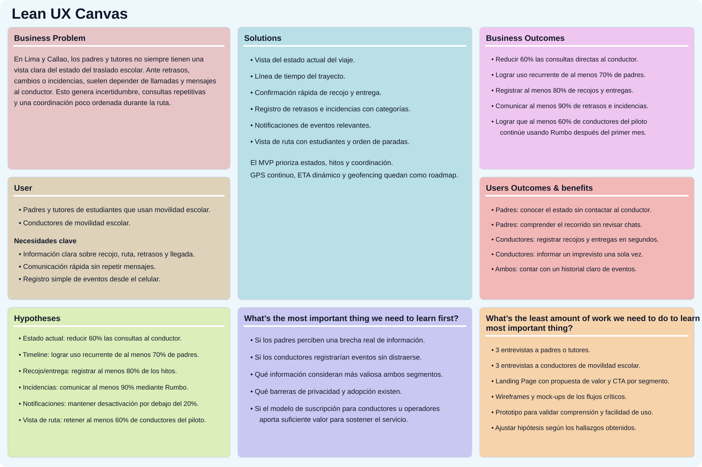</p>

## 1.3. Segmentos objetivo

En esta sección se identifican y describen los dos segmentos de usuarios hacia los cuales se dirige Rumbo. Estos segmentos sirven como referencia para el diseño de funcionalidades, las entrevistas de Needfinding y la comunicación del producto.

### Padres y tutores

**Descripción:** Padres, madres o tutores responsables de menores que utilizan servicios de movilidad escolar en Lima y Callao. Este segmento busca disminuir la incertidumbre durante los recorridos y acceder a información clara sobre recojo, traslado, retrasos, llegada e incidencias.

**Características demográficas y comportamiento:**
- Adultos responsables de menores en edad escolar que contratan o utilizan servicios de movilidad escolar.
- Utilizan principalmente el teléfono móvil para comunicarse y consultar información cotidiana.
- Valoran la inmediatez, claridad y facilidad de uso por encima de interfaces complejas.
- Requieren información relevante, pero no necesariamente una secuencia continua de mensajes.
- La confianza en la plataforma depende de la privacidad y del control sobre quién puede consultar información del menor.

**Sustento estadístico:**
- La ATU reportó **3758 vehículos habilitados para transporte escolar en Lima y Callao** en enero de 2026, evidenciando un mercado formal y recurrente de familias usuarias del servicio (Infobae, 2026).
- El INEI informó que **98,4 % de los hogares de Lima Metropolitana contaba con telefonía móvil** y **90,3 % de la población de 6 años a más utilizaba Internet** durante el cuarto trimestre de 2025 (INEI, 2026), lo que respalda una experiencia web orientada principalmente al uso móvil.

### Conductores de movilidad escolar

**Descripción:** Conductores que realizan rutas programadas para el traslado de estudiantes entre hogares, puntos de recojo y centros educativos. Este segmento necesita organizar el recorrido y comunicar a las familias los principales eventos de la ruta de forma rápida y consistente.

**Características demográficas y comportamiento:**
- Prestadores de un servicio regulado que operan vehículos autorizados para transporte de estudiantes.
- Trabajan con rutas, horarios, puntos de recojo y varios estudiantes durante una misma jornada.
- Necesitan reducir acciones digitales mientras conducen, por lo que las interacciones deben ser breves y ejecutarse únicamente cuando sea seguro hacerlo.
- Requieren comunicar retrasos, incidencias, recojos y entregas sin repetir la misma información individualmente.
- Valoran herramientas que simplifiquen la coordinación sin reemplazar sus responsabilidades operativas y de seguridad.

**Sustento estadístico:**
- La ATU reportó **3758 vehículos escolares habilitados en Lima y Callao** (Infobae, 2026), lo que permite identificar un grupo concreto de operadores y conductores dentro del mercado formal.
- Lima registró **69,3 % de congestión promedio durante 2025** y aproximadamente **195 horas anuales perdidas en tráfico de hora punta** (TomTom, 2026). Este contexto sustenta la necesidad de gestionar retrasos y comunicar variaciones de tiempo de manera ordenada.

**Escalabilidad comercial:** Los dos segmentos anteriores se mantienen como foco de validación de AV1. A medida que Rumbo crezca, asociaciones, cooperativas de transporte escolar e instituciones educativas pueden incorporarse como clientes organizacionales mediante planes que agrupen varias rutas, vehículos y usuarios.

**Evolución tecnológica:** El transporte escolar se plantea como el primer caso de uso de una plataforma más amplia de coordinación y seguridad desarrollada por AIpaca. En etapas posteriores podrían evaluarse zonas seguras y geofencing, integraciones con cámaras inteligentes o dispositivos IoT autorizados, detección automática de eventos y alertas asociadas a entradas, salidas o desvíos. Estas funcionalidades forman parte del roadmap y no son requisito del MVP actual.

---

---

# Capítulo II: Requirements Elicitation & Analysis

## 2.1. Competidores

### 2.1.1. Análisis competitivo

El análisis competitivo se desarrolla mediante el **Competitive Analysis Landscape** indicado en el Final Project Statement. Se compara a **Rumbo** con dos soluciones especializadas en transporte escolar —**SchoolBusTracker** y **Bus esCool**— y con un sustituto informal compuesto por herramientas de uso general como **WhatsApp y Waze**. El objetivo es reconocer diferencias reales entre las alternativas, identificar fortalezas y debilidades y analizar las oportunidades y amenazas particulares de cada una, evitando asumir funcionalidades o condiciones comerciales que no hayan sido verificadas.

<table>
  <thead>
    <tr><th colspan="6">Competitive Analysis Landscape</th></tr>
  </thead>
  <tbody>
    <tr>
      <th colspan="2">¿Por qué llevar a cabo este análisis?</th>
      <td colspan="4">Identificar cómo puede Rumbo diferenciarse frente a soluciones especializadas de transporte escolar y frente a los canales informales que actualmente pueden utilizar padres/tutores y conductores, considerando producto, mercado, canales y factores SWOT.</td>
    </tr>
    <tr>
      <th colspan="2">Competidores / Startup</th>
      <th>
        <br>
        AIpaca / Rumbo
      </th>
      <th>
        <br>
        SchoolBusTracker
      </th>
      <th>
        <br>
        Bus esCool
      </th>
      <th>
        <br>
        <br>
        Canales informales (WhatsApp + Waze)
      </th>
    </tr>
    <tr>
      <th rowspan="2">Perfil</th>
      <th>Overview</th>
      <td><strong>Rumbo</strong>, producto de la startup <strong>AIpaca</strong>, es una plataforma web responsive orientada a la coordinación del transporte escolar entre padres/tutores y conductores. El alcance actual prioriza estados e hitos del viaje, rutas, estudiantes, retrasos, incidencias y notificaciones.</td>
      <td>Suite especializada de transporte escolar dirigida principalmente a instituciones educativas. Incluye aplicaciones para padres y conductores y un panel administrativo para gestionar y supervisar el servicio.</td>
      <td>Plataforma de monitoreo y control de rutas escolares que conecta a colegios, padres de familia, coordinadores de transporte, monitores y conductores.</td>
      <td>Combinación de aplicaciones de mensajería, llamadas, navegación y ubicación que pueden utilizarse para coordinar el servicio, pero que no conforman por sí mismas un sistema especializado de transporte escolar.</td>
    </tr>
    <tr>
      <th>Ventaja competitiva / ¿Qué valor ofrece a los clientes?</th>
      <td>Experiencia enfocada inicialmente en padres/tutores y conductores, con información estructurada del traslado y un historial de eventos que reduce la dependencia de consultas repetitivas.</td>
      <td>Oferta madura e integrada: seguimiento en tiempo real, registro de subida y bajada, alertas, reservas, pagos, administración y reportes dentro de una misma suite.</td>
      <td>Seguimiento en tiempo real, avisos sobre imprevistos, control de inasistencias, información de abordaje y herramientas específicas para la operación de rutas escolares.</td>
      <td>Familiaridad de uso, amplia presencia en los teléfonos de los usuarios y posibilidad de comunicarse o consultar navegación sin adoptar inicialmente una plataforma adicional.</td>
    </tr>
    <tr>
      <th rowspan="2">Perfil de Marketing</th>
      <th>Mercado objetivo</th>
      <td>Padres/tutores y conductores de movilidad escolar de Lima y Callao.</td>
      <td>Colegios y organizaciones que administran transporte escolar, junto con padres, estudiantes y conductores que utilizan el servicio.</td>
      <td>Colegios, padres de familia, coordinadores de transporte, monitores y conductores vinculados a rutas escolares.</td>
      <td>Mercado general de usuarios de mensajería y navegación; dentro del problema de Rumbo actúan como herramientas sustitutas para familias y conductores.</td>
    </tr>
    <tr>
      <th>Estrategias de marketing</th>
      <td>Propuesta centrada en simplificar la coordinación entre los dos segmentos iniciales y reducir la comunicación manual mediante una experiencia web responsive.</td>
      <td>Comercialización orientada a instituciones mediante demostraciones, paquetes de servicio y posibilidades de personalización de la experiencia para cada organización.</td>
      <td>Adopción vinculada a instituciones y operadores de transporte, con una propuesta multirrol y un plan de prueba piloto comunicado desde su sitio oficial.</td>
      <td>No existe una estrategia única de transporte escolar: la adopción deriva principalmente de la presencia y utilidad general de cada aplicación.</td>
    </tr>
    <tr>
      <th rowspan="3">Perfil de Producto</th>
      <th>Productos &amp; Servicios</th>
      <td>Gestión de rutas, paradas y estudiantes; programación del traslado; estados e hitos del viaje; confirmaciones de recojo y entrega; retrasos, incidencias, notificaciones e historial.</td>
      <td>Parent App, Driver App y Admin Panel; seguimiento de rutas, registro de abordaje y descenso, alertas, reservas, pagos, gestión administrativa y reportes.</td>
      <td>Ubicación de la ruta en tiempo real, notificaciones de imprevistos y proximidad, gestión de inasistencias, información de abordaje, herramientas para conductor/monitor y panel de coordinación con reportes.</td>
      <td>Chats, llamadas, envío de mensajes, ubicación compartida y navegación. La información queda repartida entre herramientas y conversaciones diferentes.</td>
    </tr>
    <tr>
      <th>Precios &amp; Costos</th>
      <td>El modelo SaaS constituye una hipótesis del proyecto; el precio y las condiciones comerciales todavía requieren validación.</td>
      <td>Dispone de paquetes comerciales para instituciones. En este análisis no se asigna un precio concreto porque no se ha verificado uno aplicable de manera general.</td>
      <td>Servicio comercial para instituciones y usuarios vinculados a la ruta. En las fuentes consultadas no se verificó un precio público general aplicable a todos los clientes.</td>
      <td>No requieren una licencia específica de transporte escolar; el usuario puede tener costos asociados a conectividad o a las condiciones generales de cada servicio.</td>
    </tr>
    <tr>
      <th>Canales de distribución (Web y/o Móvil)</th>
      <td>Landing Page y Frontend Web Application responsive.</td>
      <td>Aplicaciones móviles para usuarios y plataforma/panel de administración.</td>
      <td>Aplicaciones móviles para los participantes de la ruta y plataforma web para coordinación.</td>
      <td>Principalmente aplicaciones móviles; algunos servicios también disponen de acceso web.</td>
    </tr>
    <tr>
      <th rowspan="4">Análisis SWOT</th>
      <th>Fortalezas</th>
      <td>Enfoque concreto en los dos segmentos iniciales de Rumbo; estructura de eventos del viaje; experiencia responsive; el valor del MVP no depende de GPS continuo, ETA dinámico o geofencing.</td>
      <td>Suite especializada consolidada, múltiples aplicaciones por rol, seguimiento en tiempo real, registro de pasajeros, administración, reportes, reservas y pagos.</td>
      <td>Especialización en rutas escolares, ubicación en tiempo real, notificaciones de eventos, gestión de inasistencias y coordinación entre varios roles.</td>
      <td>Alta familiaridad, disponibilidad inmediata y flexibilidad para mensajería, llamadas, navegación y ubicación compartida.</td>
    </tr>
    <tr>
      <th>Debilidades</th>
      <td>Producto nuevo y sin base instalada; varias capacidades todavía deben implementarse y validarse; el MVP actual no contempla como requisito GPS continuo, ETA dinámico ni geofencing.</td>
      <td>Su propuesta está orientada principalmente a instituciones y operaciones de transporte organizadas, por lo que puede resultar más amplia que las necesidades iniciales de una relación directa conductor–familia.</td>
      <td>La propuesta articula colegio, coordinadores, monitores y conductores, por lo que su adopción está fuertemente vinculada a una operación institucional o de ruta ya organizada.</td>
      <td>Información fragmentada, historial difícil de estructurar, ausencia de un ciclo de vida propio del viaje y necesidad de repetir comunicaciones manualmente.</td>
    </tr>
    <tr>
      <th>Oportunidades</th>
      <td>Atender la coordinación digital entre familias y conductores de movilidad escolar en Lima y Callao con una solución enfocada, accesible desde navegador y adaptada al contexto local.</td>
      <td>Ampliar su presencia a nuevos mercados e instituciones y aprovechar su suite existente para organizaciones que buscan digitalizar integralmente la gestión del transporte escolar.</td>
      <td>Extender alianzas con colegios y operadores de transporte escolar en más mercados latinoamericanos y aprovechar su experiencia de monitoreo y comunicación multirrol.</td>
      <td>Mantenerse como alternativa sustituta debido a la baja fricción de adopción y a que los usuarios ya conocen estas herramientas, incorporando además nuevas capacidades generales de comunicación y navegación.</td>
    </tr>
    <tr>
      <th>Amenazas</th>
      <td>Hábitos arraigados de coordinación mediante mensajería y llamadas; presencia de plataformas especializadas ya operativas; exigencias de confianza y privacidad por tratar información relacionada con menores.</td>
      <td>Competidores locales más ligeros o adaptados a mercados específicos; barreras de adopción para operadores pequeños; sustitución parcial mediante herramientas generalistas de comunicación y navegación.</td>
      <td>Entrada de soluciones con onboarding más simple para conductores independientes; competencia de suites internacionales y permanencia de canales informales ya adoptados.</td>
      <td>Las plataformas especializadas pueden reemplazar parte de su uso en transporte escolar al ofrecer permisos por rol, trazabilidad, estados del viaje, notificaciones estructuradas y reportes.</td>
    </tr>
  </tbody>
</table>

**Fuentes consultadas para contrastar las capacidades de los competidores:**  
- SchoolBusTracker: https://www.schoolbustrackerapp.com/  
- Bus esCool: https://busescool.com/  
- WhatsApp Brand Resources: https://www.meta.com/brand/resources/whatsapp/whatsapp-brand/  
- Waze: https://www.waze.com/

### 2.1.2. Estrategias y tácticas frente a competidores

Para organizar las estrategias y tácticas preliminares de **Rumbo** frente a la competencia, se emplean las matrices **FODA** y **CAME**. La matriz FODA resume la situación interna de la startup y el contexto externo identificado en el Competitive Analysis Landscape. A partir de ello, la matriz CAME plantea acciones para **Corregir debilidades, Afrontar amenazas, Mantener fortalezas y Explotar oportunidades**.

#### Matriz FODA

<table>
  <thead>
    <tr>
      <th>Interno / Externo</th>
      <th>Positivo</th>
      <th>Negativo</th>
    </tr>
  </thead>
  <tbody>
    <tr>
      <th>Interno</th>
      <td>
        <strong>Fortalezas (F)</strong><br><br>
        • Enfoque específico en los dos segmentos objetivo del proyecto: padres/tutores y conductores de movilidad escolar.<br><br>
        • Centralización de estados del traslado, hitos, retrasos, incidencias y notificaciones dentro de un mismo flujo de información.<br><br>
        • Web Application responsive planteada para funcionar con los dispositivos de los usuarios y sin requerir hardware propietario para las funcionalidades del MVP.
      </td>
      <td>
        <strong>Debilidades (D)</strong><br><br>
        • Producto nuevo, sin una base instalada ni confianza consolidada frente a soluciones que ya operan en el mercado.<br><br>
        • El alcance actual no contempla todavía GPS continuo, ETA dinámico ni geofencing, mientras que competidores especializados ya ofrecen capacidades de seguimiento en tiempo real.<br><br>
        • El valor de la coordinación depende de que conductores y familias adopten y utilicen de manera consistente la plataforma.
      </td>
    </tr>
    <tr>
      <th>Externo</th>
      <td>
        <strong>Oportunidades (O)</strong><br><br>
        • Los canales informales como mensajería, llamadas y ubicación compartida no estructuran el ciclo del traslado escolar ni consolidan un historial único de eventos.<br><br>
        • Las soluciones especializadas analizadas presentan una fuerte orientación a colegios, administradores y operaciones de transporte, lo que permite a Rumbo enfocarse en una experiencia directa para padres/tutores y conductores.<br><br>
        • La necesidad de reducir incertidumbre, mensajes repetitivos y falta de trazabilidad durante el traslado abre espacio para una solución centrada en estados e hitos claramente registrados.
      </td>
      <td>
        <strong>Amenazas (A)</strong><br><br>
        • SchoolBusTracker y Bus esCool ya ofrecen funciones especializadas de seguimiento, notificaciones y gestión del transporte escolar.<br><br>
        • WhatsApp, llamadas y herramientas de navegación cuentan con alta familiaridad y pueden seguir siendo suficientes para usuarios que no perciban un beneficio adicional al cambiar de herramienta.<br><br>
        • Las expectativas de los usuarios pueden estar influenciadas por competidores que ya ofrecen localización en tiempo real y otras capacidades que Rumbo ha dejado fuera del alcance actual.
      </td>
    </tr>
  </tbody>
</table>

#### Matriz CAME

| Estrategia | Tácticas preliminares de Rumbo |
|---|---|
| **C — Corregir Debilidades** | Validar progresivamente el MVP con ambos segmentos objetivo para mejorar usabilidad y confianza. Mantener claramente delimitado el alcance actual y evaluar GPS continuo, ETA dinámico y geofencing únicamente como evolución posterior si la validación demuestra su necesidad. Reforzar onboarding, autorizaciones y manejo de información de menores para reducir barreras de adopción. |
| **A — Afrontar Amenazas** | Diferenciarse de las soluciones especializadas mediante una experiencia más acotada a la coordinación directa entre conductor y familia. Frente a WhatsApp, llamadas y navegación, demostrar el valor de disponer de estados, hitos, retrasos e incidencias en un registro estructurado. Evitar competir mediante funcionalidades que todavía no están implementadas y sostener la propuesta sobre capacidades verificables del producto. |
| **M — Mantener Fortalezas** | Conservar el enfoque en los dos segmentos definidos, la estructura cronológica de eventos del viaje y la centralización de información relevante. Mantener una experiencia responsive y consistente entre las vistas destinadas a conductores y padres/tutores. Preservar las reglas de autorización y privacidad previstas por el proyecto. |
| **E — Explotar Oportunidades** | Orientar la adopción hacia casos donde la coordinación actual depende de mensajes o llamadas repetitivas. Posicionar a Rumbo como una alternativa estructurada para registrar y consultar el estado del traslado sin requerir una plataforma completa de administración de flotas. Priorizar en la experiencia las funcionalidades que cubren directamente los vacíos detectados: hitos del viaje, retrasos, incidencias, notificaciones y trazabilidad. |

## 2.2. Entrevistas

Se realizarán entrevistas semiestructuradas para comprender hábitos, procesos actuales, frustraciones, motivaciones, necesidades, herramientas utilizadas y barreras de adopción de los segmentos objetivo. Se busca obtener información suficiente para el análisis posterior y para construir los artefactos de Needfinding.

### 2.2.1. Diseño de entrevistas

### Preguntas dirigidas al primer segmento — Padres y tutores

1. ¿Podría indicarnos su edad, el distrito donde reside y la edad y grado escolar de su(s) hijo(s) que utilizan el transporte escolar?
2. Actualmente, ¿cómo se organiza con el recojo y retorno de sus hijos? ¿Sale a esperarlos, confía en el horario del conductor o utiliza alguna aplicación?
3. ¿Qué aplicaciones móviles utiliza con mayor frecuencia en su día a día (por ejemplo, WhatsApp, Waze, redes sociales, aplicaciones del colegio)?
4. Descríbanos su experiencia actual con el servicio de transporte escolar. ¿Qué es lo que más le preocupa o le genera incertidumbre durante el viaje de sus hijos?
5. ¿Cuántas veces al día suele comunicarse con el conductor para preguntar por la ubicación o el estado del viaje de sus hijos?
6. ¿Ha tenido experiencias donde el conductor llegó tarde, no pasó por su hijo o hubo confusión con los horarios? ¿Cómo manejó esa situación?
7. ¿Qué opina sobre la seguridad vial y el uso del celular por parte del conductor? ¿Le genera preocupación saber que el conductor podría distraerse al atender llamadas o mensajes de los padres?
8. Si existiera una aplicación que le mostrara en un mapa la ubicación exacta del vehículo en tiempo real y le notificara automáticamente cuando está cerca de su casa, sin que el conductor tenga que llamarle, ¿cómo cambiaría su rutina matutina?
9. Además de la ubicación, ¿qué otra información le gustaría recibir, como la confirmación de que su hijo abordó el vehículo o llegó al colegio?
10. ¿Estaría dispuesto a pagar una suscripción mensual por un servicio que le brinde esta tranquilidad y seguridad? ¿Cuánto consideraría justo pagar?
11. ¿Qué característica de la aplicación sería la más importante para usted para sentirse tranquilo al confiar el transporte de su hijo a un conductor registrado en nuestra plataforma?

### Preguntas dirigidas al segundo segmento — Conductores de movilidad escolar

1. ¿Cuál es tu nombre completo, edad, ocupación, distrito de residencia y cuántos años de experiencia tienes realizando transporte escolar?
2. ¿Cuántos estudiantes y rutas manejas normalmente durante una jornada de trabajo?
3. ¿Qué dispositivo, navegador y aplicaciones o canales digitales utilizas con mayor frecuencia para organizar tu trabajo y comunicarte con las familias?
4. Cuéntame cómo organizas actualmente los estudiantes, horarios, puntos de recojo y cambios que pueden surgir antes de una ruta.
5. ¿Cómo confirmas actualmente que un estudiante fue recogido o entregado y cómo comunicas esos eventos a sus familiares?
6. ¿Qué situaciones imprevistas o retrasos ocurren con mayor frecuencia durante una ruta y cómo los comunicas a las familias?
7. ¿Qué información te piden los padres con mayor frecuencia y qué parte de esa comunicación te quita más tiempo o se vuelve repetitiva?
8. ¿En qué momentos sería seguro y realista registrar información en un sistema sin distraerte de la conducción, y qué acciones digitales serían poco prácticas durante tu jornada?
9. ¿Qué información te sería útil conservar como historial de una ruta para resolver posteriormente dudas o reclamos?
10. ¿Qué datos consideras privados o que no deberían mostrarse libremente dentro de una plataforma de movilidad escolar?
11. ¿Qué tendría que ofrecer una herramienta digital para que la utilices de manera recurrente y qué barreras podrían impedir que la adoptes?
12. Si pudieras mejorar una sola parte de la coordinación con padres y tutores, ¿cuál sería y por qué?

### 2.2.2. Registro de entrevistas

Para cada entrevista se registrará nombre completo, edad, distrito, segmento, captura, URL del video, timing, duración y resumen descriptivo. Actualmente se cuenta con seis entrevistas registradas: tres del segmento Padres/Tutores y tres del segmento Conductores de movilidad escolar.

| # | Entrevistado | Edad | Distrito | Segmento | Duración | Referencia |
| -: | ----------- | ---: | -------- | -------- | :-----   | ---------- |
|  1 | Gabriela | 32 | Miraflores | Padre/Tutor |  07:19 | [Entrevista 1](#entrevista-1--gabriela) |
|  2 | Alejandro Choquehuanca | 34 | Surco | Padre/Tutor | 05:10 | [Entrevista 2](#entrevista-2--alejandro-choquehuanca)  |
|  3 | Eduardo Osorio | 34 | Magdalena | Padre/Tutor | 03:26 | [Entrevista 3](#entrevista-3--eduardo-osorio) |
|  4 | Gabriel Alexandro Sosa Guevara | 20 | Olivos | Conductor | 09:51 | [Entrevista 4](#entrevista-4--gabriel-alexandro-sosa-guevara) |
|  5 | Brayan Solorzano Pineda | 25 | Prueblo Libre | Conductor | 09:05 | [Entrevista 5](#entrevista-5--brayan-solorzano-pineda) |
|  6 | Vilma Hoyos Martinez | 56 | San Miguel | Conductor | 18:14 | [Entrevista 6](#entrevista-6--vilma-hoyos-martinez) |

## Entrevista 1 — Gabriela

* **Edad:** 32 años.
* **Ocupación / segmento:** Padre / Tutor.
* **Distrito:** Miraflores.
* **Duración:** 07:19.
* **Timing de inicio:** 00:00.
* **Video:** [Ver video](https://upcedupe-my.sharepoint.com/:v:/g/personal/u202422589_upc_edu_pe/IQD1AXwvDziBQJNjfqVNiPQWAeYMA26BAQOBC1tyKe_D9nw?nav=eyJyZWZlcnJhbEluZm8iOnsicmVmZXJyYWxBcHBQbGF0Zm9ybSI6IldlYiIsInJlZmVycmFsTW9kZSI6InZpZXciLCJyZWZlcnJhbEFwcFBsYXRmb3JtIjoiV2ViIiwicmVmZXJyYWxNb2RlIjoidmlldyIsInJlZmVycmFsVmlldyI6IlNoYXJlRGlhbG9nLUxpbmsiLCJyZWZlcnJhbEFwcCI6IlN0cmVhbVdlYkFwcCJ9fQ%3D%3D&e=VWo0MB).

<p align="center"></p>

**Resumen preliminar:** Gabriela tiene 32 años y pertenece al segmento de padres/tutores. Durante la entrevista se abordaron sus experiencias relacionadas con el transporte escolar de su sobrino de 8 años, especialmente los problemas ocasionados por retrasos mecánicos que no son comunicados oportunamente. Asimismo, destacó la importancia de evitar que el conductor manipule el celular mientras conduce, indicando que debería utilizarlo únicamente cuando se encuentre estacionado. Entre las funcionalidades de mayor interés se encuentra el rastreo en vivo de la movilidad. Respecto a la disposición de pago, considera viable un rango de S/ 15 a S/ 25 mensuales, siempre que pueda acceder previamente a un periodo de prueba gratuito.


## Entrevista 2 — Alejandro Choquehuanca

* **Edad:** 34 años.
* **Ocupación / segmento:** Padre / Tutor.
* **Distrito:** Surco.
* **Duración:** 05:10.
* **Timing de inicio:** 00:00.
* **Video:** [Ver video](https://upcedupe-my.sharepoint.com/:v:/g/personal/u202422589_upc_edu_pe/IQCneF6uJQneSbuVfMMPEvfKAdcXTo1sHeUy-SGF28JiP3g?nav=eyJyZWZlcnJhbEluZm8iOnsicmVmZXJyYWxBcHBQbGF0Zm9ybSI6IldlYiIsInJlZmVycmFsTW9kZSI6InZpZXciLCJyZWZlcnJhbFZpZXciOiJTaGFyZURpYWxvZy1MaW5rIiwicmVmZXJyYWxBcHAiOiJTdHJlYW1XZWJBcHAifX0%3D&e=f5sdCh).

<p align="center"></p>

**Resumen preliminar:** Alejandro tiene 34 años y pertenece al segmento de padres/tutores. Durante la entrevista se abordaron sus principales preocupaciones como padre de un niño de 6 años que utiliza transporte escolar en Surco. Entre sus preocupaciones se encuentra la distracción del conductor ocasionada por las llamadas de otros padres durante el trayecto. También manifestó interés en contar con un mapa en tiempo real que permita conocer la ubicación de la movilidad y reducir el tiempo de espera en la calle. Asimismo, considera importante recibir alertas cuando el estudiante ingresa al colegio y contar con mecanismos de verificación de la situación legal del conductor. Respecto a la disposición de pago, considera viable una suscripción mensual de S/ 15 a S/ 25.

## Entrevista 3 — Eduardo Osorio

* **Edad:** 34 años.
* **Ocupación / segmento:** Padre / Tutor.
* **Distrito:** Magdalena.
* **Duración:** 03:26.
* **Timing de inicio:** 00:00.
* **Video:** [Ver video](https://upcedupe-my.sharepoint.com/:v:/g/personal/u202422589_upc_edu_pe/IQDjMXK3n4smQaWYxZ2qTvKkAShiPN2nP5lMf1iIen8ONyA?nav=eyJyZWZlcnJhbEluZm8iOnsicmVmZXJyYWxBcHBQbGF0Zm9ybSI6IldlYiIsInJlZmVycmFsTW9kZSI6IlNoYXJlRGlhbG9nLUxpbmsiLCJyZWZlcnJhbEFwcCI6IlN0cmVhbVdlYkFwcCJ9fQ%3D%3D&e=HlhpOR).

<p align="center"></p>

**Resumen preliminar:** Eduardo tiene 34 años y pertenece al segmento de padres/tutores. Durante la entrevista se abordaron sus principales preocupaciones respecto al transporte escolar de su hijo de 4 años, quien se encuentra en inicial. Entre sus principales problemas se encuentra la ansiedad generada por la falta de visibilidad del trayecto, especialmente cuando ocurren averías imprevistas durante el recorrido. Manifestó interés en recibir alertas automáticas relacionadas con el abordaje del menor, incluyendo la confirmación de que viaje con el cinturón de seguridad puesto y que sea entregado correctamente a la profesora. Asimismo, considera valioso contar con información que le permita evitar la espera en la vereda. Respecto a la disposición de pago, acepta un rango de S/ 15 a S/ 25 mensuales.


## Entrevista 4 — Gabriel Alexandro Sosa Guevara

- **Edad:** 20 años.
- **Ocupación / segmento:** Conductor de movilidad escolar.
- **Experiencia en el rubro:** 2 años.
- **Distrito:** Olivos.
- **Duración:** 09:51.
- **Timing de inicio:** 00:00.
- **Video:** [Conductor 1.mp4](https://upcedupe-my.sharepoint.com/:v:/g/personal/u202422298_upc_edu_pe/IQC8MugJp8RuRYBv6-JB1JqxAa7zKfdSDfWOW6lMscwFzxg?nav=eyJyZWZlcnJhbEluZm8iOnsicmVmZXJyYWxBcHBQbGF0Zm9ybSI6IldlYiIsInJlZmVycmFsTW9kZSI6InZpZXciLCJyZWZlcnJhbFZpZXciOiJNeUZpbGVzTGlua0NvcHkifX0&e=MUf4ft).

<p align="center"></p>

**Resumen preliminar:** Gabriel cuenta con 2 años de experiencia realizando transporte escolar. Utiliza diariamente su teléfono para trabajar y principalmente usa WhatsApp para comunicarse con las familias y Google Maps para organizar sus rutas. Comenta que uno de los problemas que presenta es tener la información fragmentada en distintos chats, lo que hace poco práctico buscar entre conversaciones para verificar si un estudiante será recogido o consultar la dirección de un punto de llegada alternativo. Además, menciona que es repetitivo responder diariamente las preguntas de los padres sobre cuánto falta para que llegue su hijo, si la movilidad se encuentra cerca o si el estudiante se encuentra bien, ya que esto puede distraerlo mientras conduce. También considera que, en caso de utilizar una aplicación, esta debería ser fácil y rápida de utilizar para no quitarle tiempo durante la conducción. Entre las funcionalidades que considera útiles se encuentran una lista de alumnos, el orden de recojo y la posibilidad de registrar rápidamente cuándo recoge o entrega a un estudiante. Asimismo, le gustaría que los padres puedan visualizar el estado de la ruta y su ubicación para mantenerse informados sin necesidad de comunicarse constantemente con él.

## Entrevista 5 — Brayan Solorzano Pineda

- **Edad:** 25 años.
- **Ocupación / segmento:** Conductor de movilidad escolar.
- **Experiencia en el rubro:** 5 años.
- **Distrito:** Pueblo Libre.
- **Duración:** 09:05.
- **Timing de inicio:** 00:00.
- **Video:** [Conductor 2.mp4](https://upcedupe-my.sharepoint.com/:v:/g/personal/u202422298_upc_edu_pe/IQDViGOQ_7GOQYDKI1MqVAXNAacWQv3o8bRMqBJbKkhsKp8?nav=eyJyZWZlcnJhbEluZm8iOnsicmVmZXJyYWxBcHBQbGF0Zm9ybSI6IldlYiIsInJlZmVycmFsTW9kZSI6InZpZXciLCJyZWZlcnJhbFZpZXciOiJNeUZpbGVzTGlua0NvcHkifX0&e=6tRx0m).

<p align="center">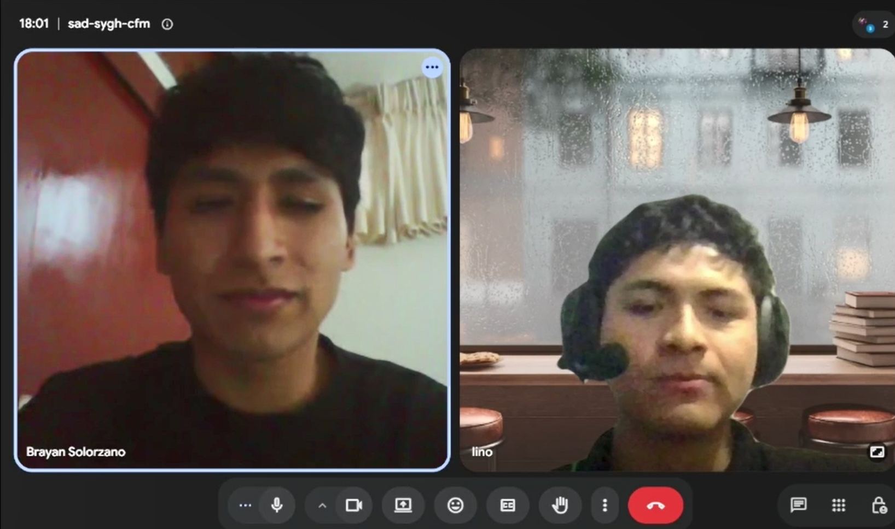</p>

**Resumen preliminar:** Brayan cuenta con 5 años de experiencia en el rubro. Comenzó trabajando en transporte personal, pero luego se trasladó al rubro del transporte escolar. Utiliza un grupo de WhatsApp para enviar avisos a los padres; sin embargo, los tutores prefieren escribirle por privado. Además, utiliza WaySide para evitar el tráfico y el calendario de su teléfono para recordar horarios especiales. Ha tenido problemas para recordar cambios en las rutas debido a modificaciones en el recojo de un alumno, especialmente porque varios padres le escriben. Diariamente, los padres también le preguntan si ya se encuentra cerca o si los niños ya llegaron a la escuela, lo cual considera repetitivo. Comenta que durante la conducción no utilizaría una aplicación. Sin embargo, le sería útil contar con un registro del inicio del recorrido, la hora de recojo de cada alumno y la hora de llegada a la escuela. También considera útil registrar cuando un alumno no será recogido. En general, considera que una aplicación debería ayudarlo a organizar los cambios y permitir que los padres puedan seguir la ruta sin necesidad de preguntarle constantemente. No utilizaría una aplicación que lo obligue a realizar muchas acciones manualmente o que tenga un costo muy elevado. Como característica adicional, le gustaría que pudiera utilizarse en zonas donde existe poca señal.

## Entrevista 6 — Vilma Hoyos Martinez

- **Edad:** 56 años.
- **Ocupación / segmento:** Conductor de movilidad escolar.
- **Experiencia en el rubro:** 25 años.
- **Distrito:** San Miguel.
- **Duración:** 18:14.
- **Timing de inicio:** 00:06.
- **Video:** [Conductor 3.mp4](https://upcedupe-my.sharepoint.com/:v:/g/personal/u20241b451_upc_edu_pe/IQAarNiMmGEZT73ZVhSkpNMNAVFqyptTBINEQvTJU6AW7BY?nav=eyJyZWZlcnJhbEluZm8iOnsicmVmZXJyYWxBcHAiOiJTdHJlYW1XZWJBcHAiLCJyZWZlcnJhbFZpZXciOiJTaGFyZURpYWxvZy1MaW5rIiwicmVmZXJyYWxBcHBQbGF0Zm9ybSI6IldlYiIsInJlZmVycmFsTW9kZSI6InZpZXcifX0%3D&e=asjxgo).

<p align="center">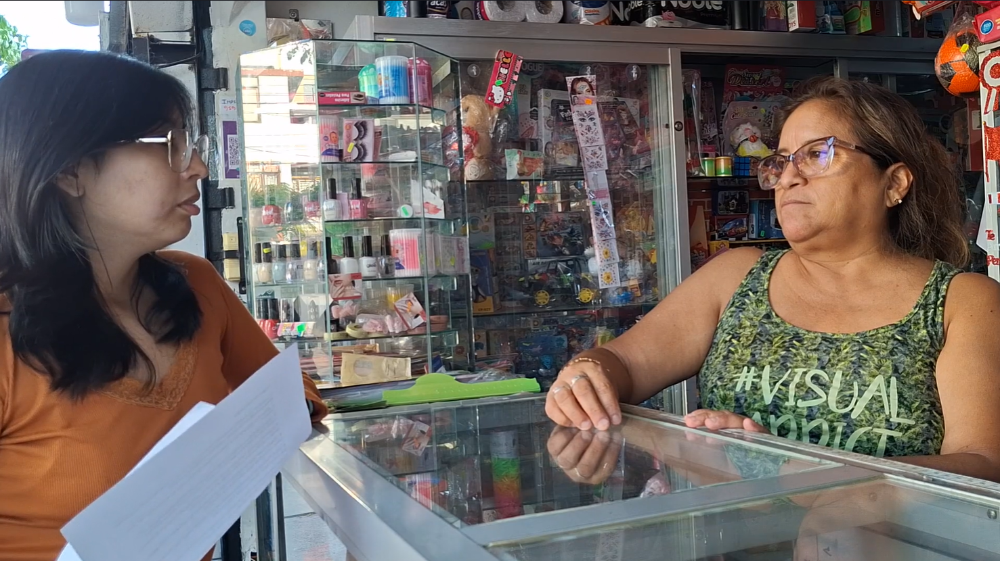</p>

**Resumen preliminar:** Vilma cuenta con 25 años de experiencia en el rubro de la movilidad escolar. Empezó llevando a estudiantes del colegio San Toribio, en el Rímac, hace 10 años y actualmente está a cargo de 26 niños en San Miguel, a quienes lleva a los colegios Claretiano y Los Rosales. La señora Vilma cuenta con un ayudante, quien utiliza la aplicación WhatsApp para comunicarse con las familias, coordinar horarios, llamar para avisar que deben bajar, informar si el niño asistirá, si necesita esperar y compartir su ubicación en tiempo real. Ha presentado problemas con la puntualidad de los niños y con la coordinación con los padres respecto a si los niños serán recogidos o no. Comenta que tiene conocimientos casi nulos en tecnología. Los padres le han recomendado utilizar algunas aplicaciones para poder realizar un mejor seguimiento del recorrido de sus hijos, pero menciona que no sabe cómo utilizarlas y, por ese motivo, no las implementa.

### 2.2.3. Análisis de entrevistas

Se compararán respuestas por segmento, separando **características objetivas** (edad, distrito, experiencia, dispositivo, navegador, canales y organización) y **características subjetivas** (motivaciones, frustraciones, necesidades, actitud hacia tecnología, privacidad y barreras). Los porcentajes se completarán solo con datos reales.

#### Datos Demográficos y Conductuales (Aspectos Objetivos)

* **Edades:** El 100% de los entrevistados del segmento Padres/Tutores tiene entre 32 y 38 años.
* **Rol de cuidado:** El 66.7% son padres de familia directos y el 33.3% corresponde a un tutor a cargo.
* **Edades de los menores:** El 100% de los niños tiene entre 4 y 8 años (33.3% inicial de 4 años; 66.7% en 1er y 3er grado de primaria).
* **Uso de herramientas digitales:** El 100% utiliza de forma diaria WhatsApp y aplicaciones con mapas (Google Maps, Waze).
* **Frecuencia de contacto:** El 100% se comunica con el chofer entre 2 y 3 veces por semana, principalmente cuando la movilidad excede los 15 minutos de tardanza habitual.

#### Datos preliminares del segmento Conductores

* Se han registrado tres entrevistas: Gabriel Alexandro Sosa Guevara, de 20 años; Brayan Solorzano Pineda, de 25 años; y Vilma Hoyos Martinez, de 56 años.
* La edad promedio de los conductores entrevistados es de **33,67 años**.
* La experiencia declarada en transporte escolar es de **2, 5 y 25 años**, con un promedio de **10,67 años**.
* El distrito de Vilma es San Miguel; los distritos de Gabriel y Brayan quedan pendientes de completar.

#### Comportamientos y Rutinas Actuales

* **Espera previa:** El 100% sale a la vereda con el menor entre 5 y 10 minutos antes de la hora pactada para no perder el turno de recojo.
* **Fallas y retrasos previos:** El 100% ha sufrido demoras graves  por desperfectos mecánicos o congestión vehicular, avisadas tarde y resolviendo el traslado con taxis por aplicativo de último momento.
* **Seguridad y uso del celular:** El 100% reconoce que el chofer no debería utilizar el teléfono mientras conduce niños. El 33.3%  señala que solo acepta el contacto telefónico si el vehículo está 100% estacionado.

#### Expectativas y Necesidades para el Proyecto

* **Seguimiento pasivo del viaje:** El 100% necesita conocer la ubicación del vehículo en tiempo real mediante un mapa interactivo para eliminar la necesidad de llamar o mandar mensajes al conductor.
* **Aviso de proximidad:** El 100% requiere una notificación automática previa (a 2 cuadras de distancia) para salir de casa al momento exacto y evitar esperas en la calle.
* **Confirmaciones de estado:** El 100% demanda saber cuándo el menor subió al vehículo y cuándo fue entregado de forma segura en la puerta del colegio. El 33.3%  agrega la confirmación del uso del cinturón de seguridad.
* **Canal directo de incidencias:** El 100% necesita que el chofer pueda reportar averías mecánicas o tráfico atípico de forma simultánea a todos los padres involucrados en la ruta.
* **Validación de seguridad:** El 100% prioriza la verificación de antecedentes penales, récord de papeletas, SOAT escolar al día y control de velocidad máxima permitida.

#### Modelo de Acceso y Disposición Económica

* **Rango de pago:** El 100% considera adecuado y justo pagar una mensualidad adicional de entre S/ 15 y S/ 25 por el servicio de monitoreo y seguridad.
* **Modalidad de prueba:** El 33.3% (Gabriela) requiere un periodo de prueba gratis (*free trial*) para validar la precisión del GPS y la estabilidad del sistema antes de pagar la suscripción mensual.

| Variable | Padres/Tutores | Conductores |
|---|---:|---:|
| Canal principal de comunicación | 100 % | 100% |
| Smartphone como dispositivo principal | 100% | 100% |
| Necesidad de conocer/comunicar estado de ruta | 100% | 100% |
| Retrasos/cambios frecuentes | 67% | 100% |
| Confirmación de recojo/entrega | 100% | 100% |
| Interés en notificaciones | 100% | 100% |
| Preocupación por privacidad | 33% | 100% |
| Barreras de adopción | 33% | 100% |

## 2.3. Needfinding

### 2.3.1. User Personas

En esta sección se presentan las User Personas correspondientes a los dos segmentos objetivos: **Padres/Tutores y Conductores**. Estas User Personas fueron elaboradas a partir de la información recopilada en las entrevistas previamente analizadas, con el objetivo de identificar un perfil común para cada segmento. En ellas se describe el perfil de nuestro usuario ideal, incluyendo sus características, necesidades y principales comportamientos.

## Segmento — Padres y tutores


## Segmento — Conductores


### 2.3.2. User Task Matrix

En esta sección se presenta la matriz de tareas de usuario (**User Task Matrix**), considerando al User Persona del segmento **Padre/Tutor (Gabriela Morales)** y al User Persona del segmento **Conductor de Movilidad Escolar**. Las tareas corresponden a actividades que los segmentos realizan para cumplir sus objetivos independientemente de la existencia de Rumbo.

<table>
  <thead>
    <tr>
      <th rowspan="2">User Tasks</th>
      <th colspan="2">User Persona: Padre / Tutor (Gabriela Morales)</th>
      <th colspan="2">User Persona: Conductor de Movilidad Escolar</th>
    </tr>
    <tr>
      <th>Frecuencia</th>
      <th>Importancia</th>
      <th>Frecuencia</th>
      <th>Importancia</th>
    </tr>
  </thead>
  <tbody>
    <tr><td>Alistar y preparar al escolar antes de la salida</td><td>Diaria (Alta)</td><td>Alta</td><td>No aplica</td><td>No aplica</td></tr>
    <tr><td>Esperar en la acera/puerta al vehículo de movilidad</td><td>Diaria (Alta)</td><td>Alta</td><td>No aplica</td><td>No aplica</td></tr>
    <tr><td>Consultar el estado y avance del vehículo en ruta</td><td>Diaria (Alta)</td><td>Alta</td><td>No aplica</td><td>No aplica</td></tr>
    <tr><td>Planificar y organizar la lista de paradas del recorrido</td><td>No aplica</td><td>No aplica</td><td>Diaria (Alta)</td><td>Alta</td></tr>
    <tr><td>Confirmar la subida del escolar a la unidad</td><td>Diaria (Alta)</td><td>Alta</td><td>Diaria (Alta)</td><td>Alta</td></tr>
    <tr><td>Verificar el uso del cinturón y medidas de seguridad del menor</td><td>Ocasional (Media)</td><td>Media</td><td>Diaria (Alta)</td><td>Alta</td></tr>
    <tr><td>Conducir y monitorear el flujo vehicular en horas punta</td><td>No aplica</td><td>No aplica</td><td>Diaria (Alta)</td><td>Alta</td></tr>
    <tr><td>Comunicar retrasos generados por congestión vehicular</td><td>Semanal (Media)</td><td>Alta</td><td>Semanal (Media)</td><td>Alta</td></tr>
    <tr><td>Informar incidencias mecánicas o emergencias imprevistas</td><td>Ocasional (Baja)</td><td>Alta</td><td>Ocasional (Baja)</td><td>Alta</td></tr>
    <tr><td>Confirmar la entrega del escolar en la puerta del colegio</td><td>Diaria (Alta)</td><td>Alta</td><td>Diaria (Alta)</td><td>Alta</td></tr>
    <tr><td>Coordinar el retorno del menor hacia el hogar</td><td>Diaria (Alta)</td><td>Media</td><td>Diaria (Alta)</td><td>Media</td></tr>
    <tr><td>Gestionar el pago mensual del servicio de transporte</td><td>Mensual (Baja)</td><td>Media</td><td>Mensual (Baja)</td><td>Media</td></tr>
  </tbody>
</table>

#### Análisis comparativo de la matriz de tareas

1. **Tareas de mayor frecuencia e importancia crítica (Coincidencias):**
   * **Confirmación de recojo y entrega escolar:** Tanto para el padre/tutor como para el conductor, confirmar el momento exacto en que el menor ingresa a la unidad y llega a salvo al centro educativo es una tarea diaria de máxima importancia. Para la familia representa tranquilidad emocional, mientras que para el conductor constituye el cumplimiento de su deber de custodia.
   * **Gestión de demoras por congestión:** Lima presenta una congestión en hora punta del 69.3%; por ende, la tarea de informar demoras tiene una frecuencia recurrente (semanal) y una importancia crítica (Alta) para ambos segmentos, pues evita la zozobra de las familias y la sobrecarga de consultas al chofer.

2. **Principales diferencias operativas entre segmentos:**
   * **Foco de atención en ruta:** Mientras el padre/tutor tiene una necesidad pasiva pero continua de consultar dónde está la movilidad para no salir a la acera a ciegas, el conductor debe mantener el 100% de su atención sobre el volante y el entorno vial, por lo que cualquier tarea que le exija distraer la vista representa un peligro potencial.
   * **Planificación previa:** El conductor asume la responsabilidad logística de trazar el orden óptimo de recojo y desembarque antes de arrancar el motor, una tarea ajena al padre de familia, quien únicamente se enfoca en el punto de parada correspondiente a su hogar o colegio.

3. **Oportunidad para el diseño de la solución:**
   El análisis evidencia que las tareas de *confirmar subida/bajada* y *avisar retrasos* son de alta fricción en la actualidad (se realizan mediante llamadas o mensajes manuales mientras se conduce). La solución debe automatizar y simplificar estas tareas al mínimo contacto operativo para proteger la seguridad del menor.

### 2.3.3. User Journey Mapping

En esta sección se presentan los **User Journey Maps** correspondientes a los dos segmentos objetivos: **Padres/Tutores y Conductores**. Estos mapas representan el recorrido actual de cada usuario durante el servicio de movilidad escolar, desde el inicio hasta el final de su experiencia.

Se presentan las versiones **As-Is**, que permiten analizar cómo se desarrolla actualmente el proceso sin la intervención de nuestra solución. A través de las diferentes etapas, actividades, puntos de contacto y dificultades identificadas, se busca comprender la experiencia de cada User Persona y detectar oportunidades de mejora.

## Segmento — Padres y tutores

El journey de los padres de familia durante las mañanas inicia con la preparación en casa, donde alistan al menor con una sensación inicial de serenidad, aunque experimentan la falta de visibilidad sobre el inicio de la ruta. Al pasar a la espera en la acera, se vive un estado de vigilancia mientras aguardan a la intemperie la llegada de la movilidad, lo que da paso a la etapa de retraso e incertidumbre: al cumplirse más de quince minutos de demora sin respuesta del conductor debido a que va manejando, la ansiedad y el miedo a llegar tarde se apoderan del tutor. Posteriormente, durante el abordaje y despacho, la subida se realiza de forma apresurada y sin la certeza de las medidas de seguridad, generando temor. Finalmente, en el trayecto y llegada, los padres experimentan angustia e incertidumbre total hasta recibir la confirmación de que el menor ha ingresado sin novedades al colegio.


## Segmento — Conductores

El recorrido diario del conductor inicia antes del viaje con una etapa neutral donde revisa chats de WhatsApp para corroborar asistencias de forma tediosa y repetitiva. Al pasar al durante el viaje de ida, la experiencia desciende hacia la molestia (annoyance) debido a lo estresante y peligroso que resulta manejar mientras responde mensajes constantes y llamadas sobre demoras. Posteriormente, en el después del viaje y la previa antes del viaje de retorno, el conductor se informa de cambios mediante chats fragmentados con una actitud serena y de anticipación. Al encontrarse en el colegio para la recogida, la experiencia se mantiene en un estado de vigilancia y neutralidad mientras cuenta y verifica la asistencia de los menores lidiando con llamadas de última hora. En el durante el viaje de regreso, vuelve a experimentar momentos neutrales al repartir a los estudiantes mientras responde chats y busca información de emergencia. Finalmente, la jornada concluye en el después del viaje de vuelta a casa con una sensación de serenidad al comunicarse individualmente con los padres para confirmar que los niños llegaron a sus domicilios.


### 2.3.4. Empathy Mapping

En esta sección se presentan los **Empathy Maps** elaborados para cada uno de los User Personas: **Parent/Tutor y Driver**. Estos mapas fueron construidos a partir de las observaciones obtenidas durante las entrevistas y permiten comprender sus necesidades, comportamientos, pensamientos, emociones, Pains y Gains dentro del contexto de la movilidad escolar.

## Segmento — Padres y tutores


## Segmento — Conductores


## 2.4. Big Picture Event Storming

En esta sección se presenta una aproximación inicial al **Event Storming** del dominio de movilidad escolar, identificando los principales eventos y procesos que ocurren durante el traslado de los estudiantes. Esta representación permitirá establecer una base para comprender el funcionamiento del dominio y continuar refinándolo en futuras iteraciones del proyecto.

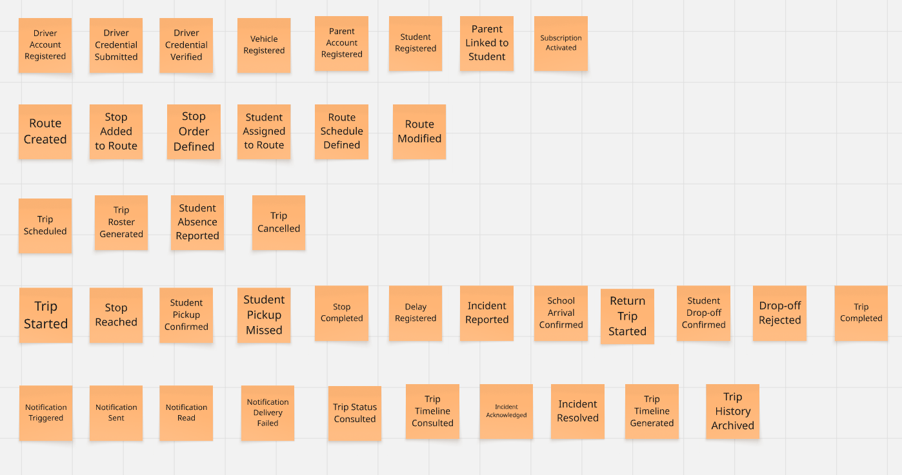

## 2.5. Ubiquitous Language

En esta sección se presenta el glosario de términos del dominio de movilidad escolar, recopilados para establecer un lenguaje común entre los miembros del equipo y los stakeholders. Los términos y sus definiciones representan conceptos utilizados dentro del contexto del problema y la solución propuesta.


| Término                                       | Definición                                                                                                                                          |
| --------------------------------------------- | --------------------------------------------------------------------------------------------------------------------------------------------------- |
| **Student (Estudiante)**                      | Persona que utiliza el servicio de movilidad escolar para trasladarse entre su domicilio y el colegio.                                              |
| **Parent/Tutor (Padre/Tutor)**                | Persona responsable del estudiante que utiliza el servicio de movilidad y recibe información sobre su traslado.                                     |
| **Driver (Conductor)**                        | Persona encargada de conducir el vehículo de movilidad escolar y realizar el traslado de los estudiantes asignados a su ruta.                       |
| **Vehicle (Vehículo)**                        | Medio de transporte utilizado por el conductor para realizar el traslado de los estudiantes.                                                        |
| **Route (Ruta)**                              | Recorrido establecido que realiza el vehículo para recoger y dejar a los estudiantes en los puntos correspondientes.                                |
| **Trip (Viaje)**                              | Traslado realizado por el vehículo siguiendo una ruta determinada, ya sea desde los domicilios hacia el colegio o del colegio hacia los domicilios. |
| **Stop (Parada)**                             | Punto establecido dentro de una ruta donde se recoge o deja a uno o más estudiantes.                                                                |
| **Pickup (Recojo)**                           | Acción de recoger a un estudiante en el punto establecido para iniciar o continuar el traslado.                                                     |
| **Drop-off (Dejar)**                          | Acción de dejar a un estudiante en el punto establecido al finalizar su traslado.                                                                   |
| **Trip Status (Estado del viaje)**            | Estado actual en el que se encuentra un viaje, como pendiente, en camino, en curso o finalizado.                                                    |
| **Delay (Demora)**                            | Retraso en el horario o recorrido previsto de un viaje que puede afectar la hora estimada de recojo o llegada.                                      |
| **Incident (Incidente)**                      | Situación inesperada ocurrida durante el viaje que puede afectar el traslado o la seguridad de los estudiantes.                                     |
| **Notification (Notificación)**               | Aviso enviado a los padres o tutores para informar sobre cambios o eventos relacionados con el traslado de su hijo.                                 |
| **ETA (Hora estimada de llegada)**            | Tiempo estimado en el que la movilidad llegará a un punto determinado de la ruta.                                                                   |
| **Trip Timeline (Línea de tiempo del viaje)** | Registro ordenado de los principales eventos de un viaje, como el inicio del recorrido, recojo, llegada al colegio, salida y llegada al domicilio.  |


---

# Capítulo III: Requirements Specification

## 3.1. User Stories

A continuación se presenta el conjunto de Epics y User Stories de Rumbo. Los criterios de aceptación siguen la estructura Gherkin (Given-When-Then), se redactan en tiempo presente y tercera persona. Las Technical Stories corresponden a las capacidades del RESTful API y utilizan el rol Developer.

#### Epics

| Epic / Story ID | Título | Descripción | Criterios de Aceptación | Relacionado con (Epic ID) |
|---|---|---|---|---|
| EP01 | Identidad, perfiles y autorización | Registro de conductores, padres y estudiantes, acceso al sistema según rol, y control sobre qué tutores pueden consultar la información de cada menor, incluida la solicitud de supresión de sus datos. | — | — |
| EP02 | Suscripción del conductor | Activación y vigencia del plan que habilita al conductor el uso de las funcionalidades de Rumbo. | — | — |
| EP03 | Planificación de rutas y viajes | Creación de rutas con sus paradas, orden y horario, asignación de estudiantes autorizados, publicación de la ruta y programación de los viajes de cada jornada, incluyendo ausencias y cancelaciones. | — | — |
| EP04 | Ejecución del traslado | Registro de los hitos del recorrido por parte del conductor: inicio del viaje, recojos, llegada al centro educativo, retorno, entregas y cierre del traslado. | — | — |
| EP05 | Visibilidad, incidencias y comunicación | Consulta del estado y la línea de tiempo por parte de los tutores autorizados, y comunicación de retrasos, incidencias y notificaciones sobre los eventos relevantes de la ruta. | — | — |
| EP06 | Landing Page e información pública | Contenido público que presenta la propuesta de valor de Rumbo, los beneficios por segmento, los documentos legales y los accesos a la aplicación web. | — | — |
| EP07 | RESTful API e integraciones | Capacidades técnicas del RESTful API, incluyendo autenticación, documentación, internacionalización e integración con servicios externos requeridos por Rumbo. | — | — |

#### User Stories

| Epic / Story ID | Título | Descripción | Criterios de Aceptación | Relacionado con (Epic ID) |
|---|---|---|---|---|
| US01 | Registrar cuenta de conductor | Como conductor, deseo crear mi cuenta para iniciar la configuración de mi servicio en Rumbo. | **Escenario 1: Registro exitoso**<br>Given que no existe una cuenta asociada al correo indicado<br>When el conductor completa los datos obligatorios y confirma el registro<br>Then el sistema crea la cuenta con rol de conductor y solicita la verificación del correo<br><br>**Escenario 2: Correo ya registrado**<br>Given que existe una cuenta asociada al correo indicado<br>When el conductor intenta registrarse con ese correo<br>Then el sistema rechaza el registro e indica que puede iniciar sesión o recuperar su acceso<br><br>**Escenario 3: Datos obligatorios incompletos**<br>Given un formulario de registro con datos faltantes<br>When el conductor confirma el registro<br>Then el sistema informa qué datos obligatorios debe completar y no crea la cuenta | EP01 |
| US02 | Registrar vehículo y credenciales del servicio | Como conductor, deseo registrar mi vehículo y las credenciales que acreditan mi servicio para que las familias conozcan la información declarada de mi movilidad. | **Escenario 1: Registro de vehículo y credenciales**<br>Given un conductor con cuenta activa<br>When registra la placa, la capacidad del vehículo y los documentos requeridos<br>Then el sistema asocia el vehículo al conductor y deja las credenciales en estado pendiente de verificación<br><br>**Escenario 2: Placa ya registrada**<br>Given que la placa indicada pertenece a un vehículo activo de otro conductor<br>When el conductor intenta registrarla<br>Then el sistema rechaza el registro e informa que la placa ya se encuentra asociada<br><br>**Escenario 3: Verificación de credenciales**<br>Given credenciales enviadas y un servicio de verificación disponible<br>When el sistema obtiene una respuesta del servicio<br>Then registra el resultado junto con su fuente y fecha de consulta<br><br>**Escenario 4: Servicio de verificación no disponible**<br>Given credenciales enviadas y el servicio de verificación fuera de operación<br>When el sistema intenta la consulta<br>Then mantiene las credenciales como pendientes y no las declara verificadas | EP01 |
| US03 | Registrar cuenta de padre o tutor | Como padre o tutor, deseo crear mi cuenta para acceder a la información autorizada de los traslados de mis hijos. | **Escenario 1: Registro exitoso**<br>Given que no existe una cuenta asociada al correo indicado<br>When el tutor completa los datos obligatorios y confirma el registro<br>Then el sistema crea la cuenta con rol de padre o tutor y solicita la verificación del correo<br><br>**Escenario 2: Correo ya registrado**<br>Given que existe una cuenta asociada al correo indicado<br>When el tutor intenta registrarse con ese correo<br>Then el sistema rechaza el registro e indica que puede iniciar sesión o recuperar su acceso | EP01 |
| US04 | Iniciar sesión según rol | Como usuario registrado, deseo iniciar sesión con mis credenciales para acceder a las funcionalidades correspondientes a mi rol. | **Escenario 1: Acceso válido**<br>Given una cuenta activa con credenciales correctas<br>When el usuario inicia sesión<br>Then el sistema le otorga acceso a las funcionalidades permitidas para su rol<br><br>**Escenario 2: Credenciales inválidas**<br>Given credenciales incorrectas<br>When el usuario intenta iniciar sesión<br>Then el sistema rechaza el acceso sin revelar cuál de los datos es incorrecto<br><br>**Escenario 3: Cuenta sin verificar**<br>Given una cuenta cuyo correo no ha sido verificado<br>When el usuario intenta iniciar sesión<br>Then el sistema informa que debe completar la verificación antes de continuar | EP01 |
| US05 | Recuperar acceso a la cuenta | Como usuario registrado, deseo restablecer mi contraseña para recuperar el acceso en caso de olvido. | **Escenario 1: Solicitud válida**<br>Given un correo asociado a una cuenta activa<br>When el usuario solicita recuperar su acceso<br>Then el sistema envía un enlace temporal para establecer una nueva contraseña<br><br>**Escenario 2: Enlace expirado o utilizado**<br>Given un enlace de recuperación vencido o ya usado<br>When el usuario intenta acceder con él<br>Then el sistema lo rechaza y solicita generar una nueva petición<br><br>**Escenario 3: Correo no registrado**<br>Given un correo que no corresponde a ninguna cuenta<br>When se solicita la recuperación<br>Then el sistema responde de forma uniforme sin revelar si el correo existe | EP01 |
| US06 | Registrar estudiante y vincularse como tutor | Como padre o tutor, deseo registrar a mi hijo y quedar vinculado como su tutor para poder consultar la información de sus traslados. | **Escenario 1: Registro y vinculación**<br>Given un tutor autenticado<br>When registra los datos obligatorios del estudiante<br>Then el sistema crea el perfil del estudiante y establece la autorización del tutor sobre él<br><br>**Escenario 2: Actualización de datos**<br>Given un estudiante ya registrado<br>When el tutor modifica un dato permitido<br>Then el sistema actualiza la información y conserva la relación con sus viajes anteriores<br><br>**Escenario 3: Datos obligatorios incompletos**<br>Given un registro con datos faltantes<br>When el tutor confirma la operación<br>Then el sistema indica qué datos debe completar y no crea el perfil | EP01 |
| US07 | Autorizar o revocar a otro tutor | Como padre o tutor, deseo autorizar o retirar el acceso de otro tutor sobre mi hijo para controlar quién puede consultar su información. | **Escenario 1: Autorización de un tutor adicional**<br>Given un tutor con autorización vigente sobre un estudiante<br>When autoriza a otra persona registrada como tutor de ese estudiante<br>Then el sistema crea la nueva autorización y la habilita para consultar la información del menor<br><br>**Escenario 2: Revocación**<br>Given una autorización vigente sobre un estudiante<br>When el tutor responsable la revoca<br>Then el sistema retira el acceso y la persona deja de recibir notificaciones sobre ese estudiante<br><br>**Escenario 3: Persona no registrada**<br>Given que la persona indicada no cuenta con una cuenta en Rumbo<br>When se intenta autorizarla<br>Then el sistema informa que debe registrarse previamente<br><br>**Escenario 4: Consulta sin autorización**<br>Given un usuario sin autorización vigente sobre un estudiante<br>When intenta consultar su información<br>Then el sistema rechaza la operación | EP01 |
| US08 | Solicitar la supresión de datos del estudiante | Como padre o tutor, deseo solicitar la eliminación de los datos personales de mi hijo para ejercer el control sobre su información. | **Escenario 1: Solicitud registrada**<br>Given un tutor con autorización vigente sobre un estudiante<br>When envía una solicitud de supresión de datos<br>Then el sistema registra la solicitud con su fecha y la deriva al procedimiento de atención correspondiente<br><br>**Escenario 2: Estudiante con viajes en curso**<br>Given un estudiante asignado a un viaje que aún no finaliza<br>When se registra la solicitud<br>Then el sistema la conserva como pendiente hasta el cierre del viaje e informa esta condición al tutor | EP01 |
| US09 | Activar la suscripción del conductor | Como conductor, deseo activar una suscripción para habilitar las funcionalidades incluidas en mi plan. | **Escenario 1: Activación válida**<br>Given un conductor con cuenta activa y un plan disponible<br>When el conductor confirma la activación de la suscripción<br>Then el sistema registra el plan y su periodo de vigencia y habilita las funcionalidades correspondientes<br><br>**Escenario 2: Suscripción ya activa**<br>Given un conductor con una suscripción vigente al mismo plan<br>When solicita activarla nuevamente<br>Then el sistema conserva la suscripción vigente y evita generar una activación duplicada | EP02 |
| US10 | Crear una ruta con sus paradas | Como conductor, deseo crear una ruta con sus paradas en el orden en que las recorro para organizar mi servicio. | **Escenario 1: Creación de la ruta**<br>Given un conductor con cuenta activa y un vehículo registrado<br>When registra el nombre, el turno y los datos obligatorios de la ruta<br>Then el sistema crea la ruta en estado configurable<br><br>**Escenario 2: Incorporación de paradas**<br>Given una ruta en estado configurable<br>When el conductor agrega una parada con una dirección válida<br>Then el sistema la incorpora al recorrido y le asigna la siguiente posición disponible<br><br>**Escenario 3: Reordenamiento de paradas**<br>Given una ruta con dos o más paradas<br>When el conductor modifica el orden del recorrido<br>Then el sistema conserva la nueva secuencia para los viajes que se generen a partir de esa ruta<br><br>**Escenario 4: Dirección no localizable**<br>Given una dirección que el servicio de mapas no puede ubicar<br>When el conductor intenta agregar la parada<br>Then el sistema informa la situación y permite corregir la dirección antes de guardarla | EP03 |
| US11 | Definir el horario de la ruta | Como conductor, deseo establecer los días y horarios de una ruta para que sus viajes se programen de forma recurrente. | **Escenario 1: Horario válido**<br>Given una ruta en estado configurable<br>When el conductor define los días de servicio y las horas correspondientes<br>Then el sistema guarda el horario y lo asocia a la ruta<br><br>**Escenario 2: Horario incompleto**<br>Given una ruta con datos de horario incompletos<br>When el conductor intenta confirmar la programación<br>Then el sistema rechaza la operación e indica qué información obligatoria falta | EP03 |
| US12 | Asignar estudiantes a una ruta | Como conductor, deseo asignar a los estudiantes autorizados a una ruta y a su parada para incluirlos en los recorridos. | **Escenario 1: Asignación autorizada**<br>Given un estudiante registrado, una ruta existente y una vinculación autorizada<br>When el conductor asigna al estudiante a una parada de la ruta<br>Then el sistema registra la asignación y lo incluye en los viajes que se generen para esa ruta<br><br>**Escenario 2: Estudiante sin autorización**<br>Given un estudiante cuya vinculación no está autorizada<br>When el conductor intenta asignarlo a una ruta<br>Then el sistema rechaza la operación y no crea la asignación<br><br>**Escenario 3: Asignación duplicada**<br>Given un estudiante ya asignado a la misma ruta y turno<br>When el conductor intenta asignarlo nuevamente<br>Then el sistema conserva una sola asignación | EP03 |
| US13 | Publicar una ruta | Como conductor, deseo publicar una ruta configurada para habilitar la programación de sus viajes y su visibilidad para los tutores autorizados. | **Escenario 1: Publicación exitosa**<br>Given una ruta con al menos una parada, un horario definido y un estudiante asignado<br>When el conductor la publica<br>Then el sistema cambia su estado a publicada y habilita la generación de viajes<br><br>**Escenario 2: Configuración incompleta**<br>Given una ruta sin horario definido o sin paradas<br>When el conductor intenta publicarla<br>Then el sistema impide la publicación e indica qué configuración falta<br><br>**Escenario 3: Visibilidad para los tutores**<br>Given una ruta publicada<br>When un tutor autorizado consulta el servicio de su hijo<br>Then puede conocer la ruta, su horario y el conductor responsable | EP03 |
| US14 | Modificar una ruta publicada | Como conductor, deseo actualizar una ruta publicada para mantenerla alineada con mi operación real. | **Escenario 1: Modificación aplicada**<br>Given una ruta publicada<br>When el conductor modifica una parada, su orden o su horario<br>Then el sistema guarda el cambio para los viajes que se generen posteriormente<br><br>**Escenario 2: Viaje en curso**<br>Given un viaje activo generado a partir de la ruta<br>When el conductor modifica la configuración de la ruta<br>Then el viaje en curso conserva la configuración con la que fue iniciado | EP03 |
| US15 | Programar el viaje de la jornada | Como conductor, deseo contar con el viaje del día y la lista de estudiantes prevista para saber a quiénes debo recoger. | **Escenario 1: Programación del viaje**<br>Given una ruta publicada con horario vigente<br>When corresponde un día de servicio según su horario<br>Then el sistema programa el viaje para esa fecha y turno<br><br>**Escenario 2: Generación de la lista**<br>Given un viaje programado<br>When el conductor consulta la lista antes de iniciar el recorrido<br>Then el sistema presenta a los estudiantes asignados en el orden de sus paradas, excluyendo las ausencias registradas<br><br>**Escenario 3: Ruta sin estudiantes activos**<br>Given una ruta publicada cuyos estudiantes reportaron ausencia para la fecha<br>When se programa el viaje<br>Then el sistema lo informa al conductor para que decida si realiza el recorrido | EP03 |
| US16 | Reportar la ausencia del estudiante | Como padre o tutor, deseo informar que mi hijo no usará la movilidad para evitar una parada innecesaria. | **Escenario 1: Ausencia antes del inicio**<br>Given un viaje programado que aún no ha iniciado<br>When el tutor reporta la ausencia del estudiante para esa jornada<br>Then el sistema actualiza la lista del viaje y excluye su recojo<br><br>**Escenario 2: Ausencia durante el recorrido**<br>Given un viaje iniciado cuya parada del estudiante aún no ha sido atendida<br>When el tutor reporta la ausencia<br>Then el sistema actualiza la lista del viaje y comunica el cambio al conductor<br><br>**Escenario 3: Parada ya atendida**<br>Given que la parada correspondiente al estudiante ya fue completada<br>When el tutor intenta reportar la ausencia para ese viaje<br>Then el sistema rechaza el cambio para esa jornada | EP03 |
| US17 | Cancelar un viaje | Como conductor, deseo cancelar un viaje que no se realizará para que las familias no esperen un servicio inexistente. | **Escenario 1: Cancelación antes del inicio**<br>Given un viaje programado que aún no ha iniciado<br>When el conductor lo cancela indicando el motivo<br>Then el sistema registra la cancelación e informa a los tutores de los estudiantes asignados<br><br>**Escenario 2: Cancelación con el viaje en curso**<br>Given un viaje iniciado que no puede continuar<br>When el conductor lo cancela indicando el motivo<br>Then el sistema conserva los hitos ya registrados, cierra el viaje como cancelado e informa a los tutores<br><br>**Escenario 3: Viaje completado**<br>Given un viaje que ya fue completado<br>When se intenta cancelarlo<br>Then el sistema rechaza la operación | EP03 |
| US18 | Iniciar el viaje | Como conductor, deseo iniciar el recorrido para que los tutores sepan que la ruta está en ejecución. | **Escenario 1: Inicio del recorrido**<br>Given un viaje programado para la jornada<br>When el conductor confirma el inicio<br>Then el sistema registra la hora de inicio y cambia el estado del viaje a en ejecución<br><br>**Escenario 2: Viaje ya iniciado**<br>Given un viaje que ya se encuentra en ejecución<br>When se intenta iniciarlo nuevamente<br>Then el sistema mantiene el estado vigente y no registra un segundo inicio | EP04 |
| US19 | Registrar los hitos de una parada | Como conductor, deseo confirmar los recojos de cada parada en pocos segundos para dejar constancia sin afectar mi recorrido. | **Escenario 1: Recojo confirmado**<br>Given un viaje en ejecución y un estudiante previsto en una parada<br>When el conductor confirma el recojo<br>Then el sistema registra el hito con fecha y hora y actualiza el estado del estudiante<br><br>**Escenario 2: Recojo no realizado**<br>Given un estudiante previsto que no aborda la movilidad<br>When el conductor registra el recojo como no realizado<br>Then el sistema conserva el resultado sin marcar al estudiante como recogido<br><br>**Escenario 3: Parada completada**<br>Given una parada cuyos estudiantes previstos tienen un resultado registrado<br>When el conductor confirma el cierre de la parada<br>Then el sistema marca la parada como completada y continúa con la siguiente etapa del recorrido | EP04 |
| US20 | Confirmar la llegada al colegio e iniciar el retorno | Como conductor, deseo confirmar la llegada al centro educativo y dar inicio al retorno para diferenciar ambas etapas del servicio. | **Escenario 1: Llegada al colegio**<br>Given un viaje de ida en ejecución<br>When el conductor confirma la llegada al centro educativo<br>Then el sistema registra el hito e informa a los tutores de los estudiantes a bordo<br><br>**Escenario 2: Inicio del retorno**<br>Given una llegada al colegio confirmada y un retorno previsto<br>When el conductor inicia el recorrido de vuelta<br>Then el sistema registra el inicio del retorno y conserva el historial de la etapa de ida<br><br>**Escenario 3: Servicio sin retorno**<br>Given un viaje configurado únicamente como ida<br>When se confirma la llegada al colegio<br>Then el sistema habilita el cierre del viaje sin requerir un retorno | EP04 |
| US21 | Confirmar la entrega del estudiante | Como conductor, deseo confirmar la entrega de cada estudiante para cerrar su traslado y avisar a su tutor. | **Escenario 1: Entrega confirmada**<br>Given un estudiante a bordo y el vehículo detenido en su punto de entrega<br>When el conductor confirma la entrega<br>Then el sistema registra el hito con destino, fecha y hora e informa a los tutores autorizados<br><br>**Escenario 2: Entrega no concretada**<br>Given un punto de entrega donde no se presenta una persona autorizada<br>When el conductor registra la entrega como no concretada indicando el motivo<br>Then el sistema conserva al estudiante como no entregado e informa a sus tutores de inmediato<br><br>**Escenario 3: Entrega posterior**<br>Given una entrega registrada como no concretada<br>When la entrega se concreta más adelante durante el mismo viaje<br>Then el sistema registra el nuevo hito conservando el intento anterior | EP04 |
| US22 | Completar el viaje | Como conductor, deseo cerrar el viaje para consolidar su resultado y dejarlo disponible como historial. | **Escenario 1: Cierre del viaje**<br>Given un viaje cuyos estudiantes cuentan con un resultado registrado<br>When el conductor confirma el cierre del recorrido<br>Then el sistema registra la hora de término, consolida la línea de tiempo y archiva el viaje en el historial<br><br>**Escenario 2: Hitos pendientes**<br>Given un viaje con estudiantes sin resultado registrado<br>When el conductor intenta cerrarlo<br>Then el sistema advierte qué hitos se encuentran pendientes antes de permitir el cierre<br><br>**Escenario 3: Consulta posterior**<br>Given un viaje archivado<br>When un tutor autorizado consulta ese traslado<br>Then el sistema presenta los hitos registrados conservando su orden cronológico | EP04 |
| US23 | Registrar un retraso | Como conductor, deseo registrar un retraso y su causa para informar con un solo registro a todas las familias afectadas. | **Escenario 1: Retraso registrado**<br>Given un viaje en ejecución y el vehículo detenido<br>When el conductor registra una demora indicando su causa y magnitud estimada<br>Then el sistema incorpora el retraso al viaje e informa a los tutores de los estudiantes pendientes de atención<br><br>**Escenario 2: Actualización del retraso**<br>Given un retraso previamente informado<br>When el conductor actualiza su estimación<br>Then el sistema conserva el registro anterior y comunica la información vigente<br><br>**Escenario 3: Estudiantes ya atendidos**<br>Given un retraso registrado<br>When se determinan los destinatarios del aviso<br>Then el sistema excluye a los tutores cuyos estudiantes ya fueron entregados | EP05 |
| US24 | Registrar una incidencia | Como conductor, deseo registrar una incidencia para comunicar un imprevisto con contexto suficiente y sin repetir el mensaje a cada familia. | **Escenario 1: Incidencia registrada**<br>Given un viaje en ejecución y el vehículo detenido<br>When el conductor selecciona una categoría de incidencia y agrega una observación<br>Then el sistema la incorpora al viaje con fecha y hora e informa a los tutores correspondientes<br><br>**Escenario 2: Incidencia que afecta a un estudiante**<br>Given una incidencia asociada a un estudiante en particular<br>When el conductor la registra<br>Then el sistema la comunica únicamente a los tutores autorizados de ese estudiante<br><br>**Escenario 3: Categoría no indicada**<br>Given un registro de incidencia sin categoría seleccionada<br>When el conductor intenta guardarla<br>Then el sistema solicita completar la categoría antes de registrarla | EP05 |
| US25 | Resolver una incidencia | Como conductor, deseo marcar una incidencia como resuelta para informar que la situación fue normalizada. | **Escenario 1: Resolución registrada**<br>Given una incidencia abierta<br>When el conductor registra su resolución indicando el desenlace<br>Then el sistema actualiza su estado e informa a los tutores que fueron notificados originalmente<br><br>**Escenario 2: Resolución posterior al viaje**<br>Given una incidencia abierta de un viaje ya completado<br>When el conductor la resuelve<br>Then el sistema conserva la resolución dentro del historial de ese viaje<br><br>**Escenario 3: Incidencia ya resuelta**<br>Given una incidencia con resolución registrada<br>When se intenta resolverla nuevamente<br>Then el sistema mantiene la resolución original | EP05 |
| US26 | Consultar el estado actual del traslado | Como padre o tutor, deseo conocer en pocos segundos la etapa del traslado para evitar preguntarle al conductor. | **Escenario 1: Viaje en ejecución**<br>Given un viaje activo asociado a un estudiante sobre el que el tutor tiene autorización<br>When el tutor consulta su estado<br>Then el sistema presenta la etapa actual del recorrido y el último hito confirmado con su hora<br><br>**Escenario 2: Viaje aún no iniciado**<br>Given un viaje programado que no ha comenzado<br>When el tutor lo consulta<br>Then el sistema informa que el recorrido aún no ha iniciado y su horario previsto<br><br>**Escenario 3: Retraso vigente**<br>Given un viaje con un retraso registrado<br>When el tutor consulta su estado<br>Then el sistema presenta el retraso junto con la etapa actual del recorrido<br><br>**Escenario 4: Sin viajes para la fecha**<br>Given una fecha sin viajes programados para el estudiante<br>When el tutor consulta su estado<br>Then el sistema informa que no existe un traslado previsto para esa fecha | EP05 |
| US27 | Consultar la línea de tiempo del trayecto | Como padre o tutor, deseo revisar los hitos ocurridos durante el recorrido para entender qué pasó sin revisar conversaciones. | **Escenario 1: Viaje en curso**<br>Given un viaje activo con hitos registrados<br>When el tutor consulta su línea de tiempo<br>Then el sistema presenta los hitos en orden cronológico con su fecha y hora<br><br>**Escenario 2: Viaje finalizado**<br>Given un viaje completado<br>When el tutor consulta su detalle<br>Then el sistema presenta los hitos del traslado, incluidos los retrasos e incidencias registrados<br><br>**Escenario 3: Alcance de la información**<br>Given un viaje con varios estudiantes a bordo<br>When el tutor consulta la línea de tiempo<br>Then el sistema presenta los hitos generales de la ruta y únicamente los específicos de sus propios estudiantes<br><br>**Escenario 4: Consulta del historial**<br>Given viajes archivados de fechas anteriores<br>When el tutor selecciona una fecha<br>Then el sistema presenta la línea de tiempo correspondiente a ese traslado | EP05 |
| US28 | Recibir avisos de los eventos relevantes | Como padre o tutor, deseo recibir avisos solo cuando ocurre un evento relevante para mantenerme informado sin revisar la plataforma constantemente. | **Escenario 1: Aviso generado y entregado**<br>Given un evento notificable de un viaje sobre el que el tutor tiene autorización<br>When el sistema procesa el evento<br>Then genera el aviso, lo envía por el canal configurado y registra su envío<br><br>**Escenario 2: Fallo de entrega**<br>Given un aviso cuyo envío es rechazado por el proveedor de mensajería<br>When el sistema recibe el resultado<br>Then registra el fallo, conserva el aviso disponible en la plataforma y no lo considera entregado<br><br>**Escenario 3: Destinatarios autorizados**<br>Given un evento asociado a un estudiante<br>When se determinan los destinatarios<br>Then el sistema envía el aviso únicamente a los tutores con autorización vigente sobre ese estudiante<br><br>**Escenario 4: Aviso leído**<br>Given un aviso recibido y pendiente de revisión<br>When el tutor lo consulta<br>Then el sistema registra su lectura y lo distingue de los avisos no revisados | EP05 |
| US29 | Configurar las preferencias de notificación | Como padre o tutor, deseo elegir qué avisos recibir para no ser saturado con información que no necesito. | **Escenario 1: Preferencia actualizada**<br>Given un tutor autenticado y un tipo de aviso configurable<br>When modifica su preferencia de notificación<br>Then el sistema guarda la configuración para los siguientes eventos aplicables<br><br>**Escenario 2: Aviso desactivado**<br>Given un tipo de aviso desactivado por el tutor<br>When ocurre un evento asociado a ese tipo de aviso<br>Then el sistema respeta la preferencia guardada y no envía ese aviso al tutor | EP05 |
| US30 | Confirmar el conocimiento de una incidencia | Como padre o tutor, deseo confirmar que tomé conocimiento de una incidencia para que el conductor sepa que fui informado. | **Escenario 1: Confirmación registrada**<br>Given una incidencia comunicada al tutor<br>When este confirma haber tomado conocimiento<br>Then el sistema registra la confirmación con su fecha y la pone a disposición del conductor<br><br>**Escenario 2: Incidencia sin confirmar**<br>Given una incidencia comunicada y no confirmada<br>When el conductor consulta su estado<br>Then el sistema indica qué tutores aún no han confirmado su conocimiento | EP05 |
| US31 | Conocer la propuesta de valor de Rumbo | Como visitante, deseo comprender qué es Rumbo y qué problema resuelve para decidir si me resulta relevante. | **Escenario 1: Propuesta de valor visible**<br>Given un visitante que accede al sitio público<br>When revisa su contenido principal<br>Then encuentra una explicación del producto y del beneficio que ofrece<br><br>**Escenario 2: Funcionamiento del servicio**<br>Given un visitante interesado<br>When continúa revisando el contenido<br>Then encuentra una explicación resumida de cómo opera Rumbo durante un traslado<br><br>**Escenario 3: Consulta desde un dispositivo móvil**<br>Given un visitante que accede desde un navegador móvil<br>When revisa el contenido<br>Then este se presenta de forma legible y navegable sin desplazamiento horizontal | EP06 |
| US32 | Identificar los beneficios de mi segmento e ingresar a Rumbo | Como visitante, deseo conocer los beneficios correspondientes a mi perfil e ingresar a la experiencia que me corresponde. | **Escenario 1: Beneficios para padres y tutores**<br>Given un visitante del segmento de padres o tutores<br>When revisa el contenido dirigido a su perfil<br>Then encuentra beneficios relacionados con la visibilidad del traslado y los avisos<br><br>**Escenario 2: Beneficios para conductores**<br>Given un visitante del segmento de conductores<br>When revisa el contenido dirigido a su perfil<br>Then encuentra beneficios relacionados con la organización de su ruta y la reducción de mensajes repetitivos<br><br>**Escenario 3: Ingreso a la experiencia correspondiente**<br>Given un visitante que se identifica con uno de los dos segmentos<br>When selecciona la acción principal de ese segmento<br>Then es dirigido al acceso o registro correspondiente a ese perfil | EP06 |
| US33 | Consultar el contenido en inglés o español | Como visitante, deseo consultar el contenido en un idioma disponible para comprenderlo con facilidad. | **Escenario 1: Idioma predeterminado**<br>Given un visitante que ingresa por primera vez<br>When se presenta el contenido público<br>Then este se muestra en inglés como idioma predeterminado<br><br>**Escenario 2: Cambio de idioma**<br>Given un visitante que selecciona español latinoamericano<br>When continúa navegando<br>Then el contenido se presenta en es_419 y la preferencia se conserva durante la sesión<br><br>**Escenario 3: Contenido sin traducción disponible**<br>Given un contenido sin traducción en el idioma seleccionado<br>When el visitante accede a él<br>Then se presenta en el idioma predeterminado sin interrumpir la navegación | EP06 |
| US34 | Consultar los documentos legales del servicio | Como visitante, deseo conocer los términos de servicio y la política de privacidad para entender cómo se trata la información. | **Escenario 1: Documentos accesibles**<br>Given un visitante en cualquier sección del sitio público<br>When busca la información legal<br>Then encuentra los términos de servicio y la política de privacidad<br><br>**Escenario 2: Tratamiento de datos de menores**<br>Given un visitante que consulta la política de privacidad<br>When revisa su contenido<br>Then encuentra la descripción del tratamiento de los datos de los estudiantes y los derechos que puede ejercer<br><br>**Escenario 3: Acceso desde la aplicación**<br>Given un usuario autenticado<br>When busca la información legal<br>Then accede a los mismos documentos publicados en el sitio público | EP06 |
| US35 | Resolver dudas antes de usar Rumbo | Como visitante, deseo resolver mis dudas o comunicarme con el equipo para decidir si utilizo el servicio. | **Escenario 1: Consulta enviada**<br>Given un visitante que completa los datos obligatorios con información válida<br>When envía su consulta<br>Then el sistema confirma que la solicitud fue registrada<br><br>**Escenario 2: Datos incompletos**<br>Given un formulario con datos obligatorios faltantes<br>When el visitante intenta enviarlo<br>Then el sistema indica qué información debe completar<br><br>**Escenario 3: Preguntas frecuentes por segmento**<br>Given un visitante con dudas sobre el servicio<br>When revisa las preguntas frecuentes de su segmento<br>Then encuentra respuestas sobre privacidad, funcionamiento y requisitos de uso | EP06 |
| TS01 | Endpoints del RESTful API para viajes y hitos | Como Developer, deseo exponer endpoints REST para la gestión de viajes y sus hitos, de modo que la aplicación web pueda registrar y consultar el estado del traslado. | **Escenario 1: Registro de un hito**<br>Given una solicitud autenticada con un payload válido<br>When se invoca POST sobre el recurso de hitos del viaje<br>Then el servicio persiste el evento y responde con 201 y la representación del recurso creado<br><br>**Escenario 2: Payload inválido**<br>Given una solicitud con datos que no cumplen el esquema<br>When se invoca el endpoint<br>Then el servicio responde con 400 y el detalle de los campos rechazados<br><br>**Escenario 3: Consulta del estado**<br>Given un viaje existente y una solicitud autorizada<br>When se invoca GET sobre el recurso del viaje<br>Then el servicio responde con 200 y el estado vigente con su último hito<br><br>**Escenario 4: Recurso inexistente**<br>Given un identificador de viaje que no existe<br>When se invoca el endpoint<br>Then el servicio responde con 404 | EP07 |
| TS02 | Autenticación y autorización con JWT y RBAC | Como Developer, deseo proteger el RESTful API mediante tokens y control de acceso por rol para que cada usuario acceda únicamente a los recursos autorizados. | **Escenario 1: Emisión del token**<br>Given credenciales válidas<br>When se invoca el endpoint de autenticación<br>Then el servicio responde con 200 y un token que contiene el rol del usuario<br><br>**Escenario 2: Solicitud sin token**<br>Given una solicitud a un recurso protegido sin credenciales<br>When el servicio la procesa<br>Then responde con 401<br><br>**Escenario 3: Rol sin permisos suficientes**<br>Given un token válido cuyo rol no permite la operación<br>When se invoca el recurso<br>Then el servicio responde con 403<br><br>**Escenario 4: Token expirado**<br>Given un token vencido<br>When se invoca un recurso protegido<br>Then el servicio responde con 401 e indica que la sesión debe renovarse | EP07 |
| TS03 | Integración con el servicio de notificaciones | Como Developer, deseo integrar un proveedor de mensajería para distribuir los avisos generados por los eventos del viaje. | **Escenario 1: Envío exitoso**<br>Given un aviso pendiente y un destinatario con canal válido<br>When el backend delega el envío al proveedor<br>Then registra el resultado exitoso junto con su identificador de seguimiento<br><br>**Escenario 2: Error del proveedor**<br>Given un proveedor que devuelve un error de entrega<br>When el backend procesa la respuesta<br>Then registra el fallo y mantiene el aviso disponible para consulta<br><br>**Escenario 3: Reintento controlado**<br>Given un fallo temporal de entrega<br>When el backend reintenta el envío dentro del límite configurado<br>Then evita duplicar el aviso para el mismo destinatario y evento | EP07 |
| TS04 | Integración con servicio de mapas para direcciones de paradas | Como Developer, deseo integrar un servicio externo de mapas para validar y normalizar las direcciones de las paradas de una ruta. | **Escenario 1: Dirección válida**<br>Given una dirección proporcionada por el conductor<br>When el backend consulta el servicio externo<br>Then obtiene la ubicación normalizada y la asocia a la parada<br><br>**Escenario 2: Dirección no localizable**<br>Given una dirección que el servicio no puede resolver<br>When el backend procesa la respuesta<br>Then devuelve un resultado que permite al usuario corregir la dirección<br><br>**Escenario 3: Servicio no disponible**<br>Given una falla del proveedor externo<br>When el backend realiza la consulta<br>Then responde indicando que la validación no está disponible sin bloquear el registro de la ruta | EP07 |
| TS05 | Integración con el servicio de verificación de credenciales | Como Developer, deseo integrar el servicio público de consulta de habilitación para respaldar la verificación de credenciales del conductor. | **Escenario 1: Consulta exitosa**<br>Given una solicitud con los datos requeridos<br>When el backend consulta el servicio externo<br>Then registra la respuesta obtenida junto con su fuente y fecha de consulta<br><br>**Escenario 2: Servicio no disponible**<br>Given un servicio externo fuera de operación<br>When el backend intenta la consulta<br>Then conserva el estado pendiente y no declara la credencial como verificada<br><br>**Escenario 3: Resultado negativo**<br>Given una consulta cuyo resultado indica que la credencial no se encuentra habilitada<br>When el backend registra la respuesta<br>Then el estado de la credencial refleja ese resultado sin inferir información adicional | EP07 |
| TS06 | Documentación del RESTful API con OpenAPI | Como Developer, deseo documentar los endpoints mediante OpenAPI para facilitar su comprensión y prueba por parte del equipo. | **Escenario 1: Documentación disponible**<br>Given el backend en ejecución<br>When se accede a la documentación publicada<br>Then se presentan los endpoints, sus parámetros y los esquemas de datos<br><br>**Escenario 2: Detalle de un endpoint**<br>Given un endpoint documentado<br>When se revisa su definición<br>Then se presentan sus códigos de respuesta y ejemplos de request y response<br><br>**Escenario 3: Sincronía con la implementación**<br>Given un endpoint modificado<br>When se genera la documentación<br>Then esta refleja la definición vigente del servicio | EP07 |
| TS07 | Internacionalización del RESTful API | Como Developer, deseo localizar los mensajes del API para en_US y es_419 manteniendo el inglés como idioma predeterminado. | **Escenario 1: Sin preferencia de idioma**<br>Given una solicitud que no declara un idioma<br>When el servicio genera un mensaje de validación o error<br>Then lo devuelve en en_US<br><br>**Escenario 2: Preferencia soportada**<br>Given una solicitud que declara es_419<br>When existe traducción disponible<br>Then el servicio devuelve el mensaje en español latinoamericano conservando la estructura del response<br><br>**Escenario 3: Preferencia no soportada**<br>Given una solicitud que declara un idioma no contemplado<br>When el servicio genera el mensaje<br>Then utiliza en_US sin rechazar la solicitud | EP07 |
| TS08 | Persistencia consistente del estado y eventos del viaje | Como Developer, deseo persistir el estado del viaje y sus eventos de forma consistente para evitar información parcial durante las operaciones del RESTful API. | **Escenario 1: Operación confirmada**<br>Given una solicitud válida que modifica el estado de un viaje<br>When el servicio completa la operación<br>Then persiste el estado y el evento asociado dentro de la misma transacción y responde con un resultado exitoso<br><br>**Escenario 2: Operación fallida**<br>Given una operación que falla durante la persistencia<br>When la transacción se revierte<br>Then el servicio no conserva información parcial y responde con el error correspondiente<br><br>**Escenario 3: Consulta del historial**<br>Given un viaje existente y una solicitud autorizada<br>When se consulta su historial de eventos<br>Then el servicio responde con la secuencia registrada y sus fechas | EP07 |


## 3.2. Impact Mapping

**Artefacto:** 

El Impact Mapping se mantiene como artefacto estratégico del producto y se actualiza en su trazabilidad para utilizar los mismos IDs de User Stories adoptados desde el repositorio de Aplicaciones Web.

| Business Goal | Actor | Impacto esperado | Deliverables principales | User Stories relacionadas |
|---|---|---|---|---|
| Reducir consultas repetitivas sobre el estado del traslado | Padre/Tutor | Consulta información sin depender de mensajes individuales | Estado actual, timeline, avisos y preferencias de notificación | US26, US27, US28, US29 |
| Aumentar el registro estructurado de cada recorrido | Conductor | Organiza la ruta y registra hitos con pocos pasos | Rutas, horarios, estudiantes, viajes, recojos y entregas | US10, US11, US12, US13, US14, US15, US18, US19, US20, US21, US22 |
| Mejorar la comunicación ante imprevistos | Conductor / Padre-Tutor | Un solo registro informa a las familias afectadas | Retrasos, incidencias, resolución y confirmación de conocimiento | US23, US24, US25, US28, US30 |
| Facilitar comprensión y adopción del producto | Visitante | Entiende el valor de Rumbo antes de registrarse | Propuesta de valor, beneficios por segmento, idioma, documentos legales, FAQ y contacto | US31, US32, US33, US34, US35 |
| Organizar el acceso y los perfiles del servicio | Conductor / Padre-Tutor | Cada usuario mantiene únicamente la información y permisos que le corresponden | Cuentas, vehículo, estudiante, tutores y recuperación de acceso | US01, US02, US03, US04, US05, US06, US07, US08 |
| Habilitar el modelo comercial del conductor | Conductor | Activa el acceso a las funcionalidades incluidas en su plan | Suscripción del conductor | US09 |

Las Technical Stories **TS01–TS08** corresponden a capacidades de back-end y se reservan para **Sprint 2**. No forman parte del Sprint 1 de Landing Page.

## 3.3. Product Backlog

El Product Backlog se reordena según la retroalimentación del docente:

1. **Landing Page primero**: US31–US35.
2. **Historias de gestión/CRUD y operación** después: rutas, horarios, estudiantes, viajes, hitos e incidencias.
3. **Perfil y creación de cuenta al final del bloque funcional**: US01–US08.
4. Las historias **Developer / back-end (TS01–TS08)** quedan al final y se consideran alcance de **Sprint 2**, no de Sprint 1.

Los Story Points se interpretan como esfuerzo relativo expresado en días de trabajo del equipo. Para Sprint 1 se normaliza la capacidad a **8 SP ≈ 2 semanas**. Por ello, las cinco historias de Landing Page suman exactamente 8 SP y sus tareas se descomponen en bloques de máximo 8 horas.

| # Orden | User Story Id | Título | Descripción | Story Points |
|---:|---|---|---|:---:|
| 1 | US31 | Conocer la propuesta de valor de Rumbo | Como visitante, deseo comprender qué es Rumbo y qué problema resuelve para decidir si me resulta relevante. | 2 |
| 2 | US32 | Identificar los beneficios de mi segmento e ingresar a Rumbo | Como visitante, deseo conocer los beneficios correspondientes a mi perfil e ingresar a la experiencia que me corresponde. | 2 |
| 3 | US33 | Consultar el contenido en inglés o español | Como visitante, deseo consultar el contenido en un idioma disponible para comprenderlo con facilidad. | 1 |
| 4 | US34 | Consultar los documentos legales del servicio | Como visitante, deseo conocer los términos de servicio y la política de privacidad para entender cómo se trata la información. | 1 |
| 5 | US35 | Resolver dudas antes de usar Rumbo | Como visitante, deseo resolver mis dudas o comunicarme con el equipo para decidir si utilizo el servicio. | 2 |
| 6 | US10 | Crear una ruta con sus paradas | Como conductor, deseo crear una ruta con sus paradas en el orden en que las recorro para organizar mi servicio. | 8 |
| 7 | US11 | Definir el horario de la ruta | Como conductor, deseo establecer los días y horarios de una ruta para que sus viajes se programen de forma recurrente. | 3 |
| 8 | US12 | Asignar estudiantes a una ruta | Como conductor, deseo asignar a los estudiantes autorizados a una ruta y a su parada para incluirlos en los recorridos. | 5 |
| 9 | US13 | Publicar una ruta | Como conductor, deseo publicar una ruta configurada para habilitar la programación de sus viajes y su visibilidad para los tutores autorizados. | 3 |
| 10 | US14 | Modificar una ruta publicada | Como conductor, deseo actualizar una ruta publicada para mantenerla alineada con mi operación real. | 5 |
| 11 | US15 | Programar el viaje de la jornada | Como conductor, deseo contar con el viaje del día y la lista de estudiantes prevista para saber a quiénes debo recoger. | 5 |
| 12 | US16 | Reportar la ausencia del estudiante | Como padre o tutor, deseo informar que mi hijo no usará la movilidad para evitar una parada innecesaria. | 5 |
| 13 | US17 | Cancelar un viaje | Como conductor, deseo cancelar un viaje que no se realizará para que las familias no esperen un servicio inexistente. | 3 |
| 14 | US18 | Iniciar el viaje | Como conductor, deseo iniciar el recorrido para que los tutores sepan que la ruta está en ejecución. | 3 |
| 15 | US19 | Registrar los hitos de una parada | Como conductor, deseo confirmar los recojos de cada parada en pocos segundos para dejar constancia sin afectar mi recorrido. | 8 |
| 16 | US20 | Confirmar la llegada al colegio e iniciar el retorno | Como conductor, deseo confirmar la llegada al centro educativo y dar inicio al retorno para diferenciar ambas etapas del servicio. | 3 |
| 17 | US21 | Confirmar la entrega del estudiante | Como conductor, deseo confirmar la entrega de cada estudiante para cerrar su traslado y avisar a su tutor. | 5 |
| 18 | US22 | Completar el viaje | Como conductor, deseo cerrar el viaje para consolidar su resultado y dejarlo disponible como historial. | 3 |
| 19 | US23 | Registrar un retraso | Como conductor, deseo registrar un retraso y su causa para informar con un solo registro a todas las familias afectadas. | 5 |
| 20 | US24 | Registrar una incidencia | Como conductor, deseo registrar una incidencia para comunicar un imprevisto con contexto suficiente y sin repetir el mensaje a cada familia. | 5 |
| 21 | US25 | Resolver una incidencia | Como conductor, deseo marcar una incidencia como resuelta para informar que la situación fue normalizada. | 3 |
| 22 | US26 | Consultar el estado actual del traslado | Como padre o tutor, deseo conocer en pocos segundos la etapa del traslado para evitar preguntarle al conductor. | 5 |
| 23 | US27 | Consultar la línea de tiempo del trayecto | Como padre o tutor, deseo revisar los hitos ocurridos durante el recorrido para entender qué pasó sin revisar conversaciones. | 5 |
| 24 | US28 | Recibir avisos de los eventos relevantes | Como padre o tutor, deseo recibir avisos solo cuando ocurre un evento relevante para mantenerme informado sin revisar la plataforma constantemente. | 8 |
| 25 | US29 | Configurar las preferencias de notificación | Como padre o tutor, deseo elegir qué avisos recibir para no ser saturado con información que no necesito. | 3 |
| 26 | US30 | Confirmar el conocimiento de una incidencia | Como padre o tutor, deseo confirmar que tomé conocimiento de una incidencia para que el conductor sepa que fui informado. | 2 |
| 27 | US09 | Activar la suscripción del conductor | Como conductor, deseo activar una suscripción para habilitar las funcionalidades incluidas en mi plan. | 8 |
| 28 | US01 | Registrar cuenta de conductor | Como conductor, deseo crear mi cuenta para iniciar la configuración de mi servicio en Rumbo. | 3 |
| 29 | US02 | Registrar vehículo y credenciales del servicio | Como conductor, deseo registrar mi vehículo y las credenciales que acreditan mi servicio para que las familias conozcan la información declarada de mi movilidad. | 5 |
| 30 | US03 | Registrar cuenta de padre o tutor | Como padre o tutor, deseo crear mi cuenta para acceder a la información autorizada de los traslados de mis hijos. | 3 |
| 31 | US04 | Iniciar sesión según rol | Como usuario registrado, deseo iniciar sesión con mis credenciales para acceder a las funcionalidades correspondientes a mi rol. | 3 |
| 32 | US05 | Recuperar acceso a la cuenta | Como usuario registrado, deseo restablecer mi contraseña para recuperar el acceso en caso de olvido. | 3 |
| 33 | US06 | Registrar estudiante y vincularse como tutor | Como padre o tutor, deseo registrar a mi hijo y quedar vinculado como su tutor para poder consultar la información de sus traslados. | 5 |
| 34 | US07 | Autorizar o revocar a otro tutor | Como padre o tutor, deseo autorizar o retirar el acceso de otro tutor sobre mi hijo para controlar quién puede consultar su información. | 5 |
| 35 | US08 | Solicitar la supresión de datos del estudiante | Como padre o tutor, deseo solicitar la eliminación de los datos personales de mi hijo para ejercer el control sobre su información. | 5 |
| 36 | TS01 | Endpoints del RESTful API para viajes y hitos | Como Developer, deseo exponer endpoints REST para la gestión de viajes y sus hitos, de modo que la aplicación web pueda registrar y consultar el estado del traslado. | 8 |
| 37 | TS02 | Autenticación y autorización con JWT y RBAC | Como Developer, deseo proteger el RESTful API mediante tokens y control de acceso por rol para que cada usuario acceda únicamente a los recursos autorizados. | 5 |
| 38 | TS03 | Integración con el servicio de notificaciones | Como Developer, deseo integrar un proveedor de mensajería para distribuir los avisos generados por los eventos del viaje. | 5 |
| 39 | TS04 | Integración con servicio de mapas para direcciones de paradas | Como Developer, deseo integrar un servicio externo de mapas para validar y normalizar las direcciones de las paradas de una ruta. | 5 |
| 40 | TS05 | Integración con el servicio de verificación de credenciales | Como Developer, deseo integrar el servicio público de consulta de habilitación para respaldar la verificación de credenciales del conductor. | 5 |
| 41 | TS06 | Documentación del RESTful API con OpenAPI | Como Developer, deseo documentar los endpoints mediante OpenAPI para facilitar su comprensión y prueba por parte del equipo. | 2 |
| 42 | TS07 | Internacionalización del RESTful API | Como Developer, deseo localizar los mensajes del API para en_US y es_419 manteniendo el inglés como idioma predeterminado. | 3 |
| 43 | TS08 | Persistencia consistente del estado y eventos del viaje | Como Developer, deseo persistir el estado del viaje y sus eventos de forma consistente para evitar información parcial durante las operaciones del RESTful API. | 5 |

**Sprint 1:** US31, US32, US33, US34 y US35 — **8 SP**.  
**Sprint 2 (back-end):** TS01–TS08.  
Las demás historias funcionales permanecen priorizadas en el Product Backlog y se seleccionarán en los siguientes Sprint Planning según capacidad y dependencia.

# Capítulo IV: Product Design

## 4.1. Style Guidelines

Las Style Guidelines de Rumbo establecen los lineamientos visuales y de comunicación que permiten mantener una experiencia consistente entre el Landing Page y los demás productos digitales de la solución. Estas directrices comprenden el uso de colores, tipografías, espaciado, componentes visuales y tono de comunicación.

La identidad visual fue diseñada buscando transmitir tranquilidad, confianza y cercanía, atributos relacionados con la propuesta de valor de Rumbo y con las necesidades de sus principales segmentos objetivo: padres de familia y conductores de transporte escolar. Para ello, se emplea una composición visual limpia, con amplios espacios entre contenidos, superficies claras y tonos verdes como elementos principales de identificación y acción.

### 4.1.1. General Style Guidelines

#### Branding
La identidad visual de Rumbo busca proyectar una imagen cercana, segura y confiable. Al tratarse de una solución relacionada con el transporte escolar y la comunicación entre padres de familia y conductores, se priorizó una estética que transmita tranquilidad antes que una apariencia excesivamente tecnológica o corporativa.

La marca utiliza principalmente tonalidades verdes acompañadas de colores crema y arena. Esta combinación permite diferenciar las acciones principales sin generar una interfaz visualmente agresiva. Asimismo, el uso de fondos claros y espacios amplios favorece la lectura y permite que los mensajes y Call-to-Action mantengan una jerarquía visual clara.

<div align="center">
  
  <p>Logotipo de Rumbo</p>
</div>


#### Color Palette
La paleta cromática de Rumbo está compuesta principalmente por tonos verdes, crema y arena. Los colores verdes son utilizados para representar la identidad de la marca, destacar acciones y diferenciar elementos interactivos, mientras que los tonos crema permiten mantener superficies visualmente ligeras. Los tonos arena funcionan como colores de énfasis secundarios.

**Primary Color I (#3EA98A):** Color verde usado para destacar elementos.


**Primary Color II (#12403D):** Color verde oscuro usado para fondos y contraste.


**Secondary Color I (#F3D9A4):** Color verde claro usado para elementos de énfasis secundario.


**Secondary Color II (#F3D9A4):** Color arena usado para elementos de énfasis secundario.


**Neutral Color I (#FBFAF6):** Color crema usado para superficies de contenido.


**Neutral Color II (#F5F4EA):** Color crema oscuro usado como fondo alternativo para distintas secciones.


**Neutral Color III (#0F172A):** Color azul oscuro usado para texto y detalles.


#### Typography

Rumbo emplea las familias tipográficas **Outfit** y **Roboto**, seleccionadas para diferenciar los contenidos de alta jerarquía de los elementos funcionales y textos de lectura continua.

| Typeface | Aplicación |
|---|---|
| **Outfit** | Títulos principales, encabezados de sección y mensajes de alto impacto visual. |
| **Roboto** | Párrafos, navegación, botones, etiquetas, formularios y contenido complementario. |

**Outfit** se utiliza en títulos como “Tranquilidad en cada trayecto”, “Beneficios diseñados para tu total tranquilidad” y “¿Cómo funciona Rumbo?”. Su geometría y peso visual permiten generar encabezados fácilmente identificables y fortalecer la personalidad del producto.

**Roboto**, en cambio, se utiliza para los elementos que requieren una lectura rápida y continua, como textos descriptivos, opciones de navegación, Call-to-Action, preguntas frecuentes y contenido del footer. Su utilización permite mantener una alta legibilidad y una apariencia consistente en los distintos componentes de la interfaz.


#### Spacing and Shapes

El sistema de espaciado de Rumbo está basado en múltiplos de 4px. Este enfoque garantiza consistencia visual en todos los componentes, facilita la alineación de elementos y reduce la toma de decisiones discrecionales durante el diseño y desarrollo. Todos los márgenes internos (padding) y la separación entre componentes siguen esta escala.

| Nivel | Tamaño | Uso en Rumbo |
|---|---:|---|
| `spacing-xs` | 4 px | Espaciado mínimo. Se utiliza entre elementos muy relacionados, como un icono y su etiqueta, o pequeños elementos internos de un componente. |
| `spacing-s` | 8 px | Espaciado pequeño. Se aplica entre textos, iconos y elementos estrechamente relacionados dentro de botones, tarjetas y controles. |
| `spacing-m` | 12 px | Espaciado secundario. Se emplea principalmente como padding interno de botones compactos, campos de formulario y grupos pequeños de contenido. |
| `spacing-l` | 16 px | Espaciado estándar. Se utiliza como margen lateral base en dispositivos móviles y para separar elementos dentro de tarjetas y bloques de contenido. |
| `spacing-xl` | 24 px | Espaciado intermedio. Se aplica como padding de tarjetas y contenedores principales, además de separar grupos de contenido relacionados. |
| `spacing-xxl` | 32 px | Espaciado grande. Se utiliza en márgenes laterales de la experiencia Desktop y para separar componentes principales dentro de una misma sección. |
| `spacing-3xl` | 48 px | Espaciado estructural. Se reserva para separar secciones principales del Landing Page y establecer una clara diferenciación entre bloques de información. |


#### Tone of Voice

El tono de comunicación de Rumbo busca generar confianza y tranquilidad. Debido a que la solución se relaciona con el transporte de menores, el producto evita expresiones excesivamente informales, humorísticas o alarmistas.

| Dimensión | Posicionamiento | Justificación |
|---|---|---|
| Divertido – Serio | Serio con cercanía | La información relacionada con trayectos, retrasos e incidencias debe comunicarse con claridad y responsabilidad. |
| Formal – Casual | Moderadamente casual | Se utiliza lenguaje sencillo y directo, evitando tecnicismos innecesarios para padres y conductores. |
| Respetuoso – Irreverente | Respetuoso | La comunicación debe mantener la confianza entre familias, conductores y organizaciones educativas. |
| Entusiasta – Sereno | Sereno y positivo | Rumbo busca disminuir la incertidumbre y transmitir control antes que urgencia o preocupación. |

Los mensajes principales emplean frases breves orientadas al beneficio del usuario, como “Tranquilidad en cada trayecto” y “Empieza a sentirte más tranquilo hoy”. De esta manera, la propuesta de valor se comunica desde la perspectiva de la tranquilidad y seguridad que obtiene el usuario, en lugar de centrarse únicamente en características técnicas.

### 4.1.2. Web Style Guidelines
Las Web Style Guidelines de Rumbo definen la manera en que las decisiones establecidas en las General Style Guidelines se aplican a las interfaces web del producto. Su propósito es mantener consistencia visual y de interacción entre el Landing Page y la Web Application, considerando distintos tamaños de pantalla y las necesidades particulares de los segmentos objetivo.

La experiencia web se diseña bajo un enfoque responsive, accesible y consistente. Se consideran los idiomas `en_US` y `es_419`, utilizando inglés como idioma predeterminado de la experiencia. Asimismo, los componentes interactivos deberán incorporar atributos semánticos y ARIA cuando sea necesario para facilitar su uso mediante tecnologías asistivas.

#### Responsive Layout

La interfaz utiliza una estructura flexible que permite reorganizar el contenido según el espacio disponible. En pantallas de mayor tamaño se aprovecha la distribución horizontal para presentar información relacionada en múltiples columnas, mientras que en dispositivos de menor tamaño los elementos se reorganizan progresivamente en una disposición vertical.

En el Landing Page, este comportamiento se aplica principalmente a las secciones de beneficios, funcionamiento, indicadores y testimonios. En la Web Application, la misma lógica permitirá adaptar dashboards, listas, tarjetas y formularios sin alterar la jerarquía de la información.

Los márgenes y separaciones utilizan el sistema de spacing definido previamente, evitando valores arbitrarios y manteniendo consistencia entre Desktop y Mobile Web Browser.

#### Visual Hierarchy

La jerarquía visual se establece principalmente mediante tamaño tipográfico, peso, contraste y espaciado.

Los títulos principales utilizan la tipografía Outfit y representan el mayor nivel de jerarquía visual. Los textos descriptivos, botones, formularios y elementos funcionales utilizan Roboto para mantener una lectura clara y consistente.

El color `#0F172A` se utiliza principalmente para títulos y textos de alta relevancia, mientras que `#3EA98A` permite destacar acciones principales y elementos interactivos. Las superficies en `#FBFAF6`, `#F5F4EA` y blanco permiten diferenciar secciones sin generar una interfaz visualmente saturada.

#### Buttons and Call-to-Action

Los botones se organizan según la importancia de la acción que representan.

| Tipo | Aplicación |
|---|---|
| Primary Button | Acciones principales como registro, confirmación o acceso a una funcionalidad destacada. Utiliza principalmente el color `#3EA98A`. |
| Secondary Button | Acciones complementarias que no requieren competir visualmente con la acción principal. |
| Text Action | Acciones de menor prioridad o navegación contextual. |

Las etiquetas de los botones utilizan verbos o expresiones breves que permiten anticipar claramente el resultado de la acción.

#### Cards

Las tarjetas se utilizan para agrupar contenidos relacionados y facilitar su exploración visual. En Rumbo se aplican principalmente para representar beneficios, pasos del funcionamiento, testimonios, información del trayecto y otros grupos de datos relacionados.

Las tarjetas emplean superficies claras, bordes redondeados, espaciado interno consistente y sombras suaves cuando se requiere separarlas del fondo. Los títulos y acciones de cada tarjeta conservan la jerarquía tipográfica y cromática definida en las General Style Guidelines.

#### Interaction States

Los componentes interactivos deben comunicar visualmente su estado durante la interacción.

Se consideran como mínimo los siguientes estados:

- **Default:** estado inicial del componente.
- **Hover:** indica que un elemento puede ser seleccionado mediante un dispositivo apuntador.
- **Focus:** permite identificar el componente activo durante la navegación mediante teclado.
- **Active:** comunica que el elemento se encuentra siendo seleccionado o ejecutado.
- **Disabled:** indica que una acción no se encuentra disponible en el contexto actual.

Los estados no deben comunicarse únicamente mediante cambios de color; cuando sea necesario se utilizarán cambios adicionales de borde, forma, iconografía o texto.

#### Accessibility

Las interfaces de Rumbo se diseñan considerando principios de accesibilidad desde las primeras etapas del producto.

Entre las principales decisiones se encuentran:

- mantener suficiente contraste entre texto y fondo;
- proporcionar indicadores visibles de focus;
- utilizar HTML semántico;
- proporcionar texto alternativo para imágenes informativas;
- permitir navegación mediante teclado;
- evitar transmitir información exclusivamente mediante color;
- utilizar atributos ARIA cuando la semántica nativa no sea suficiente;
- mantener tamaños y áreas de interacción adecuados para dispositivos táctiles.

Estas reglas deberán conservarse tanto en el Landing Page como en las diferentes vistas de la Web Application.

#### Internationalization

Rumbo considera soporte de internacionalización para `en_US` y `es_419`. El idioma predeterminado será inglés y los contenidos deberán conservar equivalencia semántica entre ambas versiones.

Las etiquetas, botones, mensajes, alertas y demás elementos de interfaz deberán evitar textos incrustados directamente en los componentes cuando ello dificulte su posterior localización.

## 4.2. Information Architecture
La arquitectura de información de Rumbo define cómo se organizan, etiquetan y conectan los contenidos y funcionalidades del Landing Page y de la Web Application. Su diseño considera las necesidades diferenciadas de los dos principales segmentos objetivo: padres o tutores, quienes principalmente consultan el estado del trayecto, y conductores de movilidad escolar, quienes registran los eventos que ocurren durante la ruta.

En el Landing Page, la información se organiza con un enfoque informativo y progresivo, permitiendo que un visitante conozca primero la propuesta de valor de Rumbo, posteriormente sus beneficios y funcionamiento, y finalmente pueda acceder a una acción de registro o inicio de sesión.

En la Web Application, la organización se encuentra orientada a tareas y cambia de acuerdo con el rol del usuario. Para padres y tutores se prioriza la consulta del estado actual del trayecto, su detalle, línea de tiempo y notificaciones. Para conductores se prioriza la ruta asignada y las acciones necesarias para registrar recojos, entregas, retrasos e incidencias con la menor cantidad posible de pasos.


### 4.2.1. Organization Systems

Rumbo combina diferentes sistemas de organización de acuerdo con el tipo de contenido y las tareas que debe realizar cada usuario. No se utiliza un único esquema para toda la experiencia, sino que se selecciona el sistema que permita comprender y localizar la información con mayor facilidad.

| Producto / contenido | Sistema de organización | Aplicación |
|---|---|---|
| Landing Page | Jerárquico | El visitante encuentra primero la propuesta de valor y posteriormente beneficios, funcionamiento, funcionalidades, recursos y Call-to-Action. |
| How it works | Secuencial | Los principales eventos del trayecto se presentan siguiendo su orden natural: recojo, ruta en curso, eventual incidencia y llegada. |
| Web Application | Según audiencia | La información y acciones disponibles se diferencian entre Parent/Tutor y Driver. |
| Parent/Tutor Dashboard | Jerárquico | El estado actual del viaje ocupa el mayor nivel de prioridad, seguido por información complementaria del estudiante, conductor, vehículo y ETA. |
| Trip Timeline | Cronológico | Los eventos registrados durante el trayecto se muestran según el momento en que ocurrieron. |
| Driver Assigned Route | Jerárquico y orientado a tareas | La ruta activa y la próxima acción del conductor se priorizan sobre información secundaria. |
| Student List | Secuencial | Los estudiantes asociados a la ruta se presentan como parte del flujo operativo del conductor, permitiendo registrar recojo o entrega. |
| Notifications | Cronológico | Los avisos relacionados con el trayecto se presentan de acuerdo con su fecha y hora de generación. |

La organización del Landing Page sigue principalmente un esquema jerárquico debido a que un visitante necesita comprender primero qué es Rumbo antes de conocer detalles específicos del producto.

En la Web Application predomina una organización por audiencia y por tareas. Esta separación responde a que padres/tutores y conductores persiguen objetivos diferentes: los primeros consultan información del trayecto, mientras que los segundos registran eventos de la operación.

Asimismo, la información temporal utiliza esquemas cronológicos. Esto resulta especialmente relevante en la línea de tiempo del viaje y en las notificaciones, donde el orden de ocurrencia permite comprender la evolución del trayecto.

### 4.2.2. Labeling Systems

El sistema de etiquetado de Rumbo utiliza términos breves, consistentes y relacionados con el dominio del transporte escolar. Las etiquetas buscan permitir que cada usuario anticipe con claridad qué información encontrará o qué acción realizará antes de seleccionar un elemento.

Debido a que el idioma predeterminado de la solución será inglés (`en_US`), las etiquetas principales se definen en inglés y cuentan con su equivalente para español latinoamericano (`es_419`).

| English (`en_US`) | Spanish (`es_419`) | Producto / asociación |
|---|---|---|
| Benefits | Beneficios | Landing Page: ventajas principales del producto. |
| How it works | Cómo funciona | Landing Page: explicación resumida del funcionamiento de Rumbo. |
| Features | Funcionalidades | Landing Page: principales capacidades del producto. |
| Resources | Recursos | Landing Page: contenido complementario y FAQ. |
| Sign in | Iniciar sesión | Acceso a la Web Application. |
| Sign up | Registrarse | Creación de una cuenta. |
| Dashboard | Panel principal | Vista principal de Parent/Tutor. |
| Trip Status | Estado del trayecto | Estado actual del viaje. |
| Trip Detail | Detalle del trayecto | Información ampliada sobre el viaje activo. |
| Timeline | Línea de tiempo | Eventos del trayecto ordenados cronológicamente. |
| Notifications | Notificaciones | Avisos asociados al estudiante o al trayecto. |
| Assigned Route | Ruta asignada | Vista principal del conductor. |
| Students | Estudiantes | Lista de estudiantes vinculados a la ruta. |
| Confirm Pickup | Confirmar recojo | Registro de recojo de un estudiante. |
| Confirm Drop-off | Confirmar entrega | Registro de entrega del estudiante. |
| Report Delay | Reportar retraso | Registro de una demora durante el recorrido. |
| Report Incident | Reportar incidencia | Registro de un evento excepcional. |
| Terms of Service | Términos del servicio | Condiciones de utilización del producto. |
| Privacy | Privacidad | Información relacionada con el tratamiento de datos. |

Las mismas etiquetas deben mantenerse entre navegación, botones, formularios, notificaciones y documentación del producto, evitando utilizar términos diferentes para representar una misma acción.

### 4.2.3. SEO Tags and Meta Tags

Rumbo utilizará SEO Tags y Meta Tags para describir correctamente el contenido de las principales páginas del Landing Page y de la Web Application. Estos elementos permitirán proporcionar información relevante a navegadores, motores de búsqueda y plataformas externas.

De acuerdo con los lineamientos del proyecto, para cada página principal se definirán como mínimo los valores de **Title**, **Description**, **Keywords** y **Author**.

#### Landing Page

| Elemento | Valor |
|---|---|
| **Title** | `Rumbo | School Transport Tracking and Communication` |
| **Meta Description** | `Rumbo helps families and school transport drivers stay informed through trip monitoring, alerts and direct communication.` |
| **Meta Keywords** | `school transport, school routes, trip monitoring, parents, drivers, alerts, school mobility` |
| **Meta Author** | `AIpaca OS` |

#### Web Application – Sign In

| Elemento | Valor |
|---|---|
| **Title** | `Sign In | Rumbo` |
| **Meta Description** | `Access your Rumbo account to view school trip information and manage route-related activities.` |
| **Meta Keywords** | `Rumbo sign in, school transport, trip monitoring, parents, drivers` |
| **Meta Author** | `AIpaca OS` |

#### Web Application – Parent/Tutor Dashboard

| Elemento | Valor |
|---|---|
| **Title** | `Parent Dashboard | Rumbo` |
| **Meta Description** | `View the current school trip status, timeline and notifications associated with your student.` |
| **Meta Keywords** | `school trip status, parent dashboard, trip timeline, school transport notifications` |
| **Meta Author** | `AIpaca OS` |

#### Web Application – Driver Assigned Route

| Elemento | Valor |
|---|---|
| **Title** | `Assigned Route | Rumbo` |
| **Meta Description** | `View the assigned school route and register pickups, drop-offs, delays and incidents.` |
| **Meta Keywords** | `assigned route, school transport driver, pickup, drop-off, route incidents` |
| **Meta Author** | `AIpaca OS` |

### 4.2.4. Searching Systems

En la versión actual de Rumbo no se incorpora un sistema de búsqueda general ni en el Landing Page ni en los principales flujos definidos para la Web Application.

En el Landing Page, el volumen de información es reducido y todos los contenidos pueden ser localizados mediante navegación global y enlaces internos.

En la Web Application, los flujos actuales presentan información contextual asociada directamente al usuario autenticado. El padre o tutor accede al trayecto y notificaciones vinculadas con su estudiante, mientras que el conductor accede directamente a su ruta y estudiantes asignados. Por esta razón, en el alcance actual no existe un volumen de información que requiera un motor de búsqueda.

| Producto / vista | Searching System | Justificación |
|---|---|---|
| Landing Page | No requerido | El contenido es reducido y accesible mediante navegación directa. |
| Parent/Tutor Dashboard | No requerido en el alcance actual | La información presentada corresponde directamente al usuario autenticado. |
| Trip Timeline | No requerido inicialmente | Los eventos se presentan cronológicamente dentro de un único trayecto. |
| Driver Assigned Route | No requerido en el alcance actual | El conductor accede directamente a la ruta que tiene asignada. |
| Student List | No requerido inicialmente | La lista corresponde únicamente a los estudiantes asociados con la ruta activa. |

Si durante iteraciones posteriores el volumen de rutas, estudiantes, notificaciones o viajes históricos aumenta, se evaluará la incorporación de mecanismos de búsqueda, filtrado y ordenamiento como parte de nuevos User Stories.

### 4.2.5. Navigation Systems
Rumbo utiliza diferentes sistemas de navegación de acuerdo con el contexto del usuario. El Landing Page emplea navegación global y contextual, mientras que la Web Application utiliza navegación orientada a tareas y roles.

La navegación busca reducir la cantidad de decisiones necesarias para alcanzar las acciones principales. Esto resulta especialmente importante para el perfil Driver, debido a que sus interacciones deben mantenerse breves durante la operación del servicio.

#### Landing Page Navigation

La navegación global del Landing Page se encuentra disponible mediante el header y permite acceder directamente a las principales secciones:

`Home, Benefits, How it works, Features, Resources`

Asimismo, el header incluye los Call-to-Action relacionados con acceso:

`Sign in, Sign up`

El footer proporciona navegación complementaria hacia información del producto, de la startup y documentos legales.

#### Parent/Tutor Navigation

Después de autenticarse, el Parent/Tutor accede directamente al Dashboard, que funciona como punto central de su experiencia.

El prototipo de Rumbo conecta las vistas principales definidas en los wireflows para validar el recorrido antes de la implementación en Angular. El alcance priorizado para AV1 considera los flujos de consulta del padre/tutor y de registro del conductor.

**Recorrido del padre/tutor:** `Sign In → Dashboard → Trip Detail → Trip Timeline / Notifications`.

**Recorrido del conductor:** `Sign In → Assigned Route → Student List → Register Event / Report Incident → Route Summary`.

Durante la revisión del prototipo se consideran como criterios principales:

- acceso a la información principal en pocos pasos;
- jerarquía clara del estado actual y ETA;
- acciones breves para el conductor;
- confirmación visual después de registrar un evento;
- consistencia con la identidad visual de Rumbo;
- comportamiento responsive para escritorio y dispositivos móviles.

La propuesta visual toma como referencia los mock-ups elaborados en Figma para la Landing Page y extiende el mismo sistema de colores, tipografía, tarjetas y botones hacia la aplicación web.

`Sign In → Dashboard`

Desde el Dashboard puede acceder a:

- `Trip Detail`
- `Notifications`

A partir de Trip Detail puede profundizar hacia:

- `Trip Timeline`

La estructura prioriza la consulta del estado actual antes de presentar información histórica o complementaria.

#### Driver Navigation

Después de iniciar sesión, el Driver accede directamente a la ruta que tiene asignada:

`Sign In → Assigned Route`

Assigned Route funciona como el principal punto de navegación operativa. Desde esta vista el conductor puede:

- consultar `Student List`;
- registrar `Pickup / Drop-off`;
- registrar `Delay`;
- registrar `Incident`.

Después de completar cualquiera de estas acciones, la navegación retorna a Assigned Route para evitar recorridos innecesarios.

<br>

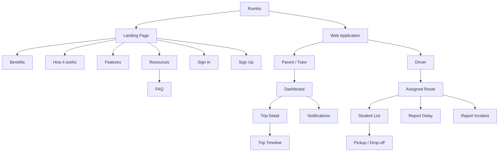
```mermaid
flowchart TD
    A["Rumbo"] --> B["Landing Page"]
    A --> C["Web Application"]

    B --> B1["Benefits"]
    B --> B2["How it works"]
    B --> B3["Features"]
    B --> B4["Resources"]
    B4 --> B41["FAQ"]
    B --> B5["Sign In"]
    B --> B6["Sign Up"]

    C --> P["Parent / Tutor"]
    C --> D["Driver"]

    P --> P1["Dashboard"]
    P1 --> P2["Trip Detail"]
    P2 --> P3["Trip Timeline"]
    P1 --> P4["Notifications"]

    D --> D1["Assigned Route"]
    D1 --> D2["Student List"]
    D2 --> D3["Pickup / Drop-off"]
    D1 --> D4["Report Delay"]
    D1 --> D5["Report Incident"]
```
Se compararán respuestas por segmento, separando **características objetivas** (edad, distrito, experiencia, dispositivo, navegador, canales y organización) y **características subjetivas** (motivaciones, frustraciones, necesidades, actitud hacia tecnología, privacidad y barreras). Los porcentajes se completarán solo con datos reales.

### 4.3.1. Landing Page Wireframe

<div align="center">
  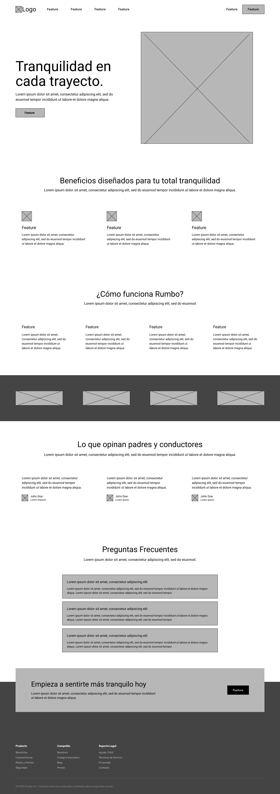
</div>

<br>

<div align="center">
  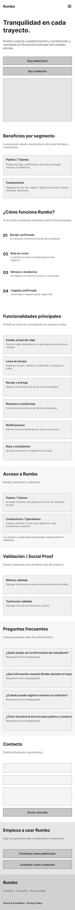
</div>

### 4.3.2. Landing Page Mock-up

<div align="center">
  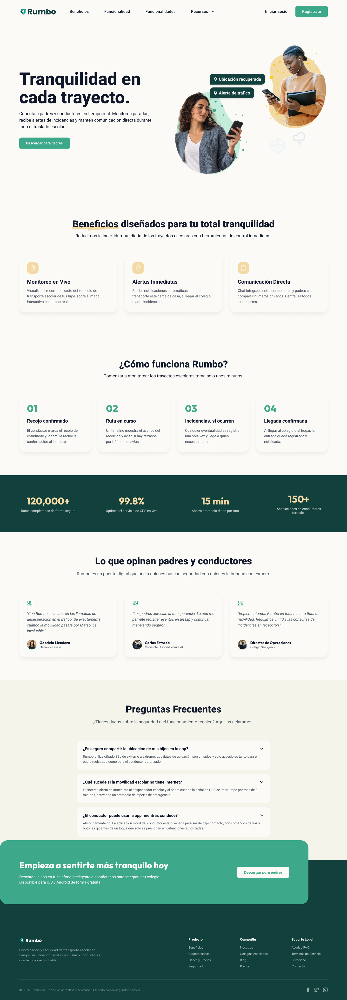
</div>

<br>

<div align="center">
  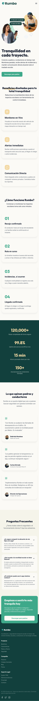
</div>

## 4.4. Web Applications UX/UI Design

El diseño de la Web Application considera dos experiencias principales: **padres/tutores** y **conductores**. En ambos casos se prioriza la información del trayecto, pero las acciones disponibles cambian según el rol. Los padres consultan; los conductores registran eventos de la ruta con la menor cantidad posible de pasos.

### 4.4.1. Web Applications Wireframes

Los wireframes se definieron a partir de las tareas centrales de cada segmento.

| Rol | Vista | Contenido principal |
|---|---|---|
| Padre/Tutor | Sign In | Correo, contraseña y recuperación de acceso. |
| Padre/Tutor | Dashboard | Estado actual, estudiante, conductor, vehículo y ETA. |
| Padre/Tutor | Trip Detail | Mapa o progreso de ruta y datos del trayecto. |
| Padre/Tutor | Trip Timeline | Recojo, retrasos, incidencias y llegada en orden cronológico. |
| Padre/Tutor | Notifications | Avisos relevantes asociados al estudiante. |
| Conductor | Sign In | Acceso seguro al panel de ruta. |
| Conductor | Assigned Route | Ruta activa, horario, paradas y estudiantes asignados. |
| Conductor | Student List | Estado de recojo o entrega de cada estudiante. |
| Conductor | Register Event | Confirmación rápida de recojo, llegada o entrega. |
| Conductor | Report Incident | Tipo de incidencia, descripción breve y registro del evento. |

La prioridad del wireframe es que la vista principal responda rápidamente a dos preguntas: **“¿qué está pasando en el trayecto?”** para la familia y **“¿qué debo registrar ahora?”** para el conductor.

### 4.4.2. Web Applications Wireflow Diagrams

#### Wireflow — Padre/Tutor

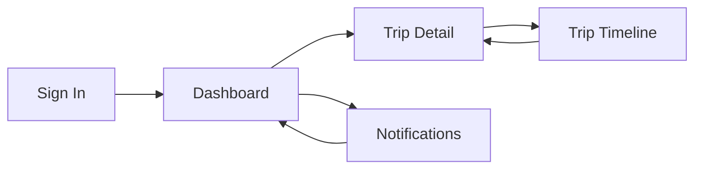
```mermaid
flowchart LR
    A[Sign In] --> B[Dashboard]
    B --> C[Trip Detail]
    C --> D[Trip Timeline]
    B --> E[Notifications]
    D --> C
    E --> B
```

El padre ingresa al Dashboard y desde allí puede revisar el estado actual, abrir el detalle del viaje, consultar el historial de eventos o revisar las notificaciones asociadas.

#### Wireflow — Conductor

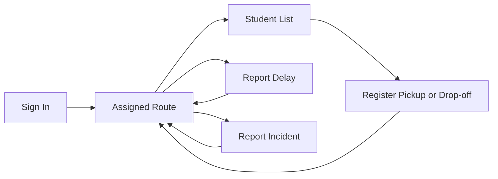
```mermaid
flowchart LR
    A[Sign In] --> B[Assigned Route]
    B --> C[Student List]
    C --> D[Register Pickup or Drop-off]
    B --> E[Report Delay]
    B --> F[Report Incident]
    D --> B
    E --> B
    F --> B
```

El conductor mantiene como punto central la ruta asignada. Las acciones de recojo, entrega, retraso e incidencia regresan al mismo panel para evitar navegación innecesaria durante la jornada.

### 4.4.3. Web Applications Mock-ups

<div align="center">
  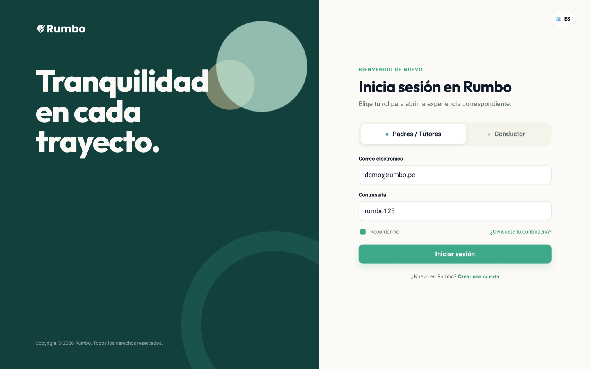
</div>

<br>

<div align="center">
  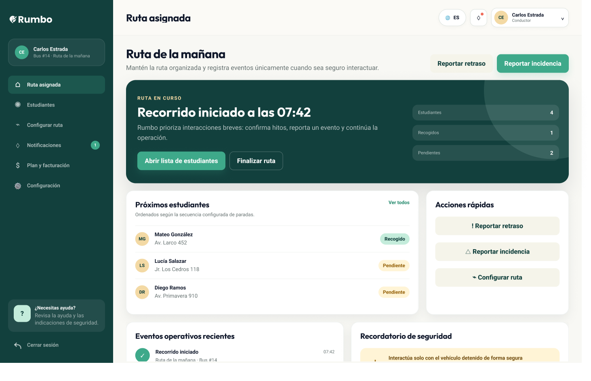
</div>

<br>

<div align="center">
  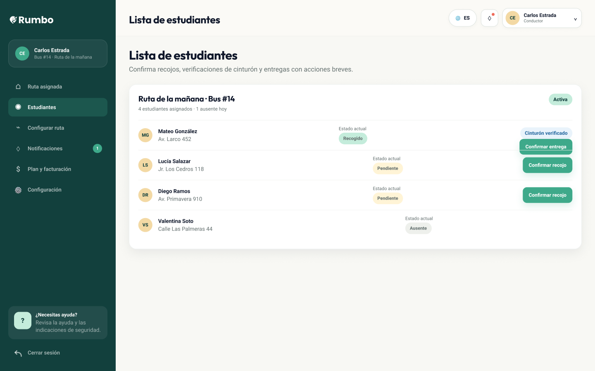
</div>

<br>

<div align="center">
  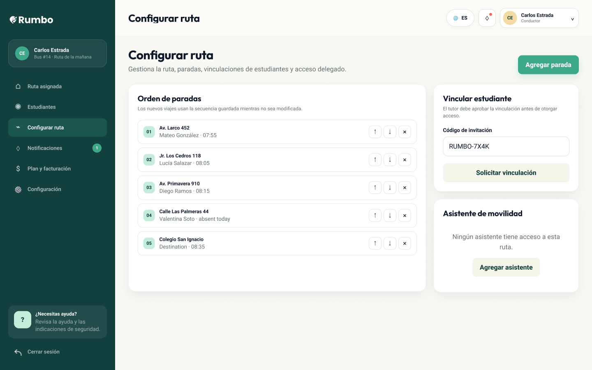
</div>

<br>

<div align="center">
  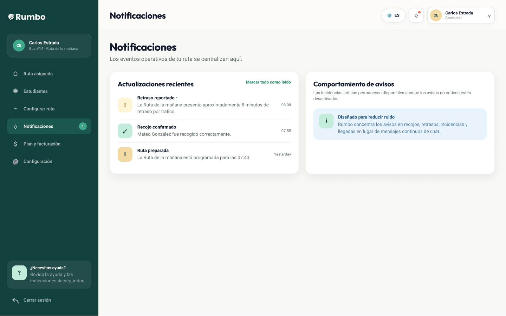
</div>

<br>

<div align="center">
  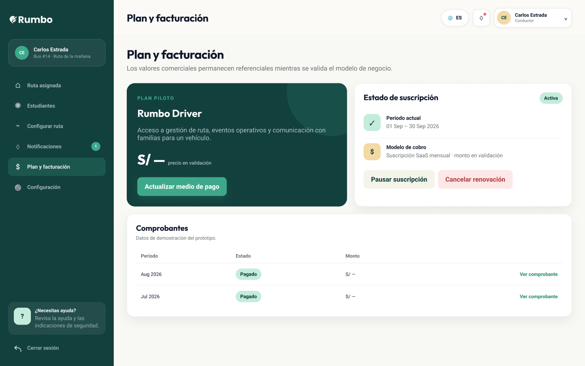
</div>

<br>

<div align="center">
  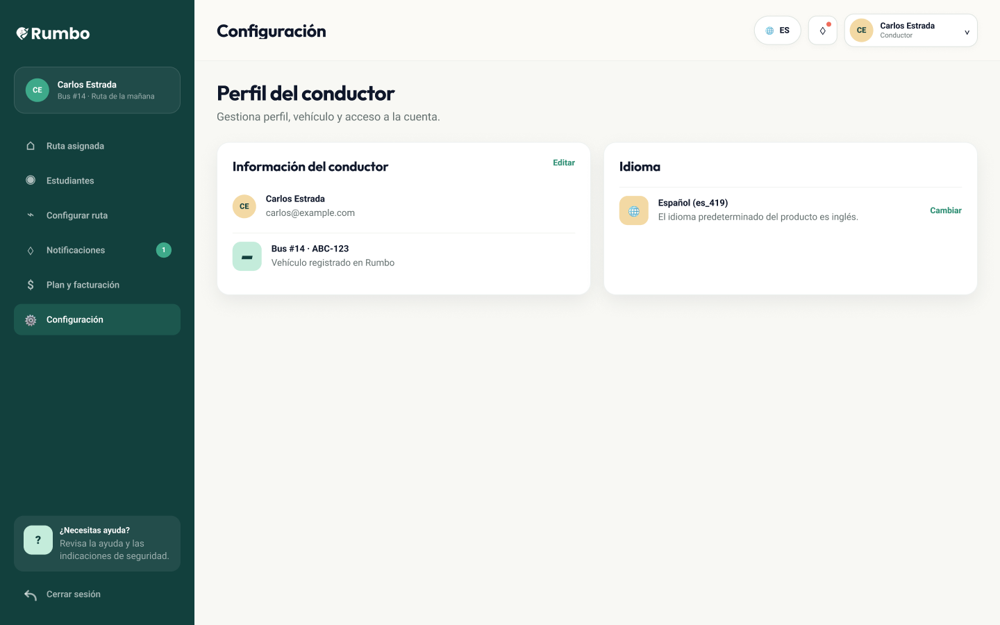
</div>

<br>

<div align="center">
  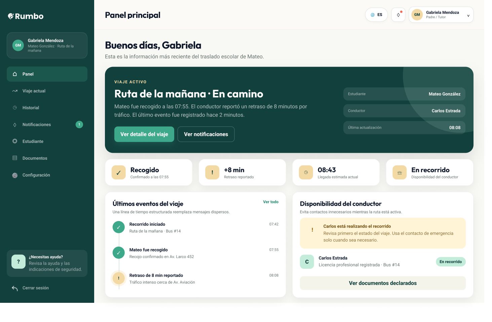
</div>

<br>

<div align="center">
  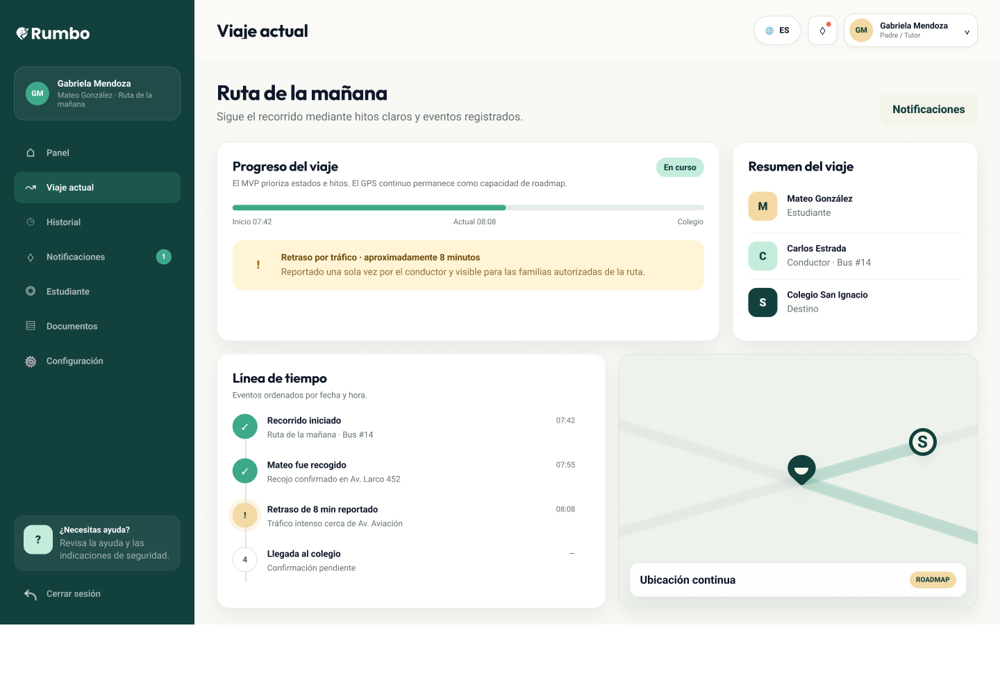
</div>

<br>

<div align="center">
  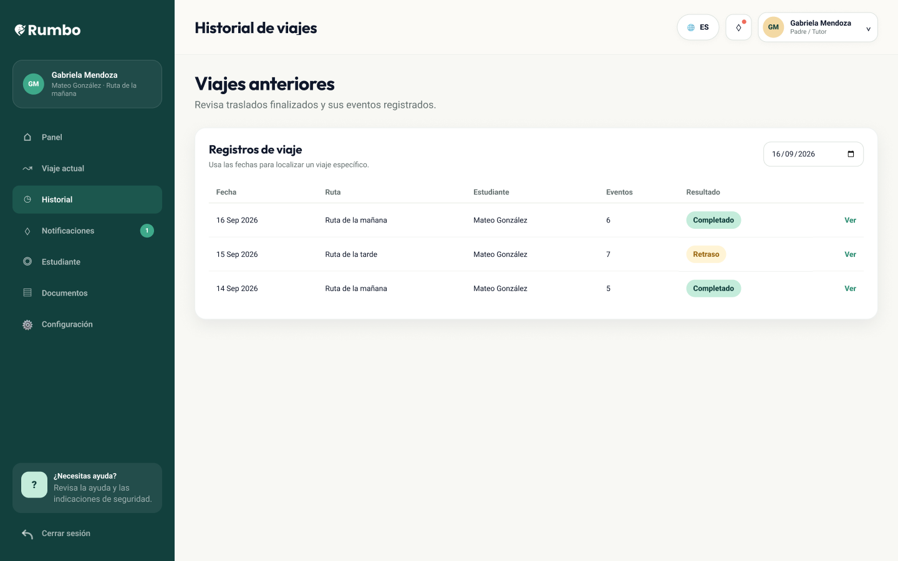
</div>

<br>

<div align="center">
  
</div>

<br>

<div align="center">
  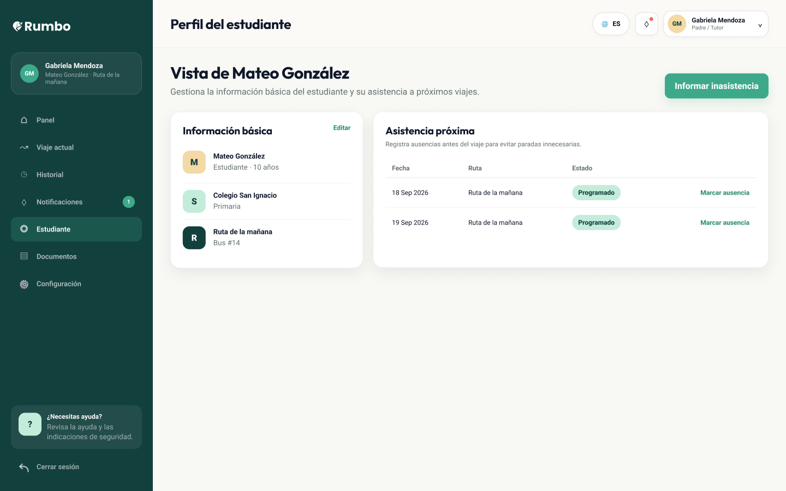
</div>

<br>

<div align="center">
  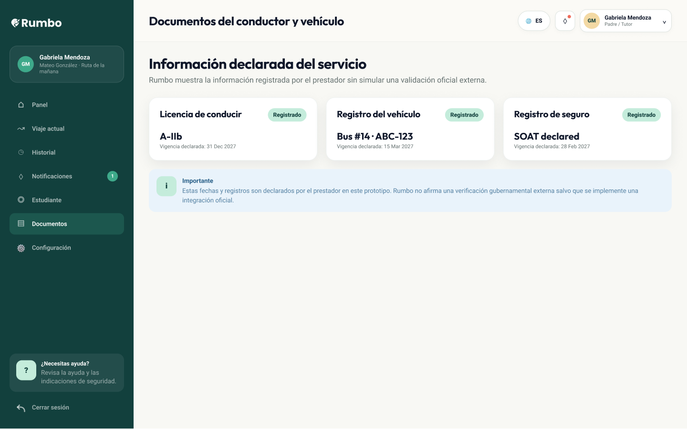
</div>

<br>

<div align="center">
  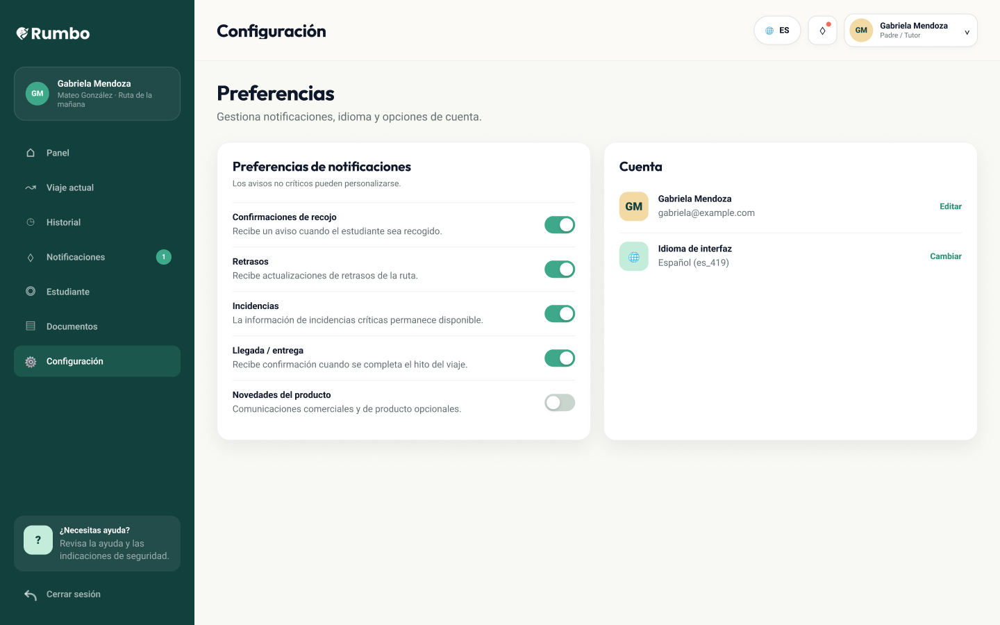
</div>

### 4.4.4. Web Applications User Flow Diagrams

#### User Flow — Padre/Tutor

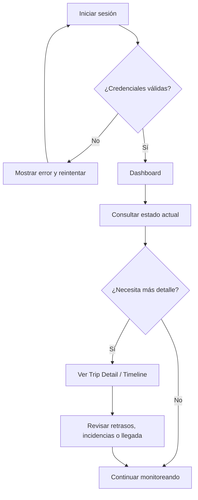
```mermaid
flowchart TD
    A[Iniciar sesión] --> B{¿Credenciales válidas?}
    B -- No --> C[Mostrar error y reintentar]
    C --> A
    B -- Sí --> D[Dashboard]
    D --> E[Consultar estado actual]
    E --> F{¿Necesita más detalle?}
    F -- Sí --> G[Ver Trip Detail / Timeline]
    F -- No --> H[Continuar monitoreando]
    G --> I[Revisar retrasos, incidencias o llegada]
    I --> H
```

#### User Flow — Conductor

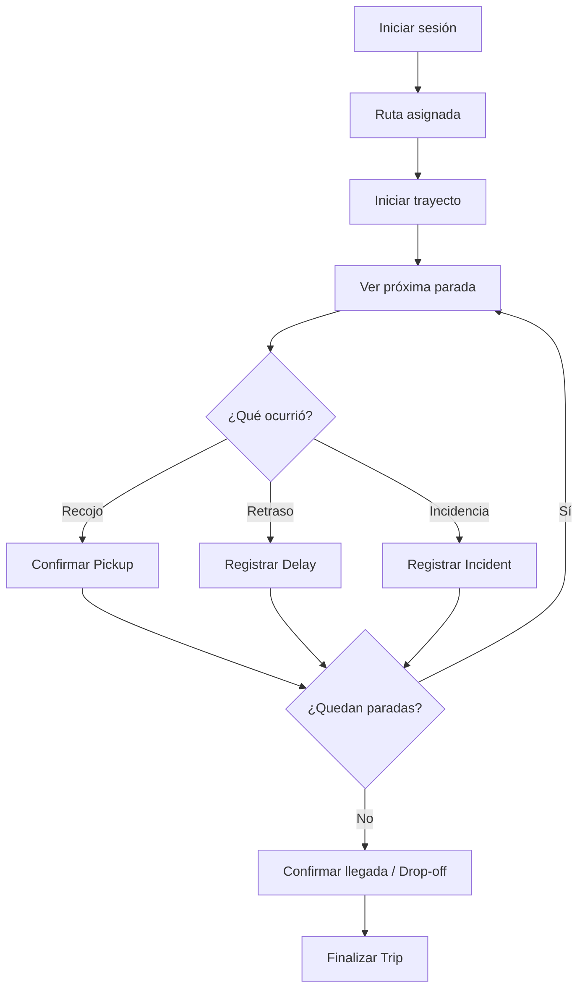
```mermaid
flowchart TD
    A[Iniciar sesión] --> B[Ruta asignada]
    B --> C[Iniciar trayecto]
    C --> D[Ver próxima parada]
    D --> E{¿Qué ocurrió?}
    E -- Recojo --> F[Confirmar Pickup]
    E -- Retraso --> G[Registrar Delay]
    E -- Incidencia --> H[Registrar Incident]
    F --> I{¿Quedan paradas?}
    G --> I
    H --> I
    I -- Sí --> D
    I -- No --> J[Confirmar llegada / Drop-off]
    J --> K[Finalizar Trip]
```

Los flujos reducen bifurcaciones y evitan acciones largas en el perfil del conductor. Las operaciones críticas se realizan desde la ruta activa y generan un evento que luego puede ser consultado por los padres.

## 4.5. Web Applications Prototyping

<div align="center">
  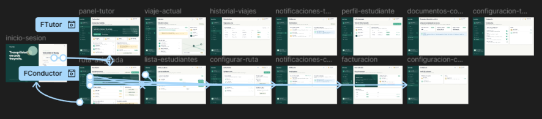
</div>

## 4.6. Domain-Driven Software Architecture

### 4.6.1. Design-Level Event Storming

El **Design-Level Event Storming** permite detallar el comportamiento interno de cada parte del dominio de Rumbo a partir de **Actors, Commands, Aggregates, Domain Events, Business Policies, Read Models y Hotspots**. Para esta etapa se mantuvo la división en seis Bounded Contexts, de modo que cada uno concentre reglas y responsabilidades relacionadas y pueda evolucionar sin mezclar lógica de otros contextos.

Los seis Bounded Contexts identificados son:

| Bounded Context | Responsabilidad |
|---|---|
| **Profiles and Verification** | Gestiona los perfiles de padres, conductores y estudiantes, así como vehículos, documentación registrada y vínculos autorizados. |
| **Identity and Access Management (IAM)** | Gestiona cuentas, autenticación, recuperación de acceso, roles y permisos. |
| **Route and Trip Planning** | Gestiona rutas, paradas, asignaciones de estudiantes, turnos, programación y ausencias. |
| **Real-Time Tracking and Execution** | Gestiona la ejecución del viaje, recojos, entregas, estados y línea de tiempo del trayecto. |
| **Alerting and Incident Management** | Gestiona retrasos, incidencias, alertas, notificaciones y preferencias de aviso. |
| **Subscriptions and Billing** | Gestiona planes, suscripciones, pagos, renovaciones y comprobantes. |

Para mantener una lectura uniforme de los diagramas se utilizan las siguientes convenciones: **amarillo** para Actors, **azul** para Commands, **azul claro** para Aggregates, **naranja** para Domain Events, **morado** para Business Policies, **verde** para Read Models y **fucsia** para Hotspots.

#### Profiles and Verification Bounded Context

Este fue el primer Bounded Context modelado por el equipo. Representa el registro y consulta de información de padres, conductores, estudiantes y vehículos, así como la relación autorizada entre estudiante y conductor.


> En Rumbo, la verificación se limita a controles internos sobre la información y la vigencia declarada de documentos registrados. No se asume validación oficial con ATU, Policía u otra entidad pública mientras dicha integración no exista.

#### Identity and Access Management (IAM) Bounded Context

Este contexto controla el acceso a Rumbo. Incluye registro de cuenta, autenticación, recuperación de contraseña y aplicación de permisos según el rol del usuario.

<div align="center">
  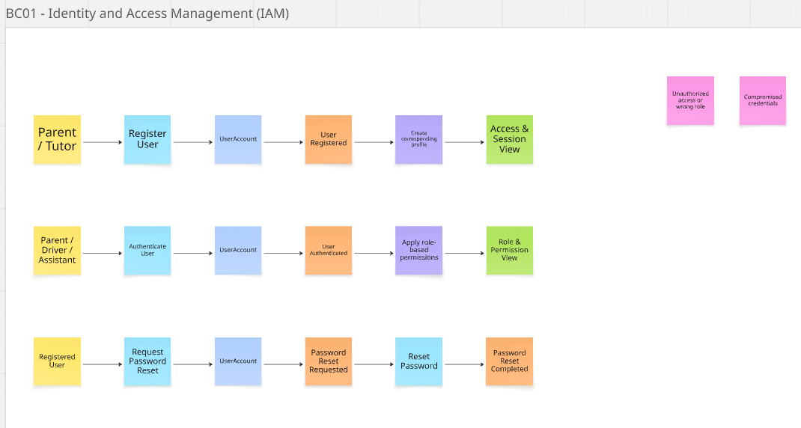
</div>

#### Route and Trip Planning Bounded Context

Este contexto organiza la planificación operativa del servicio. Incluye la creación de rutas, la gestión de paradas, la asignación de estudiantes y la programación diaria de recorridos.

<div align="center">
  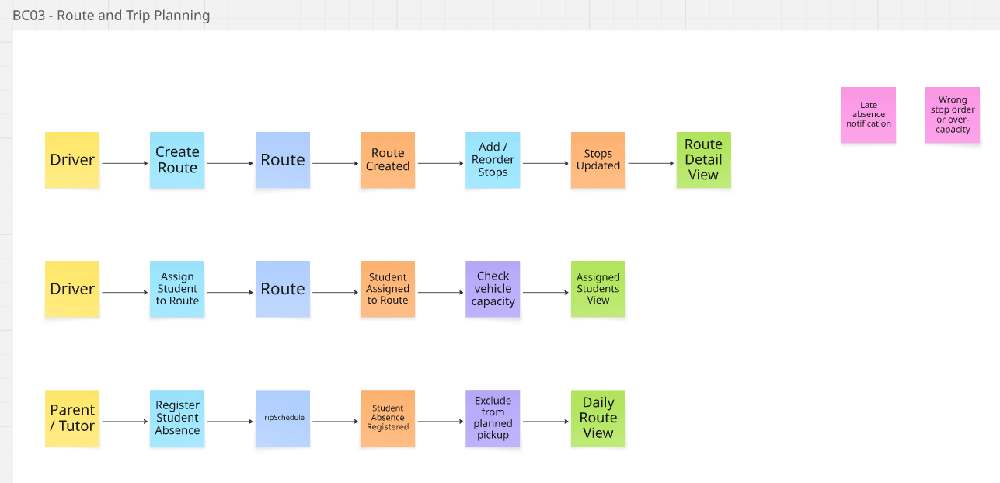
</div>

#### Real-Time Tracking and Execution Bounded Context

Este contexto supervisa la ejecución del trayecto en tiempo real. Incluye el inicio del viaje, registro de ubicación, confirmación de recojo y descenso, verificación de cinturón y cierre del trayecto.

<div align="center">
  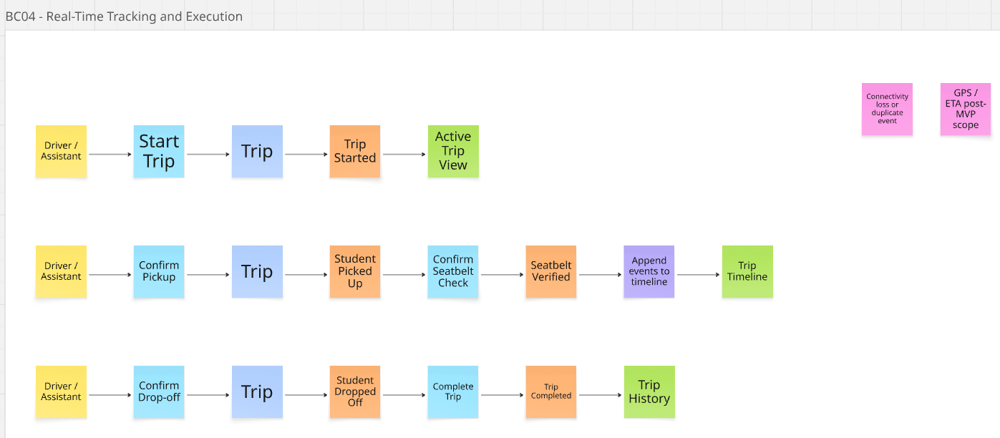
</div>

#### Alerting and Incident Management Bounded Context

Este contexto gestiona retrasos, incidencias y comunicaciones relevantes hacia las familias. Incluye notificaciones, alertas automáticas y el registro de incidentes ocurridos durante el servicio.

<div align="center">
  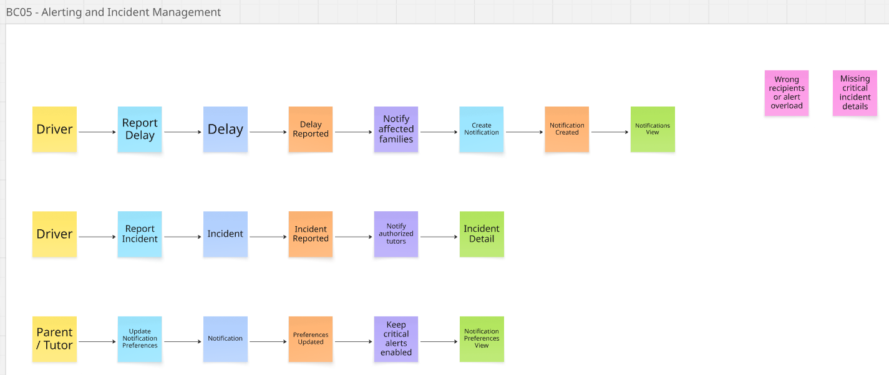
</div>

#### Subscriptions and Billing Bounded Context

Este contexto administra la suscripción del conductor a la plataforma. Incluye selección de plan, pagos, comprobantes, renovación, pausa, cancelación y reactivación del servicio.

<div align="center">
  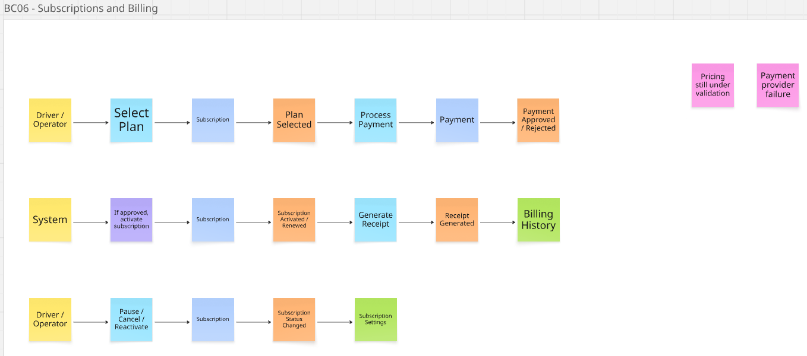
</div>

En conjunto, los seis Bounded Contexts establecen la base para los Class Diagrams y Database Diagrams de las secciones 4.7 y 4.8. La división evita concentrar toda la lógica en un único modelo y mantiene trazabilidad entre las User Stories, el comportamiento del dominio y el diseño técnico.

**Tablero editable de Design-Level Event Storming:** [Rumbo - Design-Level Event Storming](https://miro.com/app/board/uXjVHl8Ic-k=/)


### 4.6.2. Software Architecture Context Diagram

Este diagrama muestra la visión general del sistema Rumbo, posicionando la plataforma en el centro y detallando sus interacciones con los usuarios (padres y conductores) y dependencias externas (Auth0, Google Maps, FCM y SendGrid).


### 4.6.3. Software Architecture Container Diagrams

Este diagrama expone la arquitectura física y de despliegue. Divide el sistema en contenedores ejecutables: la Landing Page, la aplicación cliente (SPA en Angular), la lógica de negocio (API en Spring Boot)


### 4.6.4. Software Architecture Components Diagrams

Este diagrama profundiza en el contenedor lógico del backend (API Application). Muestra la estructura interna basada en el patrón MVC utilizado en Spring Boot, detallando los controladores (REST y WebSockets), los servicios que encapsulan las reglas de negocio, la capa de acceso a datos mediante repositorios y la barrera de seguridad (Security Filter).


Este diagrama hace foco en la arquitectura interna de la Single Page Application (SPA) desarrollada en Angular. Detalla la separación de responsabilidades entre el enrutador protegido (AuthGuard), los componentes visuales de las vistas (mapas y paneles de gestión) y los servicios encargados de la conexión persistente (WebSockets) y el consumo de la API.


## 4.7. Software Object-Oriented Design

### 4.7.1. Class Diagrams

Los Class Diagrams se presentan por **Bounded Context** para mantener la separación definida en el Design-Level Event Storming. Los diagramas incluyen clases, interfaces, enumeraciones, atributos, métodos, visibilidad, relaciones y multiplicidades, de acuerdo con el nivel de detalle solicitado para el diseño orientado a objetos.

#### Profiles and Verification


#### Identity and Access Management (IAM)


#### Route and Trip Planning


#### Real-Time Tracking and Execution


#### Alerting and Incident Management


#### Subscriptions and Billing


## 4.8. Database Design

El diseño de persistencia se divide por los mismos **Bounded Contexts** definidos en el modelado DDD. Cada diagrama representa las tablas, columnas, claves primarias, claves foráneas y relaciones que permiten persistir la información administrada por su contexto. Los ERD fueron elaborados en **Lucidchart** y se incorporan al informe como imágenes legibles junto con su fuente editable.

### 4.8.1. Database Diagrams

#### Profiles and Verification

Incluye perfiles de padres, conductores y estudiantes, vehículos, documentos registrados y vínculos entre estudiantes y conductores.

<div align="center">
  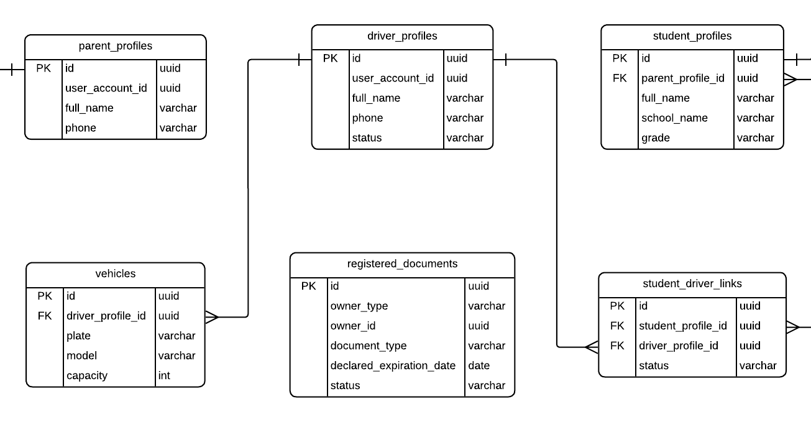
</div>

**Fuente editable:** https://lucid.app/lucidchart/c71a5220-bf71-4924-bbd8-cdec37c2f06c/edit

#### Identity and Access Management (IAM)

Incluye cuentas, credenciales, roles, permisos, relaciones de autorización y tokens de recuperación de acceso.

<div align="center">
  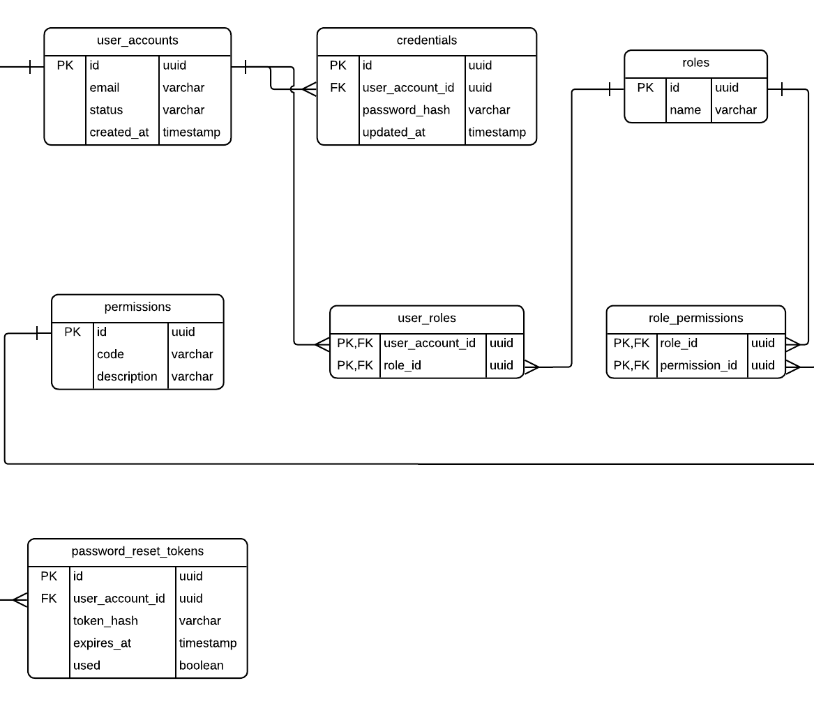
</div>

**Fuente editable:** https://lucid.app/lucidchart/f8fd5cb8-8ed5-4ac9-ae4f-0127d8369a18/edit

#### Route and Trip Planning

Incluye rutas, paradas, asignaciones de estudiantes, programación de viajes y ausencias.

<div align="center">
  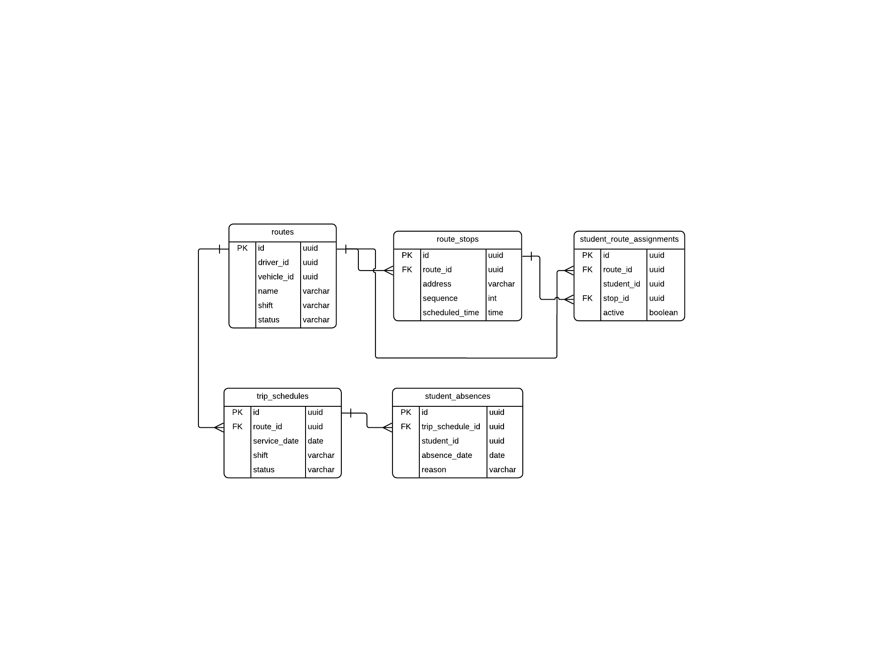
</div>

**Fuente editable:** https://lucid.app/lucidchart/dc535238-b74a-409c-9270-8bfcf4ea11a7/edit

#### Real-Time Tracking and Execution

Incluye viajes, estudiantes del viaje, eventos, recojos, entregas, verificaciones y registros de ubicación previstos para la evolución del producto.

<div align="center">
  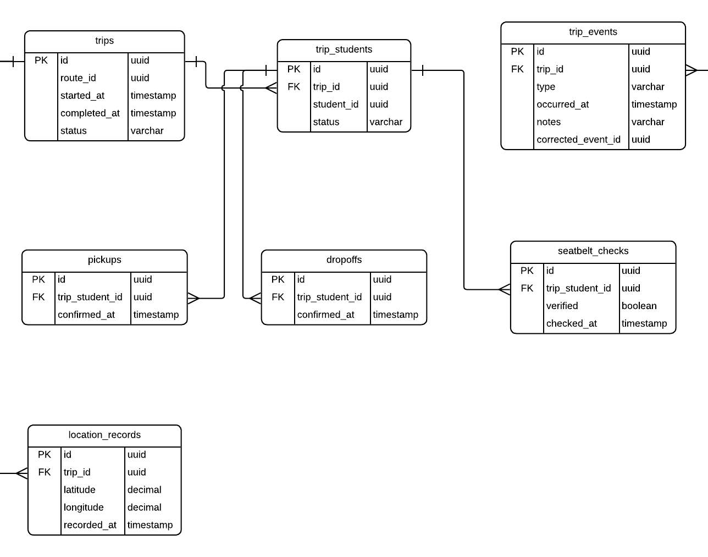
</div>

**Fuente editable:** https://lucid.app/lucidchart/3fcc7afd-47ae-4293-9ef2-66b0a7c74621/edit

#### Alerting and Incident Management

Incluye retrasos, incidencias, notificaciones, destinatarios y preferencias de notificación.

<div align="center">
  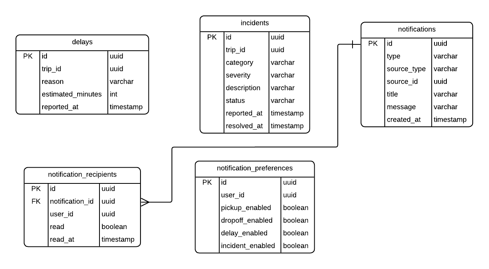
</div>

**Fuente editable:** https://lucid.app/lucidchart/b464254e-0388-492e-862d-b93d5ee3e25f/edit

#### Subscriptions and Billing

Incluye planes, suscripciones, pagos y comprobantes asociados al ciclo comercial.

<div align="center">
  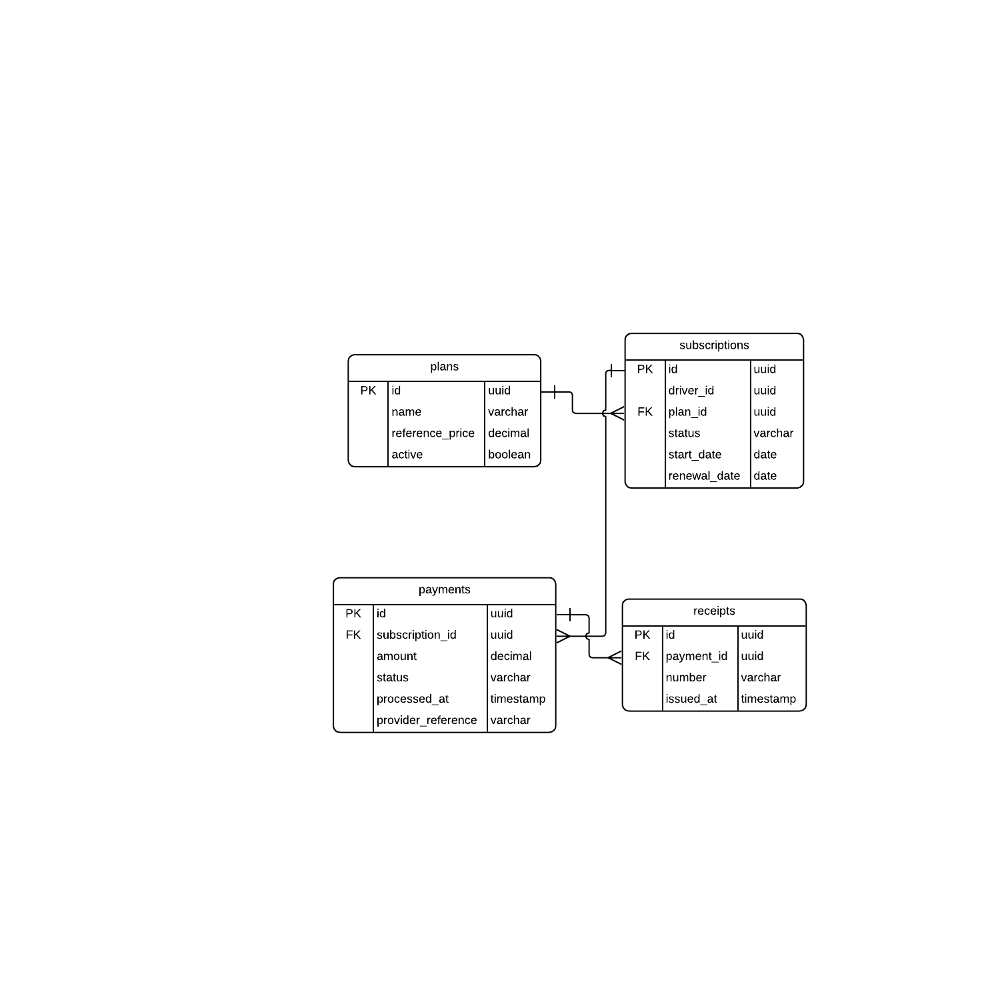
</div>

**Fuente editable:** https://lucid.app/lucidchart/178dfc99-92f9-4eef-8699-ecd2085c650a/edit

---

# Capítulo V: Product Implementation, Validation & Deployment

## 5.1. Software Configuration Management

### 5.1.1. Software Development Environment Configuration

Para el desarrollo de Rumbo se definieron las siguientes herramientas:

| Herramienta | Uso en el proyecto |
|---|---|
| GitHub | Repositorios, control de versiones y colaboración. |
| Git | Control de versiones local. |
| Visual Studio Code / WebStorm | Desarrollo de la Landing Page y Frontend Web Application. |
| IntelliJ IDEA | Desarrollo de Web Services con Java. |
| Figma | Wireframes, Mock-ups y prototipos. |
| HTML5, CSS3 y JavaScript | Implementación de la Landing Page. |
| Angular, TypeScript y Angular Material | Frontend Web Application. |
| Java, Spring Boot y Spring Data JPA | RESTful Web Services. |
| OpenAPI / Swagger | Documentación de Web Services. |
| GitHub Pages | Despliegue de la Landing Page. |
| Markdown | Documentación del Project Report. |

Para AV1 la implementación se concentra en la primera versión de la Landing Page. El Frontend Web Application y los Web Services se desarrollarán en los siguientes Sprints.

### 5.1.2. Source Code Management

- Project Report: https://github.com/AIpaca-OS/project-report
- Landing Page: https://github.com/AIpaca-OS/landing-page
- Frontend Web Application: https://github.com/AIpaca-OS/frontend-web-application
- Web Services: https://github.com/AIpaca-OS/web-services

GitHub es la plataforma utilizada para administrar el código y la documentación de Rumbo.

#### Repositorios

- **Project Report:** https://github.com/AIpaca-OS/project-report
- **Landing Page:** https://github.com/AIpaca-OS/landing-page
- **Frontend Web Application:** https://github.com/AIpaca-OS/frontend-web-application
- **Web Services:** https://github.com/AIpaca-OS/web-services

#### GitFlow

El proyecto utiliza el siguiente flujo de ramas:

- `main`: versión estable.
- `develop`: integración del trabajo del equipo.
- `feature/*`: trabajo de una funcionalidad o sección específica.
- `release/*`: preparación de una versión.
- `hotfix/*`: correcciones urgentes.

En el Project Report se emplean ramas como:

- `feature/chapter-1-introduction`
- `feature/chapter-2-requirements-elicitation-and-analysis`
- `feature/chapter-3-requirements-specification`
- `feature/chapter-4-product-design`
- `feature/chapter-5-product-implementation-validation-and-deployment`

La Landing Page dispone de `main`, `develop` y `feature/landing-page-v1`. La primera carga funcional quedó registrada en `main`; los siguientes cambios se integrarán mediante el flujo `feature → develop → main`.

#### Convenciones

Para los commits se utilizará Conventional Commits:

- `feat`: nueva funcionalidad.
- `fix`: corrección.
- `docs`: documentación.
- `style`: cambios de formato.
- `refactor`: reorganización de código.
- `test`: pruebas.
- `chore`: mantenimiento.

Las versiones seguirán Semantic Versioning con el formato `MAJOR.MINOR.PATCH`.

### 5.1.3. Source Code Style Guide & Conventions

#### HTML

La Landing Page utiliza HTML5 semántico, navegación mediante identificadores, atributos `alt` en imágenes y atributos ARIA cuando corresponde. Los nombres de clases se mantienen en `kebab-case`.

Ejemplo:

```html
<section class="section" id="beneficios">
```

#### CSS

Los estilos se organizan por secciones y utilizan variables CSS para colores, tipografías, radios y sombras. El diseño responsive se implementa con Grid, Flexbox y media queries.

```css
:root {
  --azul: #12403D;
  --verde: #3EA98A;
  --arena: #F3D9A4;
}
```

También se considera `prefers-reduced-motion` para mejorar la accesibilidad.

#### JavaScript

JavaScript se utiliza para el menú móvil y la validación básica del formulario de contacto. El código utiliza `strict mode`, nombres descriptivos y `camelCase` para variables y funciones.

#### Frontend Web Application

Para Angular y TypeScript se seguirán las convenciones oficiales del framework, utilizando `PascalCase` para clases y componentes y `camelCase` para variables y funciones.

#### Web Services

Para Java y Spring Boot se utilizará `PascalCase` para clases, `camelCase` para atributos y métodos y una organización por responsabilidades y bounded contexts. Los endpoints serán documentados con OpenAPI/Swagger.

### 5.1.4. Software Deployment Configuration

Para la primera versión de la Landing Page se utilizó **GitHub Pages** como plataforma de publicación.

| Configuración | Valor |
|---|---|
| **Repository** | `AIpaca-OS/landing-page` |
| **Source** | Deploy from a branch |
| **Branch** | `main` |
| **Folder** | `/(root)` |
| **Entry point** | `index.html` |

**Repositorio:** https://github.com/AIpaca-OS/landing-page  
**URL pública:** https://aipaca-os.github.io/landing-page/

La configuración quedó activa y GitHub Pages reporta el sitio como publicado.

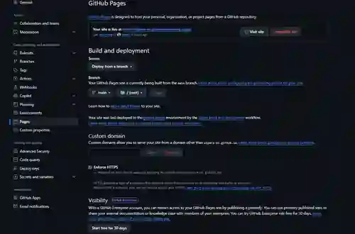

La configuración de despliegue del Frontend Web Application y de los Web Services se realizará en los siguientes Sprints.

## 5.2. Landing Page, Services & Applications Implementation

### 5.2.1. Sprint 1

Sprint 1 se concentra únicamente en la **Landing Page**. Las User Stories de back-end etiquetadas como **Developer (TS01–TS08)** no pertenecen a este Sprint; se reservan para Sprint 2.

La implementación actual de la Landing Page se traza contra las User Stories de Aplicaciones Web, cuyos criterios de aceptación fueron adoptados en el Capítulo III. De esta forma, cada bloque implementado queda asociado a una historia y se evita mantener funcionalidades sin trazabilidad.

### 5.2.1.1. Sprint Planning 1

| Campo | Detalle |
|---|---|
| **Sprint** | Sprint 1 |
| **Periodo** | 09/09/2026 - 22/09/2026 |
| **Duración** | 2 semanas |
| **Prepared By** | Lino Quispe, Leonardo Miguel |
| **Attendees** | Alejandro Díaz, Kevin Geronimo, Leonardo Lino, Alexandra Meza y Diana Pareja |
| **Sprint Goal** | Implementar y desplegar la primera versión responsive de la Landing Page de Rumbo, permitiendo que el visitante comprenda la propuesta de valor, identifique los beneficios de su segmento, consulte información pública y resuelva dudas antes de utilizar el producto. |
| **Sprint 1 Velocity / Capacity** | 8 Story Points |
| **Sum of Story Points** | 8 |

La equivalencia usada para la estimación es la indicada por el docente: **1 SP ≈ 1–2 días de trabajo** y **8 SP ≈ un Sprint completo de dos semanas**. Los Story Points no se calculan sumando horas de forma directa; las horas se utilizan únicamente para dimensionar las tareas internas y comprobar que ninguna tarea exceda las 8 horas.

**Sprint Review:** se obtuvo una primera versión funcional de la Landing Page con Hero, beneficios, explicación del servicio, indicadores, testimonios, FAQ, CTA, navegación responsive y despliegue público.

**Sprint Retrospective:** se identificó como mejora completar las historias todavía parciales —idiomas, documentos legales, contacto y CTA por segmento— y mantener las integraciones mediante `feature → develop → main`.

#### 5.2.1.2. Aspect Leaders and Collaborators

| Aspecto | Líder | Colaboradores |
|---|---|---|
| Project Report y Capítulo V | Leonardo Lino | Equipo |
| Investigación y entrevistas | Alexandra Meza | Equipo |
| Landing Page UX/UI | Alejandro Díaz | Kevin Geronimo |
| Landing Page Development | Kevin Geronimo | Alejandro Díaz |
| Requirements & Product Design | Diana Pareja | Equipo |
| Deployment & Evidence | Leonardo Lino | Kevin Geronimo |

### 5.2.1.3. Sprint Backlog 1

Las cinco User Stories del Sprint se descomponen en **múltiples tareas**. Cada tarea tiene una estimación máxima de **8 horas** y ninguna User Story queda representada por una única tarea.

#### User Stories seleccionadas

| Story ID | User Story | Story Points | Estado actual |
|---|---|:---:|---|
| US31 | Conocer la propuesta de valor de Rumbo | 2 | Done |
| US32 | Identificar los beneficios de mi segmento e ingresar a Rumbo | 2 | In-Process |
| US33 | Consultar el contenido en inglés o español | 1 | To-do |
| US34 | Consultar los documentos legales del servicio | 1 | To-do |
| US35 | Resolver dudas antes de usar Rumbo | 2 | In-Process |
|  | **Total** | **8** |  |

#### Tareas por User Story

| Story ID | Task ID | Task Title | Task Description | Estimation (Hours) | Assigned To | Status |
|---|---|---|---|---:|---|---|
| US31 | T01 | Hero & value proposition | Implementar Hero, propuesta de valor y explicación principal del producto. | 5 | Kevin Geronimo / Alejandro Díaz | Done |
| US31 | T02 | Service explanation | Implementar la sección de funcionamiento, indicadores y contenido que refuerza la propuesta de valor. | 5 | Alejandro Díaz | Done |
| US31 | T03 | Responsive navigation | Ajustar navegación, menú móvil, accesibilidad básica y comportamiento responsive. | 4 | Kevin Geronimo / Alejandro Díaz | Done |
| US32 | T04 | Benefits by segment | Adaptar beneficios para diferenciar necesidades de padres/tutores y conductores. | 6 | Alejandro Díaz | In-Process |
| US32 | T05 | Segment CTAs | Implementar CTA de acceso/registro correspondiente para cada segmento. | 4 | Alejandro Díaz / Kevin Geronimo | To-do |
| US33 | T06 | Translation content | Preparar el contenido público para `en_US` y `es_419`, manteniendo inglés como idioma predeterminado. | 4 | Kevin Geronimo / Alejandro Díaz | To-do |
| US33 | T07 | Language selector | Implementar selector de idioma y persistencia de la preferencia durante la sesión. | 4 | Kevin Geronimo / Alejandro Díaz | To-do |
| US34 | T08 | Terms of Service | Crear el contenido accesible de Terms of Service y enlazarlo desde el footer. | 4 | Equipo | To-do |
| US34 | T09 | Privacy Policy | Crear Privacy Policy y enlazarla desde el footer. | 4 | Equipo | To-do |
| US35 | T10 | FAQ interaction | Implementar preguntas frecuentes y comportamiento de acordeón con JavaScript. | 5 | Alejandro Díaz | Done |
| US35 | T11 | Public contact form | Implementar formulario público con validación y confirmación de envío. | 6 | Kevin Geronimo / Alejandro Díaz | To-do |

#### Actividades de soporte del Sprint

Estas actividades no generan Story Points porque no representan una funcionalidad independiente para el usuario; soportan la entrega de las User Stories anteriores.

| Task ID | Support Activity | Estimation (Hours) | Assigned To | Status |
|---|---|---:|---|---|
| S01 | Publicar Landing Page mediante GitHub Pages y verificar URL pública. | 3 | Leonardo Lino / Kevin Geronimo | Done |
| S02 | Registrar evidencias de ejecución Desktop/Mobile, commits y deployment. | 4 | Leonardo Lino | In-Process |

#### Trazabilidad de la implementación actual

| Implementación observada en Landing Page | User Story asociada |
|---|---|
| Hero, explicación de funcionamiento, indicadores y testimonios | US31 |
| Beneficios y CTA de adopción | US32 |
| Selector y contenido bilingüe | US33 |
| Terms of Service y Privacy Policy | US34 |
| FAQ y formulario de contacto | US35 |
| Navegación responsive y menú móvil | US31 — criterio de aceptación de consulta Mobile |

De este modo, la implementación del Sprint queda cubierta por User Stories explícitas. No se añade una User Story artificial para deployment o documentación porque son actividades de soporte, no valor funcional independiente para el usuario.

##### Trabajo documental del Project Report

Las actividades de documentación se mantienen fuera del cálculo de Story Points del Sprint funcional.

| Report Scope | Responsible | Status |
|---|---|---|
| Capítulo I: Introduction | Equipo | Done |
| Capítulo II: Requirements Elicitation & Analysis | Alexandra Meza / Equipo | Done |
| Capítulo III: Requirements Specification | Leonardo Lino / Equipo | Done |
| Capítulo IV: Product Design | Kevin Geronimo / Alejandro Díaz / Equipo | In-Process |
| Capítulo V: Product Implementation, Validation & Deployment | Leonardo Lino | In-Process |

#### 5.2.1.4. Development Evidence for Sprint Review

La implementación funcional de AV1 se concentra en la **Landing Page**. El repositorio muestra una primera carga del producto, un rediseño posterior y una implementación adicional de comportamiento JavaScript. Los repositorios de Frontend Web Application y Web Services existen y cuentan con su foundation inicial, pero todavía no presentan features funcionales de negocio; por ello se documentan sin atribuirles implementación que aún no existe.

<div align="center">
  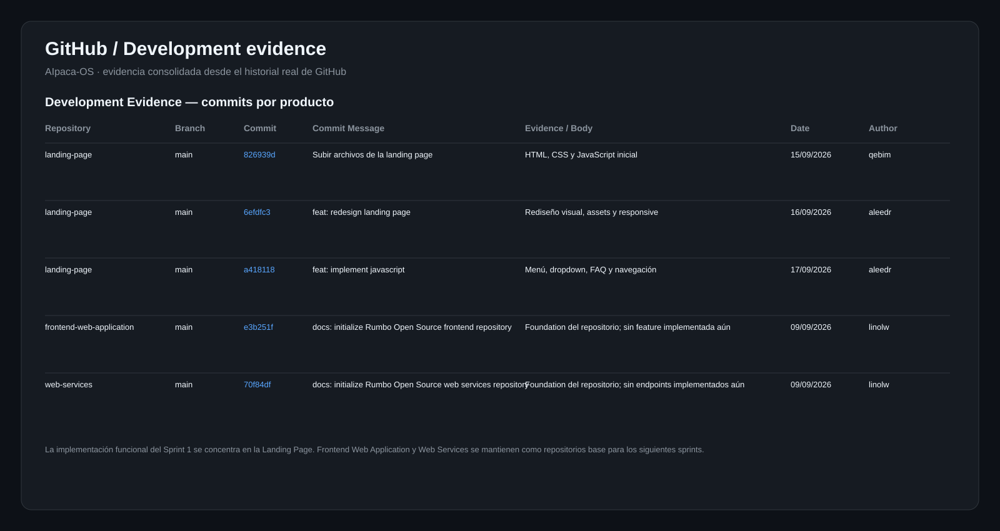
</div>

| Repository | Branch | Commit ID | Commit Message | Commit Message Body | Commited on (Date) |
|---|---|---|---|---|---|
| `AIpaca-OS/landing-page` | `main` | [`826939d`](https://github.com/AIpaca-OS/landing-page/commit/826939d379fd977780cb7b2cb6091e02a50ad95f) | Subir archivos de la landing page | No registra body adicional. El commit incorpora `index.html`, `css/styles.css`, JavaScript y recursos base. | 15/09/2026 |
| `AIpaca-OS/landing-page` | `main` | [`6efdfc3`](https://github.com/AIpaca-OS/landing-page/commit/6efdfc3) | feat: redesign landing page | No registra body adicional. Modifica `index.html` y más de 1000 líneas de CSS, además de incorporar assets visuales. | 16/09/2026 |
| `AIpaca-OS/landing-page` | `main` | [`a418118`](https://github.com/AIpaca-OS/landing-page/commit/a41811897fc24576d16c8f0d5b32089e50db7811) | feat: implement javascript | No registra body adicional. Añade `js/app.js` y actualiza HTML/CSS para menú responsive, dropdown, FAQ y navegación. | 17/09/2026 |
| `AIpaca-OS/frontend-web-application` | `main` | [`e3b251f`](https://github.com/AIpaca-OS/frontend-web-application/commit/e3b251f56778b1fb7cf0edf0f7d0744a8c5b80b3) | docs: initialize Rumbo Open Source frontend repository | Foundation documental del repositorio; aún no constituye una feature funcional de Sprint 1. | 09/09/2026 |
| `AIpaca-OS/web-services` | `main` | [`70f84df`](https://github.com/AIpaca-OS/web-services/commit/70f84df831634feaacbd25a92933f9edf97edf61) | docs: initialize Rumbo Open Source web services repository | Foundation documental del repositorio; aún no existen endpoints funcionales de negocio para AV1. | 09/09/2026 |

Los commits del 16 y 17 de septiembre corresponden a estabilización y mejora posterior a la primera revisión de AV1; se incluyen para que la evidencia represente el **estado actual real** del producto.

#### 5.2.1.5. Execution Evidence for Sprint Review

**Landing Page:** https://github.com/AIpaca-OS/landing-page

La Landing Page fue ejecutada en vista Desktop y se verificaron sus principales secciones: Hero, indicadores, funcionamiento del trayecto, beneficios, funcionalidades, testimonios, FAQ, CTA y footer.

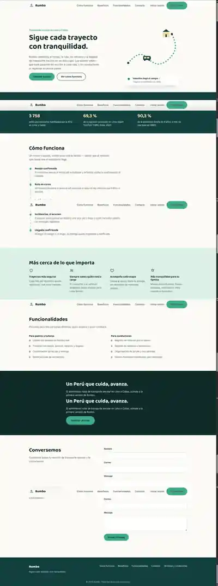

También se verificó el comportamiento responsive. En vista Mobile, la navegación se reorganiza en un menú desplegable y mantiene acceso a las principales secciones de la página.

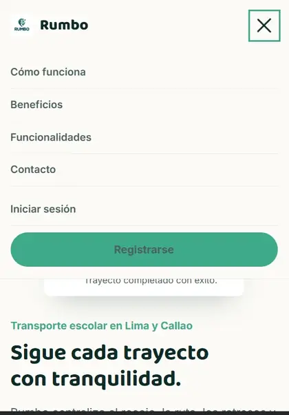

#### 5.2.1.6. Services Documentation Evidence for Sprint Review

Durante Sprint 1 no se implementaron Web Services. Las Technical Stories TS01–TS08, todas redactadas con el rol Developer, corresponden al alcance de Sprint 2. El repositorio `web-services` se encuentra preparado para su desarrollo con Java, Spring Boot y Spring Data JPA. La documentación OpenAPI/Swagger se incorporará cuando existan endpoints implementados.

#### 5.2.1.7. Software Deployment Evidence for Sprint Review

Para el despliegue se utilizó GitHub Pages con la opción **Deploy from a branch**, utilizando `main` y `/(root)` como origen.

La configuración quedó activa y el sitio fue publicado correctamente.


**URL pública:** https://aipaca-os.github.io/landing-page/

La siguiente evidencia muestra la Landing Page cargada desde la URL pública de GitHub Pages.


#### 5.2.1.8. Team Collaboration Insights during Sprint

La colaboración del equipo se verificó mediante el historial de `develop`, los commits de la Landing Page y los Pull Requests del Project Report. La evidencia muestra contribuciones distribuidas entre investigación, requirements, Product Design, DDD, implementación de Landing Page, Chapter V y consolidación del informe.

<div align="center">
  
</div>

Para el Project Report se consultaron los **100 commits más recientes de `develop`**. Dentro de esa muestra se identifican contribuciones de `linolw`, `DianaParejaCaceres`, `AlexandraYMS`, `qebim18` y `aleedr`. La Landing Page añade commits de implementación realizados por `qebim`, `aleedr` y `linolw`.

<div align="center">
  
</div>

<div align="center">
  
</div>

En el Project Report existen **13 Pull Requests registrados**, de los cuales **12 fueron merged** y **uno fue cerrado sin merge (#11)**. Entre los PR integrados se encuentran el trabajo de Requirements Elicitation (#1), Product Design inicial (#2, #3 y #5), Chapter V (#4), Requirements Specification (#9), consolidación de AV1 (#10) y las correcciones finales de DDD/Product Design (#12 y #13).

| Evidencia verificable | URL |
|---|---|
| Commits de `develop` | https://github.com/AIpaca-OS/project-report/commits/develop/ |
| Branches del Project Report | https://github.com/AIpaca-OS/project-report/branches |
| Network | https://github.com/AIpaca-OS/project-report/network |
| Contributors | https://github.com/AIpaca-OS/project-report/graphs/contributors |
| Pull Requests | https://github.com/AIpaca-OS/project-report/pulls?q=is%3Apr+is%3Aclosed |
| Commits de Landing Page | https://github.com/AIpaca-OS/landing-page/commits/main/ |

La actividad también evidencia una oportunidad de mejora: parte de la implementación de Landing Page llegó directamente a `main`, mientras que en el Project Report se utilizó con mayor frecuencia el flujo `feature → develop`. Para los siguientes sprints se recomienda mantener de forma consistente el GitFlow acordado y usar Pull Requests para las integraciones de código.


# Conclusiones

- La problemática de Rumbo se sustenta en un contexto real de transporte escolar formal, alta congestión urbana y elevada conectividad móvil en Lima Metropolitana.

- Los dos segmentos iniciales del proyecto son padres/tutores y conductores de movilidad escolar; las entrevistas de AV1 permitirán validar o corregir los supuestos planteados.

- Para AV1, la implementación se concentra en la primera versión de la Landing Page, que ya se encuentra implementada y desplegada mediante GitHub Pages. Angular y Spring Boot quedan definidos para los productos que se desarrollarán progresivamente en los siguientes Sprints.

# Bibliografía

[1] Autoridad de Transporte Urbano para Lima y Callao. (2026, 10 de enero). *Vacaciones útiles seguras: ATU exhorta a padres de familia a usar movilidades escolares autorizadas*.

[2] TomTom. (2026). *TomTom Traffic Index 2025: Lima, Peru*.

[3] Observatorio Nacional de Seguridad Vial. (2026). *Estadísticas de siniestralidad vial 2025*.

[4] Instituto Nacional de Estadística e Informática. (2026, 26 de marzo). *El 98,4% de los hogares de Lima Metropolitana contó con telefonía móvil durante el cuarto trimestre de 2025*.

[5] Elitech. (2026). *School Bus Tracker* (Versión 2.4) [Software]. https://schoolbustrackerapp.com/

[6] Logrit Dynamics SAS. (2025). *Bus esCool* (Versión 6.5.2) [Aplicación móvil]. App Store. https://apps.apple.com/pe/app/bus-escool/id1020568046

[7] Meta Platforms. (2026). *WhatsApp Messenger* (Versión 2.26) [Aplicación móvil]. Google Play Store. https://play.google.com/store/apps/details?id=com.whatsapp


- Comparabien. (2025, 22 de abril). [¿Cuánto se gana en movilidad escolar? Guía para emprendedores](https://comparabien.com.pe/blog-consejos/cuanto-gana-movilidad-escolar-guia-emprendedores).
- El Comercio. (2026, 26 de febrero). [Lima en el top 5 de ciudades con peor tráfico a nivel mundial](https://elcomercio.pe/lima/sucesos/lima-en-el-top-5-de-ciudades-con-peor-trafico-a-nivel-mundial-mas-de-8-dias-al-ano-atrapados-en-el-trafico-vehicular-tomtom-traffic-index-ultimas-noticia/).
- Energiminas. (2026, 7 de agosto). [Lima sigue siendo una de las ciudades latinoamericanas con menor velocidad de circulación](https://energiminas.com/2026/08/07/lima-sigue-siendo-una-de-las-ciudades-latinoamericanas-con-menor-velocidad-de-circulacion/).
- Escobedo, C. (2024). [Se publica el nuevo reglamento de protección de datos personales en Perú](https://iapp.org/news/a/se-publica-el-nuevo-reglamento-de-protecci-n-de-datos-personales-en-per-/). International Association of Privacy Professionals.
- Expreso. (2026, 1 de junio). [WhatsApp y Yape lideran el uso digital en Perú, según Erestel 2025](https://www.expreso.com.pe/actualidad/whatsapp-y-yape-lideran-el-uso-digital-en-peru-segun-erestel-2025-noticia/1291271).
- Gothelf, J., & Seiden, J. *Lean UX: Designing Great Products with Agile Teams*.
- Infobae. (2026, 10 de enero). [Movilidad escolar para el inicio de clases 2026: así puedes identificar vehículos autorizados por la ATU](https://www.infobae.com/peru/2026/01/10/movilidad-escolar-para-el-inicio-de-clases-2026-asi-puedes-identificar-vehiculos-autorizados-por-la-atu/).

- Angular: https://angular.dev/
- Angular Material: https://material.angular.dev/
- Spring Boot: https://spring.io/projects/spring-boot
- Spring Data JPA: https://spring.io/projects/spring-data-jpa
- OpenAPI: https://www.openapis.org/

---

# Anexos

## Videos de Exposición
**Microsoft Stream:** [Completar]

## Entrevistas de Needfinding
**Microsoft Stream:** [Completar]

## Navegación del Prototipo
**Microsoft Stream:** [Completar]

## Enlaces del proyecto
- https://github.com/AIpaca-OS/project-report
- https://github.com/AIpaca-OS/landing-page
- https://github.com/AIpaca-OS/frontend-web-application
- https://github.com/AIpaca-OS/web-services
