

# UNIVERSIDAD PERUANA DE CIENCIAS APLICADAS

### Ingeniería de Software

### Ciclo Académico: 2026-20

### Código: 1ASI0729

### Curso: Desarrollo de Aplicaciones Open Source

### NRC: 7760

### Docente: Juan Antonio Flores Moroco

# Informe de Trabajo Final

### Startup: AIpaca

### Producto: Rumbo

### Integrantes

| Apellidos y Nombres | Código de Alumno |
|---|---|
| Díaz Ramírez, Alejandro | U202423084 |
| Geronimo Puma, Kevin Joel | U202423163 |
| Lino Quispe, Leonardo Miguel | U202422298 |
| Meza Soza, Alexandra Yamile | U20241b451 |
| Pareja Caceres, Diana | U202422589 |

### SEPTIEMBRE - 2026

---

## Registro de Versiones del Informe

| Versión | Fecha | Autor(es) | Descripción de cambios |
|---|---|---|---|
| 0.1 | 09/09/2026 | Lino Quispe, Leonardo Miguel | Creación de la estructura base del informe en Markdown y configuración inicial del repositorio. |
| 0.2 | 11/09/2026 | Equipo Rumbo | Actualización de integrantes y desarrollo preliminar de los capítulos I y II para AV1. |
| 0.3 | 15/09/2026 | Equipo Rumbo | Ajuste del Capítulo I para reforzar propuesta de valor, modelo de negocio y escalabilidad. |
| 0.4 | 17/09/2026 | Equipo Rumbo | Sincronización del Capítulo I a partir de retroalimentación recibida y consolidación de Lean UX. |
| 0.5 | 17/09/2026 | Equipo AIpaca | Alineación de la identidad Startup AIpaca / Producto Rumbo y refinamiento de alcance y restricciones. |
| 1.0 | 18/09/2026 | Equipo AIpaca | Consolidación y entrega oficial del hito AV1 (Landing Page pública, Capítulos I al IV y Sprint 1). |
| 1.1 | 24/09/2026 | Díaz Ramírez, Alejandro / Pareja Caceres, Diana | Especificación de Bounded Contexts, entidades y diseño de contratos RESTful para el Sprint 2. |
| 1.2 | 29/09/2026 | Lino Quispe, Leonardo Miguel / Meza Soza, Alexandra Yamile | Estructuración del proyecto Frontend Web Application en Angular 18 con arquitectura DDD y Angular Material. |
| 1.3 | 02/10/2026 | Geronimo Puma, Kevin Joel / Pareja Caceres, Diana | Integración de endpoints emulados mediante MockAPI en la nube y configuración de pruebas locales. |
| 2.0 | 06/10/2026 | Equipo AIpaca | Consolidación formal de la entrega TB1: actualización de Student Outcome, registro de evidencias de desarrollo y ejecución del Sprint 2. |

---

## Project Report Collaboration Insights

**Organización:** https://github.com/AIpaca-OS  
**Project Report:** https://github.com/AIpaca-OS/project-report  
**Landing Page:** https://github.com/AIpaca-OS/landing-page  
**Frontend Web Application:** https://github.com/AIpaca-OS/frontend-web-application  
**Web Services:** https://github.com/AIpaca-OS/web-services

### AV1

La colaboración se verificó directamente a partir del historial de commits, ramas y Pull Requests de los repositorios de la organización. Las siguientes evidencias consolidan el estado disponible al cierre de esta actualización y mantienen enlaces hacia GitHub para su validación.

**Team Collaboration Commits**

  

**Historial verificable:** https://github.com/AIpaca-OS/project-report/commits/develop/  
**Landing Page:** https://github.com/AIpaca-OS/landing-page/commits/main/

**Team Collaboration Network**

  

**Branches:** https://github.com/AIpaca-OS/project-report/branches  
**Network:** https://github.com/AIpaca-OS/project-report/network

La evidencia muestra trabajo mediante ramas por capítulo y consolidaciones sucesivas hacia `develop`. Se registran Pull Requests asociados a Requirements Elicitation, Requirements Specification, Product Design, Product Implementation y consolidación de AV1.

**Contributors / Pull Requests**

  

Hasta esta actualización el Project Report registra **13 Pull Requests**, de los cuales **12 fueron integrados** y uno fue cerrado sin merge. Entre los creadores de Pull Requests figuran `linolw`, `AlexandraYMS` y `DianaParejaCaceres`; el historial de commits también evidencia contribuciones de `aleedr` y `qebim18`.

**Contributors:** https://github.com/AIpaca-OS/project-report/graphs/contributors  
**Pull Requests:** https://github.com/AIpaca-OS/project-report/pulls?q=is%3Apr+is%3Aclosed

---

# Contenido

## Tabla de Contenidos

- [Student Outcome](#student-outcome)
- [Capítulo I: Introducción](#capítulo-i-introducción)
  - [1.1. Startup Profile](#11-startup-profile)
    - [1.1.1. Descripción de la Startup](#111-descripción-de-la-startup)
    - [1.1.2. Perfiles de integrantes del equipo](#112-perfiles-de-integrantes-del-equipo)
  - [1.2. Solution Profile](#12-solution-profile)
    - [1.2.1. Antecedentes y problemática](#121-antecedentes-y-problemática)
    - [1.2.2. Lean UX Process](#122-lean-ux-process)
      - [1.2.2.1. Lean UX Problem Statement](#1221-lean-ux-problem-statement)
      - [1.2.2.2. Lean UX Assumptions](#1222-lean-ux-assumptions)
      - [1.2.2.3. Lean UX Hypothesis Statements](#1223-lean-ux-hypothesis-statements)
      - [1.2.2.4. Lean UX Canvas](#1224-lean-ux-canvas)
  - [1.3. Segmentos objetivo](#13-segmentos-objetivo)
- [Capítulo II: Requirements Elicitation & Analysis](#capítulo-ii-requirements-elicitation--analysis)
  - [2.1. Competidores](#21-competidores)
  - [2.2. Entrevistas](#22-entrevistas)
  - [2.3. Needfinding](#23-needfinding)
  - [2.4. Big Picture Event Storming](#24-big-picture-event-storming)
  - [2.5. Ubiquitous Language](#25-ubiquitous-language)
- [Capítulo III: Requirements Specification](#capítulo-iii-requirements-specification)
- [Capítulo IV: Product Design](#capítulo-iv-product-design)
- [Capítulo V: Product Implementation, Validation & Deployment](#capítulo-v-product-implementation-validation--deployment)
- [Conclusiones](#conclusiones)
- [Bibliografía](#bibliografía)
- [Anexos](#anexos)

---

# Student Outcome

El curso contribuye al cumplimiento del **ABET – EAC – Student Outcome 3: Capacidad de comunicarse efectivamente con un rango de audiencias**.

En el siguiente cuadro se describen las acciones realizadas y los enunciados de conclusiones por parte del grupo, que permiten sustentar el haber alcanzado el logro del ABET – EAC – Student Outcome 3.

| Criterio específico | Acciones realizadas | Conclusiones |
|---|---|---|
| **Comunica oralmente con efectividad a diferentes rangos de audiencia.** | **Díaz Ramírez, Alejandro** • AV1: Realizó entrevistas de Needfinding dirigidas a conductores de movilidad escolar, adaptando el lenguaje técnico hacia términos coloquiales de transporte diario. • TB1: Expuso en video la navegación de la interfaz de usuario de perfiles y sustentó las decisiones de diseño tomadas para la interacción entre tutores y estudiantes.  **Geronimo Puma, Kevin Joel** • AV1: Condujo entrevistas con padres de familia, enfocándose en la empatía y la resolución de preocupaciones sobre la seguridad en el traslado escolar. • TB1: Sustentó ante cámara la lógica del flujo de suscripciones y facturación emulada en la Frontend Web Application.  **Lino Quispe, Leonardo Miguel** • AV1: Lideró la exposición de la propuesta de valor y arquitectura de información de la Landing Page ante el docente y el equipo. • TB1: Explicó de manera estructurada en la sustentación síncrona el flujo de trabajo colaborativo en GitFlow y la organización de rutas escolares.  **Meza Soza, Alexandra Yamile** • AV1: Participó activamente en la exposición de requisitos del usuario y arquetipos User Persona durante las revisiones internas del equipo. • TB1: Realizó la demostración guiada del módulo de alertas y configuración de notificaciones durante la grabación de la entrega.  **Pareja Caceres, Diana** • AV1: Presentó la síntesis de competidores directos e indirectos y sustentó las ventajas diferenciales del producto durante la retrospectiva del Sprint 1. • TB1: Expuso la demostración funcional del Bounded Context de gestión de vehículos y credenciales, explicando el consumo de servicios REST en la nube y el uso de Signals para la reactividad. | **Conclusión grupal AV1:** El equipo demostró adaptabilidad comunicativa al interactuar con perfiles contrastantes (padres de familia y transportistas escolares), logrando extraer necesidades críticas sin inducir respuestas técnicas complejas.  **Conclusión grupal TB1:** Durante la sustentación y demostración de software, el equipo articuló con claridad técnica el funcionamiento de la aplicación ante el docente, relacionando cada vista con los objetivos de negocio y demostrando fluidez en la argumentación de la arquitectura elegida. |
| **Comunica por escrito con efectividad a diferentes rangos de audiencia.** | **Díaz Ramírez, Alejandro** • AV1: Redactó la caracterización del segmento objetivo y el análisis competitivo en el Capítulo II. • TB1: Documentó los contratos de datos y especificaciones funcionales para el Bounded Context de Profiles & Relationship Management.  **Geronimo Puma, Kevin Joel** • AV1: Elaboró los artefactos de Needfinding (User Personas y Empathy Maps) empleando redacción centrada en el usuario. • TB1: Redactó la documentación de tareas y casos de uso emulados para el Bounded Context de Subscriptions & Billing en el Capítulo V.  **Lino Quispe, Leonardo Miguel** • AV1: Estructuró y redactó las directrices de configuración de software, políticas de ramas en GitFlow y la introducción formal del informe. • TB1: Consolidó la trazabilidad de tareas en el Sprint Backlog 2 y documentó la configuración general del entorno Angular CLI y temas Material.  **Meza Soza, Alexandra Yamile** • AV1: Redactó los escenarios de aceptación en formato Gherkin (Given-When-Then) para las User Stories del Sprint 1. • TB1: Elaboró la documentación técnica de las interfaces de alerta, detallando las reglas de validación en el informe colaborativo.  **Pareja Caceres, Diana** • AV1: Documentó el análisis del entorno y los antecedentes de la problemática del transporte escolar en Lima en la sección Solution Profile. • TB1: Redactó íntegramente la documentación de infraestructura para Vehicle & Credential Management, detallando las llamadas HTTP a MockAPI, los modelos de dominio y las convenciones de Conventional Commits en el informe. | **Conclusión grupal AV1:** Se logró una especificación técnica rigurosa en Markdown, manteniendo uniformidad estilística y precisión en la definición de criterios de aceptación comprobables mediante Gherkin.  **Conclusión grupal TB1:** El equipo consolidó una redacción técnica clara y trazable en el Capítulo V, alineando sin ambigüedades los términos del negocio (Ubiquitous Language) con los artefactos de código fuente, endpoints REST y commits en GitHub. |

---

# Capítulo I: Introducción

## 1.1. Startup Profile

### 1.1.1. Descripción de la Startup

**AIpaca** es una startup tecnológica peruana orientada al desarrollo de soluciones digitales para mejorar la coordinación de servicios cotidianos. Su producto inicial es **Rumbo**, una plataforma enfocada en la coordinación del transporte escolar entre padres o tutores y conductores de movilidad escolar.

Rumbo busca centralizar información sobre el estado del traslado, los principales hitos de la ruta, retrasos e incidencias, de modo que las familias puedan comprender rápidamente qué ocurre durante el recorrido y los conductores puedan comunicar eventos relevantes sin repetir la misma información de manera individual.

La solución se plantea inicialmente para Lima y Callao. No reemplaza las obligaciones de seguridad, autorización y operación de los prestadores del servicio; busca complementar la experiencia con información organizada, accesible y oportuna.

### 1.1.2. Perfiles de integrantes del equipo

<table>
  <thead>
    <tr><th>Foto</th><th>Apellidos y nombres</th><th>Código</th><th>Carrera</th><th>Habilidades</th></tr>
  </thead>
  <tbody>
    <tr><td align="center"></td><td>Diaz Ramirez, Alejandro</td><td>U202423084</td><td>Ingeniería de Software</td><td>Estudiante de Ingeniería de Software de 5.º ciclo, con una base sólida en Python y C++, así como experiencia en prototipado rápido con React Native, lo que me permite aportar en el desarrollo técnico del proyecto, especialmente en la lógica del sistema, la estructuración del código y el procesamiento de datos. También agregar que he trabajado en entornos colaborativos bajo marcos de trabajo ágiles, gestionando proyectos y equipos con Scrum para asegurar entregas eficientes y de calidad.</td></tr>
    <tr><td align="center"></td><td>Geronimo Puma, Kevin Joel</td><td>U202423163</td><td>Ingeniería de Software</td><td>Estudiante de Ingeniería de Software de 5.º ciclo, con una base sólida en Python y C++. Mi perfil me permite aportar en el desarrollo técnico del proyecto, destacando por mi facilidad para la arquitectura de software y el diseño de bases de datos, además de la lógica del sistema, la estructuración del código y el procesamiento de datos. Asimismo, tengo experiencia trabajando en entornos colaborativos bajo marcos de trabajo ágiles, asegurando siempre entregas eficientes y de calidad.</td></tr>
    <tr><td align="center"></td><td>Lino Quispe, Leonardo Miguel</td><td>U202422298</td><td>Ingeniería de Software</td><td>Soy estudiante de Ingeniería de Software del 5.º ciclo en la UPC. Tengo conocimientos en programación en C++ y Python, y experiencia desarrollando proyectos académicos donde analizo y organizo soluciones tecnológicas. Me gusta enfocarme en aprender de forma práctica y en construir soluciones que sean claras, funcionales y aplicadas a problemas reales.</td></tr>
    <tr><td align="center"></td><td>Meza Soza, Alexandra Yamile</td><td>U20241b451</td><td>Ingeniería de Software</td><td>Soy estudiante de Ingeniería de Software del 6.º ciclo en la UPC. Cuento con conocimientos en el desarrollo de sistemas utilizando los lenguajes Python y C++. Me caracterizo por aprendizaje rápido, criterio para filtrar información relevante y trabajo colaborativo. En el equipo aporto investigación aplicada y prototipos técnicos que conectan los hallazgos con funcionalidades del producto.</td></tr>
    <tr><td align="center"></td><td>Pareja Caceres, Diana</td><td>U202422589</td><td>Ingeniería de Software</td><td>Soy estudiante de Ingeniería de Software en la UPC. He trabajado en análisis competitivo, elaboración de User Personas, organización de información, lineamientos visuales, diagramas de arquitectura C4 y modelado DDD. Estos conocimientos me permiten aportar al equipo en la documentación, el análisis del producto y la estructuración de artefactos de diseño y arquitectura.</td></tr>
  </tbody>
</table>

## 1.2. Solution Profile

El **Solution Profile** presenta una descripción general de **Rumbo**, producto desarrollado por AIpaca. Aborda el contexto en el que opera el transporte escolar en Lima y Callao, los problemas detectados en la coordinación entre familias y conductores y las suposiciones estratégicas que guían el desarrollo de la solución. Esta sección conecta el problema identificado con una propuesta de valor concreta y sirve como base para el diseño, la validación y el desarrollo posterior del producto.

### 1.2.1. Antecedentes y problemática

El transporte escolar constituye un servicio formal y regulado en Lima y Callao. En enero de 2026, la Autoridad de Transporte Urbano para Lima y Callao informó que **3758 vehículos se encontraban habilitados para prestar el servicio de transporte de estudiantes** y recordó que los padres pueden verificar digitalmente si el vehículo y el conductor están autorizados (Infobae, 2026). Esta cifra confirma que existe un ecosistema amplio de familias, conductores y operadores que realizan traslados escolares de manera recurrente.

En esta sección se analiza el contexto en el que surge la problemática principal, considerando sus factores sociales, tecnológicos y operativos. Se utiliza la técnica de las **5 W y 2 H** para responder de forma estructurada qué ocurre, quiénes están involucrados, cuándo y dónde sucede, por qué ocurre, cómo se abordará y cuál es una magnitud referencial de la oportunidad y del esfuerzo inicial requerido.

#### Técnica de las 5 W's + 2 H's

**What (¿Qué?) — ¿Cuál es el problema?**  
La coordinación diaria entre padres y conductores sigue dependiendo en gran medida de mensajes y llamadas individuales. Los mecanismos oficiales permiten verificar si un vehículo y un conductor se encuentran autorizados, pero no resuelven la pregunta de qué está pasando durante la ruta. Los padres no cuentan con una vista única donde consultar si el menor ya fue recogido, si la movilidad está retrasada, si llegó al colegio o si ocurrió un imprevisto. Esa información se transmite de forma dispersa y buena parte de ella recae sobre el conductor, que debe responder consultas similares a varias familias mientras cumple su recorrido.

**When (¿Cuándo?) — ¿Cuándo ocurre?**  
El problema ocurre durante los días de clase, principalmente antes del recojo, durante el traslado y al momento de la llegada o entrega. La incertidumbre se intensifica cuando los horarios escolares coinciden con las horas de mayor congestión y un retraso de pocos minutos puede convertirse en una espera prolongada (El Comercio, 2026).

**Where (¿Dónde?) — ¿Dónde surge?**  
El problema se presenta principalmente en Lima Metropolitana y el Callao, en las rutas que conectan hogares, puntos de recojo y centros educativos. El TomTom Traffic Index 2025 reportó para Lima un nivel de congestión de **69,3 %** y alrededor de **195 horas anuales perdidas** en tráfico de hora punta. En 2026, reportes basados en datos de TomTom continuaron mostrando velocidades muy reducidas durante la hora punta matinal (Energiminas, 2026).

**Who (¿Quiénes?) — ¿Quiénes son los afectados?**  
- **Padres y tutores**, que necesitan saber en qué etapa se encuentra el traslado de sus hijos y actualmente dependen con frecuencia de preguntar directamente al conductor.  
- **Conductores de movilidad escolar**, que deben cumplir su ruta en medio del tráfico y, al mismo tiempo, comunicar recojos, retrasos o incidencias a varias familias.

**Why (¿Por qué?) — ¿Por qué ocurre y por qué importa?**  
- **Comunicación fragmentada en canales generales:** la coordinación suele realizarse mediante mensajería instantánea y llamadas. Según ERESTEL 2025, WhatsApp se mantiene como una de las plataformas de comunicación más utilizadas en el país (Expreso, 2026), pero un chat general no fue diseñado para registrar hitos de una ruta.  
- **Alta variabilidad de los tiempos de viaje:** la congestión de Lima hace que la hora estimada de llegada cambie constantemente.  
- **Carga operativa del conductor:** responder consultas durante la ruta compite con su prioridad de conducir de forma segura.  
- **Ausencia de un registro estructurado:** recojos, entregas e incidencias no siempre quedan documentados de manera ordenada.  
- **Verificación sin visibilidad en ruta:** las herramientas oficiales permiten comprobar la formalidad del servicio, pero no muestran el estado de cada traslado.

**How (¿Cómo?) — ¿Cómo se abordará?**  
AIpaca propone Rumbo, una plataforma web responsive orientada al uso móvil que centraliza el estado de cada traslado. Esta decisión es coherente con la alta conectividad de Lima Metropolitana: durante el cuarto trimestre de 2025, el INEI reportó **98,4 % de hogares con telefonía móvil** y **90,3 % de la población de 6 años a más utilizando Internet** (INEI, 2026).

Para los padres y tutores, la plataforma permitirá consultar el estado actual del viaje, revisar una línea de tiempo con los hitos del recorrido y recibir notificaciones ante recojos, llegadas, retrasos o incidencias. Para los conductores, permitirá consultar la ruta y los estudiantes asignados, confirmar recojos y entregas mediante interacciones breves y registrar una incidencia una sola vez para las familias correspondientes.

La información de cada menor deberá estar disponible únicamente para usuarios autorizados. El producto considerará el marco peruano de protección de datos personales y los principios de privacidad y control de acceso aplicables al tratamiento de información relacionada con menores (Escobedo, 2024).

**How much (¿Cuánto?) — ¿Qué magnitud tiene y qué esfuerzo inicial requiere?**  
La ATU reportó **3758 vehículos escolares habilitados en Lima y Callao**, lo que permite identificar un mercado formal y recurrente. Como referencia del mercado, Comparabien (2025) señala que el precio mensual por estudiante de una movilidad escolar puede variar aproximadamente entre S/ 150 y S/ 300 según distancia y servicios adicionales.

Como estimación referencial elaborada por el equipo, el desarrollo de un primer producto funcional puede involucrar costos de diseño UX/UI y prototipado, frontend web responsive con Angular, backend y API REST con Spring Boot, base de datos, integración de servicios, infraestructura en la nube, seguridad, cumplimiento normativo, marketing, piloto y soporte. Tomando como referencia el cálculo realizado para la propuesta académica, el rango total inicial se estima entre **S/ 23 300 y S/ 36 500**. Este monto es una hipótesis de planificación y no representa una cotización validada de mercado.

#### Objetivos y restricciones iniciales

**Objetivo general:** Diseñar una solución digital que mejore la coordinación del transporte escolar entre padres/tutores y conductores, centralizando los principales eventos del traslado y reduciendo la dependencia de llamadas y mensajes individuales.

**Objetivos específicos:**
- Permitir que los padres comprendan rápidamente el estado del traslado y los principales hitos del recorrido.
- Permitir que los conductores registren recojos, entregas, retrasos e incidencias mediante interacciones breves y seguras.
- Mantener un historial estructurado de eventos del viaje para facilitar consultas posteriores.
- Validar durante el proyecto qué funcionalidades generan mayor valor antes de ampliar el alcance tecnológico.

**Restricciones iniciales:**
- El alcance de validación de AV1 se concentra en padres/tutores y conductores de movilidad escolar de Lima y Callao.
- La interacción del conductor debe diseñarse para realizarse únicamente cuando sea seguro hacerlo y sin incentivar el uso del dispositivo mientras conduce.
- El acceso a información de menores debe limitarse a usuarios autorizados y considerar la normativa de protección de datos personales.
- Para AV1, la implementación se concentra en la primera versión desplegada del Landing Page; Angular y Spring Boot se desarrollarán progresivamente en los siguientes Sprints.
- GPS en tiempo real, ETA dinámico, geofencing, IoT y cámaras inteligentes forman parte de capacidades posteriores y no constituyen requisitos del MVP de AV1.

### 1.2.2. Lean UX Process

El proceso Lean UX adoptado por AIpaca para Rumbo busca reducir el riesgo de construir funcionalidades que no aporten valor mediante la validación continua de supuestos. El enfoque se organiza en cuatro componentes: definición del problema, formulación de assumptions, creación de hypothesis statements y síntesis en el Lean UX Canvas.

#### 1.2.2.1. Lean UX Problem Statement

El estado actual de la coordinación del transporte escolar en Lima y Callao se ha centrado principalmente en verificar la formalidad del servicio y en la comunicación directa entre padres o tutores y conductores mediante mensajería instantánea y llamadas. Esto genera incertidumbre sobre recojos, llegadas y retrasos, así como consultas repetitivas que interrumpen al conductor durante la ruta.

Lo que los productos y servicios existentes no resuelven completamente es una vista única y estructurada, restringida por permisos, donde se registren los hitos de cada traslado —recojos, entregas, retrasos e incidencias— y se notifique únicamente a los tutores autorizados.

Rumbo abordará esta brecha mediante una plataforma web responsive en la que los conductores confirmen hitos con interacciones breves y los padres consulten el estado actual, la línea de tiempo del viaje y las notificaciones relevantes.

El segmento inicial estará compuesto por conductores de movilidad escolar que operan en Lima y Callao y por los padres o tutores que utilizan sus servicios.

Se considerará una señal inicial de éxito reducir en **60 %** las consultas de padres sobre el estado de la ruta y lograr que al menos **80 %** de los recojos y entregas de una ruta quede confirmado dentro de Rumbo durante un piloto controlado. Estas cifras son objetivos de validación y no resultados ya demostrados.

- **Domain:** transporte escolar, movilidad urbana y coordinación digital entre familias y prestadores de servicio.
- **Customer Segments:** padres, madres y tutores de estudiantes que usan movilidad escolar; conductores de movilidad escolar que realizan rutas recurrentes.
- **Pain Points — Padres/Tutores:** incertidumbre sobre el estado del traslado, falta de avisos oportunos e información dispersa entre chats y llamadas.
- **Pain Points — Conductores:** consultas repetitivas, necesidad de comunicar el mismo evento a varias familias y ausencia de un registro ordenado de recojos, entregas e incidencias.
- **Gap:** falta de una solución de uso extendido en Lima y Callao que combine en una sola experiencia el estado del traslado, confirmaciones, incidencias y notificaciones dirigidas a usuarios autorizados. Este supuesto deberá contrastarse con el análisis competitivo.
- **Vision/Strategy:** consolidar a AIpaca como una startup referente en coordinación digital de servicios familiares, iniciando con Rumbo como solución para transporte escolar y priorizando claridad, privacidad, seguridad y escalabilidad.
- **Initial Segment:** conductores de movilidad escolar de Lima y Callao y padres o tutores que utilizan sus servicios y dispositivos móviles con acceso a Internet.

#### 1.2.2.2. Lean UX Assumptions

Los siguientes supuestos representan las creencias iniciales del equipo sobre el modelo de negocio, los usuarios y la viabilidad de Rumbo. Serán contrastados mediante entrevistas, prototipos y pruebas durante las iteraciones del proceso Lean UX.

##### Business Assumptions

1. Creemos que los padres y tutores necesitan conocer el estado del traslado escolar de sus hijos para reducir su incertidumbre durante la ruta.
2. Creemos que una plataforma web responsive con estados, hitos, notificaciones e incidencias puede satisfacer esta necesidad mejor que la mensajería de uso general.
3. Creemos que los usuarios iniciales serán padres/tutores y conductores de movilidad escolar en Lima y Callao, mientras que el cliente pagador inicial puede ser el conductor u operador mediante una suscripción SaaS.
4. Creemos que el valor más importante para los padres es la tranquilidad de saber qué ocurre en la ruta sin tener que preguntar y, para los conductores, la reducción de mensajes repetitivos.
5. Creemos que un modelo SaaS con acceso asociado al servicio para padres/tutores y una suscripción mensual para conductores u operadores puede sostener el crecimiento inicial del producto.
6. Creemos que la ventaja competitiva inicial de Rumbo será una experiencia enfocada en hitos resumidos y eventos comprensibles; el seguimiento continuo por GPS podrá evaluarse posteriormente como una capacidad complementaria y no como la única fuente de valor.
7. Creemos que los conductores adoptarán la plataforma solo si registrar un evento toma pocos segundos y no interfiere con la conducción.
8. Creemos que los mayores riesgos son la desconfianza sobre el manejo de datos de menores y la resistencia a cambiar hábitos de coordinación, y que estos riesgos pueden reducirse mediante permisos estrictos por rol, políticas claras de privacidad y pilotos controlados.
9. Creemos que el costo de una eventual suscripción para conductores u operadores debe ser proporcional al valor que aporta en reducción de coordinación manual y gestión de rutas.

##### Business Outcome Assumptions

1. Reducir en 60 % los mensajes y llamadas de padres y tutores al conductor para consultar el estado de la ruta.
2. Lograr que al menos el 70 % de los padres y tutores activos consulte Rumbo en tres o más días de clases por semana.
3. Lograr que al menos el 80 % de los recojos y entregas de cada ruta quede confirmado dentro de Rumbo.
4. Lograr que al menos el 90 % de los retrasos e incidencias se comunique a las familias mediante Rumbo y no mediante mensajes individuales.
5. Mantener por debajo del 20 % la proporción de padres y tutores que desactiva las notificaciones durante el primer mes de uso.
6. Lograr que al menos el 60 % de los conductores que participen en el piloto continúe usando Rumbo después del primer mes.

##### User Assumptions

**Padres, madres y tutores**
1. Creemos que los padres y tutores trabajan o realizan otras actividades durante el horario de traslado y consultan el celular solo en momentos breves.
2. Creemos que hoy coordinan con el conductor principalmente mediante WhatsApp y llamadas telefónicas.
3. Creemos que sus momentos de mayor incertidumbre son antes del recojo, durante los retrasos por tráfico y al esperar la confirmación de llegada.
4. Creemos que prefieren recibir información resumida en estados e hitos antes que revisar conversaciones dispersas.
5. Creemos que solo confiarán en una plataforma si la información de su hijo es visible únicamente para usuarios autorizados.

**Conductores de movilidad escolar**
6. Creemos que los conductores realizan rutas recurrentes en las que atienden a varias familias y paradas por jornada.
7. Creemos que reciben consultas repetidas de distintas familias sobre un mismo evento de la ruta.
8. Creemos que organizan su lista de estudiantes y paradas de manera informal, de memoria, en papel o en chats.
9. Creemos que solo pueden interactuar con el celular de forma segura cuando el vehículo está detenido.
10. Creemos que valoran ofrecer una imagen más profesional y ordenada ante las familias.

##### Feature Assumptions

1. Creemos que una vista de estado actual del viaje permitirá a los padres y tutores entender en pocos segundos en qué etapa está el traslado.
2. Creemos que una línea de tiempo del trayecto dará más claridad sobre lo ocurrido durante el recorrido que una secuencia de mensajes de chat.
3. Creemos que la confirmación de recojo y entrega con una sola acción permitirá a los conductores registrar los hitos sin afectar su flujo de trabajo.
4. Creemos que un registro de incidencias con categorías predefinidas permitirá comunicar imprevistos con suficiente contexto y en poco tiempo.
5. Creemos que las notificaciones limitadas a eventos relevantes mantendrán informados a los padres sin saturarlos.
6. Creemos que una vista de ruta con los estudiantes asignados y el orden de paradas facilitará la organización diaria del conductor.

##### User Outcome and Benefit Assumptions

1. Los padres y tutores conocerán en pocos segundos la etapa actual del traslado sin contactar al conductor.
2. Los padres y tutores comprenderán lo ocurrido durante el recorrido sin revisar conversaciones dispersas.
3. Los conductores dejarán constancia de cada recojo y entrega en segundos, con el vehículo detenido.
4. Los conductores informarán un imprevisto a todas las familias afectadas mediante un único registro.
5. Los padres y tutores podrán anticiparse a retrasos sin recibir avisos innecesarios.
6. Los conductores organizarán su jornada con la lista de estudiantes y el orden de paradas en un solo lugar.

#### 1.2.2.3. Lean UX Hypothesis Statements

Se formula un Hypothesis Statement por cada Feature Assumption siguiendo la estructura: *Creemos que lograremos [resultado de negocio] si [persona] obtiene [beneficio] con [funcionalidad].*

**Hipótesis 1 — Estado actual del viaje**  
Creemos que lograremos reducir en 60 % los mensajes y llamadas al conductor para consultar el estado de la ruta si los padres y tutores conocen en pocos segundos la etapa actual del traslado con una vista de estado actual del viaje.

**Hipótesis 2 — Línea de tiempo del trayecto**  
Creemos que lograremos que al menos el 70 % de los padres y tutores activos consulte Rumbo en tres o más días de clases por semana si comprenden lo ocurrido durante el recorrido sin revisar conversaciones dispersas con una línea de tiempo del trayecto.

**Hipótesis 3 — Confirmación de recojo y entrega**  
Creemos que lograremos que al menos el 80 % de los recojos y entregas de cada ruta quede confirmado en Rumbo si los conductores dejan constancia de cada hito en segundos con la confirmación de recojo y entrega en una sola acción.

**Hipótesis 4 — Registro de incidencias**  
Creemos que lograremos que al menos el 90 % de los retrasos e incidencias se comunique mediante Rumbo si los conductores informan un imprevisto a todas las familias afectadas mediante un único registro con categorías predefinidas.

**Hipótesis 5 — Centro de notificaciones**  
Creemos que lograremos mantener por debajo del 20 % la proporción de padres y tutores que desactiva las notificaciones durante el primer mes si se anticipan a los retrasos sin recibir avisos innecesarios mediante notificaciones limitadas a eventos relevantes.

**Hipótesis 6 — Vista de ruta del conductor**  
Creemos que lograremos que al menos el 60 % de los conductores del piloto continúe usando Rumbo después del primer mes si organizan su jornada con la lista de estudiantes y el orden de paradas en un solo lugar mediante una vista de ruta con estudiantes asignados.

#### 1.2.2.4. Lean UX Canvas

El **Lean UX Canvas** sintetiza el problema de negocio, los segmentos objetivo, las soluciones preliminares, los resultados esperados y los principales aprendizajes que AIpaca necesita validar con Rumbo antes de ampliar el alcance del producto.

## 1.3. Segmentos objetivo

En esta sección se identifican y describen los dos segmentos de usuarios hacia los cuales se dirige Rumbo. Estos segmentos sirven como referencia para el diseño de funcionalidades, las entrevistas de Needfinding y la comunicación del producto.

### Padres y tutores

**Descripción:** Padres, madres o tutores responsables de menores que utilizan servicios de movilidad escolar en Lima y Callao. Este segmento busca disminuir la incertidumbre durante los recorridos y acceder a información clara sobre recojo, traslado, retrasos, llegada e incidencias.

**Características demográficas y comportamiento:**
- Adultos responsables de menores en edad escolar que contratan o utilizan servicios de movilidad escolar.
- Utilizan principalmente el teléfono móvil para comunicarse y consultar información cotidiana.
- Valoran la inmediatez, claridad y facilidad de uso por encima de interfaces complejas.
- Requieren información relevante, pero no necesariamente una secuencia continua de mensajes.
- La confianza en la plataforma depende de la privacidad y del control sobre quién puede consultar información del menor.

**Sustento estadístico:**
- La ATU reportó **3758 vehículos habilitados para transporte escolar en Lima y Callao** en enero de 2026, evidenciando un mercado formal y recurrente de familias usuarias del servicio (Infobae, 2026).
- El INEI informó que **98,4 % de los hogares de Lima Metropolitana contaba con telefonía móvil** y **90,3 % de la población de 6 años a más utilizaba Internet** durante el cuarto trimestre de 2025 (INEI, 2026), lo que respalda una experiencia web orientada principalmente al uso móvil.

### Conductores de movilidad escolar

**Descripción:** Conductores que realizan rutas programadas para el traslado de estudiantes entre hogares, puntos de recojo y centros educativos. Este segmento necesita organizar el recorrido y comunicar a las familias los principales eventos de la ruta de forma rápida y consistente.

**Características demográficas y comportamiento:**
- Prestadores de un servicio regulado que operan vehículos autorizados para transporte de estudiantes.
- Trabajan con rutas, horarios, puntos de recojo y varios estudiantes durante una misma jornada.
- Necesitan reducir acciones digitales mientras conducen, por lo que las interacciones deben ser breves y ejecutarse únicamente cuando sea seguro hacerlo.
- Requieren comunicar retrasos, incidencias, recojos y entregas sin repetir la misma información individualmente.
- Valoran herramientas que simplifiquen la coordinación sin reemplazar sus responsabilidades operativas y de seguridad.

**Sustento estadístico:**
- La ATU reportó **3758 vehículos escolares habilitados en Lima y Callao** (Infobae, 2026), lo que permite identificar un grupo concreto de operadores y conductores dentro del mercado formal.
- Lima registró **69,3 % de congestión promedio durante 2025** y aproximadamente **195 horas anuales perdidas en tráfico de hora punta** (TomTom, 2026). Este contexto sustenta la necesidad de gestionar retrasos y comunicar variaciones de tiempo de manera ordenada.

**Escalabilidad comercial:** Los dos segmentos anteriores se mantienen como foco de validación de AV1. A medida que Rumbo crezca, asociaciones, cooperativas de transporte escolar e instituciones educativas pueden incorporarse como clientes organizacionales mediante planes que agrupen varias rutas, vehículos y usuarios.

**Evolución tecnológica:** El transporte escolar se plantea como el primer caso de uso de una plataforma más amplia de coordinación y seguridad desarrollada por AIpaca. En etapas posteriores podrían evaluarse zonas seguras y geofencing, integraciones con cámaras inteligentes o dispositivos IoT autorizados, detección automática de eventos y alertas asociadas a entradas, salidas o desvíos. Estas funcionalidades forman parte del roadmap y no son requisito del MVP actual.

---

---

# Capítulo II: Requirements Elicitation & Analysis

## 2.1. Competidores

### 2.1.1. Análisis competitivo

El análisis competitivo se desarrolla mediante el **Competitive Analysis Landscape** indicado en el Final Project Statement. Se compara a **Rumbo** con dos soluciones especializadas en transporte escolar —**SchoolBusTracker** y **Bus esCool**— y con un sustituto informal compuesto por herramientas de uso general como **WhatsApp y Waze**. El objetivo es reconocer diferencias reales entre las alternativas, identificar fortalezas y debilidades y analizar las oportunidades y amenazas particulares de cada una, evitando asumir funcionalidades o condiciones comerciales que no hayan sido verificadas.

<table>
  <thead>
    <tr><th colspan="6">Competitive Analysis Landscape</th></tr>
  </thead>
  <tbody>
    <tr>
      <th colspan="2">¿Por qué llevar a cabo este análisis?</th>
      <td colspan="4">Identificar cómo puede Rumbo diferenciarse frente a soluciones especializadas de transporte escolar y frente a los canales informales que actualmente pueden utilizar padres/tutores y conductores, considerando producto, mercado, canales y factores SWOT.</td>
    </tr>
    <tr>
      <th colspan="2">Competidores / Startup</th>
      <th>
         
        AIpaca / Rumbo
      </th>
      <th>
        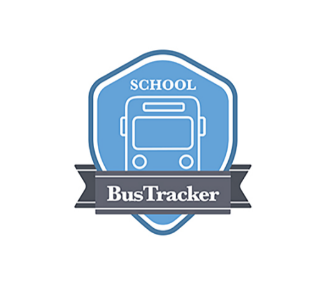 
        SchoolBusTracker
      </th>
      <th>
         
        Bus esCool
      </th>
      <th>
         
         
        Canales informales (WhatsApp + Waze)
      </th>
    </tr>
    <tr>
      <th rowspan="2">Perfil</th>
      <th>Overview</th>
      <td><strong>Rumbo</strong>, producto de la startup <strong>AIpaca</strong>, es una plataforma web responsive orientada a la coordinación del transporte escolar entre padres/tutores y conductores. El alcance actual prioriza estados e hitos del viaje, rutas, estudiantes, retrasos, incidencias y notificaciones.</td>
      <td>Suite especializada de transporte escolar dirigida principalmente a instituciones educativas. Incluye aplicaciones para padres y conductores y un panel administrativo para gestionar y supervisar el servicio.</td>
      <td>Plataforma de monitoreo y control de rutas escolares que conecta a colegios, padres de familia, coordinadores de transporte, monitores y conductores.</td>
      <td>Combinación de aplicaciones de mensajería, llamadas, navegación y ubicación que pueden utilizarse para coordinar el servicio, pero que no conforman por sí mismas un sistema especializado de transporte escolar.</td>
    </tr>
    <tr>
      <th>Ventaja competitiva / ¿Qué valor ofrece a los clientes?</th>
      <td>Experiencia enfocada inicialmente en padres/tutores y conductores, con información estructurada del traslado y un historial de eventos que reduce la dependencia de consultas repetitivas.</td>
      <td>Oferta madura e integrada: seguimiento en tiempo real, registro de subida y bajada, alertas, reservas, pagos, administración y reportes dentro de una misma suite.</td>
      <td>Seguimiento en tiempo real, avisos sobre imprevistos, control de inasistencias, información de abordaje y herramientas específicas para la operación de rutas escolares.</td>
      <td>Familiaridad de uso, amplia presencia en los teléfonos de los usuarios y posibilidad de comunicarse o consultar navegación sin adoptar inicialmente una plataforma adicional.</td>
    </tr>
    <tr>
      <th rowspan="2">Perfil de Marketing</th>
      <th>Mercado objetivo</th>
      <td>Padres/tutores y conductores de movilidad escolar de Lima y Callao.</td>
      <td>Colegios y organizaciones que administran transporte escolar, junto con padres, estudiantes y conductores que utilizan el servicio.</td>
      <td>Colegios, padres de familia, coordinadores de transporte, monitores y conductores vinculados a rutas escolares.</td>
      <td>Mercado general de usuarios de mensajería y navegación; dentro del problema de Rumbo actúan como herramientas sustitutas para familias y conductores.</td>
    </tr>
    <tr>
      <th>Estrategias de marketing</th>
      <td>Propuesta centrada en simplificar la coordinación entre los dos segmentos iniciales y reducir la comunicación manual mediante una experiencia web responsive.</td>
      <td>Comercialización orientada a instituciones mediante demostraciones, paquetes de servicio y posibilidades de personalización de la experiencia para cada organización.</td>
      <td>Adopción vinculada a instituciones y operadores de transporte, con una propuesta multirrol y un plan de prueba piloto comunicado desde su sitio oficial.</td>
      <td>No existe una estrategia única de transporte escolar: la adopción deriva principalmente de la presencia y utilidad general de cada aplicación.</td>
    </tr>
    <tr>
      <th rowspan="3">Perfil de Producto</th>
      <th>Productos &amp; Servicios</th>
      <td>Gestión de rutas, paradas y estudiantes; programación del traslado; estados e hitos del viaje; confirmaciones de recojo y entrega; retrasos, incidencias, notificaciones e historial.</td>
      <td>Parent App, Driver App y Admin Panel; seguimiento de rutas, registro de abordaje y descenso, alertas, reservas, pagos, gestión administrativa y reportes.</td>
      <td>Ubicación de la ruta en tiempo real, notificaciones de imprevistos y proximidad, gestión de inasistencias, información de abordaje, herramientas para conductor/monitor y panel de coordinación con reportes.</td>
      <td>Chats, llamadas, envío de mensajes, ubicación compartida y navegación. La información queda repartida entre herramientas y conversaciones diferentes.</td>
    </tr>
    <tr>
      <th>Precios &amp; Costos</th>
      <td>El modelo SaaS constituye una hipótesis del proyecto; el precio y las condiciones comerciales todavía requieren validación.</td>
      <td>Dispone de paquetes comerciales para instituciones. En este análisis no se asigna un precio concreto porque no se ha verificado uno aplicable de manera general.</td>
      <td>Servicio comercial para instituciones y usuarios vinculados a la ruta. En las fuentes consultadas no se verificó un precio público general aplicable a todos los clientes.</td>
      <td>No requieren una licencia específica de transporte escolar; el usuario puede tener costos asociados a conectividad o a las condiciones generales de cada servicio.</td>
    </tr>
    <tr>
      <th>Canales de distribución (Web y/o Móvil)</th>
      <td>Landing Page y Frontend Web Application responsive.</td>
      <td>Aplicaciones móviles para usuarios y plataforma/panel de administración.</td>
      <td>Aplicaciones móviles para los participantes de la ruta y plataforma web para coordinación.</td>
      <td>Principalmente aplicaciones móviles; algunos servicios también disponen de acceso web.</td>
    </tr>
    <tr>
      <th rowspan="4">Análisis SWOT</th>
      <th>Fortalezas</th>
      <td>Enfoque concreto en los dos segmentos iniciales de Rumbo; estructura de eventos del viaje; experiencia responsive; el valor del MVP no depende de GPS continuo, ETA dinámico o geofencing.</td>
      <td>Suite especializada consolidada, múltiples aplicaciones por rol, seguimiento en tiempo real, registro de pasajeros, administración, reportes, reservas y pagos.</td>
      <td>Especialización en rutas escolares, ubicación en tiempo real, notificaciones de eventos, gestión de inasistencias y coordinación entre varios roles.</td>
      <td>Alta familiaridad, disponibilidad inmediata y flexibilidad para mensajería, llamadas, navegación y ubicación compartida.</td>
    </tr>
    <tr>
      <th>Debilidades</th>
      <td>Producto nuevo y sin base instalada; varias capacidades todavía deben implementarse y validarse; el MVP actual no contempla como requisito GPS continuo, ETA dinámico ni geofencing.</td>
      <td>Su propuesta está orientada principalmente a instituciones y operaciones de transporte organizadas, por lo que puede resultar más amplia que las necesidades iniciales de una relación directa conductor–familia.</td>
      <td>La propuesta articula colegio, coordinadores, monitores y conductores, por lo que su adopción está fuertemente vinculada a una operación institucional o de ruta ya organizada.</td>
      <td>Información fragmentada, historial difícil de estructurar, ausencia de un ciclo de vida propio del viaje y necesidad de repetir comunicaciones manualmente.</td>
    </tr>
    <tr>
      <th>Oportunidades</th>
      <td>Atender la coordinación digital entre familias y conductores de movilidad escolar en Lima y Callao con una solución enfocada, accesible desde navegador y adaptada al contexto local.</td>
      <td>Ampliar su presencia a nuevos mercados e instituciones y aprovechar su suite existente para organizaciones que buscan digitalizar integralmente la gestión del transporte escolar.</td>
      <td>Extender alianzas con colegios y operadores de transporte escolar en más mercados latinoamericanos y aprovechar su experiencia de monitoreo y comunicación multirrol.</td>
      <td>Mantenerse como alternativa sustituta debido a la baja fricción de adopción y a que los usuarios ya conocen estas herramientas, incorporando además nuevas capacidades generales de comunicación y navegación.</td>
    </tr>
    <tr>
      <th>Amenazas</th>
      <td>Hábitos arraigados de coordinación mediante mensajería y llamadas; presencia de plataformas especializadas ya operativas; exigencias de confianza y privacidad por tratar información relacionada con menores.</td>
      <td>Competidores locales más ligeros o adaptados a mercados específicos; barreras de adopción para operadores pequeños; sustitución parcial mediante herramientas generalistas de comunicación y navegación.</td>
      <td>Entrada de soluciones con onboarding más simple para conductores independientes; competencia de suites internacionales y permanencia de canales informales ya adoptados.</td>
      <td>Las plataformas especializadas pueden reemplazar parte de su uso en transporte escolar al ofrecer permisos por rol, trazabilidad, estados del viaje, notificaciones estructuradas y reportes.</td>
    </tr>
  </tbody>
</table>

**Fuentes consultadas para contrastar las capacidades de los competidores:**  
- SchoolBusTracker: https://www.schoolbustrackerapp.com/  
- Bus esCool: https://busescool.com/  
- WhatsApp Brand Resources: https://www.meta.com/brand/resources/whatsapp/whatsapp-brand/  
- Waze: https://www.waze.com/

### 2.1.2. Estrategias y tácticas frente a competidores

Para organizar las estrategias y tácticas preliminares de **Rumbo** frente a la competencia, se emplean las matrices **FODA** y **CAME**. La matriz FODA resume la situación interna de la startup y el contexto externo identificado en el Competitive Analysis Landscape. A partir de ello, la matriz CAME plantea acciones para **Corregir debilidades, Afrontar amenazas, Mantener fortalezas y Explotar oportunidades**.

#### Matriz FODA

<table>
  <thead>
    <tr>
      <th>Interno / Externo</th>
      <th>Positivo</th>
      <th>Negativo</th>
    </tr>
  </thead>
  <tbody>
    <tr>
      <th>Interno</th>
      <td>
        <strong>Fortalezas (F)</strong>  
        • Enfoque específico en los dos segmentos objetivo del proyecto: padres/tutores y conductores de movilidad escolar.  
        • Centralización de estados del traslado, hitos, retrasos, incidencias y notificaciones dentro de un mismo flujo de información.  
        • Web Application responsive planteada para funcionar con los dispositivos de los usuarios y sin requerir hardware propietario para las funcionalidades del MVP.
      </td>
      <td>
        <strong>Debilidades (D)</strong>  
        • Producto nuevo, sin una base instalada ni confianza consolidada frente a soluciones que ya operan en el mercado.  
        • El alcance actual no contempla todavía GPS continuo, ETA dinámico ni geofencing, mientras que competidores especializados ya ofrecen capacidades de seguimiento en tiempo real.  
        • El valor de la coordinación depende de que conductores y familias adopten y utilicen de manera consistente la plataforma.
      </td>
    </tr>
    <tr>
      <th>Externo</th>
      <td>
        <strong>Oportunidades (O)</strong>  
        • Los canales informales como mensajería, llamadas y ubicación compartida no estructuran el ciclo del traslado escolar ni consolidan un historial único de eventos.  
        • Las soluciones especializadas analizadas presentan una fuerte orientación a colegios, administradores y operaciones de transporte, lo que permite a Rumbo enfocarse en una experiencia directa para padres/tutores y conductores.  
        • La necesidad de reducir incertidumbre, mensajes repetitivos y falta de trazabilidad durante el traslado abre espacio para una solución centrada en estados e hitos claramente registrados.
      </td>
      <td>
        <strong>Amenazas (A)</strong>  
        • SchoolBusTracker y Bus esCool ya ofrecen funciones especializadas de seguimiento, notificaciones y gestión del transporte escolar.  
        • WhatsApp, llamadas y herramientas de navegación cuentan con alta familiaridad y pueden seguir siendo suficientes para usuarios que no perciban un beneficio adicional al cambiar de herramienta.  
        • Las expectativas de los usuarios pueden estar influenciadas por competidores que ya ofrecen localización en tiempo real y otras capacidades que Rumbo ha dejado fuera del alcance actual.
      </td>
    </tr>
  </tbody>
</table>

#### Matriz CAME

| Estrategia | Tácticas preliminares de Rumbo |
|---|---|
| **C — Corregir Debilidades** | Validar progresivamente el MVP con ambos segmentos objetivo para mejorar usabilidad y confianza. Mantener claramente delimitado el alcance actual y evaluar GPS continuo, ETA dinámico y geofencing únicamente como evolución posterior si la validación demuestra su necesidad. Reforzar onboarding, autorizaciones y manejo de información de menores para reducir barreras de adopción. |
| **A — Afrontar Amenazas** | Diferenciarse de las soluciones especializadas mediante una experiencia más acotada a la coordinación directa entre conductor y familia. Frente a WhatsApp, llamadas y navegación, demostrar el valor de disponer de estados, hitos, retrasos e incidencias en un registro estructurado. Evitar competir mediante funcionalidades que todavía no están implementadas y sostener la propuesta sobre capacidades verificables del producto. |
| **M — Mantener Fortalezas** | Conservar el enfoque en los dos segmentos definidos, la estructura cronológica de eventos del viaje y la centralización de información relevante. Mantener una experiencia responsive y consistente entre las vistas destinadas a conductores y padres/tutores. Preservar las reglas de autorización y privacidad previstas por el proyecto. |
| **E — Explotar Oportunidades** | Orientar la adopción hacia casos donde la coordinación actual depende de mensajes o llamadas repetitivas. Posicionar a Rumbo como una alternativa estructurada para registrar y consultar el estado del traslado sin requerir una plataforma completa de administración de flotas. Priorizar en la experiencia las funcionalidades que cubren directamente los vacíos detectados: hitos del viaje, retrasos, incidencias, notificaciones y trazabilidad. |

## 2.2. Entrevistas

Se realizaron entrevistas semiestructuradas para comprender hábitos, procesos actuales, frustraciones, motivaciones, necesidades, herramientas utilizadas y barreras de adopción de los segmentos objetivo. La información obtenida sirve como base para el análisis posterior y para la construcción de los artefactos de Needfinding.

### 2.2.1. Diseño de entrevistas

#### Preguntas dirigidas al primer segmento — Padres y tutores

1. ¿Podría indicarnos su edad, el distrito donde reside y la edad y grado escolar de su(s) hijo(s) que utilizan el transporte escolar?
2. Actualmente, ¿cómo se organiza con el recojo y retorno de sus hijos? ¿Sale a esperarlos, confía en el horario del conductor o utiliza alguna aplicación?
3. ¿Qué aplicaciones móviles utiliza con mayor frecuencia en su día a día (por ejemplo, WhatsApp, Waze, redes sociales, aplicaciones del colegio)?
4. Descríbanos su experiencia actual con el servicio de transporte escolar. ¿Qué es lo que más le preocupa o le genera incertidumbre durante el viaje de sus hijos?
5. ¿Cuántas veces al día suele comunicarse con el conductor para preguntar por la ubicación o el estado del viaje de sus hijos?
6. ¿Ha tenido experiencias donde el conductor llegó tarde, no pasó por su hijo o hubo confusión con los horarios? ¿Cómo manejó esa situación?
7. ¿Qué opina sobre la seguridad vial y el uso del celular por parte del conductor? ¿Le genera preocupación saber que el conductor podría distraerse al atender llamadas o mensajes de los padres?
8. Si existiera una aplicación que le mostrara en un mapa la ubicación exacta del vehículo en tiempo real y le notificara automáticamente cuando está cerca de su casa, sin que el conductor tenga que llamarle, ¿cómo cambiaría su rutina matutina?
9. Además de la ubicación, ¿qué otra información le gustaría recibir, como la confirmación de que su hijo abordó el vehículo o llegó al colegio?
10. ¿Estaría dispuesto a pagar una suscripción mensual por un servicio que le brinde esta tranquilidad y seguridad? ¿Cuánto consideraría justo pagar?
11. ¿Qué característica de la aplicación sería la más importante para usted para sentirse tranquilo al confiar el transporte de su hijo a un conductor registrado en nuestra plataforma?

#### Preguntas dirigidas al segundo segmento — Conductores de movilidad escolar

1. ¿Cuál es tu nombre completo, edad, ocupación, distrito de residencia y cuántos años de experiencia tienes realizando transporte escolar?
2. ¿Cuántos estudiantes y rutas manejas normalmente durante una jornada de trabajo?
3. ¿Qué dispositivo, navegador y aplicaciones o canales digitales utilizas con mayor frecuencia para organizar tu trabajo y comunicarte con las familias?
4. Cuéntame cómo organizas actualmente los estudiantes, horarios, puntos de recojo y cambios que pueden surgir antes de una ruta.
5. ¿Cómo confirmas actualmente que un estudiante fue recogido o entregado y cómo comunicas esos eventos a sus familiares?
6. ¿Qué situaciones imprevistas o retrasos ocurren con mayor frecuencia durante una ruta y cómo los comunicas a las familias?
7. ¿Qué información te piden los padres con mayor frecuencia y qué parte de esa comunicación te quita más tiempo o se vuelve repetitiva?
8. ¿En qué momentos sería seguro y realista registrar información en un sistema sin distraerte de la conducción, y qué acciones digitales serían poco prácticas durante tu jornada?
9. ¿Qué información te sería útil conservar como historial de una ruta para resolver posteriormente dudas o reclamos?
10. ¿Qué datos consideras privados o que no deberían mostrarse libremente dentro de una plataforma de movilidad escolar?
11. ¿Qué tendría que ofrecer una herramienta digital para que la utilices de manera recurrente y qué barreras podrían impedir que la adoptes?
12. Si pudieras mejorar una sola parte de la coordinación con padres y tutores, ¿cuál sería y por qué?

### 2.2.2. Registro de entrevistas

Para cada entrevista se registra el nombre completo, edad, distrito, segmento, captura, URL de la evidencia en video, timing de inicio, duración y un resumen descriptivo. Se cuenta con seis entrevistas: tres del segmento Padres/Tutores y tres del segmento Conductores de movilidad escolar.

| # | Entrevistado | Edad | Distrito | Segmento | Duración | Referencia |
| -: | ----------- | ---: | -------- | -------- | :-----   | ---------- |
|  1 | Gabriela Salazar | 32 | Miraflores | Padre/Tutor | 07:19 | [Entrevista 1](#entrevista-1--gabriela-salazar) |
|  2 | Alejandro Choquehuanca | 34 | Surco | Padre/Tutor | 05:10 | [Entrevista 2](#entrevista-2--alejandro-choquehuanca)  |
|  3 | Eduardo Osorio | 34 | Magdalena | Padre/Tutor | 03:26 | [Entrevista 3](#entrevista-3--eduardo-osorio) |
|  4 | Gabriel Alexandro Sosa Guevara | 20 | Los Olivos | Conductor | 09:51 | [Entrevista 4](#entrevista-4--gabriel-alexandro-sosa-guevara) |
|  5 | Brayan Solorzano Pineda | 25 | Pueblo Libre | Conductor | 09:05 | [Entrevista 5](#entrevista-5--brayan-solorzano-pineda) |
|  6 | Vilma Hoyos Martinez | 56 | San Miguel | Conductor | 18:14 | [Entrevista 6](#entrevista-6--vilma-hoyos-martinez) |

#### Entrevista 1 — Gabriela Salazar

* **Edad:** 32 años.
* **Ocupación / segmento:** Padre / Tutor.
* **Distrito:** Miraflores.
* **Duración:** 07:19.
* **Timing de inicio:** 00:00.
* **Video:** [Ver video](https://upcedupe-my.sharepoint.com/:v:/g/personal/u202422589_upc_edu_pe/IQD1AXwvDziBQJNjfqVNiPQWAeYMA26BAQOBC1tyKe_D9nw?nav=eyJyZWZlcnJhbEluZm8iOnsicmVmZXJyYWxBcHBQbGF0Zm9ybSI6IldlYiIsInJlZmVycmFsTW9kZSI6InZpZXciLCJyZWZlcnJhbEFwcFBsYXRmb3JtIjoiV2ViIiwicmVmZXJyYWxNb2RlIjoidmlldyIsInJlZmVycmFsVmlldyI6IlNoYXJlRGlhbG9nLUxpbmsiLCJyZWZlcnJhbEFwcCI6IlN0cmVhbVdlYkFwcCJ9fQ%3D%3D&e=VWo0MB).

**Resumen:** Gabriela Salazar tiene 32 años y pertenece al segmento de padres/tutores. Durante la entrevista se abordaron sus experiencias relacionadas con el transporte escolar de su sobrino de 8 años, especialmente los problemas ocasionados por retrasos mecánicos que no son comunicados oportunamente. Asimismo, destacó la importancia de evitar que el conductor manipule el celular mientras conduce, indicando que debería utilizarlo únicamente cuando se encuentre estacionado. Entre las funcionalidades de mayor interés se encuentra el rastreo en vivo de la movilidad. Respecto a la disposición de pago, considera viable un rango de S/ 15 a S/ 25 mensuales, siempre que pueda acceder previamente a un periodo de prueba gratuito.

#### Entrevista 2 — Alejandro Choquehuanca

* **Edad:** 34 años.
* **Ocupación / segmento:** Padre / Tutor.
* **Distrito:** Surco.
* **Duración:** 05:10.
* **Timing de inicio:** 00:00.
* **Video:** [Ver video](https://upcedupe-my.sharepoint.com/:v:/g/personal/u202422589_upc_edu_pe/IQCneF6uJQneSbuVfMMPEvfKAdcXTo1sHeUy-SGF28JiP3g?nav=eyJyZWZlcnJhbEluZm8iOnsicmVmZXJyYWxBcHBQbGF0Zm9ybSI6IldlYiIsInJlZmVycmFsTW9kZSI6InZpZXciLCJyZWZlcnJhbFZpZXciOiJTaGFyZURpYWxvZy1MaW5rIiwicmVmZXJyYWxBcHAiOiJTdHJlYW1XZWJBcHAifX0%3D&e=f5sdCh).

**Resumen:** Alejandro tiene 34 años y pertenece al segmento de padres/tutores. Durante la entrevista se abordaron sus principales preocupaciones como padre de un niño de 6 años que utiliza transporte escolar en Surco. Entre sus preocupaciones se encuentra la distracción del conductor ocasionada por las llamadas de otros padres durante el trayecto. También manifestó interés en contar con un mapa en tiempo real que permita conocer la ubicación de la movilidad y reducir el tiempo de espera en la calle. Asimismo, considera importante recibir alertas cuando el estudiante ingresa al colegio y contar con mecanismos de verificación de la situación legal del conductor. Respecto a la disposición de pago, considera viable una suscripción mensual de S/ 15 a S/ 25.

#### Entrevista 3 — Eduardo Osorio

* **Edad:** 34 años.
* **Ocupación / segmento:** Padre / Tutor.
* **Distrito:** Magdalena.
* **Duración:** 03:26.
* **Timing de inicio:** 00:00.
* **Video:** [Ver video](https://upcedupe-my.sharepoint.com/:v:/g/personal/u202422589_upc_edu_pe/IQDjMXK3n4smQaWYxZ2qTvKkAShiPN2nP5lMf1iIen8ONyA?nav=eyJyZWZlcnJhbEluZm8iOnsicmVmZXJyYWxBcHBQbGF0Zm9ybSI6IldlYiIsInJlZmVycmFsTW9kZSI6IlNoYXJlRGlhbG9nLUxpbmsiLCJyZWZlcnJhbEFwcCI6IlN0cmVhbVdlYkFwcCJ9fQ%3D%3D&e=HlhpOR).

**Resumen:** Eduardo tiene 34 años y pertenece al segmento de padres/tutores. Durante la entrevista se abordaron sus principales preocupaciones respecto al transporte escolar de su hijo de 4 años, quien se encuentra en inicial. Entre sus principales problemas se encuentra la ansiedad generada por la falta de visibilidad del trayecto, especialmente cuando ocurren averías imprevistas durante el recorrido. Manifestó interés en recibir alertas automáticas relacionadas con el abordaje del menor, incluyendo la confirmación de que viaje con el cinturón de seguridad puesto y que sea entregado correctamente a la profesora. Asimismo, considera valioso contar con información que le permita evitar la espera en la vereda. Respecto a la disposición de pago, acepta un rango de S/ 15 a S/ 25 mensuales.

#### Entrevista 4 — Gabriel Alexandro Sosa Guevara

- **Edad:** 20 años.
- **Ocupación / segmento:** Conductor de movilidad escolar.
- **Experiencia en el rubro:** 2 años.
- **Distrito:** Los Olivos.
- **Duración:** 09:51.
- **Timing de inicio:** 00:00.
- **Video:** [Conductor 1.mp4](https://upcedupe-my.sharepoint.com/:v:/g/personal/u202422298_upc_edu_pe/IQC8MugJp8RuRYBv6-JB1JqxAa7zKfdSDfWOW6lMscwFzxg?nav=eyJyZWZlcnJhbEluZm8iOnsicmVmZXJyYWxBcHBQbGF0Zm9ybSI6IldlYiIsInJlZmVycmFsTW9kZSI6InZpZXciLCJyZWZlcnJhbFZpZXciOiJNeUZpbGVzTGlua0NvcHkifX0&e=MUf4ft).

**Resumen:** Gabriel cuenta con 2 años de experiencia realizando transporte escolar. Utiliza diariamente su teléfono para trabajar y principalmente usa WhatsApp para comunicarse con las familias y Google Maps para organizar sus rutas. Comenta que uno de los problemas que presenta es tener la información fragmentada en distintos chats, lo que hace poco práctico buscar entre conversaciones para verificar si un estudiante será recogido o consultar la dirección de un punto de llegada alternativo. Además, menciona que es repetitivo responder diariamente las preguntas de los padres sobre cuánto falta para que llegue su hijo, si la movilidad se encuentra cerca o si el estudiante se encuentra bien, ya que esto puede distraerlo mientras conduce. También considera que, en caso de utilizar una aplicación, esta debería ser fácil y rápida de utilizar para no quitarle tiempo durante la conducción. Entre las funcionalidades que considera útiles se encuentran una lista de alumnos, el orden de recojo y la posibilidad de registrar rápidamente cuándo recoge o entrega a un estudiante. Asimismo, le gustaría que los padres puedan visualizar el estado de la ruta y su ubicación para mantenerse informados sin necesidad de comunicarse constantemente con él.

#### Entrevista 5 — Brayan Solorzano Pineda

- **Edad:** 25 años.
- **Ocupación / segmento:** Conductor de movilidad escolar.
- **Experiencia en el rubro:** 5 años.
- **Distrito:** Pueblo Libre.
- **Duración:** 09:05.
- **Timing de inicio:** 00:00.
- **Video:** [Conductor 2.mp4](https://upcedupe-my.sharepoint.com/:v:/g/personal/u202422298_upc_edu_pe/IQDViGOQ_7GOQYDKI1MqVAXNAacWQv3o8bRMqBJbKkhsKp8?nav=eyJyZWZlcnJhbEluZm8iOnsicmVmZXJyYWxBcHBQbGF0Zm9ybSI6IldlYiIsInJlZmVycmFsTW9kZSI6InZpZXciLCJyZWZlcnJhbFZpZXciOiJNeUZpbGVzTGlua0NvcHkifX0&e=6tRx0m).

**Resumen:** Brayan cuenta con 5 años de experiencia en el rubro. Comenzó trabajando en transporte personal, pero luego se trasladó al rubro del transporte escolar. Utiliza un grupo de WhatsApp para enviar avisos a los padres; sin embargo, los tutores prefieren escribirle por privado. Además, utiliza Waze para evitar el tráfico y el calendario de su teléfono para recordar horarios especiales. Ha tenido problemas para recordar cambios en las rutas debido a modificaciones en el recojo de un alumno, especialmente porque varios padres le escriben. Diariamente, los padres también le preguntan si ya se encuentra cerca o si los niños ya llegaron a la escuela, lo cual considera repetitivo. Comenta que durante la conducción no utilizaría una aplicación. Sin embargo, le sería útil contar con un registro del inicio del recorrido, la hora de recojo de cada alumno y la hora de llegada a la escuela. También considera útil registrar cuando un alumno no será recogido. En general, considera que una aplicación debería ayudarlo a organizar los cambios y permitir que los padres puedan seguir la ruta sin necesidad de preguntarle constantemente. No utilizaría una aplicación que lo obligue a realizar muchas acciones manualmente o que tenga un costo muy elevado. Como característica adicional, le gustaría que pudiera utilizarse en zonas donde existe poca señal.

#### Entrevista 6 — Vilma Hoyos Martinez

- **Edad:** 56 años.
- **Ocupación / segmento:** Conductor de movilidad escolar.
- **Experiencia en el rubro:** 25 años.
- **Distrito:** San Miguel.
- **Duración:** 18:14.
- **Timing de inicio:** 00:06.
- **Video:** [Conductor 3.mp4](https://upcedupe-my.sharepoint.com/:v:/g/personal/u20241b451_upc_edu_pe/IQAarNiMmGEZT73ZVhSkpNMNAVFqyptTBINEQvTJU6AW7BY?nav=eyJyZWZlcnJhbEluZm8iOnsicmVmZXJyYWxBcHAiOiJTdHJlYW1XZWJBcHAiLCJyZWZlcnJhbFZpZXciOiJTaGFyZURpYWxvZy1MaW5rIiwicmVmZXJyYWxBcHBQbGF0Zm9ybSI6IldlYiIsInJlZmVycmFsTW9kZSI6InZpZXcifX0%3D&e=asjxgo).

**Resumen:** Vilma cuenta con 25 años de experiencia en el rubro de la movilidad escolar. Empezó llevando a estudiantes del colegio San Toribio, en el Rímac, hace 10 años y actualmente está a cargo de 26 niños en San Miguel, a quienes lleva a los colegios Claretiano y Los Rosales. La señora Vilma cuenta con un ayudante, quien utiliza la aplicación WhatsApp para comunicarse con las familias, coordinar horarios, llamar para avisar que deben bajar, informar si el niño asistirá, si necesita esperar y compartir su ubicación en tiempo real. Ha presentado problemas con la puntualidad de los niños y con la coordinación con los padres respecto a si los niños serán recogidos o no. Comenta que tiene conocimientos casi nulos en tecnología. Los padres le han recomendado utilizar algunas aplicaciones para poder realizar un mejor seguimiento del recorrido de sus hijos, pero menciona que no sabe cómo utilizarlas y, por ese motivo, no las implementa.

### 2.2.3. Análisis de entrevistas

El análisis se realizó por separado para los dos segmentos objetivo, utilizando las seis entrevistas registradas como fuente. Se distinguen características objetivas —edad, distrito, experiencia, herramientas y rutinas— y características subjetivas —preocupaciones, motivaciones, expectativas y barreras de adopción—. Los porcentajes indicados corresponden a la proporción observada dentro de cada grupo de tres entrevistados.

#### Segmento 1 — Padres y tutores

**Características objetivas**

- **Edad:** los tres entrevistados tienen entre **32 y 34 años**.
- **Rol de cuidado:** el **66,7 %** corresponde a padres de familia y el **33,3 %** a un tutor responsable.
- **Edad de los menores:** el **100 %** tiene a su cargo niños de entre **4 y 8 años** que utilizan movilidad escolar.
- **Herramientas digitales:** el **100 %** utiliza WhatsApp y aplicaciones de mapas o navegación como parte de su vida cotidiana.
- **Contacto con el conductor:** el **100 %** indicó que se comunica con el conductor cuando necesita confirmar el estado del recorrido o cuando se presenta una demora relevante.

**Características subjetivas**

- **Incertidumbre durante el traslado:** el **100 %** manifestó necesidad de contar con mayor visibilidad del estado del recorrido para reducir llamadas o mensajes al conductor.
- **Confirmación de recojo y entrega:** el **100 %** considera importante saber cuándo el menor fue recogido y cuándo llegó o fue entregado de forma segura.
- **Seguridad y distracción del conductor:** el **100 %** manifestó preocupación por el uso del teléfono durante la conducción; las interacciones del conductor deberían realizarse únicamente cuando sea seguro.
- **Avisos e incidencias:** el **100 %** valora recibir información oportuna cuando ocurre un retraso, avería o situación imprevista.
- **Disposición económica:** el **100 %** consideró aceptable un rango referencial de **S/ 15 a S/ 25 mensuales** para un servicio que aporte seguimiento y seguridad. Una de las tres personas entrevistadas (**33,3 %**) señaló que preferiría probar el servicio antes de asumir el pago.

#### Segmento 2 — Conductores de movilidad escolar

**Características objetivas**

- **Edad:** Gabriel Alexandro Sosa Guevara tiene 20 años, Brayan Solorzano Pineda 25 años y Vilma Hoyos Martinez 56 años. La edad promedio es de **33,67 años**.
- **Experiencia:** declararon **2, 5 y 25 años** de experiencia respectivamente, con un promedio de **10,67 años**.
- **Distritos:** los entrevistados residen en **Los Olivos, Pueblo Libre y San Miguel**.
- **Canal de coordinación:** en los tres casos (**100 %**) WhatsApp forma parte de la coordinación cotidiana con las familias, ya sea utilizado directamente por el conductor o por un ayudante.
- **Apoyo de herramientas digitales:** dos de los tres entrevistados (**66,7 %**) mencionaron de forma explícita aplicaciones de mapas o navegación para organizar o facilitar el recorrido.

**Características subjetivas**

- **Sobrecarga de comunicación:** el **100 %** describió problemas asociados a mensajes, llamadas, cambios de último momento o información dispersa durante la coordinación del servicio.
- **Necesidad de interacción simple:** los tres casos evidencian barreras de adopción que obligan a que la solución sea sencilla: rapidez de uso, pocas acciones manuales, conectividad limitada o poca familiaridad tecnológica.
- **Trazabilidad del servicio:** los conductores valoran disponer de información organizada sobre estudiantes, cambios, recojos, entregas, ausencias y eventos del recorrido para evitar depender de múltiples conversaciones.
- **Seguridad durante la conducción:** las interacciones digitales deben reducirse al mínimo mientras el vehículo está en movimiento; las acciones operativas se plantean para momentos seguros o con el vehículo detenido.
- **Comunicación de retrasos e incidencias:** el segmento necesita comunicar novedades a varias familias sin repetir el mismo mensaje de forma individual.

#### Hallazgos comunes entre segmentos

| Variable | Padres/Tutores | Conductores |
|---|---:|---:|
| WhatsApp como canal relevante de coordinación | 100 % | 100 % |
| Necesidad de conocer o comunicar el estado del traslado | 100 % | 100 % |
| Confirmación de recojo/entrega como información relevante | 100 % | 100 % |
| Interés en avisos sobre retrasos o incidencias | 100 % | 100 % |
| Preocupación por evitar distracciones durante la conducción | 100 % | 100 % |
| Existencia de barreras de adopción o confianza | 33,3 % con énfasis explícito en prueba previa | 100 % con énfasis en simplicidad, conectividad o familiaridad tecnológica |

Los resultados muestran una coincidencia central: las familias necesitan visibilidad y tranquilidad, mientras que los conductores necesitan reducir la comunicación repetitiva y mantener la atención en la conducción. Esta convergencia sustenta la priorización de estados e hitos del viaje, confirmaciones, retrasos, incidencias, notificaciones y un historial estructurado del traslado.

## 2.3. Needfinding

### 2.3.1. User Personas

En esta sección se presentan las User Personas correspondientes a los dos segmentos objetivo: **Padres/Tutores y Conductores**. Los arquetipos se construyeron a partir de los patrones identificados en las entrevistas y se contrastaron con los hallazgos del análisis competitivo para representar características, necesidades, comportamientos, objetivos, frustraciones, herramientas y barreras relevantes de cada segmento.

#### Segmento — Padres y tutores

#### Segmento — Conductores

### 2.3.2. User Task Matrix

En esta sección se presenta la matriz de tareas de usuario (**User Task Matrix**), considerando al User Persona del segmento **Padre/Tutor (Gabriela Morales)** y al User Persona del segmento **Conductor de Movilidad Escolar**. Las tareas corresponden a actividades que los segmentos realizan para cumplir sus objetivos independientemente de la existencia de Rumbo.

<table>
  <thead>
    <tr>
      <th rowspan="2">User Tasks</th>
      <th colspan="2">User Persona: Padre / Tutor (Gabriela Morales)</th>
      <th colspan="2">User Persona: Conductor de Movilidad Escolar</th>
    </tr>
    <tr>
      <th>Frecuencia</th>
      <th>Importancia</th>
      <th>Frecuencia</th>
      <th>Importancia</th>
    </tr>
  </thead>
  <tbody>
    <tr><td>Alistar y preparar al escolar antes de la salida</td><td>Diaria (Alta)</td><td>Alta</td><td>No aplica</td><td>No aplica</td></tr>
    <tr><td>Esperar en la acera/puerta al vehículo de movilidad</td><td>Diaria (Alta)</td><td>Alta</td><td>No aplica</td><td>No aplica</td></tr>
    <tr><td>Consultar el estado y avance del vehículo en ruta</td><td>Diaria (Alta)</td><td>Alta</td><td>No aplica</td><td>No aplica</td></tr>
    <tr><td>Planificar y organizar la lista de paradas del recorrido</td><td>No aplica</td><td>No aplica</td><td>Diaria (Alta)</td><td>Alta</td></tr>
    <tr><td>Confirmar la subida del escolar a la unidad</td><td>Diaria (Alta)</td><td>Alta</td><td>Diaria (Alta)</td><td>Alta</td></tr>
    <tr><td>Verificar el uso del cinturón y medidas de seguridad del menor</td><td>Ocasional (Media)</td><td>Media</td><td>Diaria (Alta)</td><td>Alta</td></tr>
    <tr><td>Conducir y monitorear el flujo vehicular en horas punta</td><td>No aplica</td><td>No aplica</td><td>Diaria (Alta)</td><td>Alta</td></tr>
    <tr><td>Comunicar retrasos generados por congestión vehicular</td><td>Semanal (Media)</td><td>Alta</td><td>Semanal (Media)</td><td>Alta</td></tr>
    <tr><td>Informar incidencias mecánicas o emergencias imprevistas</td><td>Ocasional (Baja)</td><td>Alta</td><td>Ocasional (Baja)</td><td>Alta</td></tr>
    <tr><td>Confirmar la entrega del escolar en la puerta del colegio</td><td>Diaria (Alta)</td><td>Alta</td><td>Diaria (Alta)</td><td>Alta</td></tr>
    <tr><td>Coordinar el retorno del menor hacia el hogar</td><td>Diaria (Alta)</td><td>Media</td><td>Diaria (Alta)</td><td>Media</td></tr>
    <tr><td>Gestionar el pago mensual del servicio de transporte</td><td>Mensual (Baja)</td><td>Media</td><td>Mensual (Baja)</td><td>Media</td></tr>
  </tbody>
</table>

#### Análisis comparativo de la matriz de tareas

1. **Tareas de mayor frecuencia e importancia crítica (Coincidencias):**
   * **Confirmación de recojo y entrega escolar:** Tanto para el padre/tutor como para el conductor, confirmar el momento exacto en que el menor ingresa a la unidad y llega a salvo al centro educativo es una tarea diaria de máxima importancia. Para la familia representa tranquilidad emocional, mientras que para el conductor constituye el cumplimiento de su deber de custodia.
   * **Gestión de demoras por congestión:** Lima presenta un nivel de congestión de **69,3 %** según el TomTom Traffic Index 2025 (TomTom, 2026); por ello, la tarea de informar demoras tiene una frecuencia recurrente (semanal) y una importancia crítica (Alta) para ambos segmentos, porque una comunicación oportuna reduce la incertidumbre de las familias y la sobrecarga de consultas al conductor.

2. **Principales diferencias operativas entre segmentos:**
   * **Foco de atención en ruta:** Mientras el padre/tutor tiene una necesidad pasiva pero continua de consultar dónde está la movilidad para no salir a la acera a ciegas, el conductor debe mantener el 100% de su atención sobre el volante y el entorno vial, por lo que cualquier tarea que le exija distraer la vista representa un peligro potencial.
   * **Planificación previa:** El conductor asume la responsabilidad logística de trazar el orden óptimo de recojo y desembarque antes de arrancar el motor, una tarea ajena al padre de familia, quien únicamente se enfoca en el punto de parada correspondiente a su hogar o colegio.

3. **Oportunidad para el diseño de la solución:**
   El análisis evidencia que las tareas de *confirmar subida/bajada* y *avisar retrasos* son de alta fricción en la actualidad (se realizan mediante llamadas o mensajes manuales mientras se conduce). La solución debe automatizar y simplificar estas tareas al mínimo contacto operativo para proteger la seguridad del menor.

### 2.3.3. User Journey Mapping

En esta sección se presentan los **User Journey Maps** correspondientes a los dos segmentos objetivo: **Padres/Tutores y Conductores**. Estos mapas representan el recorrido actual de cada usuario durante el servicio de movilidad escolar, desde el inicio hasta el final de su experiencia.

Se presentan las versiones **As-Is**, que permiten analizar cómo se desarrolla actualmente el proceso sin la intervención de nuestra solución. A través de las diferentes etapas, actividades, puntos de contacto y dificultades identificadas, se busca comprender la experiencia de cada User Persona y detectar oportunidades de mejora.

#### Segmento — Padres y tutores

El journey de los padres de familia durante las mañanas inicia con la preparación en casa, donde alistan al menor con una sensación inicial de serenidad, aunque experimentan la falta de visibilidad sobre el inicio de la ruta. Al pasar a la espera en la acera, se vive un estado de vigilancia mientras aguardan a la intemperie la llegada de la movilidad, lo que da paso a la etapa de retraso e incertidumbre: al cumplirse más de quince minutos de demora sin respuesta del conductor debido a que va manejando, la ansiedad y el miedo a llegar tarde se apoderan del tutor. Posteriormente, durante el abordaje y despacho, la subida se realiza de forma apresurada y sin la certeza de las medidas de seguridad, generando temor. Finalmente, en el trayecto y llegada, los padres experimentan angustia e incertidumbre total hasta recibir la confirmación de que el menor ha ingresado sin novedades al colegio.

#### Segmento — Conductores

El recorrido diario del conductor comienza antes del viaje, cuando revisa mensajes de WhatsApp para confirmar asistencias, cambios de horario y puntos de recojo. Durante el trayecto de ida aumenta la tensión, porque las consultas sobre demoras o ubicación llegan mientras debe mantener la atención en la conducción. Al finalizar la ida y preparar el retorno, revisa nuevamente conversaciones fragmentadas para identificar cambios y ausencias. En el colegio verifica a los estudiantes que retornarán y atiende posibles modificaciones de último momento. Durante el viaje de regreso repite el proceso de entrega mientras necesita conservar información suficiente para responder ante incidencias o dudas posteriores. Finalmente, la jornada termina con la confirmación de las entregas y la comunicación con las familias. Este recorrido evidencia una carga de coordinación repetitiva y dispersa que debe reducirse sin introducir nuevas distracciones durante la conducción.

### 2.3.4. Empathy Mapping

En esta sección se presentan los **Empathy Maps** elaborados para cada uno de los User Personas: **Parent/Guardian y Driver**. El equipo partió de los hallazgos de las entrevistas y colocó a cada arquetipo en el centro del análisis para organizar observaciones sobre qué necesita hacer, qué dice, qué ve, qué escucha, qué hace, qué piensa y qué siente. A partir de estas observaciones se identificaron sus principales **Pains** y **Gains**, procurando que cada elemento conserve trazabilidad con la información obtenida de los segmentos y no con supuestos nuevos del equipo.

#### Segmento — Padres y tutores

#### Segmento — Conductores

## 2.4. Big Picture Event Storming

El equipo realizó una sesión colaborativa de **Big Picture Event Storming** para comprender el dominio de la movilidad escolar de manera integral. El objetivo fue identificar los eventos significativos del negocio, ordenarlos según sus relaciones, detectar riesgos y reglas relevantes y obtener una primera delimitación de las responsabilidades que posteriormente serán refinadas en el diseño DDD.

### Resumen del proceso realizado

**1. Exploración del dominio.**  
Se inició recorriendo de extremo a extremo las actividades de los dos segmentos objetivo: registro y configuración inicial, administración de estudiantes y vehículos, planificación de rutas, ejecución del traslado, gestión de retrasos e incidencias, notificaciones y habilitación comercial del servicio.

**2. Identificación de Domain Events.**  
El equipo registró hechos significativos en tiempo pasado, entre ellos *Account Registered*, *Student Registered*, *Vehicle Registered*, *Route Published*, *Trip Scheduled*, *Trip Started*, *Student Picked Up*, *Incident Registered*, *Notification Sent* y *Subscription Activated*. Estos eventos permiten observar qué cambios relevantes ocurren en el dominio sin confundirlos con pantallas o detalles técnicos.

**3. Ordenamiento y relación de eventos.**  
Los eventos se organizaron siguiendo el flujo del negocio. Una cuenta habilita la gestión de perfiles; los vehículos y credenciales permiten configurar rutas; las rutas publicadas originan viajes programados; los viajes ejecutados producen hitos, retrasos o incidencias; y estos eventos pueden generar notificaciones para los tutores autorizados.

**4. Identificación de reglas, vistas y hotspots.**  
Durante la revisión se registraron reglas como validar la capacidad del vehículo, excluir ausencias del recojo planificado y notificar únicamente a tutores autorizados. También se identificaron riesgos como credenciales inválidas, direcciones no localizables, sobrecapacidad, pérdida de conectividad, destinatarios incorrectos y fallos del proveedor de pago. Las vistas de consulta representan información necesaria para entender el estado del dominio, como *Current Trip Status*, *Trip Timeline* y *Notification Inbox*.

**5. Delimitación preliminar de Bounded Contexts.**  
El análisis permitió organizar el dominio objetivo de Rumbo en ocho contextos preliminares. Esta delimitación representa el alcance pensado para la evolución del producto durante el Trabajo Final; no implica que todos los contextos deban implementarse en el mismo Sprint.

| Bounded Context | Responsabilidad principal |
|---|---|
| **Identity & Access Management** | Gestionar cuentas, autenticación, verificación de correo y recuperación de acceso. |
| **Profiles & Relationship Management** | Gestionar estudiantes, tutores y las relaciones de autorización entre ellos. |
| **Vehicle & Credential Management** | Gestionar vehículos, credenciales declaradas y su estado de verificación. |
| **Route & Trip Planning** | Gestionar rutas, paradas, horarios, asignaciones, ausencias y programación de viajes. |
| **Trip Execution & Monitoring** | Registrar el inicio y desarrollo del viaje, recojos, entregas, etapas, estado y línea de tiempo. |
| **Incident & Delay Management** | Gestionar retrasos, incidencias, actualizaciones, resolución y confirmación de conocimiento. |
| **Notification Management** | Gestionar generación, envío, lectura, fallos de entrega y preferencias de notificación. |
| **Subscriptions & Billing** | Representar el flujo comercial de planes, suscripción, pago y comprobantes previsto para la evolución del producto. |

### Captura consolidada y resultado

La siguiente captura reúne el resultado del proceso. Los elementos están expresados en inglés para mantener consistencia con el lenguaje utilizado en los artefactos de dominio y con el Ubiquitous Language del proyecto.

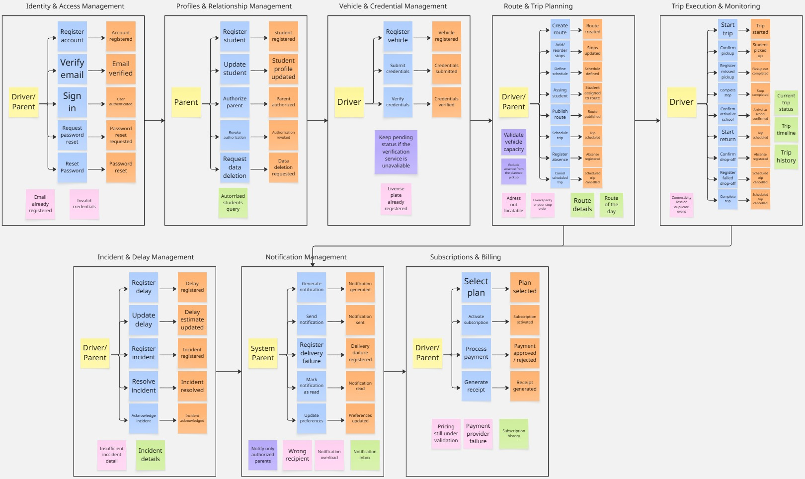

El Big Picture muestra que el núcleo operativo de Rumbo se concentra en la planificación y ejecución del traslado, mientras que identidad, perfiles, vehículos, incidencias, notificaciones y suscripción aportan capacidades relacionadas. Los hotspots registrados permiten anticipar riesgos que deberán considerarse en los siguientes artefactos de diseño y en las decisiones de implementación.

## 2.5. Ubiquitous Language

En esta sección se mantiene el glosario compartido del dominio de movilidad escolar utilizado por el equipo y los stakeholders. Los términos se expresan en inglés y, cuando resulta útil, se incluye su equivalente en español entre paréntesis. Las definiciones describen conceptos del negocio y evitan términos puramente técnicos de ingeniería de software.

| Término | Definición |
|---|---|
| **Account (Cuenta)** | Registro que permite a un conductor o padre/tutor acceder a las capacidades que le corresponden dentro de Rumbo. |
| **Email Verification (Verificación de correo)** | Confirmación de que el correo asociado a una cuenta pertenece al usuario que realizó el registro. |
| **Student (Estudiante)** | Menor que utiliza el servicio de movilidad escolar para trasladarse entre su punto de recojo y el centro educativo. |
| **Parent/Guardian (Padre/Tutor)** | Persona responsable del estudiante y autorizada para consultar información relacionada con sus traslados. |
| **Guardian Authorization (Autorización de tutor)** | Relación que determina qué tutor puede acceder a la información de un estudiante. |
| **Driver (Conductor)** | Persona encargada de conducir la movilidad escolar y ejecutar los traslados asociados a sus rutas. |
| **Vehicle (Vehículo)** | Unidad utilizada por el conductor para realizar el traslado de los estudiantes. |
| **Credential (Credencial)** | Documento o dato declarado por el conductor para respaldar la información de su servicio y vehículo. |
| **Route (Ruta)** | Configuración del recorrido que agrupa paradas, orden de atención, horario y estudiantes asignados. |
| **Stop (Parada)** | Punto definido dentro de una ruta en el que se recoge o entrega a uno o más estudiantes. |
| **Route Schedule (Horario de ruta)** | Días y horas en los que una ruta está prevista para operar. |
| **Student Assignment (Asignación de estudiante)** | Relación que vincula a un estudiante autorizado con una ruta y una parada determinada. |
| **Student Absence (Ausencia de estudiante)** | Registro que indica que un estudiante no utilizará un viaje previsto para una jornada determinada. |
| **Trip (Viaje)** | Ejecución concreta de una ruta en una fecha y turno determinados. |
| **Trip Status (Estado del viaje)** | Estado operativo de un viaje, por ejemplo **scheduled**, **in progress**, **completed** o **cancelled**. |
| **Pickup (Recojo)** | Hito que registra el resultado del recojo de un estudiante en una parada. |
| **Drop-off (Entrega)** | Hito que registra el resultado de la entrega de un estudiante en su destino autorizado. |
| **Trip Timeline (Línea de tiempo del viaje)** | Registro cronológico de los principales eventos ocurridos durante un viaje. |
| **Delay (Retraso)** | Demora registrada que afecta el desarrollo previsto del viaje y que puede requerir una actualización a las familias. |
| **Incident (Incidencia)** | Situación inesperada ocurrida durante el servicio que requiere ser registrada, comunicada y, cuando corresponda, resuelta. |
| **Incident Acknowledgement (Confirmación de incidencia)** | Registro mediante el cual un tutor confirma que tomó conocimiento de una incidencia comunicada. |
| **Notification (Notificación)** | Aviso generado a partir de un evento relevante y dirigido únicamente a usuarios autorizados. |
| **Notification Preference (Preferencia de notificación)** | Configuración mediante la cual un tutor define qué tipos de avisos configurables desea recibir. |
| **Subscription (Suscripción)** | Habilitación comercial asociada a un conductor y a un plan determinado. |
| **Plan (Plan)** | Conjunto de condiciones o capacidades comerciales previstas para una suscripción. |
| **Payment (Pago)** | Operación comercial asociada a la activación o continuidad de una suscripción. |
| **Receipt (Comprobante)** | Constancia generada como resultado de una operación de pago registrada. |

---

# Capítulo III: Requirements Specification

## 3.1. User Stories

Por indicación del docente, los **Epics** y las **User Stories** de Rumbo se presentan en cuadros separados, manteniendo sus relaciones mediante el Epic ID correspondiente. Los criterios de aceptación siguen la estructura Gherkin (Given-When-Then), se redactan en tiempo presente y tercera persona. Las Technical Stories corresponden a capacidades del RESTful API y utilizan el rol Developer.

#### Epics

| Epic / Story Id | Título | Descripción | Criterios de Aceptación | Relacionado con (Epic ID) |
|---|---|---|---|---|
| EP01 | Identidad, perfiles y autorización | Registro de conductores, padres y estudiantes, acceso al sistema según rol, y control sobre qué tutores pueden consultar la información de cada menor, incluida la solicitud de supresión de sus datos. | — | — |
| EP02 | Suscripción del conductor | Activación y vigencia del plan que habilita al conductor el uso de las funcionalidades de Rumbo. | — | — |
| EP03 | Planificación de rutas y viajes | Creación de rutas con sus paradas, orden y horario, asignación de estudiantes autorizados, publicación de la ruta y programación de los viajes de cada jornada, incluyendo ausencias y cancelaciones. | — | — |
| EP04 | Ejecución del traslado | Registro de los hitos del recorrido por parte del conductor: inicio del viaje, recojos, llegada al centro educativo, retorno, entregas y cierre del traslado. | — | — |
| EP05 | Visibilidad, incidencias y comunicación | Consulta del estado y la línea de tiempo por parte de los tutores autorizados, y comunicación de retrasos, incidencias y notificaciones sobre los eventos relevantes de la ruta. | — | — |
| EP06 | Landing Page e información pública | Contenido público que presenta la propuesta de valor de Rumbo, los beneficios por segmento, los documentos legales y los accesos a la aplicación web. | — | — |
| EP07 | RESTful API e integraciones | Capacidades técnicas del RESTful API, incluyendo autenticación, documentación, internacionalización e integración con servicios externos requeridos por Rumbo. | — | — |

#### User Stories

| Epic / Story Id | Título | Descripción | Criterios de Aceptación | Relacionado con (Epic ID) |
|---|---|---|---|---|
| US01 | Registrar cuenta de conductor | Como conductor, quiero crear mi cuenta para iniciar la configuración de mi servicio en Rumbo. | **Escenario 1: Registro exitoso** Given que no existe una cuenta asociada al correo indicado When el conductor completa los datos obligatorios y confirma el registro Then el sistema crea la cuenta con rol de conductor y solicita la verificación del correo  **Escenario 2: Correo ya registrado** Given que existe una cuenta asociada al correo indicado When el conductor intenta registrarse con ese correo Then el sistema rechaza el registro e indica que puede iniciar sesión o recuperar su acceso  **Escenario 3: Datos obligatorios incompletos** Given una solicitud de registro con datos obligatorios faltantes When el conductor confirma el registro Then el sistema informa qué datos obligatorios debe completar y no crea la cuenta | EP01 |
| US02 | Registrar vehículo y credenciales del servicio | Como conductor, quiero registrar mi vehículo y las credenciales que acreditan mi servicio para que las familias conozcan la información declarada de mi movilidad. | **Escenario 1: Registro de vehículo y credenciales** Given un conductor con cuenta activa When registra la placa, la capacidad del vehículo y los documentos requeridos Then el sistema asocia el vehículo al conductor y deja las credenciales en estado pendiente de verificación  **Escenario 2: Placa ya registrada** Given que la placa indicada pertenece a un vehículo activo de otro conductor When el conductor intenta registrarla Then el sistema rechaza el registro e informa que la placa ya se encuentra asociada  **Escenario 3: Verificación de credenciales** Given credenciales enviadas y un servicio de verificación disponible When el sistema obtiene una respuesta del servicio Then registra el resultado junto con su fuente y fecha de consulta  **Escenario 4: Servicio de verificación no disponible** Given credenciales enviadas y el servicio de verificación fuera de operación When el sistema intenta la consulta Then mantiene las credenciales como pendientes y no las declara verificadas | EP01 |
| US03 | Registrar cuenta de padre o tutor | Como padre o tutor, quiero crear mi cuenta para acceder a la información autorizada de los traslados de mis hijos. | **Escenario 1: Registro exitoso** Given que no existe una cuenta asociada al correo indicado When el tutor completa los datos obligatorios y confirma el registro Then el sistema crea la cuenta con rol de padre o tutor y solicita la verificación del correo  **Escenario 2: Correo ya registrado** Given que existe una cuenta asociada al correo indicado When el tutor intenta registrarse con ese correo Then el sistema rechaza el registro e indica que puede iniciar sesión o recuperar su acceso | EP01 |
| US04 | Iniciar sesión según rol | Como usuario registrado, quiero iniciar sesión con mis credenciales para acceder a las funcionalidades correspondientes a mi rol. | **Escenario 1: Acceso válido** Given una cuenta activa con credenciales correctas When el usuario inicia sesión Then el sistema le otorga acceso a las funcionalidades permitidas para su rol  **Escenario 2: Credenciales inválidas** Given credenciales incorrectas When el usuario intenta iniciar sesión Then el sistema rechaza el acceso sin revelar cuál de los datos es incorrecto  **Escenario 3: Cuenta sin verificar** Given una cuenta cuyo correo no ha sido verificado When el usuario intenta iniciar sesión Then el sistema informa que debe completar la verificación antes de continuar | EP01 |
| US05 | Recuperar acceso a la cuenta | Como usuario registrado, quiero restablecer mi contraseña para recuperar el acceso en caso de olvido. | **Escenario 1: Solicitud válida** Given un correo asociado a una cuenta activa When el usuario solicita recuperar su acceso Then el sistema envía un enlace temporal para establecer una nueva contraseña  **Escenario 2: Enlace expirado o utilizado** Given un enlace de recuperación vencido o ya usado When el usuario intenta acceder con él Then el sistema lo rechaza y solicita generar una nueva petición  **Escenario 3: Correo no registrado** Given un correo que no corresponde a ninguna cuenta When se solicita la recuperación Then el sistema responde de forma uniforme sin revelar si el correo existe | EP01 |
| US06 | Registrar estudiante y vincularse como tutor | Como padre o tutor, quiero registrar a mi hijo y quedar vinculado como su tutor para poder consultar la información de sus traslados. | **Escenario 1: Registro y vinculación** Given un tutor autenticado When registra los datos obligatorios del estudiante Then el sistema crea el perfil del estudiante y establece la autorización del tutor sobre él  **Escenario 2: Actualización de datos** Given un estudiante ya registrado When el tutor modifica un dato permitido Then el sistema actualiza la información y conserva la relación con sus viajes anteriores  **Escenario 3: Datos obligatorios incompletos** Given un registro con datos faltantes When el tutor confirma la operación Then el sistema indica qué datos debe completar y no crea el perfil | EP01 |
| US07 | Autorizar o revocar a otro tutor | Como padre o tutor, quiero autorizar o retirar el acceso de otro tutor sobre mi hijo para controlar quién puede consultar su información. | **Escenario 1: Autorización de un tutor adicional** Given un tutor con autorización vigente sobre un estudiante When autoriza a otra persona registrada como tutor de ese estudiante Then el sistema crea la nueva autorización y la habilita para consultar la información del menor  **Escenario 2: Revocación** Given una autorización vigente sobre un estudiante When el tutor responsable la revoca Then el sistema retira el acceso y la persona deja de recibir notificaciones sobre ese estudiante  **Escenario 3: Persona no registrada** Given que la persona indicada no cuenta con una cuenta en Rumbo When se intenta autorizarla Then el sistema informa que debe registrarse previamente  **Escenario 4: Consulta sin autorización** Given un usuario sin autorización vigente sobre un estudiante When intenta consultar su información Then el sistema rechaza la operación | EP01 |
| US08 | Solicitar la supresión de datos del estudiante | Como padre o tutor, quiero solicitar la eliminación de los datos personales de mi hijo para ejercer el control sobre su información. | **Escenario 1: Solicitud registrada** Given un tutor con autorización vigente sobre un estudiante When envía una solicitud de supresión de datos Then el sistema registra la solicitud con su fecha y la deriva al procedimiento de atención correspondiente  **Escenario 2: Estudiante con viajes en curso** Given un estudiante asignado a un viaje que aún no finaliza When se registra la solicitud Then el sistema la conserva como pendiente hasta el cierre del viaje e informa esta condición al tutor | EP01 |
| US09 | Activar la suscripción del conductor | Como conductor, quiero activar una suscripción para habilitar las funcionalidades incluidas en mi plan. | **Escenario 1: Activación válida** Given un conductor con cuenta activa y un plan disponible When el conductor confirma la activación de la suscripción Then el sistema registra el plan y su periodo de vigencia y habilita las funcionalidades correspondientes  **Escenario 2: Suscripción ya activa** Given un conductor con una suscripción vigente al mismo plan When solicita activarla nuevamente Then el sistema conserva la suscripción vigente y evita generar una activación duplicada | EP02 |
| US10 | Crear una ruta con sus paradas | Como conductor, quiero crear una ruta con sus paradas en el orden en que las recorro para organizar mi servicio. | **Escenario 1: Creación de la ruta** Given un conductor con cuenta activa y un vehículo registrado When registra el nombre, el turno y los datos obligatorios de la ruta Then el sistema crea la ruta en estado configurable  **Escenario 2: Incorporación de paradas** Given una ruta en estado configurable When el conductor agrega una parada con una dirección válida Then el sistema la incorpora al recorrido y le asigna la siguiente posición disponible  **Escenario 3: Reordenamiento de paradas** Given una ruta con dos o más paradas When el conductor modifica el orden del recorrido Then el sistema conserva la nueva secuencia para los viajes que se generen a partir de esa ruta  **Escenario 4: Dirección no localizable** Given una dirección que el servicio de mapas no puede ubicar When el conductor intenta agregar la parada Then el sistema informa la situación y permite corregir la dirección antes de guardarla | EP03 |
| US11 | Definir el horario de la ruta | Como conductor, quiero establecer los días y horarios de una ruta para que sus viajes se programen de forma recurrente. | **Escenario 1: Horario válido** Given una ruta en estado configurable When el conductor define los días de servicio y las horas correspondientes Then el sistema guarda el horario y lo asocia a la ruta  **Escenario 2: Horario incompleto** Given una ruta con datos de horario incompletos When el conductor intenta confirmar la programación Then el sistema rechaza la operación e indica qué información obligatoria falta | EP03 |
| US12 | Asignar estudiantes a una ruta | Como conductor, quiero asignar a los estudiantes autorizados a una ruta y a su parada para incluirlos en los recorridos. | **Escenario 1: Asignación autorizada** Given un estudiante registrado, una ruta existente y una vinculación autorizada When el conductor asigna al estudiante a una parada de la ruta Then el sistema registra la asignación y lo incluye en los viajes que se generen para esa ruta  **Escenario 2: Estudiante sin autorización** Given un estudiante cuya vinculación no está autorizada When el conductor intenta asignarlo a una ruta Then el sistema rechaza la operación y no crea la asignación  **Escenario 3: Asignación duplicada** Given un estudiante ya asignado a la misma ruta y turno When el conductor intenta asignarlo nuevamente Then el sistema conserva una sola asignación | EP03 |
| US13 | Publicar una ruta | Como conductor, quiero publicar una ruta configurada para habilitar la programación de sus viajes y su visibilidad para los tutores autorizados. | **Escenario 1: Publicación exitosa** Given una ruta con al menos una parada, un horario definido y un estudiante asignado When el conductor la publica Then el sistema cambia su estado a publicada y habilita la generación de viajes  **Escenario 2: Configuración incompleta** Given una ruta sin horario definido o sin paradas When el conductor intenta publicarla Then el sistema impide la publicación e indica qué configuración falta  **Escenario 3: Visibilidad para los tutores** Given una ruta publicada When un tutor autorizado consulta el servicio de su hijo Then puede conocer la ruta, su horario y el conductor responsable | EP03 |
| US14 | Modificar una ruta publicada | Como conductor, quiero actualizar una ruta publicada para mantenerla alineada con mi operación real. | **Escenario 1: Modificación aplicada** Given una ruta publicada When el conductor modifica una parada, su orden o su horario Then el sistema guarda el cambio para los viajes que se generen posteriormente  **Escenario 2: Viaje en curso** Given un viaje activo generado a partir de la ruta When el conductor modifica la configuración de la ruta Then el viaje en curso conserva la configuración con la que fue iniciado | EP03 |
| US15 | Programar el viaje de la jornada | Como conductor, quiero contar con el viaje del día y la lista de estudiantes prevista para saber a quiénes debo recoger. | **Escenario 1: Programación del viaje** Given una ruta publicada con horario vigente When corresponde un día de servicio según su horario Then el sistema programa el viaje para esa fecha y turno  **Escenario 2: Generación de la lista** Given un viaje programado When el conductor consulta la lista antes de iniciar el recorrido Then el sistema presenta a los estudiantes asignados en el orden de sus paradas, excluyendo las ausencias registradas  **Escenario 3: Ruta sin estudiantes activos** Given una ruta publicada cuyos estudiantes reportaron ausencia para la fecha When se programa el viaje Then el sistema lo informa al conductor para que decida si realiza el recorrido | EP03 |
| US16 | Reportar la ausencia del estudiante | Como padre o tutor, quiero informar que mi hijo no usará la movilidad para evitar una parada innecesaria. | **Escenario 1: Ausencia antes del inicio** Given un viaje programado que aún no ha iniciado When el tutor reporta la ausencia del estudiante para esa jornada Then el sistema actualiza la lista del viaje y excluye su recojo  **Escenario 2: Ausencia durante el recorrido** Given un viaje iniciado cuya parada del estudiante aún no ha sido atendida When el tutor reporta la ausencia Then el sistema actualiza la lista del viaje y comunica el cambio al conductor  **Escenario 3: Parada ya atendida** Given que la parada correspondiente al estudiante ya fue completada When el tutor intenta reportar la ausencia para ese viaje Then el sistema rechaza el cambio para esa jornada | EP03 |
| US17 | Cancelar un viaje | Como conductor, quiero cancelar un viaje que no se realizará para que las familias no esperen un servicio inexistente. | **Escenario 1: Cancelación antes del inicio** Given un viaje programado que aún no ha iniciado When el conductor lo cancela indicando el motivo Then el sistema registra la cancelación e informa a los tutores de los estudiantes asignados  **Escenario 2: Cancelación con el viaje en curso** Given un viaje iniciado que no puede continuar When el conductor lo cancela indicando el motivo Then el sistema conserva los hitos ya registrados, cierra el viaje como cancelado e informa a los tutores  **Escenario 3: Viaje completado** Given un viaje que ya fue completado When se intenta cancelarlo Then el sistema rechaza la operación | EP03 |
| US18 | Iniciar el viaje | Como conductor, quiero iniciar el recorrido para que los tutores sepan que la ruta está en ejecución. | **Escenario 1: Inicio del recorrido** Given un viaje programado para la jornada When el conductor confirma el inicio Then el sistema registra la hora de inicio y cambia el estado del viaje a en ejecución  **Escenario 2: Viaje ya iniciado** Given un viaje que ya se encuentra en ejecución When se intenta iniciarlo nuevamente Then el sistema mantiene el estado vigente y no registra un segundo inicio | EP04 |
| US19 | Registrar los hitos de una parada | Como conductor, quiero confirmar los recojos de cada parada en pocos segundos para dejar constancia sin afectar mi recorrido. | **Escenario 1: Recojo confirmado** Given un viaje en ejecución y un estudiante previsto en una parada When el conductor confirma el recojo Then el sistema registra el hito con fecha y hora y actualiza el estado del estudiante  **Escenario 2: Recojo no realizado** Given un estudiante previsto que no aborda la movilidad When el conductor registra el recojo como no realizado Then el sistema conserva el resultado sin marcar al estudiante como recogido  **Escenario 3: Parada completada** Given una parada cuyos estudiantes previstos tienen un resultado registrado When el conductor confirma el cierre de la parada Then el sistema marca la parada como completada y continúa con la siguiente etapa del recorrido | EP04 |
| US20 | Confirmar la llegada al colegio e iniciar el retorno | Como conductor, quiero confirmar la llegada al centro educativo y dar inicio al retorno para diferenciar ambas etapas del servicio. | **Escenario 1: Llegada al colegio** Given un viaje de ida en ejecución When el conductor confirma la llegada al centro educativo Then el sistema registra el hito e informa a los tutores de los estudiantes a bordo  **Escenario 2: Inicio del retorno** Given una llegada al colegio confirmada y un retorno previsto When el conductor inicia el recorrido de vuelta Then el sistema registra el inicio del retorno y conserva el historial de la etapa de ida  **Escenario 3: Servicio sin retorno** Given un viaje configurado únicamente como ida When se confirma la llegada al colegio Then el sistema habilita el cierre del viaje sin requerir un retorno | EP04 |
| US21 | Confirmar la entrega del estudiante | Como conductor, quiero confirmar la entrega de cada estudiante para cerrar su traslado y avisar a su tutor. | **Escenario 1: Entrega confirmada** Given un estudiante a bordo y el vehículo detenido en su punto de entrega When el conductor confirma la entrega Then el sistema registra el hito con destino, fecha y hora e informa a los tutores autorizados  **Escenario 2: Entrega no concretada** Given un punto de entrega donde no se presenta una persona autorizada When el conductor registra la entrega como no concretada indicando el motivo Then el sistema conserva al estudiante como no entregado e informa a sus tutores de inmediato  **Escenario 3: Entrega posterior** Given una entrega registrada como no concretada When la entrega se concreta más adelante durante el mismo viaje Then el sistema registra el nuevo hito conservando el intento anterior | EP04 |
| US22 | Completar el viaje | Como conductor, quiero cerrar el viaje para consolidar su resultado y dejarlo disponible como historial. | **Escenario 1: Cierre del viaje** Given un viaje cuyos estudiantes cuentan con un resultado registrado When el conductor confirma el cierre del recorrido Then el sistema registra la hora de término, consolida la línea de tiempo y archiva el viaje en el historial  **Escenario 2: Hitos pendientes** Given un viaje con estudiantes sin resultado registrado When el conductor intenta cerrarlo Then el sistema advierte qué hitos se encuentran pendientes antes de permitir el cierre  **Escenario 3: Consulta posterior** Given un viaje archivado When un tutor autorizado consulta ese traslado Then el sistema presenta los hitos registrados conservando su orden cronológico | EP04 |
| US23 | Registrar un retraso | Como conductor, quiero registrar un retraso y su causa para informar con un solo registro a todas las familias afectadas. | **Escenario 1: Retraso registrado** Given un viaje en ejecución y el vehículo detenido When el conductor registra una demora indicando su causa y magnitud estimada Then el sistema incorpora el retraso al viaje e informa a los tutores de los estudiantes pendientes de atención  **Escenario 2: Actualización del retraso** Given un retraso previamente informado When el conductor actualiza su estimación Then el sistema conserva el registro anterior y comunica la información vigente  **Escenario 3: Estudiantes ya atendidos** Given un retraso registrado When se determinan los destinatarios del aviso Then el sistema excluye a los tutores cuyos estudiantes ya fueron entregados | EP05 |
| US24 | Registrar una incidencia | Como conductor, quiero registrar una incidencia para comunicar un imprevisto con contexto suficiente y sin repetir el mensaje a cada familia. | **Escenario 1: Incidencia registrada** Given un viaje en ejecución y el vehículo detenido When el conductor selecciona una categoría de incidencia y agrega una observación Then el sistema la incorpora al viaje con fecha y hora e informa a los tutores correspondientes  **Escenario 2: Incidencia que afecta a un estudiante** Given una incidencia asociada a un estudiante en particular When el conductor la registra Then el sistema la comunica únicamente a los tutores autorizados de ese estudiante  **Escenario 3: Categoría no indicada** Given un registro de incidencia sin categoría seleccionada When el conductor intenta guardarla Then el sistema solicita completar la categoría antes de registrarla | EP05 |
| US25 | Resolver una incidencia | Como conductor, quiero marcar una incidencia como resuelta para informar que la situación fue normalizada. | **Escenario 1: Resolución registrada** Given una incidencia abierta When el conductor registra su resolución indicando el desenlace Then el sistema actualiza su estado e informa a los tutores que fueron notificados originalmente  **Escenario 2: Resolución posterior al viaje** Given una incidencia abierta de un viaje ya completado When el conductor la resuelve Then el sistema conserva la resolución dentro del historial de ese viaje  **Escenario 3: Incidencia ya resuelta** Given una incidencia con resolución registrada When se intenta resolverla nuevamente Then el sistema mantiene la resolución original | EP05 |
| US26 | Consultar el estado actual del traslado | Como padre o tutor, quiero conocer en pocos segundos la etapa del traslado para evitar preguntarle al conductor. | **Escenario 1: Viaje en ejecución** Given un viaje activo asociado a un estudiante sobre el que el tutor tiene autorización When el tutor consulta su estado Then el sistema presenta la etapa actual del recorrido y el último hito confirmado con su hora  **Escenario 2: Viaje aún no iniciado** Given un viaje programado que no ha comenzado When el tutor lo consulta Then el sistema informa que el recorrido aún no ha iniciado y su horario previsto  **Escenario 3: Retraso vigente** Given un viaje con un retraso registrado When el tutor consulta su estado Then el sistema presenta el retraso junto con la etapa actual del recorrido  **Escenario 4: Sin viajes para la fecha** Given una fecha sin viajes programados para el estudiante When el tutor consulta su estado Then el sistema informa que no existe un traslado previsto para esa fecha | EP05 |
| US27 | Consultar la línea de tiempo del trayecto | Como padre o tutor, quiero revisar los hitos ocurridos durante el recorrido para entender qué pasó sin revisar conversaciones. | **Escenario 1: Viaje en curso** Given un viaje activo con hitos registrados When el tutor consulta su línea de tiempo Then el sistema presenta los hitos en orden cronológico con su fecha y hora  **Escenario 2: Viaje finalizado** Given un viaje completado When el tutor consulta su detalle Then el sistema presenta los hitos del traslado, incluidos los retrasos e incidencias registrados  **Escenario 3: Alcance de la información** Given un viaje con varios estudiantes a bordo When el tutor consulta la línea de tiempo Then el sistema presenta los hitos generales de la ruta y únicamente los específicos de sus propios estudiantes  **Escenario 4: Consulta del historial** Given viajes archivados de fechas anteriores When el tutor selecciona una fecha Then el sistema presenta la línea de tiempo correspondiente a ese traslado | EP05 |
| US28 | Recibir avisos de los eventos relevantes | Como padre o tutor, quiero recibir avisos solo cuando ocurre un evento relevante para mantenerme informado sin revisar la plataforma constantemente. | **Escenario 1: Aviso generado y entregado** Given un evento notificable de un viaje sobre el que el tutor tiene autorización When el sistema procesa el evento Then genera el aviso, lo envía por el canal configurado y registra su envío  **Escenario 2: Fallo de entrega** Given un aviso cuyo envío es rechazado por el proveedor de mensajería When el sistema recibe el resultado Then registra el fallo, conserva el aviso disponible en la plataforma y no lo considera entregado  **Escenario 3: Destinatarios autorizados** Given un evento asociado a un estudiante When se determinan los destinatarios Then el sistema envía el aviso únicamente a los tutores con autorización vigente sobre ese estudiante  **Escenario 4: Aviso leído** Given un aviso recibido y pendiente de revisión When el tutor lo consulta Then el sistema registra su lectura y lo distingue de los avisos no revisados | EP05 |
| US29 | Configurar las preferencias de notificación | Como padre o tutor, quiero elegir qué avisos recibir para no ser saturado con información que no necesito. | **Escenario 1: Preferencia actualizada** Given un tutor autenticado y un tipo de aviso configurable When modifica su preferencia de notificación Then el sistema guarda la configuración para los siguientes eventos aplicables  **Escenario 2: Aviso desactivado** Given un tipo de aviso desactivado por el tutor When ocurre un evento asociado a ese tipo de aviso Then el sistema respeta la preferencia guardada y no envía ese aviso al tutor | EP05 |
| US30 | Confirmar el conocimiento de una incidencia | Como padre o tutor, quiero confirmar que tomé conocimiento de una incidencia para que el conductor sepa que fui informado. | **Escenario 1: Confirmación registrada** Given una incidencia comunicada al tutor When este confirma haber tomado conocimiento Then el sistema registra la confirmación con su fecha y la pone a disposición del conductor  **Escenario 2: Incidencia sin confirmar** Given una incidencia comunicada y no confirmada When el conductor consulta su estado Then el sistema indica qué tutores aún no han confirmado su conocimiento | EP05 |
| US31 | Conocer la propuesta de valor de Rumbo | Como visitante, quiero comprender qué es Rumbo y qué problema resuelve para decidir si me resulta relevante. | **Escenario 1: Propuesta de valor visible** Given un visitante que accede al sitio público When revisa su contenido principal Then encuentra una explicación del producto y del beneficio que ofrece  **Escenario 2: Funcionamiento del servicio** Given un visitante interesado When continúa revisando el contenido Then encuentra una explicación resumida de cómo opera Rumbo durante un traslado  **Escenario 3: Consulta desde un dispositivo móvil** Given un visitante que accede desde un dispositivo móvil When consulta el contenido público Then puede acceder al contenido y navegarlo correctamente | EP06 |
| US32 | Identificar los beneficios de mi segmento e ingresar a Rumbo | Como visitante, quiero conocer los beneficios correspondientes a mi perfil e ingresar a la experiencia que me corresponde para comenzar a utilizar Rumbo según mis necesidades. | **Escenario 1: Beneficios para padres y tutores** Given un visitante del segmento de padres o tutores When revisa el contenido dirigido a su perfil Then encuentra beneficios relacionados con la visibilidad del traslado y los avisos  **Escenario 2: Beneficios para conductores** Given un visitante del segmento de conductores When revisa el contenido dirigido a su perfil Then encuentra beneficios relacionados con la organización de su ruta y la reducción de mensajes repetitivos  **Escenario 3: Ingreso a la experiencia correspondiente** Given un visitante que se identifica con uno de los dos segmentos When solicita acceder a la experiencia correspondiente Then el sistema lo dirige al acceso o registro asociado a ese perfil | EP06 |
| US33 | Consultar el contenido en inglés o español | Como visitante, quiero consultar el contenido en un idioma disponible para comprenderlo con facilidad. | **Escenario 1: Idioma predeterminado** Given un visitante que ingresa por primera vez When se presenta el contenido público Then este se muestra en inglés como idioma predeterminado  **Escenario 2: Cambio de idioma** Given un visitante que selecciona español latinoamericano When continúa navegando Then el contenido se presenta en es_419 y la preferencia se conserva durante la sesión  **Escenario 3: Contenido sin traducción disponible** Given un contenido sin traducción en el idioma seleccionado When el visitante accede a él Then se presenta en el idioma predeterminado sin interrumpir la navegación | EP06 |
| US34 | Consultar los documentos legales del servicio | Como visitante, quiero conocer los términos de servicio y la política de privacidad para entender cómo se trata la información. | **Escenario 1: Documentos accesibles** Given un visitante en cualquier sección del sitio público When busca la información legal Then encuentra los términos de servicio y la política de privacidad  **Escenario 2: Tratamiento de datos de menores** Given un visitante que consulta la política de privacidad When revisa su contenido Then encuentra la descripción del tratamiento de los datos de los estudiantes y los derechos que puede ejercer  **Escenario 3: Acceso desde la aplicación** Given un usuario autenticado When busca la información legal Then accede a los mismos documentos publicados en el sitio público | EP06 |
| US35 | Resolver dudas antes de usar Rumbo | Como visitante, quiero resolver mis dudas o comunicarme con el equipo para decidir si utilizo el servicio. | **Escenario 1: Consulta enviada** Given un visitante que completa los datos obligatorios con información válida When envía su consulta Then el sistema confirma que la solicitud fue registrada  **Escenario 2: Datos incompletos** Given una solicitud de contacto con datos obligatorios faltantes When el visitante intenta enviarla Then el sistema indica qué información debe completar  **Escenario 3: Preguntas frecuentes por segmento** Given un visitante con dudas sobre el servicio When revisa las preguntas frecuentes de su segmento Then encuentra respuestas sobre privacidad, funcionamiento y requisitos de uso | EP06 |
| TS01 | Endpoints del RESTful API para viajes y hitos | Como Developer, quiero exponer endpoints REST para la gestión de viajes y sus hitos, de modo que la aplicación web pueda registrar y consultar el estado del traslado. | **Escenario 1: Registro de un hito** Given una solicitud autenticada con un payload válido When se invoca POST sobre el recurso de hitos del viaje Then el servicio persiste el evento y responde con 201 y la representación del recurso creado  **Escenario 2: Payload inválido** Given una solicitud con datos que no cumplen el esquema When se invoca el endpoint Then el servicio responde con 400 y el detalle de los campos rechazados  **Escenario 3: Consulta del estado** Given un viaje existente y una solicitud autorizada When se invoca GET sobre el recurso del viaje Then el servicio responde con 200 y el estado vigente con su último hito  **Escenario 4: Recurso inexistente** Given un identificador de viaje que no existe When se invoca el endpoint Then el servicio responde con 404 | EP07 |
| TS02 | Autenticación y autorización con JWT y RBAC | Como Developer, quiero proteger el RESTful API mediante tokens y control de acceso por rol para que cada usuario acceda únicamente a los recursos autorizados. | **Escenario 1: Emisión del token** Given credenciales válidas When se invoca el endpoint de autenticación Then el servicio responde con 200 y un token que contiene el rol del usuario  **Escenario 2: Solicitud sin token** Given una solicitud a un recurso protegido sin credenciales When el servicio la procesa Then responde con 401  **Escenario 3: Rol sin permisos suficientes** Given un token válido cuyo rol no permite la operación When se invoca el recurso Then el servicio responde con 403  **Escenario 4: Token expirado** Given un token vencido When se invoca un recurso protegido Then el servicio responde con 401 e indica que la sesión debe renovarse | EP07 |
| TS03 | Integración con el servicio de notificaciones | Como Developer, quiero integrar un proveedor de mensajería para distribuir los avisos generados por los eventos del viaje. | **Escenario 1: Envío exitoso** Given un aviso pendiente y un destinatario con canal válido When el backend delega el envío al proveedor Then registra el resultado exitoso junto con su identificador de seguimiento  **Escenario 2: Error del proveedor** Given un proveedor que devuelve un error de entrega When el backend procesa la respuesta Then registra el fallo y mantiene el aviso disponible para consulta  **Escenario 3: Reintento controlado** Given un fallo temporal de entrega When el backend reintenta el envío dentro del límite configurado Then evita duplicar el aviso para el mismo destinatario y evento | EP07 |
| TS04 | Integración con servicio de mapas para direcciones de paradas | Como Developer, quiero integrar un servicio externo de mapas para validar y normalizar las direcciones de las paradas de una ruta. | **Escenario 1: Dirección válida** Given una dirección proporcionada por el conductor When el backend consulta el servicio externo Then obtiene la ubicación normalizada y la asocia a la parada  **Escenario 2: Dirección no localizable** Given una dirección que el servicio no puede resolver When el backend procesa la respuesta Then devuelve un resultado que permite al usuario corregir la dirección  **Escenario 3: Servicio no disponible** Given una falla del proveedor externo When el backend realiza la consulta Then responde indicando que la validación no está disponible sin bloquear el registro de la ruta | EP07 |
| TS05 | Integración con el servicio de verificación de credenciales | Como Developer, quiero integrar el servicio público de consulta de habilitación para respaldar la verificación de credenciales del conductor. | **Escenario 1: Consulta exitosa** Given una solicitud con los datos requeridos When el backend consulta el servicio externo Then registra la respuesta obtenida junto con su fuente y fecha de consulta  **Escenario 2: Servicio no disponible** Given un servicio externo fuera de operación When el backend intenta la consulta Then conserva el estado pendiente y no declara la credencial como verificada  **Escenario 3: Resultado negativo** Given una consulta cuyo resultado indica que la credencial no se encuentra habilitada When el backend registra la respuesta Then el estado de la credencial refleja ese resultado sin inferir información adicional | EP07 |
| TS06 | Documentación del RESTful API con OpenAPI | Como Developer, quiero documentar los endpoints mediante OpenAPI para facilitar su comprensión y prueba por parte del equipo. | **Escenario 1: Documentación disponible** Given el backend en ejecución When se accede a la documentación publicada Then se presentan los endpoints, sus parámetros y los esquemas de datos  **Escenario 2: Detalle de un endpoint** Given un endpoint documentado When se revisa su definición Then se presentan sus códigos de respuesta y ejemplos de request y response  **Escenario 3: Sincronía con la implementación** Given un endpoint modificado When se genera la documentación Then esta refleja la definición vigente del servicio | EP07 |
| TS07 | Internacionalización del RESTful API | Como Developer, quiero localizar los mensajes del API para en_US y es_419 manteniendo el inglés como idioma predeterminado. | **Escenario 1: Sin preferencia de idioma** Given una solicitud que no declara un idioma When el servicio genera un mensaje de validación o error Then lo devuelve en en_US  **Escenario 2: Preferencia soportada** Given una solicitud que declara es_419 When existe traducción disponible Then el servicio devuelve el mensaje en español latinoamericano conservando la estructura del response  **Escenario 3: Preferencia no soportada** Given una solicitud que declara un idioma no contemplado When el servicio genera el mensaje Then utiliza en_US sin rechazar la solicitud | EP07 |
| TS08 | Persistencia consistente del estado y eventos del viaje | Como Developer, quiero persistir el estado del viaje y sus eventos de forma consistente para evitar información parcial durante las operaciones del RESTful API. | **Escenario 1: Operación confirmada** Given una solicitud válida que modifica el estado de un viaje When el servicio completa la operación Then persiste el estado y el evento asociado dentro de la misma transacción y responde con un resultado exitoso  **Escenario 2: Operación fallida** Given una operación que falla durante la persistencia When la transacción se revierte Then el servicio no conserva información parcial y responde con el error correspondiente  **Escenario 3: Consulta del historial** Given un viaje existente y una solicitud autorizada When se consulta su historial de eventos Then el servicio responde con la secuencia registrada y sus fechas | EP07 |

## 3.2. Impact Mapping

El **Impact Mapping de Rumbo** fue elaborado en UXPressia a partir de los Business Goals definidos en el Lean UX Process y de los dos User Personas identificados en el Needfinding: **Gabriela Morales**, representante del segmento de padres/tutores, y **Carlos Rivas**, representante del segmento de conductores.

El mapa relaciona los objetivos de negocio con los cambios de comportamiento esperados en cada persona, los entregables que pueden provocar dichos impactos y las User Stories que permiten implementarlos. Para padres/tutores, el enfoque se centra en reducir la necesidad de contactar al conductor, facilitar la consulta del estado del traslado y mantener notificaciones relevantes. Para conductores, se busca registrar los principales hitos del viaje, comunicar retrasos e incidencias de forma estructurada y organizar la operación diaria del servicio.

  

## 3.3. Product Backlog

El **Product Backlog de Rumbo** organiza y prioriza las User Stories según su valor para el negocio y el orden de implementación definido por el equipo. Las historias de la Landing Page se mantienen al inicio porque corresponden al primer Sprint. A continuación se ubican las funcionalidades de negocio y los CRUD del Frontend Web Application; las historias de cuenta, acceso y autorización se mantienen hacia la parte final del bloque funcional, mientras que las Technical Stories del RESTful API se reservan para etapas posteriores del proyecto.

Las estimaciones utilizan únicamente la escala de Story Points **1, 2, 3, 5 y 8**, conforme al Statement. El Sprint 1 reúne las historias US31–US35 y suma **8 Story Points**. La selección definitiva de historias para  se realizará desde este backlog según los CRUD que se implementen en Angular con JSON Server y la capacidad acordada por el equipo.

**Product Backlog público (Trello):** https://trello.com/b/dd4dejIV/product-backlog

  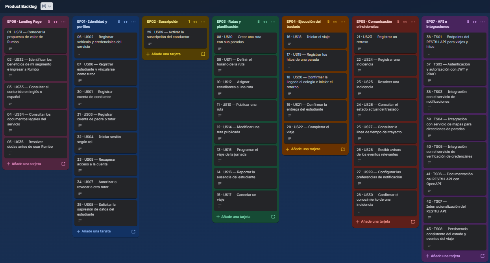

| # Orden | User Story Id | Título | Descripción | Story Points (1 / 2 / 3 / 5 / 8) |
|---:|---|---|---|---:|
| 1 | US31 | Conocer la propuesta de valor de Rumbo | Como visitante, quiero comprender qué es Rumbo y qué problema resuelve para decidir si me resulta relevante. | 2 |
| 2 | US32 | Identificar los beneficios de mi segmento e ingresar a Rumbo | Como visitante, quiero conocer los beneficios correspondientes a mi perfil e ingresar a la experiencia que me corresponde para comenzar a utilizar Rumbo según mis necesidades. | 2 |
| 3 | US33 | Consultar el contenido en inglés o español | Como visitante, quiero consultar el contenido en un idioma disponible para comprenderlo con facilidad. | 1 |
| 4 | US34 | Consultar los documentos legales del servicio | Como visitante, quiero conocer los términos de servicio y la política de privacidad para entender cómo se trata la información. | 1 |
| 5 | US35 | Resolver dudas antes de usar Rumbo | Como visitante, quiero resolver mis dudas o comunicarme con el equipo para decidir si utilizo el servicio. | 2 |
| 6 | US02 | Registrar vehículo y credenciales del servicio | Como conductor, quiero registrar mi vehículo y las credenciales que acreditan mi servicio para que las familias conozcan la información declarada de mi movilidad. | 5 |
| 7 | US06 | Registrar estudiante y vincularse como tutor | Como padre o tutor, quiero registrar a mi hijo y quedar vinculado como su tutor para poder consultar la información de sus traslados. | 5 |
| 8 | US10 | Crear una ruta con sus paradas | Como conductor, quiero crear una ruta con sus paradas en el orden en que las recorro para organizar mi servicio. | 8 |
| 9 | US11 | Definir el horario de la ruta | Como conductor, quiero establecer los días y horarios de una ruta para que sus viajes se programen de forma recurrente. | 3 |
| 10 | US12 | Asignar estudiantes a una ruta | Como conductor, quiero asignar a los estudiantes autorizados a una ruta y a su parada para incluirlos en los recorridos. | 5 |
| 11 | US13 | Publicar una ruta | Como conductor, quiero publicar una ruta configurada para habilitar la programación de sus viajes y su visibilidad para los tutores autorizados. | 3 |
| 12 | US14 | Modificar una ruta publicada | Como conductor, quiero actualizar una ruta publicada para mantenerla alineada con mi operación real. | 5 |
| 13 | US15 | Programar el viaje de la jornada | Como conductor, quiero contar con el viaje del día y la lista de estudiantes prevista para saber a quiénes debo recoger. | 5 |
| 14 | US16 | Reportar la ausencia del estudiante | Como padre o tutor, quiero informar que mi hijo no usará la movilidad para evitar una parada innecesaria. | 5 |
| 15 | US17 | Cancelar un viaje | Como conductor, quiero cancelar un viaje que no se realizará para que las familias no esperen un servicio inexistente. | 3 |
| 16 | US18 | Iniciar el viaje | Como conductor, quiero iniciar el recorrido para que los tutores sepan que la ruta está en ejecución. | 3 |
| 17 | US19 | Registrar los hitos de una parada | Como conductor, quiero confirmar los recojos de cada parada en pocos segundos para dejar constancia sin afectar mi recorrido. | 8 |
| 18 | US20 | Confirmar la llegada al colegio e iniciar el retorno | Como conductor, quiero confirmar la llegada al centro educativo y dar inicio al retorno para diferenciar ambas etapas del servicio. | 3 |
| 19 | US21 | Confirmar la entrega del estudiante | Como conductor, quiero confirmar la entrega de cada estudiante para cerrar su traslado y avisar a su tutor. | 5 |
| 20 | US22 | Completar el viaje | Como conductor, quiero cerrar el viaje para consolidar su resultado y dejarlo disponible como historial. | 3 |
| 21 | US23 | Registrar un retraso | Como conductor, quiero registrar un retraso y su causa para informar con un solo registro a todas las familias afectadas. | 5 |
| 22 | US24 | Registrar una incidencia | Como conductor, quiero registrar una incidencia para comunicar un imprevisto con contexto suficiente y sin repetir el mensaje a cada familia. | 5 |
| 23 | US25 | Resolver una incidencia | Como conductor, quiero marcar una incidencia como resuelta para informar que la situación fue normalizada. | 3 |
| 24 | US26 | Consultar el estado actual del traslado | Como padre o tutor, quiero conocer en pocos segundos la etapa del traslado para evitar preguntarle al conductor. | 5 |
| 25 | US27 | Consultar la línea de tiempo del trayecto | Como padre o tutor, quiero revisar los hitos ocurridos durante el recorrido para entender qué pasó sin revisar conversaciones. | 5 |
| 26 | US28 | Recibir avisos de los eventos relevantes | Como padre o tutor, quiero recibir avisos solo cuando ocurre un evento relevante para mantenerme informado sin revisar la plataforma constantemente. | 8 |
| 27 | US29 | Configurar las preferencias de notificación | Como padre o tutor, quiero elegir qué avisos recibir para no ser saturado con información que no necesito. | 3 |
| 28 | US30 | Confirmar el conocimiento de una incidencia | Como padre o tutor, quiero confirmar que tomé conocimiento de una incidencia para que el conductor sepa que fui informado. | 2 |
| 29 | US09 | Activar la suscripción del conductor | Como conductor, quiero activar una suscripción para habilitar las funcionalidades incluidas en mi plan. | 8 |
| 30 | US01 | Registrar cuenta de conductor | Como conductor, quiero crear mi cuenta para iniciar la configuración de mi servicio en Rumbo. | 3 |
| 31 | US03 | Registrar cuenta de padre o tutor | Como padre o tutor, quiero crear mi cuenta para acceder a la información autorizada de los traslados de mis hijos. | 3 |
| 32 | US04 | Iniciar sesión según rol | Como usuario registrado, quiero iniciar sesión con mis credenciales para acceder a las funcionalidades correspondientes a mi rol. | 3 |
| 33 | US05 | Recuperar acceso a la cuenta | Como usuario registrado, quiero restablecer mi contraseña para recuperar el acceso en caso de olvido. | 3 |
| 34 | US07 | Autorizar o revocar a otro tutor | Como padre o tutor, quiero autorizar o retirar el acceso de otro tutor sobre mi hijo para controlar quién puede consultar su información. | 5 |
| 35 | US08 | Solicitar la supresión de datos del estudiante | Como padre o tutor, quiero solicitar la eliminación de los datos personales de mi hijo para ejercer el control sobre su información. | 5 |
| 36 | TS01 | Endpoints del RESTful API para viajes y hitos | Como Developer, quiero exponer endpoints REST para la gestión de viajes y sus hitos, de modo que la aplicación web pueda registrar y consultar el estado del traslado. | 8 |
| 37 | TS02 | Autenticación y autorización con JWT y RBAC | Como Developer, quiero proteger el RESTful API mediante tokens y control de acceso por rol para que cada usuario acceda únicamente a los recursos autorizados. | 5 |
| 38 | TS03 | Integración con el servicio de notificaciones | Como Developer, quiero integrar un proveedor de mensajería para distribuir los avisos generados por los eventos del viaje. | 5 |
| 39 | TS04 | Integración con servicio de mapas para direcciones de paradas | Como Developer, quiero integrar un servicio externo de mapas para validar y normalizar las direcciones de las paradas de una ruta. | 5 |
| 40 | TS05 | Integración con el servicio de verificación de credenciales | Como Developer, quiero integrar el servicio público de consulta de habilitación para respaldar la verificación de credenciales del conductor. | 5 |
| 41 | TS06 | Documentación del RESTful API con OpenAPI | Como Developer, quiero documentar los endpoints mediante OpenAPI para facilitar su comprensión y prueba por parte del equipo. | 2 |
| 42 | TS07 | Internacionalización del RESTful API | Como Developer, quiero localizar los mensajes del API para en_US y es_419 manteniendo el inglés como idioma predeterminado. | 3 |
| 43 | TS08 | Persistencia consistente del estado y eventos del viaje | Como Developer, quiero persistir el estado del viaje y sus eventos de forma consistente para evitar información parcial durante las operaciones del RESTful API. | 5 |

---

# Capítulo IV: Product Design

## 4.1. Style Guidelines

Las **Style Guidelines de Rumbo** constituyen la referencia visual común para el Landing Page y la Web Application. Su objetivo es mantener consistencia entre los productos digitales mediante un conjunto compartido de decisiones de branding, tipografía, color, espaciado, tono de comunicación, componentes, responsive design, accesibilidad e internacionalización.

La propuesta toma como referencia principios de **Material Design** y los adapta a la identidad de Rumbo. Las decisiones se orientan a transmitir tranquilidad, confianza y claridad, considerando que el producto acompaña actividades relacionadas con el traslado escolar y debe ser comprensible tanto para padres/tutores como para conductores.

### 4.1.1. General Style Guidelines

#### Branding

La identidad visual de **Rumbo** busca proyectar una imagen cercana, segura y confiable. Se evita una apariencia excesivamente tecnológica o alarmista y se priorizan superficies claras, jerarquías simples y una paleta basada en verdes, tonos crema y colores de apoyo suaves.

  
  
<em>Logotipo principal de Rumbo.</em>

El logotipo se utiliza como identificador principal de la marca y debe conservar proporciones, legibilidad y espacio libre alrededor de su contorno. No debe deformarse, rotarse ni colocarse sobre fondos que reduzcan su contraste.

#### Color Palette

La paleta de colores de Rumbo organiza los tonos principales, secundarios y neutros que se utilizarán de manera consistente en el Landing Page y la Web Application. Los verdes refuerzan la identidad visual y las acciones relevantes; los tonos crema y arena ayudan a reducir la carga visual y aportar calidez; y el azul oscuro se reserva para texto, contraste y elementos de alta legibilidad.

  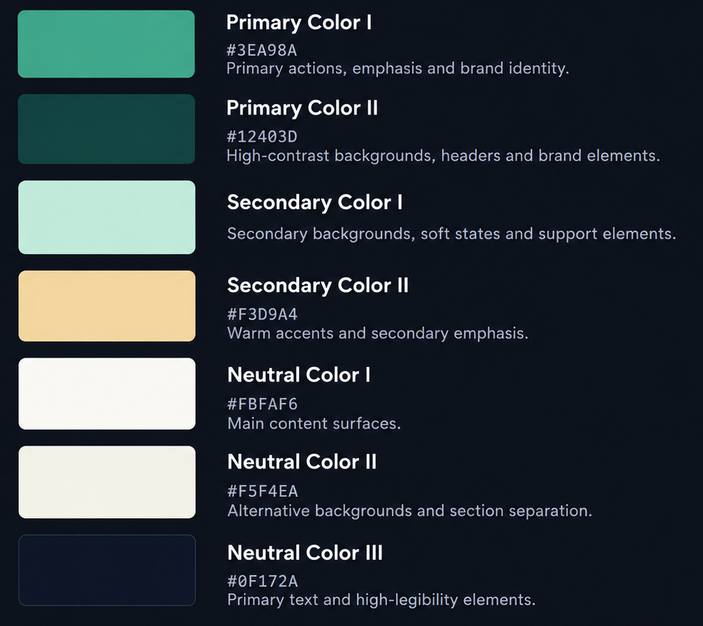
  
<em>Paleta de colores de Rumbo.</em>

#### Typography

Rumbo emplea las familias tipográficas **Outfit** y **Roboto**. La combinación permite diferenciar los contenidos de alta jerarquía de los elementos funcionales y textos de lectura continua.

| Typeface | Aplicación |
|---|---|
| **Outfit** | Títulos principales, encabezados de sección y mensajes de alto impacto. |
| **Roboto** | Párrafos, navegación, botones, etiquetas, formularios y contenido complementario. |

**Outfit** refuerza la personalidad visual en mensajes destacados, mientras que **Roboto** favorece la lectura rápida en componentes funcionales. La jerarquía debe apoyarse también en tamaño, peso y espaciado, evitando depender únicamente del color.

#### Spacing and Shapes

El sistema de espaciado utiliza una escala basada en múltiplos de **4 px**, lo que permite mantener alineación y ritmo visual entre componentes.

| Token | Tamaño | Uso |
|---|---:|---|
| spacing-xs | 4 px | Separación mínima entre elementos estrechamente relacionados. |
| spacing-s | 8 px | Iconos, etiquetas y espacios internos pequeños. |
| spacing-m | 12 px | Padding de controles compactos. |
| spacing-l | 16 px | Separación estándar y margen lateral base en mobile. |
| spacing-xl | 24 px | Padding de tarjetas y agrupaciones principales. |
| spacing-xxl | 32 px | Separación entre bloques importantes en desktop. |
| spacing-3xl | 48 px | Separación estructural entre secciones. |

Las superficies, tarjetas y controles utilizan bordes redondeados de forma consistente con los mock-ups del producto. La forma nunca debe reducir la claridad de los estados interactivos o de los límites entre elementos.

#### Tone of Voice

El tono de Rumbo debe transmitir confianza y tranquilidad, especialmente porque el producto trabaja con información asociada al traslado de menores.

| Dimensión | Posicionamiento | Justificación |
|---|---|---|
| Divertido – Serio | **Serio con cercanía** | La información operativa requiere claridad y responsabilidad. |
| Formal – Casual | **Moderadamente casual** | Se utiliza lenguaje directo y comprensible, evitando tecnicismos innecesarios. |
| Respetuoso – Irreverente | **Respetuoso** | Las comunicaciones deben preservar la confianza entre familias y conductores. |
| Entusiasta – Sereno | **Sereno y positivo** | El producto busca reducir incertidumbre, no generar alarma. |

Los mensajes deben ser breves, accionables y consistentes. En retrasos o incidencias se prioriza información factual y clara; en contenido comercial se comunica el beneficio sin exagerar capacidades que no formen parte del alcance real del producto.

### 4.1.2. Web Style Guidelines

Las interfaces web de Rumbo trasladan las decisiones anteriores a experiencias responsive para Desktop y Mobile Web Browser. La organización visual utiliza contenedores claros, jerarquía tipográfica, tarjetas, botones y estados interactivos consistentes con Material Design y con la identidad establecida.

#### Responsive Layout

En Desktop se aprovecha el espacio horizontal para agrupar información relacionada y facilitar la comparación visual. En tamaños menores, los contenidos se reorganizan en una sola columna o en grupos verticales, conservando el orden de lectura y las acciones principales.

El layout evita anchos rígidos que provoquen desplazamiento horizontal. Los márgenes y separaciones emplean la escala de spacing definida en la sección anterior.

#### Visual Hierarchy

La jerarquía se establece mediante tamaño tipográfico, peso, contraste y espaciado. Los títulos principales utilizan **Outfit**, mientras que contenidos funcionales y de lectura continua utilizan **Roboto**. Las acciones principales se diferencian mediante el verde **#3EA98A**, y el texto se mantiene principalmente sobre superficies claras para preservar legibilidad.

#### Buttons and Call-to-Action

| Tipo | Uso |
|---|---|
| **Primary Button** | Acción principal de una vista o bloque. |
| **Secondary Button** | Acción complementaria que no debe competir visualmente con la principal. |
| **Text Action** | Navegación contextual o acciones de menor prioridad. |

Las etiquetas utilizan verbos o expresiones breves y deben describir el resultado esperado de la acción. Los estados **default, hover, focus, active y disabled** deben distinguirse visualmente; el estado no puede depender exclusivamente del color.

#### Cards and Content Containers

Las tarjetas agrupan información relacionada como beneficios, pasos, estado del traslado, estudiantes o notificaciones. Mantienen superficies claras, padding consistente y una jerarquía interna predecible entre título, contenido, estado y acción.

#### Accessibility and Inclusive Design

Rumbo adopta un enfoque de diseño inclusivo mediante:

- contraste suficiente entre texto y fondo;
- indicadores visibles de focus;
- navegación mediante teclado;
- uso de HTML semántico;
- texto alternativo para imágenes informativas;
- áreas de interacción suficientemente amplias;
- mensajes comprensibles que no dependan solo del color;
- atributos **ARIA** cuando la semántica nativa no sea suficiente.

#### Internationalization

La experiencia contempla **English (en_US)** y **Latin American Spanish (es_419)**, con **English como idioma predeterminado**, de acuerdo con los lineamientos del proyecto. La estructura de los componentes debe tolerar variaciones de longitud entre traducciones sin romper el layout.

  
  
<em>Aplicación de las Web Style Guidelines en el Landing Page para Desktop Web Browser.</em>

### 4.1.3. Mobile Style Guidelines

La versión para **Mobile Web Browser** conserva el mismo Design System y prioriza legibilidad, interacción táctil y navegación sencilla. No se define una identidad distinta para mobile; se adapta la misma jerarquía visual a un espacio reducido.

Las principales decisiones son:

- disposición predominantemente vertical;
- margen lateral base de **16 px**;
- reducción de columnas y agrupación de contenido en tarjetas apiladas;
- acciones principales visibles sin competir con acciones secundarias;
- controles táctiles con áreas de interacción amplias;
- textos y estados legibles sin depender de zoom;
- navegación simplificada y orden de lectura consistente;
- conservación de a11y e i18n en los mismos términos que la experiencia Desktop.

Cuando un componente cambia de disposición entre Desktop y Mobile, debe conservar la misma función, etiqueta y prioridad. La adaptación responsive no debe introducir una ruta de navegación diferente para realizar la misma tarea.

  
  
<em>Aplicación de las Mobile Style Guidelines en el Landing Page para Mobile Web Browser.</em>

## 4.2. Information Architecture

La arquitectura de información de Rumbo define cómo se organizan, etiquetan y conectan los contenidos del Landing Page y de la Web Application. Las decisiones se basan en los User Personas, User Stories e Impact Mapping previamente definidos.

En el Landing Page se utiliza una estructura informativa progresiva: primero se comunica la propuesta de valor, después se presentan beneficios y funcionamiento y, finalmente, se ofrecen acciones de acceso o contacto. En la Web Application la organización cambia según la audiencia: los padres/tutores consultan información del traslado y los conductores administran y registran elementos operativos de su servicio.

### 4.2.1. Organization Systems

Rumbo combina sistemas de organización jerárquicos, secuenciales, cronológicos y por audiencia de acuerdo con la naturaleza de cada contenido.

| Producto / contenido | Sistema | Aplicación |
|---|---|---|
| Landing Page | Jerárquico | Propuesta de valor → beneficios → funcionamiento → funcionalidades → recursos → acción final. |
| How it works | Secuencial | Explica el servicio siguiendo el orden lógico de sus principales etapas. |
| Web Application | Por audiencia | Se diferencian las tareas de Parent/Guardian y Driver. |
| Parent/Guardian Dashboard | Jerárquico | Se prioriza el estado actual del traslado y luego la información complementaria autorizada. |
| Trip Timeline | Cronológico | Los eventos se presentan según su momento de ocurrencia. |
| Driver route management | Jerárquico y orientado a tareas | La ruta, estudiantes y acciones operativas relevantes se presentan según prioridad. |
| Notifications | Cronológico | Los avisos se ordenan por fecha y hora. |

La organización evita duplicar una misma responsabilidad en diferentes áreas. Por ejemplo, los datos de estudiantes y tutores pertenecen a sus funciones de perfil, mientras que rutas, ejecución, incidencias y notificaciones mantienen estructuras diferenciadas.

### 4.2.2. Labeling Systems

El sistema de etiquetado utiliza palabras breves y consistentes con el Ubiquitous Language del proyecto. Debido a que el idioma predeterminado es **en_US**, las etiquetas principales se definen en inglés y cuentan con equivalente **es_419**.

| English (en_US) | Spanish (es_419) | Asociación |
|---|---|---|
| Benefits | Beneficios | Landing Page |
| How it works | Cómo funciona | Landing Page |
| Features | Funcionalidades | Landing Page |
| Resources | Recursos | Landing Page |
| Sign in | Iniciar sesión | Acceso |
| Sign up | Registrarse | Registro |
| Dashboard | Panel principal | Parent/Guardian |
| Trip Status | Estado del traslado | Consulta de viaje |
| Trip Detail | Detalle del traslado | Consulta ampliada |
| Timeline | Línea de tiempo | Eventos del viaje |
| Notifications | Notificaciones | Avisos relevantes |
| Routes | Rutas | Gestión del conductor |
| Students | Estudiantes | Gestión y asignación |
| Confirm Pickup | Confirmar recojo | Ejecución del viaje |
| Confirm Drop-off | Confirmar entrega | Ejecución del viaje |
| Report Delay | Reportar retraso | Gestión de retrasos |
| Report Incident | Reportar incidencia | Gestión de incidencias |
| Terms of Service | Términos del servicio | Información legal |
| Privacy | Privacidad | Tratamiento de datos |

La misma etiqueta debe representar la misma acción en navegación, botones, formularios, mensajes y documentación, evitando sinónimos que puedan confundir al usuario.

### 4.2.3. SEO Tags and Meta Tags

Las principales páginas incluyen como mínimo **Title, Description, Keywords y Author**. Los valores se redactan en inglés debido a que **en_US** es el idioma predeterminado.

#### Landing Page

| Elemento | Valor |
|---|---|
| **Title** | Rumbo - School Transport Coordination and Trip Information |
| **Meta Description** | Rumbo helps families and school transport drivers coordinate routes, trip events, delays and notifications in one place. |
| **Meta Keywords** | school transport, school routes, trip status, parents, drivers, incidents, notifications |
| **Meta Author** | AIpaca OS |

#### Web Application – Sign In

| Elemento | Valor |
|---|---|
| **Title** | Sign In - Rumbo |
| **Meta Description** | Access Rumbo to manage or consult authorized school transport information. |
| **Meta Keywords** | Rumbo sign in, school transport, parents, drivers |
| **Meta Author** | AIpaca OS |

#### Web Application – Parent/Guardian Dashboard

| Elemento | Valor |
|---|---|
| **Title** | Parent Dashboard - Rumbo |
| **Meta Description** | Consult the current trip status, timeline and notifications associated with an authorized student. |
| **Meta Keywords** | school trip status, parent dashboard, trip timeline, school transport notifications |
| **Meta Author** | AIpaca OS |

#### Web Application – Driver Routes

| Elemento | Valor |
|---|---|
| **Title** | Routes - Rumbo |
| **Meta Description** | Manage school transport routes, students, trip events, delays and incidents in Rumbo. |
| **Meta Keywords** | school route, driver, students, pickup, drop-off, delay, incident |
| **Meta Author** | AIpaca OS |

### 4.2.4. Searching Systems

El alcance actual no incorpora un buscador global porque los User Stories priorizados presentan información contextual y acotada para cada usuario. Incluir búsqueda sin un requerimiento que la sustente agregaría complejidad sin valor validado.

| Vista / contenido | Búsqueda o filtro actual | Presentación |
|---|---|---|
| Landing Page | No requiere búsqueda | Navegación directa mediante secciones y enlaces. |
| Parent/Guardian Dashboard | No requiere búsqueda global | Muestra información directamente asociada al usuario autorizado. |
| Trip Timeline | Orden cronológico | Los eventos se muestran dentro del viaje consultado. |
| Driver Routes | Acceso contextual a las rutas del conductor | Las rutas disponibles se presentan como lista o tarjetas. |
| Student List | Listado asociado a una ruta | Los estudiantes se muestran dentro del contexto de la ruta seleccionada. |
| Notifications | Orden cronológico | Los avisos se presentan desde el más reciente al más antiguo. |

Si en una iteración posterior el volumen de rutas, estudiantes, viajes históricos o notificaciones justifica mecanismos de búsqueda o filtrado, éstos deberán incorporarse mediante User Stories específicas antes de agregarse al producto.

### 4.2.5. Navigation Systems

Rumbo utiliza navegación global y contextual en el Landing Page y navegación orientada a tareas en la Web Application. La estructura busca que cada persona llegue a su objetivo mediante rutas cortas y predecibles.

#### Landing Page Navigation

El header permite recorrer las principales secciones del contenido:

**Home → Benefits → How it works → Features → Resources**

Las acciones de acceso se presentan de forma independiente: **Sign in** y **Sign up**.

El footer complementa la navegación con información de la startup, contacto y documentos legales.

#### Parent/Guardian Navigation

Después de autenticarse, el usuario accede a su panel principal y desde allí consulta el traslado y las notificaciones correspondientes a los estudiantes sobre los que mantiene autorización.

Ruta principal: **Sign In → Dashboard → Trip Detail → Trip Timeline**

Ruta complementaria: **Dashboard → Notifications**

La navegación prioriza primero el estado actual y después el detalle histórico o complementario.

#### Driver Navigation

El conductor accede a las funciones operativas del servicio de acuerdo con el contexto de la ruta y el viaje.

Ruta de planificación: **Sign In → Routes → Route Detail → Students / Schedule**

Ruta de ejecución: **Active Trip → Student List → Pickup / Drop-off**

Rutas de excepción: **Active Trip → Report Delay** y **Active Trip → Report Incident**.

Después de registrar un evento, la navegación retorna al contexto del viaje activo para evitar recorridos innecesarios.

La estructura anterior resume la arquitectura de navegación, pero no sustituye los Wireflows y User Flows exigidos en la sección 4.4, los cuales deben elaborarse posteriormente con las herramientas indicadas.

## 4.3. Landing Page UI Design

La propuesta de UI del Landing Page traduce las decisiones de Style Guidelines e Information Architecture a una experiencia responsive para visitantes. La jerarquía visual conduce desde la propuesta de valor hacia beneficios, funcionamiento, funcionalidades y acciones finales, conservando la identidad de Rumbo y diferenciando claramente contenido informativo de elementos interactivos.

La adaptación Desktop/Mobile mantiene el mismo orden semántico, las mismas etiquetas y el mismo Design System. En pantallas pequeñas los bloques se apilan y la navegación se simplifica sin alterar la prioridad del contenido. El diseño considera legibilidad, contraste, navegación por teclado, textos alternativos y áreas de interacción adecuadas como parte del enfoque inclusivo.

### 4.3.1. Landing Page Wireframe

Los wireframes fueron elaborados para **Desktop Web Browser** y **Mobile Web Browser** con el objetivo de validar estructura, jerarquía y organización antes de aplicar estilos finales.

En Desktop, la distribución aprovecha el ancho disponible para organizar contenidos relacionados y facilitar la exploración progresiva. En Mobile, los mismos bloques se reorganizan verticalmente y preservan el orden lógico de lectura. En ambos casos, la ubicación de las acciones principales responde a la arquitectura de información descrita previamente.

  
  
<em>Wireframe del Landing Page para Desktop Web Browser.</em>

  
  
<em>Wireframe del Landing Page para Mobile Web Browser.</em>

Los wireframes priorizan una lectura clara, agrupaciones comprensibles y navegación predecible. El enfoque inclusivo se refleja en la ausencia de dependencias exclusivas del color, la estructura lineal de contenido en mobile y la reserva de espacios suficientemente amplios para controles interactivos.

### 4.3.2. Landing Page Mock-up

Los mock-ups aplican el Design System definido en 4.1 sobre la estructura validada en los wireframes. Se utiliza la paleta verde, crema y arena de Rumbo, junto con **Outfit** para títulos y **Roboto** para contenidos funcionales y de lectura continua.

El Desktop Mock-up conserva una jerarquía amplia y permite presentar agrupaciones de contenido en más de una columna cuando existe espacio suficiente. El Mobile Mock-up transforma esas agrupaciones en bloques verticales, manteniendo las mismas asociaciones, etiquetas y prioridad de acciones.

  
  
<em>Mock-up del Landing Page para Desktop Web Browser.</em>

  
  
<em>Mock-up del Landing Page para Mobile Web Browser.</em>

La propuesta conserva consistencia con la arquitectura de información y con los principios de diseño inclusivo: contraste suficiente, jerarquía tipográfica, textos comprensibles, acciones claramente diferenciadas y adaptación responsive sin pérdida de contenido o funcionalidad.

## 4.4. Web Applications UX/UI Design

El diseño de la Web Application considera dos experiencias principales: **padres/tutores** y **conductores**. En ambos casos se prioriza la información del trayecto, pero las acciones disponibles cambian según el rol. Los padres consultan; los conductores registran eventos de la ruta con la menor cantidad posible de pasos.

### 4.4.1. Web Applications Wireframes

Los wireframes se definieron a partir de las tareas centrales de cada segmento.

| Rol | Vista | Contenido principal |
|---|---|---|
| Padre/Tutor | Sign In | Correo, contraseña y recuperación de acceso. |
| Padre/Tutor | Dashboard | Estado actual, estudiante, conductor, vehículo y ETA. |
| Padre/Tutor | Trip Detail | Mapa o progreso de ruta y datos del trayecto. |
| Padre/Tutor | Trip Timeline | Recojo, retrasos, incidencias y llegada en orden cronológico. |
| Padre/Tutor | Notifications | Avisos relevantes asociados al estudiante. |
| Conductor | Sign In | Acceso seguro al panel de ruta. |
| Conductor | Assigned Route | Ruta activa, horario, paradas y estudiantes asignados. |
| Conductor | Student List | Estado de recojo o entrega de cada estudiante. |
| Conductor | Register Event | Confirmación rápida de recojo, llegada o entrega. |
| Conductor | Report Incident | Tipo de incidencia, descripción breve y registro del evento. |

La prioridad del wireframe es que la vista principal responda rápidamente a dos preguntas: **“¿qué está pasando en el trayecto?”** para la familia y **“¿qué debo registrar ahora?”** para el conductor.

### 4.4.2. Web Applications Wireflow Diagrams

Los Wireflow Diagrams de Rumbo representan los principales recorridos de interacción de la Web Application a partir de los **User Goals** de los segmentos **Parent** y **Driver**. Cada flujo conecta estados de interfaz consecutivos para evidenciar cómo una persona avanza desde una vista inicial hasta completar una meta concreta.

Los wireflows mantienen trazabilidad con los User Stories, la Information Architecture y los mock-ups definidos para la aplicación. Para evitar diagramas redundantes, se agrupan las acciones relacionadas bajo siete User Goals representativos del alcance funcional.

#### User Goal 1 — Access parent dashboard

**User Persona:** Parent  
**User Goal:** Acceder al panel principal y visualizar la información del traslado escolar actual.  
**Explicación del flujo:** El Parent selecciona su experiencia en la pantalla de acceso, ingresa sus credenciales y, después de autenticarse correctamente, accede al Panel principal con la información más reciente del viaje activo.

  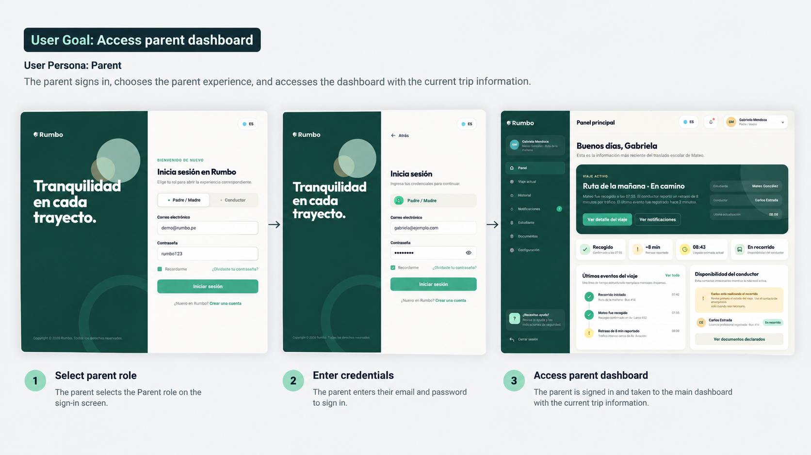

#### User Goal 2 — Consult current trip status

**User Persona:** Parent  
**User Goal:** Consultar el estado actual del traslado y revisar la secuencia de eventos del viaje.  
**Explicación del flujo:** Desde el Panel principal, el Parent abre el detalle del viaje activo y puede profundizar en la línea de tiempo para comprender los eventos registrados durante el recorrido.

  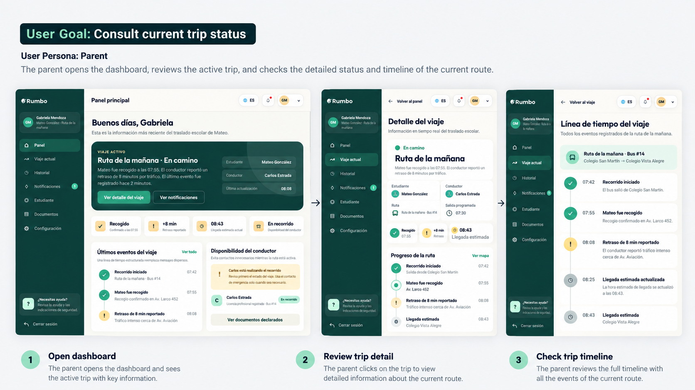

#### User Goal 3 — Review important notifications

**User Persona:** Parent  
**User Goal:** Revisar avisos relevantes asociados al traslado escolar.  
**Explicación del flujo:** El Parent accede desde el Panel principal al centro de notificaciones, revisa las actualizaciones recientes y abre el detalle de un aviso relevante para conocer su contexto y estado.

  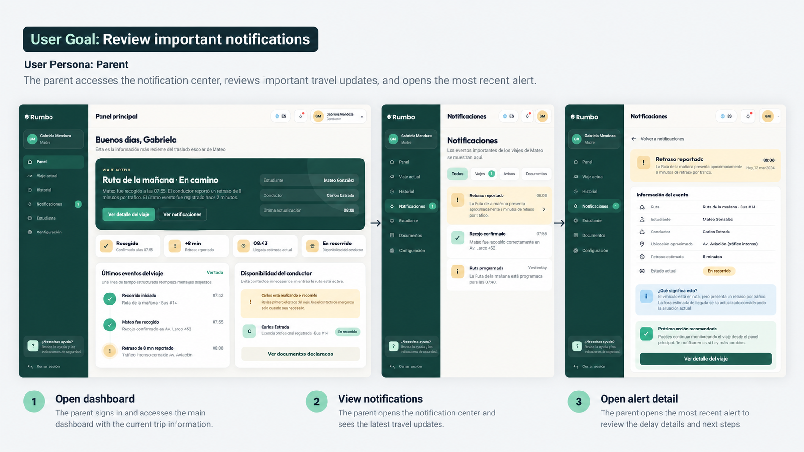

#### User Goal 4 — Start and execute a route

**User Persona:** Driver  
**User Goal:** Iniciar la ruta asignada y continuar con la ejecución del recorrido.  
**Explicación del flujo:** El Driver abre su ruta asignada, inicia el recorrido y accede a la lista de estudiantes para continuar registrando los hitos operativos de recojo y entrega.

  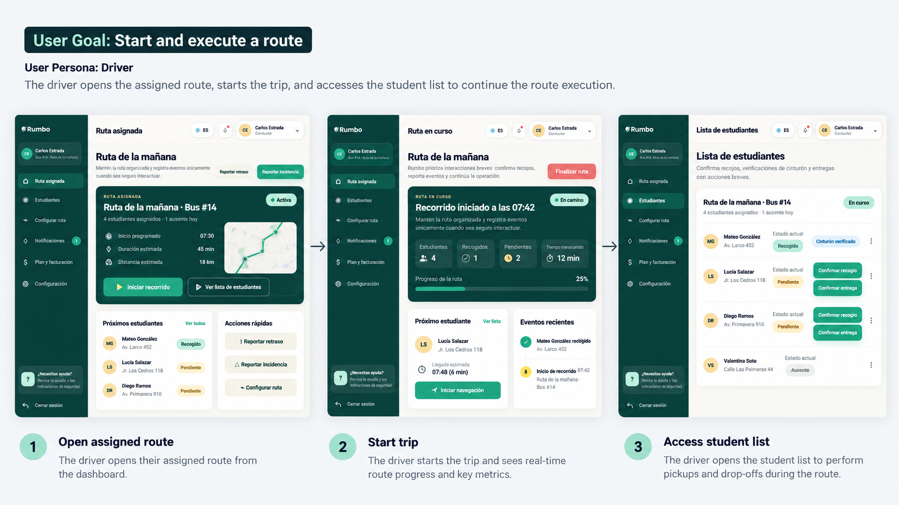

#### User Goal 5 — Configure route and stops

**User Persona:** Driver  
**User Goal:** Configurar la ruta, el orden de las paradas y las vinculaciones necesarias para el servicio.  
**Explicación del flujo:** El Driver parte de la ruta asignada, ingresa a la configuración, ajusta el orden de paradas y guarda los cambios para que la planificación quede disponible en los siguientes recorridos.

  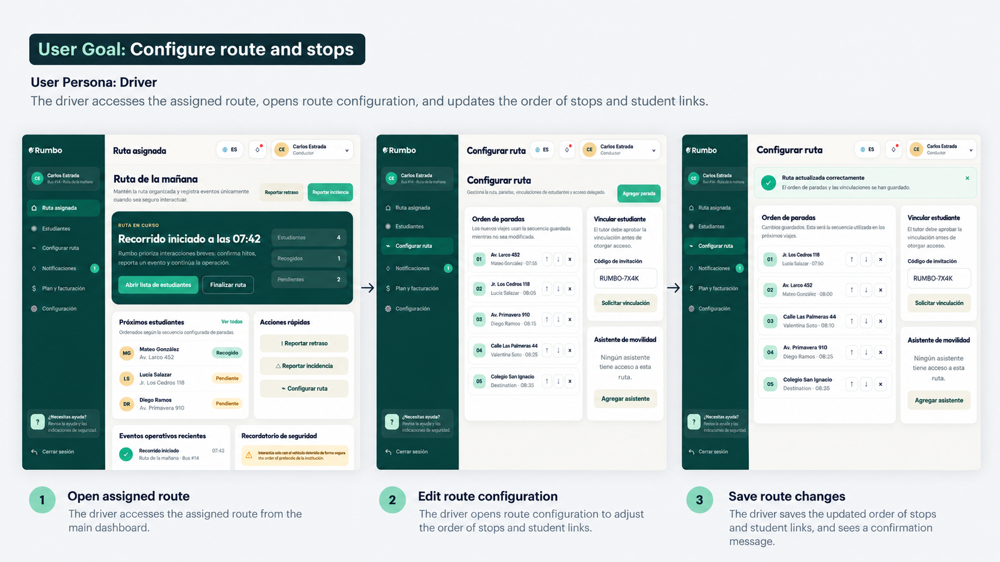

#### User Goal 6 — Monitor operational notifications

**User Persona:** Driver  
**User Goal:** Revisar notificaciones operativas relacionadas con la ruta.  
**Explicación del flujo:** Desde la ruta asignada, el Driver accede al centro de notificaciones, consulta las actualizaciones recientes y marca los avisos revisados para mantener control sobre los eventos informados.

  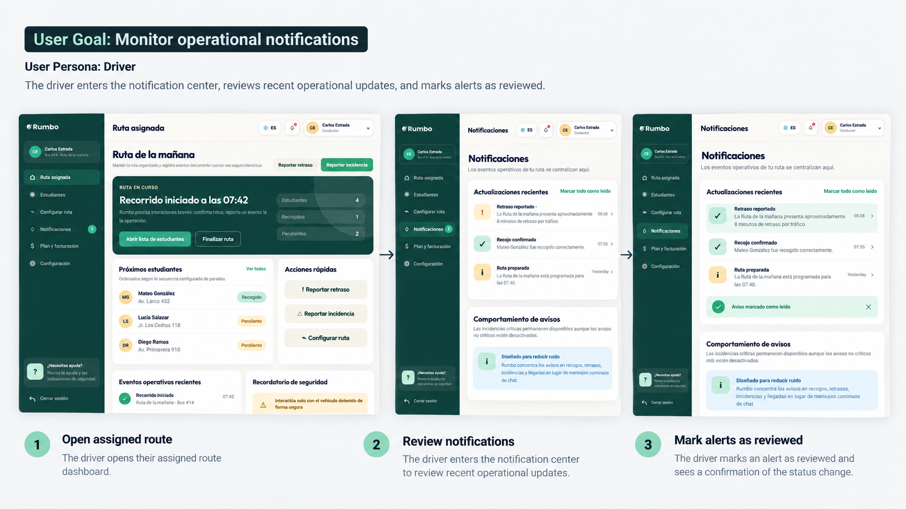

#### User Goal 7 — Manage account and billing

**User Persona:** Driver  
**User Goal:** Consultar la configuración de la cuenta y el estado de la suscripción.  
**Explicación del flujo:** El Driver accede a Configuración para revisar su información de perfil y vehículo y, desde las opciones de cuenta, consulta el resumen de Plan y facturación correspondiente al servicio.

  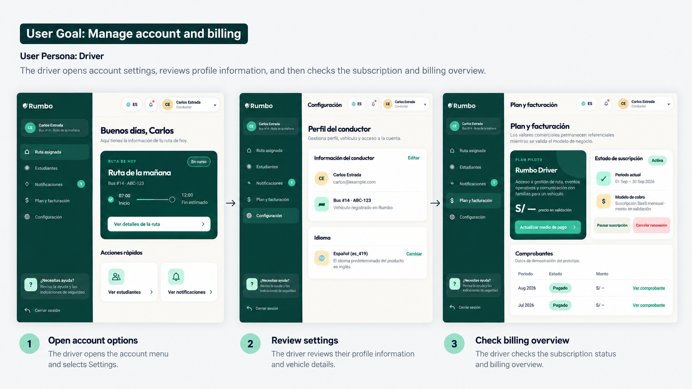

### 4.4.3. Web Applications Mock-ups

Los mock-ups de la Web Application de **Rumbo** aplican el Design System definido previamente y muestran cómo se materializan las principales funcionalidades para los segmentos **Parent** y **Driver**. Las vistas mantienen una estructura consistente de navegación lateral, tarjetas, estados, acciones principales, tipografía y paleta visual. A continuación se presenta cada pantalla junto con una breve descripción de su propósito dentro de la experiencia.

#### Sign In

La pantalla de inicio de sesión funciona como punto de acceso común a la Web Application. Permite seleccionar la experiencia correspondiente, ingresar las credenciales y acceder a las funcionalidades asociadas al rol del usuario.

  

#### Driver — Assigned Route

La vista **Ruta asignada** concentra la información operativa principal del Driver. Presenta el estado del recorrido, los estudiantes asociados y accesos rápidos para reportar retrasos, incidencias o continuar con las acciones de la ruta.

  

#### Driver — Student List

La **Lista de estudiantes** permite al Driver revisar los estudiantes asociados a la ruta y registrar acciones breves como confirmar recojo o entrega. Los estados visuales permiten distinguir rápidamente estudiantes recogidos, pendientes o ausentes.

  

#### Driver — Route Configuration

La pantalla **Configurar ruta** permite administrar el orden de las paradas y las vinculaciones relacionadas con el servicio. La organización en bloques mantiene separadas las tareas de planificación de las acciones propias de la ejecución del viaje.

  

#### Driver — Notifications

El centro de **Notificaciones** reúne los principales eventos operativos asociados a la ruta. La vista prioriza retrasos, confirmaciones y actualizaciones recientes para que el Driver pueda revisar información relevante sin depender de mensajes dispersos.

  

#### Driver — Plan and Billing

La vista **Plan y facturación** presenta el estado de la suscripción, el periodo actual, los comprobantes disponibles y las acciones relacionadas con la gestión del plan. Esta pantalla concentra la información comercial sin mezclarla con las tareas operativas de la ruta.

  

#### Driver — Settings

La sección **Configuración** permite al Driver revisar su información personal, los datos del vehículo y las preferencias de idioma. La vista utiliza la misma jerarquía de tarjetas que el resto de la aplicación para mantener consistencia visual.

  

#### Parent — Dashboard

El **Panel principal** del Parent resume la información más reciente del traslado escolar. Presenta el estado del viaje activo, los últimos eventos registrados, el Driver asociado y accesos directos al detalle del viaje y a las notificaciones.

  

#### Parent — Current Trip

La vista **Viaje actual** amplía el estado del recorrido y organiza los principales eventos en una línea de tiempo. Su objetivo es permitir que el Parent comprenda rápidamente qué ha ocurrido durante el viaje y cuál es el estado registrado más reciente.

  

#### Parent — Trip History

El **Historial de viajes** permite consultar recorridos anteriores y revisar información resumida como fecha, conductor, número de eventos y estado del viaje. La presentación tabular facilita comparar registros sin sobrecargar la vista principal.

  

#### Parent — Notifications

La sección **Notificaciones** centraliza los avisos relacionados con el traslado del estudiante. Los eventos recientes se presentan de forma cronológica y con indicadores visuales para diferenciar confirmaciones, retrasos y actualizaciones operativas.

  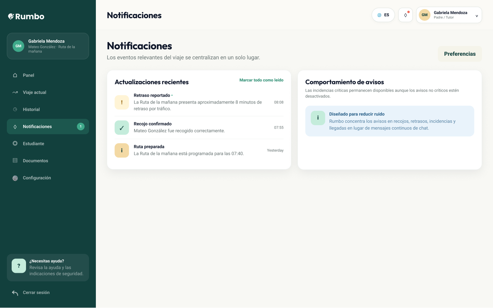

#### Parent — Student Profile

El **Perfil del estudiante** presenta los datos principales del estudiante y la información necesaria para comprender su asociación con el servicio. La vista también permite acceder a información complementaria relacionada con el traslado.

  

#### Parent — Driver and Vehicle Documents

La vista **Documentos del conductor y vehículo** permite al Parent consultar la información declarada del servicio, como licencia, registro del vehículo y seguro. Esta información se presenta como referencia dentro de la experiencia y evita mezclar documentos con el seguimiento operativo del viaje.

  

#### Parent — Settings

La sección **Configuración** del Parent reúne preferencias de notificaciones e información de la cuenta. Los controles permiten activar o desactivar avisos sin alterar el resto de la experiencia y mantienen visible la configuración de idioma del producto.

  

### 4.4.4. Web Applications User Flow Diagrams

Los **User Flow Diagrams** de Rumbo representan las rutas esperadas para completar los principales objetivos de los segmentos **Parent** y **Driver**. A diferencia de los Wireflows, estos diagramas incorporan los mock-ups finales de las vistas y muestran tanto el **happy path** como rutas alternativas relevantes, manteniendo consistencia con los User Goals definidos previamente.

#### User Flow 1 — Access Parent Dashboard

**User Persona:** Parent  
**User Goal:** Access the main dashboard and review the latest school trip information.  
**Flow Description:** The Parent selects the Parent experience, signs in successfully, and reaches the main dashboard with the active trip overview. If the credentials are invalid, the system shows an error and allows a new attempt.

  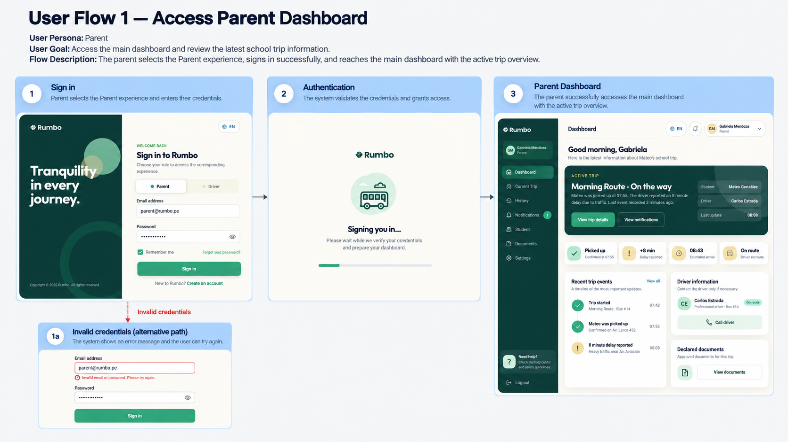

#### User Flow 2 — Consult Current Trip Status

**User Persona:** Parent  
**User Goal:** Consult the current trip status and review the trip timeline.  
**Flow Description:** The Parent opens the dashboard, accesses the current trip detail, and reviews the chronological sequence of route events. The alternative path represents the case in which the trip has already been completed.

  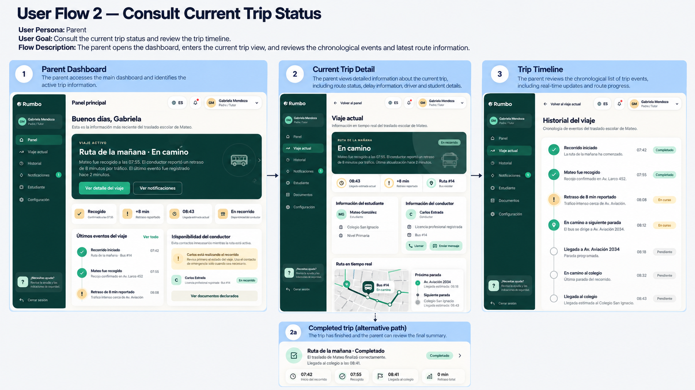

#### User Flow 3 — Review Important Notifications

**User Persona:** Parent  
**User Goal:** Review relevant notifications related to the school trip.  
**Flow Description:** The Parent accesses the notification center, reviews recent alerts, and opens the detail of a relevant event. When there are no unread notifications, the interface displays an informative empty state.

  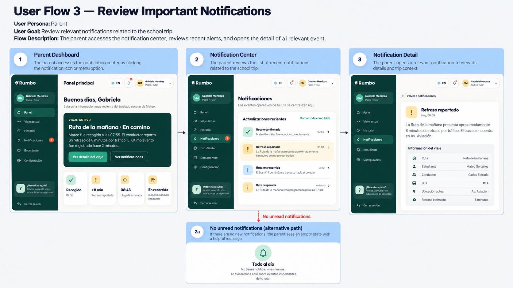

#### User Flow 4 — Start and Execute a Route

**User Persona:** Driver  
**User Goal:** Start the assigned route and continue the execution of the trip.  
**Flow Description:** The Driver opens the assigned route, starts the trip, and continues the route through the student list to register operational milestones. The alternative path covers the reporting of a delay while the route remains active.

  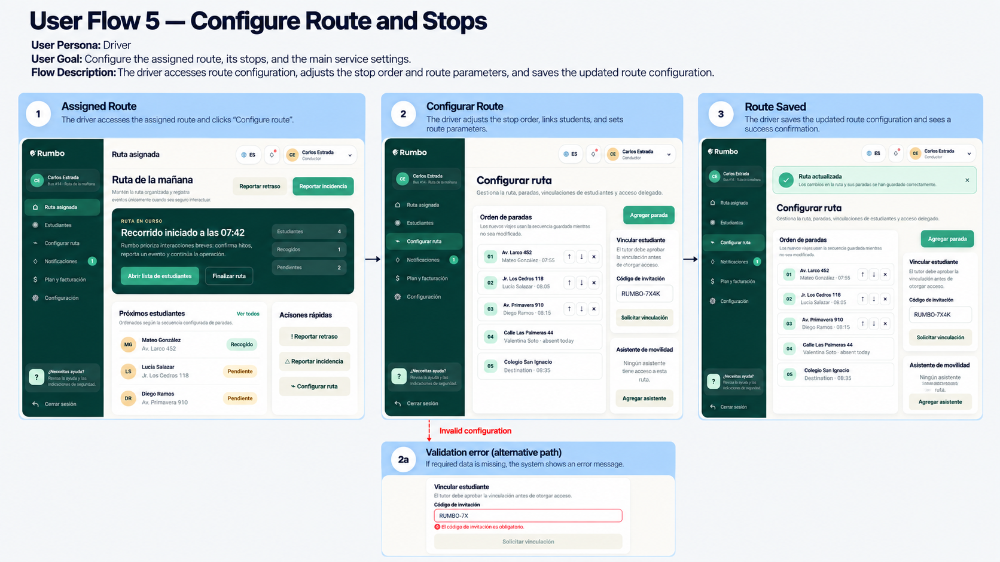

#### User Flow 5 — Configure Route and Stops

**User Persona:** Driver  
**User Goal:** Configure the assigned route, its stops, and the main service settings.  
**Flow Description:** The Driver accesses the route configuration, adjusts the stop order and student links, and saves the updated configuration. If required information is missing or invalid, the system shows a validation error before allowing the operation to continue.

  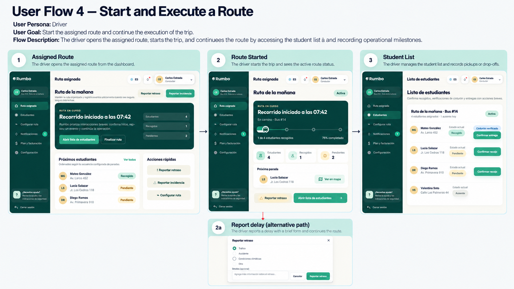

#### User Flow 6 — Monitor Operational Notifications

**User Persona:** Driver  
**User Goal:** Review operational notifications associated with the route.  
**Flow Description:** The Driver opens the notification center, reviews the latest operational updates, opens an alert and marks it as reviewed when appropriate. If there are no recent updates, the system presents an empty state instead of an unnecessary list.

  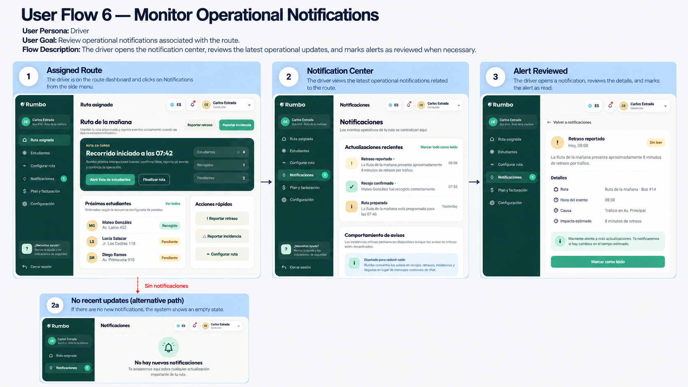

#### User Flow 7 — Manage Account and Billing

**User Persona:** Driver  
**User Goal:** Review profile settings and subscription information.  
**Flow Description:** The Driver accesses the account settings, reviews profile and vehicle information, and then checks the subscription and billing overview. The alternative path illustrates a paused subscription state that can later be reactivated.

  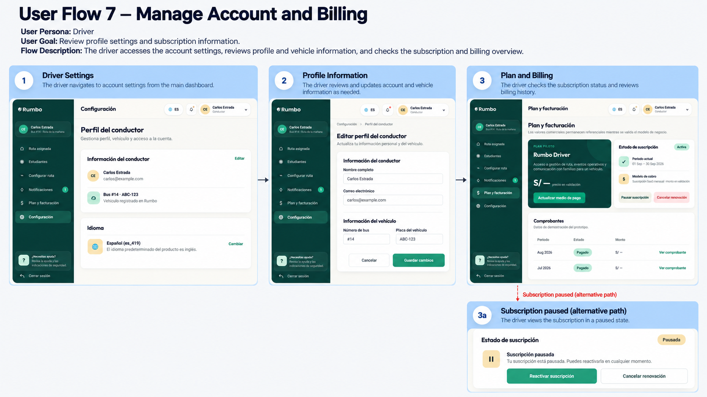

## 4.5. Web Applications Prototyping

El prototipo de la Web Application de **Rumbo** integra los principales mock-ups de los segmentos **Parent** y **Driver** en una navegación coherente con los Wireflows y User Flow Diagrams definidos previamente. La propuesta permite validar la continuidad entre pantallas, la ubicación de las acciones principales y la consistencia del sistema de navegación antes de la implementación final.

  

## 4.6. Domain-Driven Software Architecture

### 4.6.1. Design-Level Event Storming

El **Design-Level Event Storming** de Rumbo refina el Big Picture Event Storming desarrollado previamente y organiza el dominio con mayor nivel de detalle. En esta etapa se identifican **Actors, Commands, Aggregates, Domain Events, Business Policies, Read Models y Hotspots**, manteniendo trazabilidad con los User Stories y con el Ubiquitous Language del proyecto.

Para evitar depender de un tablero externo adicional, esta versión se documenta mediante **Diagram-as-Code con Mermaid**, opción permitida para artefactos de EventStorming. El refinamiento mantiene los **ocho Bounded Contexts** definidos en el Capítulo II como alcance objetivo del producto.

| Bounded Context | Responsabilidad principal |
|---|---|
| **Identity & Access Management** | Gestionar cuentas, autenticación, verificación de correo y recuperación de acceso. |
| **Profiles & Relationship Management** | Gestionar perfiles de Parent, Driver y Student, además de las relaciones de autorización sobre cada estudiante. |
| **Vehicle & Credential Management** | Gestionar vehículos, credenciales declaradas y el estado registrado de su verificación. |
| **Route & Trip Planning** | Gestionar rutas, paradas, horarios, asignaciones, ausencias, publicación y programación de viajes. |
| **Trip Execution & Monitoring** | Registrar el inicio y desarrollo del viaje, recojos, entregas, etapas, estado y línea de tiempo. |
| **Incident & Delay Management** | Gestionar retrasos, incidencias, actualizaciones, resolución y confirmación de conocimiento. |
| **Notification Management** | Gestionar generación, distribución, lectura, fallos de entrega y preferencias de notificación. |
| **Subscriptions & Billing** | Gestionar la activación y el estado de la suscripción del Driver y la información del plan asociada. |

#### Refinamiento por Bounded Context

| Bounded Context | Actors | Commands principales | Aggregates | Domain Events principales | Policies / reglas | Read Models | Hotspots |
|---|---|---|---|---|---|---|---|
| **Identity & Access Management** | Parent, Driver | Register Account, Verify Email, Sign In, Recover Access | Account | Account Registered, Email Verified, Session Started, Access Recovery Requested | El acceso funcional requiere una cuenta válida y, cuando corresponda, correo verificado. | Account Access Status | Correo duplicado, token expirado, credenciales inválidas. |
| **Profiles & Relationship Management** | Parent, Driver | Create Profile, Register Student, Update Profile, Authorize Parent, Revoke Parent | Profile, Student Relationship | Profile Created, Student Registered, Profile Updated, Parent Authorized, Parent Revoked | Solo un Parent autorizado puede consultar información del Student. | Student Profile, Authorized Parents | Acceso sin autorización, relación duplicada, solicitud de supresión con viaje activo. |
| **Vehicle & Credential Management** | Driver | Register Vehicle, Update Vehicle, Register Credential, Update Credential Status | Vehicle, Credential Record | Vehicle Registered, Vehicle Updated, Credential Submitted, Credential Status Updated | Una placa activa no puede quedar asociada a dos Drivers; una credencial no se declara verificada sin una fuente válida. | Vehicle & Credential Status | Placa duplicada, servicio externo de verificación no disponible, credencial vencida. |
| **Route & Trip Planning** | Driver, Parent | Create Route, Add Stop, Reorder Stops, Define Schedule, Assign Student, Publish Route, Update Route, Report Absence, Schedule Trip, Cancel Trip | Route, Trip Schedule | Route Created, Stop Added, Stops Reordered, Schedule Defined, Student Assigned, Route Published, Absence Reported, Trip Scheduled, Trip Cancelled | Una ruta no se publica sin paradas y horario; las ausencias se excluyen del roster del día; los cambios posteriores no alteran un viaje ya iniciado. | Route Detail, Daily Trip Roster | Dirección no localizable, capacidad insuficiente, asignación duplicada. |
| **Trip Execution & Monitoring** | Driver, Parent | Start Trip, Confirm Pickup, Confirm School Arrival, Start Return, Confirm Drop-off, Complete Trip, View Current Status, View Timeline | Active Trip | Trip Started, Student Picked Up, School Arrival Confirmed, Return Started, Student Dropped Off, Trip Completed | Los hitos se registran sobre un viaje activo y deben conservar una secuencia temporal consistente. | Current Trip Status, Trip Timeline | Evento duplicado, pérdida de conectividad, evento fuera de secuencia. |
| **Incident & Delay Management** | Driver, Parent | Report Delay, Update Delay, Report Incident, Resolve Incident, Acknowledge Incident | Operational Issue | Delay Reported, Delay Updated, Incident Reported, Incident Resolved, Incident Acknowledged | Una incidencia mantiene su historial; el conocimiento del Parent se registra sin modificar el evento original. | Open Issues, Incident Acknowledgement Status | Incidente duplicado, resolución prematura, Parent no autorizado. |
| **Notification Management** | Parent, Driver, System | Generate Notification, Dispatch Notification, Mark Notification as Read, Update Preferences | Notification, Notification Preference | Notification Created, Notification Sent, Notification Delivery Failed, Notification Read, Preferences Updated | Solo se notifican destinatarios autorizados; los reintentos no deben duplicar el mismo aviso. | Notification Inbox, Delivery Status | Proveedor no disponible, aviso duplicado, preferencia incompatible con evento crítico. |
| **Subscriptions & Billing** | Driver | Activate Subscription | Subscription | Subscription Activated, Subscription Activation Rejected | Un Driver no debe generar una activación duplicada para el mismo plan vigente. | Subscription Status, Available Plan | El detalle de pagos, renovaciones y comprobantes queda sujeto a futuras User Stories si se amplía el alcance comercial. |

#### Flujo consolidado de eventos del dominio

El siguiente diagrama resume cómo los eventos relevantes atraviesan los Bounded Contexts sin mezclar sus responsabilidades. Cada contexto conserva sus propios Aggregates y reglas, pero publica información que otros contextos pueden utilizar.

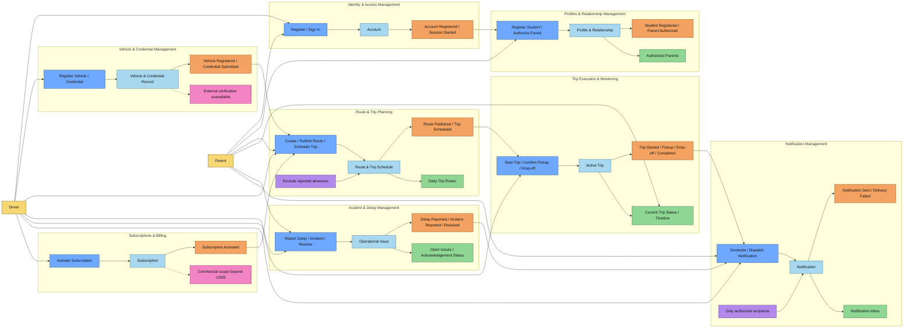
```mermaid
flowchart LR
    classDef actor fill:#F7D774,stroke:#7A5B00,color:#111;
    classDef command fill:#6FA8FF,stroke:#1D4E89,color:#111;
    classDef aggregate fill:#A7D8F0,stroke:#2D6E8B,color:#111;
    classDef event fill:#F4A261,stroke:#8A4B08,color:#111;
    classDef policy fill:#B388EB,stroke:#5B2C83,color:#111;
    classDef readmodel fill:#8FD694,stroke:#2D6A34,color:#111;
    classDef hotspot fill:#F284C4,stroke:#8A235E,color:#111;

    P[Parent]:::actor
    D[Driver]:::actor

    subgraph IAM["Identity & Access Management"]
      C1[Register / Sign In]:::command --> A1[Account]:::aggregate --> E1[Account Registered / Session Started]:::event
    end

    subgraph PRM["Profiles & Relationship Management"]
      C2[Register Student / Authorize Parent]:::command --> A2[Profile & Relationship]:::aggregate --> E2[Student Registered / Parent Authorized]:::event
      R2[Authorized Parents]:::readmodel
      A2 --> R2
    end

    subgraph VCM["Vehicle & Credential Management"]
      C3[Register Vehicle / Credential]:::command --> A3[Vehicle & Credential Record]:::aggregate --> E3[Vehicle Registered / Credential Submitted]:::event
      H3[External verification unavailable]:::hotspot
      A3 -.-> H3
    end

    subgraph RTP["Route & Trip Planning"]
      C4[Create / Publish Route / Schedule Trip]:::command --> A4[Route & Trip Schedule]:::aggregate --> E4[Route Published / Trip Scheduled]:::event
      P4[Exclude reported absences]:::policy
      R4[Daily Trip Roster]:::readmodel
      P4 --> A4 --> R4
    end

    subgraph TEM["Trip Execution & Monitoring"]
      C5[Start Trip / Confirm Pickup / Drop-off]:::command --> A5[Active Trip]:::aggregate --> E5[Trip Started / Pickup / Drop-off / Completed]:::event
      R5[Current Trip Status / Timeline]:::readmodel
      A5 --> R5
    end

    subgraph IDM["Incident & Delay Management"]
      C6[Report Delay / Incident / Resolve]:::command --> A6[Operational Issue]:::aggregate --> E6[Delay Reported / Incident Reported / Resolved]:::event
      R6[Open Issues / Acknowledgement Status]:::readmodel
      A6 --> R6
    end

    subgraph NM["Notification Management"]
      C7[Generate / Dispatch Notification]:::command --> A7[Notification]:::aggregate --> E7[Notification Sent / Delivery Failed]:::event
      P7[Only authorized recipients]:::policy
      R7[Notification Inbox]:::readmodel
      P7 --> A7 --> R7
    end

    subgraph SB["Subscriptions & Billing"]
      C8[Activate Subscription]:::command --> A8[Subscription]:::aggregate --> E8[Subscription Activated]:::event
      H8[Commercial scope beyond US09]:::hotspot
      A8 -.-> H8
    end

    P --> C1
    D --> C1
    P --> C2
    D --> C3
    D --> C4
    P --> C4
    D --> C5
    P --> R5
    D --> C6
    P --> C6
    P --> C7
    D --> C7
    D --> C8

    E1 --> C2
    E3 --> C4
    E4 --> C5
    E5 --> C7
    E6 --> C7
    E8 --> C4
```

El refinamiento evidencia que el núcleo operativo de Rumbo se concentra en **Route & Trip Planning** y **Trip Execution & Monitoring**, mientras que identidad, perfiles, vehículos, incidencias, notificaciones y suscripciones actúan como capacidades de soporte o habilitación. Esta delimitación mantiene las responsabilidades separadas y sirve como base para los diagramas C4, los Class Diagrams y los Database Diagrams de las siguientes secciones.

### 4.6.2. Software Architecture Context Diagram

El **Software Architecture Context Diagram** presenta a Rumbo como un único sistema de software y resume sus relaciones principales con las personas y servicios externos que participan en la solución. Esta vista permite comprender el límite general de la plataforma antes de detallar sus unidades de despliegue e implementación.

  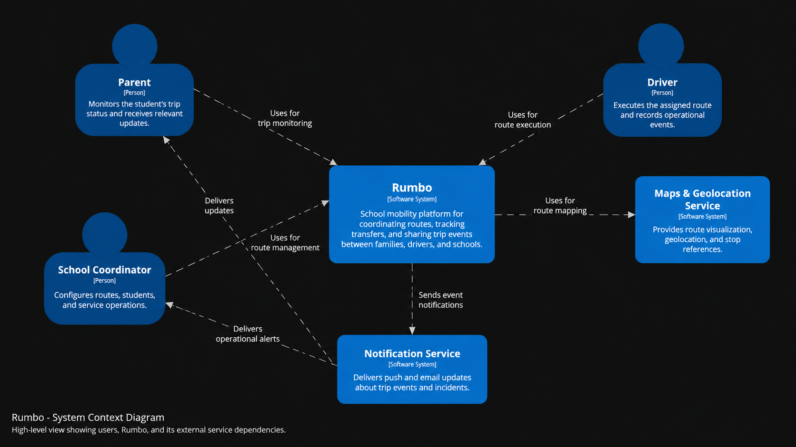

### 4.6.3. Software Architecture Container Diagrams

El **Container Diagram** describe la arquitectura objetivo de Rumbo a nivel de unidades de despliegue. Se distinguen el Landing Page, la Web Application desarrollada con Angular, el RESTful API previsto en Spring Boot y la capa de persistencia, además de las dependencias externas requeridas por la solución. Para Sprint 2, el Frontend Web Application trabaja con Angular y una fuente de datos simulada; la integración completa con el backend corresponde a los siguientes Sprints.

  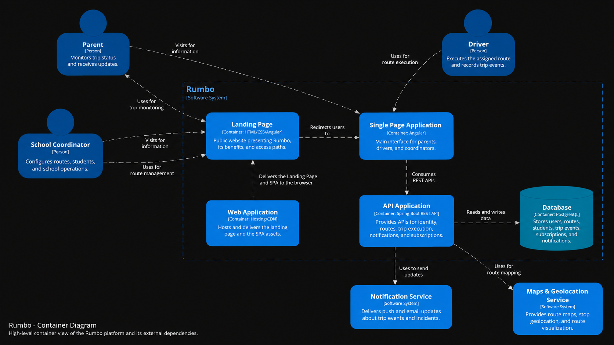

### 4.6.4. Software Architecture Components Diagrams

Los **Component Diagrams** descomponen el contenedor de aplicación en componentes asociados a los Bounded Contexts identificados para Rumbo. Cada diagrama muestra responsabilidades, servicios, controladores, repositorios y dependencias necesarias para mantener separadas las capacidades del dominio.

#### Identity & Access Management

Este diagrama representa los componentes responsables de cuentas, autenticación, autorización y recuperación de acceso. El contexto mantiene separadas las responsabilidades de identidad respecto de perfiles, vehículos y operaciones del servicio.

  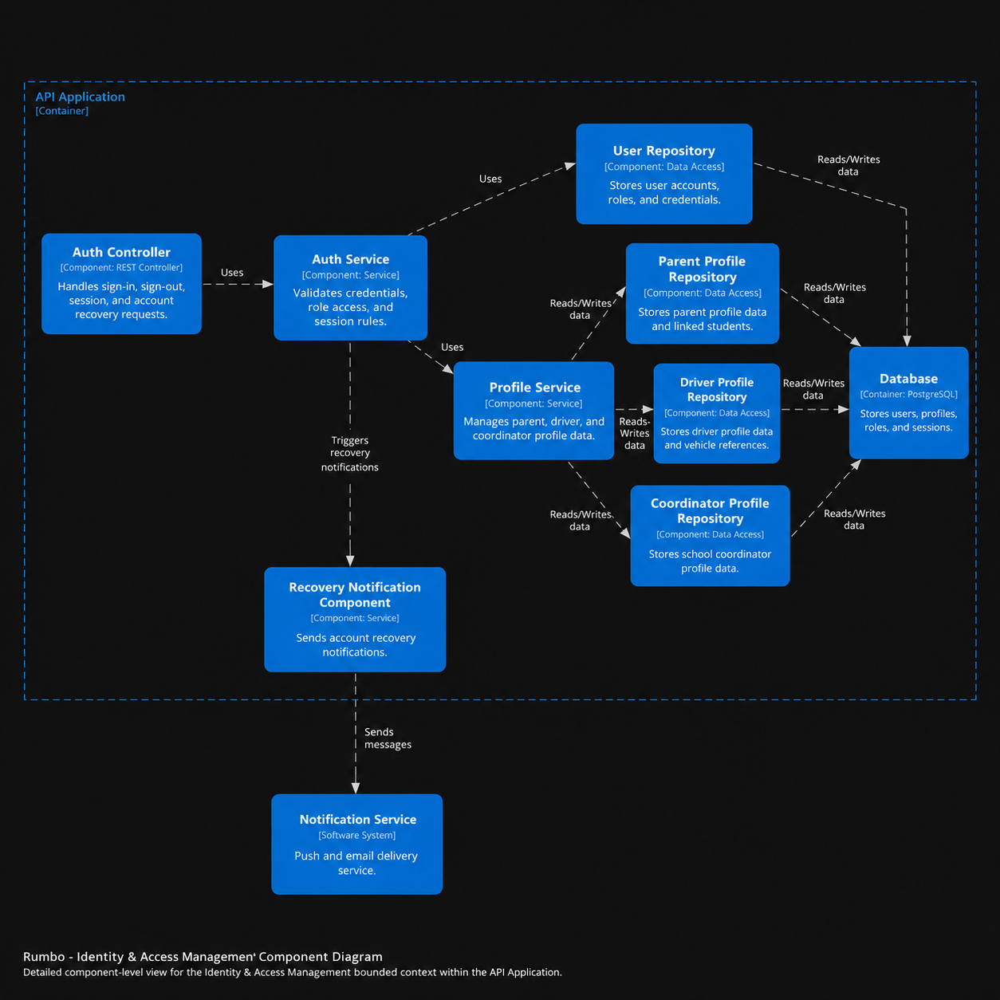

#### Profiles & Relationship Management

Este contexto concentra la gestión de perfiles de Parent, Driver y Student, junto con las relaciones de autorización que determinan quién puede consultar la información de cada estudiante.

  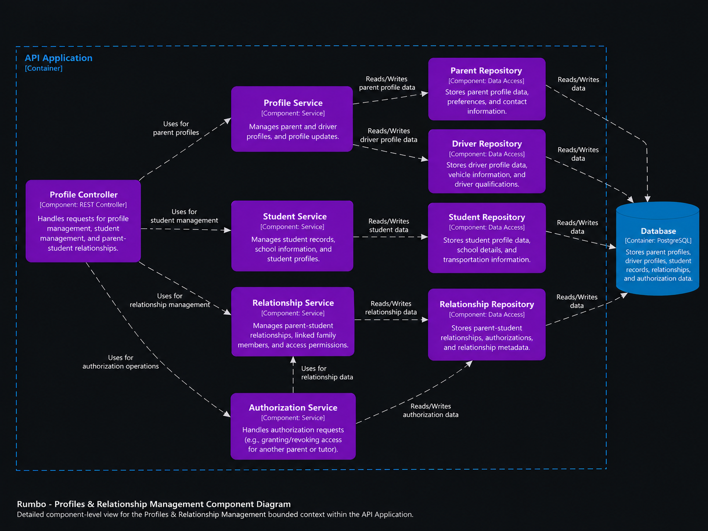

#### Vehicle & Credential Management

El diagrama separa el registro y mantenimiento del vehículo de la gestión de credenciales declaradas por el Driver. Los componentes permiten conservar la información del vehículo y el estado de los documentos asociados sin mezclarla con la planificación de rutas.

  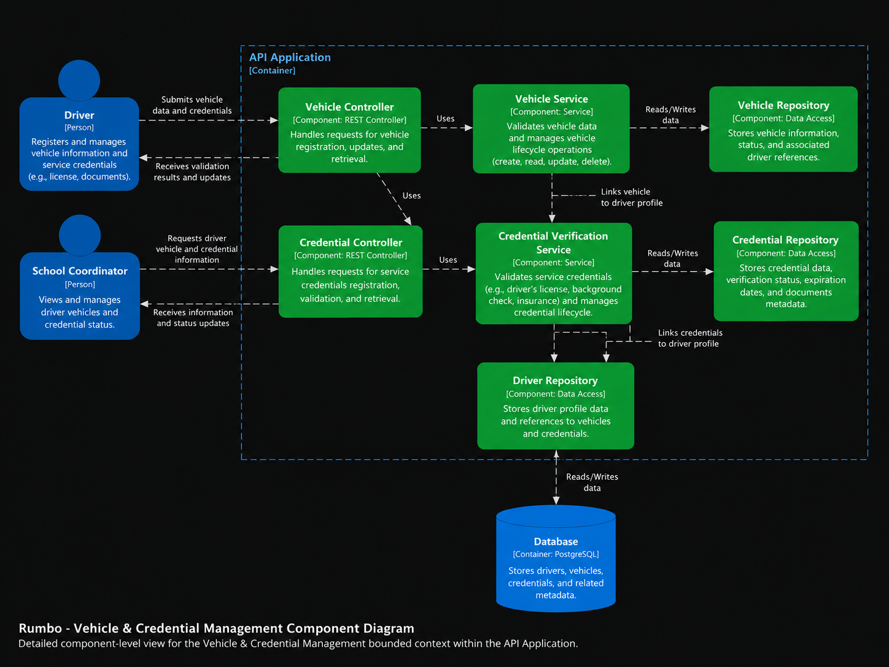

#### Route & Trip Planning

Este diagrama representa los componentes encargados de rutas, paradas, secuencia de recorrido, asignaciones de estudiantes y planificación de viajes. El contexto prepara la información que posteriormente utiliza la ejecución del traslado.

  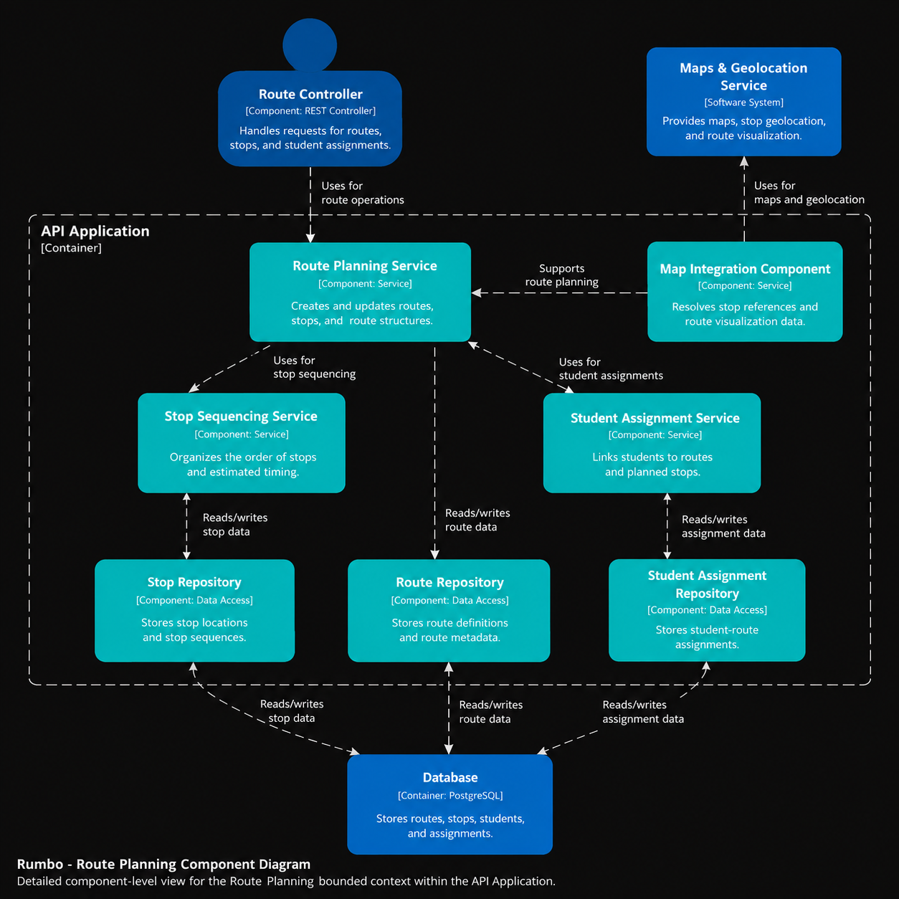

#### Trip Execution & Monitoring

El contexto de ejecución coordina el inicio y desarrollo de un viaje, los eventos operativos y los estados de recojo y entrega. La información registrada alimenta la vista del viaje y su línea de tiempo.

  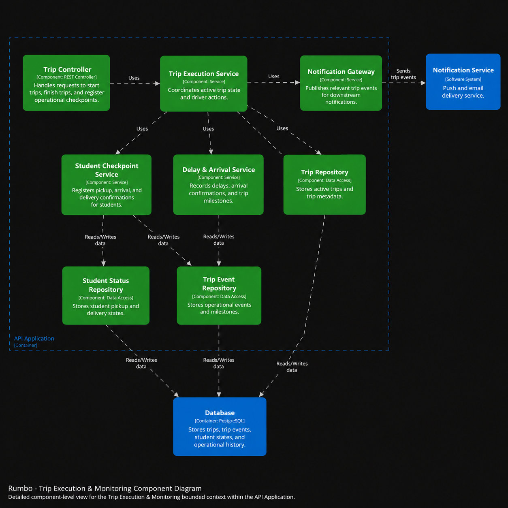

#### Incident & Delay Management

Este diagrama concentra el registro y actualización de retrasos e incidencias ocurridos durante el servicio. Sus componentes mantienen el estado de cada evento y permiten comunicar los cambios relevantes al contexto de notificaciones.

  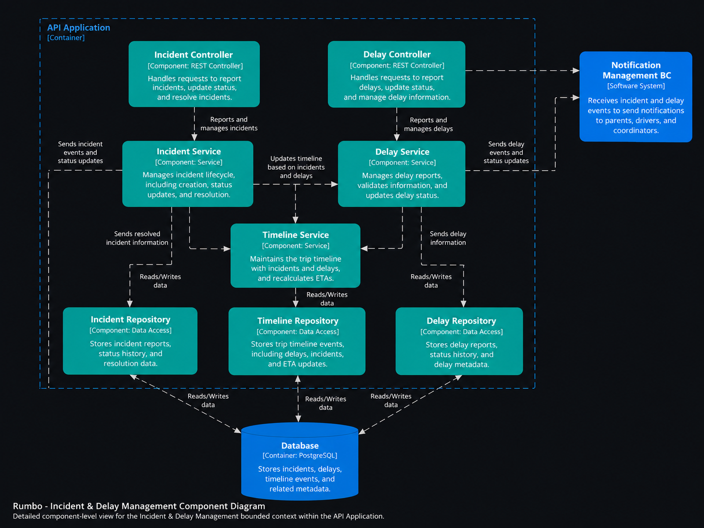

#### Notification Management

El contexto de notificaciones administra la generación, persistencia, preferencias y distribución de avisos relacionados con eventos relevantes del traslado. Se mantiene separado de Incident & Delay Management para evitar mezclar el evento de negocio con su mecanismo de comunicación.

  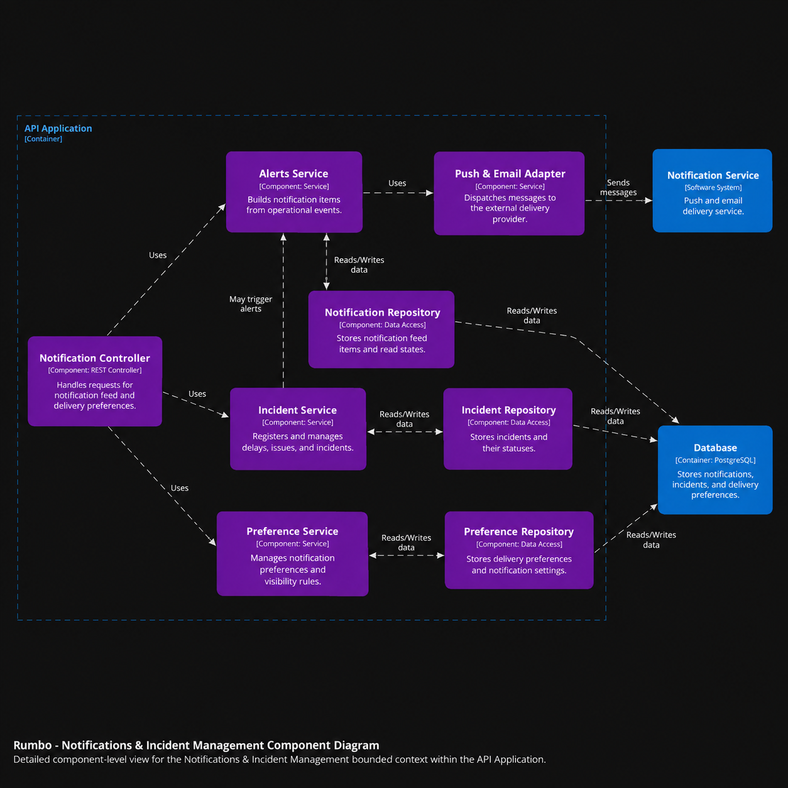

#### Subscriptions & Billing

Este diagrama representa la gestión del plan y de la suscripción del Driver dentro de la arquitectura objetivo. El contexto encapsula la información comercial para que no interfiera con las responsabilidades operativas de rutas y viajes.

  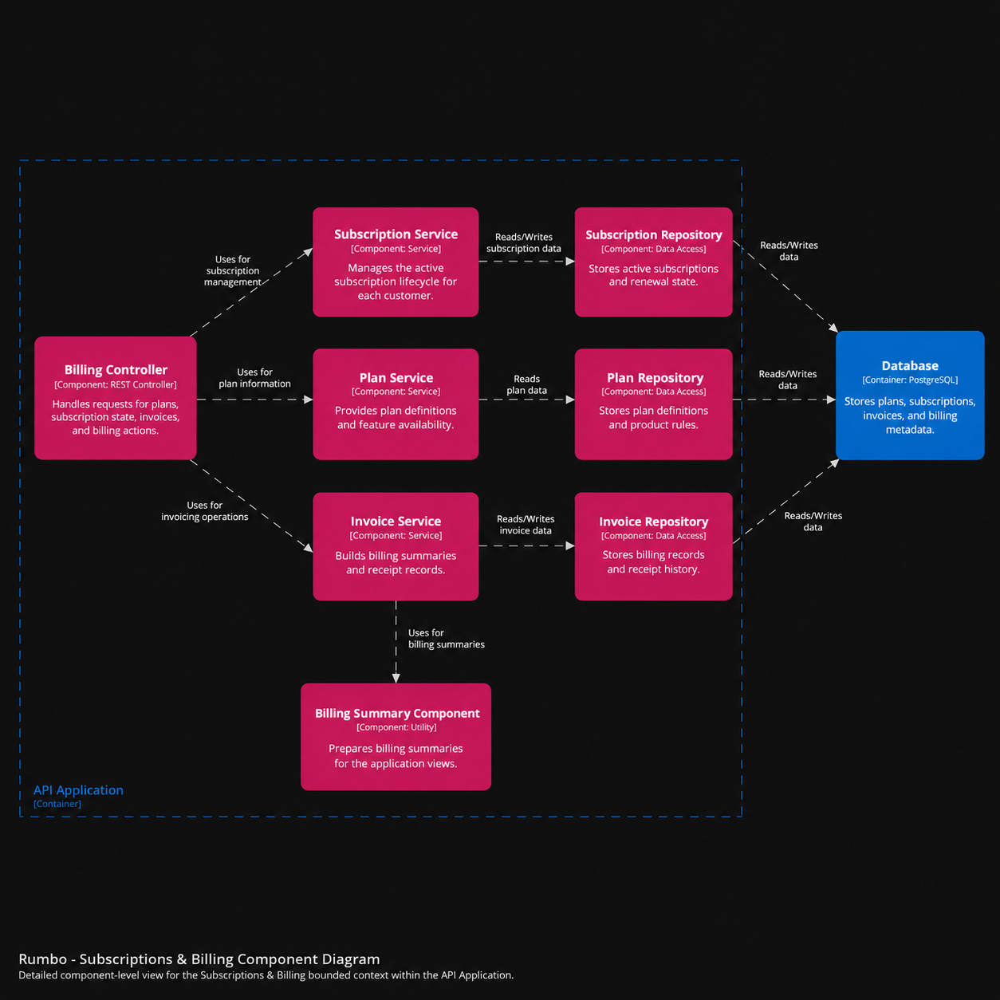

## 4.7. Software Object-Oriented Design

Esta sección presenta el diseño orientado a objetos de **Rumbo** a partir de los Bounded Contexts refinados en la sección 4.6. El objetivo es describir con mayor detalle las clases principales, sus atributos y operaciones, así como las relaciones y multiplicidades que permiten representar las responsabilidades de cada parte del dominio.

Los diagramas UML se organizan según los **ocho Bounded Contexts** definidos para la arquitectura objetivo. Cuando una clase perteneciente a otro contexto aparece dentro de un diagrama, se utiliza únicamente como **referencia para expresar una asociación** y no implica que el contexto que la consume sea propietario de dicha entidad.

### 4.7.1. Class Diagrams

Los Class Diagrams incluyen clases y enumeraciones relevantes, atributos, métodos, visibilidad, asociaciones y multiplicidades. Esta separación mantiene trazabilidad con el Design-Level Event Storming y con los Component Diagrams de la sección 4.6.4.

#### Identity & Access Management

El diagrama modela las responsabilidades relacionadas con cuentas, sesiones, tokens, recuperación de acceso, roles y permisos. De esta forma, la autenticación y autorización permanecen separadas de los datos operativos de perfiles, rutas y viajes.

  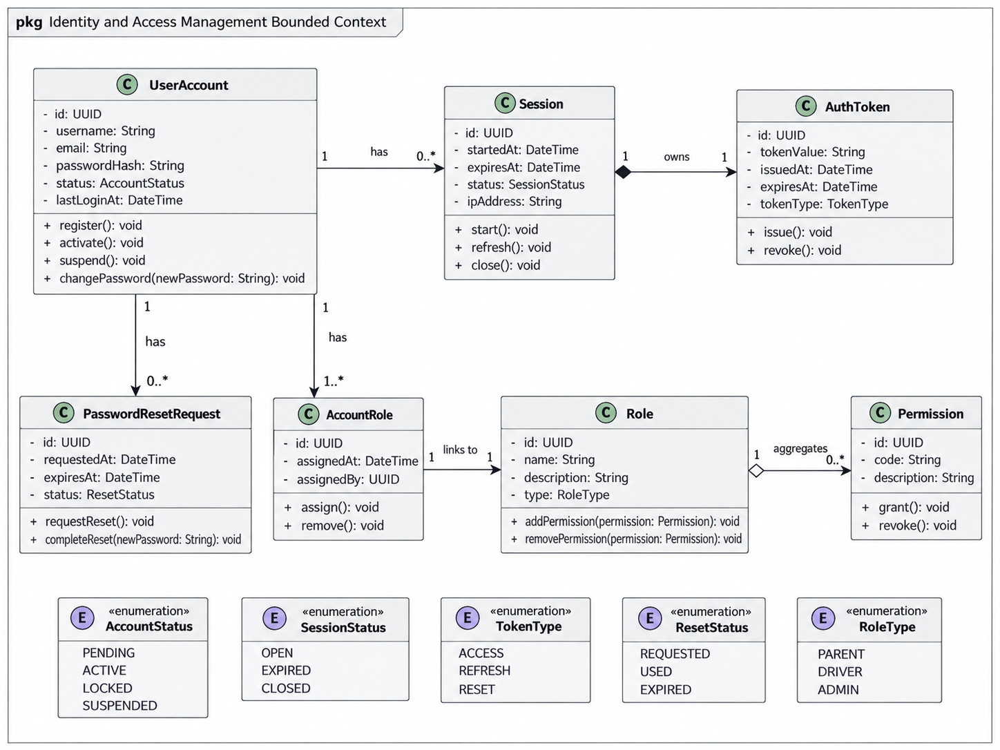

#### Profiles & Relationship Management

Este contexto representa los perfiles utilizados por Rumbo y las relaciones de autorización vinculadas al estudiante. Su responsabilidad principal es mantener la información de Parent, Driver y Student y determinar qué relaciones permiten consultar la información del estudiante. Las referencias a credenciales o vehículos se interpretan como vínculos hacia sus contextos propietarios.

  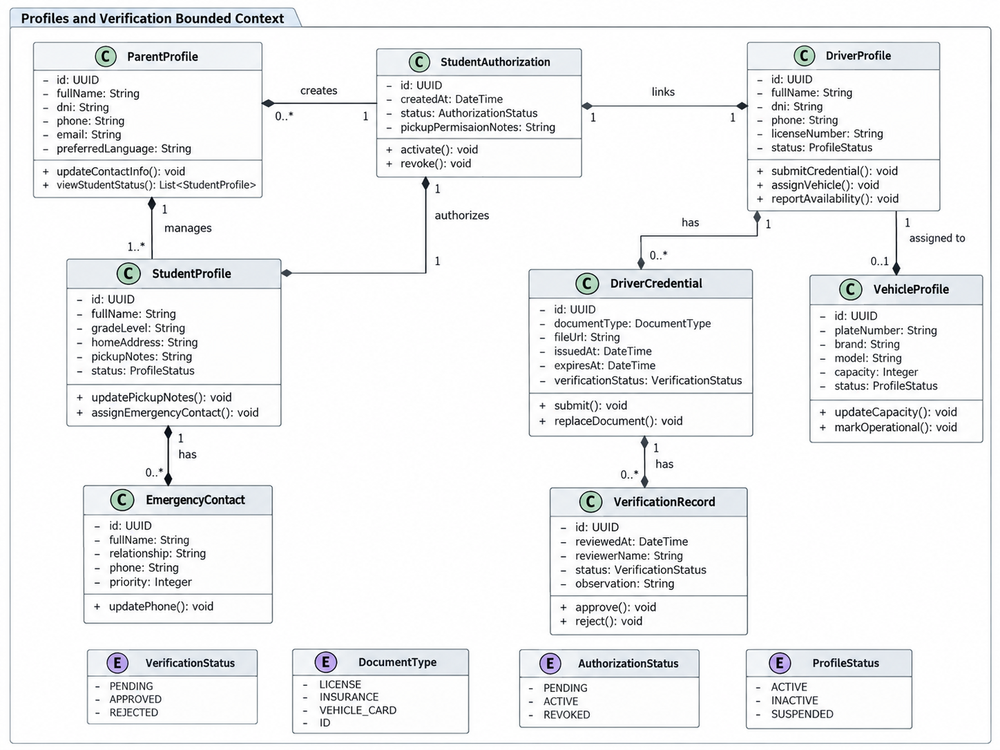

#### Vehicle & Credential Management

El diagrama representa la información del vehículo y los registros asociados a su operación y documentación. Este contexto concentra la responsabilidad de los datos del vehículo y de las credenciales declaradas por el Driver, evitando que Route & Trip Planning administre directamente dicha información.

  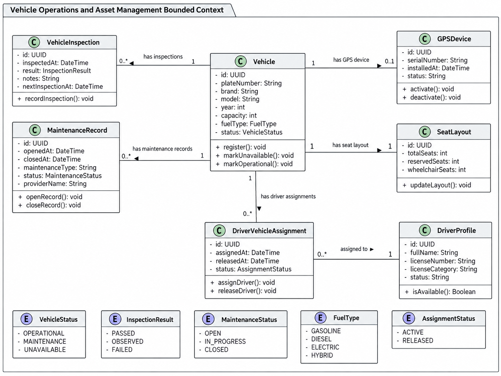

#### Route & Trip Planning

Este contexto modela rutas, paradas, horarios y asignaciones necesarias antes de iniciar un traslado. Las asociaciones con Student y Driver permiten expresar qué participantes intervienen en la planificación, mientras que sus perfiles completos continúan perteneciendo a sus respectivos Bounded Contexts.

  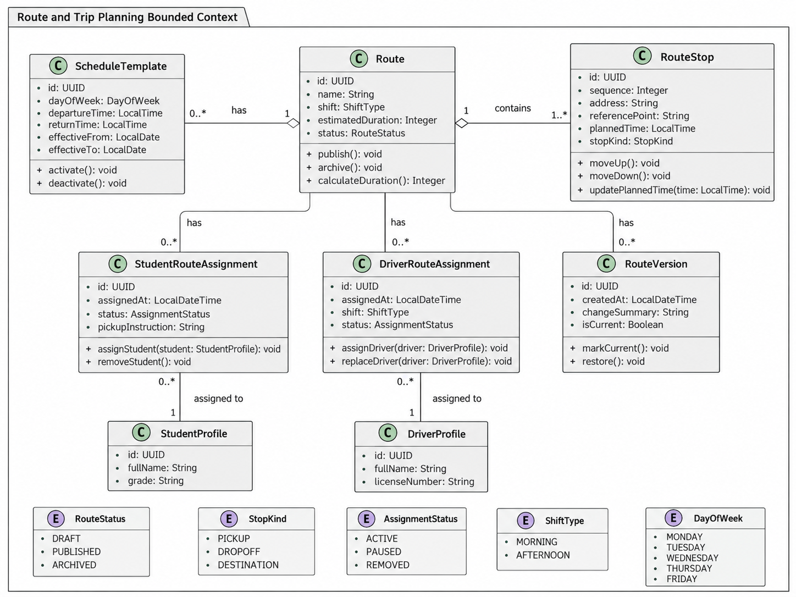

#### Trip Execution & Monitoring

El diagrama describe el viaje en ejecución y los registros que permiten conocer su evolución: eventos, hitos, recojos, entregas y línea de tiempo. La arquitectura de Rumbo prioriza el seguimiento mediante estados y eventos del recorrido; cualquier dato de ubicación representado se considera complementario y no modifica la separación de responsabilidades definida para el dominio.

  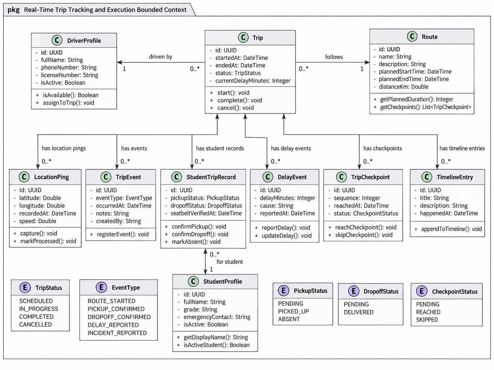

#### Incident & Delay Management

Este contexto concentra el registro y seguimiento de retrasos e incidencias vinculados a un viaje. Las clases relacionadas con evidencias, notas o elementos afectados permiten conservar el contexto del evento y su evolución hasta su resolución sin mezclar esta responsabilidad con la distribución de notificaciones.

  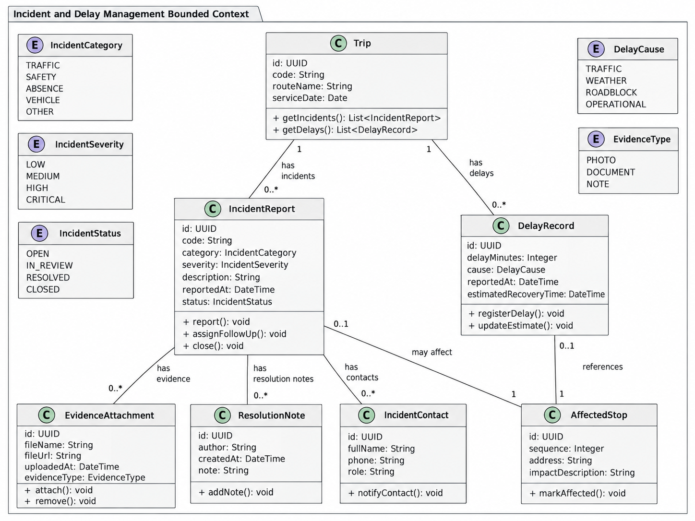

#### Notification Management

El diagrama representa la creación y entrega de avisos, las preferencias del usuario y los canales utilizados para distribuirlos. Los eventos de retraso, incidencia, recojo o entrega funcionan como información de entrada, mientras que este contexto se responsabiliza únicamente de convertirlos en comunicaciones hacia los destinatarios correspondientes.

  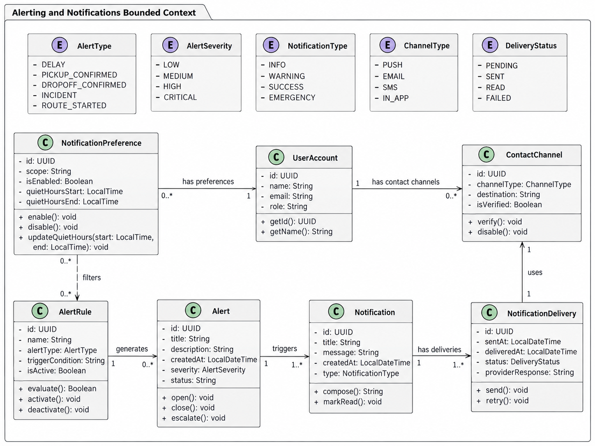

#### Subscriptions & Billing

Este contexto representa la relación entre el Driver, el plan y el estado de su suscripción. Los elementos comerciales incluidos en el modelo se consideran parte de la arquitectura objetivo; para el alcance actual, la funcionalidad prioritaria continúa siendo la activación y consulta del estado de la suscripción definida en los requisitos.

  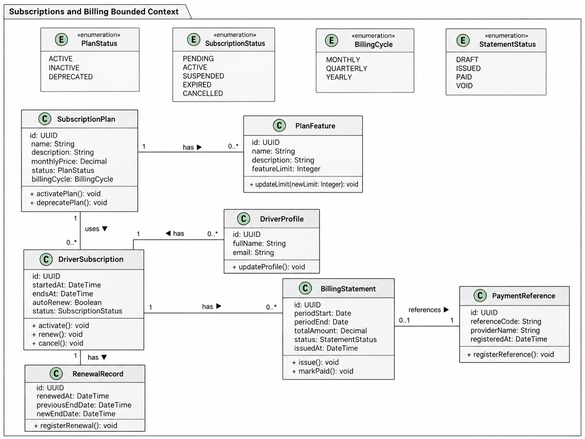

En conjunto, los ocho Class Diagrams mantienen la separación establecida en el diseño de dominio y sirven como referencia para los Database Diagrams de la siguiente sección. El modelado se utiliza como diseño de la arquitectura objetivo y no implica que todos los componentes de backend se encuentren implementados durante Sprint 2.

## 4.8. Database Design

El diseño de persistencia de **Rumbo** mantiene la misma separación establecida en el modelado DDD y en los Class Diagrams. Cada Database Diagram representa las principales tablas, columnas, claves primarias, claves foráneas y relaciones necesarias para persistir la información administrada por su Bounded Context.

Los diagramas corresponden a la **arquitectura objetivo** del producto. Por ello, algunas tablas representan capacidades previstas para etapas posteriores y no implican que todo el backend se encuentre implementado durante Sprint 2.

### 4.8.1. Database Diagrams

#### Identity & Access Management

Este esquema concentra la persistencia de cuentas, sesiones, recuperación de acceso, roles y permisos. Las tablas de relación permiten separar la identidad del usuario de las capacidades que puede ejecutar dentro de la plataforma.

  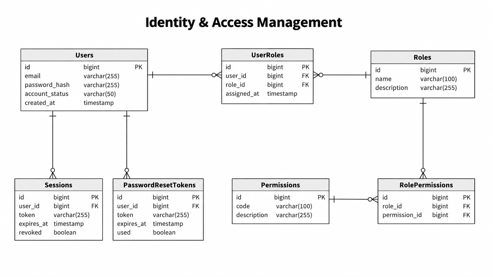

#### Profiles & Relationship Management

El esquema almacena los perfiles de Parent, Driver y Student, junto con las relaciones de autorización y datos complementarios necesarios para representar quién puede consultar la información de cada estudiante.

  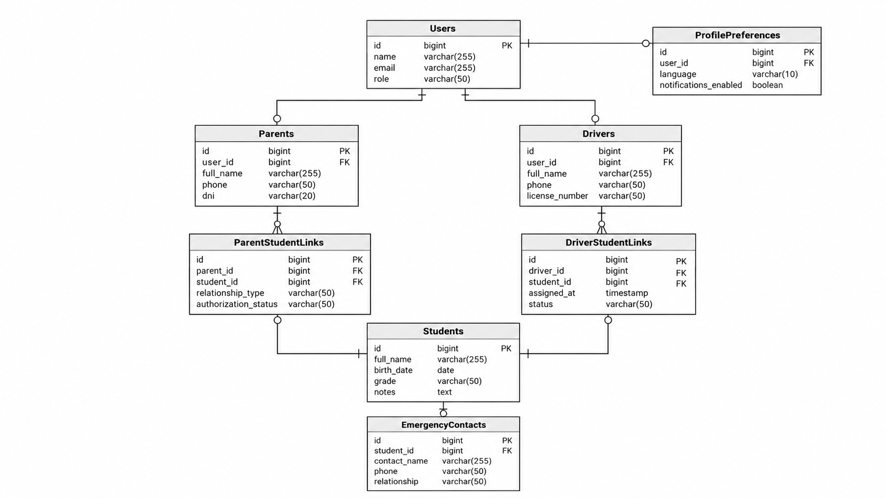

#### Vehicle & Credential Management

Este diagrama representa la persistencia de vehículos, asignaciones, documentos y credenciales asociadas al Driver. Las claves foráneas permiten mantener la relación con el conductor sin trasladar la responsabilidad del vehículo a otros Bounded Contexts.

  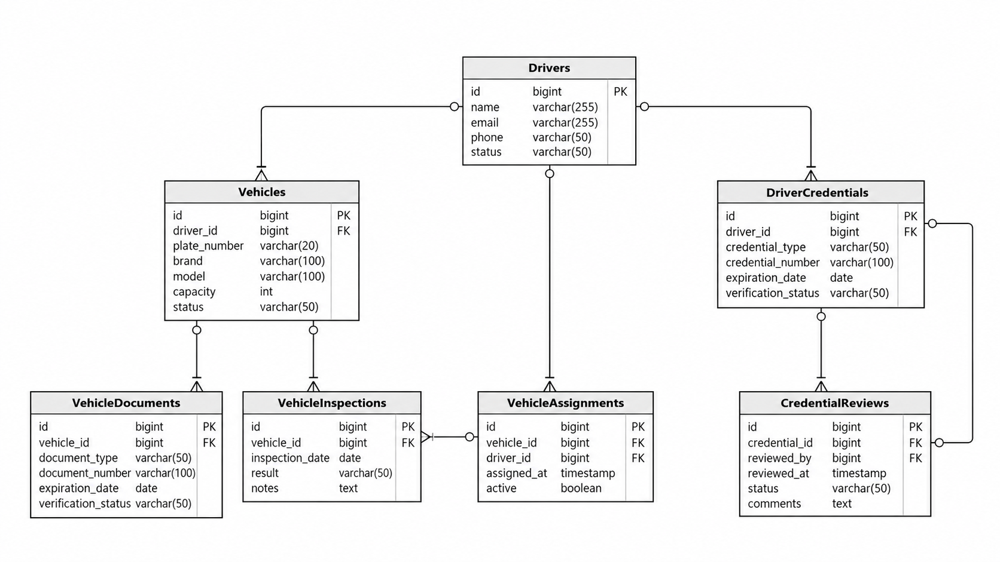

#### Route & Trip Planning

El modelo de datos de planificación mantiene rutas, paradas, estudiantes asignados y programación de viajes. Estas relaciones permiten conservar el orden de recorrido y preparar la información que utilizará posteriormente la ejecución del traslado.

  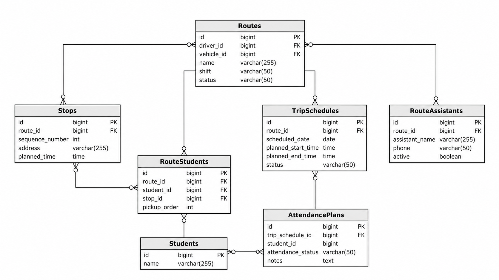

#### Trip Execution & Monitoring

Este esquema persiste los viajes ejecutados y los principales eventos generados durante el recorrido, incluyendo estados de estudiantes, recojos, entregas, entradas de línea de tiempo y registros complementarios de ubicación cuando correspondan.

  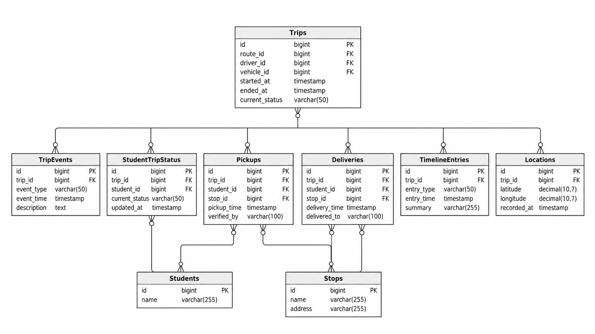

#### Incident & Delay Management

El diagrama separa la persistencia de retrasos e incidencias de la lógica de notificaciones. Incluye información del evento, estudiantes afectados, evidencia y acciones de resolución necesarias para conservar la trazabilidad de cada situación reportada.

  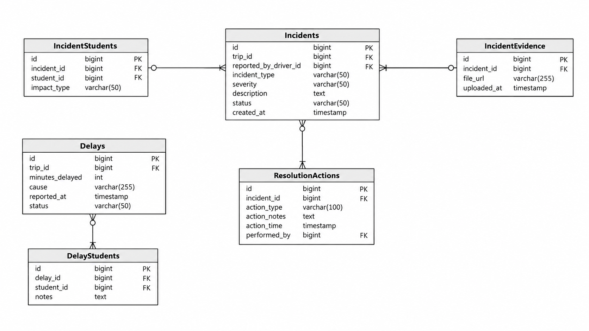

#### Notification Management

Este esquema administra notificaciones, destinatarios, preferencias, reglas de alerta y registros de entrega. Su propósito es persistir el ciclo de comunicación generado a partir de eventos del dominio sin duplicar los datos propios de rutas, viajes o incidencias.

  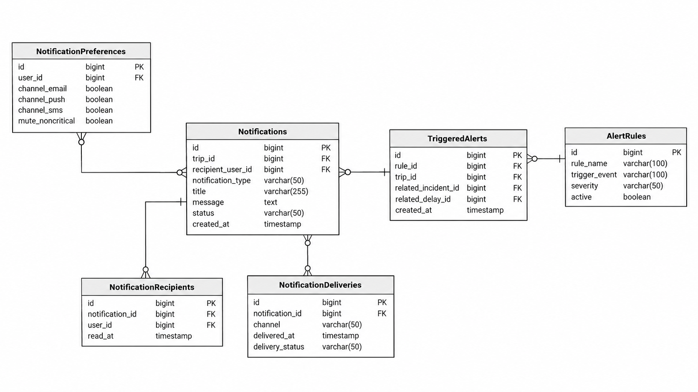

#### Subscriptions & Billing

El esquema comercial relaciona al Driver con un plan y con el estado de su suscripción. También representa entidades de facturación previstas por la arquitectura objetivo; para el alcance actual, la funcionalidad prioritaria continúa siendo la activación y consulta del estado de la suscripción.

  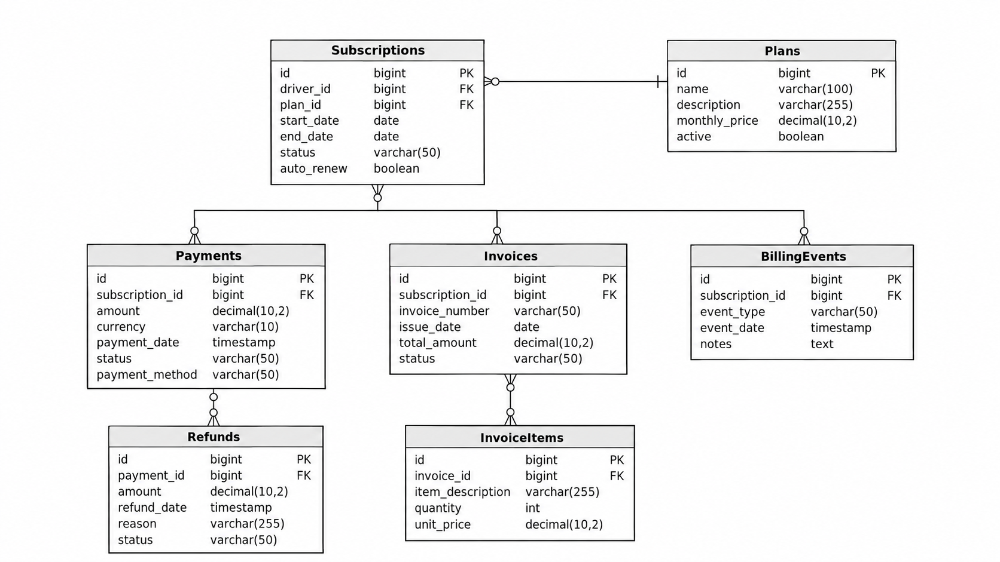

En conjunto, los ocho Database Diagrams mantienen correspondencia con los Bounded Contexts definidos en 4.6 y con los Class Diagrams de 4.7, conservando la separación de responsabilidades entre identidad, perfiles, vehículos, planificación, ejecución, incidencias, notificaciones y suscripciones.

---

# Capítulo V: Product Implementation, Validation & Deployment

En este capítulo se describe y evidencia el proceso de implementación, comprobación y despliegue de **Rumbo** para el alcance de TB1. La entrega consolida una nueva versión de la Landing Page y la primera versión integrada de la Frontend Web Application. El Frontend se encuentra construido con **Angular 21.2**, TypeScript 5.9 y Angular Material 21.2, organizado por Bounded Contexts y consumiendo Fake REST APIs. La lógica de negocio de servidor y los Web Services reales con Spring Boot quedan fuera del alcance de este Sprint.

Para mantener trazabilidad con el estado real de los repositorios, este capítulo distingue entre: (1) funcionalidades implementadas y fusionadas en GitHub, (2) servicios emulados con MockAPI o JSON Server local y (3) evidencias de despliegue que requieren una URL pública verificable. No se atribuyen como completadas actividades que todavía no cuentan con evidencia en los repositorios.

## 5.1. Software Configuration Management

### 5.1.1. Software Development Environment Configuration

Las herramientas utilizadas o previstas para el ciclo de vida de Rumbo son las siguientes:

| Tipo de actividad | Producto / herramienta | Uso en Rumbo | Tipo | Referencia |
|---|---|---|---|---|
| Project Management | Trello | Sprint Backlog, Tasks, estados y seguimiento del Sprint 2. | SaaS | https://trello.com |
| Requirements Management | GitHub Issues / Markdown | User Stories, criterios de aceptación y trazabilidad en el Project Report. | SaaS | https://github.com/AIpaca-OS |
| Product UX/UI Design | Figma | Wireframes, mock-ups y prototipos de la experiencia web. | SaaS | https://www.figma.com |
| Source Code Management | Git / GitHub | Repositorios, ramas, commits, Pull Requests, revisión e integración. | Local / SaaS | https://git-scm.com / https://github.com/AIpaca-OS |
| Frontend IDE | WebStorm / Visual Studio Code | Desarrollo y revisión de Angular, TypeScript, HTML y CSS. | Local | https://www.jetbrains.com/webstorm/ / https://code.visualstudio.com |
| Frontend Framework | Angular 21.2 / Angular CLI 21.2 | Single Page Application y routing por Bounded Context. | Open Source | https://angular.dev |
| UI Components | Angular Material 21.2 | Componentes de interfaz basados en Material Design. | Open Source | https://material.angular.dev |
| Language / Tooling | TypeScript 5.9 / npm 11.19 | Programación, tipado y gestión de dependencias. | Open Source | https://www.typescriptlang.org / https://www.npmjs.com |
| i18n | ngx-translate 18 | Recursos de internacionalización del Frontend. | Open Source | https://github.com/ngx-translate/core |
| Fake REST API | MockAPI | Persistencia emulada remota para vehículos, rutas, perfiles y suscripciones. | SaaS | https://mockapi.io |
| Fake REST API local | json-server 0.17.4 | Persistencia emulada local actualmente utilizada por alertas, notificaciones, incidencias y retrasos. | Open Source | https://www.npmjs.com/package/json-server |
| Frontend CI | GitHub Actions | Verificación automatizada de compilación del Frontend integrado. | SaaS | https://github.com/features/actions |
| Landing Deployment | GitHub Pages | Publicación de la Landing Page. | SaaS | https://pages.github.com |
| Backend (Sprint posterior) | IntelliJ IDEA / Java / Spring Boot / Spring Data JPA | Construcción futura de RESTful Web Services. No forma parte de TB1. | Local / Open Source | https://spring.io/projects/spring-boot |
| API Documentation (Sprint posterior) | OpenAPI / Swagger | Documentación futura de Web Services reales. | Open Standard / Open Source | https://www.openapis.org |
| Software Documentation | Markdown | Elaboración colaborativa del Project Report. | Open Standard | https://www.markdownguide.org |

El repositorio del Frontend confirma actualmente Angular 21.2.x, Angular Material 21.2.x, TypeScript 5.9.2, npm 11.19.0 y json-server 0.17.4. Por ello se elimina del Capítulo V la referencia anterior a Angular 18 como versión utilizada en TB1.

### 5.1.2. Source Code Management

La organización GitHub del equipo es **AIpaca-OS**. Los repositorios del producto son:

- **Project Report:** https://github.com/AIpaca-OS/project-report
- **Landing Page:** https://github.com/AIpaca-OS/landing-page
- **Frontend Web Application:** https://github.com/AIpaca-OS/frontend-web-application
- **Web Services:** https://github.com/AIpaca-OS/web-services

#### GitFlow aplicado

El flujo de integración adoptado es:

`feature/* → develop → main`

- `main`: rama estable destinada a versiones publicables.
- `develop`: rama de integración del trabajo del Sprint.
- `feature/*`: ramas de implementación por aspecto o Bounded Context.
- `fix/*`: ramas de integración/corrección cuando es necesario estabilizar el conjunto antes del merge.
- `release/*`: reservada para preparación de una release.
- `hotfix/*`: reservada para correcciones urgentes sobre una versión estable.

En el Frontend, la implementación real de TB1 se organizó en las siguientes ramas:

| Aspecto / Bounded Context | Feature branch | Responsable principal evidenciado |
|---|---|---|
| Vehicle & Credential Management | `feature/vehicle-credential-management` | Diana Pareja Caceres |
| Profiles & Relationship Management | `feature/profiles-and-relationship-management` | Alejandro Díaz Ramírez |
| Route & Trip Planning | `feature/route-trip-planning` | Leonardo Lino Quispe |
| Alerting & Incident Management | `feature/alerting-and-incident-management` | Alexandra Meza Soza |
| Subscriptions & Billing | `feature/subscriptions-and-billing` | Kevin Geronimo Puma |
| Integración TB1 | `fix/tb1-integration-complete` | Leonardo Lino Quispe |

Los Pull Requests #5, #6, #7 y #8 del repositorio Frontend fueron integrados en `develop`. El PR #7 consolidó los Bounded Contexts y correcciones compartidas sobre la línea de integración, mientras que el PR #8 preservó la trazabilidad de Route & Trip Planning.

#### Trazabilidad

La trazabilidad usada en este Sprint se documenta como:

**User Story → Work-items / Tasks → Feature Branch → Commits → Pull Request → develop**

No se crea una User Story para documentación. Las User Stories seleccionadas corresponden a funcionalidades de producto ya existentes en el Product Backlog y las Tasks representan trabajo técnico concreto.

#### Conventional Commits y Semantic Versioning

Los mensajes de commit utilizan, cuando corresponde, los prefijos `feat`, `fix`, `docs`, `refactor`, `test`, `style` y `chore`. Para releases se adopta Semantic Versioning con el formato `MAJOR.MINOR.PATCH`.

### 5.1.3. Source Code Style Guide & Conventions

Las convenciones se aplican con nomenclatura técnica en inglés.

#### HTML

- Uso de HTML semántico.
- Atributos `alt` para imágenes informativas.
- Atributos ARIA cuando el componente requiere información adicional de accesibilidad.
- Estructura y contenido separados de los estilos.
- Nombres de clases CSS en `kebab-case`.

#### CSS

- Selectores y clases descriptivos en inglés.
- Diseño responsive mediante breakpoints coherentes con la experiencia Desktop y Mobile.
- Evitar duplicación innecesaria de reglas.
- Mantener los estilos de cada vista dentro de su componente cuando corresponde al Frontend Angular.

#### TypeScript y Angular

- Clases y tipos en `PascalCase`.
- Variables, propiedades, funciones y métodos en `camelCase`.
- Constantes descriptivas y nombres en inglés.
- Bounded Contexts separados por responsabilidades de `domain`, `application`, `infrastructure` y `presentation`.
- Acceso HTTP encapsulado en clases de infraestructura y endpoints.
- Componentes y rutas organizados dentro del Bounded Context al que pertenecen.
- Uso de tipado explícito para entidades y respuestas relevantes.
- Uso de Angular Signals donde el contexto implementado requiere estado reactivo.
- Rutas de aplicación registradas mediante Angular Router y lazy loading cuando corresponde.

#### Gherkin

Los criterios de aceptación se redactan con escenarios comprobables usando la estructura **Given – When – Then**, sin introducir detalles de implementación en el requisito.

#### Java / Spring Boot

Para el Sprint en el que se implemente Web Services se utilizará Java con las convenciones indicadas por Google Java Style Guide y las prácticas de Spring Boot. Esta convención queda documentada desde TB1, pero no se presenta como implementación realizada en Sprint 2.

### 5.1.4. Software Deployment Configuration

#### Landing Page

La Landing Page se publica mediante GitHub Pages desde el repositorio `AIpaca-OS/landing-page`.

| Configuración | Valor |
|---|---|
| Repository | `AIpaca-OS/landing-page` |
| Branch publicada | `main` |
| Entry point | `index.html` |
| URL pública | https://aipaca-os.github.io/landing-page/ |

Durante TB1 se integró además la mejora **`feat: add product showcase to landing page`** mediante el PR #1 del Landing Page, incorporando una sección de producto, pantallas reales y ajustes responsive.

<!-- PENDIENTE IMAGEN C5-01: Captura de GitHub Pages mostrando la Landing Page publicada. -->
<!-- PENDIENTE IMAGEN C5-02: Captura de la Landing Page pública con la sección "Conoce Rumbo en acción". -->

#### Frontend Web Application

La primera versión integrada del Frontend se encuentra en la rama `develop` del repositorio `AIpaca-OS/frontend-web-application`, con sus Bounded Contexts integrados y workflow de CI para verificar la compilación.

Al cierre de esta corrección documental, el repositorio todavía mantiene `main` en una revisión anterior a la integración de TB1 y **no se ha verificado una URL pública de despliegue del Frontend**. Por ello este informe no declara un despliegue público inexistente. Antes de la entrega TB1 debe completarse `develop → main`, realizar el despliegue y sustituir esta nota por la URL pública y su evidencia.

<!-- PENDIENTE IMAGEN C5-03: Captura del deployment exitoso del Frontend cuando exista. -->
<!-- PENDIENTE IMAGEN C5-04: Captura del Frontend funcionando desde su URL pública, no localhost. -->

## 5.2. Landing Page, Services & Applications Implementation

Para TB1 el trabajo implementado se divide en:

- **Sprint 1:** Landing Page pública.
- **Sprint 2:** primera versión de la Frontend Web Application con CRUD por Bounded Context y Fake REST APIs.
- **Sprint posterior:** lógica de negocio de servidor y RESTful Web Services con Spring Boot.

No se atribuye a Sprint 2 lógica de negocio compleja ni un backend Spring Boot. Los recursos MockAPI y JSON Server utilizados en TB1 son mecanismos de persistencia emulada para el Frontend.

### 5.2.1. Sprint 1

Sprint 1 se concentra únicamente en la **Landing Page**. Las User Stories de back-end etiquetadas como **Developer (TS01–TS08)** no pertenecen a este Sprint ni al Sprint 2; se reservan para **Sprint 3**. El **Sprint 2** se concentra en el Frontend Web Application, implementando CRUD con Angular y Fake REST APIs. La integración con Spring Boot queda fuera del alcance de TB1.

La implementación actual de la Landing Page se traza contra las User Stories definidas en el Capítulo III del proyecto. De esta forma, cada bloque implementado queda asociado a una historia y se evita mantener funcionalidades sin trazabilidad.

### 5.2.1.1. Sprint Planning 1

En esta sección se registran los principales acuerdos del Sprint Planning Meeting de Sprint 1 utilizando la estructura indicada en el Final Project Statement.

<table>
  <tbody>
    <tr><th>Sprint #</th><td>Sprint 1</td></tr>
    <tr><th colspan="2">Sprint Planning Background</th></tr>
    <tr><td colspan="2">Primera iteración de implementación del producto. El alcance se concentra en la Landing Page pública de Rumbo.</td></tr>
    <tr><th>Date</th><td>2026-09-09</td></tr>
    <tr><th>Time</th><td>No registrado en la evidencia disponible.</td></tr>
    <tr><th>Location</th><td>No registrado en la evidencia disponible.</td></tr>
    <tr><th>Prepared By</th><td>Lino Quispe, Leonardo Miguel</td></tr>
    <tr><th>Attendees (to planning meeting)</th><td>Díaz Ramírez, Alejandro / Geronimo Puma, Kevin Joel / Lino Quispe, Leonardo Miguel / Meza Soza, Alexandra Yamile / Pareja Caceres, Diana</td></tr>
    <tr><th>Sprint 0 Review Summary</th><td>No aplica.</td></tr>
    <tr><th>Sprint 0 Retrospective Summary</th><td>No aplica.</td></tr>
    <tr><th colspan="2">Sprint Goal &amp; User Stories</th></tr>
    <tr><th>Sprint 1 Goal</th><td>Our focus is on publishing the first responsive Landing Page that clearly communicates Rumbo's value proposition and guides both target segments to their next action. We believe it delivers clear product understanding and a direct entry point to parents/tutors and school transport drivers. This will be confirmed when the five committed Landing Page User Stories satisfy their Acceptance Criteria and the site is publicly accessible on Desktop and Mobile Web Browser.</td></tr>
    <tr><th>Sprint 1 Velocity</th><td>8 Story Points</td></tr>
    <tr><th>Sum of Story Points</th><td>8 Story Points</td></tr>
  </tbody>
</table>

La equivalencia usada para la estimación es la indicada por el docente: **1 SP ≈ 1–2 días de trabajo** y **8 SP ≈ un Sprint completo de dos semanas**. Los Story Points no se calculan sumando horas de forma directa; las horas se utilizan para dimensionar las Tasks y comprobar que ninguna supere aproximadamente 8 horas.

#### 5.2.1.2. Aspect Leaders and Collaborators

La Leadership-and-Collaboration Matrix (LACX) identifica para cada aspecto del alcance del Sprint quién actúa como Leader (L) y quiénes participan como Collaborators (C). La asignación mantiene relación con las Tasks del Sprint Backlog.

<table>
  <thead>
    <tr>
      <th>Team Member (Last Name, First Name)</th>
      <th>GitHub Username</th>
      <th>Project Report / Chapter V Leader (L) / Collaborator (C)</th>
      <th>Research &amp; Interviews Leader (L) / Collaborator (C)</th>
      <th>Landing Page UX/UI Leader (L) / Collaborator (C)</th>
      <th>Landing Page Development Leader (L) / Collaborator (C)</th>
      <th>Requirements &amp; Product Design Leader (L) / Collaborator (C)</th>
      <th>Deployment &amp; Evidence Leader (L) / Collaborator (C)</th>
    </tr>
  </thead>
  <tbody>
    <tr><td>Díaz Ramírez, Alejandro</td><td>aleedr</td><td>C</td><td>C</td><td>L</td><td>C</td><td>C</td><td>—</td></tr>
    <tr><td>Geronimo Puma, Kevin Joel</td><td>qebim18</td><td>C</td><td>C</td><td>C</td><td>L</td><td>C</td><td>C</td></tr>
    <tr><td>Lino Quispe, Leonardo Miguel</td><td>linolw</td><td>L</td><td>C</td><td>—</td><td>—</td><td>C</td><td>L</td></tr>
    <tr><td>Meza Soza, Alexandra Yamile</td><td>AlexandraYMS</td><td>C</td><td>L</td><td>—</td><td>—</td><td>C</td><td>—</td></tr>
    <tr><td>Pareja Caceres, Diana</td><td>DianaParejaCaceres</td><td>C</td><td>C</td><td>—</td><td>—</td><td>L</td><td>—</td></tr>
  </tbody>
</table>

### 5.2.1.3. Sprint Backlog 1

El objetivo del Sprint 1 es implementar y desplegar la primera versión responsive de la Landing Page de Rumbo. El Board público del Sprint se encuentra en:

**Sprint Board público:** https://trello.com/b/pZTeSjRE/rumbo-sprint-1

> Antes de la entrega se debe reemplazar esta nota por una captura actualizada del Board que muestre las mismas User Stories, Tasks y estados de la tabla.

<table>
<thead>
<tr>
<th>Sprint #</th>
<th colspan="7">Sprint 1</th>
</tr>
<tr>
<th colspan="2">User Story</th>
<th colspan="6">Work-Item / Task</th>
</tr>
<tr>
<th>Story Id</th>
<th>Story Title</th>
<th>Task Id</th>
<th>Task Title</th>
<th>Task Description</th>
<th>Estimation (Hours)</th>
<th>Assigned To</th>
<th>Status (To-do / In-Process / To-Review / Done)</th>
</tr>
</thead>
<tbody>
<tr><td rowspan="4">US31</td><td rowspan="4">Conocer la propuesta de valor de Rumbo</td><td>T01</td><td>Implement hero section</td><td>Construir la sección Hero con propuesta de valor, contenido principal y CTA general de la Landing Page.</td><td>6</td><td>Kevin Geronimo</td><td>Done</td></tr>
<tr><td>T02</td><td>Implement service explanation</td><td>Construir la sección que explica el funcionamiento de Rumbo y los principales hitos del servicio.</td><td>6</td><td>Alejandro Díaz</td><td>Done</td></tr>
<tr><td>T03</td><td>Implement supporting content</td><td>Implementar indicadores, testimonios y contenido complementario que refuerza la propuesta de valor.</td><td>5</td><td>Alejandro Díaz</td><td>Done</td></tr>
<tr><td>T04</td><td>Implement responsive navigation</td><td>Implementar navegación desktop/mobile, menú responsive, accesibilidad básica y ajustes de visualización.</td><td>5</td><td>Kevin Geronimo</td><td>Done</td></tr>
<tr><td rowspan="4">US32</td><td rowspan="4">Identificar los beneficios de mi segmento e ingresar a Rumbo</td><td>T05</td><td>Structure segment benefits</td><td>Organizar el contenido para diferenciar beneficios de padres/tutores y conductores.</td><td>6</td><td>Alejandro Díaz</td><td>In-Process</td></tr>
<tr><td>T06</td><td>Implement segment benefit sections</td><td>Implementar visualmente las secciones de beneficios correspondientes a cada segmento.</td><td>5</td><td>Kevin Geronimo</td><td>In-Process</td></tr>
<tr><td>T07</td><td>Implement segment CTAs</td><td>Implementar acciones diferenciadas de ingreso o registro para padre/tutor y conductor.</td><td>5</td><td>Kevin Geronimo</td><td>To-do</td></tr>
<tr><td>T08</td><td>Connect CTAs to Web App</td><td>Enlazar los CTA de cada segmento con la vista correspondiente del Frontend Web Application cuando se encuentre disponible.</td><td>4</td><td>Alejandro Díaz</td><td>To-do</td></tr>
<tr><td rowspan="3">US33</td><td rowspan="3">Consultar el contenido en inglés o español</td><td>T09</td><td>Prepare English content</td><td>Preparar la versión en_US del contenido público manteniéndola como idioma predeterminado.</td><td>4</td><td>Kevin Geronimo</td><td>To-do</td></tr>
<tr><td>T10</td><td>Prepare Latin American Spanish content</td><td>Preparar la versión es_419 del contenido equivalente de la Landing Page.</td><td>4</td><td>Alejandro Díaz</td><td>To-do</td></tr>
<tr><td>T11</td><td>Implement language selection</td><td>Implementar selector de idioma y persistencia de la preferencia durante la sesión.</td><td>4</td><td>Kevin Geronimo</td><td>To-do</td></tr>
<tr><td rowspan="3">US34</td><td rowspan="3">Consultar los documentos legales del servicio</td><td>T12</td><td>Implement Terms of Service</td><td>Crear la vista o contenido navegable de Terms of Service.</td><td>4</td><td>Kevin Geronimo</td><td>To-do</td></tr>
<tr><td>T13</td><td>Implement Privacy Policy</td><td>Crear la vista o contenido navegable de Privacy Policy, incluyendo el tratamiento de datos relevante para Rumbo.</td><td>4</td><td>Alejandro Díaz</td><td>To-do</td></tr>
<tr><td>T14</td><td>Integrate legal navigation</td><td>Enlazar Terms of Service y Privacy Policy desde el footer y verificar su acceso desde la Landing Page.</td><td>4</td><td>Kevin Geronimo</td><td>To-do</td></tr>
<tr><td rowspan="5">US35</td><td rowspan="5">Resolver dudas antes de usar Rumbo</td><td>T15</td><td>Implement FAQ content</td><td>Construir la sección de preguntas frecuentes con contenido relacionado con ambos segmentos.</td><td>5</td><td>Alejandro Díaz</td><td>Done</td></tr>
<tr><td>T16</td><td>Implement FAQ interaction</td><td>Implementar el comportamiento de acordeón y su interacción mediante JavaScript.</td><td>4</td><td>Alejandro Díaz</td><td>Done</td></tr>
<tr><td>T17</td><td>Implement contact form UI</td><td>Construir el formulario público de contacto con sus campos obligatorios.</td><td>4</td><td>Kevin Geronimo</td><td>To-do</td></tr>
<tr><td>T18</td><td>Implement contact validation</td><td>Implementar validaciones de campos obligatorios y mensajes de error del formulario.</td><td>4</td><td>Kevin Geronimo</td><td>To-do</td></tr>
<tr><td>T19</td><td>Implement submission feedback</td><td>Implementar la confirmación visual del registro de una consulta válida.</td><td>4</td><td>Alejandro Díaz</td><td>To-do</td></tr>
<tr><td>N/A</td><td>General Sprint Constraint</td><td>S01</td><td>Publicar Landing Page</td><td>Publicar la Landing Page mediante GitHub Pages y verificar la URL pública.</td><td>3</td><td>Leonardo Lino / Kevin Geronimo</td><td>Done</td></tr>
<tr><td>N/A</td><td>General Sprint Constraint</td><td>S02</td><td>Registrar evidencias de Sprint 1</td><td>Registrar evidencias Desktop/Mobile, commits y deployment correspondientes al Sprint.</td><td>4</td><td>Leonardo Lino</td><td>In-Process</td></tr>
</tbody>
</table>

Todas las User Stories del Sprint cumplen la regla indicada por el docente de **mínimo dos Tasks por User Story**. Ninguna Task supera las 8 horas. Las Tasks S01 y S02 corresponden a constraints generales del Sprint y no generan Story Points.

#### 5.2.1.4. Development Evidence for Sprint Review

La evidencia histórica de Sprint 1 se mantiene en el repositorio `landing-page`. Para TB1 se agregó una nueva mejora al Landing Page, integrada mediante Pull Request.

| Repository | Branch | Commit Id | Commit Message | Commit Message Body | Committed on |
|---|---|---|---|---|---|
| `AIpaca-OS/landing-page` | `main` | `826939d` | Subir archivos de la landing page | Primera carga funcional de la Landing Page. | 15/09/2026 |
| `AIpaca-OS/landing-page` | `main` | `6efdfc3` | feat: redesign landing page | Rediseño de la experiencia visual. | 16/09/2026 |
| `AIpaca-OS/landing-page` | `main` | `a418118` | feat: implement javascript | Interacciones de navegación y comportamiento JavaScript. | 17/09/2026 |
| `AIpaca-OS/landing-page` | `feat/improve-landing-page` | `3a19190` | feat: add product showcase to landing page | Sección "Conoce Rumbo en acción", carrusel de pantallas y ajustes responsive. | 06/10/2026 |
| `AIpaca-OS/landing-page` | `main` | `ad4b4d2` | Merge pull request #1 from AIpaca-OS/feat/improve-landing-page | Integración de la mejora del Landing Page en main. | 06/10/2026 |

### 5.2.1.5. Execution Evidence for Sprint Review

La Landing Page debe evidenciarse desde su URL pública y en sus vistas Desktop y Mobile.

**URL pública:** https://aipaca-os.github.io/landing-page/

<!-- PENDIENTE IMAGEN C5-S1-01: Landing Page TB1 en Desktop mostrando Hero y la nueva sección de producto. -->
<!-- PENDIENTE IMAGEN C5-S1-02: Landing Page TB1 en Mobile mostrando navegación responsive. -->

### 5.2.1.6. Services Documentation Evidence for Sprint Review

Sprint 1 no incluye Web Services. La Landing Page utiliza HTML, CSS y JavaScript y no requiere documentación OpenAPI para este alcance.

### 5.2.1.7. Software Deployment Evidence for Sprint Review

La Landing Page continúa publicada mediante GitHub Pages. El PR #1 de TB1 fue integrado en `main`, por lo que la evidencia debe mostrar la versión actual y no capturas antiguas de AV1.

<!-- PENDIENTE IMAGEN C5-S1-03: GitHub Pages / Actions o Settings mostrando el deployment vigente. -->
<!-- PENDIENTE IMAGEN C5-S1-04: Navegador mostrando la URL pública y la versión actual. -->

### 5.2.1.8. Team Collaboration Insights during Sprint

Para Sprint 1 deben insertarse capturas reales de GitHub y no gráficos recreados:

- Commits: https://github.com/AIpaca-OS/landing-page/commits/main/
- Contributors: https://github.com/AIpaca-OS/landing-page/graphs/contributors
- Network: https://github.com/AIpaca-OS/landing-page/network
- Pull Request TB1 de mejora: https://github.com/AIpaca-OS/landing-page/pull/1

<!-- PENDIENTE IMAGEN C5-S1-05: Commits de landing-page. -->
<!-- PENDIENTE IMAGEN C5-S1-06: Contributors de landing-page. -->
<!-- PENDIENTE IMAGEN C5-S1-07: Network o PR #1 mostrando la integración de la mejora. -->

### 5.2.2. Sprint 2

Sprint 2 corresponde a la primera versión integrada de la **Frontend Web Application**. El producto se implementa como SPA Angular, organizado por Bounded Contexts y con persistencia emulada. El Sprint no incorpora Web Services reales con Spring Boot.

Los aspectos implementados y visibles en el repositorio son:

- Vehicle & Credential Management.
- Profiles & Relationship Management.
- Route & Trip Planning.
- Alerting & Incident Management.
- Subscriptions & Billing.

#### 5.2.2.1. Sprint Planning 2

| Campo | Información |
|---|---|
| Sprint # | Sprint 2 |
| Sprint Planning Background | Construcción de la primera versión integrada del Frontend Web Application mediante CRUD por Bounded Context y Fake REST APIs. |
| Date | No existe una fecha de Sprint Planning verificable en los repositorios consultados. |
| Time | No existe una hora de Sprint Planning verificable en los repositorios consultados. |
| Location | No existe una ubicación de Sprint Planning verificable en los repositorios consultados. |
| Prepared By | No se atribuye sin evidencia verificable. |
| Attendees | Equipo AIpaca: Alejandro Díaz, Kevin Geronimo, Leonardo Lino, Alexandra Meza y Diana Pareja. |
| Sprint 1 Review Summary | Landing Page implementada y publicada. Para TB1 se incorporó una nueva sección de producto mediante PR #1. |
| Sprint 1 Retrospective Summary | La evidencia histórica mostró integración directa a `main` en Sprint 1; para Sprint 2 se utilizaron feature branches, `develop` y Pull Requests. |
| Sprint 2 Goal | **Our focus is on delivering the first integrated CRUD-based Frontend Web Application for Rumbo. We believe it delivers a usable operational workspace for the target users while validating the frontend architecture by Bounded Context. This will be confirmed when the committed CRUD views build successfully, navigate from the Angular application and persist data through the configured Fake REST APIs.** |
| Sprint 2 Velocity | No existe un valor de Velocity previo verificable en las evidencias consultadas; no se inventa retrospectivamente. |
| Sum of Story Points | **34 Story Points**, correspondientes a US02 (5), US06 (5), US09 (8), US10 (8), US24 (5) y US29 (3). |

Las User Stories anteriores son historias ya existentes en el Product Backlog. Se seleccionan aquí porque cuentan con evidencia directa en las vistas e infraestructura implementadas durante Sprint 2.

#### 5.2.2.2. Aspect Leaders and Collaborators

La matriz LACX se alinea con las ramas y contribuciones observables del repositorio.

| Team Member | GitHub Username evidenciado | Vehicle & Credential | Profiles & Relationship | Route & Trip Planning | Alerting & Incident | Subscriptions & Billing | Integration / Shared |
|---|---|---:|---:|---:|---:|---:|---:|
| Díaz Ramírez, Alejandro | `aleedr` | — | **L** | — | — | — | — |
| Geronimo Puma, Kevin Joel | `qebim` / `qebim18` | — | — | — | — | **L** | — |
| Lino Quispe, Leonardo Miguel | `linolw` | — | C | **L** | C | C | **L** |
| Meza Soza, Alexandra Yamile | `AlexandraYMS` | C | — | — | **L** | — | C |
| Pareja Caceres, Diana | `DianaParejaCaceres` | **L** | — | — | — | — | — |

La colaboración marcada con **C** se limita a integraciones o correcciones que sí aparecen en el historial; no se atribuyen participaciones no evidenciadas.

#### 5.2.2.3. Sprint Backlog 2

**Artefacto Sprint 2:** https://trello.com/invite/b/6ac5acfc155988c2635f74d2/ATTId0178f5a35fe74259c89e878a2dd299c9794CD75/rumbo-sprint-2

El Final Project Statement exige que la captura del Board y el URL público sean coherentes con la tabla. El enlace disponible actualmente es un enlace de invitación; antes de la entrega debe reemplazarse por el URL público del Board si Trello dispone de uno.

<!-- PENDIENTE IMAGEN C5-S2-01: Captura completa y legible del Board de Trello de Sprint 2. -->

| Story Id | Story Title | SP | Task Id | Task Title / Description | Estimation (Hours) | Assigned To | Status |
|---|---|---:|---|---|---:|---|---|
| US02 | Registrar vehículo y credenciales del servicio | 5 | T20 | Definir entidad y contratos de Vehicle. | 5 | Diana Pareja | Done |
| US02 | Registrar vehículo y credenciales del servicio | 5 | T21 | Implementar infraestructura HTTP, assembler y endpoints. | 6 | Diana Pareja | Done |
| US02 | Registrar vehículo y credenciales del servicio | 5 | T22 | Implementar store reactivo con Angular Signals. | 5 | Diana Pareja | Done |
| US02 | Registrar vehículo y credenciales del servicio | 5 | T23 | Implementar lista, formulario y routing de Vehicle. | 7 | Diana Pareja | Done |
| US06 | Registrar estudiante y vincularse como tutor | 5 | T24 | Implementar dominio y endpoints de estudiantes/perfiles. | N/R | Alejandro Díaz | Done |
| US06 | Registrar estudiante y vincularse como tutor | 5 | T25 | Implementar lista y formulario de estudiantes e integración del contexto. | N/R | Alejandro Díaz | Done |
| US09 | Activar la suscripción del conductor | 8 | T26 | Implementar modelos y endpoints de Plans y Subscriptions en MockAPI. | N/R | Kevin Geronimo | Done |
| US09 | Activar la suscripción del conductor | 8 | T27 | Implementar store, listado de planes, formulario y listado de suscripciones. | N/R | Kevin Geronimo | Done |
| US10 | Crear una ruta con sus paradas | 8 | T28 | Definir modelo Route e infraestructura MockAPI. | 5 | Leonardo Lino | Done |
| US10 | Crear una ruta con sus paradas | 8 | T29 | Implementar store reactivo y acceso a datos de rutas. | 6 | Leonardo Lino | Done |
| US10 | Crear una ruta con sus paradas | 8 | T30 | Implementar Route List, Route Form y routing. | 6 | Leonardo Lino | Done |
| US24 | Registrar una incidencia | 5 | T31 | Definir entidades y contratos de Incident / Delay. | 5 | Alexandra Meza | Done |
| US24 | Registrar una incidencia | 5 | T32 | Implementar API/store para incidencias y retrasos. | 5 | Alexandra Meza | Done |
| US24 | Registrar una incidencia | 5 | T33 | Implementar formularios y Quick Actions. | 6 | Alexandra Meza | Done |
| US29 | Configurar las preferencias de notificación | 3 | T34 | Implementar modelos y API de Notifications / Settings. | 4 | Alexandra Meza | Done |
| US29 | Configurar las preferencias de notificación | 3 | T35 | Implementar store y dashboard de notificaciones. | 6 | Alexandra Meza | Done |
| N/A | Integración general del Sprint | — | T36 | Integrar Bounded Contexts, corregir routing/i18n/HttpClient y agregar CI de build. | N/R | Leonardo Lino | Done |

**N/R = no registrado en la evidencia disponible.** Las horas de T24, T25, T26, T27 y T36 deben copiarse desde el Sprint Board o registro real del equipo; no se estiman retrospectivamente en el informe.

#### 5.2.2.4. Development Evidence for Sprint Review

El repositorio `frontend-web-application` conserva evidencia de implementación por ramas, autores y merges.

| Repository | Branch | Commit Id | Commit Message | Commit Message Body / alcance | Committed on |
|---|---|---|---|---|---|
| `frontend-web-application` | `feature/vehicle-credential-management` | `2363ba3` | feat(vehicles): add vehicle domain entity with getters and setters | Entidad de dominio Vehicle. | 06/10/2026 |
| `frontend-web-application` | `feature/vehicle-credential-management` | `9377ef3` | feat(vehicles): implement vehicles infrastructure with endpoint, assembler and response types | Infraestructura REST emulada. | 06/10/2026 |
| `frontend-web-application` | `feature/vehicle-credential-management` | `838a86d` | feat(vehicles): add vehicle list, form components and child routing | CRUD UI y rutas del contexto. | 06/10/2026 |
| `frontend-web-application` | `feature/vehicle-credential-management` | `8f7def8` | feat(vehicles): point vehicles endpoint to mockapi cloud service | Conexión del recurso Vehicles a MockAPI. | 06/10/2026 |
| `frontend-web-application` | `feature/profiles-and-relationship-management` | `504e9f1` | feat: add profiles and relationship management endpoints | Endpoints del contexto. | 06/10/2026 |
| `frontend-web-application` | `feature/profiles-and-relationship-management` | `8131857` | feat: add profiles and relationship management application | Integración de la aplicación del contexto. | 06/10/2026 |
| `frontend-web-application` | `feature/subscriptions-and-billing` | `9d6dd7c` | feat: add subscriptions and billing CRUD with MockAPI | CRUD de planes y suscripciones conectado a MockAPI. | 06/10/2026 |
| `frontend-web-application` | `feature/route-trip-planning` | `082e0cd` | feat(route-trip-planning): add domain and MockAPI infrastructure | Dominio e infraestructura de rutas. | 06/10/2026 |
| `frontend-web-application` | `feature/route-trip-planning` | `c98c377` | feat(route-trip-planning): add reactive route store | Estado reactivo para rutas. | 06/10/2026 |
| `frontend-web-application` | `feature/route-trip-planning` | `e9e46b8` | feat(route-trip-planning): add route CRUD views | Vistas CRUD de rutas. | 06/10/2026 |
| `frontend-web-application` | `feature/alerting-and-incident-management` | `6b4e4f3` | feat(alerting): add alerting store and related components | Store y componentes de alertas. | 05/10/2026 |
| `frontend-web-application` | `feature/alerting-and-incident-management` | `e14be45` | feat(incidents): add incidents and delays registration components | Formularios de incidencias y retrasos. | 06/10/2026 |
| `frontend-web-application` | `develop` | `2522fe3` | merge: preserve feature branch history for TB1 integration | Preserva historial de Route & Trip Planning durante la integración. | 06/10/2026 |
| `frontend-web-application` | `develop` | `fca70db` | merge: integrate TB1 frontend CRUD bounded contexts | Integración de CRUDs y correcciones compartidas. | 06/10/2026 |
| `frontend-web-application` | `develop` | `27ce0a3` | feat(alerting): implement notification settings endpoint | Completa el endpoint de settings utilizado por Alerting. | 06/10/2026 |

Pull Requests relevantes:

- PR #5: `feature/alerting-and-incident-management → develop`.
- PR #6: `feature/vehicle-credential-management → develop`.
- PR #7: integración de CRUDs TB1 mediante `fix/tb1-integration-complete → develop`.
- PR #8: integración de Route & Trip Planning preservando la historia de la feature.

#### 5.2.2.5. Execution Evidence for Sprint Review

La aplicación se ejecuta desde el código integrado de `develop`. Las siguientes vistas deben documentarse mediante capturas reales del producto ejecutándose:

1. **Vehicle & Credential Management:** listado, creación y edición de vehículos.
2. **Profiles & Relationship Management:** listado y formulario de estudiantes.
3. **Route & Trip Planning:** listado y formulario CRUD de rutas.
4. **Alerting & Incident Management:** dashboard de notificaciones, configuración y formularios de incidentes/retrasos.
5. **Subscriptions & Billing:** planes, formulario de suscripción y listado de suscripciones.
6. **Responsive Web Design:** al menos una vista representativa en Mobile.

<!-- PENDIENTE IMAGEN C5-S2-02: Vehicle List + Vehicle Form. -->
<!-- PENDIENTE IMAGEN C5-S2-03: Student List + Student Form. -->
<!-- PENDIENTE IMAGEN C5-S2-04: Route List + Route Form. -->
<!-- PENDIENTE IMAGEN C5-S2-05: Notification Dashboard / Settings. -->
<!-- PENDIENTE IMAGEN C5-S2-06: Incident o Delay Form. -->
<!-- PENDIENTE IMAGEN C5-S2-07: Plans / Subscriptions CRUD. -->
<!-- PENDIENTE IMAGEN C5-S2-08: Una vista representativa en Mobile. -->

**Video de navegación del Sprint 2:** debe mostrar las principales rutas del Frontend y operaciones CRUD incluidas en el Sprint.

#### 5.2.2.6. Services Documentation Evidence for Sprint Review

Sprint 2 no implementa Web Services reales con Spring Boot ni documentación Swagger/OpenAPI. La evidencia de esta sección corresponde a los **Fake REST APIs consumidos por el Frontend**, que permiten comprobar las operaciones CRUD antes de la implementación del backend.

| Aspecto / recurso | Base URL / Endpoint | Operaciones soportadas en el cliente | Estado |
|---|---|---|---|
| Vehicles | `https://6ac59b2c54a61668c5f745e7.mockapi.io/api/v1/vehicles` | GET collection/item, POST, PUT, DELETE | MockAPI remoto |
| Routes | `https://6ac5a99754a61668c5f74d74.mockapi.io/api/v1/routes` | GET collection/item, POST, PUT, DELETE | MockAPI remoto |
| Plans | `https://6ac54a6d54a61668c5f7141c.mockapi.io/api/v1/plans` | GET collection/item, POST, PUT, DELETE | MockAPI remoto |
| Subscriptions | `https://6ac54a6d54a61668c5f7141c.mockapi.io/api/v1/subscriptions` | GET collection/item, POST, PUT, DELETE | MockAPI remoto |
| Students | `https://6ac53c3d54a61668c5f700f2.mockapi.io/api/v1/students` | GET collection/item, POST, PUT, DELETE | MockAPI remoto |
| Profiles | `https://6ac53c3d54a61668c5f700f2.mockapi.io/api/v1/profiles` | GET collection/item, POST, PUT, DELETE | MockAPI remoto |
| Tutor-student relationships | `https://6ac54f4854a61668c5f718ab.mockapi.io/api/v1/tutor-student-relationships` | GET collection/item, POST, PUT, DELETE | MockAPI remoto |
| Data-deletion requests | `https://6ac54f4854a61668c5f718ab.mockapi.io/api/v1/data-deletion-requests` | GET collection/item, POST, PUT, DELETE | MockAPI remoto |
| Notifications | `http://localhost:3000/api/v1/notifications` | GET collection/item, POST, PUT, DELETE | JSON Server local |
| Notification settings | `http://localhost:3000/api/v1/notificationSettings` | GET, PUT | JSON Server local |
| Incidents | `http://localhost:3000/api/v1/incidents` | GET collection/item, POST, PUT, DELETE | JSON Server local |
| Delays | `http://localhost:3000/api/v1/delays` | GET collection/item, POST, PUT, DELETE | JSON Server local |

La URL de Route & Trip Planning utilizada en este capítulo es la indicada para el proyecto: **https://6ac5a99754a61668c5f74d74.mockapi.io/api/v1/**.

La configuración actual del código todavía mantiene Alerting/Incident en `localhost:3000`. Esto debe considerarse al desplegar el Frontend: una aplicación pública no podrá consumir el JSON Server local del equipo. La migración de esos cuatro recursos a una URL accesible públicamente o la sustitución por el backend real deberá realizarse fuera de esta corrección documental.

<!-- PENDIENTE IMAGEN C5-S2-09: MockAPI de Vehicles mostrando registros. -->
<!-- PENDIENTE IMAGEN C5-S2-10: MockAPI de Routes mostrando el recurso routes. -->
<!-- PENDIENTE IMAGEN C5-S2-11: MockAPI de Profiles/Students o Billing mostrando datos de ejemplo. -->
<!-- PENDIENTE IMAGEN C5-S2-12: JSON Server local mostrando Notifications/Incidents, solo como evidencia de Sprint 2. -->

#### 5.2.2.7. Software Deployment Evidence for Sprint Review

**Landing Page:** se encuentra publicada en GitHub Pages y fue actualizada para TB1.

**Frontend Web Application:** el código de Sprint 2 fue integrado en `develop` y cuenta con verificación de compilación mediante GitHub Actions. Sin embargo, al cierre de esta actualización documental no existe una URL pública verificable del Frontend y `main` todavía no contiene la integración completa de TB1.

Por tanto, para cerrar este requisito de TB1 falta:

1. Integrar la revisión estable de `develop` hacia `main`.
2. Configurar el hosting del Frontend.
3. Resolver el consumo de recursos que aún apuntan a `localhost:3000`.
4. Registrar la URL pública.
5. Insertar capturas del deployment y de la aplicación pública.

<!-- PENDIENTE IMAGEN C5-S2-13: GitHub Actions con build exitoso del Frontend. -->
<!-- PENDIENTE IMAGEN C5-S2-14: Configuración del proveedor de deployment. -->
<!-- PENDIENTE IMAGEN C5-S2-15: Frontend abierto desde URL pública. -->

#### 5.2.2.8. Team Collaboration Insights during Sprint

La colaboración del Sprint 2 debe evidenciarse con capturas reales de GitHub:

- Commits: https://github.com/AIpaca-OS/frontend-web-application/commits/develop
- Contributors: https://github.com/AIpaca-OS/frontend-web-application/graphs/contributors
- Network: https://github.com/AIpaca-OS/frontend-web-application/network
- Pull Requests: https://github.com/AIpaca-OS/frontend-web-application/pulls?q=is%3Apr+is%3Aclosed

La evidencia del repositorio permite identificar contribuciones de los cinco integrantes en las ramas y commits del Sprint, además de los merges de integración mediante Pull Requests.

<!-- PENDIENTE IMAGEN C5-S2-16: Commits de develop mostrando autores del equipo. -->
<!-- PENDIENTE IMAGEN C5-S2-17: Contributors del Frontend. -->
<!-- PENDIENTE IMAGEN C5-S2-18: Network del Frontend. -->
<!-- PENDIENTE IMAGEN C5-S2-19: Pull Requests #5, #6, #7 y #8 cerrados/merged. -->

# Conclusiones

- La problemática de Rumbo se sustenta en un contexto real de transporte escolar formal, alta congestión urbana y elevada conectividad móvil en Lima Metropolitana.

- Los dos segmentos iniciales del proyecto son padres/tutores y conductores de movilidad escolar; las entrevistas de AV1 permitirán validar o corregir los supuestos planteados.

- Para AV1, la implementación se concentra en la primera versión de la Landing Page, que ya se encuentra implementada y desplegada mediante GitHub Pages. Angular y Spring Boot quedan definidos para los productos que se desarrollarán progresivamente en los siguientes Sprints.

# Bibliografía

[1] Autoridad de Transporte Urbano para Lima y Callao. (2026, 10 de enero). *Vacaciones útiles seguras: ATU exhorta a padres de familia a usar movilidades escolares autorizadas*.

[2] TomTom. (2026). *TomTom Traffic Index 2025: Lima, Peru*.

[3] Observatorio Nacional de Seguridad Vial. (2026). *Estadísticas de siniestralidad vial 2025*.

[4] Instituto Nacional de Estadística e Informática. (2026, 26 de marzo). *El 98,4% de los hogares de Lima Metropolitana contó con telefonía móvil durante el cuarto trimestre de 2025*.

[5] Elitech. (2026). *School Bus Tracker* (Versión 2.4) [Software]. https://schoolbustrackerapp.com/

[6] Logrit Dynamics SAS. (2025). *Bus esCool* (Versión 6.5.2) [Aplicación móvil]. App Store. https://apps.apple.com/pe/app/bus-escool/id1020568046

[7] Meta Platforms. (2026). *WhatsApp Messenger* (Versión 2.26) [Aplicación móvil]. Google Play Store. https://play.google.com/store/apps/details?id=com.whatsapp

- Comparabien. (2025, 22 de abril). [¿Cuánto se gana en movilidad escolar? Guía para emprendedores](https://comparabien.com.pe/blog-consejos/cuanto-gana-movilidad-escolar-guia-emprendedores).
- El Comercio. (2026, 26 de febrero). [Lima en el top 5 de ciudades con peor tráfico a nivel mundial](https://elcomercio.pe/lima/sucesos/lima-en-el-top-5-de-ciudades-con-peor-trafico-a-nivel-mundial-mas-de-8-dias-al-ano-atrapados-en-el-trafico-vehicular-tomtom-traffic-index-ultimas-noticia/).
- Energiminas. (2026, 7 de agosto). [Lima sigue siendo una de las ciudades latinoamericanas con menor velocidad de circulación](https://energiminas.com/2026/08/07/lima-sigue-siendo-una-de-las-ciudades-latinoamericanas-con-menor-velocidad-de-circulacion/).
- Escobedo, C. (2024). [Se publica el nuevo reglamento de protección de datos personales en Perú](https://iapp.org/news/a/se-publica-el-nuevo-reglamento-de-protecci-n-de-datos-personales-en-per-/). International Association of Privacy Professionals.
- Expreso. (2026, 1 de junio). [WhatsApp y Yape lideran el uso digital en Perú, según Erestel 2025](https://www.expreso.com.pe/actualidad/whatsapp-y-yape-lideran-el-uso-digital-en-peru-segun-erestel-2025-noticia/1291271).
- Gothelf, J., & Seiden, J. *Lean UX: Designing Great Products with Agile Teams*.
- Infobae. (2026, 10 de enero). [Movilidad escolar para el inicio de clases 2026: así puedes identificar vehículos autorizados por la ATU](https://www.infobae.com/peru/2026/01/10/movilidad-escolar-para-el-inicio-de-clases-2026-asi-puedes-identificar-vehiculos-autorizados-por-la-atu/).

- Angular: https://angular.dev/
- Angular Material: https://material.angular.dev/
- Spring Boot: https://spring.io/projects/spring-boot
- Spring Data JPA: https://spring.io/projects/spring-data-jpa
- OpenAPI: https://www.openapis.org/

---

# Anexos

## Videos de Exposición
**Microsoft Stream:** [Completar]

## Entrevistas de Needfinding
**Microsoft Stream:** [Completar]

## Navegación del Prototipo
**Microsoft Stream:** [Completar]

## Enlaces del proyecto
- https://github.com/AIpaca-OS/project-report
- https://github.com/AIpaca-OS/landing-page
- https://github.com/AIpaca-OS/frontend-web-application
- https://github.com/AIpaca-OS/web-services
